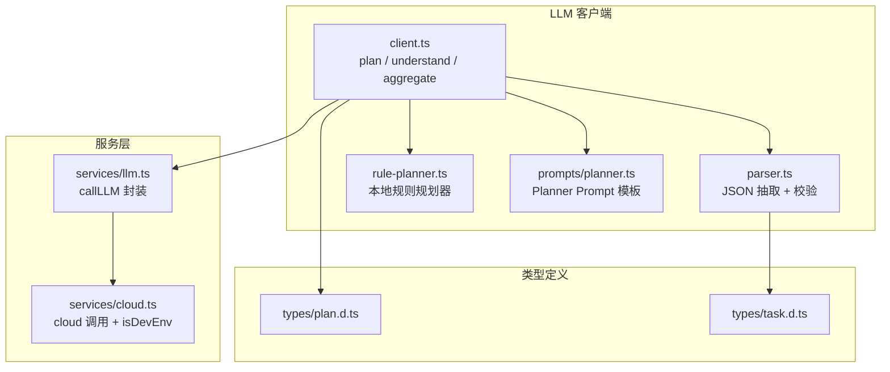
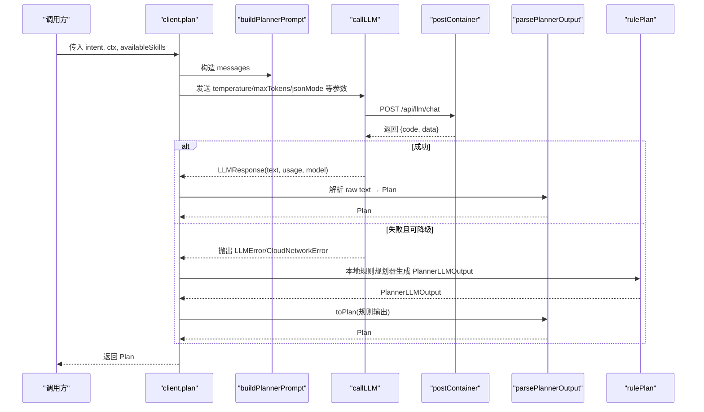
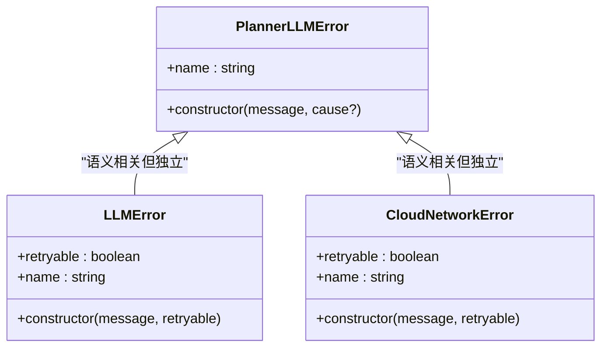
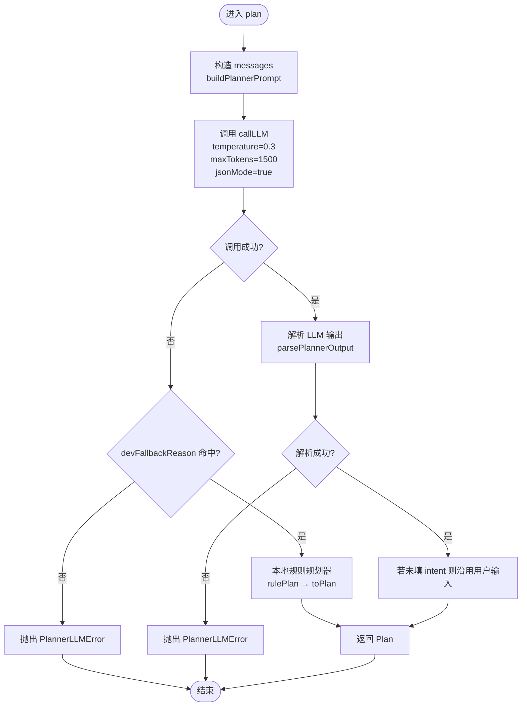
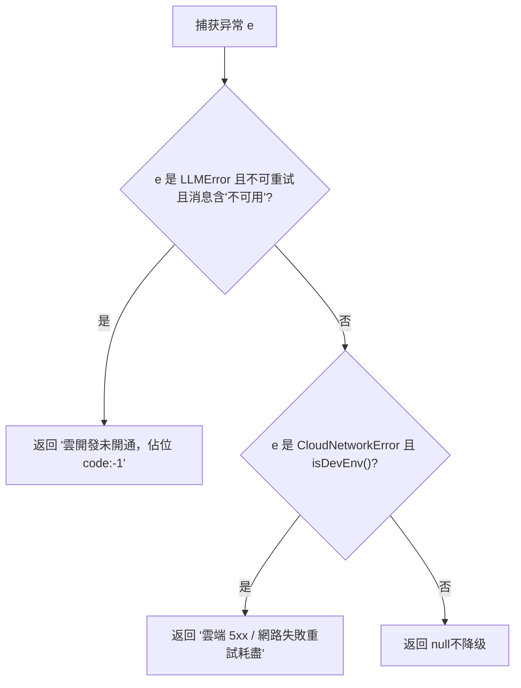
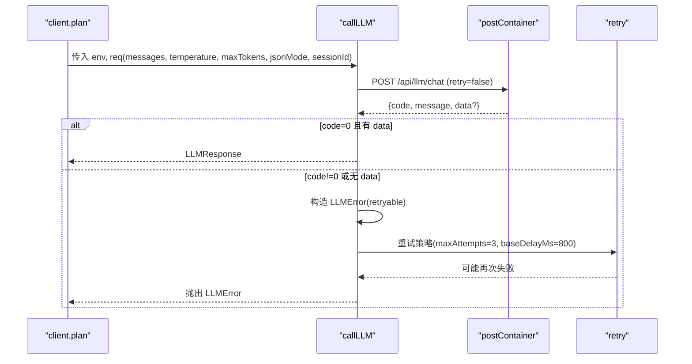
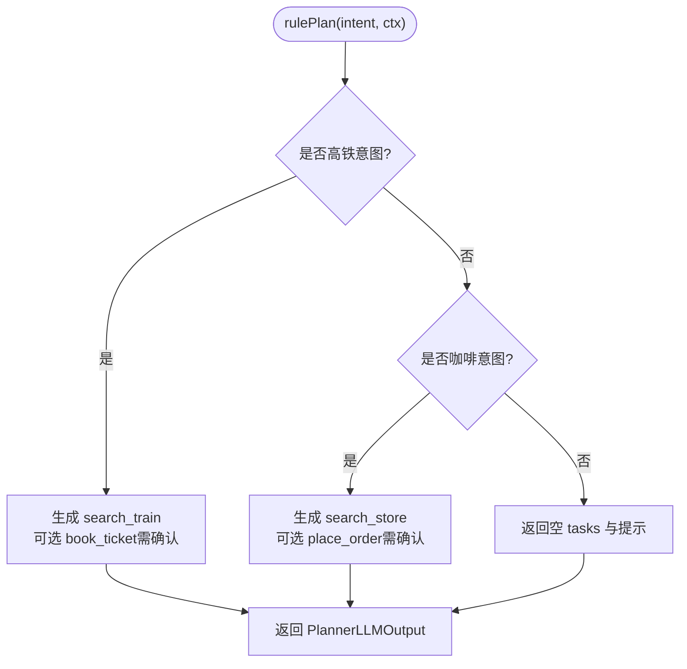
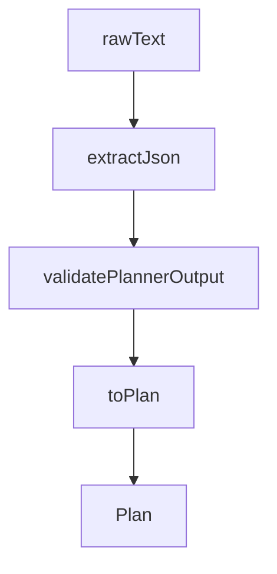
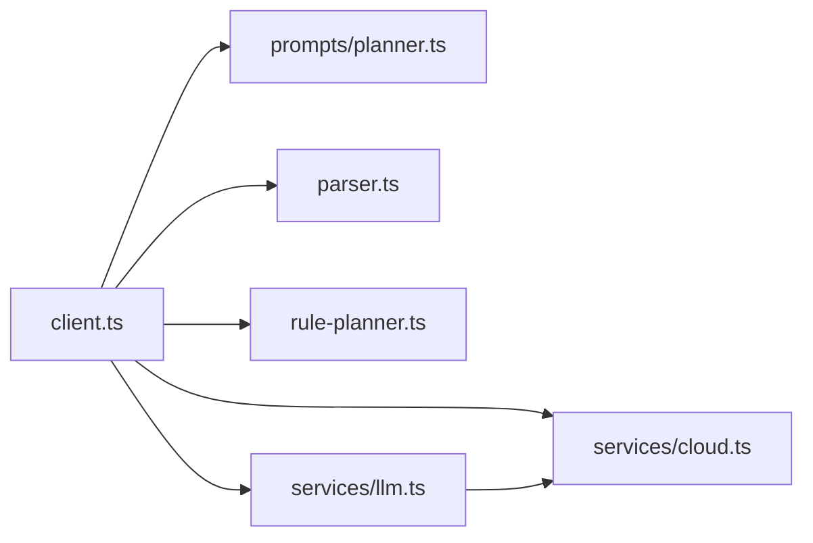

# LLM客户端

<cite>
**本文引用的文件**   
- [client.ts](file://miniprogram/src/llm/client.ts)
- [rule-planner.ts](file://miniprogram/src/llm/rule-planner.ts)
- [parser.ts](file://miniprogram/src/llm/parser.ts)
- [planner.ts](file://miniprogram/src/llm/prompts/planner.ts)
- [llm.ts](file://miniprogram/src/services/llm.ts)
- [cloud.ts](file://miniprogram/src/services/cloud.ts)
- [plan.d.ts](file://miniprogram/src/types/plan.d.ts)
- [task.d.ts](file://miniprogram/src/types/task.d.ts)
</cite>

## 目录
1. [简介](#简介)
2. [项目结构](#项目结构)
3. [核心组件](#核心组件)
4. [架构总览](#架构总览)
5. [详细组件分析](#详细组件分析)
6. [依赖关系分析](#依赖关系分析)
7. [性能与优化](#性能与优化)
8. [故障排查指南](#故障排查指南)
9. [结论](#结论)
10. [附录：集成与使用模式](#附录集成与使用模式)

## 简介
本技术文档聚焦 WAIC-WeChat-MiniProgram 的 LLM 客户端模块，围绕以下目标展开：
- 说明 PlannerLLMError 错误类的实现与异常处理机制。
- 解释 plan 函数的完整流程：意图理解、任务规划、Plan 生成与降级回退。
- 详解 devFallbackReason 降级机制：开发环境检测与云端不可用时的本地规则规划器回退策略。
- 介绍 callLLM 服务封装：请求参数（temperature、maxTokens、jsonMode 等）与响应处理。
- 说明 understand 与 aggregate 的简化实现及其在 AI Agent 工作流中的作用。
- 提供实际代码示例路径与使用模式，指导如何接入不同 LLM 提供商并进行性能优化。

## 项目结构
LLM 客户端位于 miniprogram/src/llm 下，并与 services 层和 types 类型定义紧密协作：
- llm/client.ts：对外暴露 plan、understand、aggregate，并实现降级逻辑。
- llm/parser.ts：解析 LLM 输出为 Plan，包含 JSON 抽取与 schema 校验。
- llm/rule-planner.ts：开发模式下的本地规则式规划器，生成与 LLM 同构的输出。
- llm/prompts/planner.ts：构造 Planner 的系统提示与用户消息。
- services/llm.ts：统一封装云端 LLM 调用、重试与错误分类。
- services/cloud.ts：微信云容器调用封装、超时、重试与环境判定。
- types/plan.d.ts、types/task.d.ts：Plan 与 Task 的类型定义。

图示来源
- [client.ts:56-120](file://miniprogram/src/llm/client.ts#L56-L120)
- [parser.ts:40-122](file://miniprogram/src/llm/parser.ts#L40-L122)
- [rule-planner.ts:82-164](file://miniprogram/src/llm/rule-planner.ts#L82-L164)
- [planner.ts:23-51](file://miniprogram/src/llm/prompts/planner.ts#L23-L51)
- [llm.ts:57-83](file://miniprogram/src/services/llm.ts#L57-L83)
- [cloud.ts:64-149](file://miniprogram/src/services/cloud.ts#L64-L149)

章节来源
- [client.ts:1-153](file://miniprogram/src/llm/client.ts#L1-L153)
- [parser.ts:1-127](file://miniprogram/src/llm/parser.ts#L1-L127)
- [rule-planner.ts:1-165](file://miniprogram/src/llm/rule-planner.ts#L1-L165)
- [planner.ts:1-129](file://miniprogram/src/llm/prompts/planner.ts#L1-L129)
- [llm.ts:1-83](file://miniprogram/src/services/llm.ts#L1-L83)
- [cloud.ts:1-223](file://miniprogram/src/services/cloud.ts#L1-L223)
- [plan.d.ts:1-51](file://miniprogram/src/types/plan.d.ts#L1-L51)
- [task.d.ts:1-59](file://miniprogram/src/types/task.d.ts#L1-L59)

## 核心组件
- PlannerLLMError：用于标记 LLM 调用失败的自定义错误，便于上层捕获与区分。
- plan：核心编排函数，负责构建 Prompt、调用 LLM、解析输出、降级回退与结果兜底。
- devFallbackReason：判断是否触发开发环境降级的原因提取器。
- rulePlan：本地规则规划器，按关键词匹配生成与 LLM 同构的任务计划。
- parsePlannerOutput / toPlan：将 LLM 原始文本解析为 Plan，并补齐字段。
- callLLM：封装云端 LLM 调用，含重试、错误分类与用量统计。
- understand / aggregate：MVP 阶段的简化实现，分别用于意图识别与结果聚合。

章节来源
- [client.ts:20-25](file://miniprogram/src/llm/client.ts#L20-L25)
- [client.ts:56-120](file://miniprogram/src/llm/client.ts#L56-L120)
- [client.ts:128-153](file://miniprogram/src/llm/client.ts#L128-L153)
- [parser.ts:18-23](file://miniprogram/src/llm/parser.ts#L18-L23)
- [parser.ts:90-122](file://miniprogram/src/llm/parser.ts#L90-L122)
- [llm.ts:47-54](file://miniprogram/src/services/llm.ts#L47-L54)
- [llm.ts:57-83](file://miniprogram/src/services/llm.ts#L57-L83)

## 架构总览
LLM 客户端通过分层设计解耦了“意图理解—任务规划—执行调度—结果聚合”的流程。核心交互如下：

图示来源
- [client.ts:56-120](file://miniprogram/src/llm/client.ts#L56-L120)
- [llm.ts:57-83](file://miniprogram/src/services/llm.ts#L57-L83)
- [cloud.ts:64-149](file://miniprogram/src/services/cloud.ts#L64-L149)
- [parser.ts:118-122](file://miniprogram/src/llm/parser.ts#L118-L122)
- [rule-planner.ts:82-164](file://miniprogram/src/llm/rule-planner.ts#L82-L164)

## 详细组件分析

### PlannerLLMError 与异常处理机制
- PlannerLLMError 继承自 Error，name 固定为 'PlannerLLMError'，用于包装 LLM 调用失败或解析失败等场景，便于上层统一捕获与展示。
- 在 plan 中，若 LLM 调用失败且不符合降级条件，则抛出 PlannerLLMError；若解析失败，同样抛出该错误并附带原始文本片段以便调试。
- LLMError 与 CloudNetworkError 由底层服务层抛出，分别表示业务侧 LLM 错误与网络侧错误，并在 callLLM 中根据状态码决定是否可重试。

图示来源
- [client.ts:20-25](file://miniprogram/src/llm/client.ts#L20-L25)
- [llm.ts:47-54](file://miniprogram/src/services/llm.ts#L47-L54)
- [cloud.ts:46-53](file://miniprogram/src/services/cloud.ts#L46-L53)

章节来源
- [client.ts:83-99](file://miniprogram/src/llm/client.ts#L83-L99)
- [client.ts:106-115](file://miniprogram/src/llm/client.ts#L106-L115)
- [llm.ts:70-74](file://miniprogram/src/services/llm.ts#L70-L74)
- [cloud.ts:99-118](file://miniprogram/src/services/cloud.ts#L99-L118)

### plan 函数核心逻辑
plan 是 LLM 客户端的核心入口，主要步骤包括：
1. 构建 Prompt：通过 buildPlannerPrompt 组装 system 与 user 消息，注入用户意图、上下文与可用技能简表。
2. 调用 LLM：设置 temperature=0.3、maxTokens=1500、jsonMode=true，并携带 sessionId 进行埋点关联。
3. 降级回退：若调用失败且满足 devFallbackReason 条件，则切换到本地规则规划器 rulePlan，并通过 toPlan 转换为标准 Plan。
4. 解析与验证：使用 parsePlannerOutput 抽取 JSON、校验 schema，再转为 Plan；若解析失败抛出 PlannerLLMError。
5. 兜底填充：若 LLM 未回填 intent，则沿用用户输入；最终返回 Plan。

图示来源
- [client.ts:56-120](file://miniprogram/src/llm/client.ts#L56-L120)
- [planner.ts:23-51](file://miniprogram/src/llm/prompts/planner.ts#L23-L51)
- [parser.ts:118-122](file://miniprogram/src/llm/parser.ts#L118-L122)
- [rule-planner.ts:82-164](file://miniprogram/src/llm/rule-planner.ts#L82-L164)

章节来源
- [client.ts:56-120](file://miniprogram/src/llm/client.ts#L56-L120)

### devFallbackReason 降级机制
devFallbackReason 用于判断是否触发开发环境降级，支持两类触发路径：
- LLMError：当错误不可重试且消息中包含“不可用”，通常对应云端未开通或占位 code:-1。
- CloudNetworkError：仅在开发环境（isDevEnv() 为真）时触发，对应云端 5xx 或网络失败且重试耗尽。

降级策略：
- 记录 warn 日志，修正 LLM 调用计数（避免误计）。
- 调用 rulePlan 生成 PlannerLLMOutput，再通过 toPlan 转换为 Plan。
- 在 release 环境不触发降级，保持严格失败语义，避免真实 LLM 故障被静默掩盖。

图示来源
- [client.ts:37-45](file://miniprogram/src/llm/client.ts#L37-L45)
- [cloud.ts:172-182](file://miniprogram/src/services/cloud.ts#L172-L182)

章节来源
- [client.ts:37-45](file://miniprogram/src/llm/client.ts#L37-L45)
- [cloud.ts:172-182](file://miniprogram/src/services/cloud.ts#L172-L182)

### callLLM 服务封装
callLLM 对云端 LLM 代理进行统一封装：
- 请求参数：
  - model：可选，后端决定具体模型。
  - messages：对话历史数组。
  - temperature：温度，任务型建议 0.3。
  - maxTokens：最大输出 token。
  - jsonMode：要求 JSON 模式，后端切换模型。
  - sessionId：会话 ID，用于埋点关联。
- 响应处理：
  - 返回 LLMResponse，包含 text、usage（prompt/completion/total tokens）、model。
  - 若 res.code !== 0 或无 data，抛出 LLMError，并根据 code 标记是否可重试（如 429、503）。
- 重试策略：
  - 外层使用 retry 工具，最多 3 次重试，基础延迟 800ms。
  - shouldRetry 仅对 LLMError 的可重试错误生效，避免嵌套放大（postContainer 已关闭内部重试）。

图示来源
- [llm.ts:57-83](file://miniprogram/src/services/llm.ts#L57-L83)
- [cloud.ts:209-223](file://miniprogram/src/services/cloud.ts#L209-L223)

章节来源
- [llm.ts:14-45](file://miniprogram/src/services/llm.ts#L14-L45)
- [llm.ts:57-83](file://miniprogram/src/services/llm.ts#L57-L83)

### understand 与 aggregate 的简化实现
- understand：MVP 阶段直接返回 { kind: 'ok' }，不做复杂 NLU；后续可扩展为调用 LLM 做意图分类。
- aggregate：将 Plan 中的成功任务汇总为人类可读消息，若无成功任务则返回空结果提示。

作用：
- understand 作为 AI Agent 工作流的“理解阶段”，当前为直通模式，降低复杂度。
- aggregate 作为“聚合阶段”，将结构化任务结果转化为自然语言反馈，提升用户体验。

章节来源
- [client.ts:128-134](file://miniprogram/src/llm/client.ts#L128-L134)
- [client.ts:142-153](file://miniprogram/src/llm/client.ts#L142-L153)

### 本地规则规划器 rulePlan
rulePlan 以关键词匹配的方式生成与 LLM Planner 同构的 PlannerLLMOutput：
- 高铁购票场景：
  - 识别“高[铁鐵]|动[车車]|火[车車]|[车車][次票]|12306”等关键词。
  - 抽取出发/到达城市、日期、座席类型，生成 search_train 任务；若存在购买意图，追加 book_ticket 任务并依赖前一步结果。
- 星巴克点单场景：
  - 识别“星巴克|咖啡|拿[铁鐵]|美式|摩卡”等关键词。
  - 从用户位置取城市，生成 search_store 任务；若存在购买意图，追加 place_order 任务并依赖门店查询结果。
- 无法识别时返回空 tasks 与提示信息。

图示来源
- [rule-planner.ts:82-164](file://miniprogram/src/llm/rule-planner.ts#L82-L164)

章节来源
- [rule-planner.ts:1-165](file://miniprogram/src/llm/rule-planner.ts#L1-L165)

### Parser 与 Plan 转换
- extractJson：优先尝试 Markdown 包裹的 JSON，其次尝试首个 JSON 对象，失败抛出 LLMParserError。
- validatePlannerOutput：校验 tasks 数组及每个 task 的 skillId、action、input、dependsOn 等必填字段。
- toPlan：将 PlannerLLMOutput 转换为标准 Plan，补齐 id、status、summary 等字段。
- parsePlannerOutput：组合上述步骤，完成 raw text → Plan 的完整流水线。

图示来源
- [parser.ts:40-60](file://miniprogram/src/llm/parser.ts#L40-L60)
- [parser.ts:63-87](file://miniprogram/src/llm/parser.ts#L63-L87)
- [parser.ts:90-122](file://miniprogram/src/llm/parser.ts#L90-L122)

章节来源
- [parser.ts:1-127](file://miniprogram/src/llm/parser.ts#L1-L127)

## 依赖关系分析
LLM 客户端的依赖方向遵循单向原则，避免反向耦合：
- client.ts 依赖 prompts、parser、rule-planner、services/llm、services/cloud、utils/logger、utils/idgen、types/plan、types/context、types/skill。
- services/llm.ts 依赖 services/cloud、utils/retry、utils/logger。
- services/cloud.ts 依赖 utils/retry、utils/logger，并提供 isDevEnv 供上层判断。

图示来源
- [client.ts:9-18](file://miniprogram/src/llm/client.ts#L9-L18)
- [llm.ts:10-12](file://miniprogram/src/services/llm.ts#L10-L12)
- [cloud.ts:13-14](file://miniprogram/src/services/cloud.ts#L13-L14)

章节来源
- [client.ts:9-18](file://miniprogram/src/llm/client.ts#L9-L18)
- [llm.ts:10-12](file://miniprogram/src/services/llm.ts#L10-L12)
- [cloud.ts:13-14](file://miniprogram/src/services/cloud.ts#L13-L14)

## 性能与优化
- 控制 LLM 输出长度：通过 maxTokens 限制输出规模，减少 token 消耗与解析开销。
- 降低随机性：temperature=0.3 适合任务型规划，提高稳定性与可预测性。
- JSON 模式：启用 jsonMode 让后端选择更稳定的模型，提升结构化输出质量。
- 重试策略：callLLM 使用 3 次重试与指数退避，避免瞬时抖动导致失败；同时避免与 cloud 层重试叠加造成放大效应。
- 开发环境降级：在开发/体验环境下允许本地规则规划器回退，保证全链路演示不受云端可用性影响。
- 日志与埋点：记录 LLM 调用耗时与 token 用量，便于监控与优化。

[本节为通用性能讨论，不涉及具体文件分析]

## 故障排查指南
- LLM 调用失败：
  - 检查 LLMError 的 retryable 标志与 message，确认是否为 429/503 等可重试错误。
  - 查看 callLLM 的重试日志，确认是否达到最大重试次数。
- 云端不可用：
  - 在开发环境，cloud.ts 会将 wx.cloud.callContainer 不可用归一为 code:-1，便于降级。
  - 若 release 环境出现 5xx 或网络失败，应保留严格失败语义，避免静默降级。
- 解析失败：
  - 检查 LLM 输出是否符合 JSON 结构，必要时在日志中打印原始文本片段。
  - 确保 prompt 模板明确要求 JSON 输出，避免多余文字干扰。
- 降级触发：
  - 确认 isDevEnv() 的判断结果，了解是否在开发/体验环境。
  - 查看 devFallbackReason 返回的原因，定位是云端未开通还是网络问题。

章节来源
- [llm.ts:70-74](file://miniprogram/src/services/llm.ts#L70-L74)
- [cloud.ts:99-118](file://miniprogram/src/services/cloud.ts#L99-L118)
- [client.ts:83-99](file://miniprogram/src/llm/client.ts#L83-L99)
- [client.ts:106-115](file://miniprogram/src/llm/client.ts#L106-L115)
- [cloud.ts:172-182](file://miniprogram/src/services/cloud.ts#L172-L182)

## 结论
LLM 客户端模块通过清晰的职责划分与稳健的降级策略，实现了从意图理解到任务规划的完整闭环。PlannerLLMError 提供了统一的异常标识，plan 函数串联了 Prompt 构建、LLM 调用、解析验证与降级回退，callLLM 封装了云端调用与重试逻辑，understand 与 aggregate 在当前 MVP 阶段提供简化实现。整体架构在保证功能完备的同时，兼顾了开发与生产环境的差异，具备良好的可维护性与扩展性。

[本节为总结性内容，不涉及具体文件分析]

## 附录：集成与使用模式
- 接入不同 LLM 提供商：
  - 通过 services/llm.ts 的 callLLM 统一转发到多家 LLM（如 DeepSeek、混元、Kimi），无需在小程序端暴露 API Key。
  - 在后端根据 model 字段选择具体提供商，前端仅需传递 messages、temperature、maxTokens、jsonMode 等参数。
- 性能优化建议：
  - 合理设置 temperature 与 maxTokens，平衡创造性与稳定性。
  - 启用 jsonMode 提升结构化输出质量。
  - 利用 isDevEnv 与 devFallbackReason 在开发环境快速验证，生产环境保持严格失败语义。
- 使用模式示例（路径引用）：
  - 调用 plan 生成 Plan：[client.ts:56-120](file://miniprogram/src/llm/client.ts#L56-L120)
  - 构造 Planner Prompt：[planner.ts:23-51](file://miniprogram/src/llm/prompts/planner.ts#L23-L51)
  - 解析 LLM 输出：[parser.ts:118-122](file://miniprogram/src/llm/parser.ts#L118-L122)
  - 本地规则规划器：[rule-planner.ts:82-164](file://miniprogram/src/llm/rule-planner.ts#L82-L164)
  - 云端 LLM 调用封装：[llm.ts:57-83](file://miniprogram/src/services/llm.ts#L57-L83)
  - 开发环境检测：[cloud.ts:172-182](file://miniprogram/src/services/cloud.ts#L172-L182)

章节来源
- [client.ts:56-120](file://miniprogram/src/llm/client.ts#L56-L120)
- [planner.ts:23-51](file://miniprogram/src/llm/prompts/planner.ts#L23-L51)
- [parser.ts:118-122](file://miniprogram/src/llm/parser.ts#L118-L122)
- [rule-planner.ts:82-164](file://miniprogram/src/llm/rule-planner.ts#L82-L164)
- [llm.ts:57-83](file://miniprogram/src/services/llm.ts#L57-L83)
- [cloud.ts:172-182](file://miniprogram/src/services/cloud.ts#L172-L182)