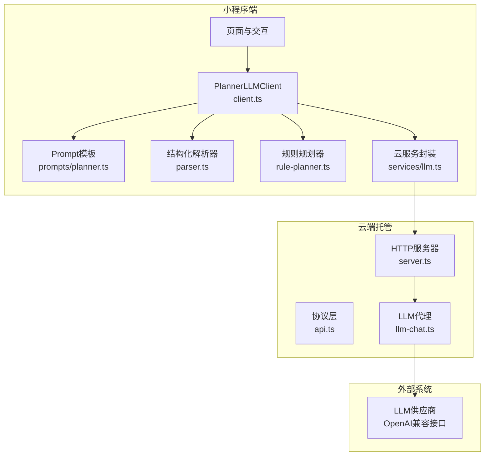
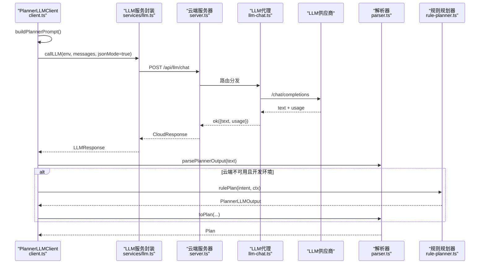
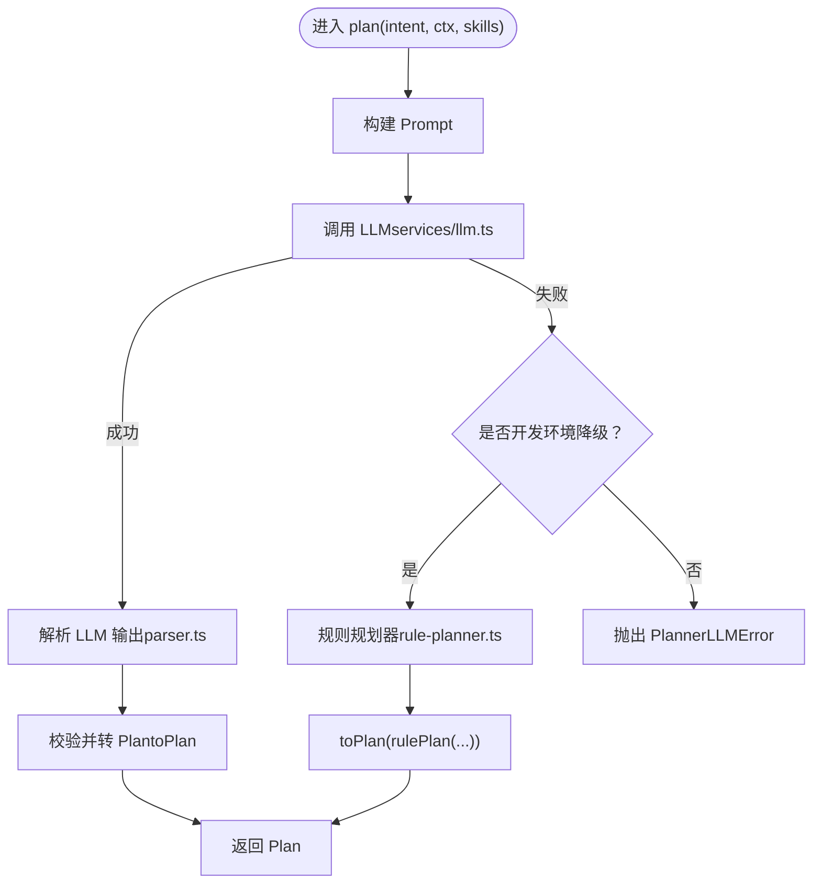
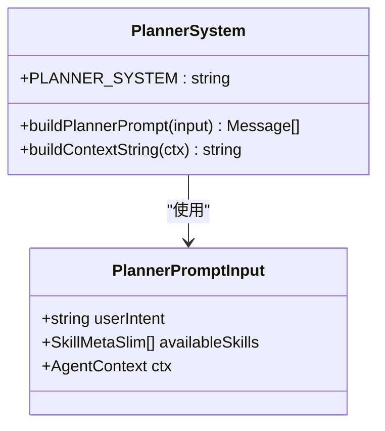
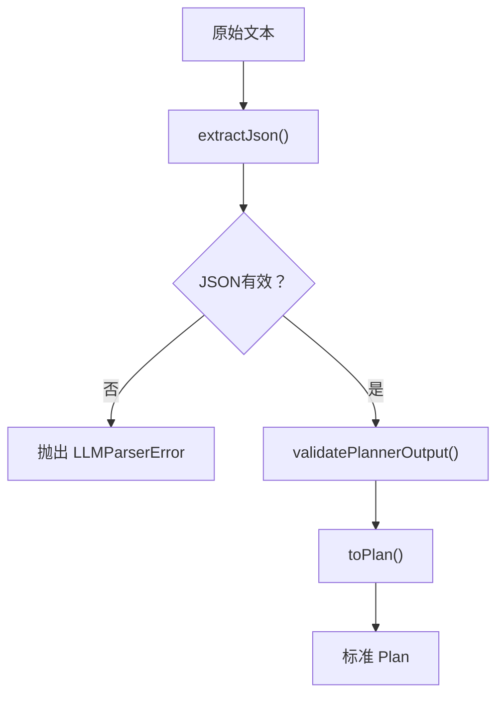
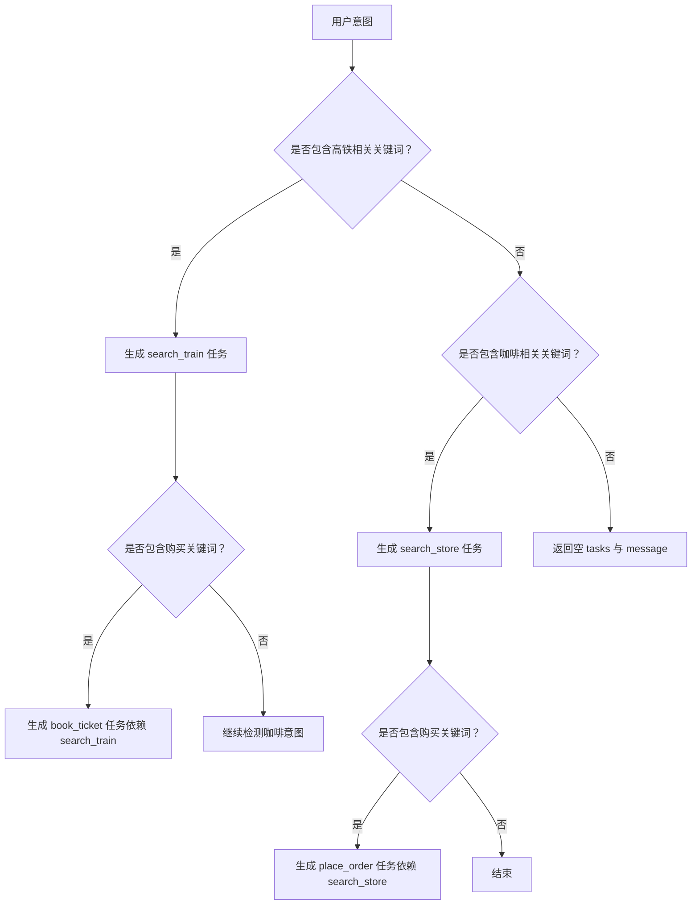
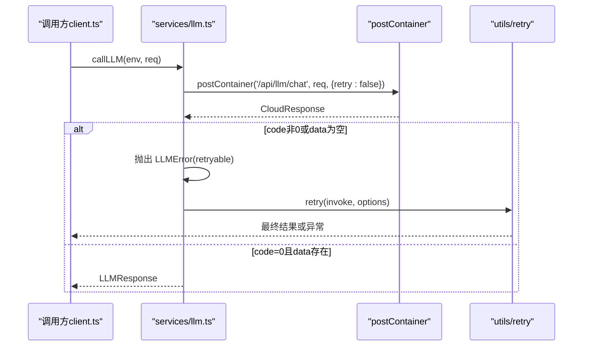
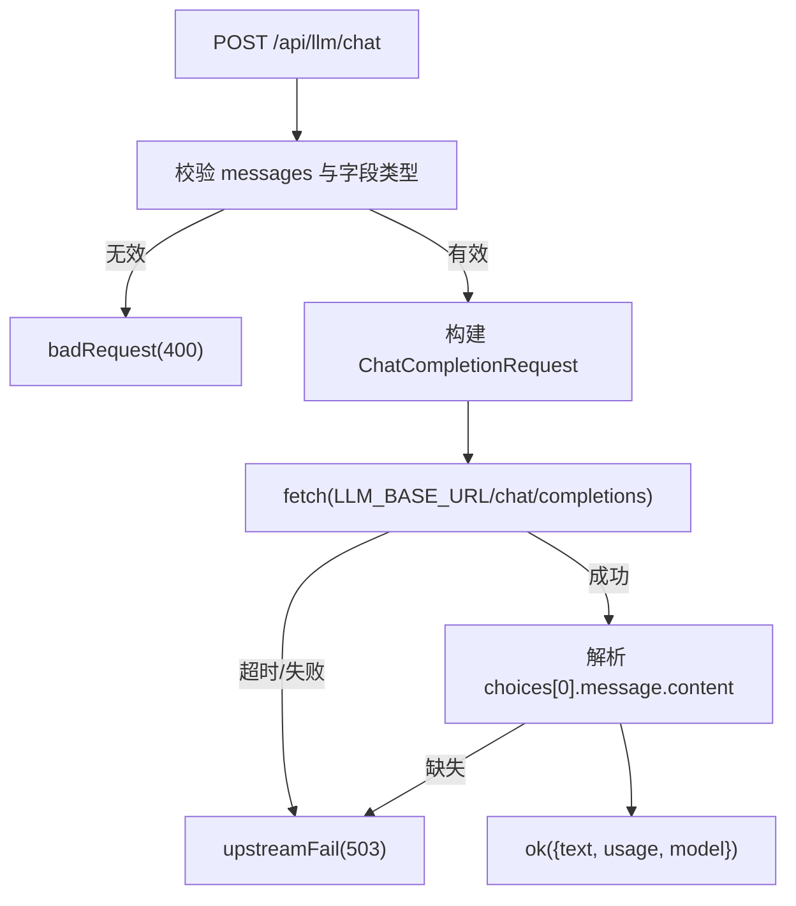
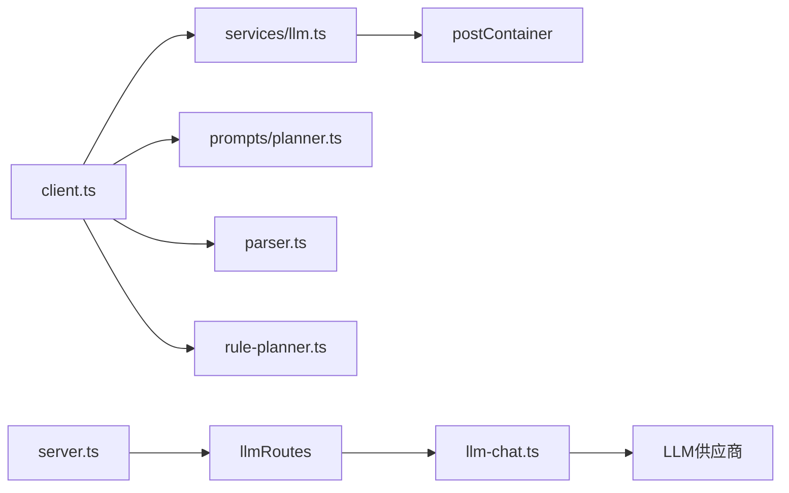

# LLM集成

<cite>
**本文引用的文件**   
- [miniprogram/src/llm/client.ts](file://miniprogram/src/llm/client.ts)
- [miniprogram/src/llm/parser.ts](file://miniprogram/src/llm/parser.ts)
- [miniprogram/src/llm/rule-planner.ts](file://miniprogram/src/llm/rule-planner.ts)
- [miniprogram/src/llm/prompts/planner.ts](file://miniprogram/src/llm/prompts/planner.ts)
- [miniprogram/src/services/llm.ts](file://miniprogram/src/services/llm.ts)
- [cloudrun/src/llm-chat.ts](file://cloudrun/src/llm-chat.ts)
- [cloudrun/src/api.ts](file://cloudrun/src/api.ts)
- [cloudrun/src/server.ts](file://cloudrun/src/server.ts)
- [miniprogram/src/types/plan.d.ts](file://miniprogram/src/types/plan.d.ts)
- [miniprogram/src/types/task.d.ts](file://miniprogram/src/types/task.d.ts)
</cite>

## 目录
1. [简介](#简介)
2. [项目结构](#项目结构)
3. [核心组件](#核心组件)
4. [架构总览](#架构总览)
5. [详细组件分析](#详细组件分析)
6. [依赖关系分析](#依赖关系分析)
7. [性能与优化](#性能与优化)
8. [故障排查指南](#故障排查指南)
9. [结论](#结论)
10. [附录：云端LLM聊天API文档与调用示例](#附录云端llm聊天api文档与调用示例)

## 简介
本技术文档聚焦于 WAIC-WeChat-MiniProgram 的大语言模型（LLM）集成模块，覆盖以下关键主题：
- 大语言模型客户端实现：请求封装、响应解析、错误处理与重试机制。
- Prompt工程：意图理解与任务规划的提示词模板设计、上下文注入与优化策略。
- RulePlanner规则规划器：在开发环境降级时，将自然语言转换为可执行的 Plan。
- Parser解析器：对 LLM 返回的结构化数据进行抽取、校验与标准化。
- 云端LLM聊天服务API：接口规范、数据格式、错误语义与部署配置。
- 多提供商集成与性能优化实践：如何接入不同 LLM 供应商并调优延迟、成本与稳定性。

## 项目结构
本项目采用“小程序端 + 云端托管”的分离式架构：
- 小程序端负责用户交互、Prompt构造、Plan生成与调度执行。
- 云端托管提供统一的 LLM 代理与技能能力路由，屏蔽上游 LLM 差异与密钥管理。



**图表来源**
- [miniprogram/src/llm/client.ts:56-120](file://miniprogram/src/llm/client.ts#L56-L120)
- [miniprogram/src/llm/prompts/planner.ts:23-52](file://miniprogram/src/llm/prompts/planner.ts#L23-L52)
- [miniprogram/src/llm/parser.ts:118-122](file://miniprogram/src/llm/parser.ts#L118-L122)
- [miniprogram/src/llm/rule-planner.ts:82-164](file://miniprogram/src/llm/rule-planner.ts#L82-L164)
- [miniprogram/src/services/llm.ts:57-83](file://miniprogram/src/services/llm.ts#L57-L83)
- [cloudrun/src/server.ts:76-123](file://cloudrun/src/server.ts#L76-L123)
- [cloudrun/src/llm-chat.ts:55-118](file://cloudrun/src/llm-chat.ts#L55-L118)

**章节来源**
- [miniprogram/src/llm/client.ts:1-153](file://miniprogram/src/llm/client.ts#L1-L153)
- [cloudrun/src/server.ts:1-129](file://cloudrun/src/server.ts#L1-L129)

## 核心组件
- PlannerLLMClient（client.ts）：统一编排 Prompt 构建、LLM 调用、结果解析与降级策略。
- Prompt模板（prompts/planner.ts）：定义系统指令、上下文注入与输出 schema。
- Parser（parser.ts）：从 LLM 文本中抽取 JSON、校验结构并转为标准 Plan。
- RulePlanner（rule-planner.ts）：基于关键词的规则式规划器，用于开发环境降级。
- LLM服务封装（services/llm.ts）：封装云端 /api/llm/chat 调用、重试与错误分类。
- 云端LLM代理（llm-chat.ts）：OpenAI兼容转发、超时控制、用量统计与错误映射。
- 协议与服务器（api.ts, server.ts）：统一 CloudResponse、路由分发与健康检查。

**章节来源**
- [miniprogram/src/llm/client.ts:20-120](file://miniprogram/src/llm/client.ts#L20-L120)
- [miniprogram/src/llm/prompts/planner.ts:16-52](file://miniprogram/src/llm/prompts/planner.ts#L16-L52)
- [miniprogram/src/llm/parser.ts:18-122](file://miniprogram/src/llm/parser.ts#L18-L122)
- [miniprogram/src/llm/rule-planner.ts:23-164](file://miniprogram/src/llm/rule-planner.ts#L23-L164)
- [miniprogram/src/services/llm.ts:14-83](file://miniprogram/src/services/llm.ts#L14-L83)
- [cloudrun/src/llm-chat.ts:22-118](file://cloudrun/src/llm-chat.ts#L22-L118)
- [cloudrun/src/api.ts:10-64](file://cloudrun/src/api.ts#L10-L64)
- [cloudrun/src/server.ts:22-123](file://cloudrun/src/server.ts#L22-L123)

## 架构总览
整体流程如下：
- 小程序端通过 PlannerLLMClient 构建 Prompt，调用 services/llm.ts 发起云端请求。
- 云端 server.ts 接收请求，分发给 llm-chat.ts。
- llm-chat.ts 根据环境变量选择上游 LLM 供应商，进行 OpenAI 兼容调用。
- 返回文本经 parser.ts 解析为 Plan；若云端不可用且处于开发环境，则回退到 rule-planner.ts。



**图表来源**
- [miniprogram/src/llm/client.ts:56-120](file://miniprogram/src/llm/client.ts#L56-L120)
- [miniprogram/src/services/llm.ts:57-83](file://miniprogram/src/services/llm.ts#L57-L83)
- [cloudrun/src/server.ts:76-123](file://cloudrun/src/server.ts#L76-L123)
- [cloudrun/src/llm-chat.ts:55-118](file://cloudrun/src/llm-chat.ts#L55-L118)
- [miniprogram/src/llm/parser.ts:118-122](file://miniprogram/src/llm/parser.ts#L118-L122)
- [miniprogram/src/llm/rule-planner.ts:82-164](file://miniprogram/src/llm/rule-planner.ts#L82-L164)

## 详细组件分析

### PlannerLLMClient（client.ts）
职责与行为：
- 构建 Prompt：调用 prompts/planner.ts 的 buildPlannerPrompt，注入用户意图、可用 SKILL 简表与上下文。
- 调用 LLM：通过 services/llm.ts 的 callLLM 发起请求，设置 temperature=0.3、maxTokens=1500、jsonMode=true。
- 错误处理与降级：捕获 LLMError 与 CloudNetworkError，在开发环境降级至 rule-planner.ts，避免全链路阻塞。
- 解析与验证：使用 parser.ts 的 parsePlannerOutput 将文本转为 Plan，补充 traceId 与默认 intent。
- 聚合输出：aggregate 将成功 Task 汇总为用户可读消息。



**图表来源**
- [miniprogram/src/llm/client.ts:56-120](file://miniprogram/src/llm/client.ts#L56-L120)
- [miniprogram/src/llm/parser.ts:89-122](file://miniprogram/src/llm/parser.ts#L89-L122)
- [miniprogram/src/llm/rule-planner.ts:82-164](file://miniprogram/src/llm/rule-planner.ts#L82-L164)

**章节来源**
- [miniprogram/src/llm/client.ts:20-153](file://miniprogram/src/llm/client.ts#L20-L153)

### Prompt工程（prompts/planner.ts）
设计要点：
- 系统指令：强调必须输出 JSON、仅使用 availableSkills、写操作需人类确认、无依赖可并行等规则。
- 上下文注入：会话ID、用户ID、当前时间、位置、偏好、最近意图摘要。
- Schema约束：明确输出字段（intent、tasks、message），并提供示例帮助模型遵循规范。
- Token优化：传入 SKILL 简表而非完整描述，减少 token 消耗。



**图表来源**
- [miniprogram/src/llm/prompts/planner.ts:16-52](file://miniprogram/src/llm/prompts/planner.ts#L16-L52)
- [miniprogram/src/llm/prompts/planner.ts:55-73](file://miniprogram/src/llm/prompts/planner.ts#L55-L73)
- [miniprogram/src/llm/prompts/planner.ts:75-129](file://miniprogram/src/llm/prompts/planner.ts#L75-L129)

**章节来源**
- [miniprogram/src/llm/prompts/planner.ts:1-129](file://miniprogram/src/llm/prompts/planner.ts#L1-L129)

### Parser解析器（parser.ts）
功能说明：
- extractJson：优先尝试 Markdown 包裹的 JSON，其次正则抽取首个 JSON 对象。
- validatePlannerOutput：校验 tasks 数组及每个 task 的必要字段（skillId、action、input、dependsOn）。
- toPlan：将 PlannerLLMOutput 转为标准 Plan，补全 id、status、retryCount、summary 等字段。
- parsePlannerOutput：组合抽取、校验与转换的完整流水线。



**图表来源**
- [miniprogram/src/llm/parser.ts:40-60](file://miniprogram/src/llm/parser.ts#L40-L60)
- [miniprogram/src/llm/parser.ts:63-87](file://miniprogram/src/llm/parser.ts#L63-L87)
- [miniprogram/src/llm/parser.ts:89-122](file://miniprogram/src/llm/parser.ts#L89-L122)

**章节来源**
- [miniprogram/src/llm/parser.ts:1-127](file://miniprogram/src/llm/parser.ts#L1-L127)

### RulePlanner规则规划器（rule-planner.ts）
作用与策略：
- 在开发环境或云端 LLM 不可用时，以关键词匹配生成与 LLM Planner 同构的 PlannerLLMOutput。
- 支持高铁查询/购票与星巴克门店查询/点单两类演示场景。
- 生成带 inputBindings 的 DAG 任务，确保下游确认与调度逻辑无需感知来源。



**图表来源**
- [miniprogram/src/llm/rule-planner.ts:82-164](file://miniprogram/src/llm/rule-planner.ts#L82-L164)

**章节来源**
- [miniprogram/src/llm/rule-planner.ts:1-165](file://miniprogram/src/llm/rule-planner.ts#L1-L165)

### LLM服务封装（services/llm.ts）
职责与特性：
- 封装 postContainer 调用 /api/llm/chat，传递 sessionId 与关闭内建重试以避免嵌套放大。
- 自定义 LLMError，标记 retryable（429/503 视为可重试）。
- 外层 retry 最多重试3次，指数退避（baseDelayMs=800ms），记录重试日志。



**图表来源**
- [miniprogram/src/services/llm.ts:57-83](file://miniprogram/src/services/llm.ts#L57-L83)

**章节来源**
- [miniprogram/src/services/llm.ts:1-83](file://miniprogram/src/services/llm.ts#L1-L83)

### 云端LLM代理（llm-chat.ts）
功能说明：
- 读取环境变量 LLM_BASE_URL、LLM_API_KEY、LLM_MODEL。
- 校验入参 messages 必填且 role/content 为字符串。
- 构造 OpenAI 兼容 payload，必要时启用 response_format.json_object。
- 设置超时（UPSTREAM_TIMEOUT_MS=30000ms），捕获超时与网络异常。
- 返回统一 ok({text, usage, model}) 或 upstreamFail(503)。



**图表来源**
- [cloudrun/src/llm-chat.ts:55-118](file://cloudrun/src/llm-chat.ts#L55-L118)

**章节来源**
- [cloudrun/src/llm-chat.ts:1-123](file://cloudrun/src/llm-chat.ts#L1-L123)

### 协议与服务器（api.ts, server.ts）
- api.ts：定义 CloudResponse、HandlerResult、ok/fail/badRequest/unauthorized/forbidden 等工具函数。
- server.ts：监听端口、解析 JSON body（上限1MB）、路由分发、健康检查、统一响应与异常处理。

```mermaid
classDiagram
class CloudResponse {
+number code
+string message?
+any data?
}
class HandlerResult {
+number httpStatus
+CloudResponse body
}
class RouteHandler {
<<function>>
(body, ctx) => Promise~HandlerResult~
}
class Server {
+createServer()
+handle(req, res)
+readBody(req)
+sendJson(res, status, body)
}
Server --> RouteHandler : "路由分发"
RouteHandler --> HandlerResult : "返回"
HandlerResult --> CloudResponse : "封装"
```

**图表来源**
- [cloudrun/src/api.ts:10-64](file://cloudrun/src/api.ts#L10-L64)
- [cloudrun/src/server.ts:22-123](file://cloudrun/src/server.ts#L22-L123)

**章节来源**
- [cloudrun/src/api.ts:1-64](file://cloudrun/src/api.ts#L1-L64)
- [cloudrun/src/server.ts:1-129](file://cloudrun/src/server.ts#L1-L129)

## 依赖关系分析
- client.ts 依赖：
  - services/llm.ts：云端 LLM 调用与重试。
  - prompts/planner.ts：Prompt构建。
  - parser.ts：结构化解析。
  - rule-planner.ts：开发环境降级。
  - types/plan.d.ts、types/context.d.ts、types/skill.d.ts：类型定义。
- cloudrun 侧依赖：
  - server.ts：HTTP服务器与路由注册。
  - llm-chat.ts：LLM代理实现。
  - api.ts：协议工具函数。



**图表来源**
- [miniprogram/src/llm/client.ts:9-18](file://miniprogram/src/llm/client.ts#L9-L18)
- [cloudrun/src/server.ts:15-27](file://cloudrun/src/server.ts#L15-L27)
- [cloudrun/src/llm-chat.ts:19-29](file://cloudrun/src/llm-chat.ts#L19-L29)

**章节来源**
- [miniprogram/src/llm/client.ts:1-153](file://miniprogram/src/llm/client.ts#L1-L153)
- [cloudrun/src/server.ts:1-129](file://cloudrun/src/server.ts#L1-L129)

## 性能与优化
- 温度与Token限制：
  - 任务型场景建议 temperature≈0.3，降低随机性；maxTokens=1500 控制输出长度。
- JSON模式：
  - 开启 jsonMode=true，后端强制 response_format.json_object，提升结构化输出稳定性。
- 重试策略：
  - 上层 retry 最多3次，基础退避800ms；避免与 postContainer 内建重试叠加导致指数放大。
- 超时控制：
  - 上游 fetch 设置 AbortSignal.timeout(30000ms)，防止长尾请求拖垮服务。
- Prompt优化：
  - 传入 SKILL 简表而非完整描述，减少 token 消耗；上下文摘要仅保留必要字段。
- 降级路径：
  - 开发环境自动降级至 rule-planner.ts，保证本地演示与调试流畅。

[本节为通用指导，不直接分析具体文件]

## 故障排查指南
常见问题与定位方法：
- LLM调用失败：
  - 检查 services/llm.ts 抛出的 LLMError 是否标记为 retryable（429/503）。
  - 查看云端 llm-chat.ts 的 upstreamFail 日志，确认 LLM_BASE_URL 与 LLM_API_KEY 配置。
- 解析失败：
  - 检查 parser.ts 的 extractJson 与 validatePlannerOutput 抛出的 LLMParserError。
  - 确认 Prompt 模板是否要求严格 JSON 输出，避免多余文字。
- 开发环境降级：
  - 若 devFallbackReason 触发，确认 isDevEnv 环境与 CloudNetworkError 条件。
  - 规则规划器返回空 tasks 时，检查关键词匹配逻辑（rule-planner.ts）。
- 云端健康检查：
  - 访问 GET / 或 /healthz，确认 server.ts 返回 200 与 service 信息。

**章节来源**
- [miniprogram/src/services/llm.ts:47-83](file://miniprogram/src/services/llm.ts#L47-L83)
- [miniprogram/src/llm/parser.ts:18-60](file://miniprogram/src/llm/parser.ts#L18-L60)
- [miniprogram/src/llm/client.ts:37-45](file://miniprogram/src/llm/client.ts#L37-L45)
- [miniprogram/src/llm/rule-planner.ts:157-164](file://miniprogram/src/llm/rule-planner.ts#L157-L164)
- [cloudrun/src/server.ts:84-92](file://cloudrun/src/server.ts#L84-L92)

## 结论
本模块通过清晰的职责划分与稳健的错误处理机制，实现了从自然语言到可执行 Plan 的端到端流程。Prompt工程与结构化解析确保了 LLM 输出的稳定性；RulePlanner 提供了可靠的开发环境降级方案；云端 LLM 代理屏蔽了上游差异，便于多提供商集成与性能优化。建议在正式环境中持续监控 token 用量、重试次数与超时率，并根据业务反馈迭代 Prompt 与规则集。

[本节为总结性内容，不直接分析具体文件]

## 附录：云端LLM聊天API文档与调用示例

### 接口规范
- 端点：POST /api/llm/chat
- 请求体（LLMRequestBody）：
  - model?: string（可选，默认由 LLM_MODEL 决定）
  - messages: Array<{role: string; content: string}>（必填，至少一条）
  - temperature?: number（可选）
  - maxTokens?: number（可选）
  - jsonMode?: boolean（可选，开启后后端添加 response_format.json_object）
  - sessionId?: string（可选，埋点用）
- 成功响应（CloudResponse<LLMResponse>）：
  - code: 0
  - data:
    - text: string（LLM输出）
    - usage: {promptTokens: number; completionTokens: number; totalTokens: number}
    - model: string（实际使用的模型名）
- 错误响应：
  - HTTP 400：参数非法（messages 缺失或字段类型不符）
  - HTTP 503：上游 LLM 不可用或超时（可重试）
  - HTTP 500：内部错误

**章节来源**
- [cloudrun/src/llm-chat.ts:22-45](file://cloudrun/src/llm-chat.ts#L22-L45)
- [cloudrun/src/llm-chat.ts:63-79](file://cloudrun/src/llm-chat.ts#L63-L79)
- [cloudrun/src/llm-chat.ts:103-118](file://cloudrun/src/llm-chat.ts#L103-L118)
- [cloudrun/src/api.ts:10-64](file://cloudrun/src/api.ts#L10-L64)

### 调用示例（小程序端）
- 构造消息：
  - role: system，content: PLANNER_SYSTEM（来自 prompts/planner.ts）
  - role: user，content: 包含用户意图、上下文与 SKILL 简表的拼接文本
- 调用 services/llm.ts 的 callLLM：
  - env: 当前云环境标识
  - messages: 上述消息数组
  - temperature: 0.3
  - maxTokens: 1500
  - jsonMode: true
  - sessionId: 当前会话ID
- 处理响应：
  - 使用 parser.ts 的 parsePlannerOutput 将 text 转为 Plan
  - 若失败且处于开发环境，降级至 rule-planner.ts

**章节来源**
- [miniprogram/src/llm/client.ts:65-82](file://miniprogram/src/llm/client.ts#L65-L82)
- [miniprogram/src/llm/parser.ts:118-122](file://miniprogram/src/llm/parser.ts#L118-L122)
- [miniprogram/src/llm/rule-planner.ts:82-164](file://miniprogram/src/llm/rule-planner.ts#L82-L164)

### 多提供商集成与优化建议
- 切换供应商：
  - 修改 LLM_BASE_URL 与 LLM_API_KEY 环境变量；保持 OpenAI 兼容接口。
- 模型选择：
  - 通过 LLM_MODEL 指定默认模型；或在请求体中覆盖 model 字段。
- 性能调优：
  - 合理设置 temperature 与 maxTokens，平衡创造性与成本。
  - 开启 jsonMode 提高结构化输出稳定性。
  - 监控上游超时与重试次数，必要时调整 UPSTREAM_TIMEOUT_MS 与重试策略。
- 安全与合规：
  - API Key 仅存在于容器环境变量，绝不暴露给小程序端。
  - 使用 CloudResponse 统一错误语义，便于前端一致处理。

**章节来源**
- [cloudrun/src/llm-chat.ts:8-17](file://cloudrun/src/llm-chat.ts#L8-L17)
- [cloudrun/src/llm-chat.ts:55-79](file://cloudrun/src/llm-chat.ts#L55-L79)
- [miniprogram/src/services/llm.ts:57-83](file://miniprogram/src/services/llm.ts#L57-L83)