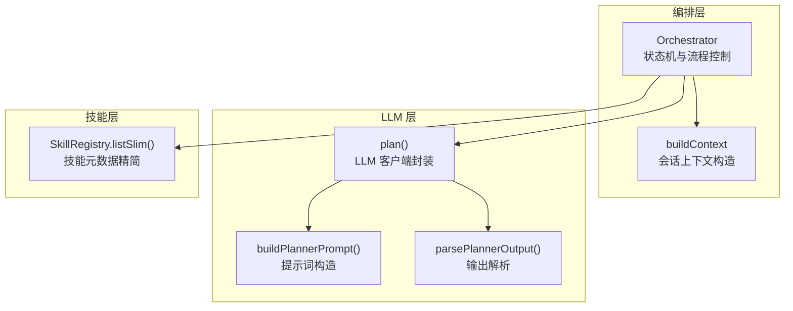
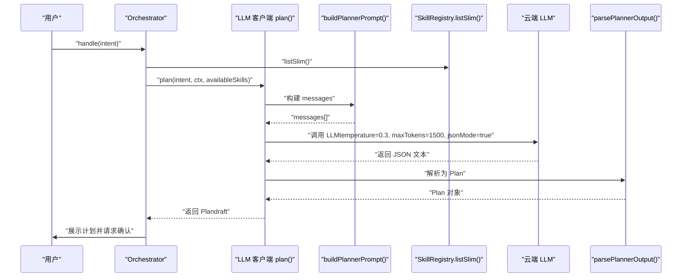
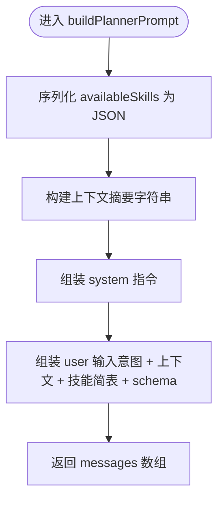
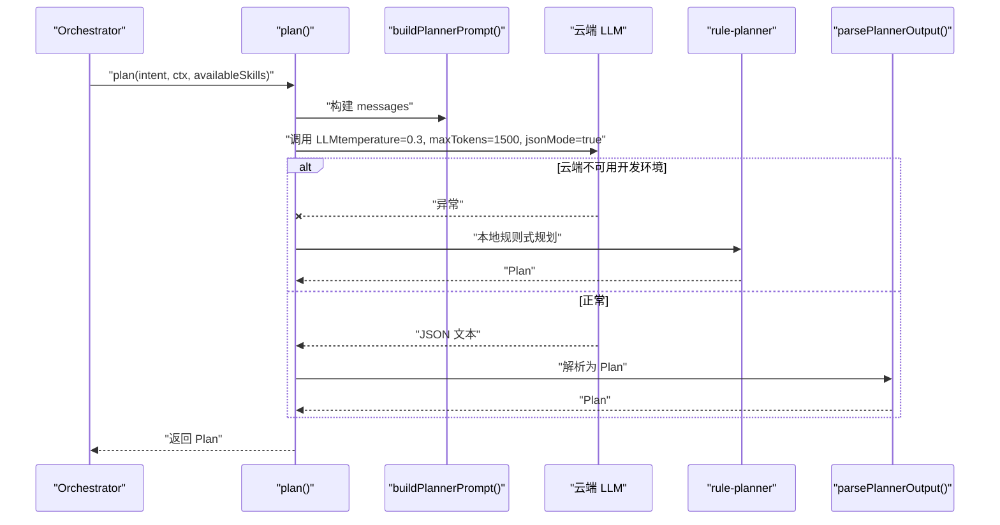
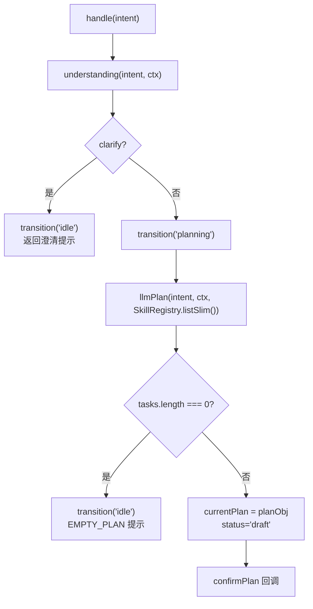
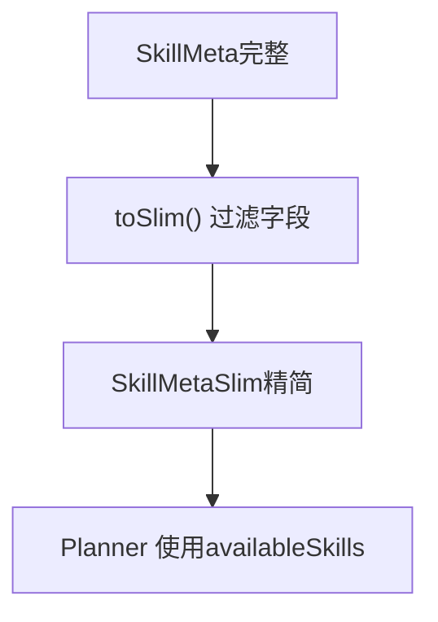
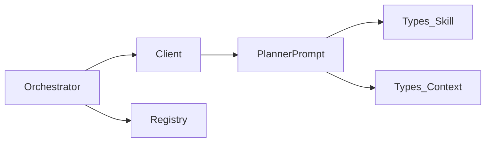

# Prompt工程

<cite>
**本文引用的文件**   
- [planner.ts](file://miniprogram/src/llm/prompts/planner.ts)
- [client.ts](file://miniprogram/src/llm/client.ts)
- [orchestrator.ts](file://miniprogram/src/core/orchestrator.ts)
- [context.ts](file://miniprogram/src/core/context.ts)
- [skill.d.ts](file://miniprogram/src/types/skill.d.ts)
- [context.d.ts](file://miniprogram/src/types/context.d.ts)
- [plan.d.ts](file://miniprogram/src/types/plan.d.ts)
- [registry.ts](file://miniprogram/src/skills/registry.ts)
</cite>

## 目录
1. [引言](#引言)
2. [项目结构](#项目结构)
3. [核心组件](#核心组件)
4. [架构总览](#架构总览)
5. [详细组件分析](#详细组件分析)
6. [依赖关系分析](#依赖关系分析)
7. [性能与成本优化](#性能与成本优化)
8. [故障排查指南](#故障排查指南)
9. [结论](#结论)
10. [附录：提示词模板与最佳实践清单](#附录提示词模板与最佳实践清单)

## 引言
本文件聚焦 WAIC-WeChat-MiniProgram 的 Prompt 工程模块，围绕任务规划（Planner）的提示词构建与调用链路展开。重点说明 buildPlannerPrompt 的设计原理、可用技能元数据的精简策略、上下文注入机制、LLM 调用参数配置，以及通过结构化提示词提升任务规划准确性的方法。文档同时给出架构图、时序图与流程图，帮助读者从系统到代码层面理解 Planner 的工作方式。

## 项目结构
与 Prompt 工程直接相关的代码主要分布在以下位置：
- 提示词模板与构造逻辑：miniprogram/src/llm/prompts/planner.ts
- LLM 客户端封装与调用参数：miniprogram/src/llm/client.ts
- 编排器（Orchestrator）与状态机：miniprogram/src/core/orchestrator.ts
- 上下文构造与会话历史管理：miniprogram/src/core/context.ts
- 类型定义（SkillMetaSlim、AgentContext、Plan 等）：miniprogram/src/types/*.d.ts
- 技能注册中心与 Slim 转换：miniprogram/src/skills/registry.ts



**图表来源**
- [orchestrator.ts:106-147](file://miniprogram/src/core/orchestrator.ts#L106-L147)
- [client.ts:56-119](file://miniprogram/src/llm/client.ts#L56-L119)
- [planner.ts:23-52](file://miniprogram/src/llm/prompts/planner.ts#L23-L52)
- [registry.ts:50-53](file://miniprogram/src/skills/registry.ts#L50-L53)

**章节来源**
- [orchestrator.ts:1-12](file://miniprogram/src/core/orchestrator.ts#L1-L12)
- [client.ts:1-19](file://miniprogram/src/llm/client.ts#L1-L19)
- [planner.ts:1-20](file://miniprogram/src/llm/prompts/planner.ts#L1-L20)
- [registry.ts:1-11](file://miniprogram/src/skills/registry.ts#L1-L11)

## 核心组件
- Planner 提示词构造器：负责将用户意图、上下文与可用技能简表整合为结构化消息数组，包含 system 指令与 user 输入。
- LLM 客户端：统一封装 LLM 调用，设置 temperature、maxTokens、jsonMode 等参数，并处理开发环境降级与错误。
- Orchestrator：编排理解、规划、确认、执行、聚合等阶段的状态机，驱动 Planner 调用并处理 Plan 生命周期。
- Context 构造器：组装 AgentContext，注入 sessionId、userId、位置、偏好、历史、全局变量与追踪信息。
- SkillRegistry：维护技能实例与元数据，提供 listSlim 以向 Planner 暴露精简版技能能力。

**章节来源**
- [planner.ts:23-52](file://miniprogram/src/llm/prompts/planner.ts#L23-L52)
- [client.ts:56-119](file://miniprogram/src/llm/client.ts#L56-L119)
- [orchestrator.ts:106-147](file://miniprogram/src/core/orchestrator.ts#L106-L147)
- [context.ts:60-91](file://miniprogram/src/core/context.ts#L60-L91)
- [registry.ts:50-53](file://miniprogram/src/skills/registry.ts#L50-L53)

## 架构总览
下图展示一次用户意图处理的端到端流程，突出 Planner 在其中的作用与依赖关系。



**图表来源**
- [orchestrator.ts:106-147](file://miniprogram/src/core/orchestrator.ts#L106-L147)
- [client.ts:56-119](file://miniprogram/src/llm/client.ts#L56-L119)
- [planner.ts:23-52](file://miniprogram/src/llm/prompts/planner.ts#L23-L52)
- [registry.ts:50-53](file://miniprogram/src/skills/registry.ts#L50-L53)

## 详细组件分析

### Planner 提示词构造器（buildPlannerPrompt）
设计目标
- 强制 JSON 输出，避免多余文字或 Markdown 包裹。
- 提供 availableSkills 精简清单，降低 token 消耗。
- 注入上下文（会话 ID、用户 ID、当前时间、位置、偏好、最近意图）。
- 强调“零写操作默认不需人类确认”的反例，培养模型遵循规范。

输入与输出
- 输入：userIntent（字符串）、availableSkills（SkillMetaSlim[]）、ctx（AgentContext）。
- 输出：messages 数组，包含 system 指令与 user 输入两部分。

关键实现要点
- 将 availableSkills 序列化为 JSON 字符串，嵌入 user 消息中作为“可用 SKILL 简表”。
- 使用 buildContextString 生成上下文摘要，包括会话标识、用户标识、时间戳、位置与偏好、最近意图摘要。
- system 指令明确输出 schema、规则约束与示例，确保模型输出符合 Plan 结构。



**图表来源**
- [planner.ts:23-52](file://miniprogram/src/llm/prompts/planner.ts#L23-L52)
- [planner.ts:55-73](file://miniprogram/src/llm/prompts/planner.ts#L55-L73)
- [planner.ts:76-129](file://miniprogram/src/llm/prompts/planner.ts#L76-L129)

**章节来源**
- [planner.ts:23-52](file://miniprogram/src/llm/prompts/planner.ts#L23-L52)
- [planner.ts:55-73](file://miniprogram/src/llm/prompts/planner.ts#L55-L73)
- [planner.ts:76-129](file://miniprogram/src/llm/prompts/planner.ts#L76-L129)

### LLM 客户端（plan）
职责
- 调用 buildPlannerPrompt 构造 messages。
- 设置温度、最大 token、JSON 模式等参数。
- 处理开发环境降级（本地规则式规划器兜底）。
- 解析 LLM 返回文本为 Plan 对象，并补充 traceId。

关键参数
- temperature: 0.3（偏确定性，减少发散）。
- maxTokens: 1500（限制输出长度，控制成本）。
- jsonMode: true（强制 JSON 输出）。

降级策略
- 当云端 LLM 不可用（开发/体验环境），自动切换到 rule-planner 本地规则式规划器，保证全链路可演示。



**图表来源**
- [client.ts:56-119](file://miniprogram/src/llm/client.ts#L56-L119)

**章节来源**
- [client.ts:56-119](file://miniprogram/src/llm/client.ts#L56-L119)

### Orchestrator 与 Planner 集成
- Orchestrator 在 planning 阶段调用 llmPlan，传入 ctx 与 SkillRegistry.listSlim()。
- 若返回 tasks 为空，视为 EMPTY_PLAN，状态机归位 idle 并返回友好提示。
- 成功后将 Plan 标记为 draft，并通过 confirmPlan 回调进行用户确认。



**图表来源**
- [orchestrator.ts:106-147](file://miniprogram/src/core/orchestrator.ts#L106-L147)

**章节来源**
- [orchestrator.ts:106-147](file://miniprogram/src/core/orchestrator.ts#L106-L147)

### 上下文注入机制（AgentContext）
- 会话 ID：自动生成，用于追踪与隔离。
- 用户 ID：从缓存或匿名身份获取。
- 用户画像：包含位置（可选）、偏好（键值对）、历史意图（脱敏摘要）。
- 全局变量：如 cloudEnv，供 LLM 调用与环境判断。
- 消息历史：多轮对话记录，限制保留最近 20 条，防止内存膨胀。

```mermaid
classDiagram
class AgentContext {
+string sessionId
+string userId
+UserProfile userProfile
+Plan plan
+Record~string, unknown~ globals
+ChatMessage[] messages
+TraceInfo trace
}
class UserProfile {
+UserLocation location
+Record~string, unknown~ preferences
+{intent : string; timestamp : number}[] history
}
class UserLocation {
+number lat
+number lng
+string city
}
AgentContext --> UserProfile : "包含"
UserProfile --> UserLocation : "包含"
```

**图表来源**
- [context.d.ts:46-62](file://miniprogram/src/types/context.d.ts#L46-L62)
- [context.d.ts:11-25](file://miniprogram/src/types/context.d.ts#L11-L25)

**章节来源**
- [context.ts:60-91](file://miniprogram/src/core/context.ts#L60-L91)
- [context.d.ts:46-62](file://miniprogram/src/types/context.d.ts#L46-L62)

### 可用技能元数据处理（SkillMetaSlim）
- SkillRegistry.listSlim 将完整 SkillMeta 转换为 SkillMetaSlim，去除 LLM 不需要的字段，仅保留 id、name、description、tags 与 capabilities（action、description、inputSchema、outputSchema、requiresHumanConfirm）。
- 该精简策略显著降低 token 消耗，同时保留 Planner 路由所需的关键信息。



**图表来源**
- [registry.ts:74-88](file://miniprogram/src/skills/registry.ts#L74-L88)
- [skill.d.ts:106-119](file://miniprogram/src/types/skill.d.ts#L106-L119)

**章节来源**
- [registry.ts:50-53](file://miniprogram/src/skills/registry.ts#L50-L53)
- [registry.ts:74-88](file://miniprogram/src/skills/registry.ts#L74-L88)
- [skill.d.ts:106-119](file://miniprogram/src/types/skill.d.ts#L106-L119)

## 依赖关系分析
- Orchestrator 依赖 llm.client.plan 与 skills.registry.listSlim，但不反向依赖 skills 实现，符合单向依赖规范。
- Planner 提示词构造器依赖 types/skill 与 types/context，保持纯函数与无副作用。
- LLM 客户端依赖 services.llm 与 utils.idgen，并可选择性回退到 rule-planner。



**图表来源**
- [orchestrator.ts:13-18](file://miniprogram/src/core/orchestrator.ts#L13-L18)
- [client.ts:9-18](file://miniprogram/src/llm/client.ts#L9-L18)
- [planner.ts:13-14](file://miniprogram/src/llm/prompts/planner.ts#L13-L14)

**章节来源**
- [orchestrator.ts:13-18](file://miniprogram/src/core/orchestrator.ts#L13-L18)
- [client.ts:9-18](file://miniprogram/src/llm/client.ts#L9-L18)
- [planner.ts:13-14](file://miniprogram/src/llm/prompts/planner.ts#L13-L14)

## 性能与成本优化
- 温度参数：temperature=0.3，偏向确定性输出，降低发散与无效任务。
- Token 限制：maxTokens=1500，控制输出长度，避免过长响应导致成本上升。
- JSON 模式：jsonMode=true，强制结构化输出，减少解析失败率。
- 技能元数据精简：使用 SkillMetaSlim，去除冗余字段，降低 prompt 体积。
- 上下文摘要：仅注入必要字段（会话 ID、用户 ID、时间、位置、偏好、最近意图），避免历史消息过长。
- 消息历史上限：pushMessage 限制保留最近 20 条，防止内存增长。

[本节为通用指导，不直接分析具体文件]

## 故障排查指南
常见问题与定位建议
- LLM 调用失败：检查 devFallbackReason 触发原因（云开发未开通、云端 5xx、网络失败），确认开发环境降级是否生效。
- 输出解析失败：查看 parsePlannerOutput 抛出的 LLMParserError，核对 LLM 返回是否符合 schema。
- EMPTY_PLAN：当 tasks 为空时，Orchestrator 会返回 EMPTY_PLAN 错误码；检查 availableSkills 描述是否清晰，必要时增强 description 与 tags。
- 状态机死锁：确保 understanding/planning 提前返回路径正确 transition('idle')，避免内部状态残留导致 BUSY。

**章节来源**
- [client.ts:37-45](file://miniprogram/src/llm/client.ts#L37-L45)
- [client.ts:104-119](file://miniprogram/src/llm/client.ts#L104-L119)
- [orchestrator.ts:125-147](file://miniprogram/src/core/orchestrator.ts#L125-L147)

## 结论
通过结构化提示词、精简技能元数据与严格的 JSON 输出约束，Planner 能够稳定地将自然语言意图转化为 DAG 任务计划。结合 Orchestrator 的状态机与上下文注入机制，系统在准确性、可控性与成本之间取得平衡。建议在技能描述中明确“能做/不能做/何时触发”，并在 Prompt 中强化规则与示例，以提升任务规划的准确率与鲁棒性。

[本节为总结性内容，不直接分析具体文件]

## 附录：提示词模板与最佳实践清单

### 提示词模板结构
- System 指令：定义角色、严格规则、输出 schema 与示例。
- User 输入：包含用户意图、上下文摘要、可用技能简表与 schema 要求。
- 输出约束：强制 JSON，禁止多余文字；写操作需 requiresHumanConfirm=true；无依赖任务可并行。

**章节来源**
- [planner.ts:76-129](file://miniprogram/src/llm/prompts/planner.ts#L76-L129)

### 最佳实践清单
- 温度与 Token：temperature≈0.3，maxTokens≈1500，jsonMode=true。
- 技能描述：每个 capability 的 description 必须清晰表达能力边界与触发条件。
- 上下文注入：仅注入必要字段，避免泄露敏感信息；历史意图仅保留语义摘要。
- 错误处理：对 LLM 异常与解析失败进行分级日志与降级策略。
- 状态机安全：所有提前返回路径均需正确转移状态，避免死锁。

[本节为通用指导，不直接分析具体文件]