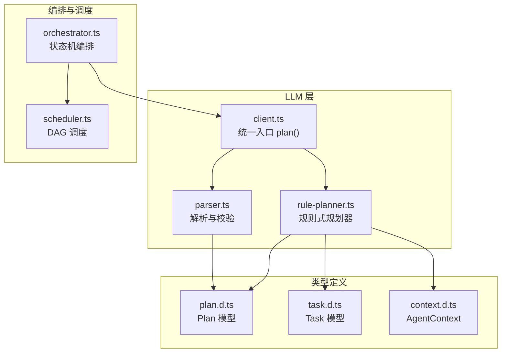
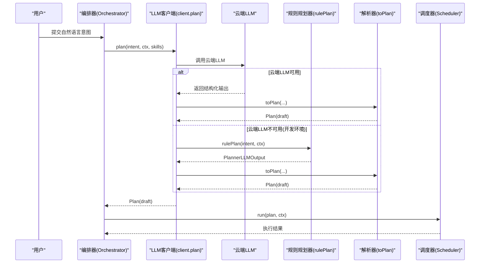
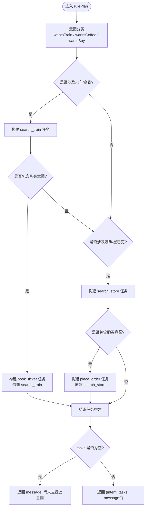
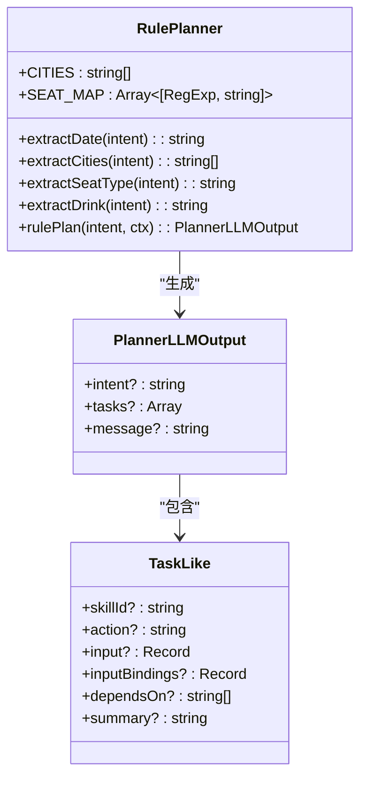
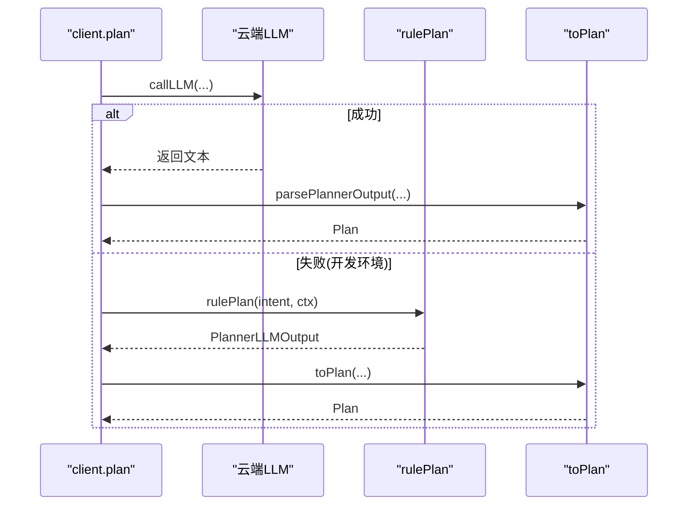
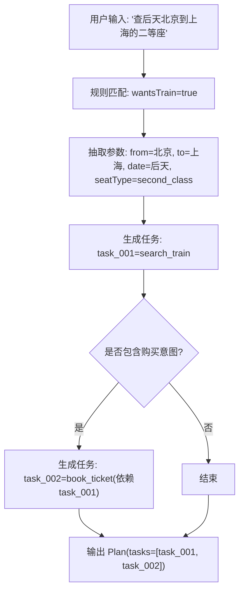
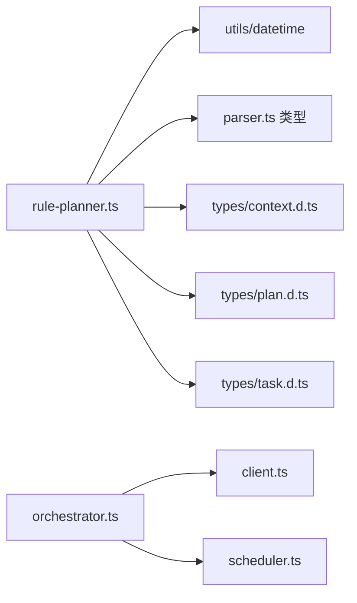

# 规则规划器

<cite>
**本文引用的文件**   
- [rule-planner.ts](file://miniprogram/src/llm/rule-planner.ts)
- [client.ts](file://miniprogram/src/llm/client.ts)
- [parser.ts](file://miniprogram/src/llm/parser.ts)
- [plan.d.ts](file://miniprogram/src/types/plan.d.ts)
- [task.d.ts](file://miniprogram/src/types/task.d.ts)
- [context.d.ts](file://miniprogram/src/types/context.d.ts)
- [orchestrator.ts](file://miniprogram/src/core/orchestrator.ts)
- [scheduler.ts](file://miniprogram/src/core/scheduler.ts)
</cite>

## 目录
1. [引言](#引言)
2. [项目结构定位](#项目结构定位)
3. [核心组件](#核心组件)
4. [架构总览](#架构总览)
5. [详细组件分析](#详细组件分析)
6. [依赖关系分析](#依赖关系分析)
7. [性能与可扩展性](#性能与可扩展性)
8. [调试与测试指南](#调试与测试指南)
9. [故障排查](#故障排查)
10. [结论](#结论)

## 引言
本文件面向 WAIC-WeChat-MiniProgram 的规则规划器模块，重点说明 rulePlan 函数的实现逻辑、意图识别与任务规划算法、规则匹配机制、优先级与冲突解决策略、与 LLM 规划器的协作关系（降级方案）、规则可扩展性设计、执行流程、环境切换方式以及调试与测试方法。目标是帮助开发者在不深入源码的情况下理解并扩展该模块。

## 项目结构定位
规则规划器位于小程序前端代码的 LLM 层，作为云端 LLM 不可用时的本地降级方案，输出与 LLM Planner 同构的结构，从而让下游确认、调度、检查点等流程完全无感知。

图表来源
- [client.ts:56-120](file://miniprogram/src/llm/client.ts#L56-L120)
- [parser.ts:89-122](file://miniprogram/src/llm/parser.ts#L89-L122)
- [rule-planner.ts:82-164](file://miniprogram/src/llm/rule-planner.ts#L82-L164)
- [plan.d.ts:19-33](file://miniprogram/src/types/plan.d.ts#L19-L33)
- [task.d.ts:29-59](file://miniprogram/src/types/task.d.ts#L29-L59)
- [context.d.ts:46-62](file://miniprogram/src/types/context.d.ts#L46-L62)
- [orchestrator.ts:1-27](file://miniprogram/src/core/orchestrator.ts#L1-L27)
- [scheduler.ts:1-16](file://miniprogram/src/core/scheduler.ts#L1-L16)

章节来源
- [client.ts:1-153](file://miniprogram/src/llm/client.ts#L1-L153)
- [rule-planner.ts:1-165](file://miniprogram/src/llm/rule-planner.ts#L1-L165)

## 核心组件
- 规则规划器：rulePlan(intent, ctx)，基于关键字和模式匹配生成任务计划。
- LLM 客户端：plan(intent, ctx, availableSkills)，负责调用云端 LLM，并在开发环境失败时降级到规则规划器。
- 解析器：toPlan(llmOutput, intent, planId)，将规则或 LLM 的输出标准化为 Plan。
- 类型定义：Plan、Task、AgentContext 等，确保上下游数据结构一致。
- 编排器与调度器：Orchestrator 管理状态机，Scheduler 执行 DAG 任务。

章节来源
- [rule-planner.ts:82-164](file://miniprogram/src/llm/rule-planner.ts#L82-L164)
- [client.ts:56-120](file://miniprogram/src/llm/client.ts#L56-L120)
- [parser.ts:89-122](file://miniprogram/src/llm/parser.ts#L89-L122)
- [plan.d.ts:19-33](file://miniprogram/src/types/plan.d.ts#L19-L33)
- [task.d.ts:29-59](file://miniprogram/src/types/task.d.ts#L29-L59)
- [context.d.ts:46-62](file://miniprogram/src/types/context.d.ts#L46-L62)
- [orchestrator.ts:1-27](file://miniprogram/src/core/orchestrator.ts#L1-L27)
- [scheduler.ts:1-16](file://miniprogram/src/core/scheduler.ts#L1-L16)

## 架构总览
规则规划器在整体架构中承担“兜底”职责：当云端 LLM 不可用时，自动切换到本地规则引擎，保证全链路可在本地演示；正式环境优先走云端 LLM，保持更强的泛化能力。

图表来源
- [client.ts:56-120](file://miniprogram/src/llm/client.ts#L56-L120)
- [rule-planner.ts:82-164](file://miniprogram/src/llm/rule-planner.ts#L82-L164)
- [parser.ts:89-122](file://miniprogram/src/llm/parser.ts#L89-L122)
- [orchestrator.ts:1-27](file://miniprogram/src/core/orchestrator.ts#L1-L27)
- [scheduler.ts:76-105](file://miniprogram/src/core/scheduler.ts#L76-L105)

## 详细组件分析

### rulePlan 函数实现逻辑
rulePlan 是规则式规划的主入口，接收用户意图与 Agent 上下文，返回与 LLM Planner 同构的 PlannerLLMOutput。其核心逻辑包括：
- 意图分类：通过正则表达式判断是否涉及高铁/火车查询购票、星巴克门店查询与点单。
- 参数抽取：从意图中提取日期、城市、座位类型、饮品名等关键参数。
- 任务构建：根据意图类别生成对应的 Task 列表，包含 skillId、action、input、dependsOn、summary 等字段。
- 写操作标记：若意图包含购买相关关键词，则追加下单类任务，交由后续 checkpoint 进行人类确认。

图表来源
- [rule-planner.ts:82-164](file://miniprogram/src/llm/rule-planner.ts#L82-L164)

章节来源
- [rule-planner.ts:82-164](file://miniprogram/src/llm/rule-planner.ts#L82-L164)

### 规则匹配机制
规则匹配基于正则表达式对自然语言意图进行模式匹配，主要匹配项包括：
- 城市关键词集合：支持简繁体并列，按出现顺序取前两个城市作为出发站与到达站。
- 座位类型映射：商务座、一等座、二等座、硬座等映射到枚举值。
- 日期抽取：后天、明天、今天默认。
- 饮品识别：美式、摩卡、拿铁等。
- 购买意图：买、订、下单、来一杯、帮我点等关键词触发写操作任务。

图表来源
- [rule-planner.ts:23-73](file://miniprogram/src/llm/rule-planner.ts#L23-L73)
- [parser.ts:25-37](file://miniprogram/src/llm/parser.ts#L25-L37)

章节来源
- [rule-planner.ts:23-73](file://miniprogram/src/llm/rule-planner.ts#L23-L73)
- [parser.ts:25-37](file://miniprogram/src/llm/parser.ts#L25-L37)

### 规则优先级与冲突解决策略
- 优先级：规则按意图类别分支处理，先判断是否涉及火车/高铁，再判断是否涉及咖啡/星巴克；两者可并行存在，互不干扰。
- 冲突解决：同一意图可能同时命中多个规则（例如既提到“高铁”又提到“咖啡”），此时会分别生成对应任务链，不存在互斥冲突。
- 购买意图：无论属于哪一类业务，只要包含购买关键词，都会追加下单类任务，且必须经过 checkpoint 确认。

章节来源
- [rule-planner.ts:85-155](file://miniprogram/src/llm/rule-planner.ts#L85-L155)

### 与 LLM 规划器的协作关系
- 正常路径：client.plan 调用云端 LLM，解析输出后生成 Plan。
- 降级路径：当云端 LLM 不可用（开发环境）时，client.plan 捕获异常并调用 rulePlan，再通过 toPlan 转换为标准 Plan，traceId 保留用于追踪。
- 降级判定：devFallbackReason 检测 LLMError 或 CloudNetworkError，仅在开发环境触发降级，避免掩盖真实 LLM 故障。

图表来源
- [client.ts:72-99](file://miniprogram/src/llm/client.ts#L72-L99)
- [rule-planner.ts:82-164](file://miniprogram/src/llm/rule-planner.ts#L82-L164)
- [parser.ts:89-122](file://miniprogram/src/llm/parser.ts#L89-L122)

章节来源
- [client.ts:72-99](file://miniprogram/src/llm/client.ts#L72-L99)

### 规则的可扩展性设计
- 新增业务规则：在 rulePlan 中增加新的意图分类分支，并补充相应的参数抽取函数与任务构建逻辑。
- 新增任务类型：遵循 Task 类型定义，确保 skillId、action、input、dependsOn、summary 等字段完整。
- 参数抽取：新增正则或映射表以支持更多实体（如城市、座位、饮品等）。
- 与现有体系兼容：所有输出均通过 toPlan 标准化，无需改动下游确认与调度流程。

章节来源
- [rule-planner.ts:82-164](file://miniprogram/src/llm/rule-planner.ts#L82-L164)
- [task.d.ts:29-59](file://miniprogram/src/types/task.d.ts#L29-L59)

### 具体规则定义示例与执行流程
- 高铁查询与购票：
  - 输入：“查后天北京到上海的二等座”
  - 生成任务：search_train（依赖为空），若含购买意图则追加 book_ticket（依赖 search_train）。
- 星巴克门店查询与点单：
  - 输入：“在上海找星巴克，帮我点一杯美式”
  - 生成任务：search_store（依赖为空），若含购买意图则追加 place_order（依赖 search_store）。

图表来源
- [rule-planner.ts:90-125](file://miniprogram/src/llm/rule-planner.ts#L90-L125)

章节来源
- [rule-planner.ts:90-125](file://miniprogram/src/llm/rule-planner.ts#L90-L125)

### 在不同环境下切换 LLM 规划和规则规划
- 开发环境：云端 LLM 不可用时自动降级到规则规划器，保证本地演示。
- 生产环境：优先使用云端 LLM，仅在极端情况下才考虑降级（当前实现仅开发环境降级）。
- 切换依据：devFallbackReason 检测错误类型与环境标志，决定是否调用 rulePlan。

章节来源
- [client.ts:37-45](file://miniprogram/src/llm/client.ts#L37-L45)
- [client.ts:83-99](file://miniprogram/src/llm/client.ts#L83-L99)

## 依赖关系分析
规则规划器依赖以下模块与类型：
- datetime 工具：用于日期计算与格式化。
- parser 类型：PlannerLLMOutput 与 Task 结构。
- context 类型：AgentContext 提供用户画像与位置信息。
- types 定义：Plan、Task、AgentContext 等确保数据一致性。
- orchestrator 与 scheduler：消费生成的 Plan 并执行任务。

图表来源
- [rule-planner.ts:19-21](file://miniprogram/src/llm/rule-planner.ts#L19-L21)
- [orchestrator.ts:13-26](file://miniprogram/src/core/orchestrator.ts#L13-L26)
- [scheduler.ts:18-25](file://miniprogram/src/core/scheduler.ts#L18-L25)

章节来源
- [rule-planner.ts:19-21](file://miniprogram/src/llm/rule-planner.ts#L19-L21)
- [orchestrator.ts:13-26](file://miniprogram/src/core/orchestrator.ts#L13-L26)
- [scheduler.ts:18-25](file://miniprogram/src/core/scheduler.ts#L18-L25)

## 性能与可扩展性
- 性能特征：
  - 规则匹配基于正则表达式，时间复杂度与意图长度线性相关，开销极低。
  - 任务构建为常数级操作，适合本地快速响应。
- 可扩展性：
  - 新增规则只需添加意图分类与参数抽取逻辑，不影响现有流程。
  - 通过 toPlan 标准化输出，确保与 LLM 路径一致，便于未来替换或增强。

[本节为通用指导，不涉及具体文件分析]

## 调试与测试指南
- 调试建议：
  - 观察 client.plan 的降级日志，确认是否触发规则规划器。
  - 检查生成的 Plan 中 tasks 列表是否符合预期，特别是 dependsOn 与 inputBindings。
  - 使用 Orchestrator 的 onTaskUpdate 回调监控任务状态变化。
- 测试方法：
  - 构造典型意图用例（高铁查询、星巴克点单），验证 rulePlan 输出。
  - 模拟云端 LLM 不可用场景，验证降级路径是否正确。
  - 使用 Scheduler 的 isRunActive 钩子验证并发与重置行为。

章节来源
- [client.ts:83-99](file://miniprogram/src/llm/client.ts#L83-L99)
- [orchestrator.ts:258-270](file://miniprogram/src/core/orchestrator.ts#L258-L270)
- [scheduler.ts:76-105](file://miniprogram/src/core/scheduler.ts#L76-L105)

## 故障排查
- 常见问题：
  - 规则未匹配：检查意图中的关键词是否与预定义正则匹配。
  - 参数缺失：确认 extractDate、extractCities、extractSeatType、extractDrink 是否能正确抽取。
  - 降级未触发：检查 devFallbackReason 的判断条件与环境标志。
- 日志定位：
  - client.plan 中的 warn 与 error 日志用于定位 LLM 调用失败与降级原因。
  - Orchestrator 的状态转移日志用于确认流程是否正常推进。

章节来源
- [client.ts:83-99](file://miniprogram/src/llm/client.ts#L83-L99)
- [orchestrator.ts:60-71](file://miniprogram/src/core/orchestrator.ts#L60-L71)

## 结论
规则规划器作为 LLM 规划器的降级方案，提供了稳定可靠的本地意图识别与任务规划能力。其设计简洁、扩展性强，能够无缝接入现有的编排与调度体系。开发者可通过新增规则与参数抽取逻辑轻松扩展业务场景，同时在开发与生产环境中获得一致的体验与行为。