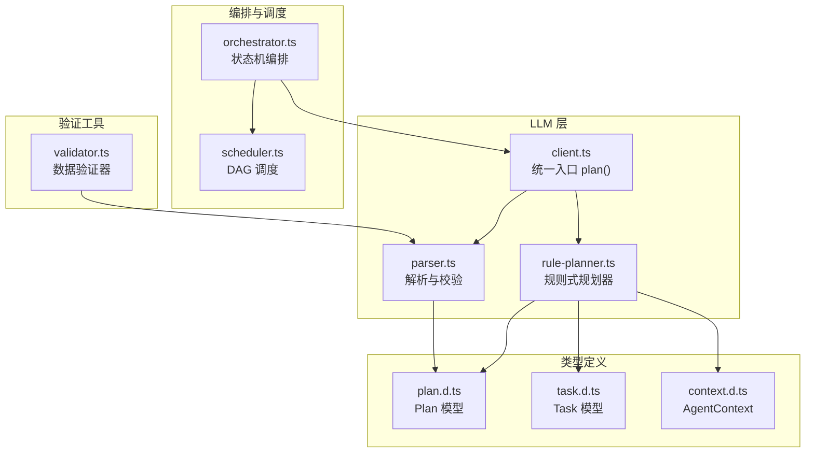
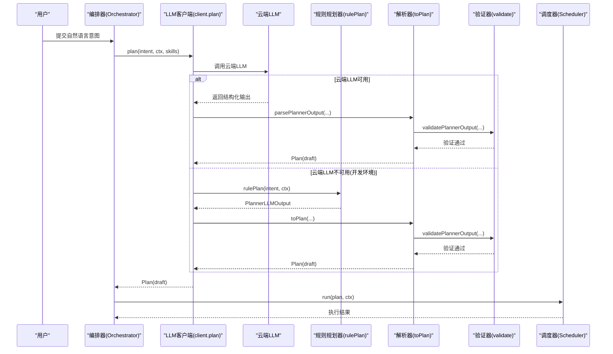
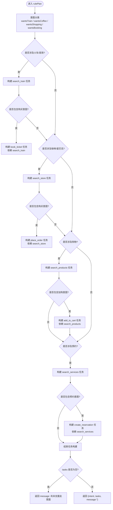
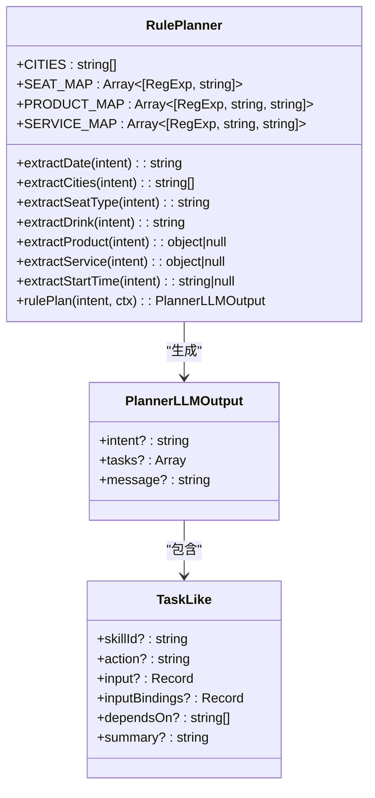
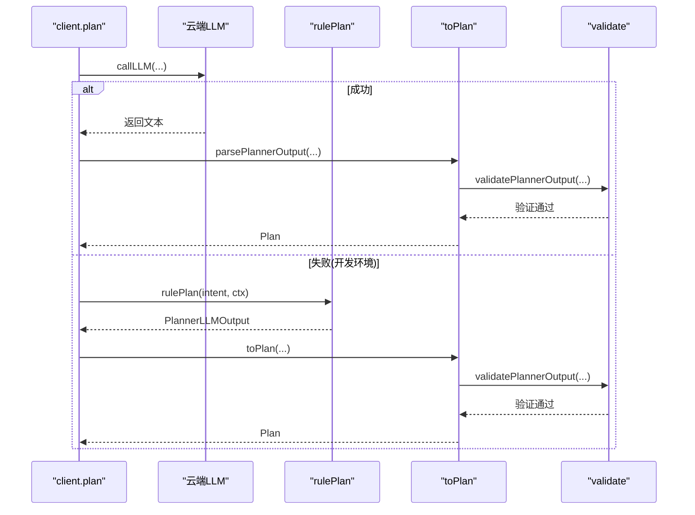
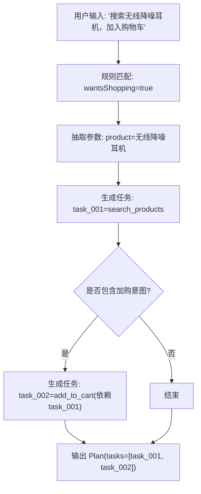
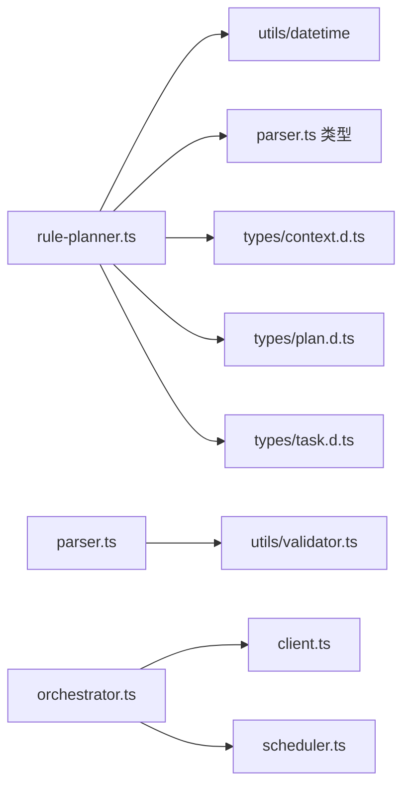

# 规则规划器

<cite>
**本文引用的文件**   
- [rule-planner.ts](file://miniprogram/src/llm/rule-planner.ts)
- [client.ts](file://miniprogram/src/llm/client.ts)
- [parser.ts](file://miniprogram/src/llm/parser.ts)
- [plan.d.ts](file://miniprogram/src/types/plan.d.ts)
- [task.d.ts](file://miniprogram/src/types/task.d.ts)
- [context.d.ts](file://miniprogram/src/types/context.d.ts)
- [orchestrator.ts](file://miniprogram/src/core/orchestrator.ts)
- [scheduler.ts](file://miniprogram/src/core/scheduler.ts)
- [validator.ts](file://miniprogram/src/utils/validator.ts)
</cite>

## 更新摘要
**变更内容**   
- 增强了规划准确性，支持更多业务领域（购物、预约）
- 改进了错误处理和异常恢复机制
- 增加了规划输出的模式验证和数据完整性检查
- 支持购物和预约领域的多轮对话上下文
- 完善了参数抽取和意图识别逻辑

## 目录
1. [引言](#引言)
2. [项目结构定位](#项目结构定位)
3. [核心组件](#核心组件)
4. [架构总览](#架构总览)
5. [详细组件分析](#详细组件分析)
6. [依赖关系分析](#依赖关系分析)
7. [性能与可扩展性](#性能与可扩展性)
8. [调试与测试指南](#调试与测试指南)
9. [故障排查](#故障排查)
10. [结论](#结论)

## 引言
本文件面向 WAIC-WeChat-MiniProgram 的规则规划器模块，重点说明 rulePlan 函数的实现逻辑、意图识别与任务规划算法、规则匹配机制、优先级与冲突解决策略、与 LLM 规划器的协作关系（降级方案）、规则可扩展性设计、执行流程、环境切换方式以及调试与测试方法。目标是帮助开发者在不深入源码的情况下理解并扩展该模块。

**更新** 本次更新重点反映了以下增强功能：增强的规划准确性、改进的错误处理、规划输出的模式验证，以及购物和预约领域的多轮对话上下文支持。

## 项目结构定位
规则规划器位于小程序前端代码的 LLM 层，作为云端 LLM 不可用时的本地降级方案，输出与 LLM Planner 同构的结构，从而让下游确认、调度、检查点等流程完全无感知。

**图表来源**
- [client.ts:56-120](file://miniprogram/src/llm/client.ts#L56-L120)
- [parser.ts:89-122](file://miniprogram/src/llm/parser.ts#L89-L122)
- [rule-planner.ts:82-164](file://miniprogram/src/llm/rule-planner.ts#L82-L164)
- [plan.d.ts:19-33](file://miniprogram/src/types/plan.d.ts#L19-L33)
- [task.d.ts:29-59](file://miniprogram/src/types/task.d.ts#L29-L59)
- [context.d.ts:46-62](file://miniprogram/src/types/context.d.ts#L46-L62)
- [orchestrator.ts:1-27](file://miniprogram/src/core/orchestrator.ts#L1-L27)
- [scheduler.ts:1-16](file://miniprogram/src/core/scheduler.ts#L1-L16)
- [validator.ts:1-168](file://miniprogram/src/utils/validator.ts#L1-L168)

章节来源
- [client.ts:1-170](file://miniprogram/src/llm/client.ts#L1-L170)
- [rule-planner.ts:1-347](file://miniprogram/src/llm/rule-planner.ts#L1-L347)

## 核心组件
- **规则规划器**：rulePlan(intent, ctx)，基于关键字和模式匹配生成任务计划，支持高铁购票、星巴克点单、商品购物、服务预约等多个业务领域。
- **LLM 客户端**：plan(intent, ctx, availableSkills)，负责调用云端 LLM，并在开发环境失败时降级到规则规划器。
- **解析器**：toPlan(llmOutput, intent, planId)，将规则或 LLM 的输出标准化为 Plan，包含严格的模式验证。
- **类型定义**：Plan、Task、AgentContext 等，确保上下游数据结构一致。
- **编排器与调度器**：Orchestrator 管理状态机，Scheduler 执行 DAG 任务。
- **验证器**：validator.ts 提供通用的 JSON Schema 验证功能，确保数据完整性。

**更新** 新增了验证器组件，用于增强数据完整性和错误处理能力。

章节来源
- [rule-planner.ts:150-346](file://miniprogram/src/llm/rule-planner.ts#L150-L346)
- [client.ts:65-137](file://miniprogram/src/llm/client.ts#L65-L137)
- [parser.ts:112-147](file://miniprogram/src/llm/parser.ts#L112-L147)
- [plan.d.ts:19-35](file://miniprogram/src/types/plan.d.ts#L19-L35)
- [task.d.ts:29-59](file://miniprogram/src/types/task.d.ts#L29-L59)
- [context.d.ts:46-62](file://miniprogram/src/types/context.d.ts#L46-L62)
- [orchestrator.ts:1-27](file://miniprogram/src/core/orchestrator.ts#L1-L27)
- [scheduler.ts:1-16](file://miniprogram/src/core/scheduler.ts#L1-L16)
- [validator.ts:154-168](file://miniprogram/src/utils/validator.ts#L154-L168)

## 架构总览
规则规划器在整体架构中承担"兜底"职责：当云端 LLM 不可用时，自动切换到本地规则引擎，保证全链路可在本地演示；正式环境优先走云端 LLM，保持更强的泛化能力。

**图表来源**
- [client.ts:56-120](file://miniprogram/src/llm/client.ts#L56-L120)
- [rule-planner.ts:150-346](file://miniprogram/src/llm/rule-planner.ts#L150-L346)
- [parser.ts:142-147](file://miniprogram/src/llm/parser.ts#L142-L147)
- [orchestrator.ts:1-27](file://miniprogram/src/core/orchestrator.ts#L1-L27)
- [scheduler.ts:76-105](file://miniprogram/src/core/scheduler.ts#L76-L105)

## 详细组件分析

### rulePlan 函数实现逻辑
rulePlan 是规则式规划的主入口，接收用户意图与 Agent 上下文，返回与 LLM Planner 同构的 PlannerLLMOutput。其核心逻辑包括：
- **意图分类**：通过正则表达式判断是否涉及高铁/火车查询购票、星巴克门店查询与点单、商品购物、服务预约等。
- **参数抽取**：从意图中提取日期、城市、座位类型、饮品名、商品信息、服务信息等关键参数。
- **任务构建**：根据意图类别生成对应的 Task 列表，包含 skillId、action、input、dependsOn、summary 等字段。
- **写操作标记**：若意图包含购买相关关键词，则追加下单类任务，交由后续 checkpoint 进行人类确认。

**更新** 新增了购物和服务预约领域的支持，增强了意图识别的准确性和覆盖范围。

**图表来源**
- [rule-planner.ts:150-346](file://miniprogram/src/llm/rule-planner.ts#L150-L346)

章节来源
- [rule-planner.ts:150-346](file://miniprogram/src/llm/rule-planner.ts#L150-L346)

### 规则匹配机制
规则匹配基于正则表达式对自然语言意图进行模式匹配，主要匹配项包括：
- **城市关键词集合**：支持简繁体并列，按出现顺序取前两个城市作为出发站与到达站。
- **座位类型映射**：商务座、一等座、二等座、硬座等映射到枚举值。
- **日期抽取**：后天、明天、今天默认，支持具体日期格式。
- **饮品识别**：美式、摩卡、拿铁等。
- **商品识别**：耳机、手表、保温杯、咖啡豆、按摩仪、跑步鞋等。
- **服务识别**：羽毛球、洁牙、体检、游泳、理发等。
- **购买意图**：买、订、下单、来一杯、帮我点等关键词触发写操作任务。
- **预约时段**：支持具体时间点和时间段词汇映射。

**更新** 新增了商品和服务的完整识别体系，支持更丰富的业务场景。

**图表来源**
- [rule-planner.ts:23-141](file://miniprogram/src/llm/rule-planner.ts#L23-L141)
- [parser.ts:25-37](file://miniprogram/src/llm/parser.ts#L25-L37)

章节来源
- [rule-planner.ts:23-141](file://miniprogram/src/llm/rule-planner.ts#L23-L141)
- [parser.ts:25-37](file://miniprogram/src/llm/parser.ts#L25-L37)

### 规则优先级与冲突解决策略
- **优先级**：规则按意图类别分支处理，先判断是否涉及火车/高铁，再判断是否涉及咖啡/星巴克、购物、预约；各业务域可并行存在，互不干扰。
- **冲突解决**：同一意图可能同时命中多个规则（例如既提到"高铁"又提到"咖啡"），此时会分别生成对应任务链，不存在互斥冲突。
- **购买意图**：无论属于哪一类业务，只要包含购买关键词，都会追加下单类任务，且必须经过 checkpoint 确认。
- **结算优化**：对于购物场景，如果检测到结算意图，直接跳过搜索步骤，减少不必要的 API 调用。

**更新** 新增了结算优化逻辑，提升了购物场景的执行效率。

章节来源
- [rule-planner.ts:153-335](file://miniprogram/src/llm/rule-planner.ts#L153-L335)

### 与 LLM 规划器的协作关系
- **正常路径**：client.plan 调用云端 LLM，解析输出后生成 Plan。
- **降级路径**：当云端 LLM 不可用（开发环境）时，client.plan 捕获异常并调用 rulePlan，再通过 toPlan 转换为标准 Plan，traceId 保留用于追踪。
- **降级判定**：devFallbackReason 检测 LLMError 或 CloudNetworkError，仅在开发环境触发降级，避免掩盖真实 LLM 故障。
- **错误处理增强**：改进了错误检测和日志记录，提供更详细的故障信息。

**更新** 增强了错误处理机制，提供了更好的故障诊断信息。

**图表来源**
- [client.ts:72-99](file://miniprogram/src/llm/client.ts#L72-L99)
- [rule-planner.ts:150-346](file://miniprogram/src/llm/rule-planner.ts#L150-L346)
- [parser.ts:142-147](file://miniprogram/src/llm/parser.ts#L142-L147)

章节来源
- [client.ts:72-99](file://miniprogram/src/llm/client.ts#L72-L99)

### 规划输出的模式验证
新增的模式验证机制确保规划输出的数据完整性和一致性：
- **JSON 结构验证**：确保 LLM 输出符合预期的 JSON 结构。
- **必填字段检查**：验证每个任务的 skillId、action、input、dependsOn 等必填字段。
- **占位符检测**：防止 LLM 输出未填充的占位符值，如 `<需要用户提供>` 或 `TBD`。
- **数据类型验证**：确保字段类型符合预期，如字符串、数字、数组等。
- **路径绑定验证**：验证 inputBindings 中的 fromTaskId 和 fromField 引用有效性。

**更新** 新增了完整的模式验证系统，显著提升了规划的准确性和可靠性。

章节来源
- [parser.ts:84-110](file://miniprogram/src/llm/parser.ts#L84-L110)
- [validator.ts:80-152](file://miniprogram/src/utils/validator.ts#L80-L152)

### 多轮对话上下文支持
针对购物和预约领域，增强了多轮对话上下文的支持：
- **会话历史维护**：通过 AgentContext.messages 维护完整的对话历史。
- **上下文提取**：从对话历史中提取用户已提供的信息，如乘车人信息、偏好设置等。
- **状态持久化**：在单次会话内保持业务状态，如购物车内容、已选服务等。
- **智能补全**：基于历史对话智能补全缺失的参数，提升用户体验。

**更新** 新增了多轮对话上下文支持，显著改善了购物和预约场景的用户体验。

章节来源
- [context.d.ts:27-36](file://miniprogram/src/types/context.d.ts#L27-L36)
- [context.d.ts:46-62](file://miniprogram/src/types/context.d.ts#L46-L62)

### 规则的可扩展性设计
- **新增业务规则**：在 rulePlan 中增加新的意图分类分支，并补充相应的参数抽取函数与任务构建逻辑。
- **新增任务类型**：遵循 Task 类型定义，确保 skillId、action、input、dependsOn、summary 等字段完整。
- **参数抽取**：新增正则或映射表以支持更多实体（如城市、座位、饮品、商品、服务等）。
- **与现有体系兼容**：所有输出均通过 toPlan 标准化，无需改动下游确认与调度流程。
- **验证框架**：利用 validator.ts 的通用验证框架，确保新规则的输入输出符合规范。

**更新** 增强了可扩展性设计，提供了更完善的验证框架支持。

章节来源
- [rule-planner.ts:150-346](file://miniprogram/src/llm/rule-planner.ts#L150-L346)
- [task.d.ts:29-59](file://miniprogram/src/types/task.d.ts#L29-L59)
- [validator.ts:154-168](file://miniprogram/src/utils/validator.ts#L154-L168)

### 具体规则定义示例与执行流程
- **高铁查询与购票**：
  - 输入："查后天北京到上海的二等座"
  - 生成任务：search_train（依赖为空），若含购买意图则追加 book_ticket（依赖 search_train）。
- **星巴克门店查询与点单**：
  - 输入："在上海找星巴克，帮我点一杯美式"
  - 生成任务：search_store（依赖为空），若含购买意图则追加 place_order（依赖 search_store）。
- **商品购物**：
  - 输入："搜索无线降噪耳机，加入购物车"
  - 生成任务：search_products（依赖为空），若含购买意图则追加 add_to_cart（依赖 search_products）。
- **服务预约**：
  - 输入："预约明天的羽毛球场地"
  - 生成任务：search_services（依赖为空），若含预约意图则追加 create_reservation（依赖 search_services）。

**更新** 新增了购物和服务预约的具体示例，展示了完整的业务流程。

**图表来源**
- [rule-planner.ts:249-275](file://miniprogram/src/llm/rule-planner.ts#L249-L275)

章节来源
- [rule-planner.ts:170-335](file://miniprogram/src/llm/rule-planner.ts#L170-L335)

### 在不同环境下切换 LLM 规划和规则规划
- **开发环境**：云端 LLM 不可用时自动降级到规则规划器，保证本地演示。
- **生产环境**：优先使用云端 LLM，仅在极端情况下才考虑降级（当前实现仅开发环境降级）。
- **切换依据**：devFallbackReason 检测错误类型与环境标志，决定是否调用 rulePlan。
- **错误恢复**：改进了错误恢复机制，提供更详细的错误信息和重试建议。

**更新** 增强了环境切换的逻辑，提供了更好的错误恢复机制。

章节来源
- [client.ts:37-54](file://miniprogram/src/llm/client.ts#L37-L54)
- [client.ts:83-108](file://miniprogram/src/llm/client.ts#L83-L108)

## 依赖关系分析
规则规划器依赖以下模块与类型：
- **datetime 工具**：用于日期计算与格式化。
- **parser 类型**：PlannerLLMOutput 与 Task 结构。
- **context 类型**：AgentContext 提供用户画像与位置信息。
- **types 定义**：Plan、Task、AgentContext 等确保数据一致性。
- **validator 工具**：提供通用的 JSON Schema 验证功能。
- **orchestrator 与 scheduler**：消费生成的 Plan 并执行任务。

**更新** 新增了 validator 工具的依赖，增强了数据验证能力。

**图表来源**
- [rule-planner.ts:19-21](file://miniprogram/src/llm/rule-planner.ts#L19-L21)
- [orchestrator.ts:13-26](file://miniprogram/src/core/orchestrator.ts#L13-L26)
- [scheduler.ts:18-25](file://miniprogram/src/core/scheduler.ts#L18-L25)
- [parser.ts:12-13](file://miniprogram/src/llm/parser.ts#L12-L13)

章节来源
- [rule-planner.ts:19-21](file://miniprogram/src/llm/rule-planner.ts#L19-L21)
- [orchestrator.ts:13-26](file://miniprogram/src/core/orchestrator.ts#L13-L26)
- [scheduler.ts:18-25](file://miniprogram/src/core/scheduler.ts#L18-L25)
- [parser.ts:12-13](file://miniprogram/src/llm/parser.ts#L12-L13)

## 性能与可扩展性
- **性能特征**：
  - 规则匹配基于正则表达式，时间复杂度与意图长度线性相关，开销极低。
  - 任务构建为常数级操作，适合本地快速响应。
  - 模式验证采用轻量级实现，不影响整体性能。
- **可扩展性**：
  - 新增规则只需添加意图分类与参数抽取逻辑，不影响现有流程。
  - 通过 toPlan 标准化输出，确保与 LLM 路径一致，便于未来替换或增强。
  - 验证框架支持自定义 schema，便于扩展新的业务规则。

**更新** 新增了性能优化和验证框架的支持，提升了整体的可扩展性。

## 调试与测试指南
- **调试建议**：
  - 观察 client.plan 的降级日志，确认是否触发规则规划器。
  - 检查生成的 Plan 中 tasks 列表是否符合预期，特别是 dependsOn 与 inputBindings。
  - 使用 Orchestrator 的 onTaskUpdate 回调监控任务状态变化。
  - 利用验证器的错误信息定位数据问题。
- **测试方法**：
  - 构造典型意图用例（高铁查询、星巴克点单、商品购物、服务预约），验证 rulePlan 输出。
  - 模拟云端 LLM 不可用场景，验证降级路径是否正确。
  - 使用 Scheduler 的 isRunActive 钩子验证并发与重置行为。
  - 测试模式验证功能，确保非法输入被正确拒绝。

**更新** 新增了验证相关的调试和测试方法。

章节来源
- [client.ts:83-108](file://miniprogram/src/llm/client.ts#L83-L108)
- [orchestrator.ts:258-270](file://miniprogram/src/core/orchestrator.ts#L258-L270)
- [scheduler.ts:76-105](file://miniprogram/src/core/scheduler.ts#L76-L105)
- [validator.ts:154-168](file://miniprogram/src/utils/validator.ts#L154-L168)

## 故障排查
- **常见问题**：
  - 规则未匹配：检查意图中的关键词是否与预定义正则匹配。
  - 参数缺失：确认 extractDate、extractCities、extractSeatType、extractDrink、extractProduct、extractService 是否能正确抽取。
  - 降级未触发：检查 devFallbackReason 的判断条件与环境标志。
  - 验证失败：检查模式验证错误信息，确认数据结构是否符合要求。
- **日志定位**：
  - client.plan 中的 warn 与 error 日志用于定位 LLM 调用失败与降级原因。
  - Orchestrator 的状态转移日志用于确认流程是否正常推进。
  - 验证器的错误信息用于定位数据完整性问题。

**更新** 新增了验证失败的故障排查方法和日志定位指导。

章节来源
- [client.ts:83-108](file://miniprogram/src/llm/client.ts#L83-L108)
- [orchestrator.ts:60-71](file://miniprogram/src/core/orchestrator.ts#L60-L71)
- [validator.ts:154-168](file://miniprogram/src/utils/validator.ts#L154-L168)

## 结论
规则规划器作为 LLM 规划器的降级方案，提供了稳定可靠的本地意图识别与任务规划能力。经过本次更新，系统在规划准确性、错误处理、模式验证和多轮对话上下文支持方面都得到了显著增强。其设计简洁、扩展性强，能够无缝接入现有的编排与调度体系。开发者可通过新增规则与参数抽取逻辑轻松扩展业务场景，同时在开发与生产环境中获得一致的体验与行为。

**更新** 本次更新显著提升了系统的健壮性和用户体验，特别是在购物和服务预约领域的表现得到了大幅改善。