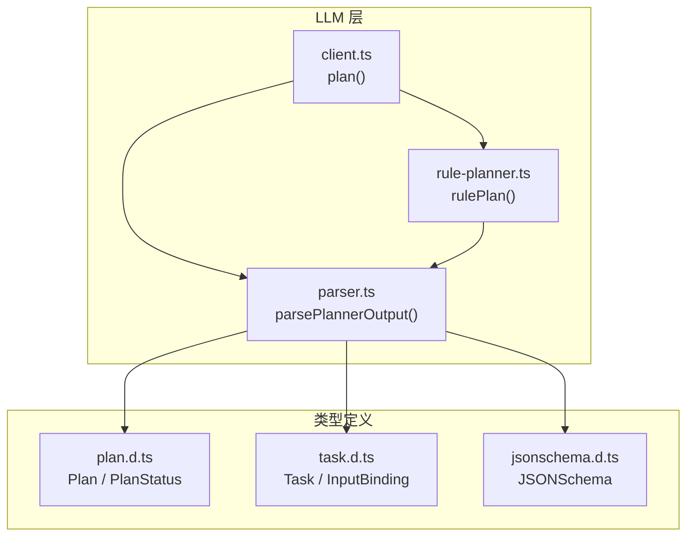
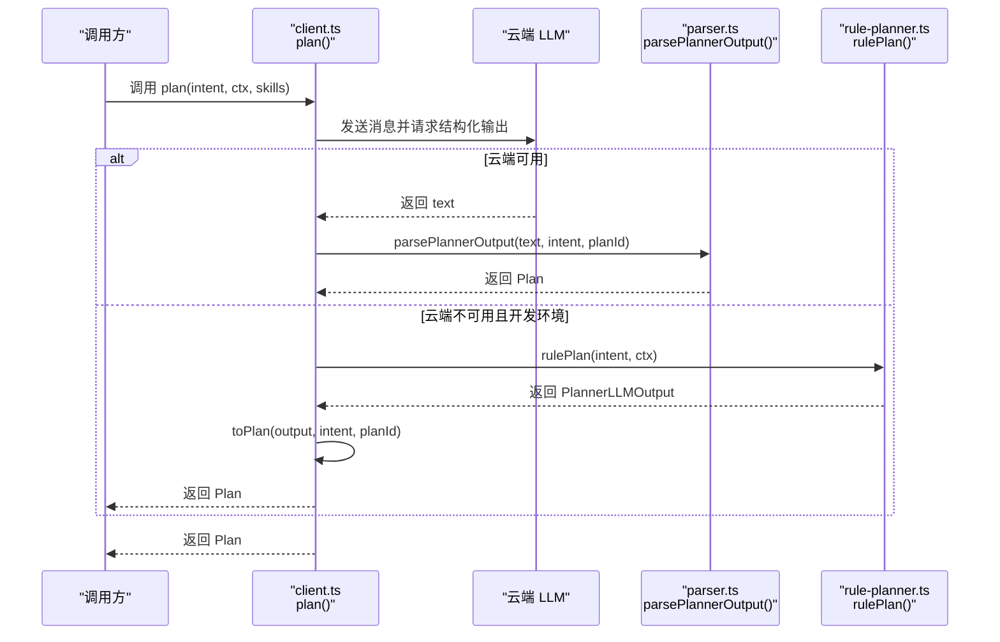
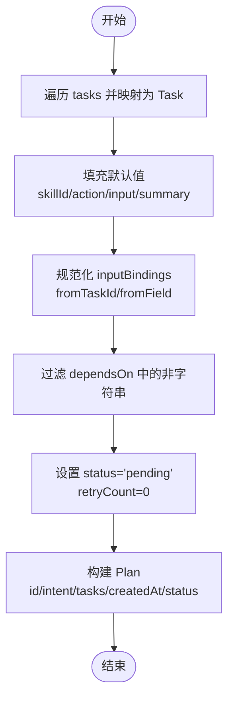
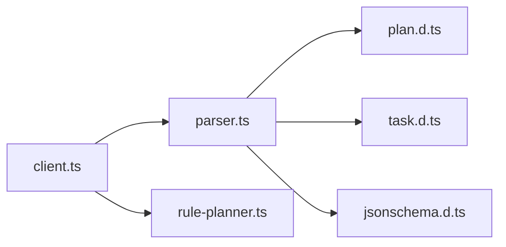

# 解析器

<cite>
**本文引用的文件**   
- [parser.ts](file://miniprogram/src/llm/parser.ts)
- [client.ts](file://miniprogram/src/llm/client.ts)
- [rule-planner.ts](file://miniprogram/src/llm/rule-planner.ts)
- [plan.d.ts](file://miniprogram/src/types/plan.d.ts)
- [task.d.ts](file://miniprogram/src/types/task.d.ts)
- [jsonschema.d.ts](file://miniprogram/src/types/jsonschema.d.ts)
</cite>

## 目录
1. [引言](#引言)
2. [项目结构](#项目结构)
3. [核心组件](#核心组件)
4. [架构总览](#架构总览)
5. [详细组件分析](#详细组件分析)
6. [依赖关系分析](#依赖关系分析)
7. [性能考量](#性能考量)
8. [故障排查指南](#故障排查指南)
9. [结论](#结论)
10. [附录](#附录)

## 引言
本文件聚焦 WAIC-WeChat-MiniProgram 的 LLM 结构化输出解析器模块，围绕以下目标展开：
- 详细说明 parsePlannerOutput 函数的实现原理，解释如何将 LLM 返回的结构化文本转换为 Plan 对象。
- 解释 LLMParserError 错误类的处理机制，包括解析失败时的错误分类与恢复策略。
- 说明 JSON 模式的解析过程，以及如何确保 LLM 输出符合预期的 Schema 定义。
- 详细介绍 toPlan 函数的转换逻辑，将原始数据映射到标准的 Plan 数据结构。
- 说明数据验证和清洗机制，包括字段完整性检查、类型转换、默认值处理等。
- 提供解析失败的常见原因与解决方案，包含具体解析示例与错误处理模式，帮助开发者调试。

## 项目结构
解析器相关代码主要位于 miniprogram/src/llm 与 miniprogram/src/types 两个目录：
- miniprogram/src/llm/parser.ts：解析器核心实现，包含 extractJson、validatePlannerOutput、toPlan、parsePlannerOutput 以及 LLMParserError。
- miniprogram/src/llm/client.ts：LLM 客户端统一接口，负责调用云端 LLM、异常降级、并调用解析器生成 Plan。
- miniprogram/src/llm/rule-planner.ts：规则式任务规划器（开发模式降級備援），产出与 LLM Planner 同构的 PlannerLLMOutput，再交由 toPlan 补全为 Plan。
- miniprogram/src/types/plan.d.ts：Plan 类型定义，包括状态枚举与摘要结构。
- miniprogram/src/types/task.d.ts：Task 类型定义，包括输入绑定、依赖、状态等。
- miniprogram/src/types/jsonschema.d.ts：JSON Schema 简化类型声明，用于约束与描述 LLM 输出结构。



图表来源
- [client.ts:56-119](file://miniprogram/src/llm/client.ts#L56-L119)
- [parser.ts:39-122](file://miniprogram/src/llm/parser.ts#L39-L122)
- [rule-planner.ts:82-164](file://miniprogram/src/llm/rule-planner.ts#L82-L164)
- [plan.d.ts:11-33](file://miniprogram/src/types/plan.d.ts#L11-L33)
- [task.d.ts:21-59](file://miniprogram/src/types/task.d.ts#L21-L59)
- [jsonschema.d.ts:20-50](file://miniprogram/src/types/jsonschema.d.ts#L20-L50)

章节来源
- [parser.ts:1-127](file://miniprogram/src/llm/parser.ts#L1-L127)
- [client.ts:1-153](file://miniprogram/src/llm/client.ts#L1-L153)
- [rule-planner.ts:1-165](file://miniprogram/src/llm/rule-planner.ts#L1-L165)
- [plan.d.ts:1-51](file://miniprogram/src/types/plan.d.ts#L1-L51)
- [task.d.ts:1-59](file://miniprogram/src/types/task.d.ts#L1-L59)
- [jsonschema.d.ts:1-50](file://miniprogram/src/types/jsonschema.d.ts#L1-L50)

## 核心组件
- LLMParserError：解析失败时抛出的错误类，携带 message 与可选 rawText，便于上层记录原始输出。
- extractJson：从 LLM 原始文本中抽取 JSON，支持 Markdown 包裹 ```json ... ``` 或裸 JSON 对象。
- validatePlannerOutput：校验 PlannerLLMOutput 结构，要求 tasks 数组存在且每个 task 具备 skillId、action、input、dependsOn 等字段。
- toPlan：将 PlannerLLMOutput 转换为标准 Plan，补全 Task ID、status、retryCount、summary 等字段，并规范化 inputBindings。
- parsePlannerOutput：完整流水线函数，串联 extractJson → validatePlannerOutput → toPlan，返回 Plan。

章节来源
- [parser.ts:17-122](file://miniprogram/src/llm/parser.ts#L17-L122)

## 架构总览
LLM 客户端 plan 流程如下：
- 构造 Prompt 并调用云端 LLM。
- 若云端不可用且在开发环境，则降级至 rule-planner 生成 PlannerLLMOutput，再经 toPlan 转为 Plan。
- 正常路径下，调用 parsePlannerOutput 对 LLM 返回文本进行解析与校验，最终得到 Plan。
- 若解析失败，捕获 LLMParserError 并包装为 PlannerLLMError 抛出，同时记录日志。



图表来源
- [client.ts:56-119](file://miniprogram/src/llm/client.ts#L56-L119)
- [parser.ts:117-122](file://miniprogram/src/llm/parser.ts#L117-L122)
- [rule-planner.ts:82-164](file://miniprogram/src/llm/rule-planner.ts#L82-L164)

## 详细组件分析

### parsePlannerOutput 函数实现原理
parsePlannerOutput 是解析器的入口函数，接收三个参数：
- rawText：LLM 返回的原始文本。
- intent：用户原始意图，作为 Plan.intent 的后备值。
- planId：计划标识符，用于 Plan.id。

内部执行顺序：
1. 调用 extractJson(rawText) 抽取 JSON。
2. 调用 validatePlannerOutput(json) 校验结构。
3. 调用 toPlan(validated, intent, planId) 转换为 Plan。

该函数保证：
- 即使 LLM 在 JSON 外夹杂文字，也能通过正则抽取 JSON。
- 校验失败会抛出 LLMParserError，由上层捕获并做相应处理。
- 最终返回的 Plan 具有稳定的结构与字段，供 Orchestrator 调度使用。

章节来源
- [parser.ts:117-122](file://miniprogram/src/llm/parser.ts#L117-L122)

### LLMParserError 错误类与处理机制
LLMParserError 继承自 Error，并在构造函数中设置 name 为 'LLMParserError'，便于区分错误类型。它支持携带 rawText，方便上层记录原始输出以便调试。

在 client.ts 中，当 parsePlannerOutput 抛出 LLMParserError 时：
- 记录日志，包含原始输出的前 200 字符。
- 包装为 PlannerLLMError 抛出，提示“LLM 输出无法解析，请重新描述意图”。

这种设计实现了：
- 错误分类清晰：LLMParserError 表示解析阶段失败；PlannerLLMError 表示规划阶段整体失败。
- 恢复策略明确：在开发环境可降级到 rule-planner；在生产环境则向上抛出，避免静默失败。

章节来源
- [parser.ts:17-23](file://miniprogram/src/llm/parser.ts#L17-L23)
- [client.ts:104-115](file://miniprogram/src/llm/client.ts#L104-L115)

### JSON 模式的解析与 Schema 校验
extractJson 的解析策略：
- 优先尝试匹配 Markdown 包裹的 JSON（```json ... ```）。
- 若失败，尝试匹配首个 JSON 对象（/\{[\s\S]*\}/）。
- 若仍失败，抛出 LLMParserError，提示找不到 JSON 结构。

validatePlannerOutput 的校验规则：
- 顶层必须是对象。
- 必须包含 tasks 数组。
- 每个 task 必须包含：
  - skillId：字符串。
  - action：字符串。
  - input：对象（非 null）。
  - dependsOn：字符串数组。

这些规则确保了 LLM 的输出符合 PlannerLLMOutput 的预期结构。虽然当前未引入外部 JSON Schema 验证库，但 validatePlannerOutput 已实现最小必要校验，满足 MicroMate bootstrap 阶段的约束需求。

章节来源
- [parser.ts:39-87](file://miniprogram/src/llm/parser.ts#L39-L87)
- [jsonschema.d.ts:20-50](file://miniprogram/src/types/jsonschema.d.ts#L20-L50)

### toPlan 转换逻辑与数据清洗
toPlan 将 PlannerLLMOutput 转换为标准 Plan，并进行以下数据清洗：
- Task ID：按索引生成 task_001、task_002 等三位数补零格式。
- skillId、action：若缺失则设为空字符串。
- input：若缺失则设为空对象。
- inputBindings：规范化每个绑定的 fromTaskId 与 fromField，缺失则设为空字符串。
- dependsOn：过滤非字符串元素，确保仅保留有效依赖。
- status：初始化为 'pending'。
- retryCount：初始化为 0。
- summary：若缺失则使用 `${skillId}.${action}` 作为默认摘要。
- Plan 级别：id 使用传入 planId；intent 若缺失则回退到传入 intent；createdAt 使用当前时间戳；status 初始化为 'draft'。



图表来源
- [parser.ts:89-115](file://miniprogram/src/llm/parser.ts#L89-L115)

章节来源
- [parser.ts:89-115](file://miniprogram/src/llm/parser.ts#L89-L115)
- [task.d.ts:21-59](file://miniprogram/src/types/task.d.ts#L21-L59)
- [plan.d.ts:19-33](file://miniprogram/src/types/plan.d.ts#L19-L33)

### 规则式规划器与降级策略
rule-planner 在开发环境下作为降级方案，根据关键词识别意图并生成 PlannerLLMOutput：
- 高铁购票：识别出发城市、到达城市、日期、座席类型，生成 search_train 与可选 book_ticket 任务。
- 星巴克点单：识别饮品名称，生成 search_store 与可选 place_order 任务。
- 若无法识别，返回空 tasks 与提示信息。

生成的 PlannerLLMOutput 直接交给 toPlan 转换为 Plan，确保下游无感知。

章节来源
- [rule-planner.ts:1-165](file://miniprogram/src/llm/rule-planner.ts#L1-L165)
- [parser.ts:89-115](file://miniprogram/src/llm/parser.ts#L89-L115)

## 依赖关系分析
- parser.ts 依赖 types/plan.d.ts 与 types/task.d.ts，以生成标准 Plan 与 Task。
- client.ts 依赖 parser.ts 与 rule-planner.ts，负责编排 LLM 调用与降级逻辑。
- jsonschema.d.ts 提供 JSON Schema 类型定义，虽未直接参与运行时校验，但用于文档与类型约束。



图表来源
- [parser.ts:12-13](file://miniprogram/src/llm/parser.ts#L12-L13)
- [client.ts:9-18](file://miniprogram/src/llm/client.ts#L9-L18)
- [jsonschema.d.ts:1-50](file://miniprogram/src/types/jsonschema.d.ts#L1-L50)

章节来源
- [parser.ts:1-127](file://miniprogram/src/llm/parser.ts#L1-L127)
- [client.ts:1-153](file://miniprogram/src/llm/client.ts#L1-L153)
- [jsonschema.d.ts:1-50](file://miniprogram/src/types/jsonschema.d.ts#L1-L50)

## 性能考量
- extractJson 使用正则表达式抽取 JSON，时间复杂度近似 O(n)，n 为原始文本长度。
- validatePlannerOutput 遍历 tasks 数组，时间复杂度 O(m)，m 为任务数量。
- toPlan 对 tasks 进行映射与规范化，时间复杂度 O(m)。
- 整体解析流水线时间复杂度 O(n + m)，空间复杂度 O(m) 用于构建 Plan 对象。

优化建议：
- 若 LLM 输出极大，可在 extractJson 中限制最大匹配长度，避免正则回溯开销。
- 对于大规模任务列表，可考虑并行校验与映射，但需权衡内存占用。

[本节为一般性指导，不直接分析具体文件]

## 故障排查指南
常见解析失败原因与解决方案：
- LLM 输出不是 JSON：
  - 现象：extractJson 抛出“找不到 JSON 结构”或“JSON 解析失敗”。
  - 解决：检查 Prompt 是否明确要求输出 JSON，并确保 LLM 返回中包含合法 JSON。
- 缺少 tasks 数组：
  - 现象：validatePlannerOutput 抛出“缺少 tasks 陣列”。
  - 解决：调整 Prompt，确保 LLM 输出包含 tasks 字段。
- 任务字段缺失或类型不匹配：
  - 现象：validatePlannerOutput 抛出“task[i] 缺少 skillId/action/input/dependsOn[]”。
  - 解决：修正 Prompt 或后处理逻辑，确保每个 task 包含必需字段且类型正确。
- inputBindings 字段不规范：
  - 现象：toPlan 中 fromTaskId 或 fromField 为空。
  - 解决：确保 inputBindings 中每个绑定都包含有效的 fromTaskId 与 fromField。

错误处理模式：
- 在 client.ts 中捕获 LLMParserError，记录原始输出前 200 字符，并抛出 PlannerLLMError。
- 开发环境下，若云端 LLM 不可用，自动降级到 rule-planner，保证本地演示链路畅通。

章节来源
- [parser.ts:39-87](file://miniprogram/src/llm/parser.ts#L39-L87)
- [client.ts:104-115](file://miniprogram/src/llm/client.ts#L104-L115)

## 结论
解析器模块通过 parsePlannerOutput 串联 JSON 抽取、结构校验与数据转换，确保 LLM 输出能够稳定地转化为 Plan 对象。LLMParserError 提供了清晰的错误分类与恢复策略，结合 client.ts 的降级机制，保证了系统在开发与生产环境下的鲁棒性。toPlan 的数据清洗逻辑进一步增强了 Plan 结构的稳定性，便于后续调度与执行。

[本节为总结性内容，不直接分析具体文件]

## 附录
- 解析示例：
  - 成功示例：LLM 返回包含 tasks 数组的 JSON，每个 task 具备 skillId、action、input、dependsOn，parsePlannerOutput 成功返回 Plan。
  - 失败示例：LLM 返回纯文本或非 JSON 结构，extractJson 抛出错误；或 tasks 缺失关键字段，validatePlannerOutput 抛出错误。
- 最佳实践：
  - 在 Prompt 中明确要求 LLM 输出 JSON，并提供 Schema 示例。
  - 在业务层捕获 LLMParserError，记录原始输出并提示用户重新描述意图。
  - 在开发环境启用 rule-planner 降级，确保本地调试链路完整。

[本节为补充性内容，不直接分析具体文件]