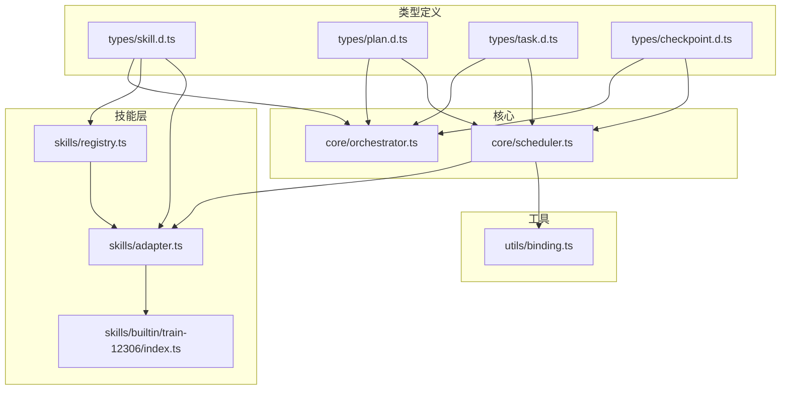
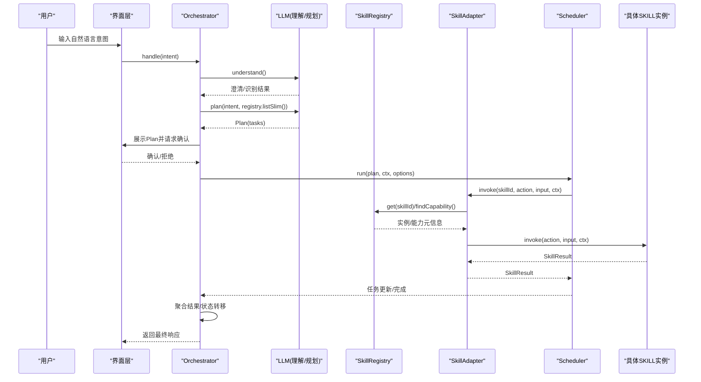
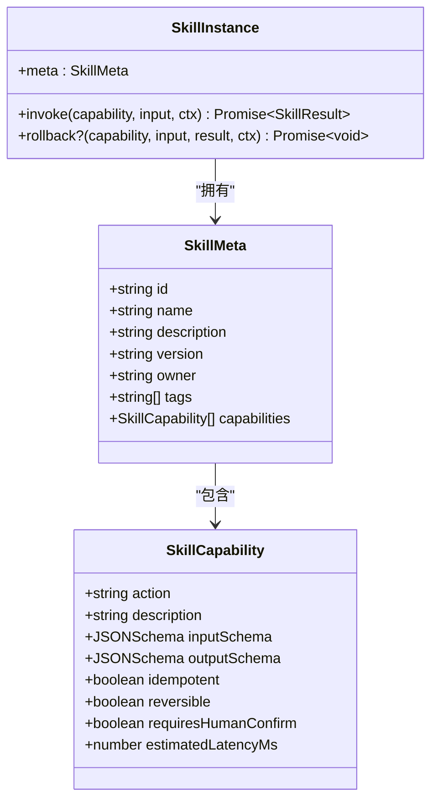
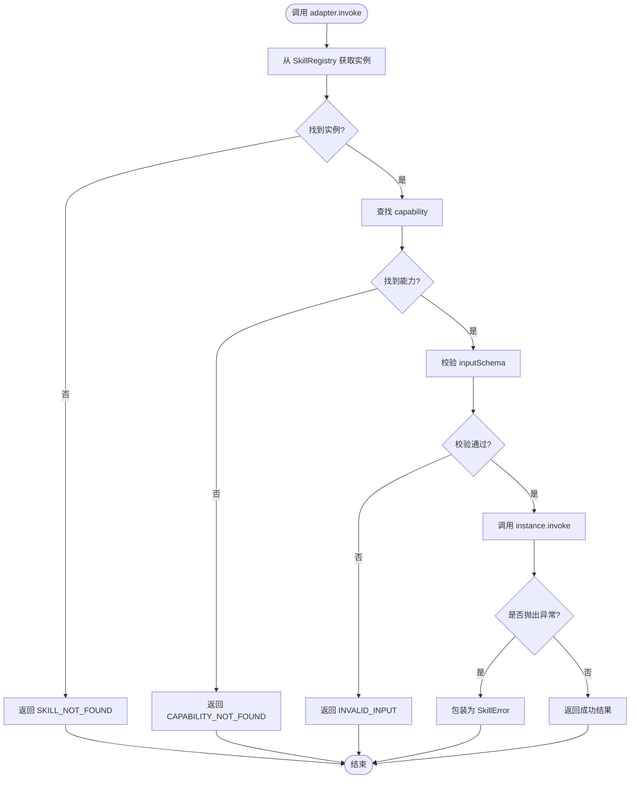
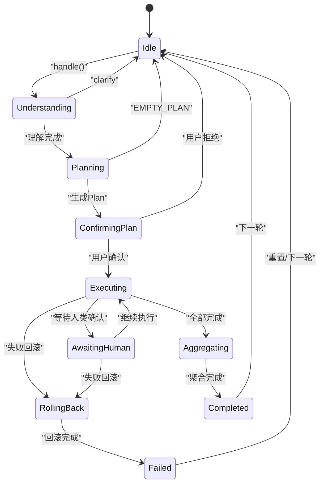
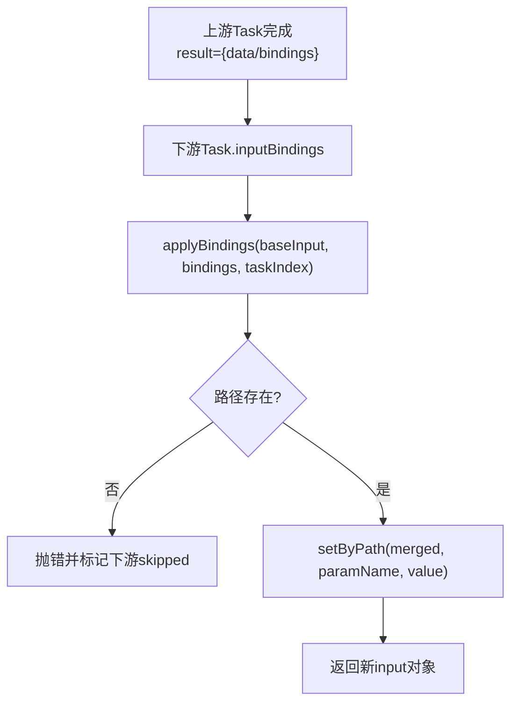
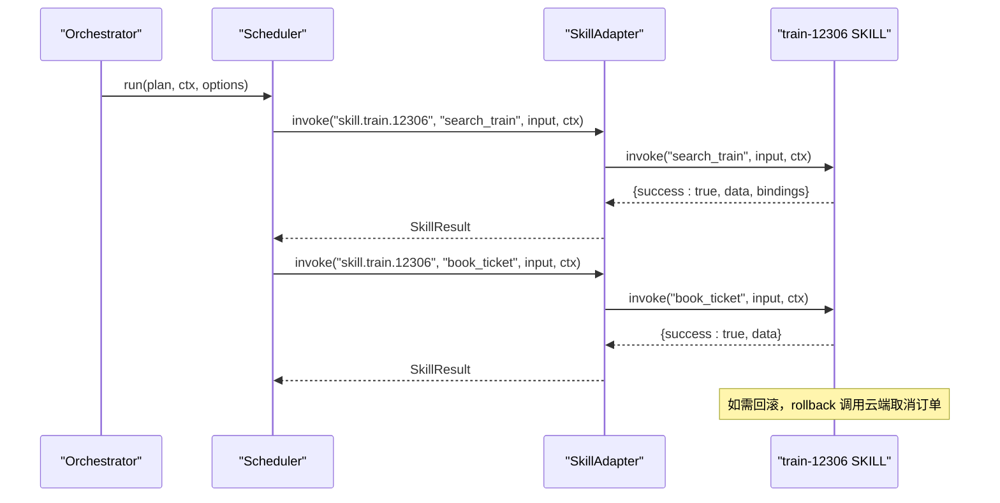
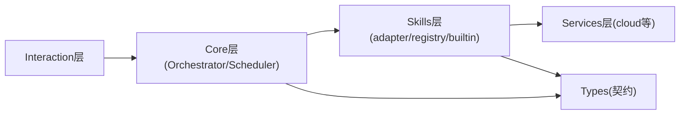

# SKILL架构设计

<cite>
**本文引用的文件**   
- [miniprogram/src/types/skill.d.ts](file://miniprogram/src/types/skill.d.ts)
- [miniprogram/src/core/orchestrator.ts](file://miniprogram/src/core/orchestrator.ts)
- [miniprogram/src/core/scheduler.ts](file://miniprogram/src/core/scheduler.ts)
- [miniprogram/src/skills/registry.ts](file://miniprogram/src/skills/registry.ts)
- [miniprogram/src/skills/adapter.ts](file://miniprogram/src/skills/adapter.ts)
- [miniprogram/src/skills/builtin/train-12306/index.ts](file://miniprogram/src/skills/builtin/train-12306/index.ts)
- [miniprogram/src/types/plan.d.ts](file://miniprogram/src/types/plan.d.ts)
- [miniprogram/src/types/task.d.ts](file://miniprogram/src/types/task.d.ts)
- [miniprogram/src/types/checkpoint.d.ts](file://miniprogram/src/types/checkpoint.d.ts)
- [miniprogram/src/utils/binding.ts](file://miniprogram/src/utils/binding.ts)
</cite>

## 目录
1. [引言](#引言)
2. [项目结构](#项目结构)
3. [核心组件](#核心组件)
4. [架构总览](#架构总览)
5. [详细组件分析](#详细组件分析)
6. [依赖关系分析](#依赖关系分析)
7. [性能与可靠性](#性能与可靠性)
8. [故障排查指南](#故障排查指南)
9. [结论](#结论)
10. [附录：实现一个符合规范的SKILL](#附录实现一个符合规范的skill)

## 引言
本技术文档围绕 WAIC-WeChat-MiniProgram 的 SKILL 架构展开，重点解释插件化设计理念、SkillInstance 接口、SkillMeta 元数据、SkillCapability 能力描述等核心概念；梳理从注册到卸载的完整生命周期；说明 SKILL 与 Orchestrator 编排器的集成机制、任务调度协议与状态同步；阐述错误处理策略、重试语义与事务回滚支持；并通过架构图和数据流图展示各组件交互关系。文末提供“如何正确实现一个符合规范的 SKILL”的实践指引。

## 项目结构
本项目在小程序端采用分层组织：
- types：类型定义（Skill、Plan、Task、Checkpoint 等）
- core：Orchestrator 编排器与 Scheduler 调度器
- skills：SKILL 注册中心、统一适配器与内置 SKILL 示例
- utils：工具函数（绑定解析、校验、日志等）
- services / llm / interaction：上层服务与交互层（不在本文深入）

图表来源
- [miniprogram/src/types/skill.d.ts:1-119](file://miniprogram/src/types/skill.d.ts#L1-L119)
- [miniprogram/src/types/plan.d.ts:1-51](file://miniprogram/src/types/plan.d.ts#L1-L51)
- [miniprogram/src/types/task.d.ts:1-59](file://miniprogram/src/types/task.d.ts#L1-L59)
- [miniprogram/src/types/checkpoint.d.ts:1-44](file://miniprogram/src/types/checkpoint.d.ts#L1-L44)
- [miniprogram/src/core/orchestrator.ts:1-340](file://miniprogram/src/core/orchestrator.ts#L1-L340)
- [miniprogram/src/core/scheduler.ts:1-245](file://miniprogram/src/core/scheduler.ts#L1-L245)
- [miniprogram/src/skills/registry.ts:1-91](file://miniprogram/src/skills/registry.ts#L1-L91)
- [miniprogram/src/skills/adapter.ts:1-115](file://miniprogram/src/skills/adapter.ts#L1-L115)
- [miniprogram/src/skills/builtin/train-12306/index.ts:1-293](file://miniprogram/src/skills/builtin/train-12306/index.ts#L1-L293)
- [miniprogram/src/utils/binding.ts:1-50](file://miniprogram/src/utils/binding.ts#L1-L50)

章节来源
- [miniprogram/src/types/skill.d.ts:1-119](file://miniprogram/src/types/skill.d.ts#L1-L119)
- [miniprogram/src/core/orchestrator.ts:1-340](file://miniprogram/src/core/orchestrator.ts#L1-L340)
- [miniprogram/src/core/scheduler.ts:1-245](file://miniprogram/src/core/scheduler.ts#L1-L245)
- [miniprogram/src/skills/registry.ts:1-91](file://miniprogram/src/skills/registry.ts#L1-L91)
- [miniprogram/src/skills/adapter.ts:1-115](file://miniprogram/src/skills/adapter.ts#L1-L115)
- [miniprogram/src/skills/builtin/train-12306/index.ts:1-293](file://miniprogram/src/skills/builtin/train-12306/index.ts#L1-L293)
- [miniprogram/src/types/plan.d.ts:1-51](file://miniprogram/src/types/plan.d.ts#L1-L51)
- [miniprogram/src/types/task.d.ts:1-59](file://miniprogram/src/types/task.d.ts#L1-L59)
- [miniprogram/src/types/checkpoint.d.ts:1-44](file://miniprogram/src/types/checkpoint.d.ts#L1-L44)
- [miniprogram/src/utils/binding.ts:1-50](file://miniprogram/src/utils/binding.ts#L1-L50)

## 核心组件
- SkillInstance 接口：定义 SKILL 对外暴露的 meta、invoke 与可选 rollback 方法，是插件化的最小契约。
- SkillMeta 与 SkillMetaSlim：前者为 LLM 规划提供完整元信息，后者为降低 token 消耗而裁剪。
- SkillCapability：声明每个 action 的能力语义、输入输出 Schema、幂等性、可回滚性、是否需要人类确认、预估延迟等。
- SkillRegistry：注册中心，负责注册/反注册、列出完整或精简元信息、按 skillId/action 查询能力属性。
- SkillAdapter：统一调用入口，负责 schema 校验、埋点、错误包装、回滚封装。
- Orchestrator：状态机编排器，驱动理解→规划→确认→执行→聚合→完成/失败的全流程。
- Scheduler：DAG 调度器，按依赖并行执行任务，处理 checkpoint 串行化、死锁检测、级联跳过与中止。
- Plan/Task：计划与任务模型，承载 DAG 结构与状态流转。
- Checkpoint：人类确认协议，保证写操作需用户同意且弹窗互斥。
- Binding：跨 Task 的数据绑定解析器，将上游输出注入下游输入。

章节来源
- [miniprogram/src/types/skill.d.ts:16-119](file://miniprogram/src/types/skill.d.ts#L16-L119)
- [miniprogram/src/skills/registry.ts:16-91](file://miniprogram/src/skills/registry.ts#L16-L91)
- [miniprogram/src/skills/adapter.ts:1-115](file://miniprogram/src/skills/adapter.ts#L1-L115)
- [miniprogram/src/core/orchestrator.ts:28-340](file://miniprogram/src/core/orchestrator.ts#L28-L340)
- [miniprogram/src/core/scheduler.ts:27-245](file://miniprogram/src/core/scheduler.ts#L27-L245)
- [miniprogram/src/types/plan.d.ts:12-51](file://miniprogram/src/types/plan.d.ts#L12-L51)
- [miniprogram/src/types/task.d.ts:11-59](file://miniprogram/src/types/task.d.ts#L11-L59)
- [miniprogram/src/types/checkpoint.d.ts:17-44](file://miniprogram/src/types/checkpoint.d.ts#L17-L44)
- [miniprogram/src/utils/binding.ts:18-50](file://miniprogram/src/utils/binding.ts#L18-L50)

## 架构总览
SKILL 架构以“插件化 + 编排 + 调度”为核心：
- 插件化：通过 SkillInstance 契约接入任意业务 SKILL，由 SkillRegistry 管理，SkillAdapter 统一调用。
- 编排：Orchestrator 维护 Agent 状态机，协调 LLM 理解与规划、用户确认、任务执行与结果聚合。
- 调度：Scheduler 基于 DAG 并行执行任务，处理人类确认、失败级联、死锁检测与运行令牌失效中止。

图表来源
- [miniprogram/src/core/orchestrator.ts:106-256](file://miniprogram/src/core/orchestrator.ts#L106-L256)
- [miniprogram/src/core/scheduler.ts:77-128](file://miniprogram/src/core/scheduler.ts#L77-L128)
- [miniprogram/src/skills/adapter.ts:37-85](file://miniprogram/src/skills/adapter.ts#L37-L85)
- [miniprogram/src/skills/registry.ts:16-91](file://miniprogram/src/skills/registry.ts#L16-L91)

## 详细组件分析

### 插件化契约与元数据
- SkillInstance：包含 meta、invoke 与可选 rollback。rollback 仅在 reversible=true 时必须实现，否则应抛错。
- SkillMeta：id/name/description/version/owner/tags/capabilities，其中 description 必须清晰表达“能做/不能做/何时触发”，作为 LLM 路由依据。
- SkillCapability：action/description/inputSchema/outputSchema/idempotent/reversible/requiresHumanConfirm/estimatedLatencyMs。
- SkillMetaSlim：仅保留 LLM 规划所需字段，减少 token 消耗。

图表来源
- [miniprogram/src/types/skill.d.ts:16-119](file://miniprogram/src/types/skill.d.ts#L16-L119)

章节来源
- [miniprogram/src/types/skill.d.ts:16-119](file://miniprogram/src/types/skill.d.ts#L16-L119)

### 注册中心与统一适配器
- SkillRegistry：
  - register/unregister：注册/反注册 SKILL，重复 id 抛错。
  - list/listSlim：供管理与 LLM 使用。
  - findCapability：按 (skillId, action) 查询能力属性（幂等、可回滚、是否需人类确认等）。
- SkillAdapter：
  - invoke：查找实例与能力、schema 校验、埋点、调用 SKILL、统一错误包装。
  - rollback：若未实现则记录警告并返回 rolled=false。
  - getCapability：供 Scheduler 读取能力元信息。

图表来源
- [miniprogram/src/skills/adapter.ts:37-85](file://miniprogram/src/skills/adapter.ts#L37-L85)
- [miniprogram/src/skills/registry.ts:16-91](file://miniprogram/src/skills/registry.ts#L16-L91)

章节来源
- [miniprogram/src/skills/registry.ts:16-91](file://miniprogram/src/skills/registry.ts#L16-L91)
- [miniprogram/src/skills/adapter.ts:1-115](file://miniprogram/src/skills/adapter.ts#L1-L115)

### 编排器与调度器协作
- Orchestrator：
  - 状态机：idle → understanding → planning → confirming_plan → executing → aggregating → completed/failed，含 awaiting_human 与 rolling_back。
  - 关键流程：handle(intent) 串联理解、规划、确认、执行、聚合；reset() 强制归位 idle 并失效 runToken。
  - 失败回滚：rollbackIfNeeded 按反序撤销已成功且可逆的任务。
  - 任务更新联动：将 task.waiting_human 映射为 awaiting_human，便于 UI 提示。
- Scheduler：
  - DAG 调度：每轮找出 ready 任务并并行执行，直到全部终态或死锁。
  - 人类确认：requiresHumanConfirm 时进入 waiting_human，checkpoint 序列化互斥。
  - 失败级联：失败任务将其下游 pending 任务标记 skipped。
  - 运行令牌：isRunActive 探测 runToken 失效后中止并标记 skipped。

图表来源
- [miniprogram/src/core/orchestrator.ts:60-71](file://miniprogram/src/core/orchestrator.ts#L60-L71)
- [miniprogram/src/core/orchestrator.ts:106-256](file://miniprogram/src/core/orchestrator.ts#L106-L256)
- [miniprogram/src/core/orchestrator.ts:278-303](file://miniprogram/src/core/orchestrator.ts#L278-L303)

章节来源
- [miniprogram/src/core/orchestrator.ts:28-340](file://miniprogram/src/core/orchestrator.ts#L28-L340)
- [miniprogram/src/core/scheduler.ts:27-245](file://miniprogram/src/core/scheduler.ts#L27-L245)

### 数据绑定与跨任务流
- InputBinding：声明 fromTaskId 与 fromField，用于下游引用上游输出。
- applyBindings：解析 bindings，优先取 result.bindings，其次 result.data；失败抛错并触发级联跳过。
- indexTasks：构建任务索引 Map，提升查找效率。

图表来源
- [miniprogram/src/utils/binding.ts:18-50](file://miniprogram/src/utils/binding.ts#L18-L50)
- [miniprogram/src/types/task.d.ts:21-44](file://miniprogram/src/types/task.d.ts#L21-L44)

章节来源
- [miniprogram/src/utils/binding.ts:18-50](file://miniprogram/src/utils/binding.ts#L18-L50)
- [miniprogram/src/types/task.d.ts:21-44](file://miniprogram/src/types/task.d.ts#L21-L44)

### 内置示例：12306 火车票 SKILL
该示例展示了标准 SKILL 的实现方式：
- 定义 meta.capabilities：search_train（只读、幂等、无需确认）、book_ticket（写操作、非幂等、需人类确认、可回滚）。
- 实现 instance.invoke：根据 action 分发到 search/book 逻辑。
- 实现 instance.rollback：对 book_ticket 调用云端取消接口。
- 输出 bindings：search_train 返回 bindings，供下游 book_ticket 引用（如 trainNo、priceCent）。

图表来源
- [miniprogram/src/skills/builtin/train-12306/index.ts:69-190](file://miniprogram/src/skills/builtin/train-12306/index.ts#L69-L190)
- [miniprogram/src/skills/builtin/train-12306/index.ts:192-276](file://miniprogram/src/skills/builtin/train-12306/index.ts#L192-L276)
- [miniprogram/src/skills/adapter.ts:37-85](file://miniprogram/src/skills/adapter.ts#L37-L85)

章节来源
- [miniprogram/src/skills/builtin/train-12306/index.ts:1-293](file://miniprogram/src/skills/builtin/train-12306/index.ts#L1-L293)

## 依赖关系分析
- 单向依赖：interaction → core → skills → llm（规范 §12.3），core 不得反向依赖 interaction。
- Orchestrator 依赖：
  - LLM 客户端（理解/规划/聚合）
  - Scheduler（任务调度）
  - SkillAdapter/SkillRegistry（能力发现与调用）
  - Checkpoint/ConfirmPlan（人类确认回调）
- Scheduler 依赖：
  - SkillAdapter（统一调用）
  - Binding（跨任务绑定解析）
  - Checkpoint（人类确认）
- Skills 依赖：
  - Service 层（如 cloud）进行远端调用，禁止直接 import wx.*。

图表来源
- [miniprogram/src/core/orchestrator.ts:13-26](file://miniprogram/src/core/orchestrator.ts#L13-L26)
- [miniprogram/src/core/scheduler.ts:18-26](file://miniprogram/src/core/scheduler.ts#L18-L26)
- [miniprogram/src/skills/adapter.ts:13-17](file://miniprogram/src/skills/adapter.ts#L13-L17)
- [miniprogram/src/skills/builtin/train-12306/index.ts:13-16](file://miniprogram/src/skills/builtin/train-12306/index.ts#L13-L16)

章节来源
- [miniprogram/src/core/orchestrator.ts:13-26](file://miniprogram/src/core/orchestrator.ts#L13-L26)
- [miniprogram/src/core/scheduler.ts:18-26](file://miniprogram/src/core/scheduler.ts#L18-L26)
- [miniprogram/src/skills/adapter.ts:13-17](file://miniprogram/src/skills/adapter.ts#L13-L17)
- [miniprogram/src/skills/builtin/train-12306/index.ts:13-16](file://miniprogram/src/skills/builtin/train-12306/index.ts#L13-L16)

## 性能与可靠性
- 并发与吞吐：
  - Scheduler 使用 Promise.allSettled 并行执行 ready 任务，提高吞吐。
  - checkpoint 序列化互斥，避免多个弹窗互相覆盖导致确认丢失。
- 幂等与重试：
  - Capability.idempotent 标识幂等能力，便于上层决策重试策略。
  - SkillError.retryable 指示网络类错误可重试，业务类不可重试。
- 事务与回滚：
  - Orchestrator.rollbackIfNeeded 按反序撤销已成功且可逆的任务，确保一致性。
  - 单点回滚失败不中断整体回滚，记录错误并继续。
- 死锁与中止：
  - Scheduler 检测无进展的死锁并抛出异常，Orchestrator 捕获后回滚并失败。
  - runToken 失效时中止调度，防止旧流程继续执行造成竞态。

[本节为通用指导，不直接分析具体文件]

## 故障排查指南
- BUSY：当前有任务在执行中，需等待完成或 reset。
- EMPTY_PLAN：LLM 无法识别意图，建议换说法或补充信息。
- DEADLOCK：任务卡死，检查依赖环与 checkpoint 阻塞。
- RUN_RESET：执行期间被 reset，注意已成功任务可能含写操作，不会自动回滚。
- INVALID_INPUT：入参不符合 inputSchema，检查 JSON Schema 与传入值。
- SKILL_NOT_FOUND/CAPABILITY_NOT_FOUND：检查注册与 action 名称是否正确。
- USER_CANCELLED：用户在 checkpoint 拒绝，查看交互层确认逻辑。
- ROLLBACK_FAILED：回滚失败原因见日志，检查 SKILL.rollback 实现与云端接口。

章节来源
- [miniprogram/src/core/orchestrator.ts:106-256](file://miniprogram/src/core/orchestrator.ts#L106-L256)
- [miniprogram/src/core/scheduler.ts:102-128](file://miniprogram/src/core/scheduler.ts#L102-L128)
- [miniprogram/src/skills/adapter.ts:37-85](file://miniprogram/src/skills/adapter.ts#L37-L85)

## 结论
SKILL 架构通过清晰的插件契约、统一的注册与适配层、稳健的编排与调度机制，实现了可扩展、可观测、可回滚的智能任务执行体系。结合人类确认与事务回滚，系统在灵活性与安全性之间取得平衡。遵循本文规范实现的 SKILL 能够无缝融入现有编排流程，并在复杂 DAG 场景下保持可靠执行。

[本节为总结，不直接分析具体文件]

## 附录：实现一个符合规范的SKILL
步骤概览：
- 定义 SkillMeta：
  - id/name/description/version/owner/tags 必须完整。
  - description 明确“能做/不能做/何时触发”。
  - capabilities 列出所有 action，并为每个 action 定义 inputSchema/outputSchema、idempotent、reversible、requiresHumanConfirm、estimatedLatencyMs。
- 实现 SkillInstance：
  - invoke：根据 action 分发逻辑，返回 SkillResult，必要时设置 bindings 供下游引用。
  - rollback：当 reversible=true 时必须实现，确保可回滚。
- 注册 SKILL：
  - 调用 SkillRegistry.register(instance)。
- 使用与测试：
  - 通过 Orchestrator.handle(intent) 端到端验证。
  - 使用 SkillRegistry.listSlim() 观察 Planner 可见能力。
  - 通过 SkillAdapter.getCapability 检查能力属性是否符合预期。

参考实现路径
- 元数据与能力定义：[miniprogram/src/skills/builtin/train-12306/index.ts:69-157](file://miniprogram/src/skills/builtin/train-12306/index.ts#L69-L157)
- 调用与回滚实现：[miniprogram/src/skills/builtin/train-12306/index.ts:159-190](file://miniprogram/src/skills/builtin/train-12306/index.ts#L159-L190)
- 注册中心用法：[miniprogram/src/skills/registry.ts:16-91](file://miniprogram/src/skills/registry.ts#L16-L91)
- 统一调用入口：[miniprogram/src/skills/adapter.ts:37-85](file://miniprogram/src/skills/adapter.ts#L37-L85)

章节来源
- [miniprogram/src/skills/builtin/train-12306/index.ts:69-190](file://miniprogram/src/skills/builtin/train-12306/index.ts#L69-L190)
- [miniprogram/src/skills/registry.ts:16-91](file://miniprogram/src/skills/registry.ts#L16-L91)
- [miniprogram/src/skills/adapter.ts:37-85](file://miniprogram/src/skills/adapter.ts#L37-L85)