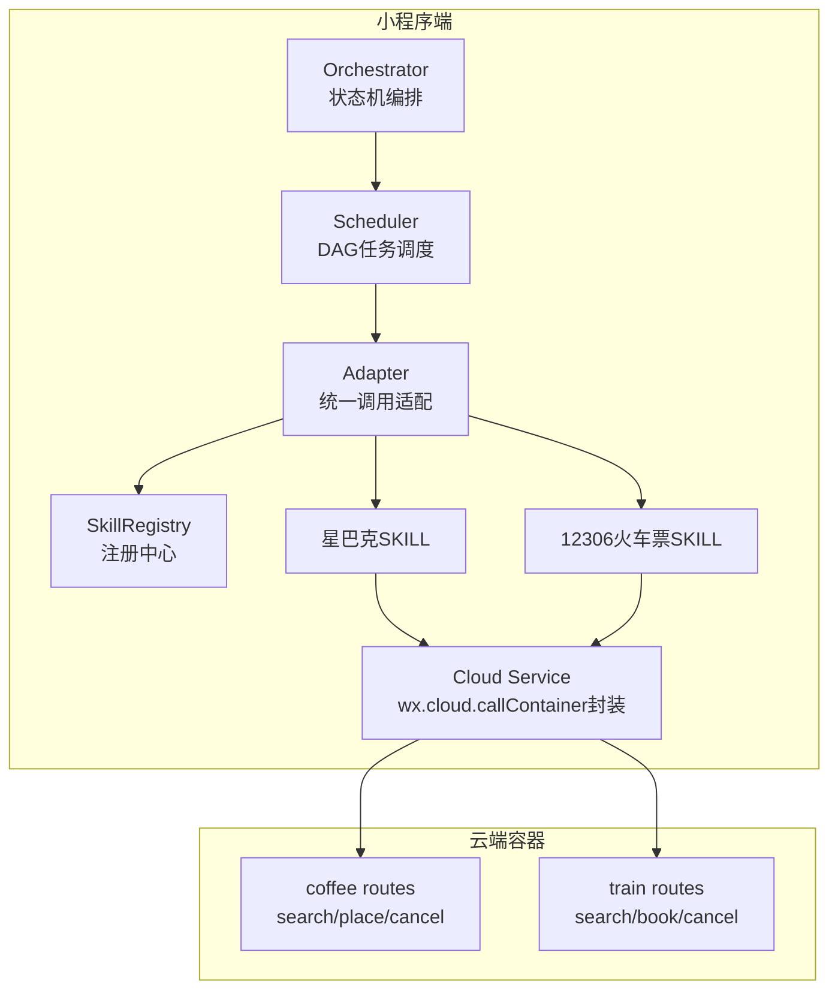
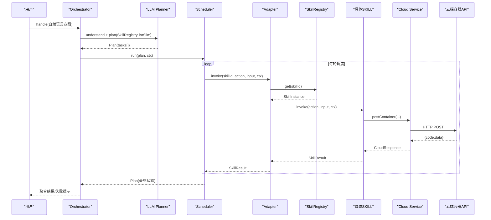
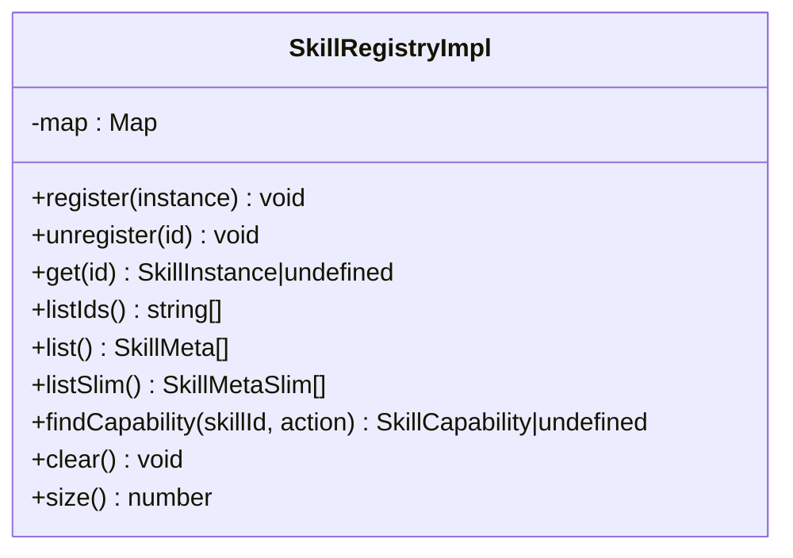
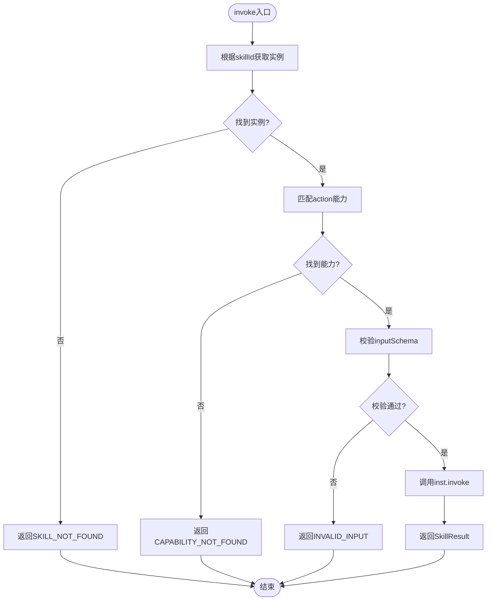
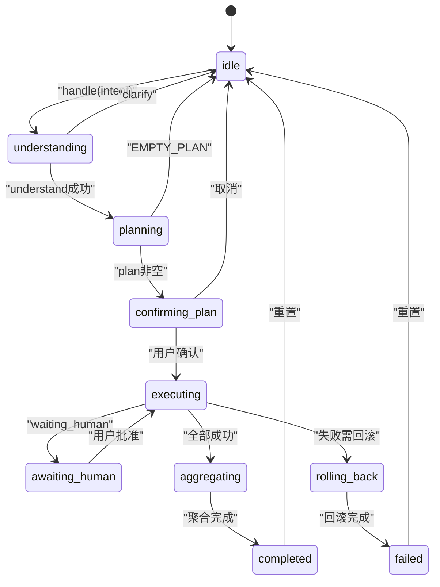
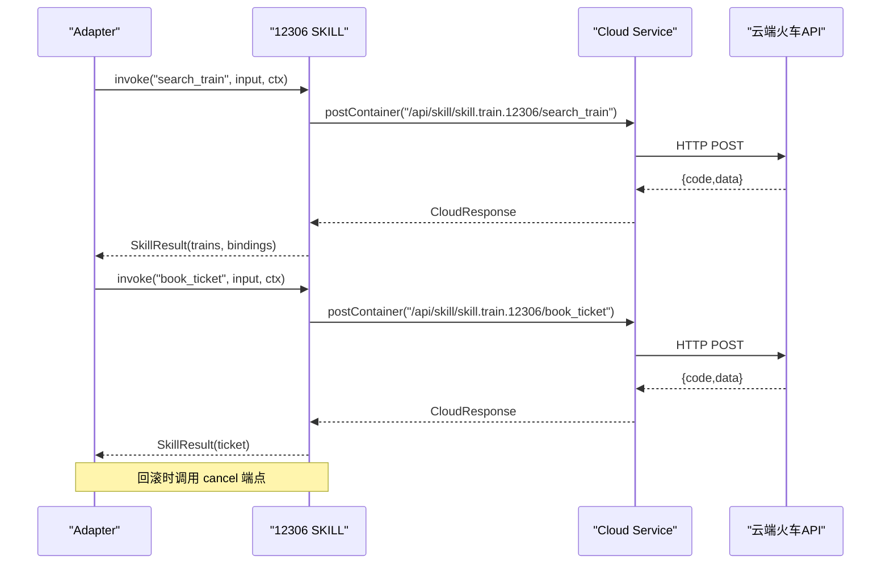
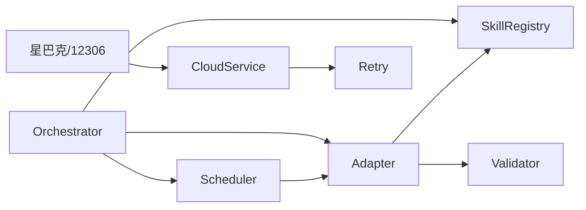

# SKILL系统

<cite>
**本文引用的文件**   
- [miniprogram/src/skills/registry.ts](file://miniprogram/src/skills/registry.ts)
- [miniprogram/src/skills/adapter.ts](file://miniprogram/src/skills/adapter.ts)
- [miniprogram/src/skills/index.ts](file://miniprogram/src/skills/index.ts)
- [miniprogram/src/types/skill.d.ts](file://miniprogram/src/types/skill.d.ts)
- [miniprogram/src/core/orchestrator.ts](file://miniprogram/src/core/orchestrator.ts)
- [miniprogram/src/core/scheduler.ts](file://miniprogram/src/core/scheduler.ts)
- [miniprogram/src/types/context.d.ts](file://miniprogram/src/types/context.d.ts)
- [miniprogram/src/services/cloud.ts](file://miniprogram/src/services/cloud.ts)
- [miniprogram/src/utils/retry.ts](file://miniprogram/src/utils/retry.ts)
- [miniprogram/src/skills/builtin/coffee-starbucks/index.ts](file://miniprogram/src/skills/builtin/coffee-starbucks/index.ts)
- [miniprogram/src/skills/builtin/train-12306/index.ts](file://miniprogram/src/skills/builtin/train-12306/index.ts)
- [cloudrun/src/skill-coffee.ts](file://cloudrun/src/skill-coffee.ts)
- [cloudrun/src/skill-train.ts](file://cloudrun/src/skill-train.ts)
</cite>

## 目录
1. [引言](#引言)
2. [项目结构](#项目结构)
3. [核心组件](#核心组件)
4. [架构总览](#架构总览)
5. [详细组件分析](#详细组件分析)
6. [依赖关系分析](#依赖关系分析)
7. [性能与可靠性](#性能与可靠性)
8. [故障排查指南](#故障排查指南)
9. [结论](#结论)
10. [附录：自定义SKILL开发指南](#附录自定义skill开发指南)

## 引言
本技术文档面向WAIC-WeChat-MiniProgram中的SKILL系统，目标是帮助开发者理解并扩展该插件化能力体系。文档覆盖以下主题：
- SKILL架构设计理念与插件化机制
- SkillRegistry注册中心实现原理
- SKILL适配器模式与统一接口抽象
- 内置星巴克咖啡预订与火车票预订的业务逻辑
- 自定义SKILL的开发流程、接口定义与最佳实践
- SKILL生命周期管理、错误处理与重试机制
- SKILL与Orchestrator的集成方式与调用协议

## 项目结构
SKILL系统位于小程序端`miniprogram/src/skills`与云端容器`cloudrun/src`两部分：
- 小程序端负责SKILL元数据声明、注册、调度执行、适配器封装与业务Skill实现
- 云端容器提供对应REST API，承载真实或模拟业务逻辑（如门店查询、下单、退票）

图表来源
- [miniprogram/src/core/orchestrator.ts:106-256](file://miniprogram/src/core/orchestrator.ts#L106-L256)
- [miniprogram/src/core/scheduler.ts:77-128](file://miniprogram/src/core/scheduler.ts#L77-L128)
- [miniprogram/src/skills/adapter.ts:37-85](file://miniprogram/src/skills/adapter.ts#L37-L85)
- [miniprogram/src/skills/registry.ts:16-71](file://miniprogram/src/skills/registry.ts#L16-L71)
- [miniprogram/src/skills/builtin/coffee-starbucks/index.ts:148-177](file://miniprogram/src/skills/builtin/coffee-starbucks/index.ts#L148-L177)
- [miniprogram/src/skills/builtin/train-12306/index.ts:159-190](file://miniprogram/src/skills/builtin/train-12306/index.ts#L159-L190)
- [miniprogram/src/services/cloud.ts:64-149](file://miniprogram/src/services/cloud.ts#L64-L149)
- [cloudrun/src/skill-coffee.ts:119-123](file://cloudrun/src/skill-coffee.ts#L119-L123)
- [cloudrun/src/skill-train.ts:143-147](file://cloudrun/src/skill-train.ts#L143-L147)

章节来源
- [miniprogram/src/skills/index.ts:1-7](file://miniprogram/src/skills/index.ts#L1-L7)

## 核心组件
- SkillRegistry：全局注册中心，维护SKILL实例映射，提供注册、反注册、列出元数据、按id/action查找能力等API
- Adapter：统一调用入口，负责参数校验、埋点、错误包装、回滚桥接
- Orchestrator：对话编排器，驱动理解→规划→确认→执行→聚合→完成/失败的状态机
- Scheduler：DAG调度器，解析依赖、并行执行、人类确认checkpoint、死锁检测、级联跳过
- Cloud Service：微信云容器调用封装，统一超时、重试、错误结构与开发环境降级
- Built-in Skills：星巴克咖啡与12306火车票两个示例SKILL，展示搜索与下单/购票业务流程

章节来源
- [miniprogram/src/skills/registry.ts:16-91](file://miniprogram/src/skills/registry.ts#L16-L91)
- [miniprogram/src/skills/adapter.ts:19-115](file://miniprogram/src/skills/adapter.ts#L19-L115)
- [miniprogram/src/core/orchestrator.ts:74-340](file://miniprogram/src/core/orchestrator.ts#L74-L340)
- [miniprogram/src/core/scheduler.ts:27-245](file://miniprogram/src/core/scheduler.ts#L27-L245)
- [miniprogram/src/services/cloud.ts:16-223](file://miniprogram/src/services/cloud.ts#L16-L223)

## 架构总览
SKILL系统采用“注册中心 + 适配器 + 业务Skill”的分层设计，配合Orchestrator与Scheduler形成完整的意图到执行的闭环。

图表来源
- [miniprogram/src/core/orchestrator.ts:106-256](file://miniprogram/src/core/orchestrator.ts#L106-L256)
- [miniprogram/src/core/scheduler.ts:77-128](file://miniprogram/src/core/scheduler.ts#L77-L128)
- [miniprogram/src/skills/adapter.ts:37-85](file://miniprogram/src/skills/adapter.ts#L37-L85)
- [miniprogram/src/skills/registry.ts:35-60](file://miniprogram/src/skills/registry.ts#L35-L60)
- [miniprogram/src/services/cloud.ts:64-149](file://miniprogram/src/services/cloud.ts#L64-L149)
- [cloudrun/src/skill-coffee.ts:119-123](file://cloudrun/src/skill-coffee.ts#L119-L123)
- [cloudrun/src/skill-train.ts:143-147](file://cloudrun/src/skill-train.ts#L143-L147)

## 详细组件分析

### SkillRegistry注册中心
- 职责
  - 维护skillId到SkillInstance的映射
  - 提供注册/反注册、列出全部元数据、列出精简元数据（供LLM使用）、按skillId+action查询能力描述
- 关键行为
  - register：重复id抛错
  - list/listSlim：返回完整或精简版SkillMeta（去除LLM不需要的字段）
  - findCapability：供Scheduler判断冪等、可回滚、是否需要人类确认等属性
- 复杂度
  - 时间：O(1)查找；list O(n)；findCapability O(k)（k为capabilities数量）
  - 空间：O(n)存储所有实例

图表来源
- [miniprogram/src/skills/registry.ts:16-71](file://miniprogram/src/skills/registry.ts#L16-L71)

章节来源
- [miniprogram/src/skills/registry.ts:16-91](file://miniprogram/src/skills/registry.ts#L16-L91)

### Adapter统一调用适配器
- 职责
  - 通过skillId与action定位SkillInstance与Capability
  - 入参JSON Schema校验
  - 统一错误包装为SkillError
  - 调用前后埋点与耗时统计
  - 提供rollback桥接
- 关键行为
  - invoke：校验→trace→调用→捕获异常→返回SkillResult
  - rollback：若未实现则记录警告并返回rolled=false
  - getCapability：供Scheduler读取能力元信息

图表来源
- [miniprogram/src/skills/adapter.ts:37-85](file://miniprogram/src/skills/adapter.ts#L37-L85)

章节来源
- [miniprogram/src/skills/adapter.ts:19-115](file://miniprogram/src/skills/adapter.ts#L19-L115)

### Orchestrator与Scheduler协作
- Orchestrator
  - 状态机：idle → understanding → planning → confirming_plan → executing → aggregating → completed/failed
  - 负责Plan确认、失败回滚、状态转移、与Scheduler对接
- Scheduler
  - DAG调度：找出ready任务并行执行，等待完成后进入下一轮
  - Human-in-the-loop：对requiresHumanConfirm的任务进行checkpoint序列化确认
  - 死锁检测：无ready且仍有pending时抛出SchedulerDeadlockError
  - 级联跳过：上游失败导致下游skipped

图表来源
- [miniprogram/src/core/orchestrator.ts:60-71](file://miniprogram/src/core/orchestrator.ts#L60-L71)
- [miniprogram/src/core/orchestrator.ts:106-256](file://miniprogram/src/core/orchestrator.ts#L106-L256)
- [miniprogram/src/core/scheduler.ts:77-128](file://miniprogram/src/core/scheduler.ts#L77-L128)

章节来源
- [miniprogram/src/core/orchestrator.ts:74-340](file://miniprogram/src/core/orchestrator.ts#L74-L340)
- [miniprogram/src/core/scheduler.ts:27-245](file://miniprogram/src/core/scheduler.ts#L27-L245)

### 内置SKILL：星巴克咖啡预订
- 能力
  - search_store：查询附近门店（idempotent，无需人类确认）
  - place_order：下订单（非idempotent，需要人类确认，可回滚）
- 业务逻辑
  - 调用云端容器API `/api/skill/skill.coffee.starbucks/search_place` 与 `place_order`
  - 云端不可用(code:-1)时返回mock数据，便于本地演示
  - 回滚调用 `/api/skill/skill.coffee.starbucks/place_order/cancel`
- 类型与Schema
  - 输入输出均通过JSON Schema在meta.capabilities中声明，供Adapter校验与LLM路由

图表来源
- [miniprogram/src/skills/builtin/coffee-starbucks/index.ts:148-177](file://miniprogram/src/skills/builtin/coffee-starbucks/index.ts#L148-L177)
- [miniprogram/src/skills/builtin/coffee-starbucks/index.ts:179-227](file://miniprogram/src/skills/builtin/coffee-starbucks/index.ts#L179-L227)
- [cloudrun/src/skill-coffee.ts:33-93](file://cloudrun/src/skill-coffee.ts#L33-L93)
- [cloudrun/src/skill-coffee.ts:99-117](file://cloudrun/src/skill-coffee.ts#L99-L117)

章节来源
- [miniprogram/src/skills/builtin/coffee-starbucks/index.ts:16-237](file://miniprogram/src/skills/builtin/coffee-starbucks/index.ts#L16-L237)
- [cloudrun/src/skill-coffee.ts:1-124](file://cloudrun/src/skill-coffee.ts#L1-L124)

### 内置SKILL：12306火车票预订
- 能力
  - search_train：查询车次（idempotent，无需人类确认）
  - book_ticket：购票（非idempotent，需要人类确认，可回滚）
- 业务逻辑
  - 调用云端容器API `/api/skill/skill.train.12306/search_train` 与 `book_ticket`
  - 云端不可用时返回mock数据
  - 回滚调用 `/api/skill/skill.train.12306/book_ticket/cancel`
- bindings机制
  - search_train返回bindings，包含from/to/date及首趟车次的trainNo/departTime/priceCent，供下游book_ticket通过inputBindings引用

图表来源
- [miniprogram/src/skills/builtin/train-12306/index.ts:159-190](file://miniprogram/src/skills/builtin/train-12306/index.ts#L159-L190)
- [miniprogram/src/skills/builtin/train-12306/index.ts:192-276](file://miniprogram/src/skills/builtin/train-12306/index.ts#L192-L276)
- [cloudrun/src/skill-train.ts:46-77](file://cloudrun/src/skill-train.ts#L46-L77)
- [cloudrun/src/skill-train.ts:89-116](file://cloudrun/src/skill-train.ts#L89-L116)
- [cloudrun/src/skill-train.ts:122-141](file://cloudrun/src/skill-train.ts#L122-L141)

章节来源
- [miniprogram/src/skills/builtin/train-12306/index.ts:18-293](file://miniprogram/src/skills/builtin/train-12306/index.ts#L18-L293)
- [cloudrun/src/skill-train.ts:1-148](file://cloudrun/src/skill-train.ts#L1-L148)

### 云端容器API
- 星巴克咖啡
  - POST /api/skill/skill.coffee.starbucks/search_store
  - POST /api/skill/skill.coffee.starbucks/place_order
  - POST /api/skill/skill.coffee.starbucks/place_order/cancel
- 12306火车票
  - POST /api/skill/skill.train.12306/search_train
  - POST /api/skill/skill.train.12306/book_ticket
  - POST /api/skill/skill.train.12306/book_ticket/cancel
- 安全与鉴权
  - 写操作必须携带openid，防止越权
  - 取消订单需校验owner，防止IDOR

章节来源
- [cloudrun/src/skill-coffee.ts:119-123](file://cloudrun/src/skill-coffee.ts#L119-L123)
- [cloudrun/src/skill-train.ts:143-147](file://cloudrun/src/skill-train.ts#L143-L147)
- [cloudrun/src/skill-coffee.ts:54-93](file://cloudrun/src/skill-coffee.ts#L54-L93)
- [cloudrun/src/skill-coffee.ts:99-117](file://cloudrun/src/skill-coffee.ts#L99-L117)
- [cloudrun/src/skill-train.ts:89-116](file://cloudrun/src/skill-train.ts#L89-L116)
- [cloudrun/src/skill-train.ts:122-141](file://cloudrun/src/skill-train.ts#L122-L141)

## 依赖关系分析
- Orchestrator依赖
  - LLM客户端用于理解与规划
  - Scheduler用于任务执行
  - SkillRegistry用于获取SLIM元数据
  - Adapter用于调用SKILL与回滚
- Scheduler依赖
  - Adapter用于调用SKILL
  - getCapability用于读取能力元信息
- Adapter依赖
  - SkillRegistry用于查找实例与能力
  - Validator用于schema校验
  - Logger用于日志
- Built-in Skills依赖
  - services/cloud用于统一HTTP调用
  - logger用于错误日志

图表来源
- [miniprogram/src/core/orchestrator.ts:13-26](file://miniprogram/src/core/orchestrator.ts#L13-L26)
- [miniprogram/src/core/scheduler.ts:18-25](file://miniprogram/src/core/scheduler.ts#L18-L25)
- [miniprogram/src/skills/adapter.ts:13-17](file://miniprogram/src/skills/adapter.ts#L13-L17)
- [miniprogram/src/skills/builtin/coffee-starbucks/index.ts:11-14](file://miniprogram/src/skills/builtin/coffee-starbucks/index.ts#L11-L14)
- [miniprogram/src/skills/builtin/train-12306/index.ts:13-16](file://miniprogram/src/skills/builtin/train-12306/index.ts#L13-L16)
- [miniprogram/src/services/cloud.ts:13-14](file://miniprogram/src/services/cloud.ts#L13-L14)
- [miniprogram/src/utils/retry.ts:13-13](file://miniprogram/src/utils/retry.ts#L13-L13)

章节来源
- [miniprogram/src/core/orchestrator.ts:13-26](file://miniprogram/src/core/orchestrator.ts#L13-L26)
- [miniprogram/src/core/scheduler.ts:18-25](file://miniprogram/src/core/scheduler.ts#L18-L25)
- [miniprogram/src/skills/adapter.ts:13-17](file://miniprogram/src/skills/adapter.ts#L13-L17)

## 性能与可靠性
- 重试机制
  - 指数退避重试，支持最大尝试次数、基础延迟、最大延迟、抖动与shouldRetry策略
  - CloudService默认对网络错误进行最多3次重试，单次调用带超时保护
- 并发与串行
  - Scheduler对requiresHumanConfirm的checkpoint进行序列化，避免弹窗冲突
  - 同一批ready任务并行执行（Promise.allSettled），提升吞吐
- 超时与降级
  - CloudService在开发环境将云端不可用降级为code:-1，允许SKILL mock兜底
  - Orchestrator在reset后通过runToken失效中止在途任务，防止并发双跑
- 回滚与幂等
  - 仅reversible=true的任务参与回滚，按反序撤销已成功任务
  - idempotent标记用于Scheduler估算与未来优化（当前主要用于元数据描述）

章节来源
- [miniprogram/src/utils/retry.ts:42-85](file://miniprogram/src/utils/retry.ts#L42-L85)
- [miniprogram/src/services/cloud.ts:123-149](file://miniprogram/src/services/cloud.ts#L123-L149)
- [miniprogram/src/core/scheduler.ts:54-74](file://miniprogram/src/core/scheduler.ts#L54-L74)
- [miniprogram/src/core/scheduler.ts:117-119](file://miniprogram/src/core/scheduler.ts#L117-L119)
- [miniprogram/src/core/orchestrator.ts:278-303](file://miniprogram/src/core/orchestrator.ts#L278-L303)

## 故障排查指南
- 常见问题
  - SKILL未注册：Adapter返回SKILL_NOT_FOUND，检查SkillRegistry.register是否被调用
  - 能力不存在：Adapter返回CAPABILITY_NOT_FOUND，检查meta.capabilities.action是否正确
  - 入参校验失败：Adapter返回INVALID_INPUT，检查inputSchema与传入参数
  - 云端不可用：CloudService在开发环境返回code:-1，SKILL应提供mock兜底
  - 死锁：Scheduler抛出SchedulerDeadlockError，检查任务依赖是否形成环
  - 回滚失败：Adapter.rollback返回rolled=false，检查SKILL是否实现rollback且云端cancel可用
- 建议
  - 为每个错误设置retryable标志，区分网络类与业务类错误
  - 在SKILL meta.description中明确“能做/不能做/触发时机”，提高LLM路由准确率
  - 对写操作设置requiresHumanConfirm=true，确保人类确认路径

章节来源
- [miniprogram/src/skills/adapter.ts:44-68](file://miniprogram/src/skills/adapter.ts#L44-L68)
- [miniprogram/src/services/cloud.ts:106-118](file://miniprogram/src/services/cloud.ts#L106-L118)
- [miniprogram/src/core/scheduler.ts:102-114](file://miniprogram/src/core/scheduler.ts#L102-L114)
- [miniprogram/src/skills/adapter.ts:87-107](file://miniprogram/src/skills/adapter.ts#L87-L107)

## 结论
SKILL系统通过注册中心与适配器实现了插件化的能力扩展，结合Orchestrator与Scheduler完成了从自然语言到任务执行的完整链路。内置星巴克与12306示例展示了搜索与下单/购票的标准流程，并通过云端容器API解耦业务实现。系统在重试、超时、人类确认、回滚等方面提供了可靠的工程保障，适合进一步扩展更多领域技能。

## 附录：自定义SKILL开发指南

### SKILL接口定义
- 必须导出meta与instance
- meta包含id、name、description、version、owner、tags、capabilities
- capabilities中每个action需声明inputSchema与outputSchema，以及idempotent、reversible、requiresHumanConfirm、estimatedLatencyMs
- instance需提供invoke方法，可选实现rollback

章节来源
- [miniprogram/src/types/skill.d.ts:16-119](file://miniprogram/src/types/skill.d.ts#L16-L119)

### 注册流程
- 在应用启动时调用SkillRegistry.register(instance)
- 确保id唯一，否则抛出重复id错误
- 可通过SkillRegistry.list/listSlim获取元数据供管理与LLM使用

章节来源
- [miniprogram/src/skills/registry.ts:19-28](file://miniprogram/src/skills/registry.ts#L19-L28)
- [miniprogram/src/skills/registry.ts:45-53](file://miniprogram/src/skills/registry.ts#L45-L53)

### 调用协议
- 通过Adapter.invoke(skillId, action, input, ctx)调用
- Adapter负责schema校验、错误包装、埋点
- 如需回滚，实现instance.rollback并在meta中标记reversible=true

章节来源
- [miniprogram/src/skills/adapter.ts:37-85](file://miniprogram/src/skills/adapter.ts#L37-L85)
- [miniprogram/src/types/skill.d.ts:85-104](file://miniprogram/src/types/skill.d.ts#L85-L104)

### 最佳实践
- description必须清晰描述“能做/不能做/何时触发”，以提升LLM路由准确性
- 写操作必须设置requiresHumanConfirm=true
- 对网络错误设置retryable=true，业务错误设置为false
- 使用services/cloud统一调用云端，避免直接import wx.*
- 在云端API中进行身份鉴权与归属校验，防止越权与IDOR

章节来源
- [miniprogram/src/types/skill.d.ts:16-35](file://miniprogram/src/types/skill.d.ts#L16-L35)
- [miniprogram/src/services/cloud.ts:6-11](file://miniprogram/src/services/cloud.ts#L6-L11)
- [cloudrun/src/skill-coffee.ts:67-70](file://cloudrun/src/skill-coffee.ts#L67-L70)
- [cloudrun/src/skill-train.ts:94-97](file://cloudrun/src/skill-train.ts#L94-L97)

### 实际代码示例（以路径代替内容）
- 星巴克咖啡SKILL实现参考：
  - [miniprogram/src/skills/builtin/coffee-starbucks/index.ts:58-146](file://miniprogram/src/skills/builtin/coffee-starbucks/index.ts#L58-L146)
  - [miniprogram/src/skills/builtin/coffee-starbucks/index.ts:148-177](file://miniprogram/src/skills/builtin/coffee-starbucks/index.ts#L148-L177)
  - [cloudrun/src/skill-coffee.ts:33-93](file://cloudrun/src/skill-coffee.ts#L33-L93)
- 12306火车票SKILL实现参考：
  - [miniprogram/src/skills/builtin/train-12306/index.ts:69-157](file://miniprogram/src/skills/builtin/train-12306/index.ts#L69-L157)
  - [miniprogram/src/skills/builtin/train-12306/index.ts:159-190](file://miniprogram/src/skills/builtin/train-12306/index.ts#L159-L190)
  - [cloudrun/src/skill-train.ts:46-77](file://cloudrun/src/skill-train.ts#L46-L77)