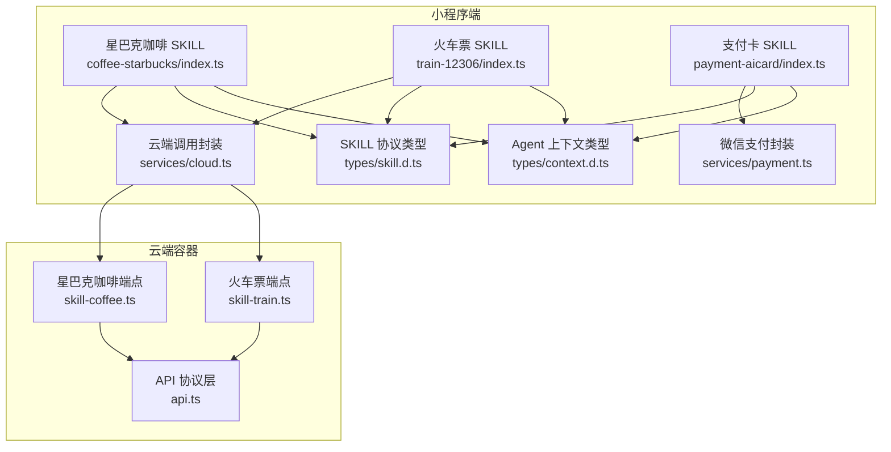
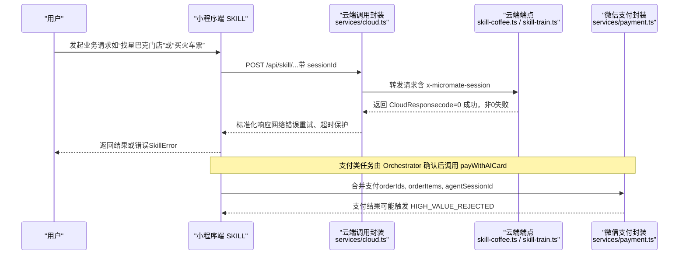
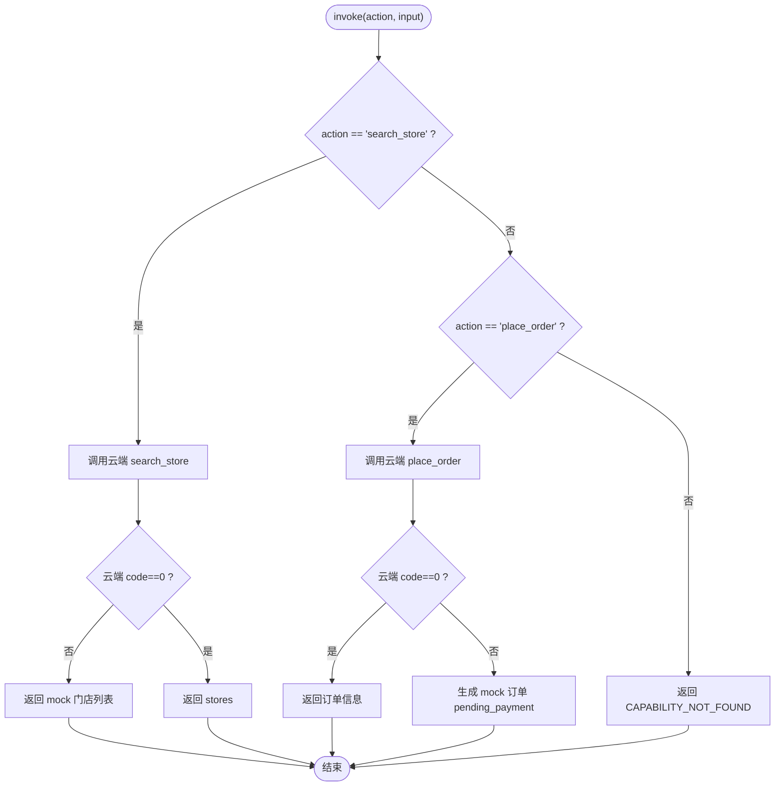
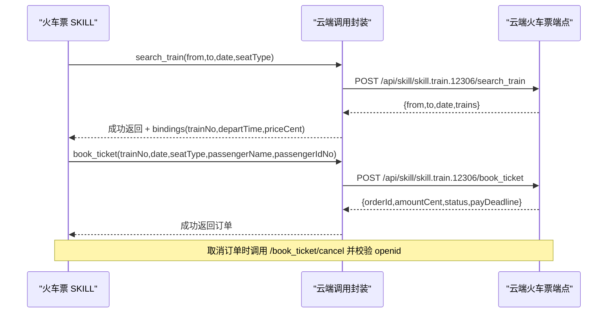
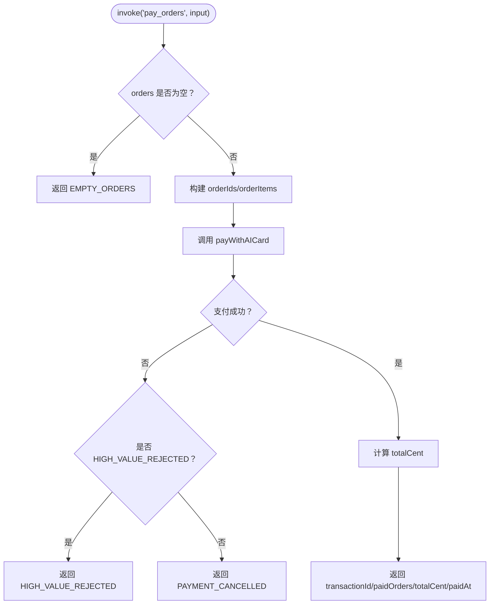
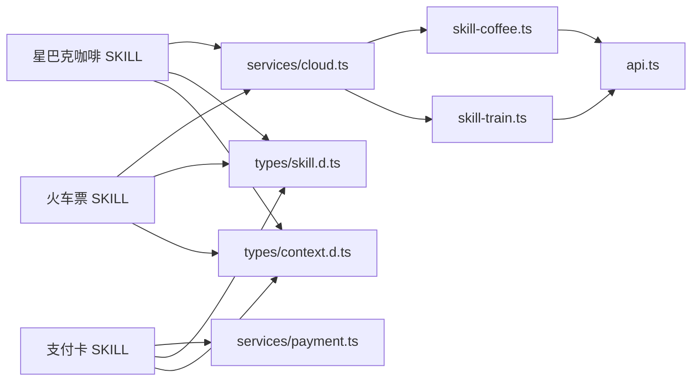

# 内置SKILL

<cite>
**本文引用的文件**   
- [星巴克咖啡 SKILL（小程序端）](file://miniprogram/src/skills/builtin/coffee-starbucks/index.ts)
- [火车票 SKILL（小程序端）](file://miniprogram/src/skills/builtin/train-12306/index.ts)
- [支付卡 SKILL（小程序端）](file://miniprogram/src/skills/builtin/payment-aicard/index.ts)
- [星巴克咖啡云端端点](file://cloudrun/src/skill-coffee.ts)
- [火车票云端端点](file://cloudrun/src/skill-train.ts)
- [云端 API 协议层](file://cloudrun/src/api.ts)
- [微信云开发容器调用封装](file://miniprogram/src/services/cloud.ts)
- [微信支付封装](file://miniprogram/src/services/payment.ts)
- [SKILL 协议类型定义](file://miniprogram/src/types/skill.d.ts)
- [Agent 会话上下文类型](file://miniprogram/src/types/context.d.ts)
</cite>

## 目录
1. [引言](#引言)
2. [项目结构](#项目结构)
3. [核心组件](#核心组件)
4. [架构总览](#架构总览)
5. [详细组件分析](#详细组件分析)
6. [依赖关系分析](#依赖关系分析)
7. [性能与可靠性](#性能与可靠性)
8. [故障排查指南](#故障排查指南)
9. [结论](#结论)
10. [附录：调用示例与参数说明](#附录调用示例与参数说明)

## 引言
本技术文档面向 WAIC-WeChat-MiniProgram 的内置 SKILL，重点覆盖三类能力：
- 星巴克咖啡预订 SKILL：门店搜索、订单创建、订单取消。
- 火车票预订 SKILL：车次查询、座位选择、购票确认。
- 支付卡 SKILL：支付方式选择、合并支付交易处理。

文档从系统架构、组件职责、数据流、错误处理、状态同步、云端通信协议等维度展开，并提供可操作的调用示例与参数说明，帮助开发者快速理解并扩展这些内置 SKILL。

## 项目结构
本项目采用“小程序端 SKILL + 云端容器端点”的分层设计：
- 小程序端负责 SKILL 元数据声明、能力调度、用户交互、云端调用封装与错误归一化。
- 云端容器提供确定性模拟数据、基础鉴权与订单生命周期管理。

图表来源
- [星巴克咖啡 SKILL（小程序端）:1-237](file://miniprogram/src/skills/builtin/coffee-starbucks/index.ts#L1-L237)
- [火车票 SKILL（小程序端）:1-293](file://miniprogram/src/skills/builtin/train-12306/index.ts#L1-L293)
- [支付卡 SKILL（小程序端）:1-147](file://miniprogram/src/skills/builtin/payment-aicard/index.ts#L1-L147)
- [云端调用封装:1-223](file://miniprogram/src/services/cloud.ts#L1-L223)
- [微信支付封装:1-114](file://miniprogram/src/services/payment.ts#L1-L114)
- [星巴克咖啡云端端点:1-124](file://cloudrun/src/skill-coffee.ts#L1-L124)
- [火车票云端端点:1-148](file://cloudrun/src/skill-train.ts#L1-L148)
- [云端 API 协议层:1-64](file://cloudrun/src/api.ts#L1-L64)
- [SKILL 协议类型定义:1-119](file://miniprogram/src/types/skill.d.ts#L1-L119)
- [Agent 会话上下文类型:1-62](file://miniprogram/src/types/context.d.ts#L1-L62)

章节来源
- [星巴克咖啡 SKILL（小程序端）:1-237](file://miniprogram/src/skills/builtin/coffee-starbucks/index.ts#L1-L237)
- [火车票 SKILL（小程序端）:1-293](file://miniprogram/src/skills/builtin/train-12306/index.ts#L1-L293)
- [支付卡 SKILL（小程序端）:1-147](file://miniprogram/src/skills/builtin/payment-aicard/index.ts#L1-L147)
- [云端调用封装:1-223](file://miniprogram/src/services/cloud.ts#L1-L223)
- [微信支付封装:1-114](file://miniprogram/src/services/payment.ts#L1-L114)
- [云端 API 协议层:1-64](file://cloudrun/src/api.ts#L1-L64)
- [SKILL 协议类型定义:1-119](file://miniprogram/src/types/skill.d.ts#L1-L119)
- [Agent 会话上下文类型:1-62](file://miniprogram/src/types/context.d.ts#L1-L62)

## 核心组件
本节聚焦三个内置 SKILL 的职责边界、能力声明与关键流程。

- 星巴克咖啡 SKILL
  - 能力：search_store（幂等、无需确认）、place_order（非幂等、需确认、可回滚）。
  - 输入输出：通过 JSON Schema 描述；支持门店绑定字段注入下游。
  - 云端接口：/api/skill/skill.coffee.starbucks/search_store、/place_order、/place_order/cancel。

- 火车票 SKILL
  - 能力：search_train（幂等、无需确认）、book_ticket（非幂等、需确认、可回滚）。
  - 输入输出：通过 JSON Schema 描述；search_train 返回 bindings 供 book_ticket 引用。
  - 云端接口：/api/skill/skill.train.12306/search_train、/book_ticket、/book_ticket/cancel。

- 支付卡 SKILL
  - 能力：pay_orders（非幂等、需确认、不可回滚，退款走原订单 SKILL）。
  - 集成方式：聚合多个子订单，触发微信 AI 专属卡支付；大额支付二次确认。
  - 云端接口：无直接云端调用，直接调用微信支付封装。

章节来源
- [星巴克咖啡 SKILL（小程序端）:58-146](file://miniprogram/src/skills/builtin/coffee-starbucks/index.ts#L58-L146)
- [火车票 SKILL（小程序端）:69-157](file://miniprogram/src/skills/builtin/train-12306/index.ts#L69-L157)
- [支付卡 SKILL（小程序端）:37-87](file://miniprogram/src/skills/builtin/payment-aicard/index.ts#L37-L87)

## 架构总览
下图展示小程序端 SKILL 与云端容器的交互路径、统一封装与错误归一化机制。

图表来源
- [云端调用封装:64-149](file://miniprogram/src/services/cloud.ts#L64-L149)
- [星巴克咖啡云端端点:119-123](file://cloudrun/src/skill-coffee.ts#L119-L123)
- [火车票云端端点:143-147](file://cloudrun/src/skill-train.ts#L143-L147)
- [微信支付封装:72-109](file://miniprogram/src/services/payment.ts#L72-L109)

## 详细组件分析

### 星巴克咖啡 SKILL
- 能力与元数据
  - search_store：查询附近门店，幂等，无需人类确认。
  - place_order：下单，非幂等，需要人类确认，可回滚。
- 输入输出 Schema
  - search_store 输入包含 city、可选 lat/lng/limit；输出 stores 数组。
  - place_order 输入包含 storeId、items、pickupType、可选 storeName；输出 orderId、amountCent、status 等。
- 业务流程
  - 门店搜索：调用云端 search_store，若云端不可用则返回 mock 数据。
  - 订单创建：调用云端 place_order，若云端不可用则生成 mock 订单并标记 pending_payment。
  - 订单取消：通过 rollback 调用云端 cancel，校验归属权限后删除订单。
- 错误处理
  - 云端 code=0 成功；code=-1 降级为本地 mock；其他错误映射为 SkillError。
  - 回滚失败抛出异常，便于上层 Orchestrator 感知。

图表来源
- [星巴克咖啡 SKILL（小程序端）:150-177](file://miniprogram/src/skills/builtin/coffee-starbucks/index.ts#L150-L177)
- [星巴克咖啡 SKILL（小程序端）:179-227](file://miniprogram/src/skills/builtin/coffee-starbucks/index.ts#L179-L227)

章节来源
- [星巴克咖啡 SKILL（小程序端）:16-56](file://miniprogram/src/skills/builtin/coffee-starbucks/index.ts#L16-L56)
- [星巴克咖啡 SKILL（小程序端）:58-146](file://miniprogram/src/skills/builtin/coffee-starbucks/index.ts#L58-L146)
- [星巴克咖啡 SKILL（小程序端）:150-237](file://miniprogram/src/skills/builtin/coffee-starbucks/index.ts#L150-L237)
- [星巴克咖啡云端端点:33-93](file://cloudrun/src/skill-coffee.ts#L33-L93)
- [星巴克咖啡云端端点:99-117](file://cloudrun/src/skill-coffee.ts#L99-L117)

### 火车票 SKILL
- 能力与元数据
  - search_train：查询车次，幂等，无需人类确认。
  - book_ticket：购票，非幂等，需要人类确认，可回滚。
- 输入输出 Schema
  - search_train 输入包含 from/to/date/seatType/highSpeedOnly；输出 trains 数组及 from/to/date。
  - book_ticket 输入包含 trainNo/date/seatType/passengerName/passengerIdNo；输出 orderId、amountCent、status、payDeadline。
- 业务流程
  - 车次查询：调用云端 search_train，云端不可用时返回 mock 数据，同时构造 bindings（trainNo/departTime/priceCent）供下游引用。
  - 购票确认：调用云端 book_ticket，云端不可用时返回 mock 订单并设置支付截止时间。
  - 订单取消：通过 rollback 调用云端 cancel，校验归属权限后删除订单。
- 错误处理
  - 云端 code=0 成功；code=-1 降级为本地 mock；特定业务码（如 1001）映射为 NO_TICKETS。
  - 回滚失败抛出异常，便于上层 Orchestrator 感知。

图表来源
- [火车票 SKILL（小程序端）:192-276](file://miniprogram/src/skills/builtin/train-12306/index.ts#L192-L276)
- [火车票云端端点:46-77](file://cloudrun/src/skill-train.ts#L46-L77)
- [火车票云端端点:89-116](file://cloudrun/src/skill-train.ts#L89-L116)
- [火车票云端端点:122-141](file://cloudrun/src/skill-train.ts#L122-L141)

章节来源
- [火车票 SKILL（小程序端）:18-67](file://miniprogram/src/skills/builtin/train-12306/index.ts#L18-L67)
- [火车票 SKILL（小程序端）:69-157](file://miniprogram/src/skills/builtin/train-12306/index.ts#L69-L157)
- [火车票 SKILL（小程序端）:192-293](file://miniprogram/src/skills/builtin/train-12306/index.ts#L192-L293)
- [火车票云端端点:1-148](file://cloudrun/src/skill-train.ts#L1-L148)

### 支付卡 SKILL
- 能力与元数据
  - pay_orders：合并支付多个子订单，非幂等，需要人类确认，不可回滚（退款走原订单 SKILL）。
- 集成方式
  - 聚合 orders（orderId/title/amountCent/quantity），计算 totalCent。
  - 调用 payWithAICard，传入 orderIds、orderItems、agentSessionId、timeStamp。
  - 大额支付阈值默认 1000 元，超过阈值触发 wx.showModal 二次确认；未确认则返回 HIGH_VALUE_REJECTED。
- 错误处理
  - 空订单返回 EMPTY_ORDERS。
  - 支付失败返回 PAYMENT_CANCELLED 或 HIGH_VALUE_REJECTED。
  - rollback 不实现，日志提示走原订单 SKILL 退款。

图表来源
- [支付卡 SKILL（小程序端）:89-147](file://miniprogram/src/skills/builtin/payment-aicard/index.ts#L89-L147)
- [微信支付封装:37-109](file://miniprogram/src/services/payment.ts#L37-L109)

章节来源
- [支付卡 SKILL（小程序端）:18-35](file://miniprogram/src/skills/builtin/payment-aicard/index.ts#L18-L35)
- [支付卡 SKILL（小程序端）:37-87](file://miniprogram/src/skills/builtin/payment-aicard/index.ts#L37-L87)
- [支付卡 SKILL（小程序端）:89-147](file://miniprogram/src/skills/builtin/payment-aicard/index.ts#L89-L147)
- [微信支付封装:1-114](file://miniprogram/src/services/payment.ts#L1-L114)

## 依赖关系分析
- 小程序端 SKILL 依赖 services/cloud.ts 进行云端调用，统一封装超时、重试、错误归一化。
- 支付卡 SKILL 依赖 services/payment.ts 进行微信支付封装，包含大额支付二次确认逻辑。
- 云端端点依赖 api.ts 提供的 ok/fail/badRequest/unauthorized/forbidden 工具函数，保证协议一致。
- SKILL 元数据与能力声明遵循 types/skill.d.ts 定义的 SkillMeta/SkillCapability/SkillInstance 接口。
- AgentContext 提供会话级上下文，包括 sessionId、userId、globals 等，用于云端鉴权与会话关联。

图表来源
- [星巴克咖啡 SKILL（小程序端）:1-237](file://miniprogram/src/skills/builtin/coffee-starbucks/index.ts#L1-L237)
- [火车票 SKILL（小程序端）:1-293](file://miniprogram/src/skills/builtin/train-12306/index.ts#L1-L293)
- [支付卡 SKILL（小程序端）:1-147](file://miniprogram/src/skills/builtin/payment-aicard/index.ts#L1-L147)
- [云端调用封装:1-223](file://miniprogram/src/services/cloud.ts#L1-L223)
- [微信支付封装:1-114](file://miniprogram/src/services/payment.ts#L1-L114)
- [云端 API 协议层:1-64](file://cloudrun/src/api.ts#L1-L64)
- [SKILL 协议类型定义:1-119](file://miniprogram/src/types/skill.d.ts#L1-L119)
- [Agent 会话上下文类型:1-62](file://miniprogram/src/types/context.d.ts#L1-L62)

章节来源
- [云端调用封装:1-223](file://miniprogram/src/services/cloud.ts#L1-L223)
- [微信支付封装:1-114](file://miniprogram/src/services/payment.ts#L1-L114)
- [云端 API 协议层:1-64](file://cloudrun/src/api.ts#L1-L64)
- [SKILL 协议类型定义:1-119](file://miniprogram/src/types/skill.d.ts#L1-L119)
- [Agent 会话上下文类型:1-62](file://miniprogram/src/types/context.d.ts#L1-L62)

## 性能与可靠性
- 云端调用封装
  - 默认超时 15 秒，支持可配置 timeoutMs。
  - 重试策略：最多 3 次，基础延迟 600ms，针对 CloudNetworkError 自动重试。
  - 开发环境降级：wx.cloud.callContainer 不可用时返回 code:-1，允许 SKILL mock 兜底。
- 幂等性与回滚
  - search_store/search_train 为幂等操作，适合重复调用。
  - place_order/book_ticket 为非幂等写操作，必须 requiresHumanConfirm=true，且实现 rollback。
- 支付安全
  - 大额支付阈值默认 1000 元，超过阈值强制二次确认，未确认即拒绝。
  - 支付失败区分 HIGH_VALUE_REJECTED 与 PAYMENT_CANCELLED，便于上层决策。

章节来源
- [云端调用封装:64-149](file://miniprogram/src/services/cloud.ts#L64-L149)
- [微信支付封装:37-109](file://miniprogram/src/services/payment.ts#L37-L109)
- [星巴克咖啡 SKILL（小程序端）:102-143](file://miniprogram/src/skills/builtin/coffee-starbucks/index.ts#L102-L143)
- [火车票 SKILL（小程序端）:121-154](file://miniprogram/src/skills/builtin/train-12306/index.ts#L121-L154)

## 故障排查指南
- 云端调用失败
  - 检查 isDevEnv 判定与 wx.cloud.init 初始化是否成功。
  - 观察 callContainer 抛出的 CloudNetworkError 与重试次数。
- 业务错误码
  - 星巴克：STORE_SEARCH_FAILED、PLACE_ORDER_FAILED。
  - 火车票：SEARCH_FAILED、NO_TICKETS、BOOK_FAILED。
  - 支付：EMPTY_ORDERS、HIGH_VALUE_REJECTED、PAYMENT_CANCELLED。
- 鉴权问题
  - 云端端点要求携带 x-wx-openid，缺失将返回 unauthorized。
  - 订单取消需校验 owner 与 openid 匹配，否则返回 forbidden。

章节来源
- [云端调用封装:151-182](file://miniprogram/src/services/cloud.ts#L151-L182)
- [星巴克咖啡 SKILL（小程序端）:192-226](file://miniprogram/src/skills/builtin/coffee-starbucks/index.ts#L192-L226)
- [火车票 SKILL（小程序端）:212-275](file://miniprogram/src/skills/builtin/train-12306/index.ts#L212-L275)
- [支付卡 SKILL（小程序端）:99-147](file://miniprogram/src/skills/builtin/payment-aicard/index.ts#L99-L147)
- [星巴克咖啡云端端点:67-70](file://cloudrun/src/skill-coffee.ts#L67-L70)
- [火车票云端端点:94-97](file://cloudrun/src/skill-train.ts#L94-L97)

## 结论
内置 SKILL 通过清晰的元数据与能力声明，结合统一的云端调用封装与支付封装，实现了可扩展、可观测、可回滚的业务流程。星巴克与火车票 SKILL 在云端提供确定性模拟数据与基础鉴权，支付卡 SKILL 则确保支付闭环与安全阈值控制。整体架构兼顾开发与生产环境的稳定性与可维护性。

## 附录：调用示例与参数说明

### 星巴克咖啡 SKILL
- 门店搜索
  - 动作：search_store
  - 输入字段：city（必填）、lat（可选）、lng（可选）、limit（可选，1-20）
  - 输出字段：stores[]（storeId、name、address、distanceM、openNow）
  - 示例调用路径：POST /api/skill/skill.coffee.starbucks/search_store
- 订单创建
  - 动作：place_order
  - 输入字段：storeId（必填）、items[]（sku、name、quantity、size）、pickupType（in_store/takeaway）、storeName（可选）
  - 输出字段：orderId、storeId、items[]、amountCent、status（pending_payment/paid）
  - 示例调用路径：POST /api/skill/skill.coffee.starbucks/place_order
- 订单取消
  - 动作：rollback（内部调用）
  - 输入字段：orderId（来自 place_order 输出）
  - 示例调用路径：POST /api/skill/skill.coffee.starbucks/place_order/cancel

章节来源
- [星巴克咖啡 SKILL（小程序端）:16-56](file://miniprogram/src/skills/builtin/coffee-starbucks/index.ts#L16-L56)
- [星巴克咖啡 SKILL（小程序端）:58-146](file://miniprogram/src/skills/builtin/coffee-starbucks/index.ts#L58-L146)
- [星巴克咖啡云端端点:33-93](file://cloudrun/src/skill-coffee.ts#L33-L93)
- [星巴克咖啡云端端点:99-117](file://cloudrun/src/skill-coffee.ts#L99-L117)

### 火车票 SKILL
- 车次查询
  - 动作：search_train
  - 输入字段：from（必填）、to（必填）、date（YYYY-MM-DD）、seatType（business/first_class/second_class/hard_seat）、highSpeedOnly（可选）
  - 输出字段：from、to、date、trains[]（trainNo、departTime、arriveTime、priceCent、ticketsLeft）
  - 示例调用路径：POST /api/skill/skill.train.12306/search_train
- 购票确认
  - 动作：book_ticket
  - 输入字段：trainNo（必填）、date（必填）、seatType（必填）、passengerName（必填）、passengerIdNo（必填）、from（可选）、to（可选）
  - 输出字段：orderId、trainNo、amountCent、status（pending_payment/paid）、payDeadline（毫秒时间戳）
  - 示例调用路径：POST /api/skill/skill.train.12306/book_ticket
- 订单取消
  - 动作：rollback（内部调用）
  - 输入字段：orderId（来自 book_ticket 输出）
  - 示例调用路径：POST /api/skill/skill.train.12306/book_ticket/cancel

章节来源
- [火车票 SKILL（小程序端）:18-67](file://miniprogram/src/skills/builtin/train-12306/index.ts#L18-L67)
- [火车票 SKILL（小程序端）:69-157](file://miniprogram/src/skills/builtin/train-12306/index.ts#L69-L157)
- [火车票云端端点:46-77](file://cloudrun/src/skill-train.ts#L46-L77)
- [火车票云端端点:89-116](file://cloudrun/src/skill-train.ts#L89-L116)
- [火车票云端端点:122-141](file://cloudrun/src/skill-train.ts#L122-L141)

### 支付卡 SKILL
- 合并支付
  - 动作：pay_orders
  - 输入字段：orders[]（orderId、title、amountCent、quantity）、scenario（可选）
  - 输出字段：transactionId、paidOrders[]、totalCent、paidAt
  - 行为：聚合订单金额，超过阈值触发二次确认；失败区分 HIGH_VALUE_REJECTED 与 PAYMENT_CANCELLED
  - 示例调用路径：小程序端直接调用 payWithAICard（无云端端点）

章节来源
- [支付卡 SKILL（小程序端）:18-35](file://miniprogram/src/skills/builtin/payment-aicard/index.ts#L18-L35)
- [支付卡 SKILL（小程序端）:37-87](file://miniprogram/src/skills/builtin/payment-aicard/index.ts#L37-L87)
- [支付卡 SKILL（小程序端）:89-147](file://miniprogram/src/skills/builtin/payment-aicard/index.ts#L89-L147)
- [微信支付封装:1-114](file://miniprogram/src/services/payment.ts#L1-L114)