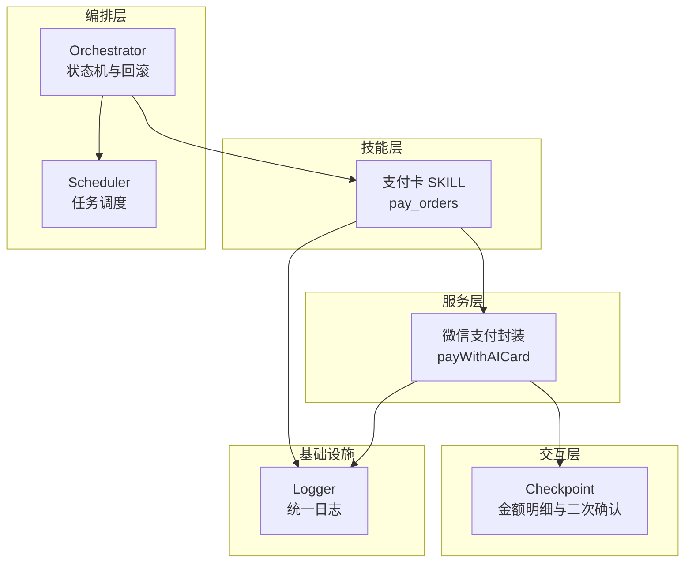
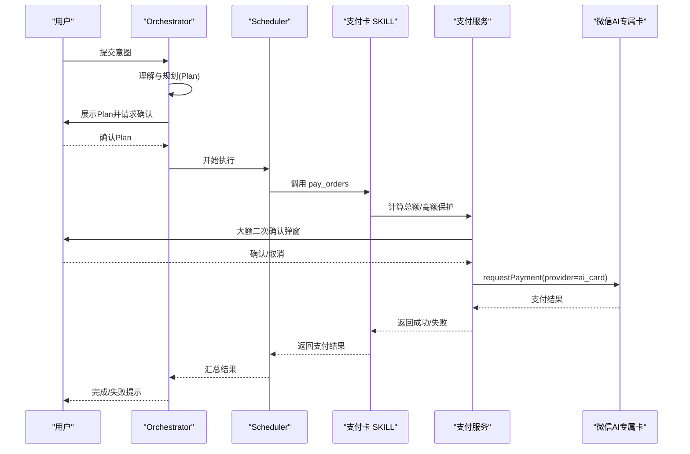
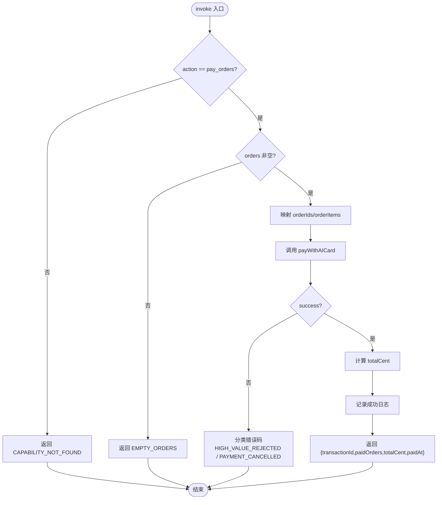
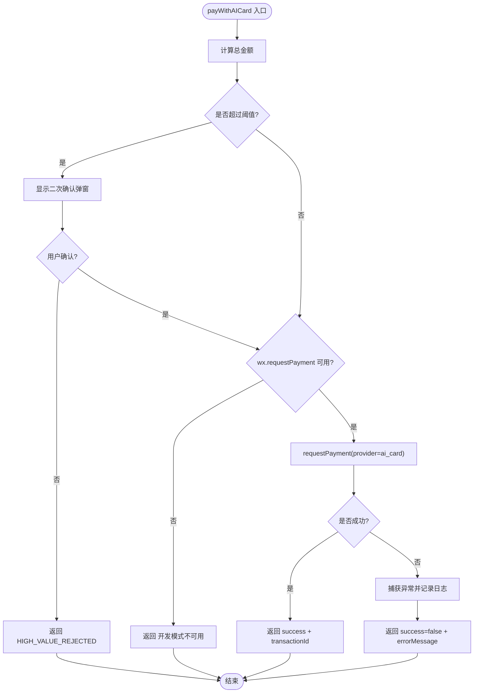
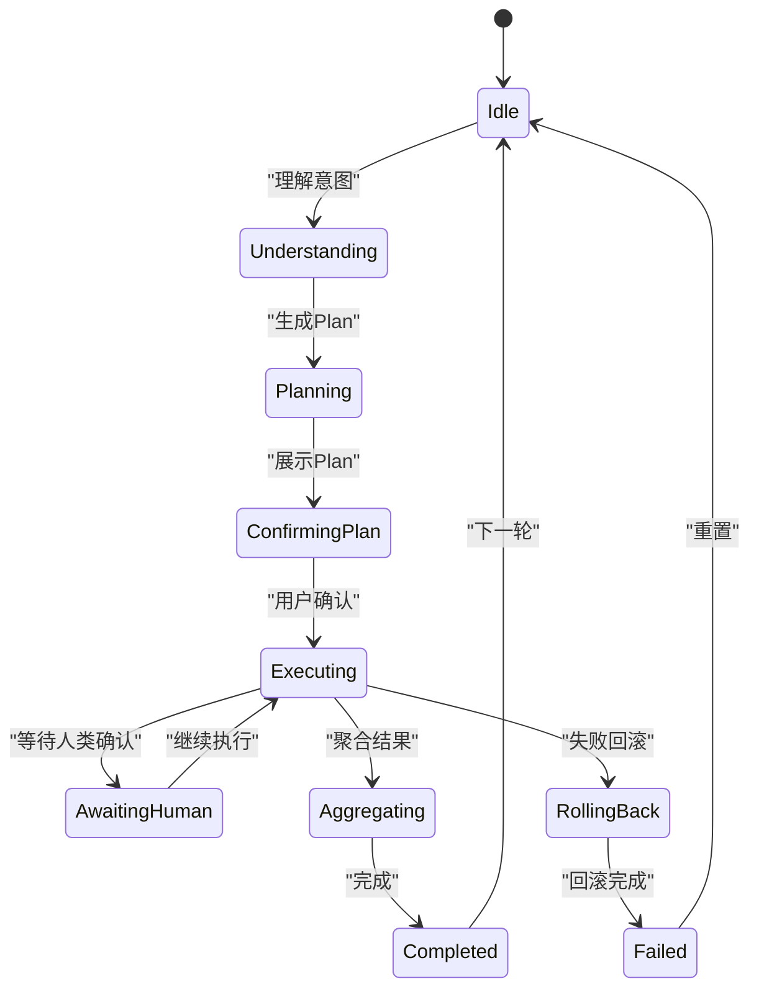
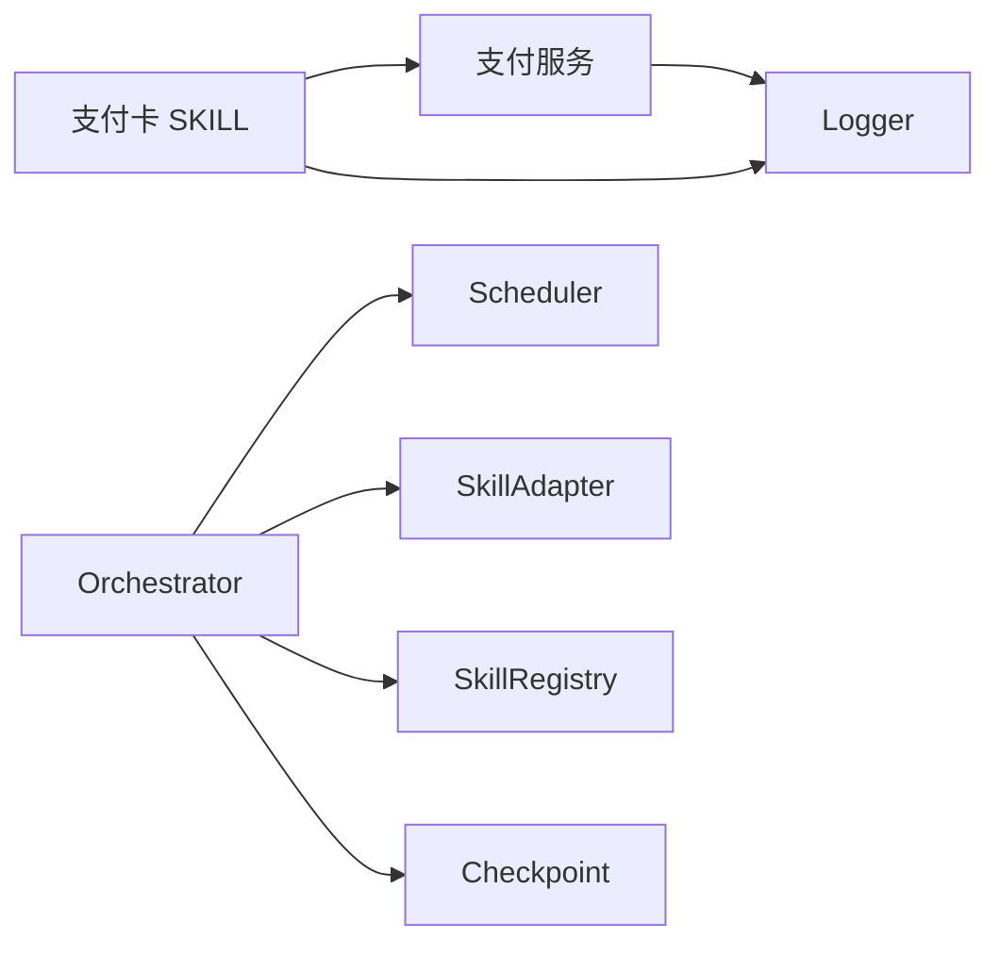

# 支付卡SKILL

<cite>
**本文引用的文件**   
- [miniprogram/src/skills/builtin/payment-aicard/index.ts](file://miniprogram/src/skills/builtin/payment-aicard/index.ts)
- [miniprogram/src/services/payment.ts](file://miniprogram/src/services/payment.ts)
- [miniprogram/src/core/orchestrator.ts](file://miniprogram/src/core/orchestrator.ts)
- [miniprogram/src/types/skill.d.ts](file://miniprogram/src/types/skill.d.ts)
- [miniprogram/src/interaction/checkpoint.ts](file://miniprogram/src/interaction/checkpoint.ts)
- [miniprogram/src/utils/logger.ts](file://miniprogram/src/utils/logger.ts)
</cite>

## 目录
1. [简介](#简介)
2. [项目结构](#项目结构)
3. [核心组件](#核心组件)
4. [架构总览](#架构总览)
5. [详细组件分析](#详细组件分析)
6. [依赖关系分析](#依赖关系分析)
7. [性能与一致性](#性能与一致性)
8. [故障排查指南](#故障排查指南)
9. [结论](#结论)
10. [附录：调用示例与扩展指南](#附录调用示例与扩展指南)

## 简介
本技术文档聚焦“支付卡 SKILL”，即微信 AI 专属卡支付能力。该 SKILL 作为支付闭环枢纽，负责合并多个子订单并通过微信 AI 专属卡完成扣款；它不是通用钱包，不提供退款或储值功能，退款需走原订单所属 SKILL。所有支付调用必须经由 Planner 生成 Plan，并在 Orchestrator 中通过二次确认后方可执行，确保资金操作的安全性与可审计性。

## 项目结构
围绕支付卡 SKILL 的相关代码主要分布在以下模块：
- 技能实现层：`miniprogram/src/skills/builtin/payment-aicard/index.ts`
- 支付服务封装层：`miniprogram/src/services/payment.ts`
- 编排与状态机：`miniprogram/src/core/orchestrator.ts`
- 技能协议类型：`miniprogram/src/types/skill.d.ts`
- 交互确认与金额明细展示：`miniprogram/src/interaction/checkpoint.ts`
- 日志工具：`miniprogram/src/utils/logger.ts`

图表来源
- [miniprogram/src/skills/builtin/payment-aicard/index.ts:1-147](file://miniprogram/src/skills/builtin/payment-aicard/index.ts#L1-L147)
- [miniprogram/src/services/payment.ts:1-114](file://miniprogram/src/services/payment.ts#L1-L114)
- [miniprogram/src/core/orchestrator.ts:106-256](file://miniprogram/src/core/orchestrator.ts#L106-L256)
- [miniprogram/src/interaction/checkpoint.ts:75-110](file://miniprogram/src/interaction/checkpoint.ts#L75-L110)
- [miniprogram/src/utils/logger.ts:1-61](file://miniprogram/src/utils/logger.ts#L1-L61)

章节来源
- [miniprogram/src/skills/builtin/payment-aicard/index.ts:1-147](file://miniprogram/src/skills/builtin/payment-aicard/index.ts#L1-L147)
- [miniprogram/src/services/payment.ts:1-114](file://miniprogram/src/services/payment.ts#L1-L114)
- [miniprogram/src/core/orchestrator.ts:106-256](file://miniprogram/src/core/orchestrator.ts#L106-L256)

## 核心组件
- 支付卡 SKILL（pay_orders）
  - 职责：接收多个子订单，聚合后调用支付服务完成合并支付；输出交易号、已支付订单集合、总金额与时间戳。
  - 能力声明：非幂等、不可逆、需要人类确认、预估延迟约 5 秒。
  - 错误处理：区分“大額未二次確認”和“一般取消/失败”，均标记为不可重试。
- 支付服务封装（payWithAICard）
  - 职责：计算总金额、触发大额二次确认、调用微信 requestPayment(provider=ai_card)、返回结果。
  - 安全机制：超过阈值强制二次确认；开发环境缺失 wx API 时保守拒绝。
- Orchestrator（编排器）
  - 职责：Plan 确认、任务调度、失败回滚、状态机转移；对写操作提供 checkpoint 拦截。
  - 一致性：按反序撤销已成功且可逆的任务；reset 令牌防止并发双跑。
- Checkpoint（交互确认）
  - 职责：解析入参中的金额明细并格式化展示，支持金额感知的高亮合计。
- Logger（日志）
  - 职责：统一前缀、级别控制、错误日志始终输出，便于审计追踪。

章节来源
- [miniprogram/src/skills/builtin/payment-aicard/index.ts:18-87](file://miniprogram/src/skills/builtin/payment-aicard/index.ts#L18-L87)
- [miniprogram/src/services/payment.ts:12-35](file://miniprogram/src/services/payment.ts#L12-L35)
- [miniprogram/src/core/orchestrator.ts:272-303](file://miniprogram/src/core/orchestrator.ts#L272-L303)
- [miniprogram/src/interaction/checkpoint.ts:87-110](file://miniprogram/src/interaction/checkpoint.ts#L87-L110)
- [miniprogram/src/utils/logger.ts:1-61](file://miniprogram/src/utils/logger.ts#L1-L61)

## 架构总览
支付卡 SKILL 在整体 Agent 流程中的位置如下：
- Planner 根据意图生成包含付费任务的 Plan。
- Orchestrator 先进行 Plan 确认，再进入执行阶段。
- Scheduler 调度各 Task，当遇到写操作时触发 checkpoint 拦截。
- 支付卡 SKILL 作为最后一个 Task，依赖所有付费 Task 成功后执行合并支付。
- 若后续步骤失败，Orchestrator 按反序尝试回滚“可逆”任务；支付卡 SKILL 声明为不可逆，因此不会自动回滚。

图表来源
- [miniprogram/src/core/orchestrator.ts:106-256](file://miniprogram/src/core/orchestrator.ts#L106-L256)
- [miniprogram/src/skills/builtin/payment-aicard/index.ts:89-147](file://miniprogram/src/skills/builtin/payment-aicard/index.ts#L89-L147)
- [miniprogram/src/services/payment.ts:72-109](file://miniprogram/src/services/payment.ts#L72-L109)

## 详细组件分析

### 支付卡 SKILL（pay_orders）
- 输入模型
  - orders：数组，每项含 orderId、title、amountCent、可选 quantity。
  - scenario：可选业务场景标识。
- 输出模型
  - transactionId：第三方支付流水号或本地生成标识。
  - paidOrders：已支付的子订单 ID 列表。
  - totalCent：合并后的总金额（分）。
  - paidAt：支付完成时间戳。
- 关键行为
  - 校验 action 是否为 pay_orders，否则返回 CAPABILITY_NOT_FOUND。
  - 校验 orders 非空，否则返回 EMPTY_ORDERS。
  - 将订单映射为 orderIds 与 orderItems，并调用支付服务。
  - 对支付失败进行分类：HIGH_VALUE_REJECTED 与 PAYMENT_CANCELLED，均为不可重试。
  - 成功时记录日志并返回结构化结果。
  - rollback 仅记录不支持自动回滚的日志，退款由原订单 SKILL 处理。

图表来源
- [miniprogram/src/skills/builtin/payment-aicard/index.ts:89-147](file://miniprogram/src/skills/builtin/payment-aicard/index.ts#L89-L147)

章节来源
- [miniprogram/src/skills/builtin/payment-aicard/index.ts:18-87](file://miniprogram/src/skills/builtin/payment-aicard/index.ts#L18-L87)
- [miniprogram/src/skills/builtin/payment-aicard/index.ts:89-147](file://miniprogram/src/skills/builtin/payment-aicard/index.ts#L89-L147)

### 支付服务封装（payWithAICard）
- 输入参数
  - orderIds：多个子订单 ID。
  - agentSessionId：Agent 会话 ID，用于溯源。
  - timeStamp：时间戳字符串。
  - orderItems：业务订单明细（title、amountCent、quantity）。
  - highValueThresholdCent：可选阈值，默认 1000 元（分 100000）。
- 关键行为
  - 计算总金额并与阈值比较，超过则弹出二次确认弹窗。
  - 若 wx.showModal 不可用，保守拒绝支付。
  - 若 wx.requestPayment 不可用（开发模式），返回失败。
  - 调用 requestPayment(provider=ai_card)，成功返回事务号，失败捕获异常并记录日志。

图表来源
- [miniprogram/src/services/payment.ts:72-109](file://miniprogram/src/services/payment.ts#L72-L109)

章节来源
- [miniprogram/src/services/payment.ts:1-114](file://miniprogram/src/services/payment.ts#L1-L114)

### Orchestrator 与状态机
- 状态机定义
  - idle → understanding → planning → confirming_plan → executing → aggregating → completed
  - 中途可转入 awaiting_human、rolling_back、failed，最终回到 idle。
- 支付相关行为
  - Plan 确认后进入执行阶段，Scheduler 调度任务。
  - 若任务等待人类确认（waiting_human），Orchestrator 联动转为 awaiting_human。
  - 失败时按反序尝试回滚“已成功且可逆”的任务；支付卡 SKILL 声明为不可逆，不会被自动回滚。
  - reset 令牌防止并发双跑与重复弹窗。

图表来源
- [miniprogram/src/core/orchestrator.ts:60-71](file://miniprogram/src/core/orchestrator.ts#L60-L71)
- [miniprogram/src/core/orchestrator.ts:106-256](file://miniprogram/src/core/orchestrator.ts#L106-L256)

章节来源
- [miniprogram/src/core/orchestrator.ts:60-71](file://miniprogram/src/core/orchestrator.ts#L60-L71)
- [miniprogram/src/core/orchestrator.ts:106-256](file://miniprogram/src/core/orchestrator.ts#L106-L256)
- [miniprogram/src/core/orchestrator.ts:272-303](file://miniprogram/src/core/orchestrator.ts#L272-L303)

### 交互确认与金额明细（Checkpoint）
- 金额明细解析
  - 从入参中查找第一个元素包含 amountCent 的数组，视为订单明细。
  - 逐行展示“品名 × 数量 = 金额”，并计算合计。
- 二次确认
  - 对于写操作（如支付），通过 awaitCheckpoint 强制展示明细并获取用户确认。
  - 非订单入参退化为紧凑 JSON（截断至 500 字符）。

章节来源
- [miniprogram/src/interaction/checkpoint.ts:75-110](file://miniprogram/src/interaction/checkpoint.ts#L75-L110)

### 日志与审计
- Logger 提供 debug/info/warn/error 四个级别，error 始终输出。
- 所有日志带品牌前缀与时间戳，便于聚合与审计。
- 支付成功、大额警告、支付失败等路径均有日志埋点。

章节来源
- [miniprogram/src/utils/logger.ts:1-61](file://miniprogram/src/utils/logger.ts#L1-L61)
- [miniprogram/src/skills/builtin/payment-aicard/index.ts:131-132](file://miniprogram/src/skills/builtin/payment-aicard/index.ts#L131-L132)
- [miniprogram/src/services/payment.ts:77-84](file://miniprogram/src/services/payment.ts#L77-L84)

## 依赖关系分析
- 支付卡 SKILL 依赖支付服务封装与日志工具。
- 支付服务封装依赖日志工具，并在运行时访问 wx API。
- Orchestrator 依赖 Scheduler、SkillAdapter、SkillRegistry 与交互确认回调。
- 类型定义集中管理 SkillMeta、SkillCapability、SkillInstance 等协议。

图表来源
- [miniprogram/src/skills/builtin/payment-aicard/index.ts:13-16](file://miniprogram/src/sills/builtin/payment-aicard/index.ts#L13-L16)
- [miniprogram/src/services/payment.ts:7-7](file://miniprogram/src/services/payment.ts#L7-L7)
- [miniprogram/src/core/orchestrator.ts:13-21](file://miniprogram/src/core/orchestrator.ts#L13-L21)
- [miniprogram/src/types/skill.d.ts:16-58](file://miniprogram/src/types/skill.d.ts#L16-L58)

章节来源
- [miniprogram/src/types/skill.d.ts:16-58](file://miniprogram/src/types/skill.d.ts#L16-L58)
- [miniprogram/src/core/orchestrator.ts:13-21](file://miniprogram/src/core/orchestrator.ts#L13-L21)

## 性能与一致性
- 性能特征
  - 支付卡 SKILL 预估延迟约 5 秒，主要用于 UI 排程估算。
  - 合并支付减少多次网络往返，提升用户体验。
- 一致性保证
  - Orchestrator 在失败时按反序尝试回滚“可逆”任务；支付卡 SKILL 不可逆，不纳入自动回滚。
  - reset 令牌避免并发双跑与重复弹窗，保障状态机一致性。
  - 支付服务在开发环境缺失 wx API 时保守拒绝，避免误扣款。

章节来源
- [miniprogram/src/skills/builtin/payment-aicard/index.ts:81-84](file://miniprogram/src/skills/builtin/payment-aicard/index.ts#L81-L84)
- [miniprogram/src/core/orchestrator.ts:186-199](file://miniprogram/src/core/orchestrator.ts#L186-L199)
- [miniprogram/src/core/orchestrator.ts:272-303](file://miniprogram/src/core/orchestrator.ts#L272-L303)
- [miniprogram/src/services/payment.ts:47-52](file://miniprogram/src/services/payment.ts#L47-L52)

## 故障排查指南
- 常见错误码
  - CAPABILITY_NOT_FOUND：调用了不支持的动作（非 pay_orders）。
  - EMPTY_ORDERS：订单清单为空。
  - HIGH_VALUE_REJECTED：大额支付未经二次确认被拒绝。
  - PAYMENT_CANCELLED：支付被取消或失败。
- 排查建议
  - 检查传入的 action 是否为 pay_orders。
  - 检查 orders 数组是否非空且包含必要字段。
  - 检查是否在真实小程序环境（wx.showModal、wx.requestPayment 可用）。
  - 查看日志前缀与时间戳，定位大额警告与支付失败路径。
  - 若出现并发问题，检查 Orchestrator 的 reset 令牌与状态机转移。

章节来源
- [miniprogram/src/skills/builtin/payment-aicard/index.ts:92-129](file://miniprogram/src/skills/builtin/payment-aicard/index.ts#L92-L129)
- [miniprogram/src/services/payment.ts:47-52](file://miniprogram/src/services/payment.ts#L47-L52)
- [miniprogram/src/services/payment.ts:91-108](file://miniprogram/src/services/payment.ts#L91-L108)
- [miniprogram/src/utils/logger.ts:40-61](file://miniprogram/src/utils/logger.ts#L40-L61)

## 结论
支付卡 SKILL 以“合并支付”为核心职责，严格遵循“计划先行、人类确认、不可逆、非幂等”的设计原则。通过与 Orchestrator 的状态机与 Scheduler 协作，结合 Checkpoint 的金额明细展示与二次确认，以及 Logger 的统一审计，形成安全、可控、可追溯的支付闭环。退款与储值不在本 SKILL 范围内，需由原订单 SKILL 处理。

## 附录：调用示例与扩展指南

### 调用示例（预支付、支付确认、退款）
- 预支付
  - 当前 SKILL 不提供独立预支付接口；合并支付直接调用 pay_orders。
  - 建议在业务侧先创建子订单，再将订单 ID 与明细传入 pay_orders。
- 支付确认
  - 通过 Orchestrator 的 Plan 确认与 checkpoint 拦截，确保用户在支付前看到明细并二次确认。
  - 大额支付会触发额外弹窗确认。
- 退款
  - 本 SKILL 不支持退款；请调用原订单所属 SKILL 的退款能力。

章节来源
- [miniprogram/src/skills/builtin/payment-aicard/index.ts:37-87](file://miniprogram/src/skills/builtin/payment-aicard/index.ts#L37-L87)
- [miniprogram/src/skills/builtin/payment-aicard/index.ts:143-146](file://miniprogram/src/skills/builtin/payment-aicard/index.ts#L143-L146)
- [miniprogram/src/core/orchestrator.ts:152-183](file://miniprogram/src/core/orchestrator.ts#L152-L183)

### 支持的支付方式与卡片类型
- 支付方式：微信 AI 专属卡（provider=ai_card）。
- 卡片类型：当前实现仅对接微信 AI 专属卡，未暴露其他支付方式开关。

章节来源
- [miniprogram/src/services/payment.ts:95-103](file://miniprogram/src/services/payment.ts#L95-L103)

### 交易处理逻辑与安全机制
- 交易处理
  - 合并多个子订单，计算总金额，调用 requestPayment。
  - 成功返回 transactionId 与已支付订单列表。
- 安全机制
  - 大额阈值保护：超过阈值强制二次确认，未确认即拒绝。
  - 开发环境保护：wx API 不可用时保守拒绝。
  - 错误分类：区分 HIGH_VALUE_REJECTED 与 PAYMENT_CANCELLED。
  - 审计日志：成功、警告、失败均有日志记录。

章节来源
- [miniprogram/src/services/payment.ts:72-109](file://miniprogram/src/services/payment.ts#L72-L109)
- [miniprogram/src/skills/builtin/payment-aicard/index.ts:119-132](file://miniprogram/src/skills/builtin/payment-aicard/index.ts#L119-L132)

### 支付状态管理与事务一致性
- 状态管理
  - Orchestrator 维护全局状态机，支付卡 SKILL 作为最后一步写入。
  - 若后续失败，按反序尝试回滚“可逆”任务；支付卡 SKILL 不可逆。
- 一致性
  - reset 令牌防止并发双跑。
  - 支付服务在开发环境保守拒绝，避免误扣款。

章节来源
- [miniprogram/src/core/orchestrator.ts:186-199](file://miniprogram/src/core/orchestrator.ts#L186-L199)
- [miniprogram/src/core/orchestrator.ts:272-303](file://miniprogram/src/core/orchestrator.ts#L272-L303)
- [miniprogram/src/services/payment.ts:47-52](file://miniprogram/src/services/payment.ts#L47-L52)

### 与第三方支付平台的集成与回调
- 集成方式
  - 通过 wx.requestPayment(provider=ai_card) 发起支付。
  - 传入 orderIds、agentSessionId、orderItems 等业务信息。
- 回调处理
  - 当前实现基于 Promise 的成功/失败分支；未在代码中看到显式的异步回调注册。
  - 如需扩展回调，可在 payWithAICard 中增加 onConfirm/onFail 钩子。

章节来源
- [miniprogram/src/services/payment.ts:95-108](file://miniprogram/src/services/payment.ts#L95-L108)

### 错误处理与异常恢复策略
- 错误分类
  - CAPABILITY_NOT_FOUND、EMPTY_ORDERS、HIGH_VALUE_REJECTED、PAYMENT_CANCELLED。
- 恢复策略
  - 所有上述错误均标记为不可重试。
  - Orchestrator 在失败时尝试回滚“可逆”任务；支付卡 SKILL 不参与自动回滚。

章节来源
- [miniprogram/src/skills/builtin/payment-aicard/index.ts:92-129](file://miniprogram/src/skills/builtin/payment-aicard/index.ts#L92-L129)
- [miniprogram/src/core/orchestrator.ts:272-303](file://miniprogram/src/core/orchestrator.ts#L272-L303)

### 日志记录与审计追踪
- 日志级别
  - debug/info/warn/error，error 始终输出。
- 审计要点
  - 支付成功、大额警告、支付失败均有日志。
  - 日志带品牌前缀与时间戳，便于聚合与分析。

章节来源
- [miniprogram/src/utils/logger.ts:1-61](file://miniprogram/src/utils/logger.ts#L1-L61)
- [miniprogram/src/skills/builtin/payment-aicard/index.ts:131-132](file://miniprogram/src/skills/builtin/payment-aicard/index.ts#L131-L132)
- [miniprogram/src/services/payment.ts:77-84](file://miniprogram/src/services/payment.ts#L77-L84)

### 扩展支持新的支付方式
- 扩展点
  - 在支付服务封装层新增 provider 分支，复用现有高额保护与日志机制。
  - 在 SKILL 层保持 pay_orders 语义不变，仅在 Service 层切换 provider。
- 注意事项
  - 保持幂等性、可逆性、人类确认等属性与协议一致。
  - 新增支付方式需补充对应的错误分类与日志埋点。

章节来源
- [miniprogram/src/services/payment.ts:95-108](file://miniprogram/src/services/payment.ts#L95-L108)
- [miniprogram/src/types/skill.d.ts:37-58](file://miniprogram/src/types/skill.d.ts#L37-L58)