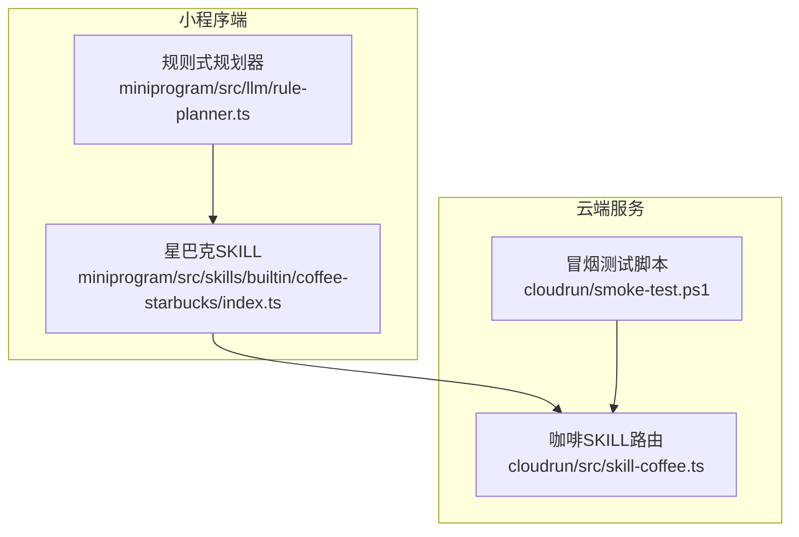
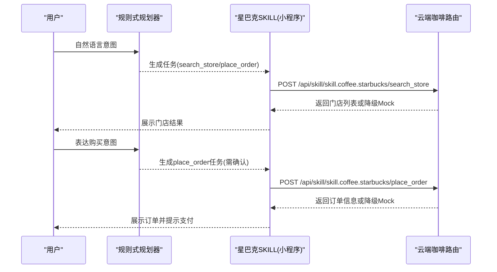
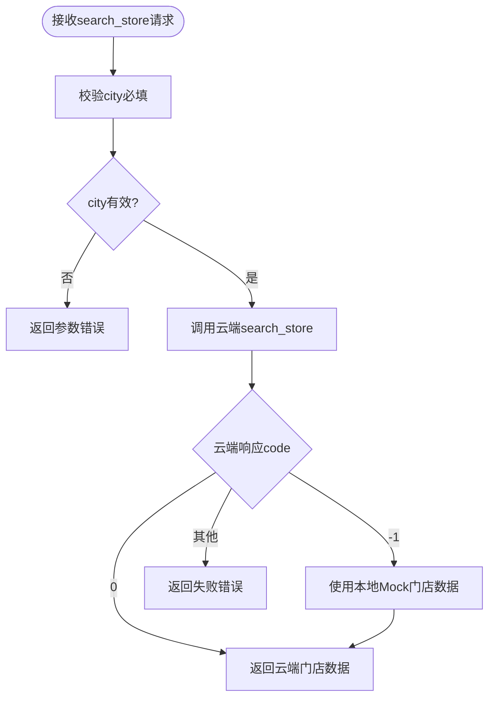
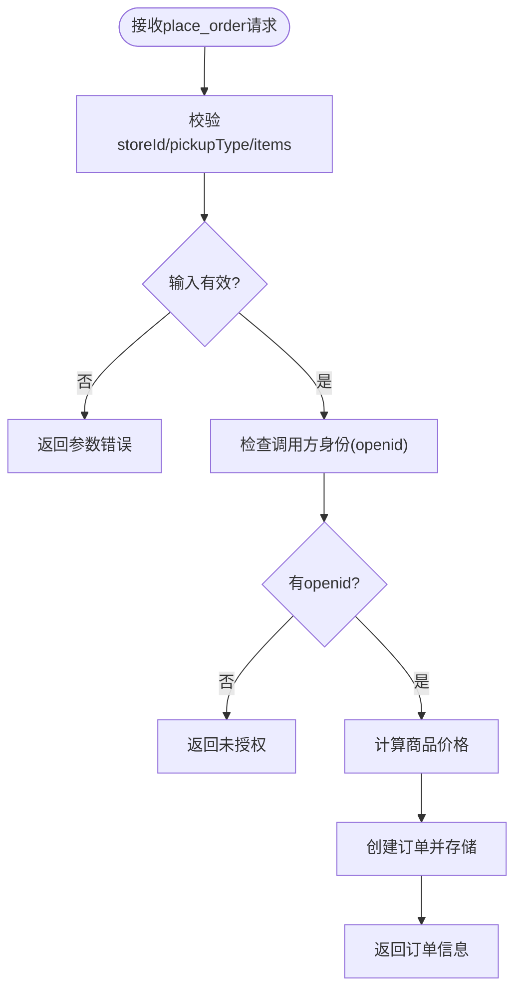
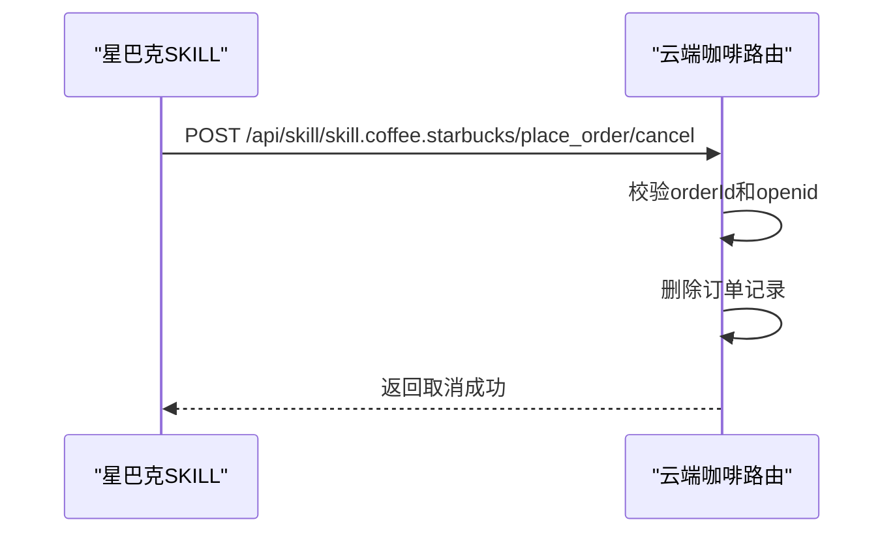
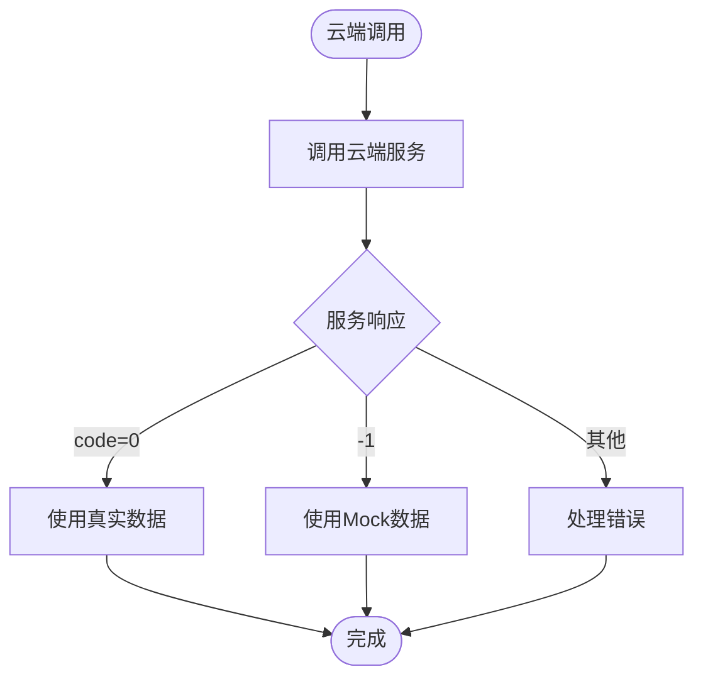

# 星巴克咖啡SKILL

<cite>
**本文引用的文件**   
- [miniprogram/src/skills/builtin/coffee-starbucks/index.ts](file://miniprogram/src/skills/builtin/coffee-starbucks/index.ts)
- [cloudrun/src/skill-coffee.ts](file://cloudrun/src/skill-coffee.ts)
- [miniprogram/src/llm/rule-planner.ts](file://miniprogram/src/llm/rule-planner.ts)
- [cloudrun/smoke-test.ps1](file://cloudrun/smoke-test.ps1)
</cite>

## 目录
1. [引言](#引言)
2. [项目结构](#项目结构)
3. [核心能力总览](#核心能力总览)
4. [架构总览](#架构总览)
5. [门店搜索能力详解](#门店搜索能力详解)
6. [订单创建能力详解](#订单创建能力详解)
7. [幂等性、人类确认与事务回滚](#幂等性人类确认与事务回滚)
8. [云端通信协议与数据格式](#云端通信协议与数据格式)
9. [Mock数据与降级策略](#mock数据与降级策略)
10. [依赖关系分析](#依赖关系分析)
11. [性能与可靠性建议](#性能与可靠性建议)
12. [故障排查指南](#故障排查指南)
13. [结论](#结论)

## 引言
本技术文档面向“星巴克咖啡SKILL”，聚焦两个核心能力：
- 门店搜索（search_store）
- 订单创建（place_order）

该SKILL由小程序端能力实现与云端路由处理两部分组成，提供从意图识别到下单、取消的完整链路。文档将详细说明输入输出Schema、参数校验规则、业务逻辑、错误处理、降级策略以及调用示例。

## 项目结构
星巴克咖啡SKILL涉及以下关键文件：
- 小程序端能力定义与调用封装：[miniprogram/src/skills/builtin/coffee-starbucks/index.ts](file://miniprogram/src/skills/builtin/coffee-starbucks/index.ts)
- 云端路由与业务处理：[cloudrun/src/skill-coffee.ts](file://cloudrun/src/skill-coffee.ts)
- 规则式任务规划器（演示模式生成星巴克相关任务）：[miniprogram/src/llm/rule-planner.ts](file://miniprogram/src/llm/rule-planner.ts)
- 冒烟测试脚本（含咖啡下单示例）：[cloudrun/smoke-test.ps1](file://cloudrun/smoke-test.ps1)

**图表来源**
- [miniprogram/src/skills/builtin/coffee-starbucks/index.ts:148-177](file://miniprogram/src/skills/builtin/coffee-starbucks/index.ts#L148-L177)
- [cloudrun/src/skill-coffee.ts:119-123](file://cloudrun/src/skill-coffee.ts#L119-L123)
- [miniprogram/src/llm/rule-planner.ts:127-155](file://miniprogram/src/llm/rule-planner.ts#L127-L155)
- [cloudrun/smoke-test.ps1:15-16](file://cloudrun/smoke-test.ps1#L15-L16)

**章节来源**
- [miniprogram/src/skills/builtin/coffee-starbucks/index.ts:1-237](file://miniprogram/src/skills/builtin/coffee-starbucks/index.ts#L1-L237)
- [cloudrun/src/skill-coffee.ts:1-124](file://cloudrun/src/skill-coffee.ts#L1-L124)
- [miniprogram/src/llm/rule-planner.ts:1-165](file://miniprogram/src/llm/rule-planner.ts#L1-L165)
- [cloudrun/smoke-test.ps1:1-17](file://cloudrun/smoke-test.ps1#L1-L17)

## 核心能力总览
星巴克咖啡SKILL声明了两个能力：
- search_store：查询附近星巴克门店，幂等、无需人类确认。
- place_order：在指定门店下单，非幂等、需要人类确认、可回滚。

能力元信息包含输入输出Schema、是否幂等、是否需要人类确认、是否可回滚、预估延迟等。

**章节来源**
- [miniprogram/src/skills/builtin/coffee-starbucks/index.ts:58-146](file://miniprogram/src/skills/builtin/coffee-starbucks/index.ts#L58-L146)

## 架构总览
小程序端通过SKILL实例统一调度，根据action分发到具体处理函数；云端服务暴露REST接口，负责参数校验、价格计算、订单持久化（内存Map）、鉴权与取消。

**图表来源**
- [miniprogram/src/llm/rule-planner.ts:127-155](file://miniprogram/src/llm/rule-planner.ts#L127-L155)
- [miniprogram/src/skills/builtin/coffee-starbucks/index.ts:148-177](file://miniprogram/src/skills/builtin/coffee-starbucks/index.ts#L148-L177)
- [cloudrun/src/skill-coffee.ts:119-123](file://cloudrun/src/skill-coffee.ts#L119-L123)

## 门店搜索能力详解
### 输入Schema
- city：必填字符串，表示城市名。
- lat/lng：可选数值，表示用户位置坐标。
- limit：可选整数，范围1-20，限制返回门店数量。

### 输出Schema
- stores：数组，每项包含：
  - storeId：门店ID
  - name：门店名称
  - address：地址
  - distanceM：距离（米）
  - openNow：是否营业中

### 参数验证规则
- 云端对city进行必填校验。
- limit会被规范化为1-20之间的值。

### 业务逻辑
- 云端返回固定模拟门店数据，按limit裁剪。
- 小程序端若云端返回code=-1，则使用本地Mock数据作为降级。
- 地理位置信息（lat/lng）在当前实现中未参与距离计算，distanceM为固定值。

**图表来源**
- [cloudrun/src/skill-coffee.ts:33-46](file://cloudrun/src/skill-coffee.ts#L33-L46)
- [miniprogram/src/skills/builtin/coffee-starbucks/index.ts:179-196](file://miniprogram/src/skills/builtin/coffee-starbucks/index.ts#L179-L196)

**章节来源**
- [miniprogram/src/skills/builtin/coffee-starbucks/index.ts:16-33](file://miniprogram/src/skills/builtin/coffee-starbucks/index.ts#L16-L33)
- [miniprogram/src/skills/builtin/coffee-starbucks/index.ts:72-101](file://miniprogram/src/skills/builtin/coffee-starbucks/index.ts#L72-L101)
- [cloudrun/src/skill-coffee.ts:28-46](file://cloudrun/src/skill-coffee.ts#L28-L46)

## 订单创建能力详解
### 输入Schema
- storeId：必填字符串，门店ID。
- items：必填数组，每项包含：
  - sku：必填字符串，商品编码。
  - name：可选字符串，商品名称。
  - quantity：必填整数，≥1。
  - size：可选字符串，尺寸。
- pickupType：必填枚举，'in_store'或'takeaway'。
- storeName：可选字符串，从search_store注入的绑定字段。

### 输出Schema
- orderId：订单ID。
- storeId：门店ID。
- items：订单明细数组，每项包含sku、name、quantity、amountCent。
- amountCent：总金额（分）。
- status：'pending_payment'或'paid'。

### 参数验证规则
- 云端校验storeId、pickupType、items存在且非空。
- pickupType必须为'in_store'或'takeaway'。
- items每项的sku必填，quantity为数字且≥1。

### 业务逻辑
- 价格计算：根据SKU映射单价，未知SKU使用默认价。
- 订单持久化：使用内存Map存储订单，owner为调用方openid。
- 取餐方式：支持店内取餐和外卖两种模式。

**图表来源**
- [cloudrun/src/skill-coffee.ts:54-93](file://cloudrun/src/skill-coffee.ts#L54-L93)

**章节来源**
- [miniprogram/src/skills/builtin/coffee-starbucks/index.ts:35-56](file://miniprogram/src/skills/builtin/coffee-starbucks/index.ts#L35-L56)
- [miniprogram/src/skills/builtin/coffee-starbucks/index.ts:108-144](file://miniprogram/src/skills/builtin/coffee-starbucks/index.ts#L108-L144)
- [cloudrun/src/skill-coffee.ts:48-93](file://cloudrun/src/skill-coffee.ts#L48-L93)

## 幂等性、人类确认与事务回滚
### 幂等性控制
- search_store：标记为幂等，适合重复调用。
- place_order：标记为非幂等，每次调用都会创建新订单。

### 人类确认机制
- place_order：requiresHumanConfirm=true，在执行前需要用户确认。
- 规则式规划器生成的下单任务会触发checkpoint确认流程。

### 事务回滚功能
- place_order：reversible=true，支持回滚。
- 小程序端rollback方法调用云端取消接口，传入orderId。
- 云端取消接口校验订单存在性和所有权，防止越权取消。

**图表来源**
- [miniprogram/src/skills/builtin/coffee-starbucks/index.ts:163-176](file://miniprogram/src/skills/builtin/coffee-starbucks/index.ts#L163-L176)
- [cloudrun/src/skill-coffee.ts:99-117](file://cloudrun/src/skill-coffee.ts#L99-L117)

**章节来源**
- [miniprogram/src/skills/builtin/coffee-starbucks/index.ts:102-144](file://miniprogram/src/skills/builtin/coffee-starbucks/index.ts#L102-L144)
- [miniprogram/src/skills/builtin/coffee-starbucks/index.ts:163-176](file://miniprogram/src/skills/builtin/coffee-starbucks/index.ts#L163-L176)
- [cloudrun/src/skill-coffee.ts:99-117](file://cloudrun/src/skill-coffee.ts#L99-L117)

## 云端通信协议与数据格式
### 接口定义
- POST /api/skill/skill.coffee.starbucks/search_store
- POST /api/skill/skill.coffee.starbucks/place_order
- POST /api/skill/skill.coffee.starbucks/place_order/cancel

### 请求格式
- Content-Type: application/json
- 写操作需携带x-wx-openid头用于鉴权

### 响应格式
- code=0：成功，data包含业务数据
- code=-1：降级场景，使用Mock数据
- 其他code：失败，message描述错误原因

**章节来源**
- [cloudrun/src/skill-coffee.ts:119-123](file://cloudrun/src/skill-coffee.ts#L119-L123)
- [cloudrun/smoke-test.ps1:1-4](file://cloudrun/smoke-test.ps1#L1-L4)

## Mock数据与降级策略
### Mock数据处理
- 门店搜索Mock：当云端返回code=-1时，小程序端使用本地mockStores函数生成模拟门店数据。
- 订单创建Mock：当云端返回code=-1时，小程序端生成模拟订单，金额按3000分/杯计算。

### 降级策略
- 云端不可用时自动降级到本地Mock数据。
- 保证演示环境即使云端不可用也能正常工作。

**图表来源**
- [miniprogram/src/skills/builtin/coffee-starbucks/index.ts:190-195](file://miniprogram/src/skills/builtin/coffee-starbucks/index.ts#L190-L195)
- [miniprogram/src/skills/builtin/coffee-starbucks/index.ts:210-226](file://miniprogram/src/skills/builtin/coffee-starbucks/index.ts#L210-L226)

**章节来源**
- [miniprogram/src/skills/builtin/coffee-starbucks/index.ts:229-237](file://miniprogram/src/skills/builtin/coffee-starbucks/index.ts#L229-L237)

## 依赖关系分析
星巴克咖啡SKILL的依赖关系如下：
- 小程序端SKILL依赖云端API进行数据交互。
- 规则式规划器生成星巴克相关任务，驱动SKILL执行。
- 云端服务依赖内存Map存储订单状态。

**图表来源**
- [miniprogram/src/llm/rule-planner.ts:127-155](file://miniprogram/src/llm/rule-planner.ts#L127-L155)
- [cloudrun/src/skill-coffee.ts:25-26](file://cloudrun/src/skill-coffee.ts#L25-L26)

**章节来源**
- [miniprogram/src/llm/rule-planner.ts:1-165](file://miniprogram/src/llm/rule-planner.ts#L1-L165)
- [cloudrun/src/skill-coffee.ts:25-26](file://cloudrun/src/skill-coffee.ts#L25-L26)

## 性能与可靠性建议
- 缓存优化：门店搜索结果可考虑缓存，减少重复查询。
- 异步处理：订单创建可采用异步处理，提高响应速度。
- 错误重试：对网络异常进行重试，提升可靠性。
- 监控告警：添加性能监控和错误告警机制。

## 故障排查指南
### 常见问题
- 参数校验失败：检查city、storeId、pickupType等必填字段。
- 权限问题：确保写操作携带正确的x-wx-openid头。
- 订单不存在：检查orderId是否正确，订单是否已被取消。

### 调试步骤
1. 检查请求参数是否符合Schema定义。
2. 查看云端日志确认错误原因。
3. 使用冒烟测试脚本验证接口连通性。

**章节来源**
- [cloudrun/smoke-test.ps1:15-16](file://cloudrun/smoke-test.ps1#L15-L16)

## 结论
星巴克咖啡SKILL提供了完整的门店搜索和订单创建能力，具备完善的参数校验、错误处理、降级策略和安全机制。通过小程序端与云端的协作，实现了从意图识别到订单完成的完整业务流程。建议在正式环境中进一步优化性能、增加持久化存储和监控告警机制。