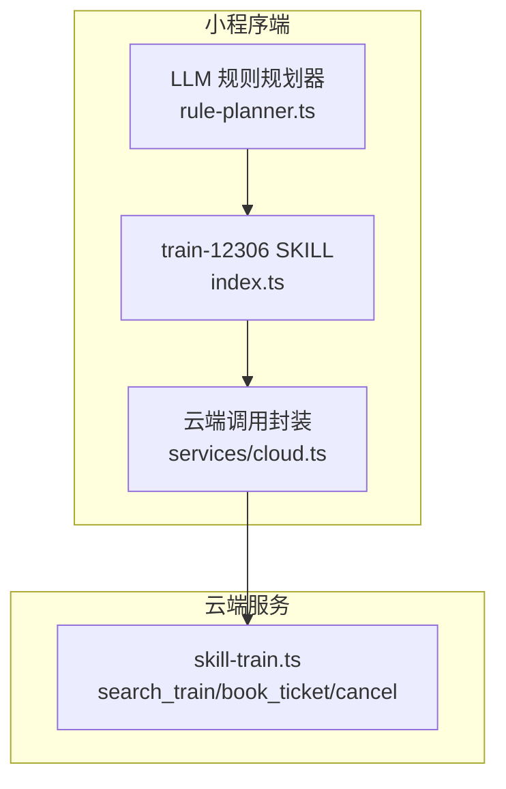
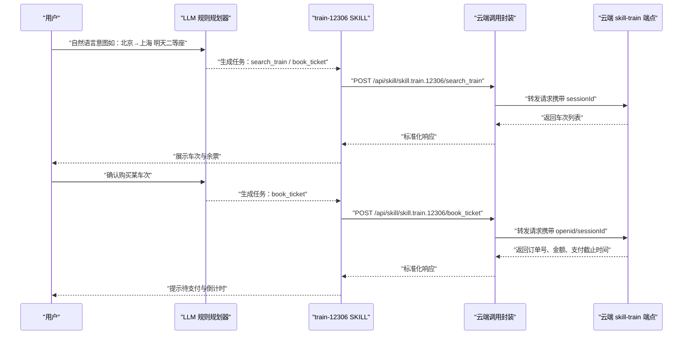
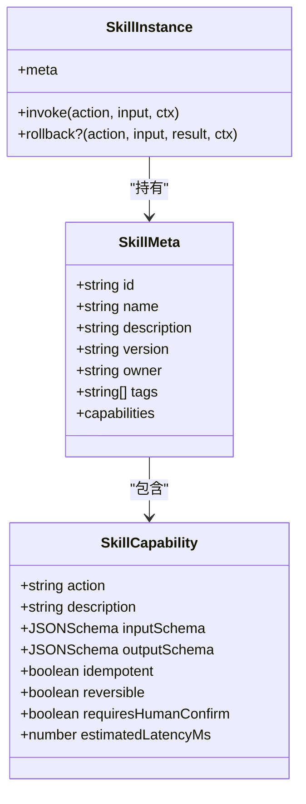
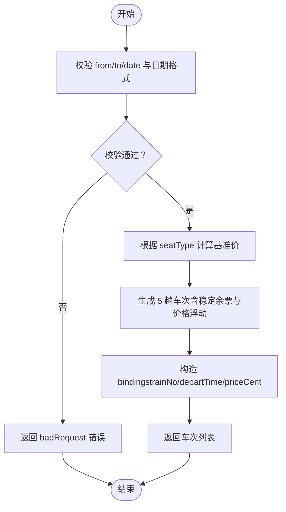
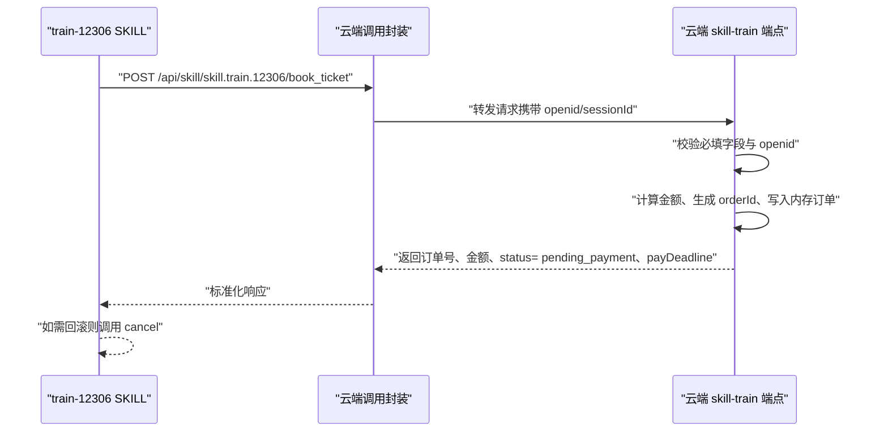
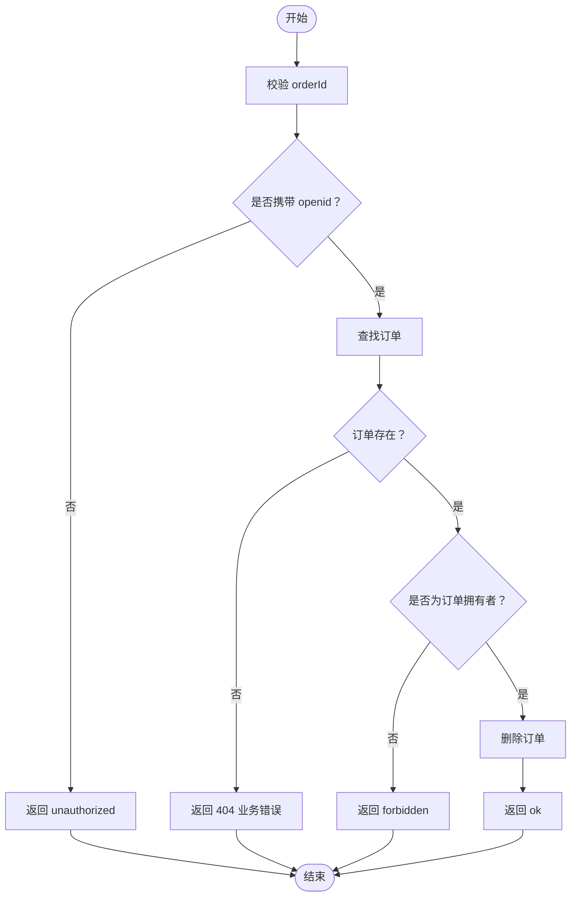
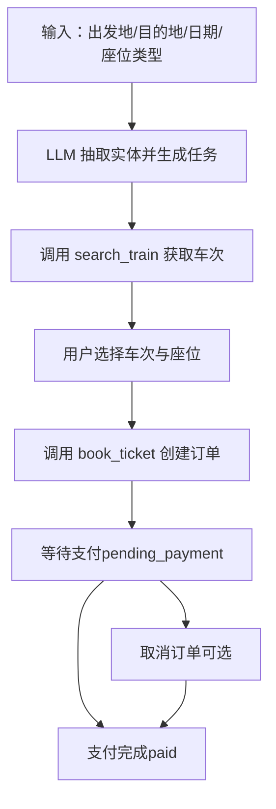
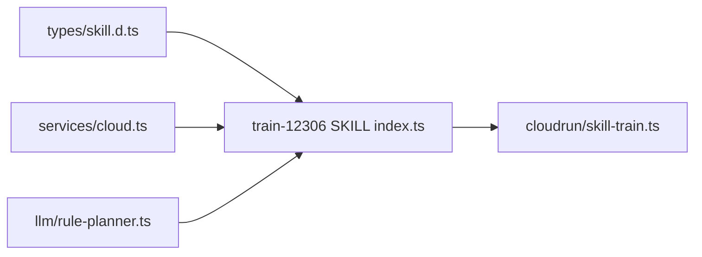

# 火车票预订SKILL

<cite>
**本文引用的文件**   
- [miniprogram/src/skills/builtin/train-12306/index.ts](file://miniprogram/src/skills/builtin/train-12306/index.ts)
- [cloudrun/src/skill-train.ts](file://cloudrun/src/skill-train.ts)
- [miniprogram/src/types/skill.d.ts](file://miniprogram/src/types/skill.d.ts)
- [miniprogram/src/services/cloud.ts](file://miniprogram/src/services/cloud.ts)
- [miniprogram/src/llm/rule-planner.ts](file://miniprogram/src/llm/rule-planner.ts)
</cite>

## 目录
1. [简介](#简介)
2. [项目结构](#项目结构)
3. [核心组件](#核心组件)
4. [架构总览](#架构总览)
5. [详细组件分析](#详细组件分析)
6. [依赖关系分析](#依赖关系分析)
7. [性能与可用性](#性能与可用性)
8. [故障排查指南](#故障排查指南)
9. [结论](#结论)
10. [附录：API 参考](#附录api-参考)

## 简介
本 SKILL 面向“火车票预订”业务，提供两大能力：
- 车次查询：根据出发地、目的地、出行日期与座位类型，返回可用车次与余票、票价等信息。
- 购票下单：为指定车次与座位类型创建订单（冻结座位），并返回支付状态与截止时间；支持回滚取消。

该 SKILL 的元数据明确边界：能做查询与下单，不能改签、退票或查询国际列车；触发时机为用户表达“高铁/动車/火车/车次/12306”等意图时。

**章节来源**
- [miniprogram/src/skills/builtin/train-12306/index.ts:69-79](file://miniprogram/src/skills/builtin/train-12306/index.ts#L69-L79)

## 项目结构
围绕火车票预订 SKILL，代码分布在小程序端与云端两个层面：
- 小程序端
  - SKILL 实现：定义能力元信息、输入输出 Schema、调用云端接口、错误处理与回滚逻辑。
  - 云端调用封装：统一超时、重试、开发环境降级与日志埋点。
  - LLM 规则规划器：从自然语言中抽取城市、日期、座位类型，生成 search_train / book_ticket 任务。
- 云端端点
  - 提供三个 HTTP 接口：车次查询、购票下单、订单取消。
  - MVP 阶段使用内存 Map 存储订单，返回确定性模拟数据。

**图表来源**
- [miniprogram/src/skills/builtin/train-12306/index.ts:159-190](file://miniprogram/src/skills/builtin/train-12306/index.ts#L159-L190)
- [miniprogram/src/services/cloud.ts:64-149](file://miniprogram/src/services/cloud.ts#L64-L149)
- [cloudrun/src/skill-train.ts:143-147](file://cloudrun/src/skill-train.ts#L143-L147)
- [miniprogram/src/llm/rule-planner.ts:30-66](file://miniprogram/src/llm/rule-planner.ts#L30-L66)

**章节来源**
- [miniprogram/src/skills/builtin/train-12306/index.ts:1-17](file://miniprogram/src/skills/builtin/train-12306/index.ts#L1-L17)
- [cloudrun/src/skill-train.ts:1-14](file://cloudrun/src/skill-train.ts#L1-L14)

## 核心组件
- SKILL 元信息与能力声明
  - id/name/description/tags/version/owner 用于 LLM 路由与展示。
  - capabilities 描述 search_train 与 book_ticket 的输入输出 Schema、幂等性、可回滚性与是否需要人类确认。
- SKILL 实例
  - invoke：按 action 分发到查询或下单流程。
  - rollback：对 book_ticket 执行取消操作。
- 云端调用封装
  - callContainer/postContainer：统一超时、重试、开发模式降级、会话 ID 透传。
- 云端端点
  - handleSearch/handleBook/handleCancel：参数校验、鉴权、业务处理与结果返回。

**章节来源**
- [miniprogram/src/types/skill.d.ts:16-104](file://miniprogram/src/types/skill.d.ts#L16-L104)
- [miniprogram/src/skills/builtin/train-12306/index.ts:69-190](file://miniprogram/src/skills/builtin/train-12306/index.ts#L69-L190)
- [miniprogram/src/services/cloud.ts:64-149](file://miniprogram/src/services/cloud.ts#L64-L149)
- [cloudrun/src/skill-train.ts:46-141](file://cloudrun/src/skill-train.ts#L46-L141)

## 架构总览
下图展示了用户发起“火车票预订”请求后，从 LLM 规划到 SKILL 调用云端接口的完整链路。

**图表来源**
- [miniprogram/src/llm/rule-planner.ts:30-66](file://miniprogram/src/llm/rule-planner.ts#L30-L66)
- [miniprogram/src/skills/builtin/train-12306/index.ts:159-190](file://miniprogram/src/skills/builtin/train-12306/index.ts#L159-L190)
- [miniprogram/src/services/cloud.ts:64-149](file://miniprogram/src/services/cloud.ts#L64-L149)
- [cloudrun/src/skill-train.ts:46-116](file://cloudrun/src/skill-train.ts#L46-L116)

## 详细组件分析

### 业务能力与状态模型
- 能力
  - search_train：幂等、不可回滚、无需人类确认。
  - book_ticket：非幂等、可回滚、需要人类确认。
- 状态
  - 查询状态：成功返回 trains 数组；失败返回错误码与消息。
  - 下单状态：pending_payment/paid；支付截止时间为毫秒时间戳。
  - 取消状态：仅当 reversible=true 且实现 rollback 时生效。

**图表来源**
- [miniprogram/src/types/skill.d.ts:16-104](file://miniprogram/src/types/skill.d.ts#L16-L104)
- [miniprogram/src/skills/builtin/train-12306/index.ts:69-190](file://miniprogram/src/skills/builtin/train-12306/index.ts#L69-L190)

**章节来源**
- [miniprogram/src/types/skill.d.ts:16-104](file://miniprogram/src/types/skill.d.ts#L16-L104)
- [miniprogram/src/skills/builtin/train-12306/index.ts:69-190](file://miniprogram/src/skills/builtin/train-12306/index.ts#L69-L190)

### 车次查询流程
- 输入校验：出发站、到达站、日期必填；日期格式 YYYY-MM-DD。
- 座位类型：business/first_class/second_class/hard_seat，缺省为 second_class。
- 返回字段：车次号、起止站、发车/到达时间、时长、座位类型、价格（分）、余票数。
- 绑定注入：将首趟车次的 trainNo/departTime/priceCent 放入 bindings，供下游 book_ticket 引用。

**图表来源**
- [cloudrun/src/skill-train.ts:46-77](file://cloudrun/src/skill-train.ts#L46-L77)
- [miniprogram/src/skills/builtin/train-12306/index.ts:193-238](file://miniprogram/src/skills/builtin/train-12306/index.ts#L193-L238)

**章节来源**
- [cloudrun/src/skill-train.ts:46-77](file://cloudrun/src/skill-train.ts#L46-L77)
- [miniprogram/src/skills/builtin/train-12306/index.ts:193-238](file://miniprogram/src/skills/builtin/train-12306/index.ts#L193-L238)

### 购票下单流程
- 输入校验：trainNo/date/seatType/passengerName/passengerIdNo 必填。
- 鉴权：必须携带 openid（由云托管注入），否则拒绝下单。
- 订单创建：生成 orderId，写入内存订单表，返回 pending_payment 与支付截止时间。
- 回滚：通过 cancel 接口删除订单，需校验订单归属防止越权。

**图表来源**
- [miniprogram/src/skills/builtin/train-12306/index.ts:240-276](file://miniprogram/src/skills/builtin/train-12306/index.ts#L240-L276)
- [cloudrun/src/skill-train.ts:89-116](file://cloudrun/src/skill-train.ts#L89-L116)

**章节来源**
- [miniprogram/src/skills/builtin/train-12306/index.ts:240-276](file://miniprogram/src/skills/builtin/train-12306/index.ts#L240-L276)
- [cloudrun/src/skill-train.ts:89-116](file://cloudrun/src/skill-train.ts#L89-L116)

### 取消订单流程
- 输入校验：orderId 必填。
- 鉴权：必须携带 openid。
- 归属校验：仅订单拥有者可取消，防止 IDOR。
- 删除订单：从内存 Map 中移除。

**图表来源**
- [cloudrun/src/skill-train.ts:122-141](file://cloudrun/src/skill-train.ts#L122-L141)
- [miniprogram/src/skills/builtin/train-12306/index.ts:174-189](file://miniprogram/src/skills/builtin/train-12306/index.ts#L174-L189)

**章节来源**
- [cloudrun/src/skill-train.ts:122-141](file://cloudrun/src/skill-train.ts#L122-L141)
- [miniprogram/src/skills/builtin/train-12306/index.ts:174-189](file://miniprogram/src/skills/builtin/train-12306/index.ts#L174-L189)

### 用户交互流程（从输入到完成）
- 输入阶段：用户表达出发地、目的地、日期与座位类型。
- 查询阶段：LLM 规则规划器抽取实体，调用 search_train，返回车次列表。
- 选座阶段：用户选择车次与座位类型，系统通过 bindings 注入关键值。
- 下单阶段：调用 book_ticket，返回订单号与支付截止时间。
- 支付阶段：前端引导支付（本 SKILL 不直接对接支付渠道）。
- 取消阶段：如需取消，调用 rollback 走 cancel 接口。

**图表来源**
- [miniprogram/src/llm/rule-planner.ts:30-66](file://miniprogram/src/llm/rule-planner.ts#L30-L66)
- [miniprogram/src/skills/builtin/train-12306/index.ts:159-190](file://miniprogram/src/skills/builtin/train-12306/index.ts#L159-L190)

**章节来源**
- [miniprogram/src/llm/rule-planner.ts:30-66](file://miniprogram/src/llm/rule-planner.ts#L30-L66)
- [miniprogram/src/skills/builtin/train-12306/index.ts:159-190](file://miniprogram/src/skills/builtin/train-12306/index.ts#L159-L190)

### 业务规则与定价
- 座位类型枚举：business/first_class/second_class/hard_seat。
- 定价策略：以座位类型为键映射固定价格（单位：分），并在查询时做确定性小幅浮动。
- 余票策略：基于日期+车次哈希生成稳定余票数，便于演示与测试。
- 退改签政策：本 SKILL 不支持改签与退票，需走 12306 官方渠道。

**章节来源**
- [cloudrun/src/skill-train.ts:19-25](file://cloudrun/src/skill-train.ts#L19-L25)
- [cloudrun/src/skill-train.ts:55-73](file://cloudrun/src/skill-train.ts#L55-L73)
- [miniprogram/src/skills/builtin/train-12306/index.ts:72-75](file://miniprogram/src/skills/builtin/train-12306/index.ts#L72-L75)

### 与 12306 系统的集成方式与数据同步
- 当前实现：云端端点返回结构化确定性的模拟数据，订单存于内存 Map。
- 未来扩展：对接真实购票渠道时，仅替换内部实现，HTTP 端点协议保持不变。
- 数据一致性：MVP 阶段订单不持久化、多实例不共享；正式版应落库并保证跨实例一致。

**章节来源**
- [cloudrun/src/skill-train.ts:1-14](file://cloudrun/src/skill-train.ts#L1-L14)
- [cloudrun/src/skill-train.ts:27-28](file://cloudrun/src/skill-train.ts#L27-L28)

## 依赖关系分析
- 小程序端
  - train-12306 SKILL 依赖 types/skill.d.ts 的能力模型与 services/cloud.ts 的云端调用封装。
  - LLM rule-planner.ts 负责从自然语言抽取实体并生成任务。
- 云端端点
  - skill-train.ts 暴露三个路由，处理查询、下单与取消。

**图表来源**
- [miniprogram/src/types/skill.d.ts:16-104](file://miniprogram/src/types/skill.d.ts#L16-L104)
- [miniprogram/src/skills/builtin/train-12306/index.ts:13-16](file://miniprogram/src/skills/builtin/train-12306/index.ts#L13-L16)
- [miniprogram/src/services/cloud.ts:64-149](file://miniprogram/src/services/cloud.ts#L64-L149)
- [miniprogram/src/llm/rule-planner.ts:30-66](file://miniprogram/src/llm/rule-planner.ts#L30-L66)
- [cloudrun/src/skill-train.ts:143-147](file://cloudrun/src/skill-train.ts#L143-L147)

**章节来源**
- [miniprogram/src/types/skill.d.ts:16-104](file://miniprogram/src/types/skill.d.ts#L16-L104)
- [miniprogram/src/skills/builtin/train-12306/index.ts:13-16](file://miniprogram/src/skills/builtin/train-12306/index.ts#L13-L16)
- [miniprogram/src/services/cloud.ts:64-149](file://miniprogram/src/services/cloud.ts#L64-L149)
- [miniprogram/src/llm/rule-planner.ts:30-66](file://miniprogram/src/llm/rule-planner.ts#L30-L66)
- [cloudrun/src/skill-train.ts:143-147](file://cloudrun/src/skill-train.ts#L143-L147)

## 性能与可用性
- 超时与重试
  - 默认单次超时 15s；支持最多 3 次重试，指数退避基础延迟 600ms。
  - 开发环境遇到云端不可用会降级为 code:-1，允许本地 mock 与规则规划兜底。
- 幂等与回滚
  - search_train 幂等；book_ticket 非幂等但可回滚。
- 稳定性
  - 云端返回确定性模拟数据，便于开发与演示；正式版建议落库与多实例共享。

**章节来源**
- [miniprogram/src/services/cloud.ts:61-149](file://miniprogram/src/services/cloud.ts#L61-L149)
- [miniprogram/src/skills/builtin/train-12306/index.ts:121-154](file://miniprogram/src/skills/builtin/train-12306/index.ts#L121-L154)
- [cloudrun/src/skill-train.ts:1-14](file://cloudrun/src/skill-train.ts#L1-L14)

## 故障排查指南
- 常见错误码
  - SEARCH_FAILED：车次查询失败，可能网络问题（可重试）。
  - NO_TICKETS：无票（业务失败，不可重试）。
  - BOOK_FAILED：下单失败（业务失败，不可重试）。
  - CAPABILITY_NOT_FOUND：能力未找到。
- 鉴权与权限
  - unauthorized：缺少 openid，拒绝下单或取消。
  - forbidden：无权限取消他人订单（IDOR 防护）。
- 开发环境降级
  - 云端不可用时返回 code:-1，SKILL 层返回 mock 数据，确保本地演示可用。

**章节来源**
- [miniprogram/src/skills/builtin/train-12306/index.ts:169-189](file://miniprogram/src/skills/builtin/train-12306/index.ts#L169-L189)
- [miniprogram/src/skills/builtin/train-12306/index.ts:212-275](file://miniprogram/src/skills/builtin/train-12306/index.ts#L212-L275)
- [cloudrun/src/skill-train.ts:94-138](file://cloudrun/src/skill-train.ts#L94-L138)
- [miniprogram/src/services/cloud.ts:105-118](file://miniprogram/src/services/cloud.ts#L105-L118)

## 结论
本火车票预订 SKILL 在小程序端定义了清晰的能力模型与调用契约，在云端提供了稳定的查询与下单接口。MVP 阶段采用确定性模拟数据与内存订单，便于开发与演示；后续可平滑替换为真实购票渠道与持久化存储，保持对外协议不变。整体设计强调幂等、回滚、鉴权与错误分类，具备良好的可扩展性与可维护性。

## 附录：API 参考

### 车次查询
- 方法：POST
- 路径：/api/skill/skill.train.12306/search_train
- 请求体
  - from：字符串，必填
  - to：字符串，必填
  - date：YYYY-MM-DD，必填
  - seatType：枚举 business/first_class/second_class/hard_seat，可选
  - highSpeedOnly：布尔，可选
- 响应体
  - from/to/date：字符串
  - trains：数组，每项包含 trainNo/departTime/arriveTime/priceCent/ticketsLeft 等

**章节来源**
- [cloudrun/src/skill-train.ts:46-77](file://cloudrun/src/skill-train.ts#L46-L77)
- [miniprogram/src/skills/builtin/train-12306/index.ts:18-46](file://miniprogram/src/skills/builtin/train-12306/index.ts#L18-L46)

### 购票下单
- 方法：POST
- 路径：/api/skill/skill.train.12306/book_ticket
- 请求体
  - trainNo：字符串，必填
  - date：YYYY-MM-DD，必填
  - seatType：枚举，必填
  - passengerName：字符串，必填
  - passengerIdNo：字符串，必填
  - from/to：字符串，可选（来自 bindings）
- 响应体
  - orderId：字符串
  - trainNo：字符串
  - amountCent：整数（分）
  - status：pending_payment/paid
  - payDeadline：毫秒时间戳

**章节来源**
- [cloudrun/src/skill-train.ts:89-116](file://cloudrun/src/skill-train.ts#L89-L116)
- [miniprogram/src/skills/builtin/train-12306/index.ts:48-67](file://miniprogram/src/skills/builtin/train-12306/index.ts#L48-L67)

### 取消订单
- 方法：POST
- 路径：/api/skill/skill.train.12306/book_ticket/cancel
- 请求体
  - orderId：字符串，必填
- 响应体
  - ok：布尔
  - orderId：字符串

**章节来源**
- [cloudrun/src/skill-train.ts:122-141](file://cloudrun/src/skill-train.ts#L122-L141)
- [miniprogram/src/skills/builtin/train-12306/index.ts:174-189](file://miniprogram/src/skills/builtin/train-12306/index.ts#L174-L189)