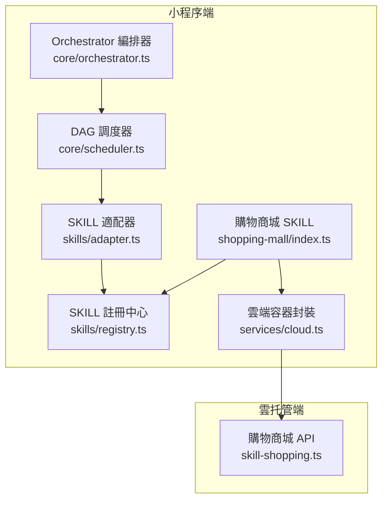
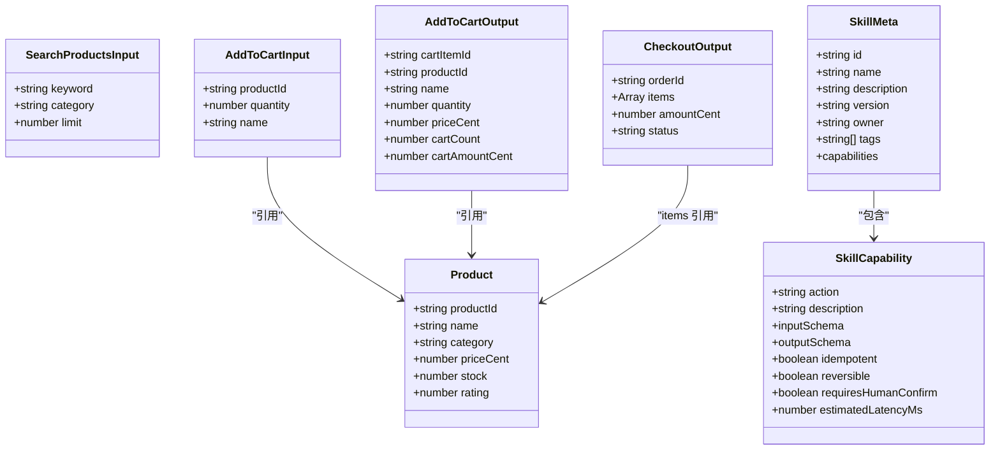
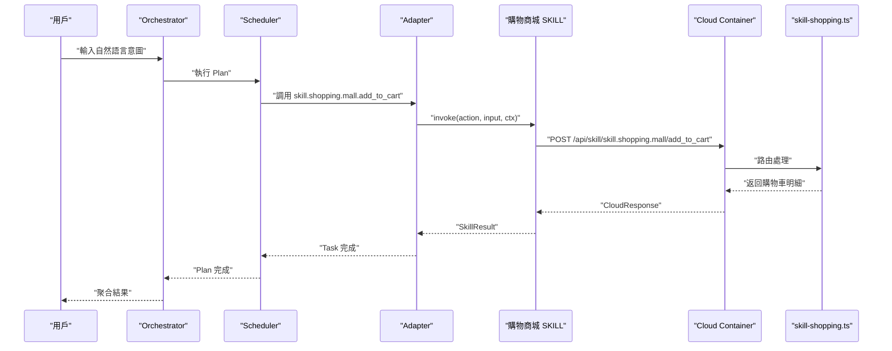
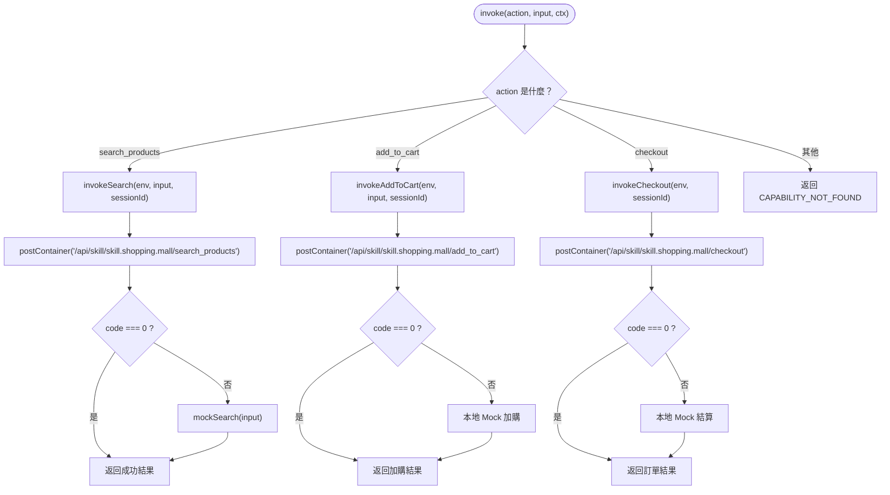
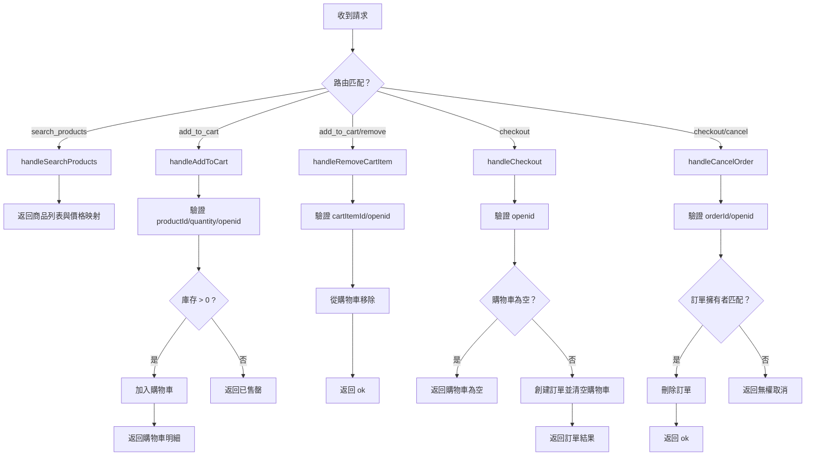
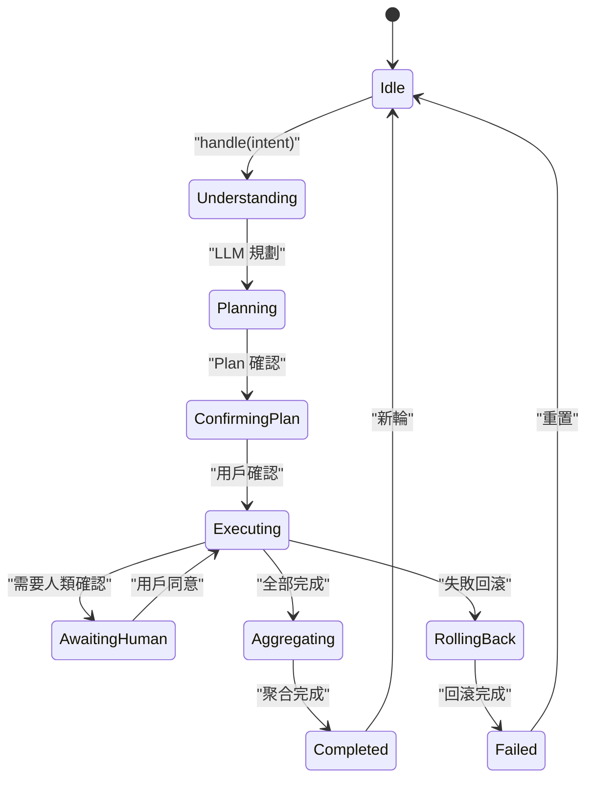
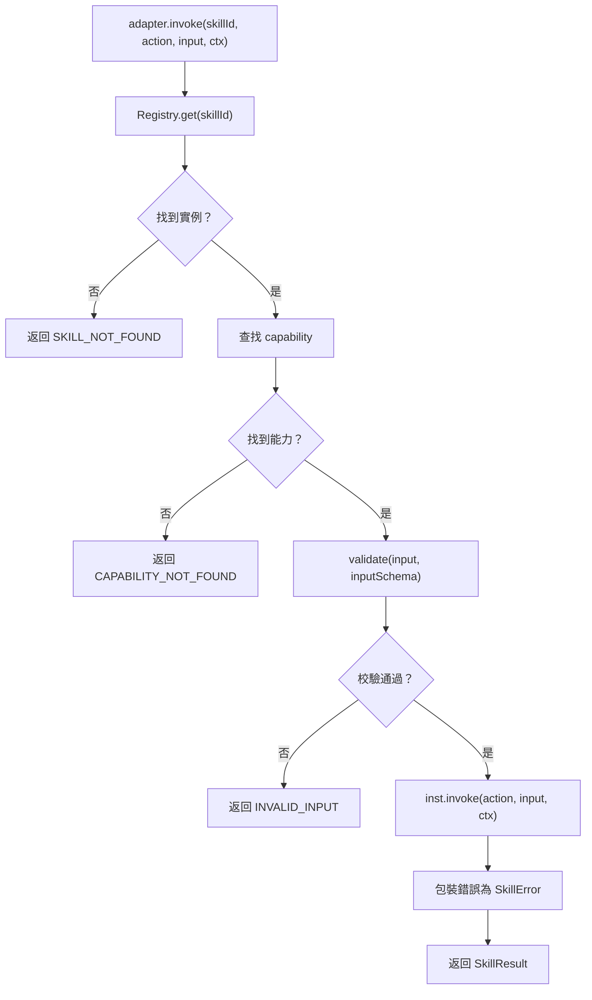
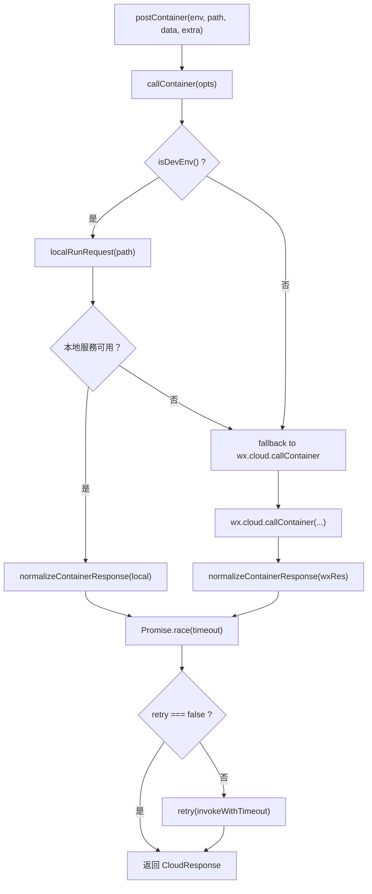
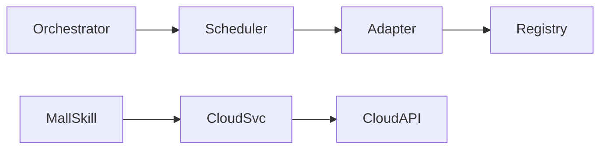

# 購物商城SKILL

<cite>
**本文引用的文件**   
- [miniprogram/src/skills/builtin/shopping-mall/index.ts](file://miniprogram/src/skills/builtin/shopping-mall/index.ts)
- [cloudrun/src/skill-shopping.ts](file://cloudrun/src/skill-shopping.ts)
- [miniprogram/src/types/skill.d.ts](file://miniprogram/src/types/skill.d.ts)
- [miniprogram/src/skills/registry.ts](file://miniprogram/src/skills/registry.ts)
- [miniprogram/src/core/orchestrator.ts](file://miniprogram/src/core/orchestrator.ts)
- [miniprogram/src/core/scheduler.ts](file://miniprogram/src/core/scheduler.ts)
- [miniprogram/src/skills/adapter.ts](file://miniprogram/src/skills/adapter.ts)
- [miniprogram/src/services/cloud.ts](file://miniprogram/src/services/cloud.ts)
- [miniprogram/app.ts](file://miniprogram/app.ts)
</cite>

## 目錄
1. [引言](#引言)
2. [項目結構與定位](#項目結構與定位)
3. [核心能力與數據模型](#核心能力與數據模型)
4. [架構總覽](#架構總覽)
5. [詳細組件分析](#詳細組件分析)
6. [依賴關係分析](#依賴關係分析)
7. [性能與可靠性特徵](#性能與可靠性特徵)
8. [故障診斷與排錯指南](#故障診斷與排錯指南)
9. [結論](#結論)

## 引言
本文件聚焦「購物商城 SKILL」，說明其在微信小程序端與雲托管服務端的協作方式、可執行能力、狀態機調度、回滾機制以及開發環境降級策略。該 SKILL 提供商品搜索、加入購物車、結算下單等電商常見流程，並配合 Orchestrator 與 Scheduler 實現可確認、可回滾、可聚合的 AI Agent 任務執行。

## 項目結構與定位
購物商城 SKILL 由兩部分組成：
- 小程序端實例：`miniprogram/src/skills/builtin/shopping-mall/index.ts`，定義 SKILL 元資訊、能力 Schema、Mock 數據、雲端調用與本地降級邏輯。
- 雲托管端點：`cloudrun/src/skill-shopping.ts`，提供確定性演示數據、購物車與訂單的記憶體存儲，以及歸屬鑒權與 rollback 端點。

**圖表來源**
- [miniprogram/src/skills/builtin/shopping-mall/index.ts:15-220](file://miniprogram/src/skills/builtin/shopping-mall/index.ts#L15-L220)
- [cloudrun/src/skill-shopping.ts:1-211](file://cloudrun/src/skill-shopping.ts#L1-L211)
- [miniprogram/src/skills/registry.ts:16-91](file://miniprogram/src/skills/registry.ts#L16-L91)
- [miniprogram/src/core/orchestrator.ts:91-376](file://miniprogram/src/core/orchestrator.ts#L91-L376)
- [miniprogram/src/core/scheduler.ts:77-249](file://miniprogram/src/core/scheduler.ts#L77-L249)
- [miniprogram/src/skills/adapter.ts:37-115](file://miniprogram/src/skills/adapter.ts#L37-L115)
- [miniprogram/src/services/cloud.ts:151-329](file://miniprogram/src/services/cloud.ts#L151-L329)

**章節來源**
- [miniprogram/src/skills/builtin/shopping-mall/index.ts:1-316](file://miniprogram/src/skills/builtin/shopping-mall/index.ts#L1-L316)
- [cloudrun/src/skill-shopping.ts:1-211](file://cloudrun/src/skill-shopping.ts#L1-L211)

## 核心能力與數據模型
購物商城 SKILL 對外暴露三個能力：
- `search_products`：按關鍵詞或類目搜索商品，返回商品列表與即時價格映射。冪等，無需人類確認。
- `add_to_cart`：將指定商品加入購物車。非冪等，需人類確認，支持回滾。
- `checkout`：結算購物車全部商品並建立訂單（清空購物車）。非冪等，需人類確認，支持回滾。

關鍵數據模型包括商品、購物車明細、訂單結果等，並在小程序端與雲端端保持字段一致，以保證 Mock 降級時展示一致性。

**圖表來源**
- [miniprogram/src/skills/builtin/shopping-mall/index.ts:20-62](file://miniprogram/src/skills/builtin/shopping-mall/index.ts#L20-L62)
- [miniprogram/src/types/skill.d.ts:17-58](file://miniprogram/src/types/skill.d.ts#L17-L58)

**章節來源**
- [miniprogram/src/skills/builtin/shopping-mall/index.ts:64-166](file://miniprogram/src/skills/builtin/shopping-mall/index.ts#L64-L166)
- [miniprogram/src/types/skill.d.ts:17-119](file://miniprogram/src/types/skill.d.ts#L17-L119)

## 架構總覽
購物商城 SKILL 的執行路徑如下：
1. Orchestrator 接收用戶意圖，進行理解與規劃。
2. Planner 根據 SKILL 元資訊生成 Plan，包含多個 Task。
3. Scheduler 按依賴並行執行 Task；寫操作觸發 checkpoint 彈窗等待人類確認。
4. Adapter 統一校驗入參、調用 SKILL 實例，並包裝錯誤。
5. shopping-mall SKILL 優先調用雲端容器端點；若雲端不可用（code < 0），則使用本地 Mock 數據模擬行為。
6. 失敗時 Orchestrator 按反序對可逆任務執行 rollback。

**圖表來源**
- [miniprogram/src/core/orchestrator.ts:119-289](file://miniprogram/src/core/orchestrator.ts#L119-L289)
- [miniprogram/src/core/scheduler.ts:143-208](file://miniprogram/src/core/scheduler.ts#L143-L208)
- [miniprogram/src/skills/adapter.ts:37-85](file://miniprogram/src/skills/adapter.ts#L37-L85)
- [miniprogram/src/skills/builtin/shopping-mall/index.ts:185-220](file://miniprogram/src/skills/builtin/shopping-mall/index.ts#L185-L220)
- [miniprogram/src/services/cloud.ts:151-241](file://miniprogram/src/services/cloud.ts#L151-L241)
- [cloudrun/src/skill-shopping.ts:84-122](file://cloudrun/src/skill-shopping.ts#L84-L122)

## 詳細組件分析

### 購物商城 SKILL 實例
- 定義 `meta`，包含三個能力的 Schema、冪等性、可逆性與預估延遲。
- 維護本地 Mock 商品表與購物車，用於雲端不可用時的降級。
- `instance.invoke` 根據 action 分派到搜索、加購、結算函數。
- `instance.rollback` 針對加購與結算調用雲端 rollback 端點，失敗時拋出業務錯誤。

**圖表來源**
- [miniprogram/src/skills/builtin/shopping-mall/index.ts:185-289](file://miniprogram/src/skills/builtin/shopping-mall/index.ts#L185-L289)

**章節來源**
- [miniprogram/src/skills/builtin/shopping-mall/index.ts:64-166](file://miniprogram/src/skills/builtin/shopping-mall/index.ts#L64-L166)
- [miniprogram/src/skills/builtin/shopping-mall/index.ts:185-316](file://miniprogram/src/skills/builtin/shopping-mall/index.ts#L185-L316)

### 雲托管端點
- 提供五個 POST 端點：搜索、加購、移除購物車明細、結算、取消訂單。
- 使用記憶體 Map 存儲購物車與訂單，以 openid 作為歸屬鑒權鍵。
- 所有寫操作均檢查 openid，防止 IDOR。
- 返回標準 `ok/fail/badRequest/unauthorized/forbidden` 響應。

**圖表來源**
- [cloudrun/src/skill-shopping.ts:56-202](file://cloudrun/src/skill-shopping.ts#L56-L202)

**章節來源**
- [cloudrun/src/skill-shopping.ts:1-211](file://cloudrun/src/skill-shopping.ts#L1-L211)

### Orchestrator 與 Scheduler
- Orchestrator 管理狀態機，處理理解、規劃、確認、執行、聚合、回滾等階段。
- Scheduler 負責 DAG 調度，並行執行就緒任務，檢測死鎖，並序列化 checkpoint 彈窗。
- 兩者通過 isRunActive 令牌機制避免多輪對話重入與併發雙跑。

**圖表來源**
- [miniprogram/src/core/orchestrator.ts:60-71](file://miniprogram/src/core/orchestrator.ts#L60-L71)
- [miniprogram/src/core/orchestrator.ts:119-289](file://miniprogram/src/core/orchestrator.ts#L119-L289)
- [miniprogram/src/core/scheduler.ts:77-131](file://miniprogram/src/core/scheduler.ts#L77-L131)

**章節來源**
- [miniprogram/src/core/orchestrator.ts:91-376](file://miniprogram/src/core/orchestrator.ts#L91-L376)
- [miniprogram/src/core/scheduler.ts:77-249](file://miniprogram/src/core/scheduler.ts#L77-L249)

### SKILL 適配器與註冊中心
- Adapter 統一調用入口，負責 Schema 驗證、錯誤包裝、日誌埋點。
- Registry 提供 SKILL 註冊、查詢、Slim 列表（給 LLM 規劃）等功能。

**圖表來源**
- [miniprogram/src/skills/adapter.ts:37-85](file://miniprogram/src/skills/adapter.ts#L37-L85)
- [miniprogram/src/skills/registry.ts:16-91](file://miniprogram/src/skills/registry.ts#L16-L91)

**章節來源**
- [miniprogram/src/skills/adapter.ts:1-115](file://miniprogram/src/skills/adapter.ts#L1-L115)
- [miniprogram/src/skills/registry.ts:1-91](file://miniprogram/src/skills/registry.ts#L1-L91)

### 雲端容器封裝
- 提供 `callContainer`、`postContainer`、`getContainer` 等方法。
- 開發環境優先直連本地 cloudrun 服務，否則回落微信雲開發容器。
- 統一錯誤歸一化，支持重試與超時控制。

**圖表來源**
- [miniprogram/src/services/cloud.ts:151-329](file://miniprogram/src/services/cloud.ts#L151-L329)

**章節來源**
- [miniprogram/src/services/cloud.ts:1-329](file://miniprogram/src/services/cloud.ts#L1-L329)

## 依賴關係分析
- 小程序端 SKILL 依賴註冊中心獲取實例，依賴適配器統一調用。
- Orchestrator 依賴 Scheduler 執行 Plan，依賴適配器調用 SKILL。
- SKILL 依賴雲端容器封裝調用雲托管端點。
- 雲端端點獨立於小程序端，僅通過 HTTP 接口交互。

**圖表來源**
- [miniprogram/src/core/orchestrator.ts:13-26](file://miniprogram/src/core/orchestrator.ts#L13-L26)
- [miniprogram/src/core/scheduler.ts:18-25](file://miniprogram/src/core/scheduler.ts#L18-L25)
- [miniprogram/src/skills/adapter.ts:13-17](file://miniprogram/src/skills/adapter.ts#L13-L17)
- [miniprogram/src/skills/builtin/shopping-mall/index.ts:15-18](file://miniprogram/src/skills/builtin/shopping-mall/index.ts#L15-L18)
- [miniprogram/src/services/cloud.ts:1-11](file://miniprogram/src/services/cloud.ts#L1-L11)

**章節來源**
- [miniprogram/src/core/orchestrator.ts:1-376](file://miniprogram/src/core/orchestrator.ts#L1-L376)
- [miniprogram/src/core/scheduler.ts:1-249](file://miniprogram/src/core/scheduler.ts#L1-L249)
- [miniprogram/src/skills/adapter.ts:1-115](file://miniprogram/src/skills/adapter.ts#L1-L115)
- [miniprogram/src/skills/builtin/shopping-mall/index.ts:1-316](file://miniprogram/src/skills/builtin/shopping-mall/index.ts#L1-L316)
- [miniprogram/src/services/cloud.ts:1-329](file://miniprogram/src/services/cloud.ts#L1-L329)

## 性能與可靠性特徵
- 冪等性：`search_products` 標記為冪等，適合重複調用。
- 人類在環：`add_to_cart` 與 `checkout` 標記為需人類確認，防止誤操作。
- 可逆性：寫操作支持回滾，失敗時 Orchestrator 按反序撤銷。
- 降級策略：雲端不可用時使用本地 Mock，保證開發工具離線演示可用。
- 重試與超時：雲端容器封裝支持重試與超時控制，提升網路穩定性。

[無章節來源，因為此節為一般性討論]

## 故障診斷與排錯指南
常見問題與排查建議：
- **SKILL 未註冊**：檢查 `registry.ts` 是否正確註冊 `skill.shopping.mall`。
- **能力不存在**：確認 `meta.capabilities` 中是否包含對應 `action`。
- **入參校驗失敗**：檢查 `inputSchema` 與實際傳入參數是否匹配。
- **雲端不可用**：開發環境會自動降級為 Mock，正式環境需檢查 `wx.cloud.init` 與容器部署。
- **購物車為空**：結算前需先調用 `add_to_cart`。
- **商品售罄**：檢查雲端商品庫存或本地 Mock 數據。
- **回滾失敗**：檢查雲端 rollback 端點是否可達，openid 是否正確。

**章節來源**
- [miniprogram/src/skills/adapter.ts:44-68](file://miniprogram/src/skills/adapter.ts#L44-L68)
- [miniprogram/src/services/cloud.ts:151-241](file://miniprogram/src/services/cloud.ts#L151-L241)
- [miniprogram/src/skills/builtin/shopping-mall/index.ts:222-289](file://miniprogram/src/skills/builtin/shopping-mall/index.ts#L222-L289)
- [cloudrun/src/skill-shopping.ts:84-202](file://cloudrun/src/skill-shopping.ts#L84-L202)

## 結論
購物商城 SKILL 通過小程序端實例與雲托管端點的協作，提供了完整的電商流程能力。其設計強調人類在環、可回滾、可降級與可觀測，符合 AI Agent 規範要求。Orchestrator 與 Scheduler 確保任務執行的可靠性與可解釋性，而雲端容器封裝則提升了網路調用的穩定性與開發體驗。

[無章節來源，因為此節為總結性內容]