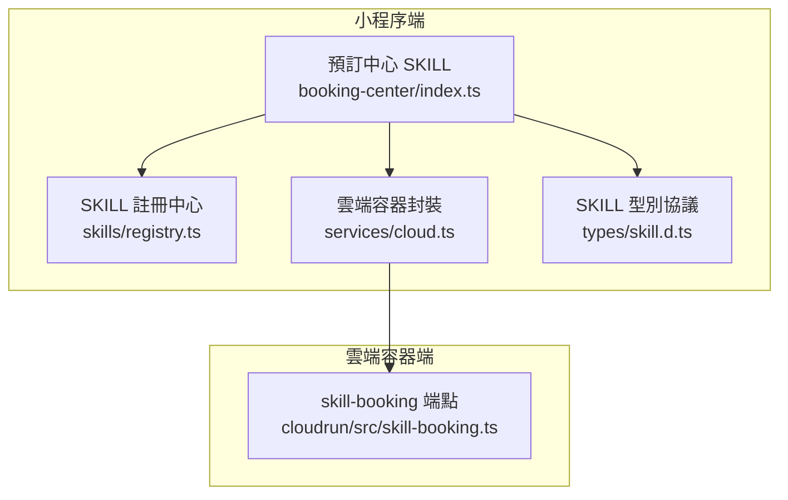
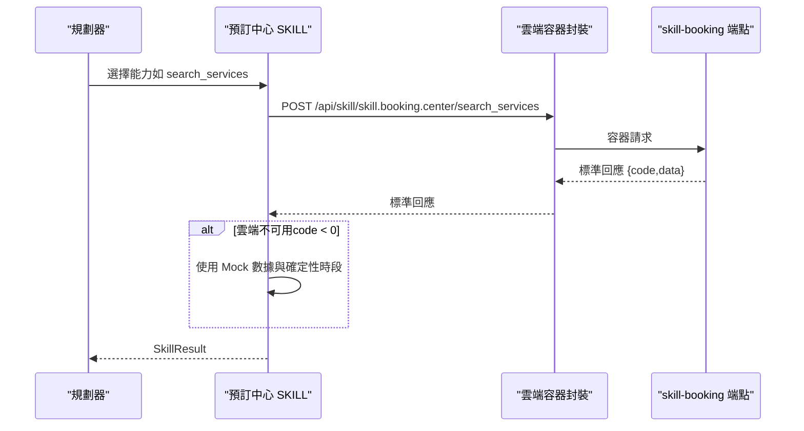
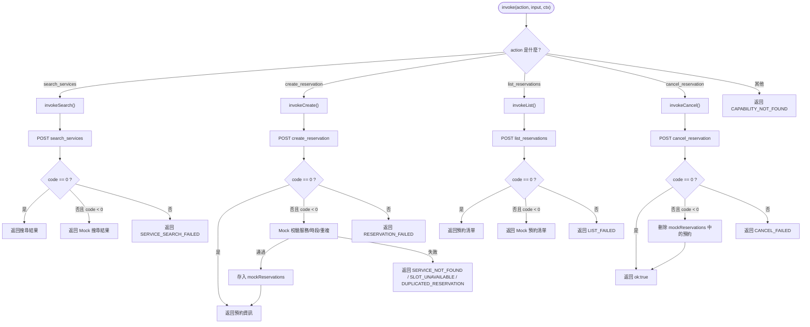
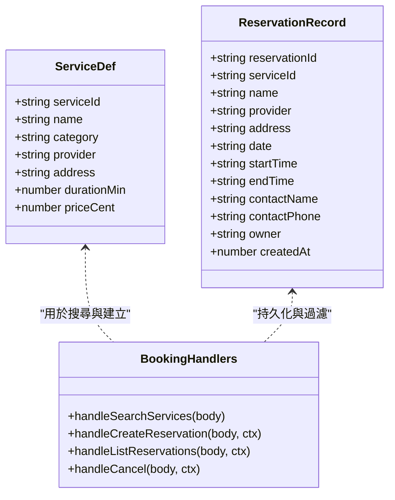
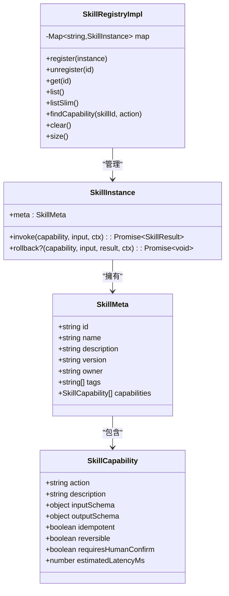
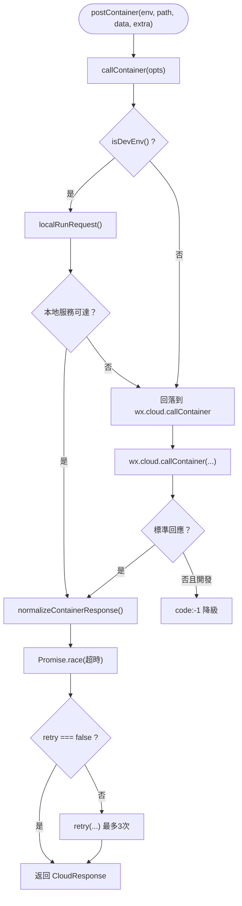
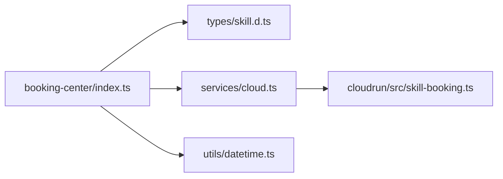

# 預訂中心 SKILL

<cite>
**本文引用的文件**   
- [miniprogram/src/skills/builtin/booking-center/index.ts](file://miniprogram/src/skills/builtin/booking-center/index.ts)
- [cloudrun/src/skill-booking.ts](file://cloudrun/src/skill-booking.ts)
- [miniprogram/src/types/skill.d.ts](file://miniprogram/src/types/skill.d.ts)
- [miniprogram/src/skills/registry.ts](file://miniprogram/src/skills/registry.ts)
- [miniprogram/src/services/cloud.ts](file://miniprogram/src/services/cloud.ts)
</cite>

## 目錄
1. [引言](#引言)
2. [專案結構與定位](#專案結構與定位)
3. [核心元件](#核心元件)
4. [架構總覽](#架構總覽)
5. [詳細元件分析](#詳細元件分析)
6. [依賴關係分析](#依賴關係分析)
7. [效能與可靠性考量](#效能與可靠性考量)
8. [故障排除指南](#故障排除指南)
9. [結論](#結論)

## 引言
本文件聚焦「預訂中心 SKILL」，說明其在微信小程序端與雲端容器端的協作方式、能力定義、資料流、錯誤處理與降級策略。該 SKILL 提供生活類服務的查詢、預約、預約清單與取消能力，並透過確定性時段演算法讓雲端與小程序模擬環境保持一致行為，便於離線演示與自動化測試。

## 專案結構與定位
預訂中心 SKILL 由兩側組成：
- 小程序端實作：位於 `miniprogram/src/skills/builtin/booking-center/index.ts`，負責能力路由、雲端呼叫、Mock 降級與會話狀態。
- 雲端容器端點：位於 `cloudrun/src/skill-booking.ts`，提供標準 REST 端點、服務目錄、時段生成、預約表與歸屬鑑權。

**圖表來源**
- [miniprogram/src/skills/builtin/booking-center/index.ts:1-427](file://miniprogram/src/skills/builtin/booking-center/index.ts#L1-L427)
- [miniprogram/src/skills/registry.ts:1-91](file://miniprogram/src/skills/registry.ts#L1-L91)
- [miniprogram/src/services/cloud.ts:1-329](file://miniprogram/src/services/cloud.ts#L1-L329)
- [cloudrun/src/skill-booking.ts:1-281](file://cloudrun/src/skill-booking.ts#L1-L281)

**章節來源**
- [miniprogram/src/skills/builtin/booking-center/index.ts:1-427](file://miniprogram/src/skills/builtin/booking-center/index.ts#L1-L427)
- [cloudrun/src/skill-booking.ts:1-281](file://cloudrun/src/skill-booking.ts#L1-L281)

## 核心元件
- 預訂中心 SKILL 實例：暴露 `meta` 與 `instance.invoke` / `rollback`，統一分派四項能力。
- 雲端容器封裝：統一 `wx.cloud.callContainer` 與開發直連模式，提供重試、超時、錯誤歸一化與開發環境降級。
- SKILL 協議型別：規範 `SkillMeta`、`SkillCapability`、`SkillInstance`、`SkillResult` 等結構。
- SKILL 註冊中心：管理 SKILL 實例生命週期，提供簡化元資訊給規劃器使用。
- 雲端容器的業務端點：實現搜尋、建立、列出、取消預約的邏輯與資料模型。

**章節來源**
- [miniprogram/src/skills/builtin/booking-center/index.ts:80-216](file://miniprogram/src/skills/builtin/booking-center/index.ts#L80-L216)
- [miniprogram/src/services/cloud.ts:150-241](file://miniprogram/src/services/cloud.ts#L150-L241)
- [miniprogram/src/types/skill.d.ts:16-104](file://miniprogram/src/types/skill.d.ts#L16-L104)
- [miniprogram/src/skills/registry.ts:16-71](file://miniprogram/src/skills/registry.ts#L16-L71)
- [cloudrun/src/skill-booking.ts:120-272](file://cloudrun/src/skill-booking.ts#L120-L272)

## 架構總覽
預訂中心 SKILL 的整體流程如下：
- 規劃器根據 SKILL 的 `meta.capabilities` 選擇動作。
- 小程序端 `instance.invoke` 將動作轉發至對應處理函式。
- 讀取類能力（搜尋、列出）優先走雲端；若雲端返回負數碼則回落到 Mock。
- 寫入類能力（建立、取消）需人類確認；建立成功後支援回滾。
- 雲端端點以記憶體 Map 儲存預約單，並以 `openid` 做歸屬鑑權。

**圖表來源**
- [miniprogram/src/skills/builtin/booking-center/index.ts:265-316](file://miniprogram/src/skills/builtin/booking-center/index.ts#L265-L316)
- [miniprogram/src/services/cloud.ts:150-241](file://miniprogram/src/services/cloud.ts#L150-L241)
- [cloudrun/src/skill-booking.ts:120-161](file://cloudrun/src/skill-booking.ts#L120-L161)

## 詳細元件分析

### 預訂中心 SKILL 實作
- 能力定義：包含 `search_services`、`create_reservation`、`list_reservations`、`cancel_reservation`，每個能力都有輸入輸出 Schema、冪等性、可回滾性與是否需要人類確認。
- 執行路由：`instance.invoke` 根據 action 分派到對應處理函式。
- 雲端與 Mock：所有讀寫操作先嘗試雲端；當雲端返回負數碼時，切換到本地 Mock，確保演示鏈路可用。
- 回滾：針對 `create_reservation`，`rollback` 會調用雲端取消端點；失敗時記錄錯誤並拋出異常。

**圖表來源**
- [miniprogram/src/skills/builtin/booking-center/index.ts:265-408](file://miniprogram/src/skills/builtin/booking-center/index.ts#L265-L408)

**章節來源**
- [miniprogram/src/skills/builtin/booking-center/index.ts:80-216](file://miniprogram/src/skills/builtin/booking-center/index.ts#L80-L216)
- [miniprogram/src/skills/builtin/booking-center/index.ts:265-408](file://miniprogram/src/skills/builtin/booking-center/index.ts#L265-L408)

### 雲端容器的預訂端點
- 服務目錄：固定五個示範服務，涵蓋運動場館、醫療健康、生活服務。
- 時段生成：使用 djb2 雜湊對 `serviceId|date|time` 計算天然開放狀態，約 3/4 開放；若全滿則強制開放最後一個時段，保證演示鏈路永遠有位可約。
- 預約表：記憶體 Map，按 `reservationId` 存取；寫入前檢查服務存在、時段可用、同用戶不重複預約；讀取時按 `openid` 過濾。
- 鑑權：寫操作必須攜帶 `x-wx-openid`，否則拒絕；取消操作還需比對 `owner` 防止 IDOR。
- 端點映射：搜尋、建立、建立取消（rollback）、列出、取消。

**圖表來源**
- [cloudrun/src/skill-booking.ts:25-74](file://cloudrun/src/skill-booking.ts#L25-L74)
- [cloudrun/src/skill-booking.ts:120-272](file://cloudrun/src/skill-booking.ts#L120-L272)

**章節來源**
- [cloudrun/src/skill-booking.ts:25-74](file://cloudrun/src/skill-booking.ts#L25-L74)
- [cloudrun/src/skill-booking.ts:120-272](file://cloudrun/src/skill-booking.ts#L120-L272)

### SKILL 協議與註冊中心
- 協議型別：定義 `SkillMeta`、`SkillCapability`、`SkillInstance`、`SkillResult`、`SkillError`，約束 SKILL 對外能力與執行結果。
- 註冊中心：提供註冊、反註冊、列出完整或簡化元資訊、依 id 取得實例、查詢能力屬性（冪等、可回滾、是否需人類確認）。

**圖表來源**
- [miniprogram/src/types/skill.d.ts:16-104](file://miniprogram/src/types/skill.d.ts#L16-L104)
- [miniprogram/src/skills/registry.ts:16-71](file://miniprogram/src/skills/registry.ts#L16-L71)

**章節來源**
- [miniprogram/src/types/skill.d.ts:16-104](file://miniprogram/src/types/skill.d.ts#L16-L104)
- [miniprogram/src/skills/registry.ts:16-71](file://miniprogram/src/skills/registry.ts#L16-L71)

### 雲端容器封裝與開發直連
- 統一入口：`callContainer` 支持開發直連與微信雲開發兩種通道。
- 開發直連：在開發環境優先嘗試 `http://127.0.0.1:8787`，連線失敗才回落雲開發；注入佔位 `x-wx-openid` 供寫操作鑑權。
- 錯誤歸一：空回應、5xx 視為網路錯誤並標記可重試；開發環境非標準回應體降為 `code:-1`；標準業務失敗透傳。
- 重試與超時：預設三次重試，每次獨立計時；可關閉重試。

**圖表來源**
- [miniprogram/src/services/cloud.ts:122-241](file://miniprogram/src/services/cloud.ts#L122-L241)
- [miniprogram/src/services/cloud.ts:301-315](file://miniprogram/src/services/cloud.ts#L301-L315)

**章節來源**
- [miniprogram/src/services/cloud.ts:122-241](file://miniprogram/src/services/cloud.ts#L122-L241)
- [miniprogram/src/services/cloud.ts:301-315](file://miniprogram/src/services/cloud.ts#L301-L315)

## 依賴關係分析
- 預訂中心 SKILL 依賴：
  - `AgentContext` 與 `SkillInstance` / `SkillResult` / `SkillMeta` 型別。
  - `postContainer` 進行雲端容器呼叫。
  - `formatDate` 與日期工具。
- 雲端容器的預訂端點依賴：
  - 路由處理器與標準回應工具。
  - 記憶體 Map 作為 MVP 階段資料儲存。
  - `openid` 來自雲端上下文，用於歸屬鑑權。

**圖表來源**
- [miniprogram/src/skills/builtin/booking-center/index.ts:17-21](file://miniprogram/src/skills/builtin/booking-center/index.ts#L17-L21)
- [miniprogram/src/services/cloud.ts:1-329](file://miniprogram/src/services/cloud.ts#L1-L329)
- [cloudrun/src/skill-booking.ts:1-281](file://cloudrun/src/skill-booking.ts#L1-L281)

**章節來源**
- [miniprogram/src/skills/builtin/booking-center/index.ts:17-21](file://miniprogram/src/skills/builtin/booking-center/index.ts#L17-L21)
- [miniprogram/src/services/cloud.ts:1-329](file://miniprogram/src/services/cloud.ts#L1-L329)
- [cloudrun/src/skill-booking.ts:1-281](file://cloudrun/src/skill-booking.ts#L1-L281)

## 效能與可靠性考量
- 時段生成為 O(n) 遍歷已預約集合，n 為當日預約數量；MVP 階段資料量小，影響有限。
- 搜尋與列出能力為冪等，適合高頻讀取；建立與取消為非冪等，需人類確認。
- 雲端呼叫具備重試與超時機制，開發環境可降級到 Mock，提升本地演示穩定性。
- 確定性偽隨機時段算法保證雲端與 Mock 行為一致，有利於自動化驗證。

[此節為一般性討論，未直接分析特定檔案]

## 故障排除指南
常見問題與排查建議：
- 雲端不可用（開發環境）：
  - 現象：`code` 為負數，SKILL 自動回落到 Mock。
  - 排查：確認開發環境判定與 `wx.cloud.callContainer` 可用性；查看日誌中 `callContainer 不可用` 警告。
- 服務不存在：
  - 現象：建立預約返回 `SERVICE_NOT_FOUND`。
  - 排查：確認 `serviceId` 是否在服務目錄中。
- 時段不可約：
  - 現象：建立預約返回 `SLOT_UNAVAILABLE`。
  - 排查：確認時段是否天然開放且未被預約；可換其他時段。
- 重複預約：
  - 現象：建立預約返回 `DUPLICATED_RESERVATION`。
  - 排查：避免同一用戶在同一服務、同日、同時段重複預約。
- 預約不存在：
  - 現象：取消預約返回 `NOT_FOUND`。
  - 排查：確認 `reservationId` 正確且尚未取消。
- 無權取消他人預約：
  - 現象：雲端返回 `forbidden`。
  - 排查：確認 `openid` 與預約 `owner` 一致。

**章節來源**
- [miniprogram/src/services/cloud.ts:197-210](file://miniprogram/src/services/cloud.ts#L197-L210)
- [miniprogram/src/skills/builtin/booking-center/index.ts:329-366](file://miniprogram/src/skills/builtin/booking-center/index.ts#L329-L366)
- [cloudrun/src/skill-booking.ts:183-198](file://cloudrun/src/skill-booking.ts#L183-L198)
- [cloudrun/src/skill-booking.ts:241-249](file://cloudrun/src/skill-booking.ts#L241-L249)

## 結論
預訂中心 SKILL 以清晰的協議與模組化設計，串接小程序端與雲端容器端，提供穩定的生活服務預約能力。其關鍵優勢包括：
- 明確的能力定義與人類確認機制，符合安全規範。
- 雲端與 Mock 雙軌執行，保障本地演示與自動化測試。
- 確定性時段算法確保行為一致性。
- 完善的錯誤歸一與重試機制提升可靠性。

未來可考慮：
- 將預約資料落庫以提升持久性與擴展性。
- 引入更嚴謹的日期與時段校驗。
- 擴充商家開放平台整合，保持協議不變。

[此節為總結性內容，未直接分析特定檔案]