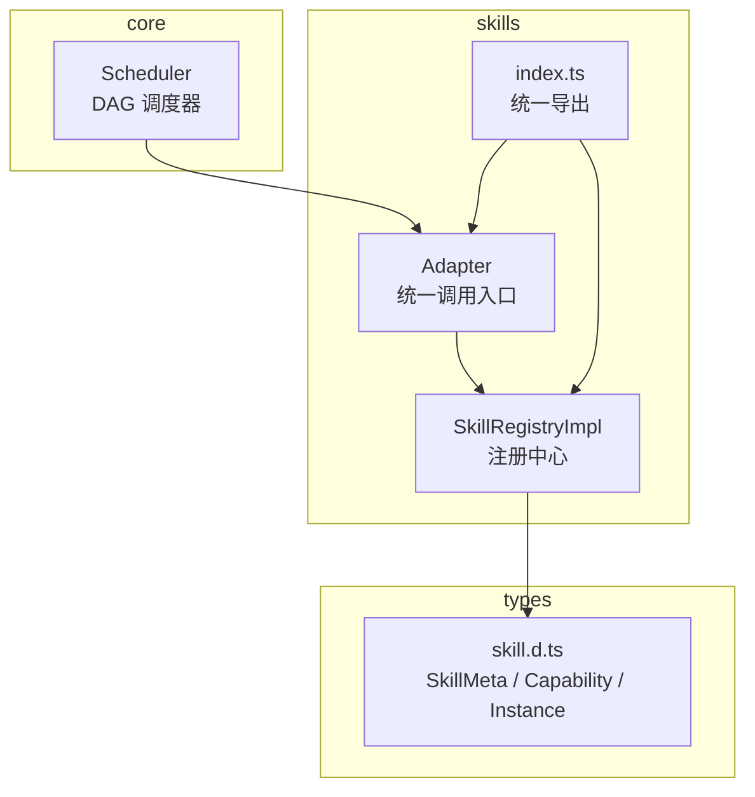
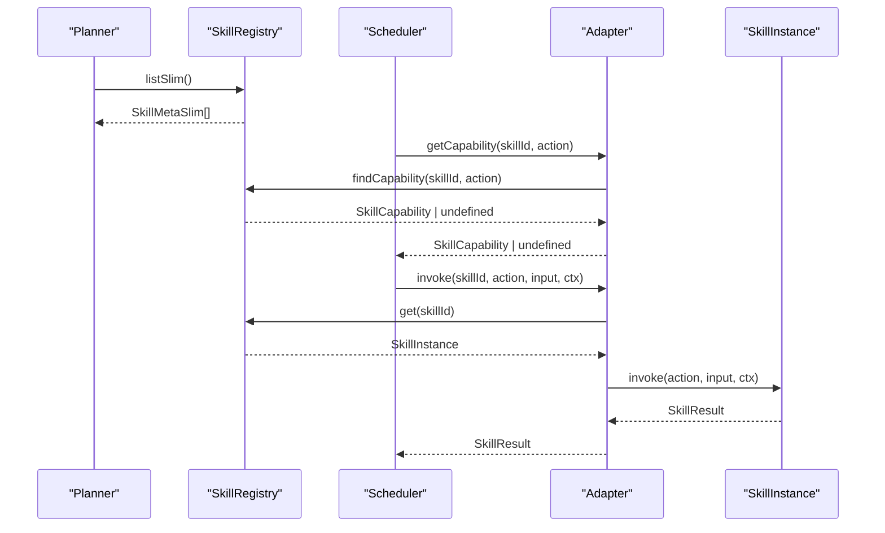
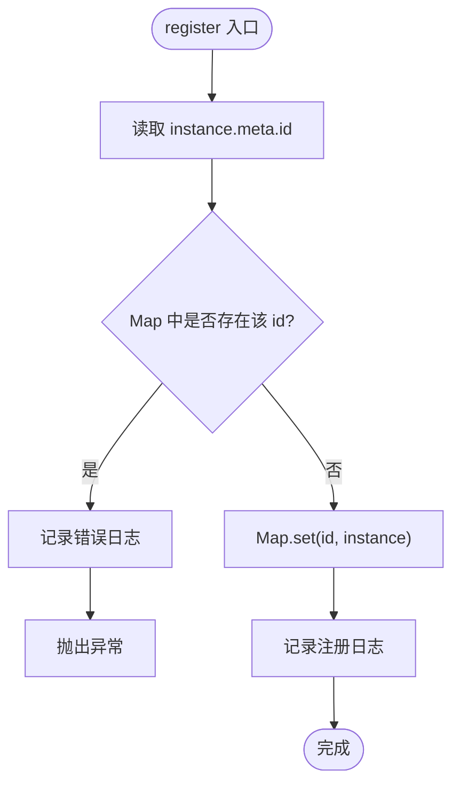
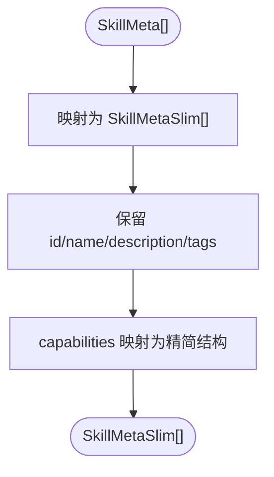
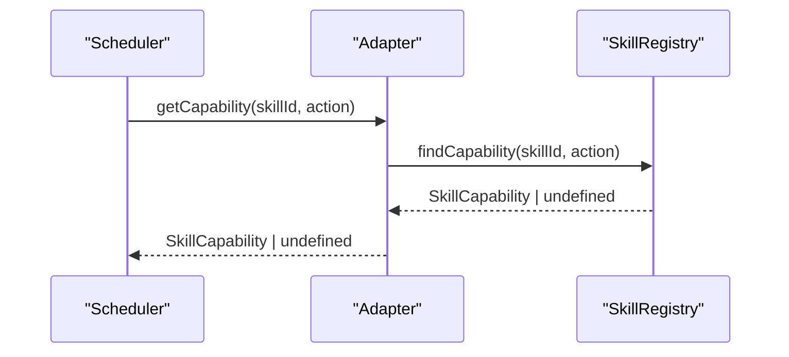
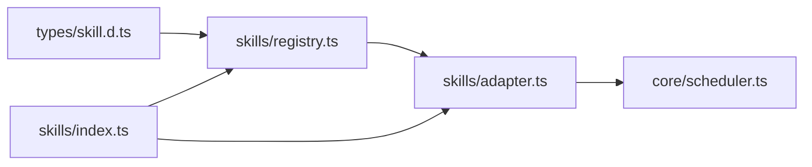

# 注册中心

<cite>
**本文引用的文件**   
- [registry.ts](file://miniprogram/src/skills/registry.ts)
- [skill.d.ts](file://miniprogram/src/types/skill.d.ts)
- [scheduler.ts](file://miniprogram/src/core/scheduler.ts)
- [adapter.ts](file://miniprogram/src/skills/adapter.ts)
- [index.ts](file://miniprogram/src/skills/index.ts)
</cite>

## 目录
1. [简介](#简介)
2. [项目结构](#项目结构)
3. [核心组件](#核心组件)
4. [架构总览](#架构总览)
5. [详细组件分析](#详细组件分析)
6. [依赖关系分析](#依赖关系分析)
7. [性能与线程安全](#性能与线程安全)
8. [故障排查指南](#故障排查指南)
9. [结论](#结论)
10. [附录：API 参考](#附录api-参考)

## 简介
本文件为 WAIC-WeChat-MiniProgram 的 SKILL 注册中心技术文档，聚焦 SkillRegistryImpl 的实现原理、数据结构设计、注册/反注册流程、查询方法、面向 LLM 的 Slim 优化，以及与调度器（Scheduler）在能力元数据上的协作。目标是帮助开发者理解注册中心的职责边界、调用方式、错误处理与性能考量，并给出可操作的排障建议。

## 项目结构
注册中心位于 skills 层，对外暴露单例 SkillRegistry，供 Planner、Adapter、Scheduler 等模块访问。类型定义集中在 types/skill.d.ts，调度逻辑在 core/scheduler.ts，适配器在 skills/adapter.ts。



图示来源
- [registry.ts:16-91](file://miniprogram/src/skills/registry.ts#L16-L91)
- [skill.d.ts:16-119](file://miniprogram/src/types/skill.d.ts#L16-L119)
- [scheduler.ts:139-204](file://miniprogram/src/core/scheduler.ts#L139-L204)
- [adapter.ts:87-112](file://miniprogram/src/skills/adapter.ts#L87-L112)
- [index.ts:1-7](file://miniprogram/src/skills/index.ts#L1-L7)

章节来源
- [registry.ts:1-91](file://miniprogram/src/skills/registry.ts#L1-L91)
- [skill.d.ts:16-119](file://miniprogram/src/types/skill.d.ts#L16-L119)
- [scheduler.ts:1-245](file://miniprogram/src/core/scheduler.ts#L1-L245)
- [adapter.ts:81-115](file://miniprogram/src/skills/adapter.ts#L81-L115)
- [index.ts:1-7](file://miniprogram/src/skills/index.ts#L1-L7)

## 核心组件
- SkillRegistryImpl：基于 Map 的 SKILL 实例注册中心，提供注册、反注册、查询、Slim 列表、能力查找、清空与计数等方法。
- SkillInstance/SkillMeta/SkillCapability/SkillMetaSlim：SKILL 协议类型，描述实例、元信息、能力声明与精简版元信息。
- Adapter：统一调用入口，封装 invoke/rollback/getCapability，内部依赖 SkillRegistry。
- Scheduler：DAG 调度器，在执行任务前通过 getCapability 获取能力元数据，用于判断是否需要用户确认、是否冪等、预估延迟等。

章节来源
- [registry.ts:16-91](file://miniprogram/src/skills/registry.ts#L16-L91)
- [skill.d.ts:16-119](file://miniprogram/src/types/skill.d.ts#L16-L119)
- [adapter.ts:87-112](file://miniprogram/src/skills/adapter.ts#L87-L112)
- [scheduler.ts:139-204](file://miniprogram/src/core/scheduler.ts#L139-L204)

## 架构总览
注册中心作为“能力目录”，被上层编排与调度使用。Planner 消费 listSlim 以生成计划；Scheduler 在执行阶段通过 adapter.getCapability 读取能力元数据，决定是否走 checkpoint 流程以及回滚策略。



图示来源
- [registry.ts:50-60](file://miniprogram/src/skills/registry.ts#L50-L60)
- [adapter.ts:87-112](file://miniprogram/src/skills/adapter.ts#L87-L112)
- [scheduler.ts:163-193](file://miniprogram/src/core/scheduler.ts#L163-L193)

## 详细组件分析

### SkillRegistryImpl 设计与实现
- 存储结构：使用 Map<string, SkillInstance>，键为 skillId，值为 SkillInstance。Map 提供 O(1) 平均查找、插入、删除，适合按 ID 快速定位实例。
- 注册 register：校验 id 唯一性，重复则记录错误日志并抛出异常；成功则写入 Map 并记录注册日志。
- 反注册 unregister：直接删除对应键值对，不返回状态，调用方需自行判断是否存在。
- 查询 get：返回 SkillInstance 或 undefined，调用方负责空值处理。
- 列出 listIds/list：分别返回所有 id 数组和完整 SkillMeta 数组，常用于管理面板或测试。
- 列出 listSlim：将每个 SkillMeta 转换为 SkillMetaSlim，去除 LLM 规划不需要的字段，降低 token 消耗。
- 能力查找 findCapability：根据 (skillId, action) 查找能力元数据，供 Scheduler 判断 requiresHumanConfirm、idempotent 等属性。
- 工具 clear/size：测试清理与统计容量。

```mermaid
classDiagram
class SkillRegistryImpl {
- map : Map~string, SkillInstance~
+ register(instance) void
+ unregister(id) void
+ get(id) SkillInstance|undefined
+ listIds() string[]
+ list() SkillMeta[]
+ listSlim() SkillMetaSlim[]
+ findCapability(skillId, action) SkillCapability|undefined
+ clear() void
+ size() number
}
class SkillInstance {
+ meta : SkillMeta
+ invoke(capability, input, ctx) Promise~SkillResult~
+ rollback?(capability, input, result, ctx) Promise~void~
}
class SkillMeta {
+ id : string
+ name : string
+ description : string
+ version : string
+ owner : string
+ tags : string[]
+ capabilities : SkillCapability[]
}
class SkillMetaSlim {
+ id : string
+ name : string
+ description : string
+ tags : string[]
+ capabilities : {action, description, inputSchema, outputSchema, requiresHumanConfirm}[]
}
class SkillCapability {
+ action : string
+ description : string
+ inputSchema : JSONSchema
+ outputSchema : JSONSchema
+ idempotent : boolean
+ reversible : boolean
+ requiresHumanConfirm : boolean
+ estimatedLatencyMs : number
}
SkillRegistryImpl --> SkillInstance : "存储/查询"
SkillInstance --> SkillMeta : "包含"
SkillMeta --> SkillCapability : "包含"
SkillMetaSlim --> SkillCapability : "精简包含"
```

图示来源
- [registry.ts:16-91](file://miniprogram/src/skills/registry.ts#L16-L91)
- [skill.d.ts:16-119](file://miniprogram/src/types/skill.d.ts#L16-L119)

章节来源
- [registry.ts:16-91](file://miniprogram/src/skills/registry.ts#L16-L91)
- [skill.d.ts:16-119](file://miniprogram/src/types/skill.d.ts#L16-L119)

### 注册与反注册流程
- 注册流程：提取 instance.meta.id → 检查 Map 中是否已存在 → 若存在则抛错 → 否则 set 并记录日志。
- 反注册流程：直接 delete 对应 id。



图示来源
- [registry.ts:20-28](file://miniprogram/src/skills/registry.ts#L20-L28)

章节来源
- [registry.ts:20-28](file://miniprogram/src/skills/registry.ts#L20-L28)

### 查询方法与使用场景
- get(id)：用于运行时按 skillId 获取实例，常见于 Adapter.invoke 与 rollback。
- listIds()：用于列举可用技能，便于 UI 展示或调试。
- list()：用于管理员/测试查看完整元信息。
- listSlim()：给 Planner 使用，减少传输到 LLM 的 token 量。

章节来源
- [registry.ts:35-53](file://miniprogram/src/skills/registry.ts#L35-L53)

### listSlim 的优化设计
- 目的：去除 LLM 规划不需要的元字段，降低 token 消耗。
- 实现：toSlim 函数仅保留 id/name/description/tags/capabilities，并对 capabilities 进一步裁剪为 action/description/inputSchema/outputSchema/requiresHumanConfirm，移除 idempotent/reversible/estimatedLatencyMs 等运行期属性。
- 收益：显著减少传给 LLM 的数据体积，提升规划效率与成本效益。



图示来源
- [registry.ts:73-88](file://miniprogram/src/skills/registry.ts#L73-L88)
- [skill.d.ts:106-119](file://miniprogram/src/types/skill.d.ts#L106-L119)

章节来源
- [registry.ts:73-88](file://miniprogram/src/skills/registry.ts#L73-L88)
- [skill.d.ts:106-119](file://miniprogram/src/types/skill.d.ts#L106-L119)

### findCapability 在 Scheduler 中的作用
- 作用：Scheduler 在执行任务前通过 adapter.getCapability 获取能力元数据，用于：
  - 判断 requiresHumanConfirm：若为真，则进入 checkpoint 流程等待用户确认。
  - 判断 idempotent/reversible：辅助决策重试与回滚策略。
  - estimatedLatencyMs：用于排程估算与用户体验优化。
- 调用链：Scheduler.executeOne → adapter.getCapability → SkillRegistry.findCapability。



图示来源
- [scheduler.ts:163-174](file://miniprogram/src/core/scheduler.ts#L163-L174)
- [adapter.ts:109-112](file://miniprogram/src/skills/adapter.ts#L109-L112)
- [registry.ts:55-60](file://miniprogram/src/skills/registry.ts#L55-L60)

章节来源
- [scheduler.ts:139-204](file://miniprogram/src/core/scheduler.ts#L139-L204)
- [adapter.ts:109-112](file://miniprogram/src/skills/adapter.ts#L109-L112)
- [registry.ts:55-60](file://miniprogram/src/skills/registry.ts#L55-L60)

## 依赖关系分析
- registry.ts 依赖 types/skill.d.ts 的类型定义。
- adapter.ts 依赖 registry.ts 的 SkillRegistry 进行实例获取与能力查询。
- scheduler.ts 通过 adapter.ts 间接使用 SkillRegistry 的能力元数据。
- index.ts 统一导出 registry 与 adapter，简化上层导入。



图示来源
- [registry.ts:13-14](file://miniprogram/src/skills/registry.ts#L13-L14)
- [adapter.ts:87-112](file://miniprogram/src/skills/adapter.ts#L87-L112)
- [scheduler.ts:22-25](file://miniprogram/src/core/scheduler.ts#L22-L25)
- [index.ts:1-7](file://miniprogram/src/skills/index.ts#L1-L7)

章节来源
- [registry.ts:13-14](file://miniprogram/src/skills/registry.ts#L13-L14)
- [adapter.ts:87-112](file://miniprogram/src/skills/adapter.ts#L87-L112)
- [scheduler.ts:22-25](file://miniprogram/src/core/scheduler.ts#L22-L25)
- [index.ts:1-7](file://miniprogram/src/skills/index.ts#L1-L7)

## 性能与线程安全
- 时间复杂度
  - register/unregister/get/findCapability：O(1) 平均（Map 操作）。
  - list/listIds：O(n)（遍历 Map）。
  - listSlim：O(n)，其中 n 为已注册 SKILL 数量，额外开销来自 toSlim 映射。
- 空间复杂度
  - 存储所有 SkillInstance 对象，内存占用与 SKILL 数量线性相关。
- 线程安全
  - JavaScript 单线程事件循环模型下，Map 读写无并发竞争。
  - 但需注意：若在异步回调中修改注册表，应确保调用顺序正确，避免竞态条件。
- 性能优化建议
  - 仅在初始化阶段批量注册，避免频繁 register/unregister。
  - 使用 listSlim 替代 list 向 LLM 传输元数据，降低 token 成本。
  - 对高频查询路径（如 get/findCapability）保持稳定的 key 命名规范，避免哈希冲突退化。
  - 结合缓存层（如 storage/cache.ts）对幂等且结果稳定的调用做缓存，减少重复执行。

[本节为通用指导，不直接分析具体文件]

## 故障排查指南
- 注册时出现“SKILL id 重複”错误
  - 原因：重复注册相同 id 的 SKILL。
  - 处理：检查注册顺序与 id 唯一性，必要时先 unregister 再重新注册。
  - 依据：register 中对重复 id 的检测与抛错。
- 查询结果为 undefined
  - 可能原因：未注册、id 拼写错误、或 findCapability 中 action 不匹配。
  - 处理：使用 listIds 核对可用 id；检查 capability.action 是否与任务一致。
- 回滚失败
  - 可能原因：SKILL 未实现 rollback 或实现抛错。
  - 处理：确认 SKILL 是否声明 reversible=true 并实现 rollback；检查 adapter.rollback 的错误日志。
- 用户确认丢失或弹窗覆盖
  - 机制：Scheduler 使用序列化 checkpoint 链，保证同一时刻只有一个确认弹窗。
  - 注意：不要在 checkpoint 回调中并行触发多个弹窗，以免 UI 覆盖导致结果丢失。

章节来源
- [registry.ts:20-28](file://miniprogram/src/skills/registry.ts#L20-L28)
- [registry.ts:55-60](file://miniprogram/src/skills/registry.ts#L55-L60)
- [adapter.ts:87-107](file://miniprogram/src/skills/adapter.ts#L87-L107)
- [scheduler.ts:54-74](file://miniprogram/src/core/scheduler.ts#L54-L74)

## 结论
SkillRegistryImpl 以简洁的 Map 结构实现了高效的 SKILL 注册与查询，配合 SkillMetaSlim 的精简策略有效降低 LLM 规划的 token 消耗。通过与 Adapter 和 Scheduler 的协作，注册中心不仅提供能力目录，还支撑了用户确认、冪等性与回滚等关键调度特性。建议在初始化阶段集中注册、使用 listSlim 传输元数据，并结合缓存与幂等策略提升整体性能与稳定性。

[本节为总结性内容，不直接分析具体文件]

## 附录：API 参考

- register(instance: SkillInstance): void
  - 功能：注册一个 SKILL 实例。
  - 参数：instance — 符合 SkillInstance 接口的实例。
  - 返回值：无。
  - 异常：当 instance.meta.id 已存在时抛出错误。
  - 使用示例：在应用启动时调用，传入各内置或动态加载的 SKILL 实例。

- unregister(id: string): void
  - 功能：反注册指定 id 的 SKILL。
  - 参数：id — 要移除的 SKILL id。
  - 返回值：无。
  - 说明：即使 id 不存在也不会抛错，调用方需自行判断。

- get(id: string): SkillInstance | undefined
  - 功能：按 id 获取 SKILL 实例。
  - 参数：id — 目标 SKILL id。
  - 返回值：SkillInstance 或 undefined。
  - 使用示例：Adapter.invoke 内部通过此方法取得实例后调用 invoke。

- listIds(): string[]
  - 功能：列出所有已注册的 SKILL id。
  - 返回值：字符串数组。
  - 使用示例：UI 展示可用技能列表或调试输出。

- list(): SkillMeta[]
  - 功能：列出所有 SKILL 的完整元信息。
  - 返回值：SkillMeta 数组。
  - 使用示例：管理面板或测试用例查看完整能力清单。

- listSlim(): SkillMetaSlim[]
  - 功能：列出精简版元信息，去除 LLM 不需要的字段。
  - 返回值：SkillMetaSlim 数组。
  - 使用示例：Planner 消费以减少 token 消耗。

- findCapability(skillId: string, action: string): SkillCapability | undefined
  - 功能：根据 skillId 与 action 查找能力元数据。
  - 参数：skillId — SKILL id；action — 能力动作名。
  - 返回值：SkillCapability 或 undefined。
  - 使用示例：Scheduler 在执行前判断 requiresHumanConfirm、idempotent 等属性。

- clear(): void
  - 功能：清空注册表（主要用于测试）。
  - 返回值：无。

- size(): number
  - 功能：返回已注册 SKILL 的数量。
  - 返回值：数字。

章节来源
- [registry.ts:20-70](file://miniprogram/src/skills/registry.ts#L20-L70)
- [skill.d.ts:16-119](file://miniprogram/src/types/skill.d.ts#L16-L119)