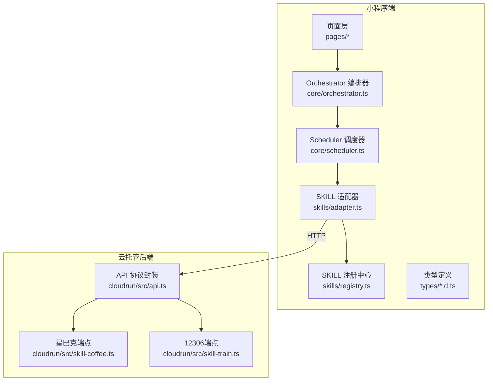
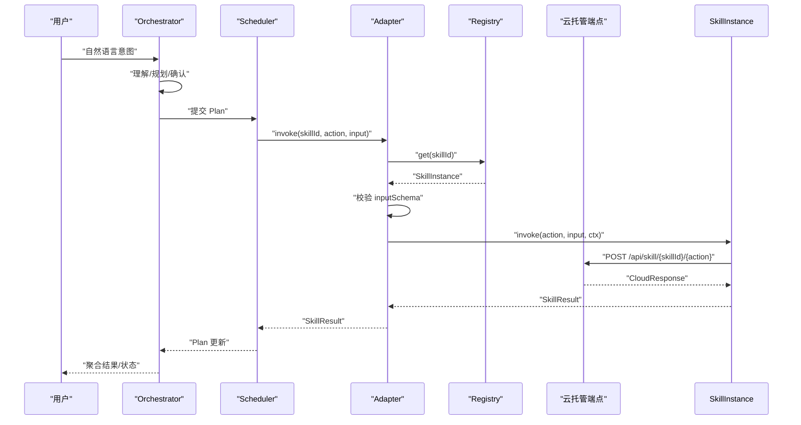
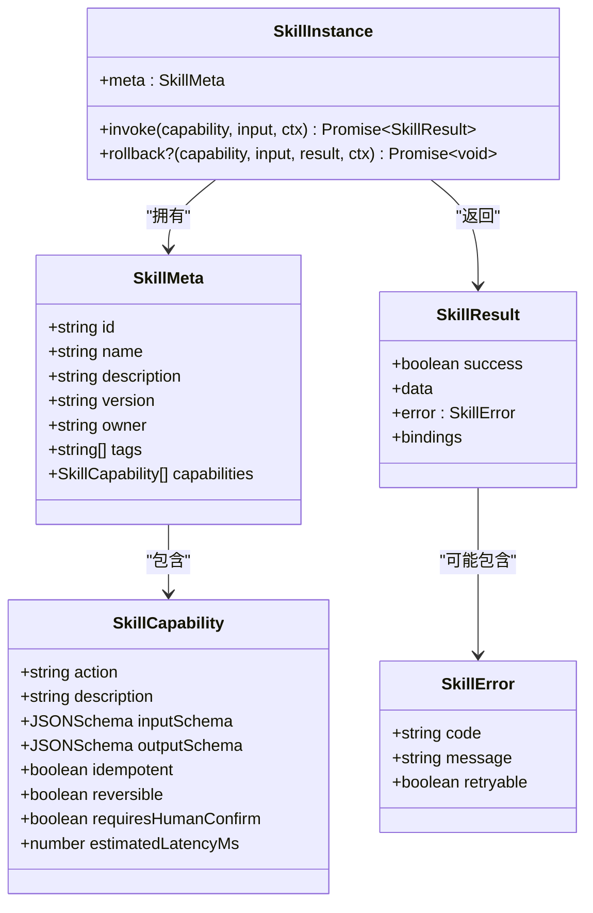
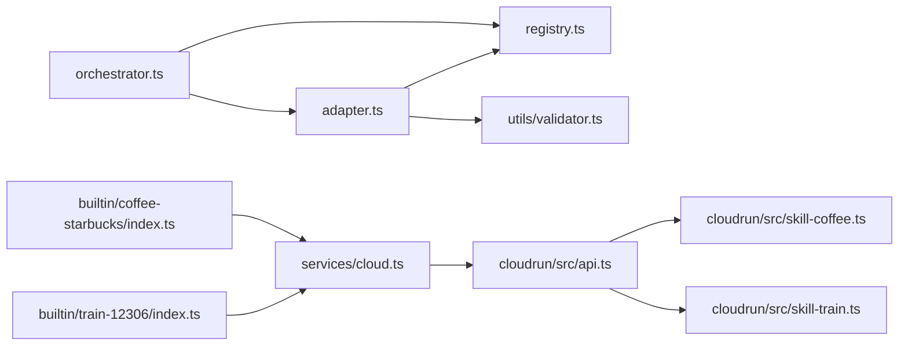

# 自定义SKILL开发

<cite>
**本文引用的文件**   
- [miniprogram/src/types/skill.d.ts](file://miniprogram/src/types/skill.d.ts)
- [miniprogram/src/types/jsonschema.d.ts](file://miniprogram/src/types/jsonschema.d.ts)
- [miniprogram/src/skills/registry.ts](file://miniprogram/src/skills/registry.ts)
- [miniprogram/src/skills/adapter.ts](file://miniprogram/src/skills/adapter.ts)
- [miniprogram/src/skills/index.ts](file://miniprogram/src/skills/index.ts)
- [miniprogram/src/skills/builtin/coffee-starbucks/index.ts](file://miniprogram/src/skills/builtin/coffee-starbucks/index.ts)
- [miniprogram/src/skills/builtin/train-12306/index.ts](file://miniprogram/src/skills/builtin/train-12306/index.ts)
- [miniprogram/src/core/orchestrator.ts](file://miniprogram/src/core/orchestrator.ts)
- [cloudrun/src/api.ts](file://cloudrun/src/api.ts)
- [cloudrun/src/skill-coffee.ts](file://cloudrun/src/skill-coffee.ts)
- [cloudrun/src/skill-train.ts](file://cloudrun/src/skill-train.ts)
</cite>

## 目录
1. [引言](#引言)
2. [项目结构](#项目结构)
3. [核心组件](#核心组件)
4. [架构总览](#架构总览)
5. [详细组件分析](#详细组件分析)
6. [依赖关系分析](#依赖关系分析)
7. [性能与可靠性](#性能与可靠性)
8. [调试与测试指南](#调试与测试指南)
9. [常见问题排查](#常见问题排查)
10. [结论](#结论)
11. [附录：从零实现一个自定义SKILL](#附录从零实现一个自定义skill)

## 引言
本指南面向在 WAIC-WeChat-MiniProgram 中开发“自定义 SKILL”的工程师，覆盖从需求分析、接口契约、元数据定义、能力声明、端到端调用链路、注册管理、调试测试到上线部署的全流程。文档以仓库现有类型定义、内置示例（星巴克咖啡、12306火车票）和云端端点为依据，提供可操作的规范与最佳实践。

## 项目结构
本项目采用小程序前端 + 云托管后端的分层架构：
- 小程序端负责用户交互、意图理解、计划编排、任务调度与 SKILL 调用适配。
- 云托管后端暴露统一的 /api/skill/{skillId}/{action} 路由，承载具体业务逻辑与持久化。

图表来源
- [miniprogram/src/core/orchestrator.ts:106-256](file://miniprogram/src/core/orchestrator.ts#L106-L256)
- [miniprogram/src/skills/adapter.ts:37-85](file://miniprogram/src/skills/adapter.ts#L37-L85)
- [miniprogram/src/skills/registry.ts:16-71](file://miniprogram/src/skills/registry.ts#L16-L71)
- [cloudrun/src/api.ts:10-38](file://cloudrun/src/api.ts#L10-L38)
- [cloudrun/src/skill-coffee.ts:119-123](file://cloudrun/src/skill-coffee.ts#L119-L123)
- [cloudrun/src/skill-train.ts:143-147](file://cloudrun/src/skill-train.ts#L143-L147)

章节来源
- [miniprogram/src/core/orchestrator.ts:1-340](file://miniprogram/src/core/orchestrator.ts#L1-L340)
- [miniprogram/src/skills/adapter.ts:1-115](file://miniprogram/src/skills/adapter.ts#L1-L115)
- [miniprogram/src/skills/registry.ts:1-91](file://miniprogram/src/skills/registry.ts#L1-L91)
- [cloudrun/src/api.ts:1-64](file://cloudrun/src/api.ts#L1-L64)

## 核心组件
- 类型契约：SkillMeta、SkillCapability、SkillInstance、SkillResult、SkillError、JSONSchema。
- 注册中心：SkillRegistry，负责 SKILL 实例的注册、查询、列出元信息。
- 统一适配器：invoke/rollback/getCapability，负责参数校验、埋点、错误归一化、回滚桥接。
- 编排器：Orchestrator，驱动理解→规划→确认→执行→聚合→完成/失败状态机。
- 云端协议：CloudResponse、RequestContext、RouteHandler，以及各 Skill 路由处理器。

章节来源
- [miniprogram/src/types/skill.d.ts:16-119](file://miniprogram/src/types/skill.d.ts#L16-L119)
- [miniprogram/src/types/jsonschema.d.ts:10-50](file://miniprogram/src/types/jsonschema.d.ts#L10-L50)
- [miniprogram/src/skills/registry.ts:16-91](file://miniprogram/src/skills/registry.ts#L16-L91)
- [miniprogram/src/skills/adapter.ts:19-115](file://miniprogram/src/skills/adapter.ts#L19-L115)
- [miniprogram/src/core/orchestrator.ts:74-340](file://miniprogram/src/core/orchestrator.ts#L74-L340)
- [cloudrun/src/api.ts:10-64](file://cloudrun/src/api.ts#L10-L64)

## 架构总览
下图展示一次完整的 SKILL 调用链：用户输入 → 编排器规划 → 调度器执行 → 适配器校验与调用 → 云端端点处理 → 结果回传与聚合。

图表来源
- [miniprogram/src/core/orchestrator.ts:106-256](file://miniprogram/src/core/orchestrator.ts#L106-L256)
- [miniprogram/src/skills/adapter.ts:37-85](file://miniprogram/src/skills/adapter.ts#L37-L85)
- [miniprogram/src/skills/registry.ts:35-60](file://miniprogram/src/skills/registry.ts#L35-L60)
- [cloudrun/src/skill-coffee.ts:119-123](file://cloudrun/src/skill-coffee.ts#L119-L123)
- [cloudrun/src/skill-train.ts:143-147](file://cloudrun/src/skill-train.ts#L143-L147)

## 详细组件分析

### 类型契约与接口规范
- SkillMeta：描述 SKILL 的身份、名称、LLM 可读描述、版本、归属、标签与能力清单。
- SkillCapability：每个对外能力的动作名、描述、输入输出 Schema、幂等性、可回滚性、是否需要人类确认、预估延迟。
- SkillInstance：包含 meta 与 invoke；可选 rollback。
- SkillResult/SkillError：统一返回结构与错误模型。
- JSONSchema：用于入参/出参的结构化约束。

图表来源
- [miniprogram/src/types/skill.d.ts:16-119](file://miniprogram/src/types/skill.d.ts#L16-L119)

章节来源
- [miniprogram/src/types/skill.d.ts:16-119](file://miniprogram/src/types/skill.d.ts#L16-L119)
- [miniprogram/src/types/jsonschema.d.ts:10-50](file://miniprogram/src/types/jsonschema.d.ts#L10-L50)

### 注册中心（SkillRegistry）
职责：
- 注册/反注册 SKILL 实例，禁止重复 id。
- 提供 list/listSlim 供管理与 LLM 规划使用。
- 通过 skillId 获取实例，或按 (skillId, action) 查询 capability 属性。

关键行为：
- register 时若 id 重复则抛错并记录日志。
- listSlim 会裁剪掉 LLM 不需要的字段以降低 token 消耗。
- findCapability 供 Scheduler 判断幂等、可回滚、是否需要人类确认等。

章节来源
- [miniprogram/src/skills/registry.ts:16-91](file://miniprogram/src/skills/registry.ts#L16-L91)

### 统一适配器（Adapter）
职责：
- 统一入口 invoke：查找实例、校验 capability、校验 inputSchema、埋点、调用 SKILL、捕获异常并包装为 SkillError。
- 统一回滚 bridge：调用 SKILL.rollback（若存在），否则返回未回滚原因。
- getCapability：供 Scheduler 读取 capability 元信息。

关键点：
- 所有异常被转换为标准 SkillError，确保上层一致处理。
- 支持 skipValidation 选项，内部调用时可跳过 schema 校验。

章节来源
- [miniprogram/src/skills/adapter.ts:19-115](file://miniprogram/src/skills/adapter.ts#L19-L115)

### 编排器（Orchestrator）
职责：
- 驱动状态机：idle → understanding → planning → confirming_plan → executing → aggregating → completed/failed。
- 协调 LLM 规划、Plan 确认、任务调度、结果聚合。
- 失败时按反序对“已成功且可回滚”的任务进行回滚。

重点：
- 通过 runToken 防止并发重置导致的重复执行与状态错乱。
- 将 task.waiting_human 映射为 awaiting_human 状态，联动 UI。

章节来源
- [miniprogram/src/core/orchestrator.ts:74-340](file://miniprogram/src/core/orchestrator.ts#L74-L340)

### 云端协议与端点
- CloudResponse：code=0 表示成功，非 0 表示业务失败；HTTP 5xx 视为网络层错误。
- RequestContext：注入 openid/sessionId，用于鉴权与追踪。
- RouteHandler：统一签名，返回 httpStatus + body。
- 示例端点：
  - 星巴克咖啡：search_store、place_order、place_order/cancel。
  - 12306火车票：search_train、book_ticket、book_ticket/cancel。

章节来源
- [cloudrun/src/api.ts:10-64](file://cloudrun/src/api.ts#L10-L64)
- [cloudrun/src/skill-coffee.ts:119-123](file://cloudrun/src/skill-coffee.ts#L119-L123)
- [cloudrun/src/skill-train.ts:143-147](file://cloudrun/src/skill-train.ts#L143-L147)

## 依赖关系分析
- 编排器依赖 LLM 客户端、调度器、SKILL 适配器与注册中心。
- 适配器依赖注册中心与验证器，不直接依赖 wx.*。
- 内置 SKILL 通过 services/cloud 调用云端端点，遵循统一协议。
- 云端端点依赖 api.ts 提供的响应构造器与鉴权上下文。

图表来源
- [miniprogram/src/core/orchestrator.ts:13-25](file://miniprogram/src/core/orchestrator.ts#L13-L25)
- [miniprogram/src/skills/adapter.ts:13-17](file://miniprogram/src/skills/adapter.ts#L13-L17)
- [miniprogram/src/skills/builtin/coffee-starbucks/index.ts:11-14](file://miniprogram/src/skills/builtin/coffee-starbucks/index.ts#L11-L14)
- [miniprogram/src/skills/builtin/train-12306/index.ts:13-16](file://miniprogram/src/skills/builtin/train-12306/index.ts#L13-L16)
- [cloudrun/src/api.ts:10-64](file://cloudrun/src/api.ts#L10-L64)

章节来源
- [miniprogram/src/core/orchestrator.ts:1-340](file://miniprogram/src/core/orchestrator.ts#L1-L340)
- [miniprogram/src/skills/adapter.ts:1-115](file://miniprogram/src/skills/adapter.ts#L1-L115)
- [miniprogram/src/skills/builtin/coffee-starbucks/index.ts:1-237](file://miniprogram/src/skills/builtin/coffee-starbucks/index.ts#L1-L237)
- [miniprogram/src/skills/builtin/train-12306/index.ts:1-293](file://miniprogram/src/skills/builtin/train-12306/index.ts#L1-L293)
- [cloudrun/src/api.ts:1-64](file://cloudrun/src/api.ts#L1-L64)

## 性能与可靠性
- 预估延迟：在 Capability.estimatedLatencyMs 中声明，供 Scheduler 估算排程与超时策略。
- 幂等性：idempotent=true 的能力可安全重试；写操作通常设为 false。
- 可回滚性：reversible=true 的能力需实现 rollback，失败路径由 Orchestrator 自动触发。
- 人类确认：requiresHumanConfirm=true 的能力在执行前需 checkpoint 确认，避免误操作。
- 错误分类：SkillError.code/message/retryable 明确区分网络类与业务类错误，便于重试与降级。
- 资源隔离：云端端点使用内存 Map 存储订单（MVP），生产环境应落库并考虑多实例共享。

[本节为通用指导，不直接分析具体文件]

## 调试与测试指南
- 本地调试：
  - 云端不可用时，内置 SKILL 会返回 mock 数据，便于前端联调。
  - 通过日志查看 SKILL 调用耗时与错误堆栈。
- 单元测试建议：
  - 注册中心：重复注册、list/listSlim、findCapability。
  - 适配器：inputSchema 校验失败、未知 skillId/action、异常包装。
  - 编排器：状态转移合法性、reset 令牌失效、失败回滚顺序。
  - 云端端点：参数校验、鉴权、IDOR 防护、业务失败码。
- 集成测试：
  - 端到端走查 search_store/place_order 与 search_train/book_ticket 主流程。
  - 验证 rollback 是否按反序撤销已成功且可回滚的任务。

章节来源
- [miniprogram/src/skills/builtin/coffee-starbucks/index.ts:179-237](file://miniprogram/src/skills/builtin/coffee-starbucks/index.ts#L179-L237)
- [miniprogram/src/skills/builtin/train-12306/index.ts:192-293](file://miniprogram/src/skills/builtin/train-12306/index.ts#L192-L293)
- [miniprogram/src/skills/adapter.ts:37-115](file://miniprogram/src/skills/adapter.ts#L37-L115)
- [miniprogram/src/core/orchestrator.ts:278-303](file://miniprogram/src/core/orchestrator.ts#L278-L303)

## 常见问题排查
- 问题：SKILL 未注册或 action 不存在
  - 现象：返回 SKILL_NOT_FOUND/CAPABILITY_NOT_FOUND。
  - 排查：检查 SkillRegistry.register 是否调用；检查 meta.capabilities.action 是否与调用一致。
- 问题：入参校验失败
  - 现象：INVALID_INPUT，附带 path 与 message。
  - 排查：核对 inputSchema 与传入对象结构；必要时开启 skipValidation 定位问题。
- 问题：写操作未确认导致流程中断
  - 现象：requiresHumanConfirm=true 但无 checkpoint 确认。
  - 排查：确保上层注入 checkpoint 回调并在 UI 中提示用户确认。
- 问题：回滚失败
  - 现象：rolled=false，reason 包含错误信息。
  - 排查：检查 SKILL.rollback 实现与云端 cancel 端点；确认 orderId 与归属鉴权。
- 问题：云端鉴权失败
  - 现象：unauthorized/forbidden。
  - 排查：确保请求头携带 x-wx-openid；云端侧校验 owner 与当前 openid。

章节来源
- [miniprogram/src/skills/adapter.ts:44-85](file://miniprogram/src/skills/adapter.ts#L44-L85)
- [miniprogram/src/skills/adapter.ts:88-107](file://miniprogram/src/skills/adapter.ts#L88-L107)
- [cloudrun/src/skill-coffee.ts:67-116](file://cloudrun/src/skill-coffee.ts#L67-L116)
- [cloudrun/src/skill-train.ts:94-140](file://cloudrun/src/skill-train.ts#L94-L140)

## 结论
自定义 SKILL 的开发围绕“类型契约 + 注册中心 + 统一适配器 + 编排调度 + 云端端点”展开。严格遵循 SkillMeta/SkillCapability/SkillInstance 的契约，清晰描述能力边界与约束，配合 Orchestrator 的状态机与回滚机制，可实现稳定、可观测、可回滚的智能任务执行。云端端点需保证鉴权与幂等设计，结合 Mock 与日志，快速完成开发与联调。

[本节为总结性内容，不直接分析具体文件]

## 附录：从零实现一个自定义SKILL

### 步骤一：需求分析与能力拆分
- 明确“能做/不能做/何时触发”，写入 SkillMeta.description。
- 拆分为多个 action，并为每个 action 定义 inputSchema/outputSchema。
- 标注 idempotent、reversible、requiresHumanConfirm、estimatedLatencyMs。

章节来源
- [miniprogram/src/types/skill.d.ts:16-58](file://miniprogram/src/types/skill.d.ts#L16-L58)

### 步骤二：定义元数据与能力
- 在 SKILL 模块导出 meta（SkillMeta）与 instance（SkillInstance）。
- 参考内置示例的结构组织 types、meta、instance 与内部函数。

章节来源
- [miniprogram/src/skills/builtin/coffee-starbucks/index.ts:58-177](file://miniprogram/src/skills/builtin/coffee-starbucks/index.ts#L58-L177)
- [miniprogram/src/skills/builtin/train-12306/index.ts:69-190](file://miniprogram/src/skills/builtin/train-12306/index.ts#L69-L190)

### 步骤三：实现 invoke 与 rollback
- invoke 根据 action 分发到内部函数，调用云端端点并返回 SkillResult。
- 若 capability.reversible=true，必须实现 rollback，调用云端 cancel 接口。

章节来源
- [miniprogram/src/skills/builtin/coffee-starbucks/index.ts:148-177](file://miniprogram/src/skills/builtin/coffee-starbucks/index.ts#L148-L177)
- [miniprogram/src/skills/builtin/train-12306/index.ts:159-190](file://miniprogram/src/skills/builtin/train-12306/index.ts#L159-L190)

### 步骤四：注册 SKILL
- 在应用启动时调用 SkillRegistry.register(instance)。
- 可通过 list/listSlim 检查已注册能力。

章节来源
- [miniprogram/src/skills/registry.ts:19-53](file://miniprogram/src/skills/registry.ts#L19-L53)

### 步骤五：云端端点实现
- 在 cloudrun 中新增路由处理器，遵循 api.ts 的 CloudResponse 协议。
- 校验入参、鉴权（openid）、业务逻辑、返回结构化数据。
- 提供 cancel 端点以支持回滚。

章节来源
- [cloudrun/src/api.ts:10-64](file://cloudrun/src/api.ts#L10-L64)
- [cloudrun/src/skill-coffee.ts:33-117](file://cloudrun/src/skill-coffee.ts#L33-L117)
- [cloudrun/src/skill-train.ts:46-140](file://cloudrun/src/skill-train.ts#L46-L140)

### 步骤六：联调与测试
- 先启用云端不可用时的 mock 模式，验证前端流程。
- 逐步接入真实云端端点，校验鉴权与业务失败码。
- 编写用例覆盖：正常流程、校验失败、鉴权失败、回滚流程。

章节来源
- [miniprogram/src/skills/builtin/coffee-starbucks/index.ts:179-237](file://miniprogram/src/skills/builtin/coffee-starbucks/index.ts#L179-L237)
- [miniprogram/src/skills/builtin/train-12306/index.ts:192-293](file://miniprogram/src/skills/builtin/train-12306/index.ts#L192-L293)