# 适配器模式

<cite>
**本文引用的文件**   
- [miniprogram/src/skills/adapter.ts](file://miniprogram/src/skills/adapter.ts)
- [miniprogram/src/skills/registry.ts](file://miniprogram/src/skills/registry.ts)
- [miniprogram/src/skills/index.ts](file://miniprogram/src/skills/index.ts)
- [miniprogram/src/types/skill.d.ts](file://miniprogram/src/types/skill.d.ts)
- [miniprogram/src/types/context.d.ts](file://miniprogram/src/types/context.d.ts)
- [miniprogram/src/core/scheduler.ts](file://miniprogram/src/core/scheduler.ts)
- [miniprogram/src/skills/builtin/coffee-starbucks/index.ts](file://miniprogram/src/skills/builtin/coffee-starbucks/index.ts)
- [miniprogram/src/skills/builtin/payment-aicard/index.ts](file://miniprogram/src/skills/builtin/payment-aicard/index.ts)
- [miniprogram/src/skills/builtin/train-12306/index.ts](file://miniprogram/src/skills/builtin/train-12306/index.ts)
</cite>

## 目录
1. [引言](#引言)
2. [项目结构](#项目结构)
3. [核心组件](#核心组件)
4. [架构总览](#架构总览)
5. [详细组件分析](#详细组件分析)
6. [依赖关系分析](#依赖关系分析)
7. [性能与扩展性](#性能与扩展性)
8. [故障排查指南](#故障排查指南)
9. [结论](#结论)
10. [附录：如何新增一个外部服务适配器](#附录如何新增一个外部服务适配器)

## 引言
本技术文档围绕 WAIC-WeChat-MiniProgram 的 SKILL 适配器模式展开，解释如何通过统一的接口抽象不同外部服务的差异，使调度器、编排器与上层业务逻辑无需关心具体实现。重点包括：
- Adapter 统一入口 invoke 的参数规范与返回值约定
- 适配器如何处理不同类型的外部 API（如 REST）
- 具体适配器示例（星巴克咖啡、火车票、AI 卡支付）
- 配置管理与依赖注入机制
- 错误处理与异常转换最佳实践
- 适配器与 SKILL 实例的关系，以及如何通过适配器扩展新的外部服务集成

## 项目结构
SKILL 子系统位于 miniprogram/src/skills，包含：
- adapter.ts：统一调用适配层，负责参数校验、埋点、错误包装、回滚封装
- registry.ts：SKILL 注册中心，提供注册、查询、能力元数据暴露
- builtin/*：内置适配器实现，分别对接云函数或第三方服务
- types/skill.d.ts：SKILL 协议类型定义，约束 meta、capability、instance、result、error 等
- core/scheduler.ts：DAG 调度器，通过 adapter.invoke 执行任务，并处理 checkpoint 与级联跳过

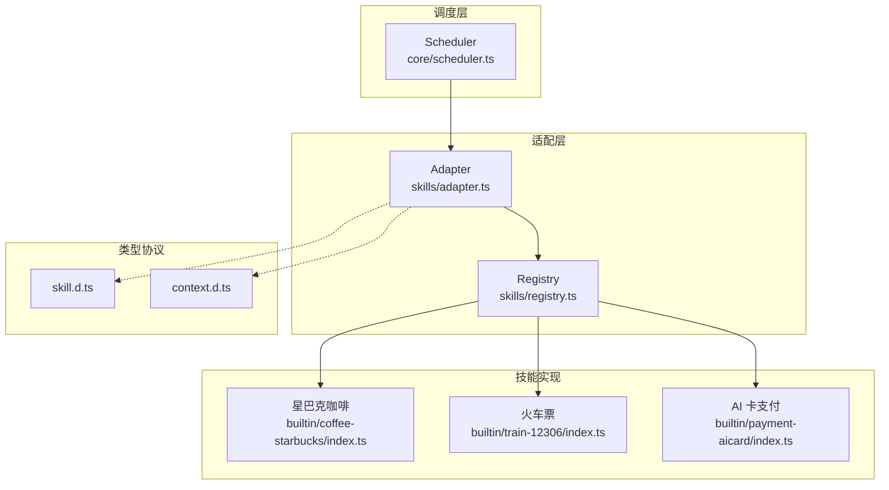

图表来源
- [miniprogram/src/core/scheduler.ts:77-128](file://miniprogram/src/core/scheduler.ts#L77-L128)
- [miniprogram/src/skills/adapter.ts:37-85](file://miniprogram/src/skills/adapter.ts#L37-L85)
- [miniprogram/src/skills/registry.ts:16-71](file://miniprogram/src/skills/registry.ts#L16-L71)
- [miniprogram/src/types/skill.d.ts:16-119](file://miniprogram/src/types/skill.d.ts#L16-L119)
- [miniprogram/src/types/context.d.ts:46-62](file://miniprogram/src/types/context.d.ts#L46-L62)

章节来源
- [miniprogram/src/skills/adapter.ts:1-115](file://miniprogram/src/skills/adapter.ts#L1-L115)
- [miniprogram/src/skills/registry.ts:1-91](file://miniprogram/src/skills/registry.ts#L1-L91)
- [miniprogram/src/core/scheduler.ts:1-245](file://miniprogram/src/core/scheduler.ts#L1-L245)
- [miniprogram/src/types/skill.d.ts:1-119](file://miniprogram/src/types/skill.d.ts#L1-L119)
- [miniprogram/src/types/context.d.ts:1-62](file://miniprogram/src/types/context.d.ts#L1-L62)

## 核心组件
- Adapter 统一入口
  - 负责查找 SKILL 实例、校验 capability、参数 schema 验证、埋点统计、统一错误包装、回滚封装
  - 对外暴露 invoke、rollback、getCapability
- Registry 注册中心
  - 管理 SkillInstance 生命周期，提供 list、listSlim、findCapability、get 等方法
- Types 协议
  - SkillMeta/SkillCapability/SkillInstance/SkillResult/SkillError 等类型约束
- Scheduler 调度器
  - 通过 adapter.invoke 执行 Task，处理 checkpoint 确认、失败级联跳过、死锁检测

章节来源
- [miniprogram/src/skills/adapter.ts:19-115](file://miniprogram/src/skills/adapter.ts#L19-L115)
- [miniprogram/src/skills/registry.ts:16-91](file://miniprogram/src/skills/registry.ts#L16-L91)
- [miniprogram/src/types/skill.d.ts:16-119](file://miniprogram/src/types/skill.d.ts#L16-L119)
- [miniprogram/src/core/scheduler.ts:77-204](file://miniprogram/src/core/scheduler.ts#L77-L204)

## 架构总览
下图展示从调度器到适配器再到具体 SKILL 实现的调用链，以及上下文与类型协议的作用。

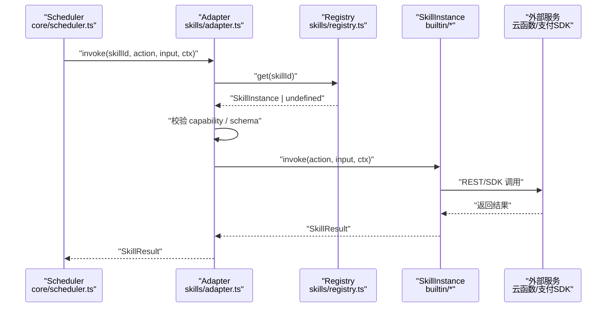

图表来源
- [miniprogram/src/core/scheduler.ts:188-198](file://miniprogram/src/core/scheduler.ts#L188-L198)
- [miniprogram/src/skills/adapter.ts:37-85](file://miniprogram/src/skills/adapter.ts#L37-L85)
- [miniprogram/src/skills/registry.ts:35-38](file://miniprogram/src/skills/registry.ts#L35-L38)
- [miniprogram/src/skills/builtin/coffee-starbucks/index.ts:148-177](file://miniprogram/src/skills/builtin/coffee-starbucks/index.ts#L148-L177)
- [miniprogram/src/skills/builtin/train-12306/index.ts:159-190](file://miniprogram/src/skills/builtin/train-12306/index.ts#L159-L190)
- [miniprogram/src/skills/builtin/payment-aicard/index.ts:89-147](file://miniprogram/src/skills/builtin/payment-aicard/index.ts#L89-L147)

## 详细组件分析

### Adapter 统一入口与错误包装
- 职责
  - 根据 skillId 获取 SKILL 实例
  - 校验 action 是否存在于 capabilities
  - 可选跳过 schema 验证（内部调用场景）
  - 埋点：记录调用次数、耗时
  - 统一错误包装为 SkillError
  - 封装 rollback 调用
- 关键方法
  - invoke：入参 (skillId, action, input, ctx, options)，返回 Promise<SkillResult>
  - rollback：入参 (skillId, action, input, result, ctx)，返回 { rolled, reason? }
  - getCapability：查询 capability 元信息
- 错误处理
  - toSkillError：将任意未知错误转换为标准 SkillError，code 默认 UNKNOWN，message 来自 Error.message 或字符串化，retryable 默认 false
  - 未找到 SKILL 或 capability 时直接返回结构化错误

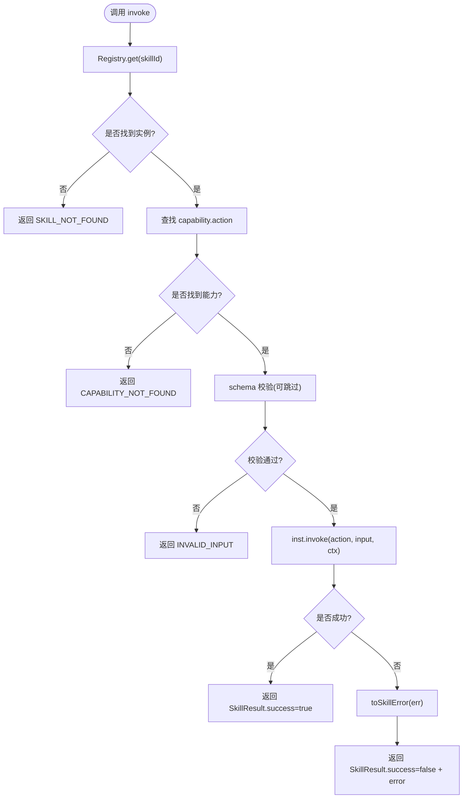

图表来源
- [miniprogram/src/skills/adapter.ts:37-85](file://miniprogram/src/skills/adapter.ts#L37-L85)
- [miniprogram/src/skills/adapter.ts:24-34](file://miniprogram/src/skills/adapter.ts#L24-L34)

章节来源
- [miniprogram/src/skills/adapter.ts:19-115](file://miniprogram/src/skills/adapter.ts#L19-L115)

### Registry 注册中心
- 职责
  - 注册/反注册 SKILL 实例
  - 列出完整元信息（管理/测试）与精简版（给 Planner 降低 token 消耗）
  - 按 skillId 获取实例
  - 按 (skillId, action) 查询 capability
- 设计要点
  - 单例导出，避免多实例导致状态不一致
  - 重复 id 注册抛错，便于早期发现冲突
  - toSlim 裁剪 LLM 不需要的字段

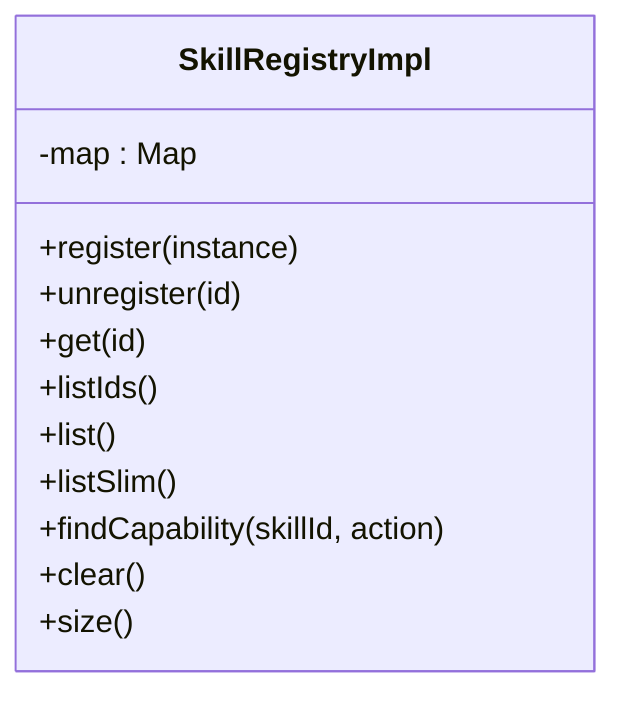

图表来源
- [miniprogram/src/skills/registry.ts:16-71](file://miniprogram/src/skills/registry.ts#L16-L71)

章节来源
- [miniprogram/src/skills/registry.ts:1-91](file://miniprogram/src/skills/registry.ts#L1-L91)

### 类型协议：SkillInstance、SkillResult、SkillError
- SkillMeta/SkillCapability
  - description 必须清晰描述“能做/不能做/何时触发”，作为 LLM 规划依据
  - requiresHumanConfirm 写操作必须为 true
  - estimatedLatencyMs 用于调度估算
- SkillInstance
  - meta：能力声明
  - invoke：执行 capability
  - rollback：可选，reversible=true 时必须实现
- SkillResult
  - success/data/error/bindings
  - bindings 供下游 SKILL 引用（inputBindings）
- SkillError
  - code/message/retryable

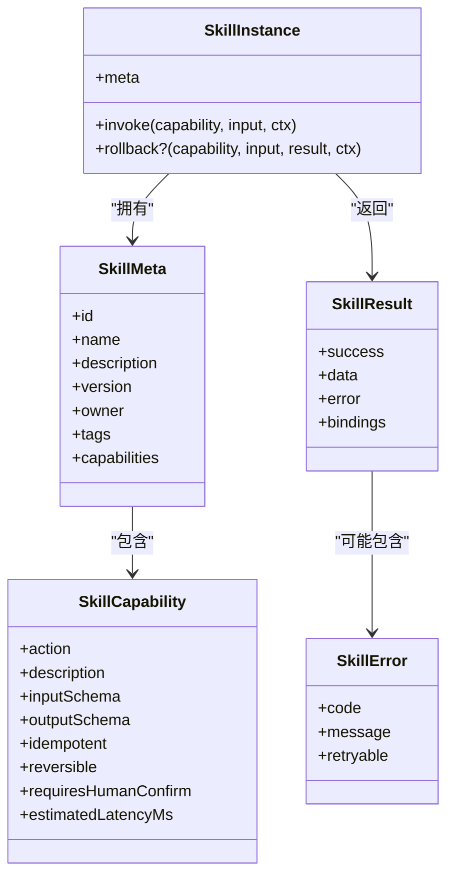

图表来源
- [miniprogram/src/types/skill.d.ts:16-119](file://miniprogram/src/types/skill.d.ts#L16-L119)

章节来源
- [miniprogram/src/types/skill.d.ts:1-119](file://miniprogram/src/types/skill.d.ts#L1-L119)

### 内置适配器示例

#### 星巴克咖啡 SKILL
- 能力
  - search_store：查询附近门店（幂等，无需确认）
  - place_order：下单（非幂等，需人类确认，可回滚）
- 外部调用
  - 通过 services/cloud.postContainer 调用云函数
- 回滚
  - 调用取消订单的云函数

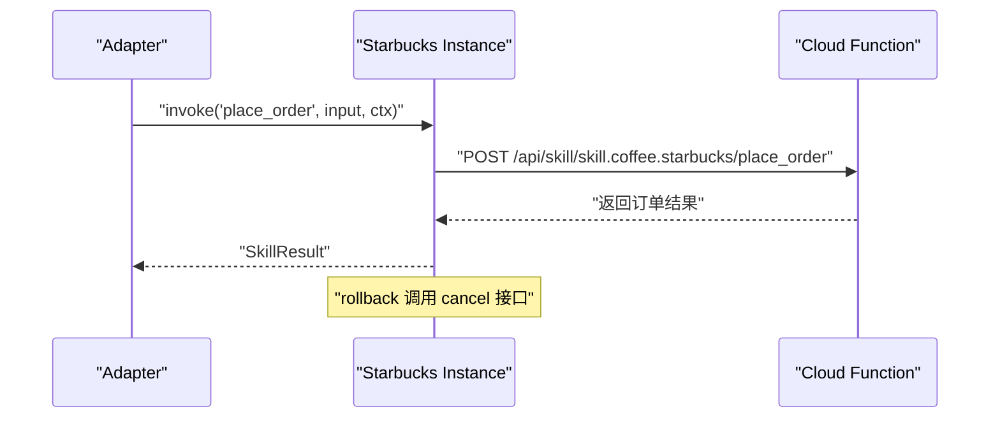

图表来源
- [miniprogram/src/skills/builtin/coffee-starbucks/index.ts:148-177](file://miniprogram/src/skills/builtin/coffee-starbucks/index.ts#L148-L177)
- [miniprogram/src/skills/builtin/coffee-starbucks/index.ts:198-227](file://miniprogram/src/skills/builtin/coffee-starbucks/index.ts#L198-L227)

章节来源
- [miniprogram/src/skills/builtin/coffee-starbucks/index.ts:1-237](file://miniprogram/src/skills/builtin/coffee-starbucks/index.ts#L1-L237)

#### 火车票 SKILL（12306）
- 能力
  - search_train：查询车次（幂等，无需确认）
  - book_ticket：下单购票（非幂等，需人类确认，可回滚）
- 外部调用
  - 通过 cloud.postContainer 调用云函数
- 绑定输出
  - buildSearchBindings 构造 bindings，供下游引用（如 from/to/trainNo）

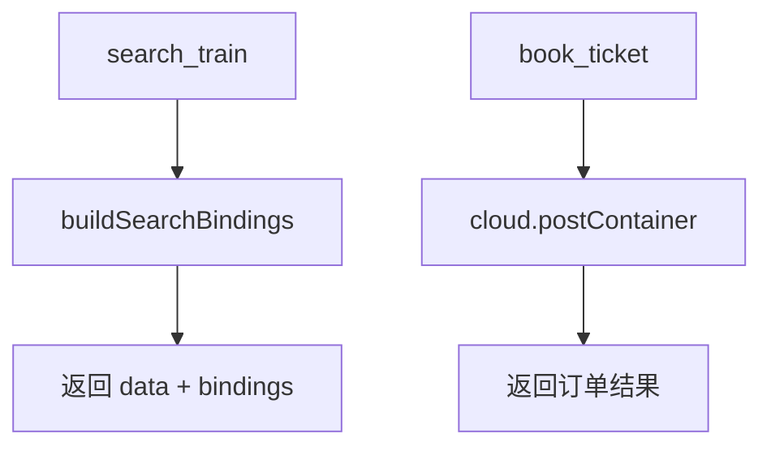

图表来源
- [miniprogram/src/skills/builtin/train-12306/index.ts:192-238](file://miniprogram/src/skills/builtin/train-12306/index.ts#L192-L238)
- [miniprogram/src/skills/builtin/train-12306/index.ts:240-276](file://miniprogram/src/skills/builtin/train-12306/index.ts#L240-L276)

章节来源
- [miniprogram/src/skills/builtin/train-12306/index.ts:1-293](file://miniprogram/src/skills/builtin/train-12306/index.ts#L1-L293)

#### AI 卡支付 SKILL
- 能力
  - pay_orders：合并支付多个子订单（非幂等，需人类确认，不可逆）
- 外部调用
  - 通过 payment.payWithAICard 调用微信支付 SDK
- 特殊错误
  - HIGH_VALUE_REJECTED：大额未二次确认拦截（红线路径）

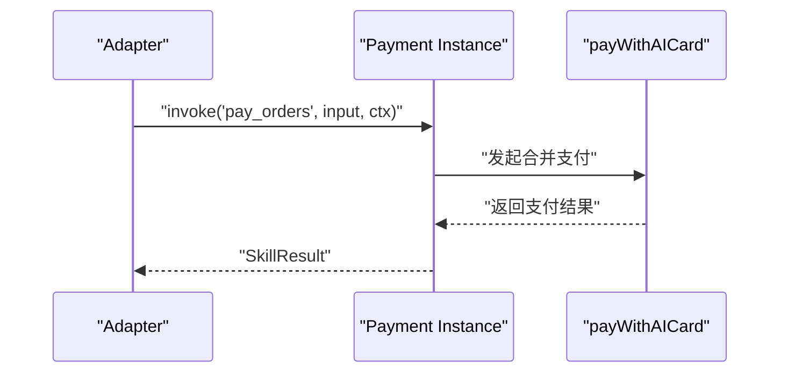

图表来源
- [miniprogram/src/skills/builtin/payment-aicard/index.ts:89-147](file://miniprogram/src/skills/builtin/payment-aicard/index.ts#L89-L147)

章节来源
- [miniprogram/src/skills/builtin/payment-aicard/index.ts:1-147](file://miniprogram/src/skills/builtin/payment-aicard/index.ts#L1-L147)

### 适配器与调度器的协作
- 调度器在 executeOne 中：
  - 解析 inputBindings
  - 若 requiresHumanConfirm，进入 waiting_human 并通过 serializeCheckpoint 串行化用户确认
  - 调用 adapter.invoke 执行 SKILL
  - 根据 result.success 设置任务状态，失败则级联跳过下游

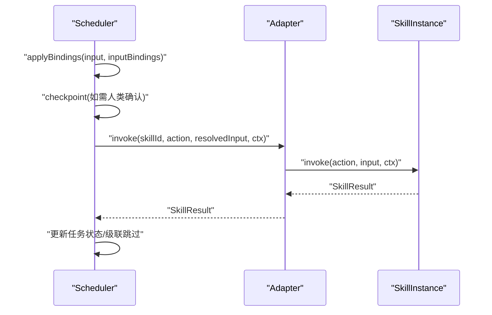

图表来源
- [miniprogram/src/core/scheduler.ts:139-204](file://miniprogram/src/core/scheduler.ts#L139-L204)
- [miniprogram/src/skills/adapter.ts:37-85](file://miniprogram/src/skills/adapter.ts#L37-L85)

章节来源
- [miniprogram/src/core/scheduler.ts:77-204](file://miniprogram/src/core/scheduler.ts#L77-L204)

## 依赖关系分析
- 耦合与内聚
  - adapter.ts 依赖 registry.ts、types/skill.d.ts、utils/validator、utils/logger
  - scheduler.ts 依赖 adapter.ts、types/*、utils/binding、utils/logger
  - builtin/* 适配器依赖 services/cloud 或 services/payment，体现对具体外部服务的解耦
- 外部依赖
  - services/cloud：统一云函数调用封装
  - services/payment：微信支付 SDK 封装
- 循环依赖
  - 未见明显循环依赖；adapter 仅消费 registry，scheduler 仅消费 adapter

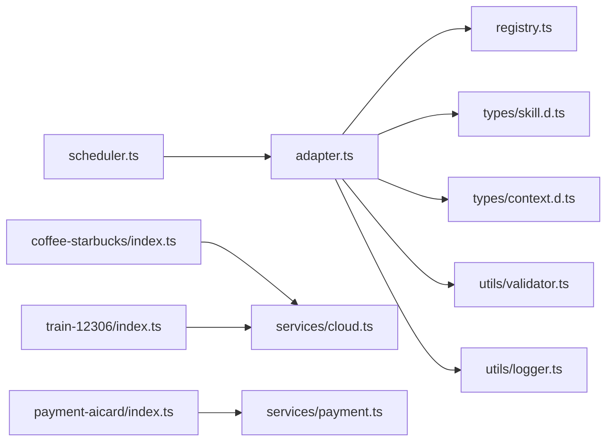

图表来源
- [miniprogram/src/core/scheduler.ts:18-24](file://miniprogram/src/core/scheduler.ts#L18-L24)
- [miniprogram/src/skills/adapter.ts:13-17](file://miniprogram/src/skills/adapter.ts#L13-L17)
- [miniprogram/src/skills/builtin/coffee-starbucks/index.ts:11-14](file://miniprogram/src/skills/builtin/coffee-starbucks/index.ts#L11-L14)
- [miniprogram/src/skills/builtin/train-12306/index.ts:13-16](file://miniprogram/src/skills/builtin/train-12306/index.ts#L13-L16)
- [miniprogram/src/skills/builtin/payment-aicard/index.ts:13-16](file://miniprogram/src/skills/builtin/payment-aicard/index.ts#L13-L16)

章节来源
- [miniprogram/src/core/scheduler.ts:1-245](file://miniprogram/src/core/scheduler.ts#L1-L245)
- [miniprogram/src/skills/adapter.ts:1-115](file://miniprogram/src/skills/adapter.ts#L1-L115)
- [miniprogram/src/skills/builtin/coffee-starbucks/index.ts:1-237](file://miniprogram/src/skills/builtin/coffee-starbucks/index.ts#L1-L237)
- [miniprogram/src/skills/builtin/train-12306/index.ts:1-293](file://miniprogram/src/skills/builtin/train-12306/index.ts#L1-L293)
- [miniprogram/src/skills/builtin/payment-aicard/index.ts:1-147](file://miniprogram/src/skills/builtin/payment-aicard/index.ts#L1-L147)

## 性能与扩展性
- 性能特性
  - 调度器并行执行 ready 任务（Promise.allSettled），提升吞吐
  - checkpoint 序列化互斥，避免弹窗覆盖导致的确认丢失
  - Registry.listSlim 裁剪元信息，减少 LLM token 消耗
- 扩展性
  - 新增外部服务只需实现 SkillInstance 并注册到 Registry
  - 通过 JSON Schema 声明输入输出，便于自动校验与 LLM 理解
  - bindings 机制支持跨 SKILL 的数据传递，降低耦合

[本节为通用指导，不涉及具体文件分析]

## 故障排查指南
- 常见问题
  - SKILL_NOT_FOUND：检查是否正确注册且 id 唯一
  - CAPABILITY_NOT_FOUND：检查 action 是否在 capabilities 中声明
  - INVALID_INPUT：检查 inputSchema 与实际传入参数是否匹配
  - 用户取消：checkpoint 返回 false，任务标记 failed 并级联跳过下游
  - 运行令牌失效：isRunActive 返回 false，任务标记 skipped
- 错误码建议
  - 网络类错误设置 retryable=true
  - 业务类错误设置 retryable=false
  - 大额支付拦截使用独立错误码（如 HIGH_VALUE_REJECTED）

章节来源
- [miniprogram/src/skills/adapter.ts:44-68](file://miniprogram/src/skills/adapter.ts#L44-L68)
- [miniprogram/src/core/scheduler.ts:163-186](file://miniprogram/src/core/scheduler.ts#L163-L186)
- [miniprogram/src/skills/builtin/payment-aicard/index.ts:119-130](file://miniprogram/src/skills/builtin/payment-aicard/index.ts#L119-L130)

## 结论
通过 Adapter 统一入口与 Registry 注册中心，WAIC-WeChat-MiniProgram 的 SKILL 系统实现了对外部服务的统一抽象与稳定契约。调度器以 DAG 方式编排任务，结合 checkpoint 与 bindings 机制，既保证了复杂业务流程的可控性，又提升了可扩展性与可维护性。适配器模式在此系统中有效隔离了不同外部 API 的差异，使得新增服务集成变得简单而安全。

[本节为总结性内容，不涉及具体文件分析]

## 附录：如何新增一个外部服务适配器
步骤概览
- 定义能力元信息
  - 在 new SkillInstance.meta.capabilities 中声明 action、description、inputSchema、outputSchema、idempotent、reversible、requiresHumanConfirm、estimatedLatencyMs
- 实现 invoke
  - 根据 action 分支调用外部服务（REST/SDK）
  - 返回 SkillResult，必要时设置 bindings 供下游引用
- 实现 rollback（可选）
  - 当 reversible=true 时，必须实现 rollback 以支持事务回滚
- 注册实例
  - 通过 SkillRegistry.register(instance) 完成注册
- 接入调度
  - 在 Plan 中声明 task.skillId 与 task.action，Scheduler 会自动通过 adapter.invoke 执行

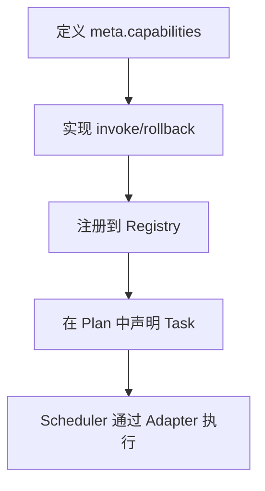

图表来源
- [miniprogram/src/types/skill.d.ts:16-119](file://miniprogram/src/types/skill.d.ts#L16-L119)
- [miniprogram/src/skills/registry.ts:19-28](file://miniprogram/src/skills/registry.ts#L19-L28)
- [miniprogram/src/core/scheduler.ts:188-198](file://miniprogram/src/core/scheduler.ts#L188-L198)

章节来源
- [miniprogram/src/types/skill.d.ts:1-119](file://miniprogram/src/types/skill.d.ts#L1-L119)
- [miniprogram/src/skills/registry.ts:1-91](file://miniprogram/src/skills/registry.ts#L1-L91)
- [miniprogram/src/core/scheduler.ts:77-204](file://miniprogram/src/core/scheduler.ts#L77-L204)