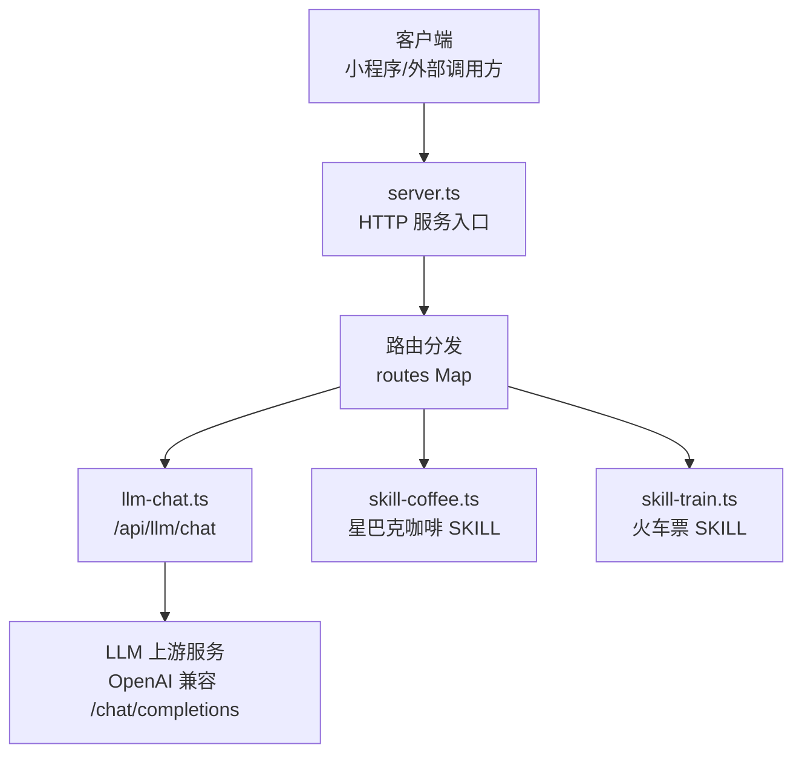
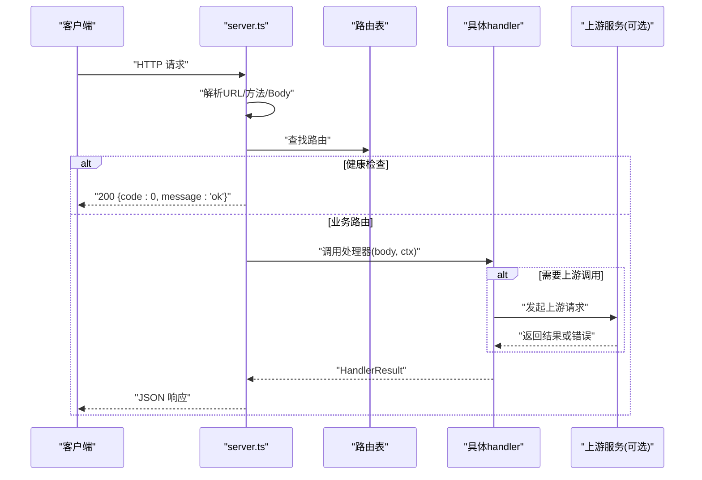
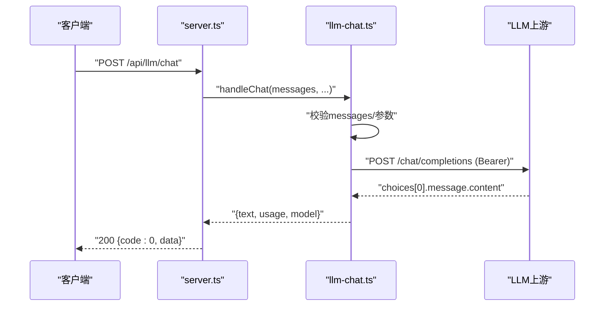
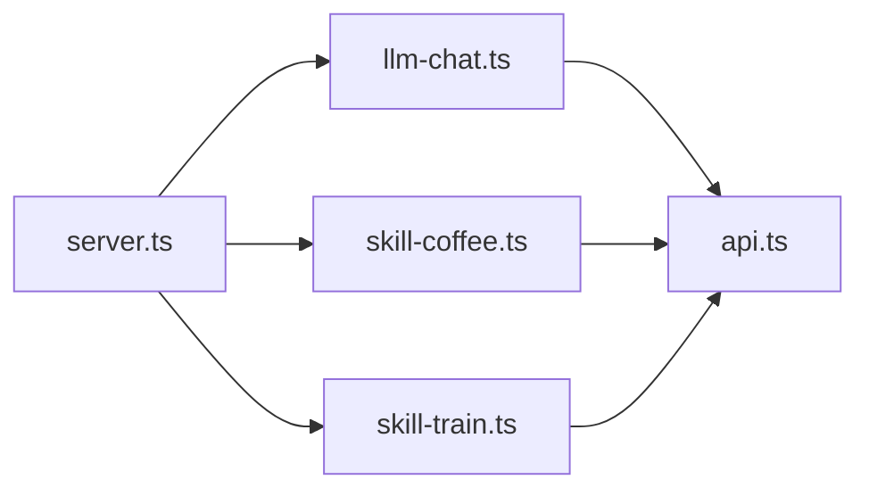

# API接口文档

<cite>
**本文引用的文件**   
- [cloudrun/src/server.ts](file://cloudrun/src/server.ts)
- [cloudrun/src/api.ts](file://cloudrun/src/api.ts)
- [cloudrun/src/llm-chat.ts](file://cloudrun/src/llm-chat.ts)
- [cloudrun/src/skill-coffee.ts](file://cloudrun/src/skill-coffee.ts)
- [cloudrun/src/skill-train.ts](file://cloudrun/src/skill-train.ts)
</cite>

## 目录
1. [简介](#简介)
2. [项目结构](#项目结构)
3. [核心组件](#核心组件)
4. [架构总览](#架构总览)
5. [详细接口说明](#详细接口说明)
6. [依赖关系分析](#依赖关系分析)
7. [性能与可靠性](#性能与可靠性)
8. [故障排查指南](#故障排查指南)
9. [结论](#结论)
10. [附录：认证、错误码与测试建议](#附录认证错误码与测试建议)

## 简介
本文件为 WAIC-WeChat-MiniProgram 云端服务（CloudRun）的 RESTful API 接口文档，覆盖以下能力：
- LLM 聊天代理：POST /api/llm/chat，支持消息校验、上游转发、统一响应封装。
- 星巴克咖啡 SKILL：搜索门店、下单购买、取消订单。
- 火车票预订 SKILL：查询车次、购票、取消订单。
- 通用协议：统一的 CloudResponse 格式、认证头字段、错误语义与状态码约定。

服务端采用 Node.js 原生 HTTP 服务，零运行时依赖；LLM 调用使用 Node 18+ 内置 fetch，并设置超时保护。所有业务端点通过路由表集中注册，健康检查端点用于云托管探活。

## 项目结构
云端服务位于 cloudrun 目录，核心入口与模块如下：
- server.ts：HTTP 服务入口、请求体解析、路由分发、健康检查、异常处理。
- api.ts：统一响应类型、工具函数与处理器签名定义。
- llm-chat.ts：LLM 聊天代理端点实现。
- skill-coffee.ts：星巴克咖啡 SKILL 端点实现。
- skill-train.ts：火车票 SKILL 端点实现。

图表来源
- [cloudrun/src/server.ts:22-27](file://cloudrun/src/server.ts#L22-L27)
- [cloudrun/src/server.ts:76-123](file://cloudrun/src/server.ts#L76-L123)
- [cloudrun/src/llm-chat.ts:120-122](file://cloudrun/src/llm-chat.ts#L120-L122)
- [cloudrun/src/skill-coffee.ts:119-123](file://cloudrun/src/skill-coffee.ts#L119-L123)
- [cloudrun/src/skill-train.ts:143-147](file://cloudrun/src/skill-train.ts#L143-L147)

章节来源
- [cloudrun/src/server.ts:1-129](file://cloudrun/src/server.ts#L1-L129)
- [cloudrun/src/api.ts:1-64](file://cloudrun/src/api.ts#L1-L64)

## 核心组件
- 统一响应协议 CloudResponse：包含 code、message、data。code=0 表示业务成功，非 0 表示业务失败；HTTP 5xx 表示网络层错误。
- 请求上下文 RequestContext：从请求头提取 openid 与 sessionId，供各 handler 使用。
- 路由处理器 RouteHandler：接收已解析 JSON body 与 ctx，返回 HandlerResult（httpStatus + body）。
- 工具函数：ok/fail/badRequest/unauthorized/forbidden 等，用于构造标准响应。

章节来源
- [cloudrun/src/api.ts:10-64](file://cloudrun/src/api.ts#L10-L64)

## 架构总览
服务端启动后监听端口，处理两类请求：
- 健康检查：GET / 与 GET /healthz，返回固定成功响应。
- 业务路由：根据 METHOD + URL 匹配 handlers，解析请求体，执行逻辑，返回统一响应。

图表来源
- [cloudrun/src/server.ts:80-123](file://cloudrun/src/server.ts#L80-L123)
- [cloudrun/src/llm-chat.ts:55-118](file://cloudrun/src/llm-chat.ts#L55-L118)

## 详细接口说明

### 通用协议与认证
- 统一响应体 CloudResponse：
  - code：业务状态码，0 表示成功。
  - message：人类可读信息。
  - data：业务数据对象。
- 认证头：
  - x-wx-openid：微信云托管注入的调用方 OpenID，写操作必须携带。
  - x-micromate-session：小程序附加的会话 ID，便于追踪。
- 请求体大小上限：1MB，超出返回 413。
- 非法 JSON：返回 400。

章节来源
- [cloudrun/src/api.ts:10-64](file://cloudrun/src/api.ts#L10-L64)
- [cloudrun/src/server.ts:19-68](file://cloudrun/src/server.ts#L19-L68)
- [cloudrun/src/server.ts:100-123](file://cloudrun/src/server.ts#L100-L123)

### LLM 聊天接口
- 端点：POST /api/llm/chat
- 功能：将小程序侧消息转发至 LLM 上游（OpenAI 兼容协议），返回文本与用量统计。
- 环境变量：
  - LLM_BASE_URL：必填，上游 Base URL。
  - LLM_API_KEY：必填，上游鉴权密钥。
  - LLM_MODEL：可选，默认模型名。
- 请求体字段：
  - model：可选，覆盖默认模型。
  - messages：必填数组，元素含 role/content 字符串。
  - temperature：可选，数值。
  - maxTokens：可选，数值，映射到上游 max_tokens。
  - jsonMode：可选，布尔，开启时添加 response_format.json_object。
- 响应体：
  - text：上游返回的文本内容。
  - usage：promptTokens/completionTokens/totalTokens。
  - model：实际使用的模型名。
- 错误语义：
  - 未配置或上游失败：HTTP 503，code=503，可重试。
  - 入参不合法：HTTP 400，code=400。
- 流式响应：当前实现为一次性返回完整文本，不支持 SSE 流式输出。

图表来源
- [cloudrun/src/llm-chat.ts:55-118](file://cloudrun/src/llm-chat.ts#L55-L118)
- [cloudrun/src/server.ts:80-123](file://cloudrun/src/server.ts#L80-L123)

章节来源
- [cloudrun/src/llm-chat.ts:1-123](file://cloudrun/src/llm-chat.ts#L1-L123)

### 星巴克咖啡 SKILL
- 端点列表：
  - POST /api/skill/skill.coffee.starbucks/search_store
  - POST /api/skill/skill.coffee.starbucks/place_order
  - POST /api/skill/skill.coffee.starbucks/place_order/cancel

#### 搜索门店
- 请求体：
  - city：必填，城市名。
  - limit：可选，返回数量限制（1~20，默认3）。
- 响应体：
  - stores：门店数组，包含 storeId/name/address/distanceM/openNow。
- 错误：
  - 缺少 city：HTTP 400。

章节来源
- [cloudrun/src/skill-coffee.ts:28-46](file://cloudrun/src/skill-coffee.ts#L28-L46)

#### 下单购买
- 请求体：
  - storeId：必填，门店ID。
  - pickupType：必填，in_store 或 takeaway。
  - items：必填数组，元素含 sku/name/quantity/size；sku 必填，quantity≥1。
- 鉴权：
  - 必须携带 x-wx-openid，否则返回 401。
- 响应体：
  - orderId：订单号。
  - storeId：门店ID。
  - items：商品明细，含 amountCent（分）。
  - amountCent：总金额（分）。
  - status：pending_payment。
- 错误：
  - 参数缺失或非法：HTTP 400。
  - 缺少 openid：HTTP 401。

章节来源
- [cloudrun/src/skill-coffee.ts:48-93](file://cloudrun/src/skill-coffee.ts#L48-L93)

#### 取消订单
- 请求体：
  - orderId：必填。
- 鉴权：
  - 必须携带 x-wx-openid，否则返回 401。
- 业务规则：
  - 仅订单拥有者可取消，否则返回 403。
  - 订单不存在或已取消返回业务失败（HTTP 200 + code≠0）。
- 响应体：
  - ok：true。
  - orderId：被取消的订单号。

章节来源
- [cloudrun/src/skill-coffee.ts:95-117](file://cloudrun/src/skill-coffee.ts#L95-L117)

### 火车票预订 SKILL
- 端点列表：
  - POST /api/skill/skill.train.12306/search_train
  - POST /api/skill/skill.train.12306/book_ticket
  - POST /api/skill/skill.train.12306/book_ticket/cancel

#### 查询车次
- 请求体：
  - from：必填，出发地。
  - to：必填，目的地。
  - date：必填，YYYY-MM-DD。
  - seatType：可选，座位类型（business/first_class/second_class/hard_seat）。
- 响应体：
  - from/to/date：查询条件回显。
  - trains：车次数组，含 trainNo/from/to/departTime/arriveTime/durationMin/seatType/priceCent/ticketsLeft。
- 错误：
  - 缺少必填或日期格式错误：HTTP 400。

章节来源
- [cloudrun/src/skill-train.ts:39-77](file://cloudrun/src/skill-train.ts#L39-L77)

#### 购票
- 请求体：
  - trainNo：必填。
  - date：必填。
  - seatType：必填。
  - passengerName：必填。
  - passengerIdNo：必填。
  - from/to：可选，用于一致性校验。
- 鉴权：
  - 必须携带 x-wx-openid，否则返回 401。
- 响应体：
  - orderId：订单号。
  - trainNo：车次号。
  - amountCent：金额（分）。
  - status：pending_payment。
  - payDeadline：支付截止时间戳（毫秒）。
- 错误：
  - 参数缺失：HTTP 400。
  - 缺少 openid：HTTP 401。

章节来源
- [cloudrun/src/skill-train.ts:79-116](file://cloudrun/src/skill-train.ts#L79-L116)

#### 取消订单
- 请求体：
  - orderId：必填。
- 鉴权：
  - 必须携带 x-wx-openid，否则返回 401。
- 业务规则：
  - 仅订单拥有者可取消，否则返回 403。
  - 订单不存在或已取消返回业务失败（HTTP 200 + code≠0）。
- 响应体：
  - ok：true。
  - orderId：被取消的订单号。

章节来源
- [cloudrun/src/skill-train.ts:118-141](file://cloudrun/src/skill-train.ts#L118-L141)

## 依赖关系分析
- server.ts 聚合各模块的路由 entries，形成统一路由表。
- llm-chat.ts、skill-coffee.ts、skill-train.ts 分别导出 routes 数组，供 server.ts 合并。
- api.ts 提供统一类型与工具函数，被所有 handler 复用。

图表来源
- [cloudrun/src/server.ts:14-17](file://cloudrun/src/server.ts#L14-L17)
- [cloudrun/src/server.ts:22-27](file://cloudrun/src/server.ts#L22-L27)
- [cloudrun/src/llm-chat.ts:19-20](file://cloudrun/src/llm-chat.ts#L19-L20)
- [cloudrun/src/skill-coffee.ts:13-14](file://cloudrun/src/skill-coffee.ts#L13-L14)
- [cloudrun/src/skill-train.ts:16-17](file://cloudrun/src/skill-train.ts#L16-L17)

章节来源
- [cloudrun/src/server.ts:1-129](file://cloudrun/src/server.ts#L1-L129)
- [cloudrun/src/api.ts:1-64](file://cloudrun/src/api.ts#L1-L64)

## 性能与可靠性
- 请求体大小限制：1MB，超限返回 413，避免内存压力。
- LLM 上游超时：30秒，防止无界等待。
- 健康检查：快速返回，便于云托管探测存活。
- 内存存储：SKILL 订单使用内存 Map，重启丢失且实例间不共享；生产环境应落库以保证持久化与多实例共享。
- 上游失败语义：LLM 上游失败返回 503，客户端可重试；开发环境可降级为本地规则规划器。

章节来源
- [cloudrun/src/server.ts:19-68](file://cloudrun/src/server.ts#L19-L68)
- [cloudrun/src/server.ts:80-123](file://cloudrun/src/server.ts#L80-L123)
- [cloudrun/src/llm-chat.ts:47-53](file://cloudrun/src/llm-chat.ts#L47-L53)
- [cloudrun/src/llm-chat.ts:81-96](file://cloudrun/src/llm-chat.ts#L81-L96)
- [cloudrun/src/skill-coffee.ts:25-26](file://cloudrun/src/skill-coffee.ts#L25-L26)
- [cloudrun/src/skill-train.ts:27-28](file://cloudrun/src/skill-train.ts#L27-L28)

## 故障排查指南
- 413 请求体过大：检查请求体是否超过 1MB，压缩或拆分请求。
- 400 非法 JSON：确保 Content-Type 为 application/json，且 body 为合法 JSON。
- 401 未鉴权：写操作需携带 x-wx-openid。
- 403 越权：取消他人订单会触发归属鉴权失败，确认 openid 与订单 owner 一致。
- 500 内部错误：服务端异常，查看日志定位。
- 503 上游不可用：LLM 上游配置错误或连接失败，检查环境变量 LLM_BASE_URL 与 LLM_API_KEY。

章节来源
- [cloudrun/src/server.ts:110-123](file://cloudrun/src/server.ts#L110-L123)
- [cloudrun/src/llm-chat.ts:55-61](file://cloudrun/src/llm-chat.ts#L55-L61)
- [cloudrun/src/skill-coffee.ts:67-70](file://cloudrun/src/skill-coffee.ts#L67-L70)
- [cloudrun/src/skill-train.ts:94-97](file://cloudrun/src/skill-train.ts#L94-L97)

## 结论
本云端服务以极简架构提供 LLM 聊天代理与两个业务 SKILL（星巴克咖啡、火车票预订）。通过统一响应协议与清晰的认证机制，保证接口的一致性与安全性。MVP 阶段使用内存存储，后续应迁移至数据库以实现持久化与多实例共享。LLM 上游失败采用 503 可重试语义，提升整体鲁棒性。

## 附录：认证、错误码与测试建议

### 认证机制
- 必需头：
  - x-wx-openid：调用方身份标识，写操作必须携带。
  - x-micromate-session：会话标识，便于追踪。
- 鉴权策略：
  - 写操作（下单、购票、取消）强制校验 openid。
  - 取消操作进行归属校验，防止 IDOR。

章节来源
- [cloudrun/src/server.ts:100-103](file://cloudrun/src/server.ts#L100-L103)
- [cloudrun/src/skill-coffee.ts:67-70](file://cloudrun/src/skill-coffee.ts#L67-L70)
- [cloudrun/src/skill-train.ts:94-97](file://cloudrun/src/skill-train.ts#L94-L97)

### 错误码与状态码
- HTTP 200 + code=0：业务成功。
- HTTP 200 + code≠0：业务失败（如订单不存在）。
- HTTP 400：参数或请求格式错误。
- HTTP 401：未鉴权（缺少 openid）。
- HTTP 403：越权（非订单拥有者）。
- HTTP 413：请求体过大。
- HTTP 500：内部错误。
- HTTP 503：上游不可用（LLM 配置缺失或连接失败）。

章节来源
- [cloudrun/src/api.ts:40-64](file://cloudrun/src/api.ts#L40-L64)
- [cloudrun/src/server.ts:110-123](file://cloudrun/src/server.ts#L110-L123)
- [cloudrun/src/llm-chat.ts:47-50](file://cloudrun/src/llm-chat.ts#L47-L50)

### 测试方法与调试技巧
- 健康检查：
  - GET / 或 GET /healthz，预期返回 200 与 {code:0, message:'ok'}。
- LLM 聊天：
  - POST /api/llm/chat，body 包含 messages 数组；若未配置 LLM_BASE_URL/LLM_API_KEY，预期 503。
- 星巴克咖啡：
  - search_store：传入 city，验证返回 stores。
  - place_order：传入 storeId/pickupType/items，携带 x-wx-openid，验证返回 orderId 与 amountCent。
  - place_order/cancel：传入 orderId 与 x-wx-openid，验证归属鉴权与取消结果。
- 火车票：
  - search_train：传入 from/to/date，验证 trains 列表。
  - book_ticket：传入必要字段与 x-wx-openid，验证返回 orderId 与 payDeadline。
  - book_ticket/cancel：传入 orderId 与 x-wx-openid，验证归属鉴权与取消结果。
- 调试要点：
  - 检查 Content-Type 与 JSON 合法性。
  - 确认 x-wx-openid 在写操作中正确传递。
  - 观察日志输出，定位异常与上游错误。

章节来源
- [cloudrun/src/server.ts:84-92](file://cloudrun/src/server.ts#L84-L92)
- [cloudrun/src/llm-chat.ts:55-66](file://cloudrun/src/llm-chat.ts#L55-L66)
- [cloudrun/src/skill-coffee.ts:33-46](file://cloudrun/src/skill-coffee.ts#L33-L46)
- [cloudrun/src/skill-train.ts:46-53](file://cloudrun/src/skill-train.ts#L46-L53)