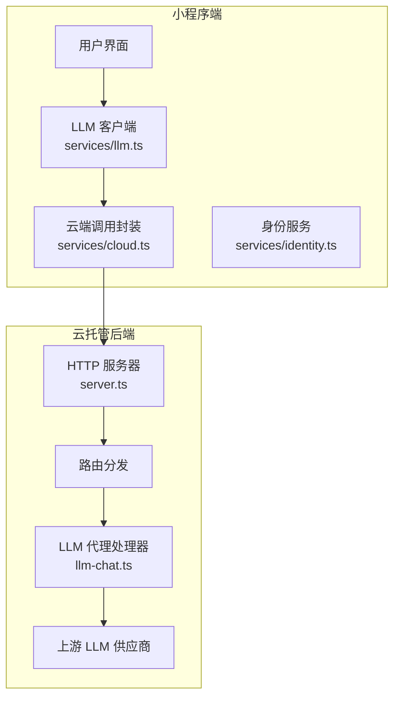
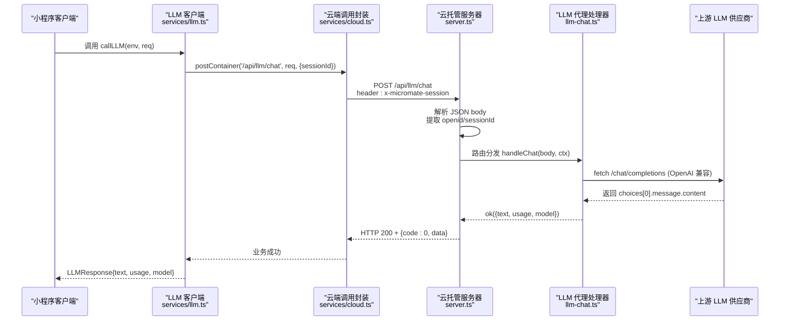
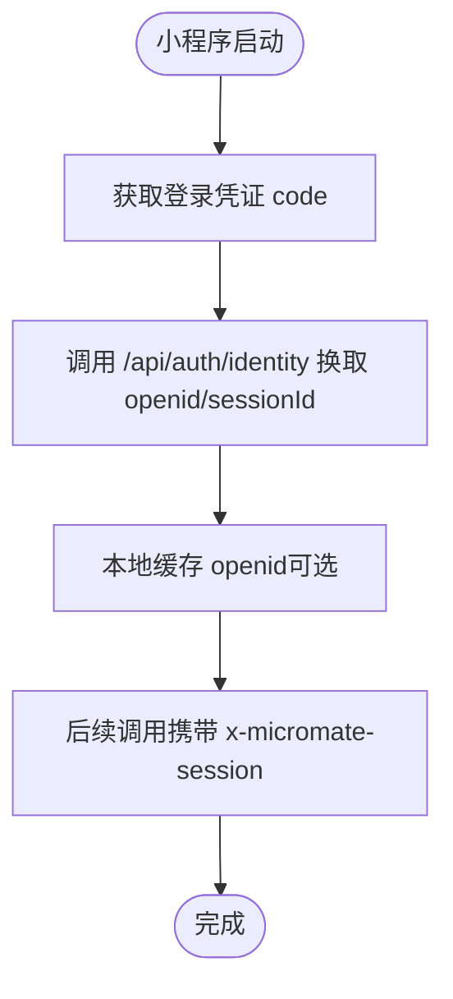
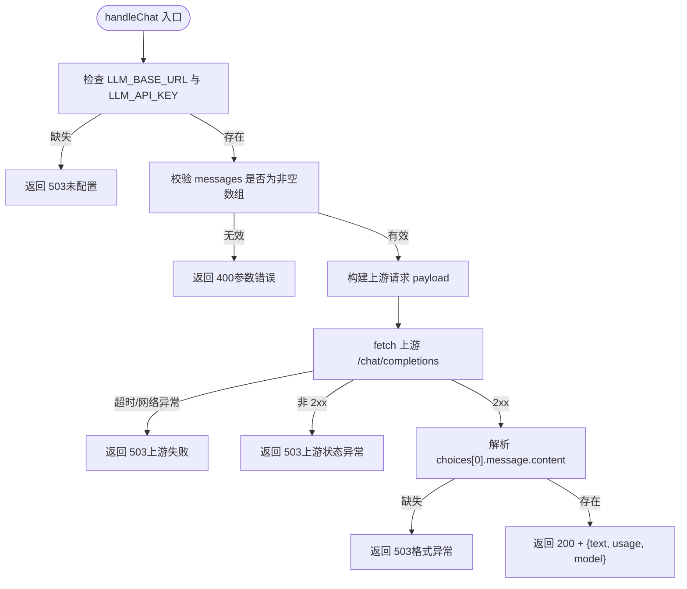
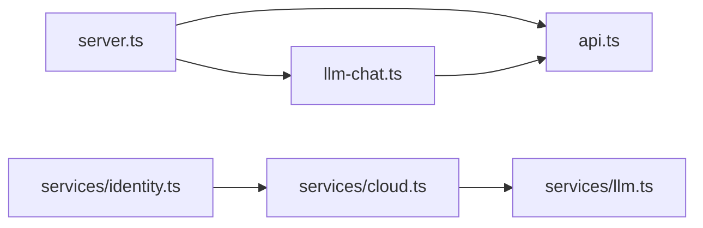

# LLM聊天接口

<cite>
**本文引用的文件**   
- [cloudrun/src/server.ts](file://cloudrun/src/server.ts)
- [cloudrun/src/llm-chat.ts](file://cloudrun/src/llm-chat.ts)
- [cloudrun/src/api.ts](file://cloudrun/src/api.ts)
- [miniprogram/src/services/cloud.ts](file://miniprogram/src/services/cloud.ts)
- [miniprogram/src/services/llm.ts](file://miniprogram/src/services/llm.ts)
- [miniprogram/src/services/identity.ts](file://miniprogram/src/services/identity.ts)
</cite>

## 目录
1. [简介](#简介)
2. [项目结构](#项目结构)
3. [核心组件](#核心组件)
4. [架构总览](#架构总览)
5. [详细接口规范](#详细接口规范)
6. [消息处理业务流程](#消息处理业务流程)
7. [依赖关系分析](#依赖关系分析)
8. [性能与可靠性](#性能与可靠性)
9. [调试与排错指南](#调试与排错指南)
10. [结论](#结论)

## 简介
本文档为 LLM 聊天接口的完整 API 说明，重点覆盖 POST /api/llm/chat 的请求参数、响应格式、错误语义、认证机制、会话上下文传递以及流式响应的支持情况。该接口位于云托管服务中，负责将小程序端传入的对话消息转发至上游 LLM 供应商（如 DeepSeek、Kimi、混元、GPT 系列），并返回统一的结构化结果。

## 项目结构
本仓库包含微信小程序前端与云托管后端两部分：
- 云托管后端（cloudrun）：提供 HTTP 路由、请求解析、LLM 代理、健康检查等能力。
- 小程序前端（miniprogram）：封装云端调用、重试、超时、身份获取与会话管理。

**图表来源**
- [cloudrun/src/server.ts:13-27](file://cloudrun/src/server.ts#L13-L27)
- [cloudrun/src/llm-chat.ts:19-20](file://cloudrun/src/llm-chat.ts#L19-L20)
- [miniprogram/src/services/cloud.ts:64-149](file://miniprogram/src/services/cloud.ts#L64-L149)
- [miniprogram/src/services/llm.ts:56-83](file://miniprogram/src/services/llm.ts#L56-L83)

**章节来源**
- [cloudrun/src/server.ts:1-27](file://cloudrun/src/server.ts#L1-L27)
- [cloudrun/src/llm-chat.ts:1-20](file://cloudrun/src/llm-chat.ts#L1-L20)
- [miniprogram/src/services/cloud.ts:1-33](file://miniprogram/src/services/cloud.ts#L1-L33)
- [miniprogram/src/services/llm.ts:1-33](file://miniprogram/src/services/llm.ts#L1-L33)

## 核心组件
- 云托管 HTTP 服务器：负责监听端口、解析 JSON body、路由分发、健康检查与统一异常处理。
- LLM 代理处理器：校验入参、构造 OpenAI 兼容请求、调用上游 LLM、翻译响应。
- 小程序云端调用封装：统一 header 注入（含 sessionId）、超时控制、重试策略与开发环境降级。
- LLM 客户端：封装业务级重试、错误分类（可重试/不可重试）与调用入口。
- 身份服务：通过云端鉴权接口换取 openid/sessionId，并提供本地缓存辅助。

**章节来源**
- [cloudrun/src/server.ts:76-123](file://cloudrun/src/server.ts#L76-L123)
- [cloudrun/src/llm-chat.ts:55-118](file://cloudrun/src/llm-chat.ts#L55-L118)
- [miniprogram/src/services/cloud.ts:64-149](file://miniprogram/src/services/cloud.ts#L64-L149)
- [miniprogram/src/services/llm.ts:56-83](file://miniprogram/src/services/llm.ts#L56-L83)
- [miniprogram/src/services/identity.ts:15-25](file://miniprogram/src/services/identity.ts#L15-L25)

## 架构总览
下图展示一次完整的 LLM 聊天请求从小程序端到云托管后端的调用链路，包括认证头注入、路由分发、上游 LLM 调用与响应返回。

**图表来源**
- [miniprogram/src/services/llm.ts:56-83](file://miniprogram/src/services/llm.ts#L56-L83)
- [miniprogram/src/services/cloud.ts:64-149](file://miniprogram/src/services/cloud.ts#L64-L149)
- [cloudrun/src/server.ts:76-123](file://cloudrun/src/server.ts#L76-L123)
- [cloudrun/src/llm-chat.ts:55-118](file://cloudrun/src/llm-chat.ts#L55-L118)

## 详细接口规范

### 接口概览
- 方法：POST
- 路径：/api/llm/chat
- 内容类型：application/json
- 认证头：
  - x-wx-openid：由微信云托管运行时注入，表示调用方 OpenID（可选，当前 LLM 代理不强制校验）。
  - x-micromate-session：由小程序端 services/cloud.ts 注入，用于会话关联与埋点。

**章节来源**
- [cloudrun/src/server.ts:100-103](file://cloudrun/src/server.ts#L100-L103)
- [miniprogram/src/services/cloud.ts:70-75](file://miniprogram/src/services/cloud.ts#L70-L75)

### 请求体结构
请求体为 LLMRequestBody，字段如下：
- model：字符串，可选。指定模型名；未传时回退到环境变量 LLM_MODEL，再回退默认值 deepseek-chat。
- messages：数组，必填且不可为空。每个元素为对象，包含：
  - role：字符串，必填。角色标识（如 system/user/assistant）。
  - content：字符串，必填。消息内容。
- temperature：数字，可选。采样温度。
- maxTokens：数字，可选。最大输出 token 数。
- jsonMode：布尔，可选。若为真，后端会设置 response_format.type=json_object。
- sessionId：字符串，可选。仅用于埋点与上下文关联，不会进入上游 LLM 请求体。

注意：
- 服务端对 messages 进行严格校验：必须为数组且长度大于 0；每条消息的 role 与 content 必须为字符串。
- 非数字类型的 temperature/maxTokens 会被忽略。
- 请求体大小上限为 1MB，超限返回 HTTP 413。

**章节来源**
- [cloudrun/src/llm-chat.ts:38-45](file://cloudrun/src/llm-chat.ts#L38-L45)
- [cloudrun/src/llm-chat.ts:63-79](file://cloudrun/src/llm-chat.ts#L63-L79)
- [cloudrun/src/server.ts:34-61](file://cloudrun/src/server.ts#L34-L61)

### 成功响应
HTTP 状态码：200  
业务体结构：{ code: 0, data: LLMResponse }

LLMResponse 字段：
- text：字符串。LLM 生成的回复文本。
- usage：对象。用量统计，包含：
  - promptTokens：数字。提示词 token 数。
  - completionTokens：数字。补全 token 数。
  - totalTokens：数字。总 token 数。
- model：字符串。实际使用的模型名。

示例（成功响应）：
- HTTP 200
- 响应体：
  {
    "code": 0,
    "data": {
      "text": "你好，有什么可以帮你的？",
      "usage": {
        "promptTokens": 10,
        "completionTokens": 15,
        "totalTokens": 25
      },
      "model": "deepseek-chat"
    }
  }

**章节来源**
- [cloudrun/src/llm-chat.ts:109-117](file://cloudrun/src/llm-chat.ts#L109-L117)
- [cloudrun/src/api.ts:40-43](file://cloudrun/src/api.ts#L40-L43)

### 错误响应
常见错误场景与语义：
- 请求体过大（>1MB）：HTTP 413，body.code=413，message="請求體過大（上限 1MB）"。
- 非法 JSON：HTTP 400，body.code=400，message="請求體必須為合法 JSON"。
- 参数校验失败：HTTP 400，body.code=400，message 描述具体字段问题（如 messages 必填或类型不符）。
- 上游配置缺失或连接失败：HTTP 503，body.code=503，message 描述上游失败原因（可重试）。
- 上游返回非 2xx：HTTP 503，body.code=503，message 包含上游状态码与摘要。
- 上游响应格式异常：HTTP 503，body.code=503，message 指出缺少 choices[0].message.content。
- 内部错误：HTTP 500，body.code=500，message="內部錯誤"。

示例（参数错误）：
- HTTP 400
- 响应体：
  {
    "code": 400,
    "message": "messages 必填且不可為空"
  }

示例（上游失败）：
- HTTP 503
- 响应体：
  {
    "code": 503,
    "message": "LLM 上游連線失敗：..."
  }

示例（内部错误）：
- HTTP 500
- 响应体：
  {
    "code": 500,
    "message": "內部錯誤"
  }

**章节来源**
- [cloudrun/src/server.ts:110-122](file://cloudrun/src/server.ts#L110-L122)
- [cloudrun/src/llm-chat.ts:47-50](file://cloudrun/src/llm-chat.ts#L47-L50)
- [cloudrun/src/llm-chat.ts:93-107](file://cloudrun/src/llm-chat.ts#L93-L107)

### 认证机制
- x-wx-openid：由微信云托管运行时注入，表示调用方 OpenID。当前 LLM 代理不强制校验该字段，但其他写操作接口可能使用它做归属校验。
- x-micromate-session：由小程序端 services/cloud.ts 在调用云端时自动注入，用于会话关联与埋点。
- 身份获取流程：小程序端通过 identity.ts 调用 /api/auth/identity 换取 openid/sessionId，并在后续调用中携带 sessionId。

**图表来源**
- [miniprogram/src/services/identity.ts:15-25](file://miniprogram/src/services/identity.ts#L15-L25)
- [miniprogram/src/services/cloud.ts:70-75](file://miniprogram/src/services/cloud.ts#L70-L75)

**章节来源**
- [cloudrun/src/server.ts:100-103](file://cloudrun/src/server.ts#L100-L103)
- [miniprogram/src/services/identity.ts:15-25](file://miniprogram/src/services/identity.ts#L15-L25)
- [miniprogram/src/services/cloud.ts:70-75](file://miniprogram/src/services/cloud.ts#L70-L75)

### 流式响应支持
当前 LLM 代理处理器使用一次性 fetch 调用上游 /chat/completions，并等待完整响应后返回 text。代码中未实现流式传输（如 SSE 或分块响应）。因此：
- 不支持流式响应。
- 如需流式能力，需在后端引入流式读取与转发逻辑，并在小程序端适配流式接收。

**章节来源**
- [cloudrun/src/llm-chat.ts:81-107](file://cloudrun/src/llm-chat.ts#L81-L107)

## 消息处理业务流程
下图展示 LLM 代理处理器的核心处理流程，包括配置校验、参数校验、上游调用、响应翻译与错误处理。

**图表来源**
- [cloudrun/src/llm-chat.ts:55-118](file://cloudrun/src/llm-chat.ts#L55-L118)

**章节来源**
- [cloudrun/src/llm-chat.ts:55-118](file://cloudrun/src/llm-chat.ts#L55-L118)

## 依赖关系分析
- server.ts 依赖 api.ts 的类型定义与响应工具函数，并注册 llmRoutes、trainRoutes、coffeeRoutes。
- llm-chat.ts 依赖 api.ts 的 ok/badRequest 工具函数，并通过环境变量访问上游配置。
- miniprogram/services/cloud.ts 封装 wx.cloud.callContainer，注入 sessionId 头，并提供超时与重试。
- miniprogram/services/llm.ts 封装业务级重试与错误分类，调用 /api/llm/chat。
- miniprogram/services/identity.ts 提供 openid/sessionId 获取与缓存。

**图表来源**
- [cloudrun/src/server.ts:13-27](file://cloudrun/src/server.ts#L13-L27)
- [cloudrun/src/llm-chat.ts:19-20](file://cloudrun/src/llm-chat.ts#L19-L20)
- [miniprogram/src/services/cloud.ts:64-149](file://miniprogram/src/services/cloud.ts#L64-L149)
- [miniprogram/src/services/llm.ts:56-83](file://miniprogram/src/services/llm.ts#L56-L83)
- [miniprogram/src/services/identity.ts:15-25](file://miniprogram/src/services/identity.ts#L15-L25)

**章节来源**
- [cloudrun/src/server.ts:13-27](file://cloudrun/src/server.ts#L13-L27)
- [cloudrun/src/llm-chat.ts:19-20](file://cloudrun/src/llm-chat.ts#L19-L20)
- [miniprogram/src/services/cloud.ts:64-149](file://miniprogram/src/services/cloud.ts#L64-L149)
- [miniprogram/src/services/llm.ts:56-83](file://miniprogram/src/services/llm.ts#L56-L83)
- [miniprogram/src/services/identity.ts:15-25](file://miniprogram/src/services/identity.ts#L15-L25)

## 性能与可靠性
- 上游超时保护：LLM 代理使用 AbortSignal.timeout(30000ms) 防止上游挂起导致无界等待。
- 请求体大小限制：1MB 上限，超限返回 413。
- 重试策略：
  - 小程序端 services/cloud.ts 默认 3 次重试，基础延迟 600ms。
  - LLM 客户端 services/llm.ts 关闭底层重试，统一在外层 retry 控制，避免嵌套放大。
- 开发环境降级：当云端不可用时，services/cloud.ts 返回 code:-1 占位码，允许本地规则规划器兜底。

**章节来源**
- [cloudrun/src/llm-chat.ts:52-53](file://cloudrun/src/llm-chat.ts#L52-L53)
- [cloudrun/src/server.ts:19-20](file://cloudrun/src/server.ts#L19-L20)
- [miniprogram/src/services/cloud.ts:140-149](file://miniprogram/src/services/cloud.ts#L140-L149)
- [miniprogram/src/services/llm.ts:66-82](file://miniprogram/src/services/llm.ts#L66-L82)
- [miniprogram/src/services/cloud.ts:105-119](file://miniprogram/src/services/cloud.ts#L105-L119)

## 调试与排错指南
常见问题与解决建议：
- 请求体过大：确保 messages 数组不过长，单条 content 不宜过长；必要时拆分对话历史。
- 非法 JSON：检查小程序端序列化是否正确，避免传入 undefined/null 等非对象结构。
- messages 校验失败：确认每条消息的 role 与 content 均为字符串，且 messages 非空。
- 上游配置缺失：检查云托管环境变量 LLM_BASE_URL 与 LLM_API_KEY 是否已正确配置。
- 上游连接失败或超时：检查网络连通性与上游服务状态；关注 503 响应中的 message 详情。
- 上游返回非 2xx：查看上游状态码与错误摘要，必要时调整模型参数或重试策略。
- 上游响应格式异常：确认上游返回结构包含 choices[0].message.content；否则视为异常。
- 开发环境云端不可用：services/cloud.ts 会返回 code:-1，确保上层逻辑能处理降级路径。

定位技巧：
- 查看云托管日志：server.ts 会记录 method/url/session/openid 与异常信息。
- 检查小程序端重试日志：services/llm.ts 会在重试时打印日志。
- 验证 header 注入：services/cloud.ts 会自动注入 x-micromate-session，确认 sessionId 是否存在。

**章节来源**
- [cloudrun/src/server.ts:107-122](file://cloudrun/src/server.ts#L107-L122)
- [miniprogram/src/services/llm.ts:77-82](file://miniprogram/src/services/llm.ts#L77-L82)
- [miniprogram/src/services/cloud.ts:105-119](file://miniprogram/src/services/cloud.ts#L105-L119)

## 结论
POST /api/llm/chat 是一个简洁可靠的 LLM 代理接口，专注于参数校验、上游转发与结构化响应。当前版本不支持流式响应，但在超时保护、重试策略与开发环境降级方面具备较好的健壮性。建议在集成时严格遵循请求体规范，合理设置 sessionId 以增强可观测性，并根据业务需求选择合适的模型与参数。