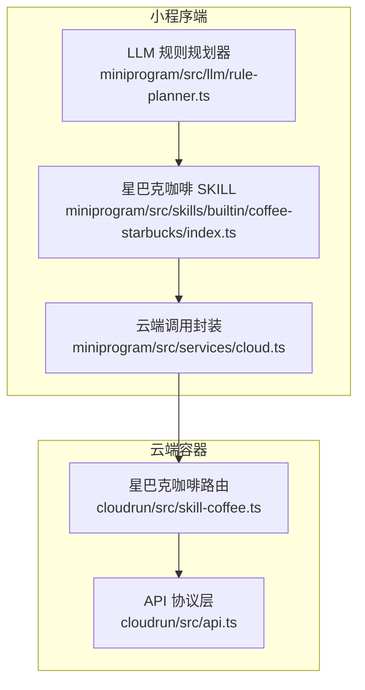
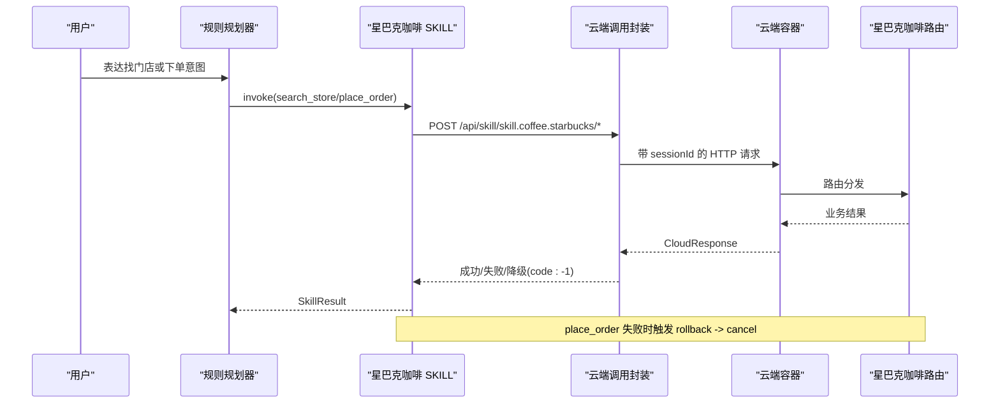
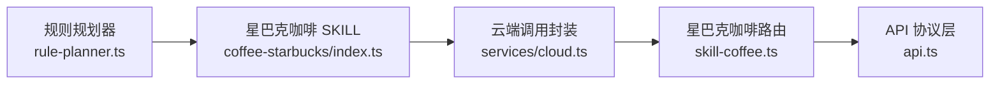

# 星巴克咖啡接口

<cite>
**本文引用的文件**   
- [cloudrun/src/skill-coffee.ts](file://cloudrun/src/skill-coffee.ts)
- [cloudrun/src/api.ts](file://cloudrun/src/api.ts)
- [miniprogram/src/skills/builtin/coffee-starbucks/index.ts](file://miniprogram/src/skills/builtin/coffee-starbucks/index.ts)
- [miniprogram/src/services/cloud.ts](file://miniprogram/src/services/cloud.ts)
- [miniprogram/src/llm/rule-planner.ts](file://miniprogram/src/llm/rule-planner.ts)
- [cloudrun/smoke-test.ps1](file://cloudrun/smoke-test.ps1)
</cite>

## 目录
1. [简介](#简介)
2. [项目结构](#项目结构)
3. [核心组件](#核心组件)
4. [架构总览](#架构总览)
5. [接口详解](#接口详解)
6. [依赖关系分析](#依赖关系分析)
7. [性能与可靠性](#性能与可靠性)
8. [故障排查指南](#故障排查指南)
9. [结论](#结论)

## 简介
本文件为“星巴克咖啡”相关接口的详细技术文档，覆盖以下三个端点：
- POST /api/skill/skill.coffee.starbucks/search_store（搜索门店）
- POST /api/skill/skill.coffee.starbucks/place_order（下单购买）
- POST /api/skill/skill.coffee.starbucks/place_order/cancel（取消订单）

这些接口由小程序端的“星巴克咖啡 SKILL”调用云端容器服务实现。MVP 阶段使用确定性模拟数据与内存订单表；正式环境应替换为持久化存储与真实库存、支付系统对接。

## 项目结构
围绕星巴克咖啡能力，主要涉及两类代码：
- 小程序端 SKILL 定义与调用封装：负责参数校验、错误降级、回滚逻辑以及与服务端通信。
- 云端容器路由处理：负责业务规则、鉴权、价格计算、订单状态管理。

**图表来源**
- [miniprogram/src/skills/builtin/coffee-starbucks/index.ts:148-177](file://miniprogram/src/skills/builtin/coffee-starbucks/index.ts#L148-L177)
- [miniprogram/src/services/cloud.ts:209-223](file://miniprogram/src/services/cloud.ts#L209-L223)
- [cloudrun/src/api.ts:10-38](file://cloudrun/src/api.ts#L10-L38)
- [cloudrun/src/skill-coffee.ts:119-123](file://cloudrun/src/skill-coffee.ts#L119-L123)

**章节来源**
- [miniprogram/src/skills/builtin/coffee-starbucks/index.ts:1-146](file://miniprogram/src/skills/builtin/coffee-starbucks/index.ts#L1-L146)
- [cloudrun/src/skill-coffee.ts:1-27](file://cloudrun/src/skill-coffee.ts#L1-L27)

## 核心组件
- 星巴克咖啡 SKILL（小程序端）
  - 暴露两个能力：search_store（幂等、无需确认）、place_order（非幂等、需确认、可回滚）。
  - 通过 postContainer 调用云端容器路径。
  - 提供 rollback 方法，在 place_order 失败时调用取消接口。
- 云端容器路由（服务端）
  - 统一返回 CloudResponse 格式。
  - 提供 search_store、place_order、cancel 三个处理器。
  - 使用内存 Map 存储订单，包含 owner 字段用于归属鉴权。
- API 协议层
  - 定义 CloudResponse、RequestContext、HandlerResult 等类型。
  - 提供 ok/fail/badRequest/unauthorized/forbidden 等便捷函数。
- 云端调用封装（小程序端）
  - 统一超时、重试、开发模式降级（code:-1）。
  - 注入 sessionId 到请求头。

**章节来源**
- [miniprogram/src/skills/builtin/coffee-starbucks/index.ts:148-227](file://miniprogram/src/skills/builtin/coffee-starbucks/index.ts#L148-L227)
- [cloudrun/src/skill-coffee.ts:13-27](file://cloudrun/src/skill-coffee.ts#L13-L27)
- [cloudrun/src/api.ts:10-63](file://cloudrun/src/api.ts#L10-L63)
- [miniprogram/src/services/cloud.ts:64-149](file://miniprogram/src/services/cloud.ts#L64-L149)

## 架构总览
下图展示从用户意图到云端接口的完整调用链，包括回滚流程。

**图表来源**
- [miniprogram/src/llm/rule-planner.ts:137-164](file://miniprogram/src/llm/rule-planner.ts#L137-L164)
- [miniprogram/src/skills/builtin/coffee-starbucks/index.ts:148-177](file://miniprogram/src/skills/builtin/coffee-starbucks/index.ts#L148-L177)
- [miniprogram/src/services/cloud.ts:209-223](file://miniprogram/src/services/cloud.ts#L209-L223)
- [cloudrun/src/skill-coffee.ts:119-123](file://cloudrun/src/skill-coffee.ts#L119-L123)

## 接口详解

### 通用约定
- 所有接口均为 POST，Content-Type: application/json。
- 响应体遵循 CloudResponse：
  - code=0 表示业务成功，data 携带业务数据。
  - code≠0 表示业务失败，message 描述原因。
  - HTTP 4xx/5xx 表示网络或鉴权错误。
- 写操作需要 x-wx-openid 头部以进行归属鉴权。

**章节来源**
- [cloudrun/src/api.ts:10-38](file://cloudrun/src/api.ts#L10-L38)
- [cloudrun/src/api.ts:40-63](file://cloudrun/src/api.ts#L40-L63)

---

### 搜索门店：POST /api/skill/skill.coffee.starbucks/search_store

- 功能：根据城市查询附近星巴克门店列表，支持限制返回数量。
- 幂等性：是。
- 鉴权：不需要 openid。
- 请求参数
  - city: string，必填。
  - limit: number，可选，范围 1~20，默认 3。
- 业务规则
  - 若未传入 city，返回 badRequest。
  - 返回固定三间门店模板，按 limit 截断。
  - 门店包含 storeId、name、address、distanceM、openNow。
- 成功响应
  - code=0，data.stores 为门店数组。
- 失败场景
  - 缺少 city：HTTP 400，code=400。
  - 其他异常：HTTP 200，code≠0，message 描述原因。

示例请求
- 请求体：{"city":"上海","limit":2}
- 预期响应：code=0，data.stores 包含最多两条门店信息。

示例失败
- 请求体：{}
- 预期响应：HTTP 400，code=400，message 提示 city 必填。

**章节来源**
- [cloudrun/src/skill-coffee.ts:28-46](file://cloudrun/src/skill-coffee.ts#L28-L46)
- [miniprogram/src/skills/builtin/coffee-starbucks/index.ts:16-33](file://miniprogram/src/skills/builtin/coffee-starbucks/index.ts#L16-L33)
- [miniprogram/src/skills/builtin/coffee-starbucks/index.ts:179-196](file://miniprogram/src/skills/builtin/coffee-starbucks/index.ts#L179-L196)

---

### 下单购买：POST /api/skill/skill.coffee.starbucks/place_order

- 功能：在指定门店创建咖啡订单，返回待支付订单。
- 幂等性：否。
- 鉴权：必须携带 x-wx-openid。
- 请求参数
  - storeId: string，必填。
  - pickupType: 'in_store' | 'takeaway'，必填。
  - items: Array<{sku, name?, quantity, size?}>，必填且不可为空。
    - sku: string，必填。
    - quantity: number ≥ 1，必填。
    - name、size 可选。
- 业务规则
  - 参数校验：storeId/pickupType/items 必填；pickupType 仅允许 in_store/takeaway；items 每项 sku 必填且 quantity≥1。
  - 价格计算：SKU 单价映射（分），未知 SKU 使用默认价；金额 = sum(单价 × 数量)。
  - 订单生成：生成 orderId，写入内存订单表，owner=openid，status=pending_payment。
- 成功响应
  - code=0，data 包含 orderId、storeId、items、amountCent、status='pending_payment'。
- 失败场景
  - 参数错误：HTTP 400，code=400。
  - 缺少 openid：HTTP 401，code=401。
  - 其他异常：HTTP 200，code≠0，message 描述原因。

示例请求
- 请求体：{"storeId":"sb_001","pickupType":"in_store","items":[{"sku":"latte","name":"拿鐵","quantity":2}]}
- 预期响应：code=0，data.status='pending_payment'，amountCent 为 2×3300=6600 分。

示例失败
- 缺少 openid：HTTP 401，code=401，message 提示缺少调用方身份。
- items.quantity=0：HTTP 400，code=400，message 提示 quantity 必须≥1。

**章节来源**
- [cloudrun/src/skill-coffee.ts:48-93](file://cloudrun/src/skill-coffee.ts#L48-L93)
- [miniprogram/src/skills/builtin/coffee-starbucks/index.ts:35-56](file://miniprogram/src/skills/builtin/coffee-starbucks/index.ts#L35-L56)
- [miniprogram/src/skills/builtin/coffee-starbucks/index.ts:198-227](file://miniprogram/src/skills/builtin/coffee-starbucks/index.ts#L198-L227)

---

### 取消订单：POST /api/skill/skill.coffee.starbucks/place_order/cancel

- 功能：取消指定订单，仅订单拥有者可取消。
- 幂等性：否（重复取消会返回不存在）。
- 鉴权：必须携带 x-wx-openid。
- 请求参数
  - orderId: string，必填。
- 业务规则
  - 参数校验：orderId 必填。
  - 鉴权：检查 openid 是否存在；检查 order.owner 是否等于 openid。
  - 存在性：订单不存在或已取消返回 404。
  - 成功后删除内存中的订单记录。
- 成功响应
  - code=0，data.ok=true，data.orderId=被取消的订单号。
- 失败场景
  - 缺少 orderId：HTTP 400，code=400。
  - 缺少 openid：HTTP 401，code=401。
  - 无权限：HTTP 403，code=403。
  - 订单不存在：HTTP 200，code=404，message 提示不存在或已取消。

示例请求
- 请求体：{"orderId":"sbx_..."}
- 预期响应：code=0，data.ok=true。

示例失败
- 无权限：HTTP 403，code=403，message 提示无权取消他人订单。
- 订单不存在：HTTP 200，code=404，message 提示订单不存在或已取消。

**章节来源**
- [cloudrun/src/skill-coffee.ts:95-117](file://cloudrun/src/skill-coffee.ts#L95-L117)

## 依赖关系分析
- 小程序端 SKILL 依赖云端调用封装，后者负责网络层细节（超时、重试、开发模式降级）。
- 云端路由依赖 API 协议层提供的统一响应构造函数。
- LLM 规则规划器驱动 SKILL 调用，并在下单场景中注入 storeId。

**图表来源**
- [miniprogram/src/llm/rule-planner.ts:137-164](file://miniprogram/src/llm/rule-planner.ts#L137-L164)
- [miniprogram/src/skills/builtin/coffee-starbucks/index.ts:148-177](file://miniprogram/src/skills/builtin/coffee-starbucks/index.ts#L148-L177)
- [miniprogram/src/services/cloud.ts:209-223](file://miniprogram/src/services/cloud.ts#L209-L223)
- [cloudrun/src/skill-coffee.ts:119-123](file://cloudrun/src/skill-coffee.ts#L119-L123)
- [cloudrun/src/api.ts:10-38](file://cloudrun/src/api.ts#L10-L38)

**章节来源**
- [miniprogram/src/llm/rule-planner.ts:137-164](file://miniprogram/src/llm/rule-planner.ts#L137-L164)
- [miniprogram/src/skills/builtin/coffee-starbucks/index.ts:148-177](file://miniprogram/src/skills/builtin/coffee-starbucks/index.ts#L148-L177)
- [miniprogram/src/services/cloud.ts:64-149](file://miniprogram/src/services/cloud.ts#L64-L149)
- [cloudrun/src/skill-coffee.ts:13-27](file://cloudrun/src/skill-coffee.ts#L13-L27)
- [cloudrun/src/api.ts:10-63](file://cloudrun/src/api.ts#L10-L63)

## 性能与可靠性
- 超时与重试
  - 单次调用默认超时 15s，支持最大 3 次重试，基础延迟 600ms。
  - 开发环境将云端不可用归一为 code:-1，走本地 mock 兜底。
- 幂等性与回滚
  - search_store 幂等；place_order 非幂等；SKILL 提供 rollback 调用 cancel。
- 内存订单表
  - MVP 使用内存 Map，重启丢失、实例间不共享；正式环境应落库并支持分布式一致性。
- 鉴权与越权防护
  - 写操作强制 x-wx-openid；取消接口进行归属鉴权，防止 IDOR。

**章节来源**
- [miniprogram/src/services/cloud.ts:64-149](file://miniprogram/src/services/cloud.ts#L64-L149)
- [miniprogram/src/skills/builtin/coffee-starbucks/index.ts:163-177](file://miniprogram/src/skills/builtin/coffee-starbucks/index.ts#L163-L177)
- [cloudrun/src/skill-coffee.ts:25-27](file://cloudrun/src/skill-coffee.ts#L25-L27)
- [cloudrun/src/skill-coffee.ts:67-70](file://cloudrun/src/skill-coffee.ts#L67-L70)
- [cloudrun/src/skill-coffee.ts:111-114](file://cloudrun/src/skill-coffee.ts#L111-L114)

## 故障排查指南
- 常见问题定位
  - 参数缺失：检查 city/storeId/pickupType/items/orderId 是否齐全。
  - 鉴权失败：确认请求头包含 x-wx-openid，且取消操作的 openid 与订单 owner 一致。
  - 开发模式降级：当 wx.cloud.callContainer 不可用时，返回 code:-1，SKILL 层会走本地 mock。
  - 网络错误：5xx 或网络闪断会触发重试；若耗尽仍失败，上层收到 CloudNetworkError。
- 调试建议
  - 使用 smoke-test.ps1 验证云端接口连通性与基本流程。
  - 在小程序端开启日志，观察 callContainer 的重试与超时行为。
  - 核对 SKILL 的 rollback 是否成功调用 cancel。

**章节来源**
- [miniprogram/src/services/cloud.ts:92-119](file://miniprogram/src/services/cloud.ts#L92-L119)
- [miniprogram/src/services/cloud.ts:140-149](file://miniprogram/src/services/cloud.ts#L140-L149)
- [cloudrun/smoke-test.ps1:1-17](file://cloudrun/smoke-test.ps1#L1-L17)
- [miniprogram/src/skills/builtin/coffee-starbucks/index.ts:163-177](file://miniprogram/src/skills/builtin/coffee-starbucks/index.ts#L163-L177)

## 结论
星巴克咖啡接口在 MVP 阶段提供了稳定的门店查询与下单能力，并通过统一的 API 协议层和小程序端 SKILL 封装实现了良好的可维护性与可观测性。后续演进建议：
- 将内存订单表替换为持久化数据库，支持多实例共享与事务一致性。
- 接入真实库存系统与支付网关，完善库存扣减与支付回调。
- 增强限流与审计，提升安全性与可运维性。
- 扩展 SKU 定价策略与促销规则，支持更复杂的业务场景。