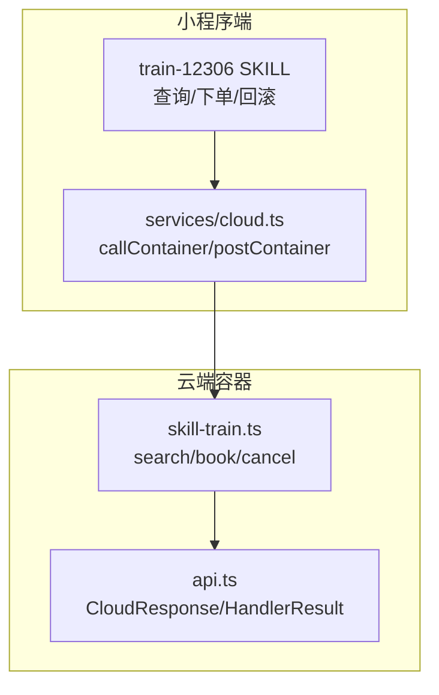
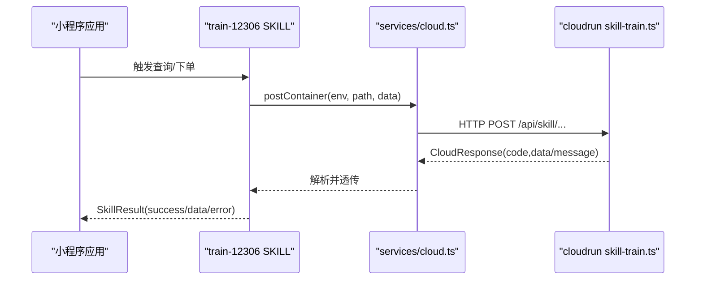
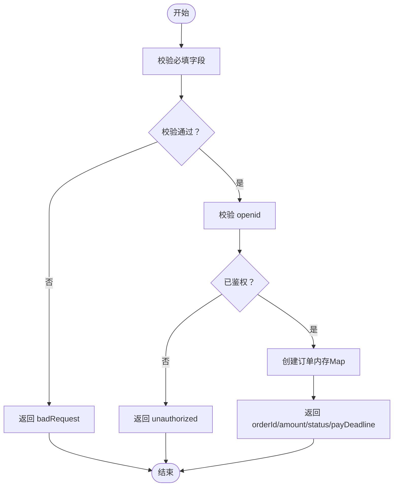
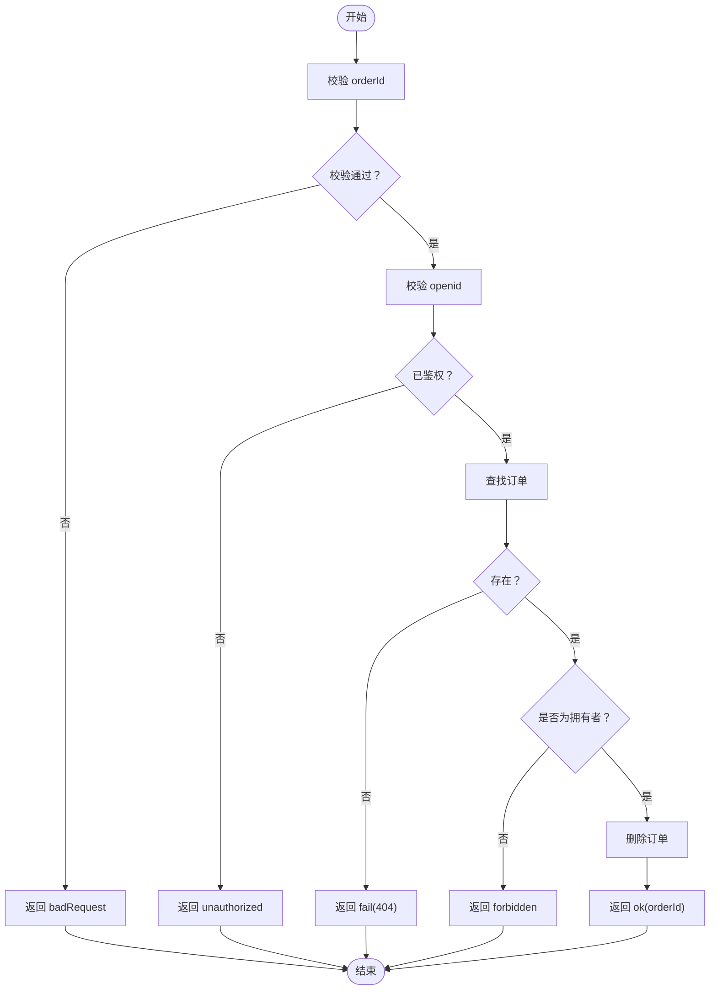
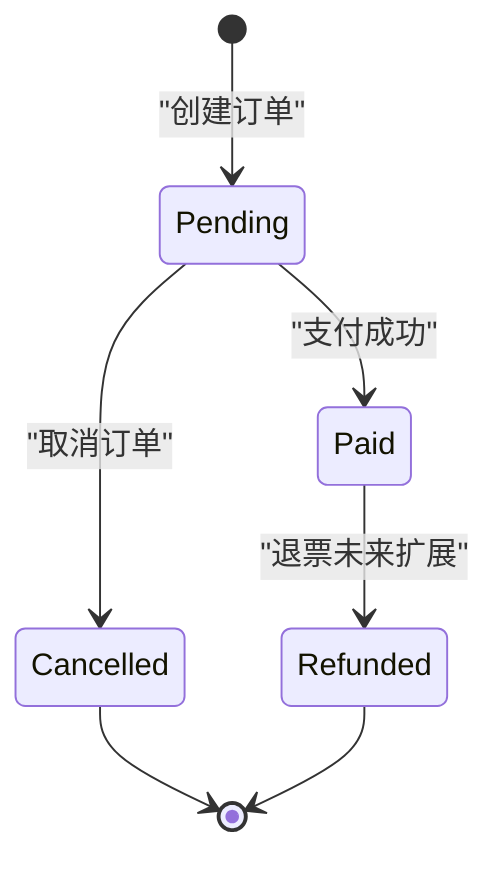
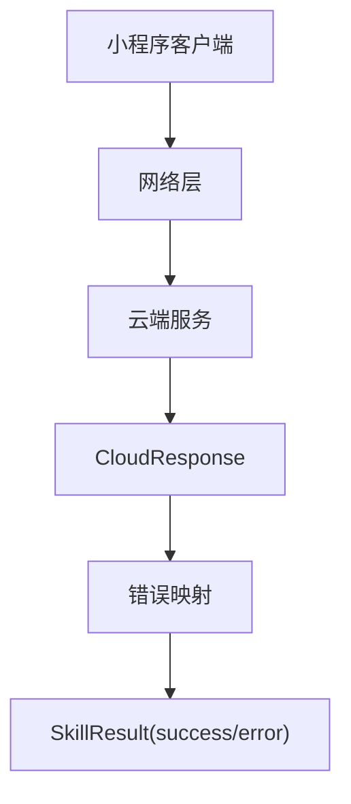
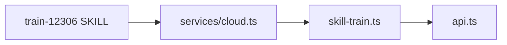

# 火车票预订接口

<cite>
**本文引用的文件**   
- [cloudrun/src/skill-train.ts](file://cloudrun/src/skill-train.ts)
- [cloudrun/src/api.ts](file://cloudrun/src/api.ts)
- [miniprogram/src/skills/builtin/train-12306/index.ts](file://miniprogram/src/skills/builtin/train-12306/index.ts)
- [miniprogram/src/services/cloud.ts](file://miniprogram/src/services/cloud.ts)
</cite>

## 目录
1. [简介](#简介)
2. [项目结构](#项目结构)
3. [核心能力与端点总览](#核心能力与端点总览)
4. [架构总览](#架构总览)
5. [接口定义](#接口定义)
   - [查询车次 search_train](#查询车次-search_train)
   - [预订车票 book_ticket](#预订车票-book_ticket)
   - [取消订单 book_ticket/cancel](#取消订单-book_ticketcancel)
6. [业务流程与状态管理](#业务流程与状态管理)
7. [错误码与异常处理](#错误码与异常处理)
8. [请求与响应示例](#请求与响应示例)
9. [依赖关系分析](#依赖关系分析)
10. [性能优化建议与最佳实践](#性能优化建议与最佳实践)
11. [故障排查指南](#故障排查指南)
12. [结论](#结论)

## 简介
本文件面向“火车票预订”相关 API，覆盖查询、预订、取消（退票）等核心能力。当前实现为 MVP：后端返回确定性模拟数据，订单保存在内存 Map；小程序侧通过 SKILL 调用云端 Container 接口，统一封装网络层、重试与超时策略。改签与真实支付出票不在本版本范围内，但文档会说明扩展方向。

## 项目结构
本项目由两部分组成：
- 小程序端：提供 train-12306 SKILL，负责参数校验、业务编排、错误翻译与降级逻辑。
- 云端容器：暴露 REST 风格端点，处理查询、下单、取消等业务逻辑。

**图表来源**
- [miniprogram/src/skills/builtin/train-12306/index.ts:159-190](file://miniprogram/src/skills/builtin/train-12306/index.ts#L159-L190)
- [miniprogram/src/services/cloud.ts:64-149](file://miniprogram/src/services/cloud.ts#L64-L149)
- [cloudrun/src/api.ts:10-63](file://cloudrun/src/api.ts#L10-L63)
- [cloudrun/src/skill-train.ts:46-147](file://cloudrun/src/skill-trail.ts#L46-L147)

**章节来源**
- [miniprogram/src/skills/builtin/train-12306/index.ts:1-157](file://miniprogram/src/skills/builtin/train-12306/index.ts#L1-L157)
- [cloudrun/src/skill-train.ts:1-147](file://cloudrun/src/skill-train.ts#L1-L147)

## 核心能力与端点总览
- 查询车次：POST /api/skill/skill.train.12306/search_train
- 预订车票：POST /api/skill/skill.train.12306/book_ticket
- 取消订单：POST /api/skill/skill.train.12306/book_ticket/cancel

注意：
- 所有端点均使用 POST，JSON 请求体。
- 云端统一返回 CloudResponse：code=0 表示成功，非 0 表示业务失败；HTTP 4xx/5xx 表示网络或鉴权错误。
- 写操作（预订、取消）必须携带 x-wx-openid 身份头，否则拒绝。

**章节来源**
- [cloudrun/src/skill-train.ts:4-14](file://cloudrun/src/skill-train.ts#L4-L14)
- [cloudrun/src/skill-train.ts:143-147](file://cloudrun/src/skill-train.ts#L143-L147)

## 架构总览
小程序端通过 services/cloud.ts 的 postContainer 调用云端 Container，云端 skill-train.ts 处理具体业务，并通过 api.ts 的 ok/fail/badRequest/unauthorized/forbidden 构造标准响应。

**图表来源**
- [miniprogram/src/skills/builtin/train-12306/index.ts:193-216](file://miniprogram/src/skills/builtin/train-12306/index.ts#L193-L216)
- [miniprogram/src/services/cloud.ts:209-223](file://miniprogram/src/services/cloud.ts#L209-L223)
- [cloudrun/src/skill-train.ts:46-147](file://cloudrun/src/skill-train.ts#L46-L147)

## 接口定义

### 查询车次 search_train
- 方法：POST
- 路径：/api/skill/skill.train.12306/search_train
- 鉴权：无需 openid（读操作）
- 幂等：是

请求体字段
- from：字符串，必填，出发城市名
- to：字符串，必填，到达城市名
- date：字符串，必填，YYYY-MM-DD
- seatType：字符串，可选，座位类型枚举：business、first_class、second_class、hard_seat
- highSpeedOnly：布尔值，可选，是否只查高铁（用于前端筛选）

响应体字段
- code：数字，0 表示成功
- data.from：字符串，出发城市
- data.to：字符串，到达城市
- data.date：字符串，出行日期
- data.trains：数组，车次列表
  - trainNo：字符串，车次号
  - from：字符串，出发站
  - to：字符串，到达站
  - departTime：字符串，HH:mm
  - arriveTime：字符串，HH:mm
  - durationMin：数字，运行时长（分钟）
  - seatType：字符串，座位类型
  - priceCent：数字，票价（分）
  - ticketsLeft：数字，余票数

业务规则
- 未提供 from/to/date 将返回 badRequest。
- date 格式不符合 YYYY-MM-DD 将返回 badRequest。
- 若 seatType 未提供，默认 second_class。
- 车次与余票为确定性模拟数据，同一入参恒得同一结果。

**章节来源**
- [cloudrun/src/skill-train.ts:39-77](file://cloudrun/src/skill-train.ts#L39-L77)
- [miniprogram/src/skills/builtin/train-12306/index.ts:18-46](file://miniprogram/src/skills/builtin/train-12306/index.ts#L18-L46)

### 预订车票 book_ticket
- 方法：POST
- 路径：/api/skill/skill.train.12306/book_ticket
- 鉴权：需要 openid（写操作红线条款）
- 幂等：否
- 可回滚：是

请求体字段
- trainNo：字符串，必填，车次号
- date：字符串，必填，YYYY-MM-DD
- seatType：字符串，必填，座位类型枚举
- passengerName：字符串，必填，乘客姓名
- passengerIdNo：字符串，必填，身份证号
- from：字符串，可选，从查询结果注入
- to：字符串，可选，从查询结果注入

响应体字段
- code：数字，0 表示成功
- data.orderId：字符串，订单号
- data.trainNo：字符串，车次号
- data.amountCent：数字，金额（分）
- data.status：字符串，pending_payment 或 paid
- data.payDeadline：数字，支付截止时间（毫秒时间戳）

业务规则
- 缺少必填字段将返回 badRequest。
- 缺少 openid 将返回 unauthorized。
- 创建订单后状态为 pending_payment，并设置 15 分钟支付截止时间。
- 座位锁定在下单时完成（MVP 中为内存记录）。

**图表来源**
- [cloudrun/src/skill-train.ts:89-116](file://cloudrun/src/skill-train.ts#L89-L116)

**章节来源**
- [cloudrun/src/skill-train.ts:79-116](file://cloudrun/src/skill-train.ts#L79-L116)
- [miniprogram/src/skills/builtin/train-12306/index.ts:48-67](file://miniprogram/src/skills/builtin/train-12306/index.ts#L48-L67)

### 取消订单 book_ticket/cancel
- 方法：POST
- 路径：/api/skill/skill.train.12306/book_ticket/cancel
- 鉴权：需要 openid（写操作红线条款）
- 幂等：否
- 可回滚：是（SKILL rollback 调用此接口）

请求体字段
- orderId：字符串，必填，订单号

响应体字段
- code：数字，0 表示成功
- data.ok：布尔值，true
- data.orderId：字符串，被取消的订单号

业务规则
- 缺少 orderId 将返回 badRequest。
- 缺少 openid 将返回 unauthorized。
- 订单不存在或已取消返回 fail(404)。
- 非订单拥有者取消返回 forbidden（防 IDOR）。
- 成功后删除内存中的订单记录。

**图表来源**
- [cloudrun/src/skill-train.ts:122-141](file://cloudrun/src/skill-train.ts#L122-L141)

**章节来源**
- [cloudrun/src/skill-train.ts:118-141](file://cloudrun/src/skill-train.ts#L118-L141)

## 业务流程与状态管理
- 查询阶段：用户输入出发地、目的地、日期，系统返回车次列表与余票信息。
- 预订阶段：用户选择车次与座位类型，提交乘客信息，系统创建订单并冻结座位（MVP 中为内存记录），返回订单号与支付截止时间。
- 支付阶段：外部支付完成后，状态应更新为 paid（当前 MVP 未实现支付回调，预留扩展点）。
- 取消阶段：用户或系统回滚时调用取消接口，校验归属后删除订单。

**图表来源**
- [cloudrun/src/skill-train.ts:109-115](file://cloudrun/src/skill-train.ts#L109-L115)
- [cloudrun/src/skill-train.ts:139-140](file://cloudrun/src/skill-train.ts#L139-L140)

**章节来源**
- [miniprogram/src/skills/builtin/train-12306/index.ts:174-189](file://miniprogram/src/skills/builtin/train-12306/index.ts#L174-L189)
- [cloudrun/src/skill-train.ts:89-141](file://cloudrun/src/skill-train.ts#L89-L141)

## 错误码与异常处理
云端统一响应协议：
- HTTP 200 + code=0：业务成功
- HTTP 200 + code≠0：业务失败（SKILL 层翻译为 SkillError）
- HTTP 4xx/5xx：网络或鉴权错误（小程序端触发重试）

常见错误码
- 400：参数缺失或格式错误（badRequest）
- 401：缺少 openid（unauthorized）
- 403：无权限操作他人资源（forbidden）
- 404：订单不存在或已取消（fail(404)）
- 503：服务端不可用（小程序端视为可重试）

小程序端错误映射
- SEARCH_FAILED：查询失败（code=503 时可重试）
- NO_TICKETS：无票（对应云端 code=1001）
- BOOK_FAILED：下单失败

**图表来源**
- [cloudrun/src/api.ts:10-63](file://cloudrun/src/api.ts#L10-L63)
- [miniprogram/src/skills/builtin/train-12306/index.ts:212-215](file://miniprogram/src/skills/builtin/train-12306/index.ts#L212-L215)
- [miniprogram/src/skills/builtin/train-12306/index.ts:268-275](file://miniprogram/src/skills/builtin/train-12306/index.ts#L268-L275)

**章节来源**
- [cloudrun/src/api.ts:40-63](file://cloudrun/src/api.ts#L40-L63)
- [miniprogram/src/skills/builtin/train-12306/index.ts:204-215](file://miniprogram/src/skills/builtin/train-12306/index.ts#L204-L215)
- [miniprogram/src/skills/builtin/train-12306/index.ts:268-275](file://miniprogram/src/skills/builtin/train-12306/index.ts#L268-L275)

## 请求与响应示例

### 查询车次
请求
- 方法：POST
- 路径：/api/skill/skill.train.12306/search_train
- 请求体：{ from: "北京", to: "上海", date: "2025-01-01", seatType: "second_class" }

响应
- code: 0
- data: { from: "北京", to: "上海", date: "2025-01-01", trains: [...] }

异常情况
- 缺少 from/to/date：返回 code=400，message 提示必填
- date 格式错误：返回 code=400，message 提示格式

**章节来源**
- [cloudrun/src/skill-train.ts:46-77](file://cloudrun/src/skill-train.ts#L46-L77)

### 预订车票
请求
- 方法：POST
- 路径：/api/skill/skill.train.12306/book_ticket
- 请求体：{ trainNo: "G101", date: "2025-01-01", seatType: "second_class", passengerName: "张三", passengerIdNo: "110101199001011234" }
- 头部：x-wx-openid: "wx_openid_..."

响应
- code: 0
- data: { orderId: "ord_xxx", trainNo: "G101", amountCent: 55300, status: "pending_payment", payDeadline: 1704067200000 }

异常情况
- 缺少必填字段：返回 code=400
- 缺少 openid：返回 code=401
- 座位类型无效：默认 fallback 到 second_class

**章节来源**
- [cloudrun/src/skill-train.ts:89-116](file://cloudrun/src/skill-train.ts#L89-L116)

### 取消订单
请求
- 方法：POST
- 路径：/api/skill/skill.train.12306/book_ticket/cancel
- 请求体：{ orderId: "ord_xxx" }
- 头部：x-wx-openid: "wx_openid_..."

响应
- code: 0
- data: { ok: true, orderId: "ord_xxx" }

异常情况
- 缺少 orderId：返回 code=400
- 缺少 openid：返回 code=401
- 订单不存在：返回 code=404
- 非拥有者：返回 code=403

**章节来源**
- [cloudrun/src/skill-train.ts:122-141](file://cloudrun/src/skill-train.ts#L122-L141)

## 依赖关系分析
- 小程序端 SKILL 依赖 services/cloud.ts 进行网络调用。
- 云端 skill-train.ts 依赖 api.ts 构造标准响应。
- 所有端点通过统一的 CloudResponse 协议交互。

**图表来源**
- [miniprogram/src/skills/builtin/train-12306/index.ts:159-190](file://miniprogram/src/skills/builtin/train-12306/index.ts#L159-L190)
- [miniprogram/src/services/cloud.ts:64-149](file://miniprogram/src/services/cloud.ts#L64-L149)
- [cloudrun/src/skill-train.ts:46-147](file://cloudrun/src/skill-train.ts#L46-L147)
- [cloudrun/src/api.ts:10-63](file://cloudrun/src/api.ts#L10-L63)

**章节来源**
- [miniprogram/src/skills/builtin/train-12306/index.ts:1-157](file://miniprogram/src/skills/builtin/train-12306/index.ts#L1-L157)
- [cloudrun/src/skill-train.ts:1-147](file://cloudrun/src/skill-train.ts#L1-L147)

## 性能优化建议与最佳实践
- 缓存查询结果：对相同 from/to/date 的查询结果进行短期缓存，减少重复计算。
- 分页与限流：车次列表支持分页，避免一次性返回过多数据。
- 异步处理：支付回调与出票流程异步化，提升响应速度。
- 连接池与超时：合理设置网络超时与重试策略，避免雪崩。
- 鉴权前置：在网关层校验 openid，减少后端压力。
- 幂等性：对查询接口保证幂等，对写操作引入幂等键防止重复下单。

[本节为通用指导，不直接分析具体文件]

## 故障排查指南
- 查询失败：检查 from/to/date 是否必填，date 格式是否正确。
- 下单失败：确认 openid 是否存在，seatType 是否在枚举内。
- 取消失败：验证 orderId 是否存在，openid 是否为订单拥有者。
- 网络错误：检查小程序端 cloudEnv 配置，确认 wx.cloud.callContainer 可用。
- 开发环境降级：在开发模式下，云端不可用时会返回 code=-1，SKILL 层会使用 mock 数据。

**章节来源**
- [miniprogram/src/services/cloud.ts:78-119](file://miniprogram/src/services/cloud.ts#L78-L119)
- [miniprogram/src/skills/builtin/train-12306/index.ts:207-215](file://miniprogram/src/skills/builtin/train-12306/index.ts#L207-L215)

## 结论
当前实现提供了火车票查询、预订与取消的核心能力，采用确定性模拟数据与内存存储，便于快速验证与演示。后续可扩展真实支付、出票状态管理与持久化存储，同时保持现有端点协议不变，确保平滑升级。

[本节为总结性内容，不直接分析具体文件]