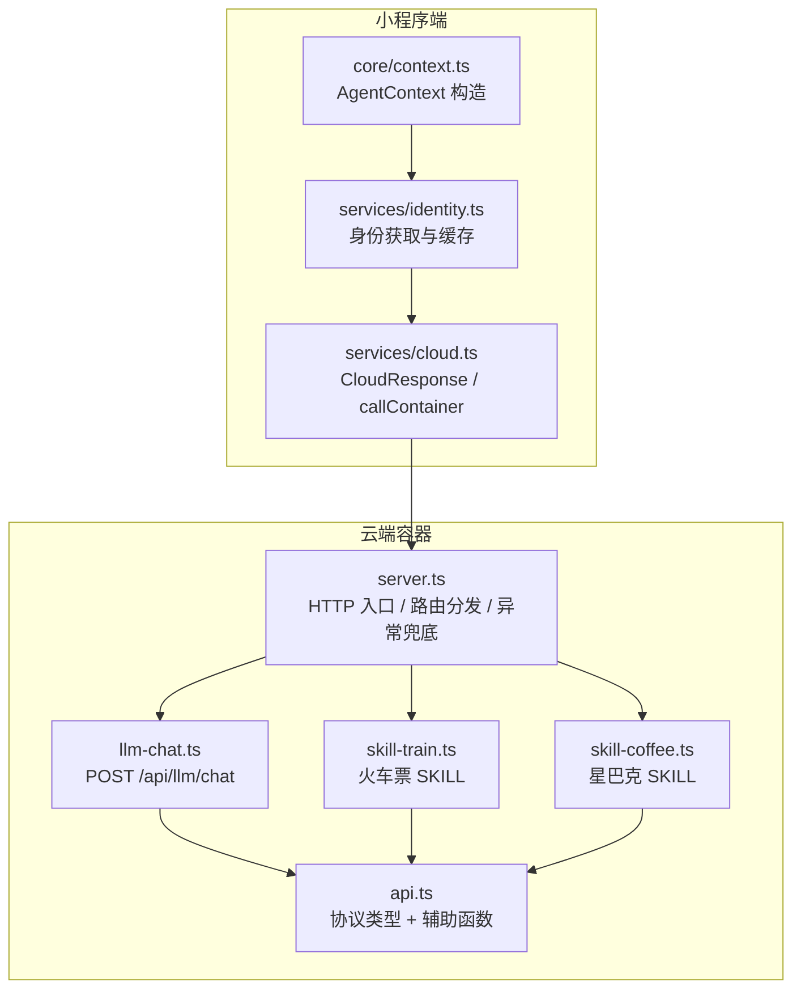
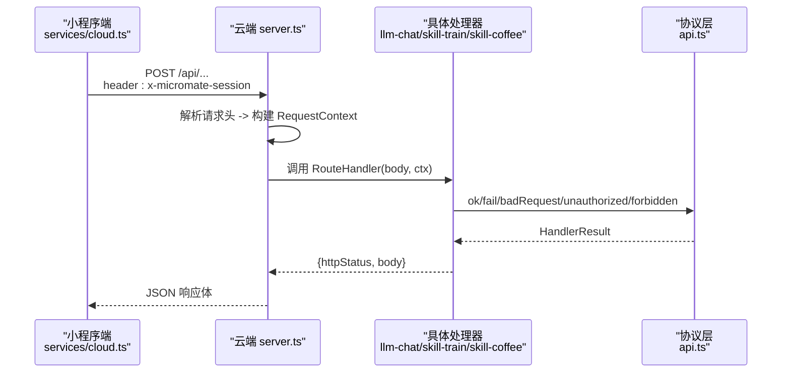
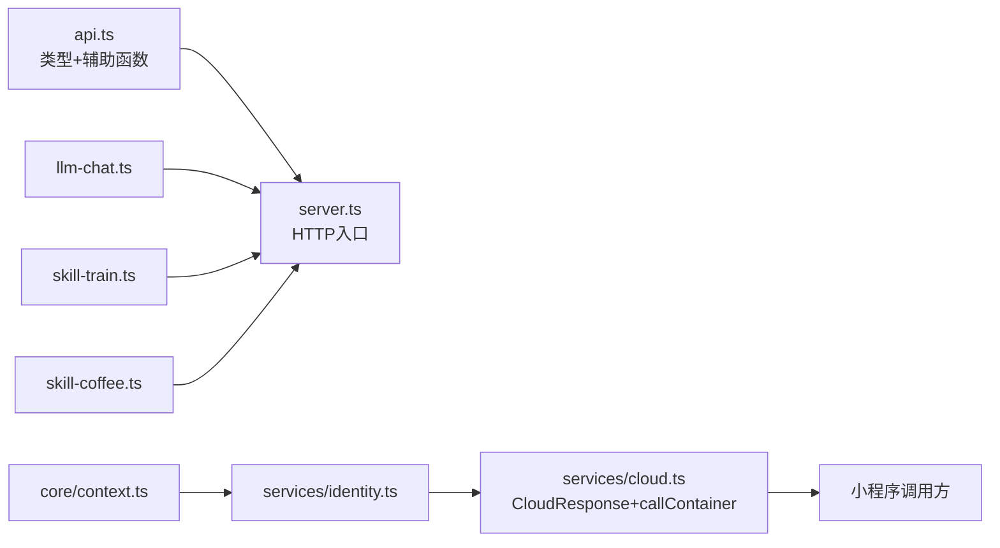
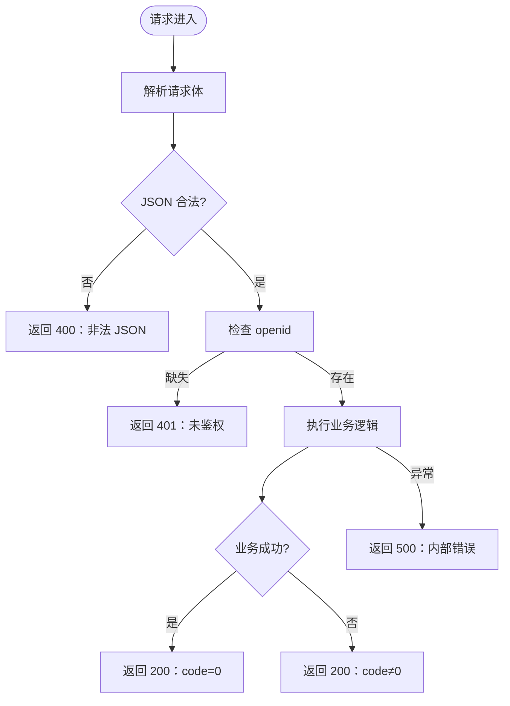

# 通用协议规范

<cite>
**本文引用的文件**   
- [cloudrun/src/api.ts](file://cloudrun/src/api.ts)
- [cloudrun/src/server.ts](file://cloudrun/src/server.ts)
- [cloudrun/src/llm-chat.ts](file://cloudrun/src/llm-chat.ts)
- [cloudrun/src/skill-train.ts](file://cloudrun/src/skill-train.ts)
- [cloudrun/src/skill-coffee.ts](file://cloudrun/src/skill-coffee.ts)
- [miniprogram/src/services/cloud.ts](file://miniprogram/src/services/cloud.ts)
- [miniprogram/src/services/identity.ts](file://miniprogram/src/services/identity.ts)
- [miniprogram/src/core/context.ts](file://miniprogram/src/core/context.ts)
- [miniprogram/src/types/context.d.ts](file://miniprogram/src/types/context.d.ts)
</cite>

## 目录
1. [引言](#引言)
2. [项目结构](#项目结构)
3. [核心组件](#核心组件)
4. [架构总览](#架构总览)
5. [详细组件分析](#详细组件分析)
6. [依赖关系分析](#依赖关系分析)
7. [性能与可靠性](#性能与可靠性)
8. [错误处理规范](#错误处理规范)
9. [认证与安全策略](#认证与安全策略)
10. [API 版本管理与兼容性](#api-版本管理与兼容性)
11. [故障排查指南](#故障排查指南)
12. [结论](#结论)

## 引言
本规范面向云端服务，定义统一的 API 协议、响应格式、上下文传递、处理器返回约定、辅助函数用法、认证与安全策略、错误处理以及版本管理。目标是在小程序端与云端容器之间建立稳定、可演进、可观测的接口契约，确保业务 SKILL（如火车票、星巴克）与 LLM 代理在统一协议下协作。

## 项目结构
云端侧采用 Node.js 原生 HTTP 服务器，按路由模块拆分：LLM 代理、火车票 SKILL、星巴克 SKILL；小程序侧通过 Cloud Container 调用云端，并封装重试、超时、开发环境降级等能力。

图示来源
- [cloudrun/src/server.ts:76-128](file://cloudrun/src/server.ts#L76-L128)
- [cloudrun/src/api.ts:10-63](file://cloudrun/src/api.ts#L10-L63)
- [cloudrun/src/llm-chat.ts:19-20](file://cloudrun/src/llm-chat.ts#L19-L20)
- [cloudrun/src/skill-train.ts:16-17](file://cloudrun/src/skill-train.ts#L16-L17)
- [cloudrun/src/skill-coffee.ts:13-14](file://cloudrun/src/skill-coffee.ts#L13-L14)
- [miniprogram/src/services/cloud.ts:64-149](file://miniprogram/src/services/cloud.ts#L64-L149)
- [miniprogram/src/services/identity.ts:15-25](file://miniprogram/src/services/identity.ts#L15-L25)
- [miniprogram/src/core/context.ts:60-79](file://miniprogram/src/core/context.ts#L60-L79)

章节来源
- [cloudrun/src/server.ts:1-128](file://cloudrun/src/server.ts#L1-L128)
- [cloudrun/src/api.ts:1-63](file://cloudrun/src/api.ts#L1-L63)
- [miniprogram/src/services/cloud.ts:1-223](file://miniprogram/src/services/cloud.ts#L1-L223)

## 核心组件
- CloudResponse：云端标准响应体，包含 code、message、data。
- RequestContext：每次请求上下文，包含 openid 与 sessionId。
- HandlerResult：处理器返回结构，包含 httpStatus 与 body。
- 辅助函数：ok、fail、badRequest、unauthorized、forbidden。
- 客户端封装：callContainer/postContainer，负责 header 注入、超时、重试、开发环境降级。

章节来源
- [cloudrun/src/api.ts:10-63](file://cloudrun/src/api.ts#L10-L63)
- [miniprogram/src/services/cloud.ts:35-43](file://miniprogram/src/services/cloud.ts#L35-L43)
- [miniprogram/src/services/cloud.ts:64-149](file://miniprogram/src/services/cloud.ts#L64-L149)

## 架构总览
小程序端通过 services/cloud.ts 发起容器调用，携带 x-micromate-session；云端 server.ts 解析请求头构建 RequestContext，分发给各 handler；handler 使用 api.ts 中的辅助函数返回统一结果；服务端统一 JSON 序列化并设置 content-type。

图示来源
- [miniprogram/src/services/cloud.ts:64-149](file://miniprogram/src/services/cloud.ts#L64-L149)
- [cloudrun/src/server.ts:80-122](file://cloudrun/src/server.ts#L80-L122)
- [cloudrun/src/api.ts:40-63](file://cloudrun/src/api.ts#L40-L63)

## 详细组件分析

### CloudResponse 标准响应格式
- code：业务状态码。0 表示成功；非 0 表示业务失败，message 提供人类可读说明。
- message：可选，用于描述错误原因或提示信息。
- data：可选，业务数据载体，类型由具体接口定义。

使用规范
- 成功路径：code=0，data 为业务对象。
- 业务失败：code≠0，message 必填，data 可为空。
- 网络层错误：HTTP 5xx，小程序端视为可重试（429/503）。

章节来源
- [cloudrun/src/api.ts:10-18](file://cloudrun/src/api.ts#L10-L18)
- [miniprogram/src/services/cloud.ts:35-43](file://miniprogram/src/services/cloud.ts#L35-L43)

### RequestContext 上下文对象
- openid：微信云托管注入的调用方 OpenID，来自请求头 x-wx-openid。
- sessionId：小程序端附加的会话 ID，来自请求头 x-micromate-session。

传递方式
- 小程序端 services/cloud.ts 在 header 中注入 x-micromate-session。
- 云端 server.ts 从请求头读取并填充到 RequestContext，再传给处理器。

作用
- openid：用于身份识别与归属鉴权（写操作必须携带）。
- sessionId：用于关联一次会话的请求链路，便于日志追踪与多轮对话。

章节来源
- [cloudrun/src/api.ts:20-26](file://cloudrun/src/api.ts#L20-L26)
- [cloudrun/src/server.ts:100-103](file://cloudrun/src/server.ts#L100-L103)
- [miniprogram/src/services/cloud.ts:70-75](file://miniprogram/src/services/cloud.ts#L70-L75)

### HandlerResult 处理器返回格式与 HTTP 状态码
- httpStatus：HTTP 状态码，由服务端直接写入响应。
- body：CloudResponse 对象，承载业务状态与数据。

状态码使用规范
- 200：业务成功或业务失败（code≠0），由业务语义决定。
- 400：参数校验失败或请求格式错误。
- 401：未鉴权（缺少 openid）。
- 403：无权限（越权访问他人资源）。
- 404：路由不存在或资源不存在。
- 413：请求体过大。
- 500：内部错误。
- 503：上游不可用（例如 LLM 代理未配置或上游失败）。

章节来源
- [cloudrun/src/api.ts:28-32](file://cloudrun/src/api.ts#L28-L32)
- [cloudrun/src/server.ts:94-122](file://cloudrun/src/server.ts#L94-L122)
- [cloudrun/src/llm-chat.ts:47-50](file://cloudrun/src/llm-chat.ts#L47-L50)

### 响应辅助函数
- ok(data)：返回 HTTP 200 且 code=0 的成功响应。
- fail(code, message)：返回 HTTP 200 但 code≠0 的业务失败响应。
- badRequest(message)：返回 HTTP 400，提示参数或格式错误。
- unauthorized(message)：返回 HTTP 401，提示缺少调用方身份。
- forbidden(message)：返回 HTTP 403，提示无权限操作他人资源。

使用建议
- 所有处理器应优先使用这些辅助函数，避免手写响应体导致不一致。
- 业务失败使用 fail，将业务错误码与消息透传至客户端。
- 鉴权失败使用 unauthorized；归属鉴权失败使用 forbidden。

章节来源
- [cloudrun/src/api.ts:40-63](file://cloudrun/src/api.ts#L40-L63)

### 认证机制与安全策略
- 身份验证：openid 由云托管注入，通过请求头 x-wx-openid 传递；小程序端通过 identity 服务换取 openid 并缓存。
- 权限控制：写操作必须携带 openid；对资源进行归属校验，防止 IDOR（跨用户操作）。
- 数据保护：敏感信息（如 API Key）仅存在于云端环境变量，不进入代码或小程序端。

实现要点
- 服务端从请求头提取 openid 并注入 RequestContext。
- 处理器在写操作前检查 openid 是否存在，否则返回 unauthorized。
- 取消订单等操作需校验订单 owner 是否等于当前 openid，否则返回 forbidden。

章节来源
- [cloudrun/src/server.ts:100-103](file://cloudrun/src/server.ts#L100-L103)
- [cloudrun/src/skill-train.ts:89-138](file://cloudrun/src/skill-train.ts#L89-L138)
- [cloudrun/src/skill-coffee.ts:54-116](file://cloudrun/src/skill-coffee.ts#L54-L116)
- [miniprogram/src/services/identity.ts:15-25](file://miniprogram/src/services/identity.ts#L15-L25)

### 统一错误处理规范
- 参数错误：使用 badRequest，明确字段要求与格式。
- 鉴权错误：使用 unauthorized，强调写操作红线。
- 归属鉴权错误：使用 forbidden，明确“无权操作他人资源”。
- 资源不存在：使用 fail(404, ...)，保持 HTTP 200 但业务失败。
- 网络/上游错误：返回 503，客户端根据 code 判断是否重试。
- 系统异常：服务端 catch 块统一返回 500，记录日志。

章节来源
- [cloudrun/src/api.ts:50-63](file://cloudrun/src/api.ts#L50-L63)
- [cloudrun/src/server.ts:110-122](file://cloudrun/src/server.ts#L110-L122)
- [cloudrun/src/llm-chat.ts:98-107](file://cloudrun/src/llm-chat.ts#L98-L107)

## 依赖关系分析
- 服务端 server.ts 依赖 api.ts 的类型与辅助函数，并聚合 llm-chat、skill-train、skill-coffee 的路由。
- 小程序端 services/cloud.ts 定义 CloudResponse 并与服务端严格对齐，同时封装重试、超时、开发环境降级。
- identity 服务通过 cloud.ts 调用云端身份接口，返回 openid/sessionId 供上层使用。
- core/context.ts 构造 AgentContext，注入 sessionId、userId、位置、全局变量等。

图示来源
- [cloudrun/src/server.ts:22-27](file://cloudrun/src/server.ts#L22-L27)
- [cloudrun/src/api.ts:10-63](file://cloudrun/src/api.ts#L10-L63)
- [miniprogram/src/services/cloud.ts:64-149](file://miniprogram/src/services/cloud.ts#L64-L149)
- [miniprogram/src/services/identity.ts:15-25](file://miniprogram/src/services/identity.ts#L15-L25)
- [miniprogram/src/core/context.ts:60-79](file://miniprogram/src/core/context.ts#L60-L79)

章节来源
- [cloudrun/src/server.ts:22-27](file://cloudrun/src/server.ts#L22-L27)
- [miniprogram/src/services/cloud.ts:64-149](file://miniprogram/src/services/cloud.ts#L64-L149)

## 性能与可靠性
- 请求体大小限制：服务端限制 1MB，超限返回 413。
- 超时控制：小程序端默认单次调用超时 15s；LLM 上游调用有独立超时上限。
- 重试策略：指数退避 + 抖动，最大尝试次数 3 次；429/503 标记为可重试。
- 开发环境降级：当 wx.cloud.callContainer 不可用时，返回 code:-1，让 SKILL mock 与规则规划器兜底。

优化建议
- 对大对象传输进行压缩或分页。
- 对高频读接口增加缓存（服务端或客户端）。
- 对上游 LLM 调用增加熔断与限流。

章节来源
- [cloudrun/src/server.ts:19-20](file://cloudrun/src/server.ts#L19-L20)
- [cloudrun/src/server.ts:113-115](file://cloudrun/src/server.ts#L113-L115)
- [miniprogram/src/services/cloud.ts:61-62](file://miniprogram/src/services/cloud.ts#L61-L62)
- [miniprogram/src/services/cloud.ts:123-149](file://miniprogram/src/services/cloud.ts#L123-L149)
- [miniprogram/src/utils/retry.ts:42-85](file://miniprogram/src/utils/retry.ts#L42-L85)

## 错误处理规范
- 参数校验失败：返回 badRequest，message 指明缺失字段或格式问题。
- 鉴权失败：返回 unauthorized，message 指出缺少 openid。
- 归属鉴权失败：返回 forbidden，message 指出无权操作他人资源。
- 资源不存在：返回 fail(404, ...)，保持 HTTP 200 但业务失败。
- 上游不可用：返回 503，message 包含上游错误摘要。
- 系统异常：服务端 catch 返回 500，并记录日志。

图示来源
- [cloudrun/src/server.ts:105-122](file://cloudrun/src/server.ts#L105-L122)
- [cloudrun/src/api.ts:50-63](file://cloudrun/src/api.ts#L50-L63)

章节来源
- [cloudrun/src/server.ts:105-122](file://cloudrun/src/server.ts#L105-L122)
- [cloudrun/src/api.ts:50-63](file://cloudrun/src/api.ts#L50-L63)

## 认证与安全策略
- 身份来源：openid 由云托管注入，通过 x-wx-openid 传递；小程序端通过 identity 服务换取并缓存。
- 写操作红线：所有写操作必须携带 openid，否则拒绝。
- 归属鉴权：对资源进行 owner 校验，防止 IDOR。
- 密钥管理：LLM API Key 仅存在于云端环境变量，不进入代码或小程序端。

最佳实践
- 对所有写接口强制校验 openid。
- 对资源操作进行归属校验，避免越权。
- 不在客户端存储敏感密钥。
- 使用统一的 unauthorized/forbidden 返回语义。

章节来源
- [cloudrun/src/server.ts:100-103](file://cloudrun/src/server.ts#L100-L103)
- [cloudrun/src/skill-train.ts:89-138](file://cloudrun/src/skill-train.ts#L89-L138)
- [cloudrun/src/skill-coffee.ts:54-116](file://cloudrun/src/skill-coffee.ts#L54-L116)
- [cloudrun/src/llm-chat.ts:8-11](file://cloudrun/src/llm-chat.ts#L8-L11)
- [miniprogram/src/services/identity.ts:15-25](file://miniprogram/src/services/identity.ts#L15-L25)

## API 版本管理与兼容性
- 当前协议以 CloudResponse 为核心，code/message/data 字段保持稳定。
- 新增字段时保持向后兼容：客户端忽略未知字段，服务端对旧客户端返回必要字段。
- 路由命名遵循功能域前缀（如 /api/llm、/api/skill），便于未来引入 v1/v2 路径前缀。
- 建议在后续迭代中引入版本号（如 /api/v1/...），并在弃用旧版本时提供迁移期。

兼容性建议
- 对可选字段使用可选类型，避免破坏旧客户端。
- 对枚举值扩展时保留默认分支，避免未知值导致失败。
- 对错误码扩展时保留现有语义，新增错误码需文档化。

章节来源
- [cloudrun/src/api.ts:10-18](file://cloudrun/src/api.ts#L10-L18)
- [cloudrun/src/llm-chat.ts:120-122](file://cloudrun/src/llm-chat.ts#L120-L122)
- [cloudrun/src/skill-train.ts:143-147](file://cloudrun/src/skill-train.ts#L143-L147)
- [cloudrun/src/skill-coffee.ts:119-123](file://cloudrun/src/skill-coffee.ts#L119-L123)

## 故障排查指南
- 400 非法 JSON：检查请求体是否为合法 JSON，注意字符编码。
- 413 请求体过大：确认上传数据大小不超过 1MB。
- 401 未鉴权：确认请求头包含 x-wx-openid。
- 403 无权限：确认当前 openid 拥有该资源的所有权。
- 503 上游不可用：检查 LLM_BASE_URL 与 LLM_API_KEY 配置，或上游服务状态。
- 500 内部错误：查看服务端日志，定位异常堆栈。

章节来源
- [cloudrun/src/server.ts:113-122](file://cloudrun/src/server.ts#L113-L122)
- [cloudrun/src/llm-chat.ts:56-61](file://cloudrun/src/llm-chat.ts#L56-L61)

## 结论
本规范定义了云端服务的统一 API 协议，明确了 CloudResponse、RequestContext、HandlerResult 与辅助函数的使用方式，并给出了认证、安全、错误处理与版本管理的最佳实践。遵循本规范可确保小程序端与云端容器的稳定协作，并为后续扩展与演进提供坚实基础。