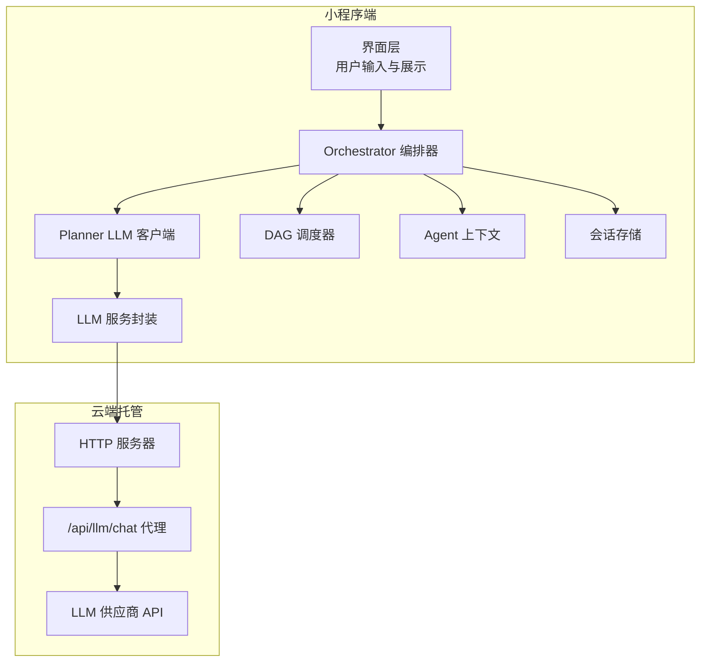
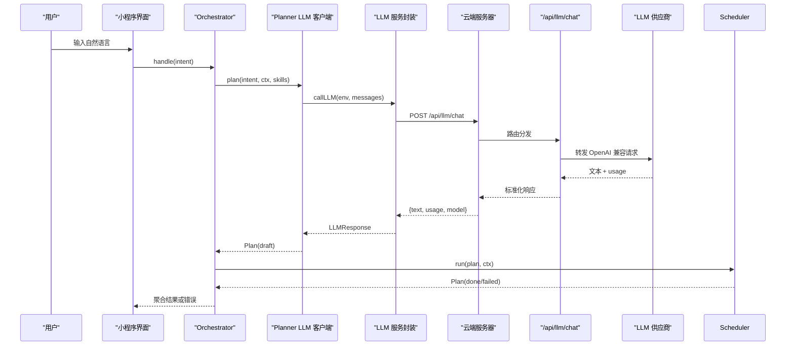
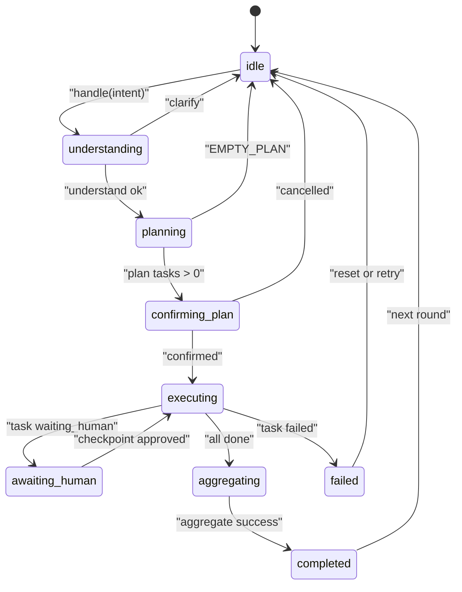
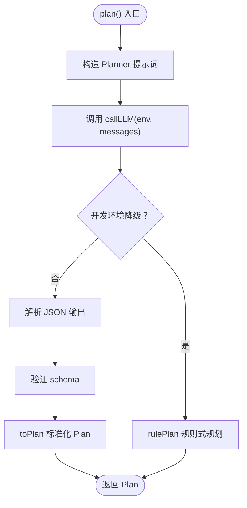
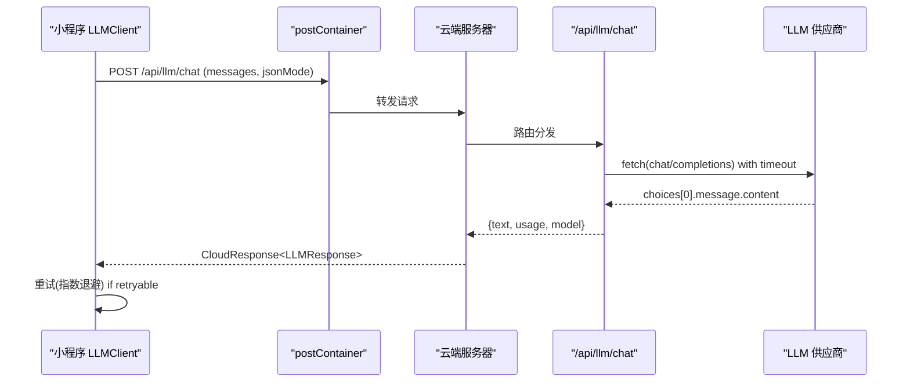
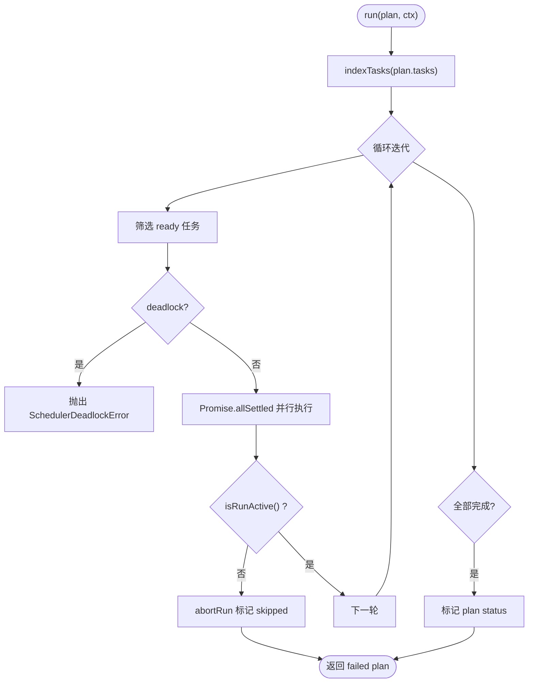
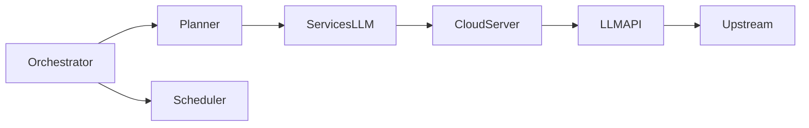

# LLM服务集成

<cite>
**本文引用的文件**   
- [miniprogram/src/llm/client.ts](file://miniprogram/src/llm/client.ts)
- [miniprogram/src/services/llm.ts](file://miniprogram/src/services/llm.ts)
- [cloudrun/src/llm-chat.ts](file://cloudrun/src/llm-chat.ts)
- [cloudrun/src/server.ts](file://cloudrun/src/server.ts)
- [miniprogram/src/core/orchestrator.ts](file://miniprogram/src/core/orchestrator.ts)
- [miniprogram/src/core/context.ts](file://miniprogram/src/core/context.ts)
- [miniprogram/src/storage/session.ts](file://miniprogram/src/storage/session.ts)
- [miniprogram/src/llm/prompts/planner.ts](file://miniprogram/src/llm/prompts/planner.ts)
- [miniprogram/src/llm/parser.ts](file://miniprogram/src/llm/parser.ts)
- [miniprogram/src/core/scheduler.ts](file://miniprogram/src/core/scheduler.ts)
- [miniprogram/src/utils/retry.ts](file://miniprogram/src/utils/retry.ts)
- [miniprogram/src/utils/logger.ts](file://miniprogram/src/utils/logger.ts)
</cite>

## 目录
1. [引言](#引言)
2. [项目结构](#项目结构)
3. [核心组件](#核心组件)
4. [架构总览](#架构总览)
5. [详细组件分析](#详细组件分析)
6. [依赖关系分析](#依赖关系分析)
7. [性能与并发优化](#性能与并发优化)
8. [错误处理与容错策略](#错误处理与容错策略)
9. [监控、日志与可观测性](#监控日志与可观测性)
10. [流式响应与实时交互说明](#流式响应与实时交互说明)
11. [故障排查指南](#故障排查指南)
12. [结论](#结论)

## 引言
本技术文档面向 WAIC-WeChat-MiniProgram 的大语言模型（LLM）服务集成，重点说明以下方面：
- 大模型服务的集成架构与调用链路
- 消息处理管道、上下文管理与会话状态维护
- LLM 聊天接口实现：用户消息接收、意图理解、对话历史管理、响应生成
- 提示词工程：系统提示词设计、用户输入预处理、输出结构化解析
- 错误处理策略：网络超时、API 限流、上游异常与服务降级
- 性能优化建议：缓存、并发控制、资源管理
- 监控与日志记录：调用统计、延迟追踪、错误分析
- 流式响应现状与扩展建议

## 项目结构
本项目由小程序端与云端托管两部分组成：
- 小程序端负责用户交互、意图理解、计划编排、任务调度、本地会话与上下文管理，并通过云容器调用后端 LLM 代理。
- 云端托管提供统一路由入口与 LLM 代理接口，将请求转发至多家 LLM 供应商，并返回标准化结果。

图表来源
- [miniprogram/src/core/orchestrator.ts:106-256](file://miniprogram/src/core/orchestrator.ts#L106-L256)
- [miniprogram/src/llm/client.ts:56-120](file://miniprogram/src/llm/client.ts#L56-L120)
- [miniprogram/src/core/scheduler.ts:77-128](file://miniprogram/src/core/scheduler.ts#L77-L128)
- [miniprogram/src/core/context.ts:61-91](file://miniprogram/src/core/context.ts#L61-L91)
- [miniprogram/src/storage/session.ts:24-47](file://miniprogram/src/storage/session.ts#L24-L47)
- [miniprogram/src/services/llm.ts:57-83](file://miniprogram/src/services/llm.ts#L57-L83)
- [cloudrun/src/server.ts:76-123](file://cloudrun/src/server.ts#L76-L123)
- [cloudrun/src/llm-chat.ts:55-118](file://cloudrun/src/llm-chat.ts#L55-L118)

章节来源
- [miniprogram/src/core/orchestrator.ts:1-340](file://miniprogram/src/core/orchestrator.ts#L1-L340)
- [cloudrun/src/server.ts:1-129](file://cloudrun/src/server.ts#L1-L129)

## 核心组件
- Orchestrator（编排器）：定义状态机，驱动理解、规划、确认、执行、聚合等阶段，处理失败回滚与重置。
- Planner LLM 客户端：构造提示词、调用云端 LLM 代理、解析结构化 Plan，并在开发环境进行规则式降级。
- LLM 服务封装：统一通过云容器调用 /api/llm/chat，封装重试与错误语义。
- DAG 调度器：按依赖并行执行任务，支持人类确认 checkpoint、级联跳过与死锁检测。
- Agent 上下文：构建会话 ID、用户标识、位置信息、全局变量与追踪指标；维护消息历史。
- 会话存储：脱敏保存历史摘要与消息片段，避免跨会话持久化敏感上下文。
- 云端 LLM 代理：校验入参、转发 OpenAI 兼容协议、设置超时、标准化返回体。
- HTTP 服务器：统一路由、健康检查、请求体大小限制、错误码映射。

章节来源
- [miniprogram/src/core/orchestrator.ts:28-48](file://miniprogram/src/core/orchestrator.ts#L28-L48)
- [miniprogram/src/llm/client.ts:20-25](file://miniprogram/src/llm/client.ts#L20-L25)
- [miniprogram/src/services/llm.ts:14-45](file://miniprogram/src/services/llm.ts#L14-L45)
- [miniprogram/src/core/scheduler.ts:27-44](file://miniprogram/src/core/scheduler.ts#L27-L44)
- [miniprogram/src/core/context.ts:20-31](file://miniprogram/src/core/context.ts#L20-L31)
- [miniprogram/src/storage/session.ts:16-22](file://miniprogram/src/storage/session.ts#L16-L22)
- [cloudrun/src/llm-chat.ts:22-45](file://cloudrun/src/llm-chat.ts#L22-L45)
- [cloudrun/src/server.ts:19-27](file://cloudrun/src/server.ts#L19-L27)

## 架构总览
整体调用链从小程序端发起，经 Orchestrator 编排后，由 Planner 构造提示词并调用云端 LLM 代理，最终返回结构化 Plan 并由调度器执行任务。

图表来源
- [miniprogram/src/core/orchestrator.ts:106-256](file://miniprogram/src/core/orchestrator.ts#L106-L256)
- [miniprogram/src/llm/client.ts:56-120](file://miniprogram/src/llm/client.ts#L56-L120)
- [miniprogram/src/services/llm.ts:57-83](file://miniprogram/src/services/llm.ts#L57-L83)
- [cloudrun/src/server.ts:76-123](file://cloudrun/src/server.ts#L76-L123)
- [cloudrun/src/llm-chat.ts:55-118](file://cloudrun/src/llm-chat.ts#L55-L118)

## 详细组件分析

### Orchestrator 编排器
- 职责：定义状态机转移表，驱动理解、规划、确认、执行、聚合阶段；处理失败回滚与重置；暴露 handle 与 reset 方法。
- 关键流程：
  - 进入 understanding 阶段，调用 understand 做简单意图判断。
  - 进入 planning 阶段，调用 llmPlan 获取 Plan；若为空则返回 EMPTY_PLAN。
  - 进入 confirming_plan 阶段，触发 confirmPlan 回调；确认后标记 confirmed。
  - 进入 executing 阶段，调用 runScheduler 执行任务；根据任务状态联动 awaiting_human。
  - 进入 aggregating 阶段，聚合成功任务为可读消息；完成后置 completed。
  - 异常路径：捕获 PlannerLLMError、SchedulerDeadlockError 等，必要时先回滚再置 failed。
- 并发安全：使用 runToken 防止 reset 后旧流程继续执行，避免重复弹窗与并发双跑。

图表来源
- [miniprogram/src/core/orchestrator.ts:60-71](file://miniprogram/src/core/orchestrator.ts#L60-L71)
- [miniprogram/src/core/orchestrator.ts:106-256](file://miniprogram/src/core/orchestrator.ts#L106-L256)

章节来源
- [miniprogram/src/core/orchestrator.ts:106-256](file://miniprogram/src/core/orchestrator.ts#L106-L256)
- [miniprogram/src/core/orchestrator.ts:278-303](file://miniprogram/src/core/orchestrator.ts#L278-L303)

### Planner LLM 客户端
- 职责：构造 Planner 提示词，调用云端 LLM 代理，解析结构化 Plan，并在开发环境降级到规则式规划器。
- 关键逻辑：
  - buildPlannerPrompt 组装 system 与 user 消息，注入 availableSkills 与上下文。
  - callLLM 调用 services/llm.ts，携带 temperature、maxTokens、jsonMode、sessionId。
  - 解析输出：extractJson → validatePlannerOutput → toPlan。
  - 开发环境降级：当 LLM 不可用（code:-1 或 CloudNetworkError），使用 rule-planner 兜底。
  - 统计与日志：记录 llmCalls、totalTokens、耗时。

图表来源
- [miniprogram/src/llm/client.ts:56-120](file://miniprogram/src/llm/client.ts#L56-L120)
- [miniprogram/src/llm/prompts/planner.ts:23-52](file://miniprogram/src/llm/prompts/planner.ts#L23-L52)
- [miniprogram/src/llm/parser.ts:40-60](file://miniprogram/src/llm/parser.ts#L40-L60)
- [miniprogram/src/llm/parser.ts:63-87](file://miniprogram/src/llm/parser.ts#L63-L87)
- [miniprogram/src/llm/parser.ts:90-115](file://miniprogram/src/llm/parser.ts#L90-L115)

章节来源
- [miniprogram/src/llm/client.ts:56-120](file://miniprogram/src/llm/client.ts#L56-L120)
- [miniprogram/src/llm/prompts/planner.ts:75-129](file://miniprogram/src/llm/prompts/planner.ts#L75-L129)
- [miniprogram/src/llm/parser.ts:117-122](file://miniprogram/src/llm/parser.ts#L117-L122)

### LLM 服务封装与云端代理
- 小程序端 services/llm.ts：
  - 定义 LLMMessage、LLMRequest、LLMResponse 接口。
  - callLLM 通过 postContainer 调用 /api/llm/chat，封装重试逻辑（指数退避）。
  - 对 code 非 0 或无 data 的情况抛出 LLMError，区分可重试（429/503）与不可重试。
- 云端 llm-chat.ts：
  - 校验环境变量 LLM_BASE_URL、LLM_API_KEY。
  - 校验 messages 必填且 role/content 为字符串。
  - 构造 OpenAI 兼容 payload，设置 response_format.json_object。
  - 使用 AbortSignal.timeout 控制上游超时（默认 30s）。
  - 标准化返回 text、usage、model。

图表来源
- [miniprogram/src/services/llm.ts:57-83](file://miniprogram/src/services/llm.ts#L57-L83)
- [cloudrun/src/llm-chat.ts:55-118](file://cloudrun/src/llm-chat.ts#L55-L118)
- [cloudrun/src/server.ts:76-123](file://cloudrun/src/server.ts#L76-L123)

章节来源
- [miniprogram/src/services/llm.ts:14-83](file://miniprogram/src/services/llm.ts#L14-L83)
- [cloudrun/src/llm-chat.ts:22-118](file://cloudrun/src/llm-chat.ts#L22-L118)

### DAG 调度器
- 职责：按依赖并行执行任务，支持人类确认 checkpoint、级联跳过与死锁检测。
- 关键逻辑：
  - 每轮找出 ready 任务（依赖已满足且 pending）。
  - 若无可执行任务且仍有 pending，则判定死锁。
  - 对 requiresHumanConfirm 的任务，序列化 checkpoint 弹出确认框。
  - 执行成功后标记 succeeded，失败则 cascadeSkip 下游。
  - 支持 isRunActive 探测令牌失效以中止运行。

图表来源
- [miniprogram/src/core/scheduler.ts:77-128](file://miniprogram/src/core/scheduler.ts#L77-L128)
- [miniprogram/src/core/scheduler.ts:139-204](file://miniprogram/src/core/scheduler.ts#L139-L204)
- [miniprogram/src/core/scheduler.ts:219-240](file://miniprogram/src/core/scheduler.ts#L219-L240)

章节来源
- [miniprogram/src/core/scheduler.ts:77-128](file://miniprogram/src/core/scheduler.ts#L77-L128)
- [miniprogram/src/core/scheduler.ts:139-204](file://miniprogram/src/core/scheduler.ts#L139-L204)

### Agent 上下文与会话存储
- Agent 上下文：
  - 自动产生 sessionId，尝试获取 userId（匿名或登录态）。
  - 获取地理位置（可选），注入 globals（如 cloudEnv）。
  - 维护 messages 数组（最近 20 条），trace 指标（llmCalls、skillCalls、totalTokens、startTime）。
- 会话存储：
  - 仅保存脱敏的历史摘要与消息片段，不跨会话持久化敏感上下文。
  - 提供 appendHistory、getHistory、clearHistory、syncMessages。

章节来源
- [miniprogram/src/core/context.ts:61-104](file://miniprogram/src/core/context.ts#L61-L104)
- [miniprogram/src/storage/session.ts:24-47](file://miniprogram/src/storage/session.ts#L24-L47)

## 依赖关系分析
- 依赖方向：
  - core 层不反向依赖 interaction 与 skills 注册表，遵循规范 §12.3。
  - llm 层不反向依赖 skills，skills 元数据由 core 传入。
- 外部依赖：
  - 小程序端通过 postContainer 调用云端服务。
  - 云端使用 Node 内建 fetch 与 AbortSignal.timeout 访问上游 LLM。

图表来源
- [miniprogram/src/core/orchestrator.ts:13-26](file://miniprogram/src/core/orchestrator.ts#L13-L26)
- [miniprogram/src/llm/client.ts:9-18](file://miniprogram/src/llm/client.ts#L9-L18)
- [miniprogram/src/services/llm.ts:10-12](file://miniprogram/src/services/llm.ts#L10-L12)
- [cloudrun/src/server.ts:13-17](file://cloudrun/src/server.ts#L13-L17)
- [cloudrun/src/llm-chat.ts:81-96](file://cloudrun/src/llm-chat.ts#L81-L96)

章节来源
- [miniprogram/src/core/orchestrator.ts:13-26](file://miniprogram/src/core/orchestrator.ts#L13-L26)
- [miniprogram/src/llm/client.ts:9-18](file://miniprogram/src/llm/client.ts#L9-L18)

## 性能与并发优化
- 重试与退避：
  - services/llm.ts 使用 retry 工具进行指数退避重试，最大 3 次，基础延迟 800ms，抖动避免雪崩。
  - shouldRetry 基于 LLMError.retryable 判断，429/503 视为可重试。
- 并发控制：
  - scheduler 使用 Promise.allSettled 并行执行 ready 任务，提高吞吐。
  - checkpoint 序列化互斥锁，确保同一时刻仅一个确认弹窗，避免 UI 冲突。
- 资源管理：
  - context.messages 保留最近 20 条，防止内存增长。
  - session 仅保存脱敏摘要，避免敏感数据持久化。
- 超时控制：
  - 云端 llm-chat.ts 使用 AbortSignal.timeout 控制上游超时（默认 30s）。
- 缓存建议：
  - 当前未实现 LLM 响应缓存；可在 services/llm.ts 或云端代理层引入短期缓存（如按 messages hash 缓存），注意 TTL 与一致性。
- 连接复用：
  - 云端使用 Node 内建 fetch，建议启用连接池（如 http.Agent 或第三方库）以提升并发性能。

章节来源
- [miniprogram/src/utils/retry.ts:42-85](file://miniprogram/src/utils/retry.ts#L42-L85)
- [miniprogram/src/core/scheduler.ts:117-119](file://miniprogram/src/core/scheduler.ts#L117-L119)
- [miniprogram/src/core/scheduler.ts:62-74](file://miniprogram/src/core/scheduler.ts#L62-L74)
- [miniprogram/src/core/context.ts:94-104](file://miniprogram/src/core/context.ts#L94-L104)
- [cloudrun/src/llm-chat.ts:90-92](file://cloudrun/src/llm-chat.ts#L90-L92)

## 错误处理与容错策略
- 网络超时：
  - 云端 llm-chat.ts 捕获 TimeoutError，返回 503 与原因描述。
- API 限流：
  - services/llm.ts 将 429/503 标记为可重试，retry 工具进行指数退避。
- 上游异常：
  - 云端 llm-chat.ts 捕获 fetch 异常与上游非 200 响应，统一返回 upstreamFail。
- 服务降级：
  - planner client 在开发环境检测到 LLM 不可用时，降级到 rule-planner，保证本地演示可用。
- 业务异常：
  - orchestrator 捕获 PlannerLLMError、SchedulerDeadlockError，必要时先回滚再置 failed。
  - scheduler 死锁检测抛出 SchedulerDeadlockError，包含 pending 任务列表。

章节来源
- [cloudrun/src/llm-chat.ts:93-101](file://cloudrun/src/llm-chat.ts#L93-L101)
- [miniprogram/src/services/llm.ts:70-83](file://miniprogram/src/services/llm.ts#L70-L83)
- [miniprogram/src/llm/client.ts:37-45](file://miniprogram/src/llm/client.ts#L37-L45)
- [miniprogram/src/core/orchestrator.ts:237-254](file://miniprogram/src/core/orchestrator.ts#L237-L254)
- [miniprogram/src/core/scheduler.ts:102-114](file://miniprogram/src/core/scheduler.ts#L102-L114)

## 监控、日志与可观测性
- 调用统计：
  - context.trace.llmCalls、context.trace.totalTokens 记录 LLM 调用次数与 token 用量。
  - planner client 记录每次规划的耗时与 tokens。
- 延迟追踪：
  - planner client 记录 t0 与 Date.now() 差值，输出耗时。
- 错误分析：
  - logger 模块统一前缀与级别，error 级别始终输出。
  - retry 工具记录重试次数与延迟。
  - server 与 llm-chat 记录请求与异常。
- 埋点建议：
  - 在 orchestrator 各阶段增加 onStateChange 回调，用于 UI 与埋点。
  - 在 scheduler 各任务开始/结束记录耗时与错误码。

章节来源
- [miniprogram/src/core/context.ts:84-90](file://miniprogram/src/core/context.ts#L84-L90)
- [miniprogram/src/llm/client.ts:101-102](file://miniprogram/src/llm/client.ts#L101-L102)
- [miniprogram/src/utils/logger.ts:40-61](file://miniprogram/src/utils/logger.ts#L40-L61)
- [miniprogram/src/utils/retry.ts:71-80](file://miniprogram/src/utils/retry.ts#L71-L80)
- [cloudrun/src/server.ts:105-123](file://cloudrun/src/server.ts#L105-L123)

## 流式响应与实时交互说明
- 当前实现：
  - 小程序端 services/llm.ts 与云端 llm-chat.ts 均返回完整文本与 usage，未实现 SSE 或 WebSocket 流式传输。
  - 云端使用 fetch 一次性读取上游响应，未开启流式模式。
- 扩展建议：
  - 云端 llm-chat.ts 可改用 ReadableStream 或事件流，配合 Node 的 stream 模块推送增量内容。
  - 小程序端可监听流式事件，逐步渲染 UI，提升用户体验。
  - 若需保持现有重试与错误处理，需在流式场景下重新设计重试边界与状态同步。

[本节为概念性说明，不涉及具体代码实现]

## 故障排查指南
- LLM 调用失败：
  - 检查云端环境变量 LLM_BASE_URL 与 LLM_API_KEY 是否配置。
  - 查看 services/llm.ts 的 LLMError 与 retry 日志，确认是否因 429/503 触发重试。
- 开发环境降级：
  - 若出现“云端 LLM 不可用”警告，确认是否在开发环境且 LLM 未开通或未部署。
- 任务死锁：
  - 查看 scheduler 的 deadLock 日志，确认是否存在循环依赖或依赖未满足。
- 用户确认丢失：
  - 检查 checkpoint 序列化锁是否生效，避免多个弹窗同时显示。
- 会话历史异常：
  - 确认 session 存储是否仅保存脱敏摘要，避免敏感数据泄露。

章节来源
- [cloudrun/src/llm-chat.ts:56-61](file://cloudrun/src/llm-chat.ts#L56-L61)
- [miniprogram/src/services/llm.ts:70-83](file://miniprogram/src/services/llm.ts#L70-L83)
- [miniprogram/src/llm/client.ts:89-98](file://miniprogram/src/llm/client.ts#L89-L98)
- [miniprogram/src/core/scheduler.ts:102-114](file://miniprogram/src/core/scheduler.ts#L102-L114)
- [miniprogram/src/core/scheduler.ts:62-74](file://miniprogram/src/core/scheduler.ts#L62-L74)
- [miniprogram/src/storage/session.ts:39-47](file://miniprogram/src/storage/session.ts#L39-L47)

## 结论
本项目实现了较为完整的 LLM 服务集成架构，涵盖消息处理管道、上下文管理、会话状态维护、提示词工程、错误处理与监控日志。当前未实现流式响应，但具备扩展基础。建议在后续版本中引入流式传输、缓存策略与更细粒度的监控埋点，以提升性能与用户体验。