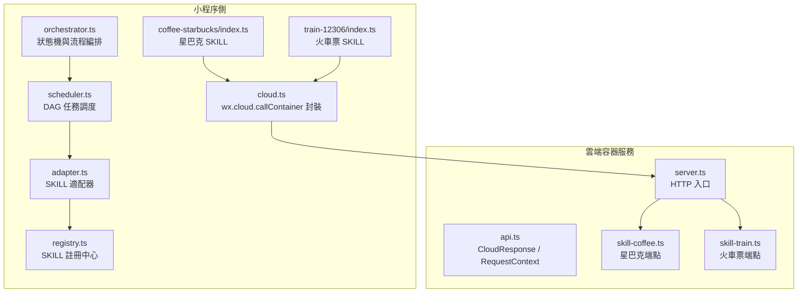
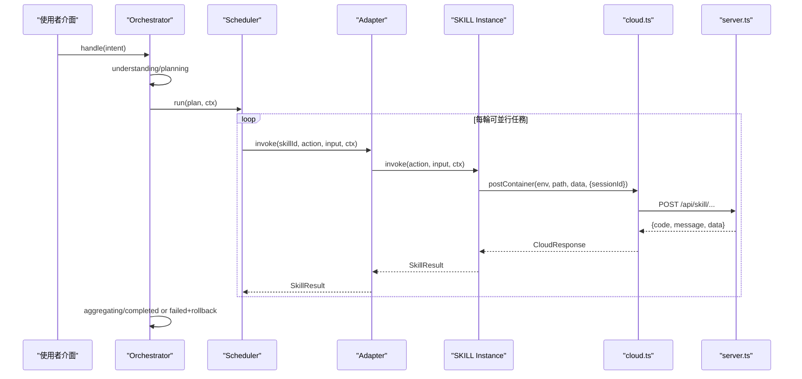
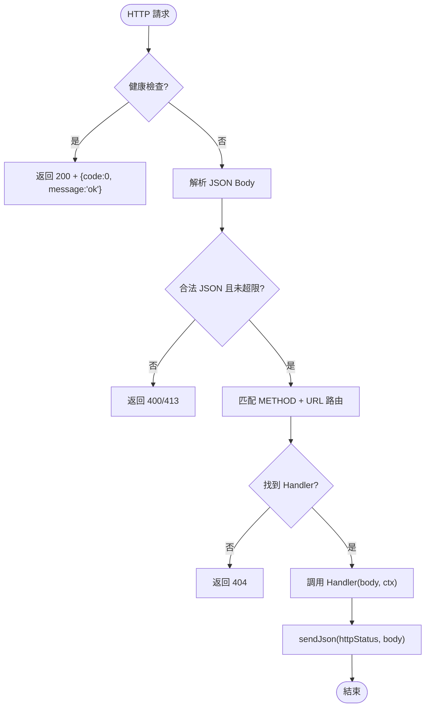
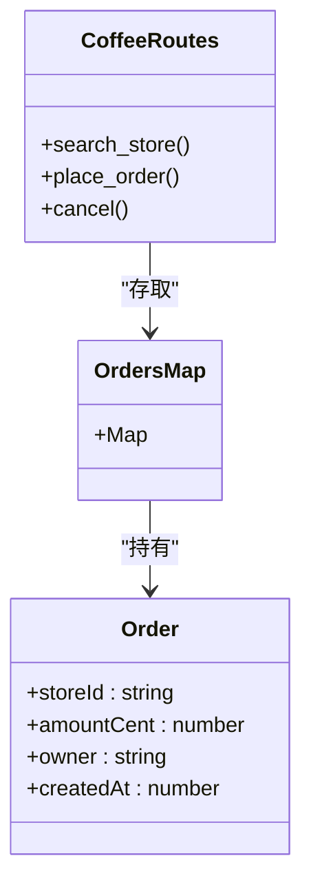
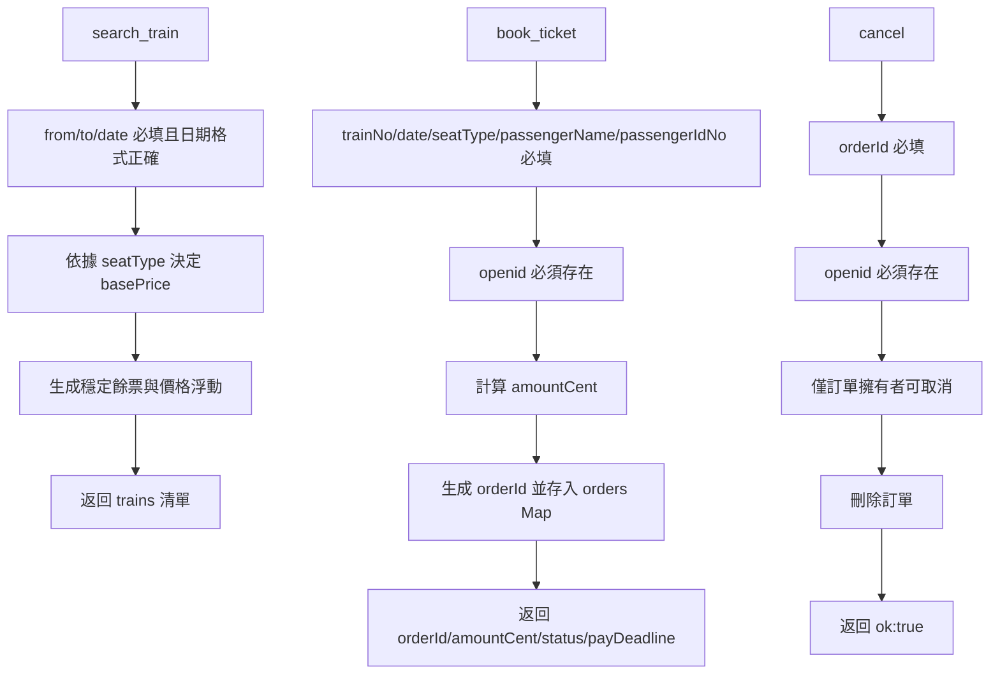
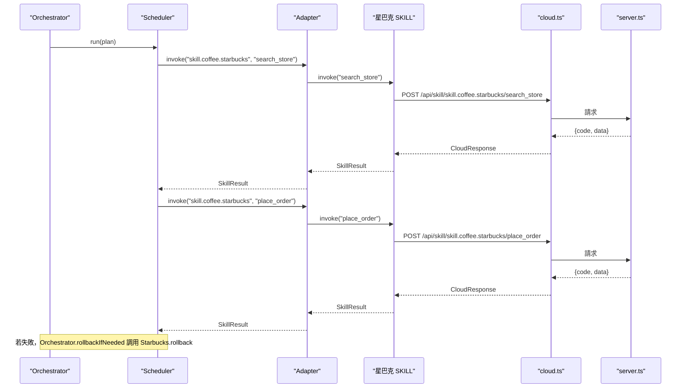
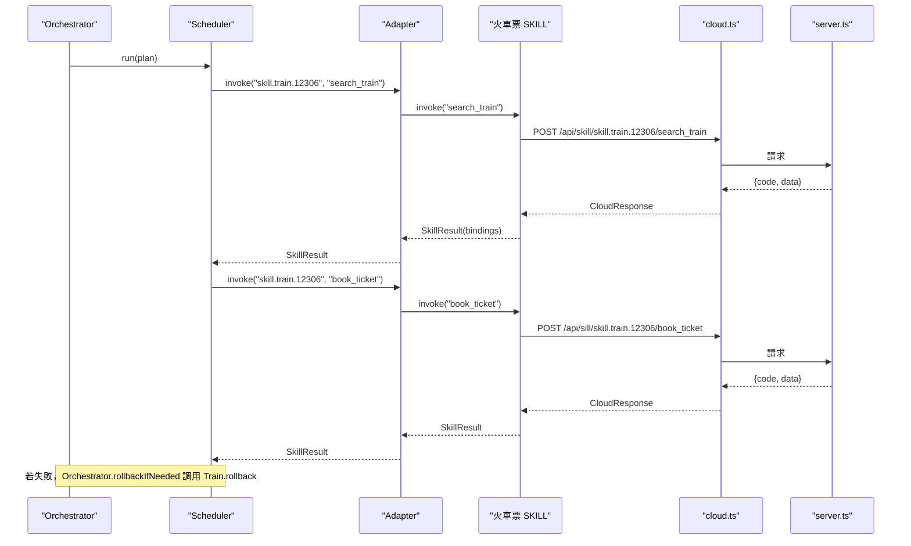
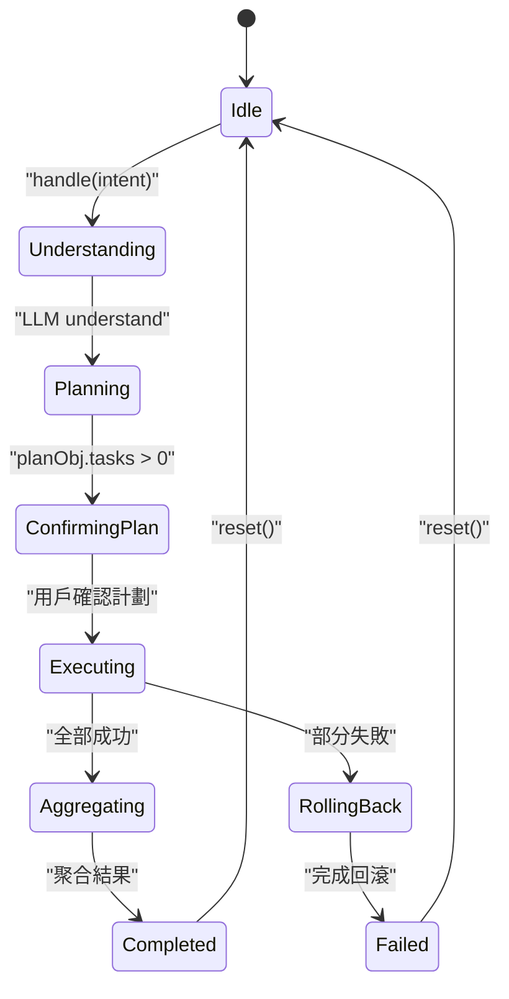
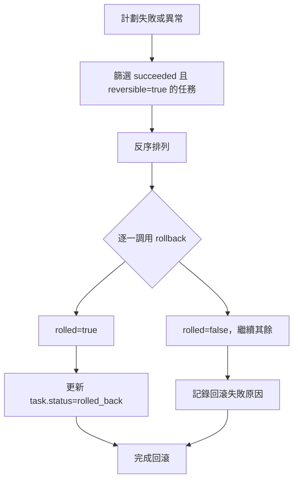
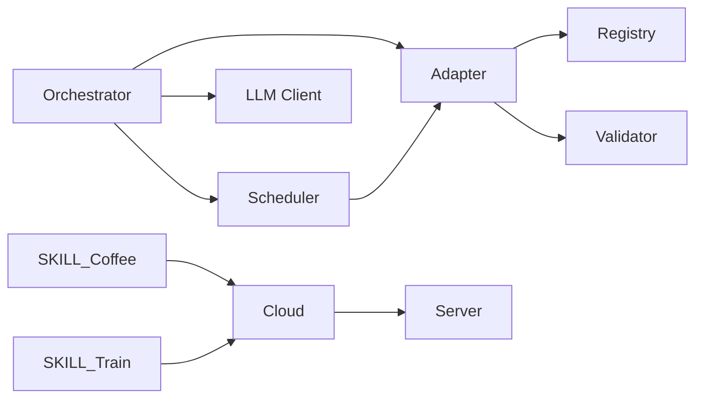

# SKILL 服務端點

<cite>
**本文引用的文件**   
- [server.ts](file://cloudrun/src/server.ts)
- [api.ts](file://cloudrun/src/api.ts)
- [skill-coffee.ts](file://cloudrun/src/skill-coffee.ts)
- [skill-train.ts](file://cloudrun/src/skill-train.ts)
- [package.json](file://cloudrun/package.json)
- [orchestrator.ts](file://miniprogram/src/core/orchestrator.ts)
- [scheduler.ts](file://miniprogram/src/core/scheduler.ts)
- [adapter.ts](file://miniprogram/src/skills/adapter.ts)
- [registry.ts](file://miniprogram/src/skills/registry.ts)
- [skill.d.ts](file://miniprogram/src/types/skill.d.ts)
- [context.d.ts](file://miniprogram/src/types/context.d.ts)
- [coffee-starbucks/index.ts](file://miniprogram/src/skills/builtin/coffee-starbucks/index.ts)
- [train-12306/index.ts](file://miniprogram/src/skills/builtin/train-12306/index.ts)
- [cloud.ts](file://miniprogram/src/services/cloud.ts)
</cite>

## 目錄
1. [引言](#引言)
2. [專案結構](#專案結構)
3. [核心元件](#核心元件)
4. [架構總覽](#架構總覽)
5. [詳細元件分析](#詳細元件分析)
6. [依賴關係分析](#依賴關係分析)
7. [效能考量](#效能考量)
8. [故障排除指南](#故障排除指南)
9. [結論](#結論)
10. [附錄：SKILL 開發指南](#附錄skill-開發指南)

## 引言
本文件聚焦於 WAIC-WeChat-MiniProgram 的 SKILL 服務端點，說明雲端容器服務與小程序側 SKILL 插件化架構、接口抽象與擴展機制。重點涵蓋星巴克咖啡 SKILL 與火車票 SKILL 的業務邏輯、SKILL 生命週期管理、事務與回滾策略、安全控制（身份驗證、歸屬權限、資料脫敏）、測試與調試方法，以及面向開發者的接口規範與最佳實踐。

## 專案結構
系統分為兩端：
- 雲端容器服務（Node.js）：提供 HTTP 路由、請求解析、健康檢查與統一回應格式。
- 小程序側：定義 SKILL 協議、註冊中心、適配器、調度器與編排器，並實作星巴克與火車票兩個內建 SKILL。

**圖表來源**
- [server.ts:13-27](file://cloudrun/src/server.ts#L13-L27)
- [api.ts:10-38](file://cloudrun/src/api.ts#L10-L38)
- [skill-coffee.ts:119-123](file://cloudrun/src/skill-coffee.ts#L119-L123)
- [skill-train.ts:143-147](file://cloudrun/src/skill-train.ts#L143-L147)
- [orchestrator.ts:73-89](file://miniprogram/src/core/orchestrator.ts#L73-L89)
- [scheduler.ts:76-128](file://miniprogram/src/core/scheduler.ts#L76-L128)
- [adapter.ts:36-85](file://miniprogram/src/skills/adapter.ts#L36-L85)
- [registry.ts:16-70](file://miniprogram/src/skills/registry.ts#L16-L70)
- [coffee-starbucks/index.ts:148-177](file://miniprogram/src/skills/builtin/coffee-starbucks/index.ts#L148-L177)
- [train-12306/index.ts:159-190](file://miniprogram/src/skills/builtin/train-12306/index.ts#L159-L190)
- [cloud.ts:64-149](file://miniprogram/src/services/cloud.ts#L64-L149)

**章節來源**
- [server.ts:1-129](file://cloudrun/src/server.ts#L1-L129)
- [orchestrator.ts:1-340](file://miniprogram/src/core/orchestrator.ts#L1-L340)

## 核心元件
- 雲端 HTTP 服務：負責監聽埠、JSON body 解析、健康檢查、路由分發與統一 JSON 回應。
- API 協議層：定義 CloudResponse、RequestContext、HandlerResult 與 RouteHandler，提供 ok/fail/badRequest/unauthorized/forbidden 等工具函數。
- SKILL 端點模組：星巴克與火車票各自暴露 routes 陣列，由 server.ts 合併為全局路由表。
- 小程序 SKILL 協議：SkillMeta、SkillCapability、SkillInstance、SkillResult、SkillError 等類型定義。
- SKILL 註冊中心：維護 skillId 到 SkillInstance 的映射，提供 list/listSlim/findCapability/get 等方法。
- SKILL 適配器：統一入參 schema 驗證、錯誤轉換、埋點與 rollback 調用。
- 調度器與編排器：DAG 調度與狀態機編排，支援人類確認、回滾、死鎖偵測與級聯跳過。
- 雲端呼叫封裝：統一 wx.cloud.callContainer 調用、超時、重試與開發環境降級。

**章節來源**
- [api.ts:10-64](file://cloudrun/src/api.ts#L10-L64)
- [skill-coffee.ts:1-124](file://cloudrun/src/skill-coffee.ts#L1-L124)
- [skill-train.ts:1-148](file://cloudrun/src/skill-train.ts#L1-L148)
- [skill.d.ts:16-119](file://miniprogram/src/types/skill.d.ts#L16-L119)
- [registry.ts:16-91](file://miniprogram/src/skills/registry.ts#L16-L91)
- [adapter.ts:1-115](file://miniprogram/src/skills/adapter.ts#L1-L115)
- [scheduler.ts:1-245](file://miniprogram/src/core/scheduler.ts#L1-L245)
- [orchestrator.ts:1-340](file://miniprogram/src/core/orchestrator.ts#L1-L340)
- [cloud.ts:1-223](file://miniprogram/src/services/cloud.ts#L1-L223)

## 架構總覽
整體流程從小程序側 Orchestrator 開始，經 LLM 規劃生成 Plan，再由 Scheduler 按 DAG 執行各 Task；Task 透過 adapter 調用已註冊的 SKILL；SKILL 內部再透過 cloud.ts 調用雲端容器的 HTTP 端點。

**圖表來源**
- [orchestrator.ts:106-256](file://miniprogram/src/core/orchestrator.ts#L106-L256)
- [scheduler.ts:76-128](file://miniprogram/src/core/scheduler.ts#L76-L128)
- [adapter.ts:36-85](file://miniprogram/src/skills/adapter.ts#L36-L85)
- [coffee-starbucks/index.ts:148-177](file://miniprogram/src/skills/builtin/coffee-starbucks/index.ts#L148-L177)
- [train-12306/index.ts:159-190](file://miniprogram/src/skills/builtin/train-12306/index.ts#L159-L190)
- [cloud.ts:64-149](file://miniprogram/src/services/cloud.ts#L64-L149)
- [server.ts:76-123](file://cloudrun/src/server.ts#L76-L123)

## 詳細元件分析

### 雲端容器服務與路由分發
- server.ts 使用 Node http 建立服務，讀取 PORT 環境變數，處理 GET / 與 /healthz 健康檢查。
- 路由表由各 handler 模組以 entries 形式貢獻，包含 LLM、火車票與星巴克端點。
- 請求體大小上限為 1MB，非法 JSON 或過大請求會返回明確錯誤碼。
- 統一將 openid 與 sessionId 從請求頭注入 RequestContext，供後續寫操作進行身份與歸屬鑒權。

**圖表來源**
- [server.ts:76-123](file://cloudrun/src/server.ts#L76-L123)

**章節來源**
- [server.ts:1-129](file://cloudrun/src/server.ts#L1-L129)
- [api.ts:10-64](file://cloudrun/src/api.ts#L10-L64)

### 星巴克咖啡 SKILL（雲端端點）
- 端點：
  - POST /api/skill/skill.coffee.starbucks/search_store
  - POST /api/skill/skill.coffee.starbucks/place_order
  - POST /api/skill/skill.coffee.starbucks/place_order/cancel
- 業務邏輯：
  - search_store：根據 city 與 limit 返回模擬門市清單。
  - place_order：校驗 storeId、pickupType、items；計算金額；生成 orderId；在記憶體 Map 中存單；需 openid 歸屬鑒權。
  - cancel：校驗 orderId 與 openid；僅訂單擁有者可取消；刪除訂單。
- 價格表：SKU → 單價（分），未列舉 SKU 使用預設價。
- 數據持久化：MVP 使用記憶體 Map，重啟丟失且不跨實例共享。

**圖表來源**
- [skill-coffee.ts:16-26](file://cloudrun/src/skill-coffee.ts#L16-L26)
- [skill-coffee.ts:33-46](file://cloudrun/src/skill-coffee.ts#L33-L46)
- [skill-coffee.ts:54-93](file://cloudrun/src/skill-coffee.ts#L54-L93)
- [skill-coffee.ts:99-117](file://cloudrun/src/skill-coffee.ts#L99-L117)

**章節來源**
- [skill-coffee.ts:1-124](file://cloudrun/src/skill-coffee.ts#L1-L124)

### 火車票 SKILL（雲端端點）
- 端點：
  - POST /api/skill/skill.train.12306/search_train
  - POST /api/skill/skill.train.12306/book_ticket
  - POST /api/skill/skill.train.12306/book_ticket/cancel
- 業務邏輯：
  - search_train：校驗 from/to/date；seatType 預設 second_class；生成穩定餘票與價格浮動；返回車次清單。
  - book_ticket：校驗 trainNo/date/seatType/passengerName/passengerIdNo；計算金額；生成 orderId；存單；需 openid 歸屬鑒權。
  - cancel：校驗 orderId 與 openid；僅訂單擁有者可取消；刪除訂單。
- 座位價格表：business/first_class/second_class/hard_seat。
- 數據持久化：MVP 使用記憶體 Map，重啟丟失且不跨實例共享。

**圖表來源**
- [skill-train.ts:46-77](file://cloudrun/src/skill-train.ts#L46-L77)
- [skill-train.ts:89-116](file://cloudrun/src/skill-train.ts#L89-L116)
- [skill-train.ts:122-141](file://cloudrun/src/skill-train.ts#L122-L141)

**章節來源**
- [skill-train.ts:1-148](file://cloudrun/src/skill-train.ts#L1-L148)

### 小程序側星巴克 SKILL
- 能力聲明：
  - search_store：冪等、無需人類確認。
  - place_order：非冪等、需要人類確認、可回滾。
- 實作：
  - invoke：根據 action 分派至 invokeSearch 或 invokePlace。
  - rollback：針對 place_order 調用雲端 cancel 端點。
  - 雲端不可用時返回 mock 數據，便於本地開發演示。
- bindings：search_store 結果可注入下游 place_order 的輸入綁定（如 storeName）。

**圖表來源**
- [coffee-starbucks/index.ts:148-177](file://miniprogram/src/skills/builtin/coffee-starbucks/index.ts#L148-L177)
- [coffee-starbucks/index.ts:179-227](file://miniprogram/src/skills/builtin/coffee-starbucks/index.ts#L179-L227)
- [cloud.ts:64-149](file://miniprogram/src/services/cloud.ts#L64-L149)
- [server.ts:76-123](file://cloudrun/src/server.ts#L76-L123)

**章節來源**
- [coffee-starbucks/index.ts:1-237](file://miniprogram/src/skills/builtin/coffee-starbucks/index.ts#L1-L237)

### 小程序側火車票 SKILL
- 能力聲明：
  - search_train：冪等、無需人類確認。
  - book_ticket：非冪等、需要人類確認、可回滾。
- 實作：
  - invoke：根據 action 分派至 invokeSearch 或 invokeBook。
  - rollback：針對 book_ticket 調用雲端 cancel 端點。
  - bindings：buildSearchBindings 將首趟車次的關鍵欄位放入 bindings，供下游書單引用。
  - 雲端不可用時返回 mock 數據。

**圖表來源**
- [train-12306/index.ts:159-190](file://miniprogram/src/skills/builtin/train-12306/index.ts#L159-L190)
- [train-12306/index.ts:192-276](file://miniprogram/src/skills/builtin/train-12306/index.ts#L192-L276)
- [cloud.ts:64-149](file://miniprogram/src/services/cloud.ts#L64-L149)
- [server.ts:76-123](file://cloudrun/src/server.ts#L76-L123)

**章節來源**
- [train-12306/index.ts:1-293](file://miniprogram/src/skills/builtin/train-12306/index.ts#L1-L293)

### SKILL 生命週期管理
- 註冊：SkillRegistry.register 將 SkillInstance.meta.id 作為 key 儲存，重複 id 拋錯。
- 初始化：小程序側通過 services/cloud.ensureCloudInit 初始化 wx.cloud.init（冪等保護）。
- 執行：Orchestrator.handle 進入 understanding/planning/confirming_plan/executing/aggregating/completed 狀態機；Scheduler.run 按 DAG 調度任務。
- 清理：Orchestrator.reset 重置狀態與 plan；Scheduler.abortRun 標記非終態任務為 skipped；Orchestrator.rollbackIfNeeded 反序撤銷已成功且可逆任務。

**圖表來源**
- [orchestrator.ts:60-71](file://miniprogram/src/core/orchestrator.ts#L60-L71)
- [orchestrator.ts:106-256](file://miniprogram/src/core/orchestrator.ts#L106-L256)
- [orchestrator.ts:258-303](file://miniprogram/src/core/orchestrator.ts#L258-L303)
- [scheduler.ts:76-128](file://miniprogram/src/core/scheduler.ts#L76-L128)

**章節來源**
- [registry.ts:16-70](file://miniprogram/src/skills/registry.ts#L16-L70)
- [cloud.ts:184-207](file://miniprogram/src/services/cloud.ts#L184-L207)
- [orchestrator.ts:106-303](file://miniprogram/src/core/orchestrator.ts#L106-L303)
- [scheduler.ts:76-128](file://miniprogram/src/core/scheduler.ts#L76-L128)

### 事務管理與回滾策略
- 可回滾能力：SkillCapability.reversible=true 的能力（如 place_order、book_ticket）需在 SkillInstance.rollback 實現回滾邏輯。
- 回滾觸發：Orchestrator.rollbackIfNeeded 在計劃失敗或異常時，按反序撤銷「已成功且可逆」的任務。
- 回滾實現：星巴克與火車票 SKILL 分別調用雲端 cancel 端點；若失敗則記錄錯誤並拋出異常，由上層處理。
- 一致性保證：MVP 使用記憶體 Map，不具備跨實例一致性；正式版應落庫並引入分布式事務或 Saga 模式。

**圖表來源**
- [orchestrator.ts:272-303](file://miniprogram/src/core/orchestrator.ts#L272-L303)
- [adapter.ts:87-107](file://miniprogram/src/skills/adapter.ts#L87-L107)
- [coffee-starbucks/index.ts:163-177](file://miniprogram/src/skills/builtin/coffee-starbucks/index.ts#L163-L177)
- [train-12306/index.ts:174-190](file://miniprogram/src/skills/builtin/train-12306/index.ts#L174-L190)

**章節來源**
- [orchestrator.ts:272-303](file://miniprogram/src/core/orchestrator.ts#L272-L303)
- [adapter.ts:87-107](file://miniprogram/src/skills/adapter.ts#L87-L107)

### 安全考慮
- 身份驗證：雲端端點要求寫操作攜帶 x-wx-openid；缺少時返回 unauthorized。
- 歸屬權限：取消訂單時僅訂單擁有者可操作，防止 IDOR（越權）。
- 資料脫敏：AgentContext.userProfile.history 僅保留語意摘要，避免敏感資訊持久化。
- 訪問控制：所有寫操作 requiresHumanConfirm=true，強制人類確認；Orchestrator 與 Scheduler 嚴格遵循此紅線。

**章節來源**
- [skill-coffee.ts:67-70](file://cloudrun/src/skill-coffee.ts#L67-L70)
- [skill-coffee.ts:104-113](file://cloudrun/src/skill-coffee.ts#L104-L113)
- [skill-train.ts:94-97](file://cloudrun/src/skill-train.ts#L94-L97)
- [skill-train.ts:127-137](file://cloudrun/src/skill-train.ts#L127-L137)
- [context.d.ts:19-25](file://miniprogram/src/types/context.d.ts#L19-L25)
- [skill.d.ts:51-58](file://miniprogram/src/types/skill.d.ts#L51-L58)

### 測試方法與調試技巧
- 單元測試：
  - 驗證 SKILL 入參 schema 校驗（adapter.validate）。
  - 驗證 SkillRegistry.register/unregister/get/list/listSlim。
  - 驗證 Orchestrator 狀態轉移與回滾邏輯。
- 集成測試：
  - 模擬雲端容器服務返回 code:-1（開發模式），驗證 SKILL mock 數據路徑。
  - 模擬雲端 5xx 網路錯誤，驗證 cloud.ts 重試與 CloudNetworkError。
- 性能測試：
  - 模擬大量 SKILL 並行調用，觀察 Scheduler 並行執行與死鎖偵測。
  - 模擬長尾 LLM 規劃與聚合，評估 Orchestrator 延遲。
- 調試技巧：
  - 使用 isDevEnv 判斷開發環境，允許降級與 mock。
  - 查看日誌：logInfo/logWarn/logError 輸出調用鏈與耗時。
  - 使用 runToken 防併發雙跑與交錯彈窗。

**章節來源**
- [adapter.ts:59-85](file://miniprogram/src/skills/adapter.ts#L59-L85)
- [registry.ts:16-70](file://miniprogram/src/skills/registry.ts#L16-L70)
- [orchestrator.ts:106-256](file://miniprogram/src/core/orchestrator.ts#L106-L256)
- [cloud.ts:151-182](file://miniprogram/src/services/cloud.ts#L151-L182)
- [scheduler.ts:95-114](file://miniprogram/src/core/scheduler.ts#L95-L114)

## 依賴關係分析
- 耦合性：
  - Orchestrator 依賴 Scheduler、LLM Client、Skills Adapter 與 Registry。
  - Scheduler 依賴 Skills Adapter 與 Binding Utils。
  - Skills Adapter 依賴 Registry 與 Validator。
  - SKILL 實作依賴 Services Cloud 與 Logger。
- 外部依賴：
  - 小程序側依賴 wx.cloud.callContainer（透過 cloud.ts 封裝）。
  - 雲端側僅使用 Node 內建模組（零運行時依賴）。

**圖表來源**
- [orchestrator.ts:13-25](file://miniprogram/src/core/orchestrator.ts#L13-L25)
- [scheduler.ts:18-25](file://miniprogram/src/core/scheduler.ts#L18-L25)
- [adapter.ts:13-17](file://miniprogram/src/skills/adapter.ts#L13-L17)
- [coffee-starbucks/index.ts:11-14](file://miniprogram/src/skills/builtin/coffee-starbucks/index.ts#L11-L14)
- [train-12306/index.ts:13-16](file://miniprogram/src/skills/builtin/train-12306/index.ts#L13-L16)
- [cloud.ts:1-14](file://miniprogram/src/services/cloud.ts#L1-L14)
- [server.ts:13-17](file://cloudrun/src/server.ts#L13-L17)

**章節來源**
- [orchestrator.ts:1-340](file://miniprogram/src/core/orchestrator.ts#L1-L340)
- [scheduler.ts:1-245](file://miniprogram/src/core/scheduler.ts#L1-L245)
- [adapter.ts:1-115](file://miniprogram/src/skills/adapter.ts#L1-L115)
- [coffee-starbucks/index.ts:1-237](file://miniprogram/src/skills/builtin/coffee-starbucks/index.ts#L1-L237)
- [train-12306/index.ts:1-293](file://miniprogram/src/skills/builtin/train-12306/index.ts#L1-L293)
- [cloud.ts:1-223](file://miniprogram/src/services/cloud.ts#L1-L223)
- [server.ts:1-129](file://cloudrun/src/server.ts#L1-L129)

## 效能考量
- 並行執行：Scheduler 使用 Promise.allSettled 並行執行 ready 任務，提升吞吐。
- 重試策略：cloud.ts 對網路錯誤進行最多 3 次重試，指數退避（baseDelayMs=600）。
- 超時控制：每次雲端呼叫獨立計時，避免長尾阻塞。
- 開發環境降級：isDevEnv 允許 code:-1 降級，便於本地演示與測試。
- 日誌與追蹤：trace.skillCalls、totalTokens 用於監控與優化。

[無章節來源，因為此節提供一般性指導]

## 故障排除指南
- 常見錯誤：
  - INVALID_JSON：請求體非合法 JSON。
  - PAYLOAD_TOO_LARGE：請求體超過 1MB。
  - CAPABILITY_NOT_FOUND：SKILL 未支援該 action。
  - SKILL_NOT_FOUND：SKILL 未註冊。
  - DEADLOCK：任務死鎖（pending 但無人可執行）。
- 診斷步驟：
  - 檢查請求頭是否包含 x-wx-openid 與 x-micromate-session。
  - 查看 Orchestrator 狀態是否處於 BUSY。
  - 檢查 SKILL 入參是否符合 Schema。
  - 查看雲端返回 code 與 message，判斷業務失敗或網路錯誤。
  - 使用 isDevEnv 切換開發模式，驗證 mock 路徑。

**章節來源**
- [server.ts:105-123](file://cloudrun/src/server.ts#L105-L123)
- [adapter.ts:44-85](file://miniprogram/src/skills/adapter.ts#L44-L85)
- [scheduler.ts:102-114](file://miniprogram/src/core/scheduler.ts#L102-L114)
- [cloud.ts:105-119](file://miniprogram/src/services/cloud.ts#L105-L119)

## 結論
本文件系統性地說明了 WAIC-WeChat-MiniProgram 的 SKILL 服務端點架構與實作細節，涵蓋雲端容器服務、小程序側 SKILL 插件化設計、星巴克與火車票 SKILL 的業務邏輯、生命週期管理、事務與回滾策略、安全控制、測試與調試方法。建議在正式版中引入持久化與分布式事務，以提升一致性与可用性。

[無章節來源，因為此節總結而不分析具體文件]

## 附錄：SKILL 開發指南
- 接口規範：
  - 定義 SkillMeta 與 capabilities，清楚描述能做什麼、不能做什麼、何時觸發。
  - 每個 capability 需提供 inputSchema 與 outputSchema，並標註 idempotent、reversible、requiresHumanConfirm、estimatedLatencyMs。
- 數據模型：
  - 使用 TypeScript 介面定義輸入輸出結構，確保類型安全。
  - 使用 JSON Schema 進行入參校驗。
- 業務規則：
  - 所有寫操作必須 requiresHumanConfirm=true。
  - 可回滾能力必須實現 rollback。
  - 寫操作需進行身份與歸屬權限驗證。
- 擴展機制：
  - 新增 SKILL 時，實作 SkillInstance 並通過 SkillRegistry.register 註冊。
  - 在 skills/builtin 下新增目錄與 index.ts，遵循既有 SKILL 結構。
- 最佳實踐：
  - 使用 services/cloud 統一封裝雲端呼叫，禁止直接 import 'wx.*'。
  - 使用 logger 記錄調用鏈與錯誤。
  - 使用 isDevEnv 與 mock 數據便於本地開發。

**章節來源**
- [skill.d.ts:16-119](file://miniprogram/src/types/skill.d.ts#L16-L119)
- [registry.ts:16-70](file://miniprogram/src/skills/registry.ts#L16-L70)
- [coffee-starbucks/index.ts:58-146](file://miniprogram/src/skills/builtin/coffee-starbucks/index.ts#L58-L146)
- [train-12306/index.ts:69-157](file://miniprogram/src/skills/builtin/train-12306/index.ts#L69-L157)
- [cloud.ts:1-14](file://miniprogram/src/services/cloud.ts#L1-L14)