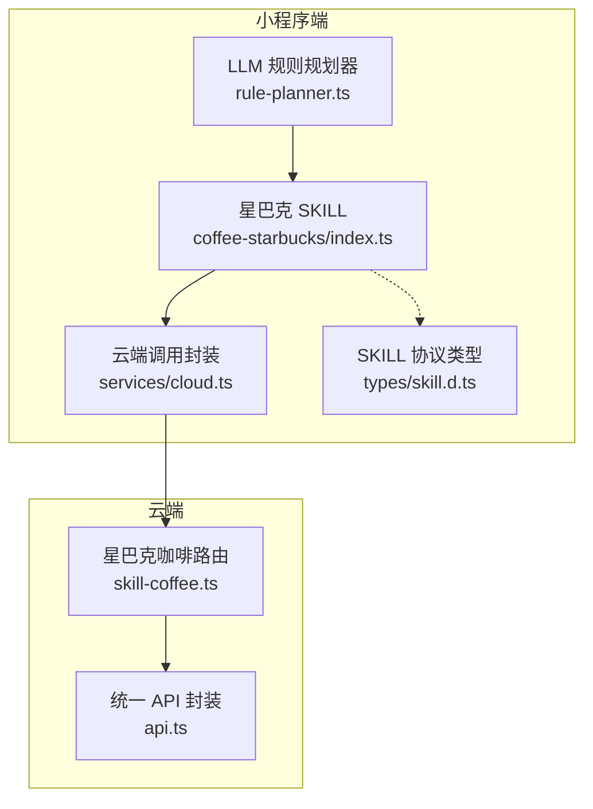
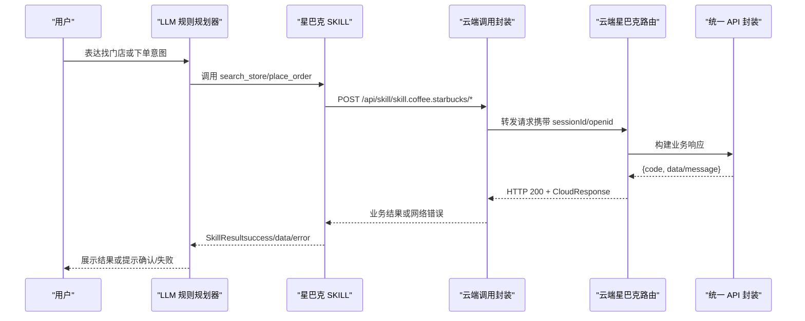
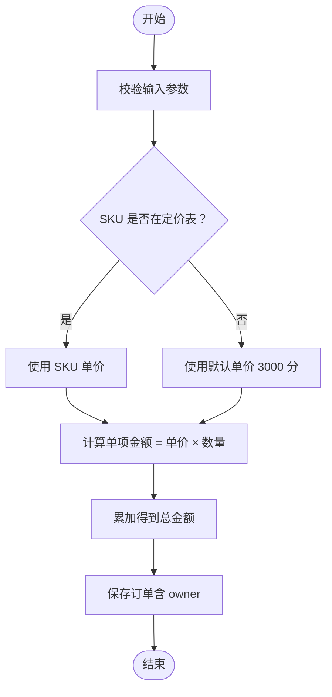
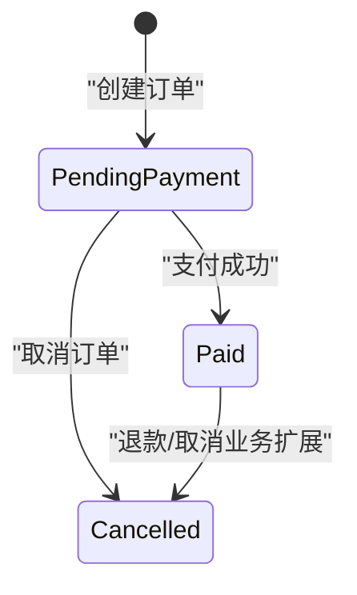
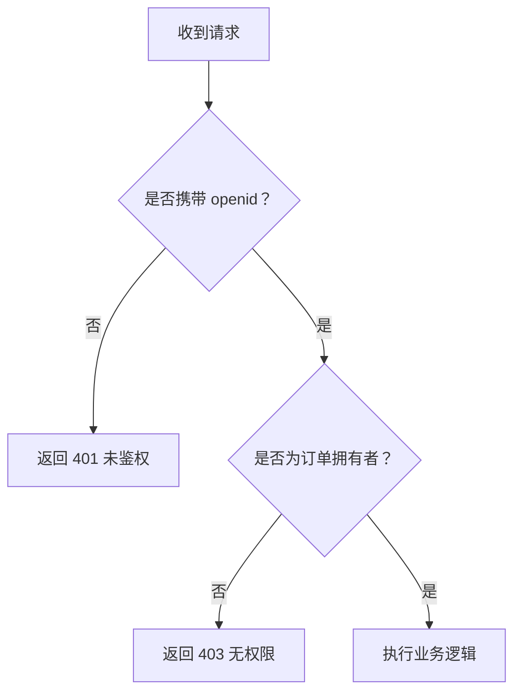
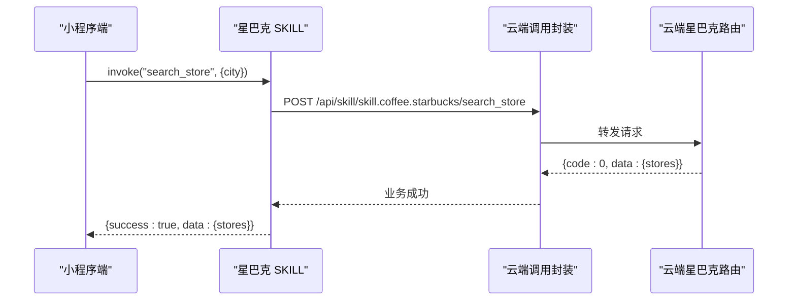
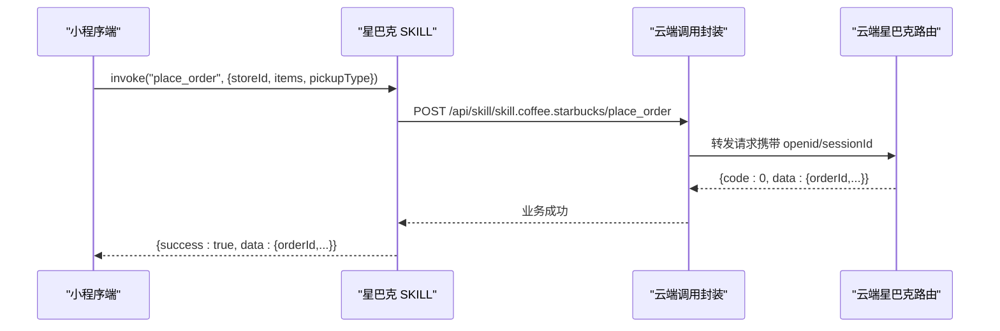
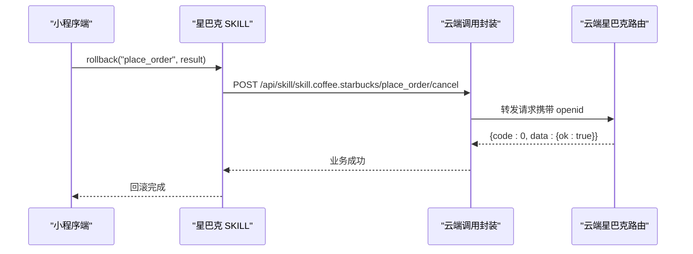
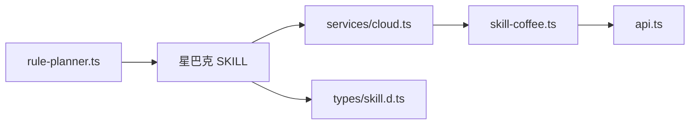

# 星巴克咖啡SKILL

<cite>
**本文引用的文件**   
- [miniprogram/src/skills/builtin/coffee-starbucks/index.ts](file://miniprogram/src/skills/builtin/coffee-starbucks/index.ts)
- [cloudrun/src/skill-coffee.ts](file://cloudrun/src/skill-coffee.ts)
- [miniprogram/src/services/cloud.ts](file://miniprogram/src/services/cloud.ts)
- [cloudrun/src/api.ts](file://cloudrun/src/api.ts)
- [miniprogram/src/llm/rule-planner.ts](file://miniprogram/src/llm/rule-planner.ts)
- [miniprogram/src/types/skill.d.ts](file://miniprogram/src/types/skill.d.ts)
</cite>

## 目录
1. [简介](#简介)
2. [项目结构](#项目结构)
3. [核心组件](#核心组件)
4. [架构总览](#架构总览)
5. [详细组件分析](#详细组件分析)
6. [依赖关系分析](#依赖关系分析)
7. [性能与扩展性](#性能与扩展性)
8. [故障排查指南](#故障排查指南)
9. [结论](#结论)

## 简介
本技术文档围绕“星巴克咖啡 SKILL”展开，说明其业务目标、能力边界、API 接口、SKU 价格体系、订单数据结构与安全机制，并提供调用示例与排错建议。该 SKILL 提供两项核心能力：
- 查询附近门店（search_store）
- 创建订单（place_order），并支持回滚取消（place_order/cancel）

小程序端通过 SKILL 协议封装调用云端容器 API；云端以内存 Map 模拟订单存储，实现 MVP 演示。

## 项目结构
星巴克咖啡 SKILL 涉及小程序端与云端两部分：
- 小程序端
  - SKILL 定义与调用：miniprogram/src/skills/builtin/coffee-starbucks/index.ts
  - 云端调用封装：miniprogram/src/services/cloud.ts
  - LLM 规则规划器注入下单任务：miniprogram/src/llm/rule-planner.ts
  - SKILL 协议类型：miniprogram/src/types/skill.d.ts
- 云端
  - 星巴克咖啡路由与业务逻辑：cloudrun/src/skill-coffee.ts
  - 统一 API 响应封装：cloudrun/src/api.ts

**图表来源**
- [miniprogram/src/skills/builtin/coffee-starbucks/index.ts:1-237](file://miniprogram/src/skills/builtin/coffee-starbucks/index.ts#L1-L237)
- [miniprogram/src/services/cloud.ts:1-223](file://miniprogram/src/services/cloud.ts#L1-L223)
- [miniprogram/src/llm/rule-planner.ts:137-164](file://miniprogram/src/llm/rule-planner.ts#L137-L164)
- [cloudrun/src/skill-coffee.ts:1-124](file://cloudrun/src/skill-coffee.ts#L1-L124)
- [cloudrun/src/api.ts:1-64](file://cloudrun/src/api.ts#L1-L64)

**章节来源**
- [miniprogram/src/skills/builtin/coffee-starbucks/index.ts:1-237](file://miniprogram/src/skills/builtin/coffee-starbucks/index.ts#L1-L237)
- [cloudrun/src/skill-coffee.ts:1-124](file://cloudrun/src/skill-coffee.ts#L1-L124)
- [miniprogram/src/services/cloud.ts:1-223](file://miniprogram/src/services/cloud.ts#L1-L223)
- [cloudrun/src/api.ts:1-64](file://cloudrun/src/api.ts#L1-L64)
- [miniprogram/src/llm/rule-planner.ts:137-164](file://miniprogram/src/llm/rule-planner.ts#L137-L164)
- [miniprogram/src/types/skill.d.ts:1-119](file://miniprogram/src/types/skill.d.ts#L1-L119)

## 核心组件
- 星巴克 SKILL（小程序端）
  - 暴露 meta 与 instance，声明两个能力：search_store、place_order
  - invoke 分发到具体处理函数，rollback 调用取消接口
  - 对云端返回 code=0 视为成功，code=-1 走本地 mock 降级
- 云端星巴克路由
  - 提供三个 POST 端点：search_store、place_order、place_order/cancel
  - SKU 定价表 + 默认单价，计算订单金额
  - 内存 Map 存储订单，包含 owner 字段用于鉴权
- 云端调用封装
  - 统一超时、重试、错误归一化
  - 开发环境将不可用场景降级为 code:-1，便于本地演示
- LLM 规则规划器
  - 根据用户意图生成星巴克下单任务，自动绑定门店 ID

**章节来源**
- [miniprogram/src/skills/builtin/coffee-starbucks/index.ts:58-177](file://miniprogram/src/skills/builtin/coffee-starbucks/index.ts#L58-L177)
- [cloudrun/src/skill-coffee.ts:16-93](file://cloudrun/src/skill-coffee.ts#L16-L93)
- [miniprogram/src/services/cloud.ts:64-149](file://miniprogram/src/services/cloud.ts#L64-L149)
- [miniprogram/src/llm/rule-planner.ts:137-164](file://miniprogram/src/llm/rule-planner.ts#L137-L164)

## 架构总览
小程序端通过 SKILL 协议调用云端容器 API，云端按路由分发给星巴克咖啡处理器，返回标准 CloudResponse。

**图表来源**
- [miniprogram/src/llm/rule-planner.ts:137-164](file://miniprogram/src/llm/rule-planner.ts#L137-L164)
- [miniprogram/src/skills/builtin/coffee-starbucks/index.ts:148-177](file://miniprogram/src/skills/builtin/coffee-starbucks/index.ts#L148-L177)
- [miniprogram/src/services/cloud.ts:64-149](file://miniprogram/src/services/cloud.ts#L64-L149)
- [cloudrun/src/skill-coffee.ts:119-123](file://cloudrun/src/skill-coffee.ts#L119-L123)
- [cloudrun/src/api.ts:40-63](file://cloudrun/src/api.ts#L40-L63)

## 详细组件分析

### 接口定义与行为语义
- search_store
  - 幂等：是
  - 可回滚：否
  - 需人工确认：否
  - 预估延迟：约 1000ms
- place_order
  - 幂等：否
  - 可回滚：是
  - 需人工确认：是
  - 预估延迟：约 1500ms

上述语义由 SKILL 元信息 capabilities 声明，供 LLM 规划与调度使用。

**章节来源**
- [miniprogram/src/skills/builtin/coffee-starbucks/index.ts:68-145](file://miniprogram/src/skills/builtin/coffee-starbucks/index.ts#L68-L145)
- [miniprogram/src/types/skill.d.ts:37-58](file://miniprogram/src/types/skill.d.ts#L37-L58)

### API 接口规范

#### 查询附近门店 search_store
- 方法：POST
- 路径：/api/skill/skill.coffee.starbucks/search_store
- 请求体
  - city：必填，字符串
  - lat：可选，数字（用户纬度）
  - lng：可选，数字
  - limit：可选，整数，范围 1~20
- 响应体
  - stores：数组，元素包含 storeId、name、address、distanceM、openNow
- 业务逻辑
  - 校验 city 必填
  - 限制 limit 在合理范围内
  - 返回固定模拟门店列表

**章节来源**
- [miniprogram/src/skills/builtin/coffee-starbucks/index.ts:16-33](file://miniprogram/src/skills/builtin/coffee-starbucks/index.ts#L16-L33)
- [cloudrun/src/skill-coffee.ts:28-46](file://cloudrun/src/skill-coffee.ts#L28-L46)

#### 创建订单 place_order
- 方法：POST
- 路径：/api/skill/skill.coffee.starbucks/place_order
- 请求体
  - storeId：必填，字符串
  - pickupType：必填，枚举 in_store 或 takeaway
  - items：必填，数组，每项含 sku、quantity（≥1）、name（可选）、size（可选）
- 响应体
  - orderId：字符串
  - storeId：字符串
  - items：数组，每项含 sku、name、quantity、amountCent
  - amountCent：整数（单位：分）
  - status：pending_payment 或 paid
- 业务逻辑
  - 校验必填项与数量合法性
  - 校验 pickupType 枚举值
  - 校验每个 item 的 sku 与 quantity
  - 鉴权：必须携带 openid，否则拒绝
  - 计算单价与总价，写入内存订单表

**章节来源**
- [miniprogram/src/skills/builtin/coffee-starbucks/index.ts:35-56](file://miniprogram/src/skills/builtin/coffee-starbucks/index.ts#L35-L56)
- [cloudrun/src/skill-coffee.ts:48-93](file://cloudrun/src/skill-coffee.ts#L48-L93)

#### 取消订单 place_order/cancel
- 方法：POST
- 路径：/api/skill/skill.coffee.starbucks/place_order/cancel
- 请求体
  - orderId：必填，字符串
- 响应体
  - ok：布尔
  - orderId：字符串
- 业务逻辑
  - 校验 orderId 必填
  - 鉴权：必须携带 openid
  - 查找订单，不存在则返回 404
  - 归属鉴权：仅订单拥有者可取消
  - 删除订单记录

**章节来源**
- [cloudrun/src/skill-coffee.ts:95-117](file://cloudrun/src/skill-coffee.ts#L95-L117)

### SKU 价格体系与默认价格处理
- SKU 单价（单位：分）
  - latte：3300
  - americano：2700
  - cappuccino：3200
  - caramel_macchiato：3800
- 未列出的 SKU 采用默认单价：3000 分
- 订单金额计算
  - 单项金额 = 单价 × 数量
  - 总金额 = 所有单项金额之和

**图表来源**
- [cloudrun/src/skill-coffee.ts:16-23](file://cloudrun/src/skill-coffee.ts#L16-L23)
- [cloudrun/src/skill-coffee.ts:72-84](file://cloudrun/src/skill-coffee.ts#L72-L84)

**章节来源**
- [cloudrun/src/skill-coffee.ts:16-23](file://cloudrun/src/skill-coffee.ts#L16-L23)
- [cloudrun/src/skill-coffee.ts:72-84](file://cloudrun/src/skill-coffee.ts#L72-L84)

### 订单管理系统数据结构
- 内存订单表键：orderId
- 订单值
  - storeId：门店标识
  - amountCent：订单总金额（分）
  - owner：订单拥有者（openid）
  - createdAt：创建时间戳
- 状态流转
  - 创建后初始状态：pending_payment
  - 支付成功后状态：paid（当前 SDK 返回 pending_payment，支付流程由外部集成）
- 用户归属验证
  - 写操作（下单）必须携带 openid
  - 取消操作需比对 order.owner 与 ctx.openid，不一致则拒绝

**图表来源**
- [cloudrun/src/skill-coffee.ts:25-26](file://cloudrun/src/skill-coffee.ts#L25-L26)
- [cloudrun/src/skill-coffee.ts:83-92](file://cloudrun/src/skill-coffee.ts#L83-L92)
- [cloudrun/src/skill-coffee.ts:107-116](file://cloudrun/src/skill-coffee.ts#L107-L116)

**章节来源**
- [cloudrun/src/skill-coffee.ts:25-26](file://cloudrun/src/skill-coffee.ts#L25-L26)
- [cloudrun/src/skill-coffee.ts:83-92](file://cloudrun/src/skill-coffee.ts#L83-L92)
- [cloudrun/src/skill-coffee.ts:107-116](file://cloudrun/src/skill-coffee.ts#L107-L116)

### 安全机制
- 用户身份验证
  - 云端从请求头 x-wx-openid 获取 openid
  - 写操作（下单、取消）强制要求 openid，缺失即拒绝
- 权限控制与防越权访问
  - 取消订单时比较 order.owner 与 ctx.openid，防止 IDOR（跨资源越权）
- 会话关联
  - 小程序端通过 header x-micromate-session 传递 sessionId，便于链路追踪

**图表来源**
- [cloudrun/src/skill-coffee.ts:67-70](file://cloudrun/src/skill-coffee.ts#L67-L70)
- [cloudrun/src/skill-coffee.ts:104-113](file://cloudrun/src/skill-coffee.ts#L104-L113)
- [cloudrun/src/api.ts:55-63](file://cloudrun/src/api.ts#L55-L63)
- [miniprogram/src/services/cloud.ts:70-74](file://miniprogram/src/services/cloud.ts#L70-L74)

**章节来源**
- [cloudrun/src/skill-coffee.ts:67-70](file://cloudrun/src/skill-coffee.ts#L67-L70)
- [cloudrun/src/skill-coffee.ts:104-113](file://cloudrun/src/skill-coffee.ts#L104-L113)
- [cloudrun/src/api.ts:55-63](file://cloudrun/src/api.ts#L55-L63)
- [miniprogram/src/services/cloud.ts:70-74](file://miniprogram/src/services/cloud.ts#L70-L74)

### 调用示例与错误处理

#### 查询附近门店
- 成功响应
  - HTTP 200
  - body.code = 0
  - body.data.stores 为门店数组
- 常见错误
  - 缺少 city：HTTP 400，body.code = 400
  - 网络异常：小程序端重试或降级为本地 mock

**图表来源**
- [miniprogram/src/skills/builtin/coffee-starbucks/index.ts:179-196](file://miniprogram/src/skills/builtin/coffee-starbucks/index.ts#L179-L196)
- [cloudrun/src/skill-coffee.ts:33-46](file://cloudrun/src/skill-coffee.ts#L33-L46)
- [miniprogram/src/services/cloud.ts:64-149](file://miniprogram/src/services/cloud.ts#L64-L149)

#### 创建订单
- 成功响应
  - HTTP 200
  - body.code = 0
  - body.data 包含 orderId、storeId、items、amountCent、status
- 常见错误
  - 参数缺失或非法：HTTP 400
  - 缺少 openid：HTTP 401
  - 网络异常：小程序端重试或降级为本地 mock

**图表来源**
- [miniprogram/src/skills/builtin/coffee-starbucks/index.ts:198-227](file://miniprogram/src/skills/builtin/coffee-starbucks/index.ts#L198-L227)
- [cloudrun/src/skill-coffee.ts:54-93](file://cloudrun/src/skill-coffee.ts#L54-L93)
- [miniprogram/src/services/cloud.ts:64-149](file://miniprogram/src/services/cloud.ts#L64-L149)

#### 取消订单
- 成功响应
  - HTTP 200
  - body.code = 0
  - body.data.ok = true
- 常见错误
  - 缺少 orderId：HTTP 400
  - 缺少 openid：HTTP 401
  - 订单不存在：HTTP 200，body.code = 404
  - 非订单拥有者：HTTP 403

**图表来源**
- [miniprogram/src/skills/builtin/coffee-starbucks/index.ts:163-176](file://miniprogram/src/skills/builtin/coffee-starbucks/index.ts#L163-L176)
- [cloudrun/src/skill-coffee.ts:99-117](file://cloudrun/src/skill-coffee.ts#L99-L117)
- [miniprogram/src/services/cloud.ts:64-149](file://miniprogram/src/services/cloud.ts#L64-L149)

## 依赖关系分析
- 小程序端
  - SKILL 依赖 services/cloud.ts 进行云端调用
  - SKILL 依赖 types/skill.d.ts 的协议类型
  - LLM 规则规划器生成星巴克下单任务，注入 storeId 绑定
- 云端
  - skill-coffee.ts 依赖 api.ts 的统一响应封装
  - 云端通过 RequestContext 获取 openid 与 sessionId

**图表来源**
- [miniprogram/src/skills/builtin/coffee-starbucks/index.ts:11-14](file://miniprogram/src/skills/builtin/coffee-starbucks/index.ts#L11-L14)
- [miniprogram/src/services/cloud.ts:1-223](file://miniprogram/src/services/cloud.ts#L1-L223)
- [miniprogram/src/types/skill.d.ts:1-119](file://miniprogram/src/types/skill.d.ts#L1-L119)
- [miniprogram/src/llm/rule-planner.ts:137-164](file://miniprogram/src/llm/rule-planner.ts#L137-L164)
- [cloudrun/src/skill-coffee.ts:13-14](file://cloudrun/src/skill-coffee.ts#L13-L14)
- [cloudrun/src/api.ts:1-64](file://cloudrun/src/api.ts#L1-L64)

**章节来源**
- [miniprogram/src/skills/builtin/coffee-starbucks/index.ts:11-14](file://miniprogram/src/skills/builtin/coffee-starbucks/index.ts#L11-L14)
- [miniprogram/src/services/cloud.ts:1-223](file://miniprogram/src/services/cloud.ts#L1-L223)
- [miniprogram/src/types/skill.d.ts:1-119](file://miniprogram/src/types/skill.d.ts#L1-L119)
- [miniprogram/src/llm/rule-planner.ts:137-164](file://miniprogram/src/llm/rule-planner.ts#L137-L164)
- [cloudrun/src/skill-coffee.ts:13-14](file://cloudrun/src/skill-coffee.ts#L13-L14)
- [cloudrun/src/api.ts:1-64](file://cloudrun/src/api.ts#L1-L64)

## 性能与扩展性
- 性能优化建议
  - 云端订单存储从内存 Map 迁移至持久化数据库，避免重启丢失与实例间不共享问题
  - 引入缓存层（如 Redis）缓存门店列表与 SKU 价格表，降低重复查询开销
  - 对高频接口增加限流与熔断策略，保护后端服务
  - 前端调用封装已内置超时与重试，可根据业务调整重试次数与退避策略
- 扩展性考虑
  - SKU 价格表可扩展为配置中心或数据库表，支持动态调价与区域差异化定价
  - 订单状态机可扩展支付、退款、取货等状态，配合事件驱动架构
  - 鉴权机制可扩展角色权限与多租户隔离
  - SKILL 协议支持更多能力声明，便于接入其他品牌或品类

[本节为通用指导，不直接分析具体文件]

## 故障排查指南
- 常见问题
  - 云端不可用（开发环境）：小程序端 callContainer 返回 code:-1，SKILL 走本地 mock 降级
  - 参数校验失败：检查 city、storeId、pickupType、items 结构与取值范围
  - 鉴权失败：确保请求头携带 x-wx-openid
  - 越权取消：确认调用方 openid 与订单 owner 一致
- 日志与诊断
  - 小程序端：关注 cloud.ts 的重试与超时日志
  - 云端：关注 api.ts 的错误封装与 handler 返回码

**章节来源**
- [miniprogram/src/services/cloud.ts:105-118](file://miniprogram/src/services/cloud.ts#L105-L118)
- [miniprogram/src/services/cloud.ts:127-149](file://miniprogram/src/services/cloud.ts#L127-L149)
- [cloudrun/src/api.ts:40-63](file://cloudrun/src/api.ts#L40-L63)

## 结论
星巴克咖啡 SKILL 通过小程序端与云端的协同，实现了门店查询与订单创建的核心业务流程。SKU 价格体系清晰，订单数据模型简洁，安全机制完善。当前 MVP 使用内存存储，后续应引入持久化与缓存以提升稳定性与性能。SKILL 协议与统一 API 封装为扩展更多业务能力提供了良好基础。