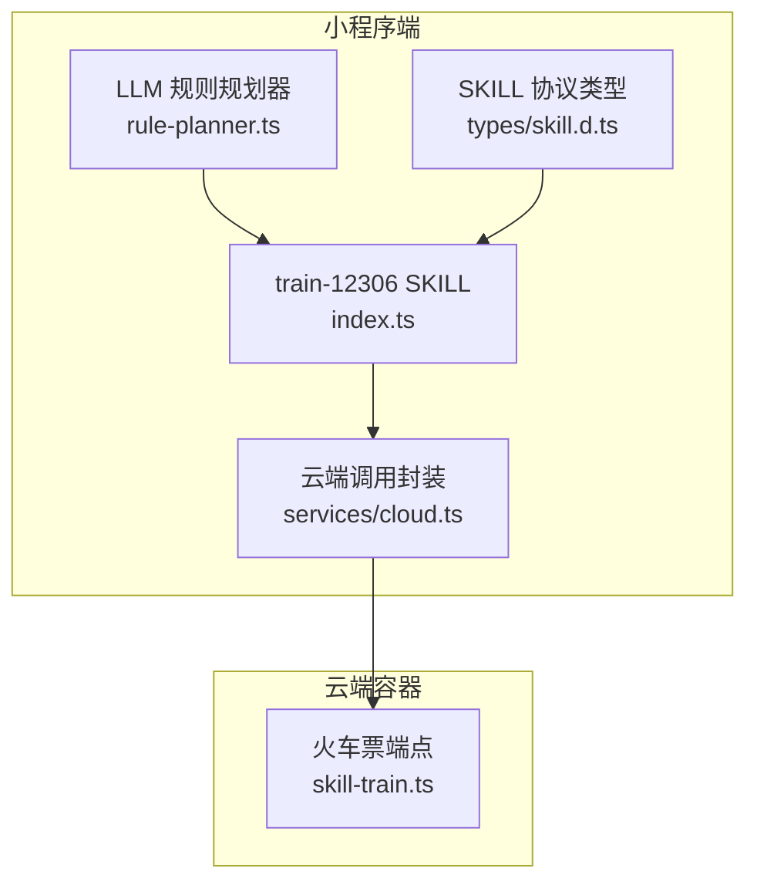
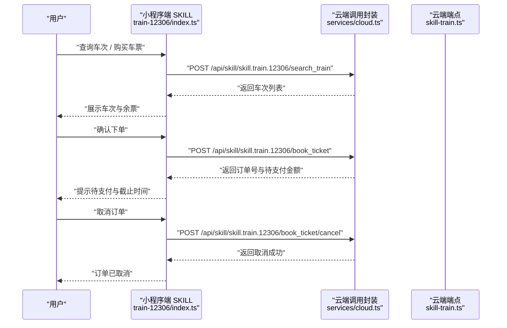
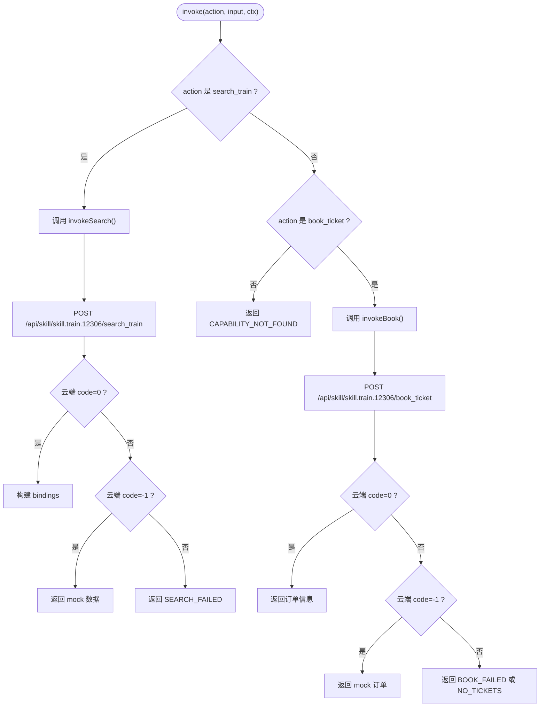
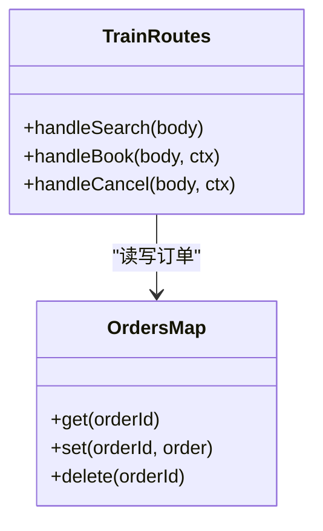
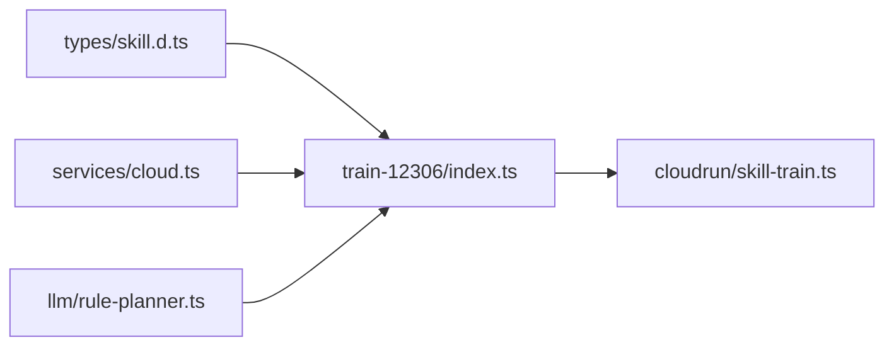
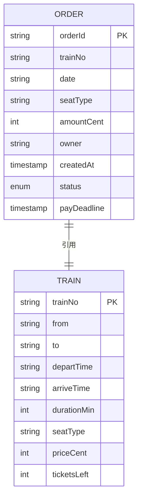
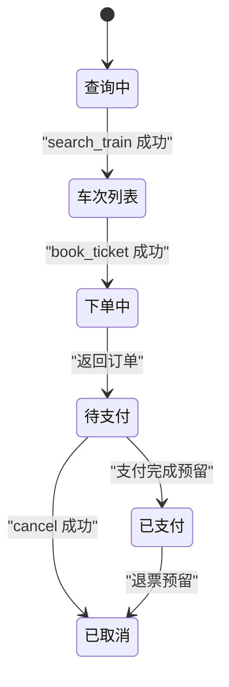

# 火车票预订SKILL

<cite>
**本文引用的文件**   
- [miniprogram/src/skills/builtin/train-12306/index.ts](file://miniprogram/src/skills/builtin/train-12306/index.ts)
- [cloudrun/src/skill-train.ts](file://cloudrun/src/skill-train.ts)
- [miniprogram/src/services/cloud.ts](file://miniprogram/src/services/cloud.ts)
- [miniprogram/src/types/skill.d.ts](file://miniprogram/src/types/skill.d.ts)
- [miniprogram/src/llm/rule-planner.ts](file://miniprogram/src/llm/rule-planner.ts)
</cite>

## 目录
1. [简介](#简介)
2. [项目结构](#项目结构)
3. [核心组件](#核心组件)
4. [架构总览](#架构总览)
5. [详细组件分析](#详细组件分析)
6. [依赖关系分析](#依赖关系分析)
7. [性能与并发控制](#性能与并发控制)
8. [数据模型与状态机](#数据模型与状态机)
9. [API 接口规范](#api-接口规范)
10. [调用示例与异常处理](#调用示例与异常处理)
11. [持久化与缓存优化](#持久化与缓存优化)
12. [故障排查指南](#故障排查指南)
13. [结论](#结论)

## 简介
本技术文档围绕“火车票预订 SKILL”展开，覆盖车次查询、座位选择、票务下单与取消等核心能力。系统由小程序端 Skill 实现与云端容器端点组成：小程序端负责参数校验、错误降级与绑定注入；云端提供确定性模拟数据、订单创建与归属鉴权。当前为 MVP 版本，使用内存 Map 存储订单，后续可平滑替换为真实数据库与外部购票渠道，而对外 API 协议保持不变。

## 项目结构
与火车票预订相关的代码主要分布在以下位置：
- 小程序端 Skill 定义与调用封装：`miniprogram/src/skills/builtin/train-12306/index.ts`
- 云端路由与业务逻辑：`cloudrun/src/skill-train.ts`
- 小程序云端调用统一封装：`miniprogram/src/services/cloud.ts`
- SKILL 协议类型定义：`miniprogram/src/types/skill.d.ts`
- LLM 规则规划器（座位类型映射）：`miniprogram/src/llm/rule-planner.ts`

**图示来源**
- [miniprogram/src/skills/builtin/train-12306/index.ts:1-157](file://miniprogram/src/skills/builtin/train-12306/index.ts#L1-L157)
- [cloudrun/src/skill-train.ts:1-147](file://cloudrun/src/skill-train.ts#L1-L147)
- [miniprogram/src/services/cloud.ts:1-223](file://miniprogram/src/services/cloud.ts#L1-L223)
- [miniprogram/src/types/skill.d.ts:1-119](file://miniprogram/src/types/skill.d.ts#L1-L119)
- [miniprogram/src/llm/rule-planner.ts:30-66](file://miniprogram/src/llm/rule-planner.ts#L30-L66)

**章节来源**
- [miniprogram/src/skills/builtin/train-12306/index.ts:1-157](file://miniprogram/src/skills/builtin/train-12306/index.ts#L1-L157)
- [cloudrun/src/skill-train.ts:1-147](file://cloudrun/src/skill-train.ts#L1-L147)
- [miniprogram/src/services/cloud.ts:1-223](file://miniprogram/src/services/cloud.ts#L1-L223)
- [miniprogram/src/types/skill.d.ts:1-119](file://miniprogram/src/types/skill.d.ts#L1-L119)
- [miniprogram/src/llm/rule-planner.ts:30-66](file://miniprogram/src/llm/rule-planner.ts#L30-L66)

## 核心组件
- 火车票 SKILL（小程序端）
  - 暴露 `search_train` 与 `book_ticket` 两个能力，声明元信息、输入输出 Schema、幂等性与回滚策略。
  - 通过 `postContainer` 调用云端 `/api/skill/skill.train.12306/*` 路径。
  - 在云端不可用时返回 mock 数据，保证本地演示可用。
  - 将搜索结果的“首趟车次关键信息”注入 bindings，供下游 book_ticket 引用。
- 云端火车票端点
  - 提供三个路由：查询、下单、取消。
  - 使用内存 Map 存储订单，包含订单归属者 openid，用于鉴权。
  - 基于座位类型计算票价（分），并生成确定性余票与价格浮动。
- 云端调用封装
  - 统一超时、重试、错误归一化与开发环境降级。
  - 支持 sessionId 透传，便于链路追踪。
- SKILL 协议类型
  - 定义 SkillMeta、SkillCapability、SkillResult、SkillInstance 等核心类型。
- LLM 规则规划器
  - 将自然语言中的座位关键词映射到 seatType 枚举值。

**章节来源**
- [miniprogram/src/skills/builtin/train-12306/index.ts:18-157](file://miniprogram/src/skills/builtin/train-12306/index.ts#L18-L157)
- [cloudrun/src/skill-train.ts:19-147](file://cloudrun/src/skill-train.ts#L19-L147)
- [miniprogram/src/services/cloud.ts:16-223](file://miniprogram/src/services/cloud.ts#L16-L223)
- [miniprogram/src/types/skill.d.ts:16-119](file://miniprogram/src/types/skill.d.ts#L16-L119)
- [miniprogram/src/llm/rule-planner.ts:30-66](file://miniprogram/src/llm/rule-planner.ts#L30-L66)

## 架构总览
火车票预订的整体流程如下：
- 用户发起“查询车次”或“购买车票”意图。
- LLM 规则规划器解析出城市、日期、座位类型等参数。
- 小程序端 train-12306 SKILL 根据 action 分发到 search_train 或 book_ticket。
- 小程序端通过 services/cloud.ts 调用云端容器端点。
- 云端对查询返回确定性模拟数据；对下单写入内存订单表并返回待支付订单；取消时校验归属后删除订单。

**图示来源**
- [miniprogram/src/skills/builtin/train-12306/index.ts:159-276](file://miniprogram/src/skills/builtin/train-12306/index.ts#L159-L276)
- [miniprogram/src/services/cloud.ts:64-149](file://miniprogram/src/services/cloud.ts#L64-L149)
- [cloudrun/src/skill-train.ts:46-141](file://cloudrun/src/skill-train.ts#L46-L141)

## 详细组件分析

### 小程序端火车票 SKILL
- 能力声明
  - `search_train`：幂等、无需人工确认、用于查询指定起讫站与日期的车次。
  - `book_ticket`：非幂等、需人工确认、可回滚，用于下单并冻结座位。
- 入参与出参
  - 查询入参包含出发地、目的地、日期、可选座位类型与高铁过滤。
  - 查询出参包含车次数组，每条车次含车号、时间、时长、座位类型、价格（分）、余票。
  - 下单入参包含车号、日期、座位类型、乘客姓名与身份证号，以及从查询结果注入的 from/to。
  - 下单出参包含订单号、车号、金额（分）、支付状态与支付截止时间。
- 调用与降级
  - 通过 `postContainer` 调用云端路径。
  - 云端不可用（code:-1）时返回 mock 数据，保障本地演示。
  - 业务失败时返回结构化错误，区分无票与下单失败。
- 绑定注入
  - 将查询结果的首趟车次关键字段放入 bindings，供下游 inputBindings 引用。

**图示来源**
- [miniprogram/src/skills/builtin/train-12306/index.ts:159-276](file://miniprogram/src/skills/builtin/train-12306/index.ts#L159-L276)

**章节来源**
- [miniprogram/src/skills/builtin/train-12306/index.ts:18-157](file://miniprogram/src/skills/builtin/train-12306/index.ts#L18-L157)
- [miniprogram/src/skills/builtin/train-12306/index.ts:192-293](file://miniprogram/src/skills/builtin/train-12306/index.ts#L192-L293)

### 云端火车票端点
- 查询处理
  - 校验必填字段与日期格式。
  - 根据座位类型确定基础票价，并以稳定哈希生成确定性余票与小幅价格波动。
  - 返回车次数组与查询上下文。
- 下单处理
  - 校验必填字段与调用方身份（openid）。
  - 根据座位类型计算金额，生成订单号并写入内存订单表。
  - 返回待支付订单信息与支付截止时间。
- 取消处理
  - 校验 orderId 与调用方身份。
  - 若订单不存在返回业务失败。
  - 校验订单归属，防止 IDOR 越权取消。
  - 删除订单并返回取消成功。

**图示来源**
- [cloudrun/src/skill-train.ts:46-141](file://cloudrun/src/skill-train.ts#L46-L141)

**章节来源**
- [cloudrun/src/skill-train.ts:19-147](file://cloudrun/src/skill-train.ts#L19-L147)

### 云端调用封装
- 统一入口 callContainer
  - 构造请求头，注入 sessionId。
  - 兼容开发环境 wx.cloud.callContainer 不可用的情况，返回 code:-1 占位码。
  - 包装超时 Promise.race，默认 15s。
  - 支持重试策略，最多 3 次，指数退避。
- 开发环境判定 isDevEnv
  - 依据 miniProgram.envVersion 判断是否允许降级。
- 初始化 ensureCloudInit
  - 幂等初始化微信云开发环境，避免重复 init。
- 快捷方法 postContainer
  - 简化 POST 调用。

**章节来源**
- [miniprogram/src/services/cloud.ts:16-223](file://miniprogram/src/services/cloud.ts#L16-L223)

### LLM 规则规划器（座位类型映射）
- 将自然语言中的“商务座/一等座/二等座/硬座”映射到 seatType 枚举值。
- 缺省座位类型为 second_class。

**章节来源**
- [miniprogram/src/llm/rule-planner.ts:30-66](file://miniprogram/src/llm/rule-planner.ts#L30-L66)

## 依赖关系分析
- 小程序端 train-12306 SKILL 依赖：
  - types/skill.d.ts：SkillMeta、SkillCapability、SkillResult、SkillInstance 等类型。
  - services/cloud.ts：postContainer 调用云端。
  - utils/logger：日志记录。
- 云端 skill-train.ts 依赖：
  - api：ok、fail、badRequest、unauthorized、forbidden 等响应工具。
- LLM rule-planner.ts 与 SKILL 的关系：
  - 提供 seatType 映射，辅助前端组装 search_train 入参。

**图示来源**
- [miniprogram/src/types/skill.d.ts:16-119](file://miniprogram/src/types/skill.d.ts#L16-L119)
- [miniprogram/src/skills/builtin/train-12306/index.ts:13-16](file://miniprogram/src/skills/builtin/train-12306/index.ts#L13-L16)
- [miniprogram/src/services/cloud.ts:209-223](file://miniprogram/src/services/cloud.ts#L209-L223)
- [cloudrun/src/skill-train.ts:16-17](file://cloudrun/src/skill-train.ts#L16-L17)

**章节来源**
- [miniprogram/src/types/skill.d.ts:16-119](file://miniprogram/src/types/skill.d.ts#L16-L119)
- [miniprogram/src/skills/builtin/train-12306/index.ts:13-16](file://miniprogram/src/skills/builtin/train-12306/index.ts#L13-L16)
- [miniprogram/src/services/cloud.ts:209-223](file://miniprogram/src/services/cloud.ts#L209-L223)
- [cloudrun/src/skill-train.ts:16-17](file://cloudrun/src/skill-train.ts#L16-L17)

## 性能与并发控制
- 查询性能
  - 查询为只读操作，云端返回确定性模拟数据，无锁竞争。
  - 小程序端在云端不可用时走 mock 分支，降低网络延迟影响。
- 下单并发控制
  - 当前 MVP 使用内存 Map 存储订单，未实现分布式锁或事务，存在多实例并发写不一致风险。
  - 建议引入分布式锁（如 Redis SETNX）与原子扣减余票，确保同一车次+日期+座位类型的库存一致性。
  - 建议在云端增加幂等键（如 trainNo+date+seatType+passengerIdNo）以抑制重复下单。
- 超时与重试
  - 云端调用封装默认 15s 超时，最多重试 3 次，适合查询场景；下单建议关闭自动重试，交由上层编排。
- 缓存优化
  - 查询结果可按“from+to+date+seatType”作为缓存键进行短期缓存，减少重复查询压力。
  - 注意余票变化频繁，缓存需设置较短 TTL，并在下单成功后失效对应缓存。

[本节为通用指导，不直接分析具体文件]

## 数据模型与状态机

### 数据模型
- 车次信息
  - trainNo：车号
  - from/to：出发地与目的地
  - departTime/arriveTime：发车与到达时间
  - durationMin：运行时长（分钟）
  - seatType：座位类型
  - priceCent：票价（分）
  - ticketsLeft：余票数
- 订单信息
  - orderId：订单号
  - trainNo/date/seatType：车次与座位信息
  - amountCent：应付金额（分）
  - owner：订单归属 openid
  - createdAt：创建时间戳
  - status：pending_payment | paid
  - payDeadline：支付截止时间（毫秒）

**图示来源**
- [miniprogram/src/skills/builtin/train-12306/index.ts:27-67](file://miniprogram/src/skills/builtin/train-12306/index.ts#L27-L67)
- [cloudrun/src/skill-train.ts:27-28](file://cloudrun/src/skill-train.ts#L27-L28)

### 状态机
- 查询阶段：无状态，仅返回车次与余票。
- 下单阶段：
  - pending_payment：下单成功，等待支付。
  - paid：支付成功（当前 MVP 未实现支付回调，预留字段）。
- 取消阶段：
  - 若订单存在且归属正确，则删除订单，视为取消成功。

**图示来源**
- [miniprogram/src/skills/builtin/train-12306/index.ts:60-67](file://miniprogram/src/skills/builtin/train-12306/index.ts#L60-L67)
- [cloudrun/src/skill-train.ts:109-115](file://cloudrun/src/skill-train.ts#L109-L115)
- [cloudrun/src/skill-train.ts:122-141](file://cloudrun/src/skill-train.ts#L122-L141)

**章节来源**
- [miniprogram/src/skills/builtin/train-12306/index.ts:27-67](file://miniprogram/src/skills/builtin/train-12306/index.ts#L27-L67)
- [cloudrun/src/skill-train.ts:27-28](file://cloudrun/src/skill-train.ts#L27-L28)
- [cloudrun/src/skill-train.ts:109-141](file://cloudrun/src/skill-train.ts#L109-L141)

## API 接口规范

### 查询车次 search_train
- 方法：POST
- 路径：/api/skill/skill.train.12306/search_train
- 请求体
  - from：字符串，必填
  - to：字符串，必填
  - date：字符串，YYYY-MM-DD，必填
  - seatType：枚举，business | first_class | second_class | hard_seat，可选
  - highSpeedOnly：布尔，可选
- 响应体
  - code：数字，0 表示成功
  - data
    - from：字符串
    - to：字符串
    - date：字符串
    - trains：数组，元素包含 trainNo、departTime、arriveTime、priceCent、ticketsLeft 等

**章节来源**
- [miniprogram/src/skills/builtin/train-12306/index.ts:18-46](file://miniprogram/src/skills/builtin/train-12306/index.ts#L18-L46)
- [miniprogram/src/skills/builtin/train-12306/index.ts:83-125](file://miniprogram/src/skills/builtin/train-12306/index.ts#L83-L125)
- [cloudrun/src/skill-train.ts:46-77](file://cloudrun/src/skill-train.ts#L46-L77)

### 下单购票 book_ticket
- 方法：POST
- 路径：/api/skill/skill.train.12306/book_ticket
- 请求体
  - trainNo：字符串，必填
  - date：字符串，必填
  - seatType：字符串，必填
  - passengerName：字符串，必填
  - passengerIdNo：字符串，必填
  - from/to：字符串，可选（来自 bindings）
- 响应体
  - code：数字，0 表示成功
  - data
    - orderId：字符串
    - trainNo：字符串
    - amountCent：数字（分）
    - status：pending_payment | paid
    - payDeadline：数字（毫秒）

**章节来源**
- [miniprogram/src/skills/builtin/train-12306/index.ts:48-67](file://miniprogram/src/skills/builtin/train-12306/index.ts#L48-L67)
- [miniprogram/src/skills/builtin/train-12306/index.ts:127-155](file://miniprogram/src/skills/builtin/train-12306/index.ts#L127-L155)
- [cloudrun/src/skill-train.ts:89-116](file://cloudrun/src/skill-train.ts#L89-L116)

### 取消订单 cancel
- 方法：POST
- 路径：/api/skill/skill.train.12306/book_ticket/cancel
- 请求体
  - orderId：字符串，必填
- 响应体
  - code：数字，0 表示成功
  - data
    - ok：布尔
    - orderId：字符串

**章节来源**
- [cloudrun/src/skill-train.ts:118-141](file://cloudrun/src/skill-train.ts#L118-L141)

## 调用示例与异常处理

### 查询车次示例
- 正常流程
  - 小程序端调用 search_train，传入 from、to、date。
  - 云端返回车次列表，小程序端展示并注入 bindings。
- 复杂条件
  - 传入 seatType 过滤座位类型。
  - 传入 highSpeedOnly 过滤高铁（当前云端未实现该过滤，可在前端预处理）。
- 异常处理
  - 云端不可用（code:-1）：小程序端返回 mock 数据。
  - 业务失败（code!=0）：返回 SEARCH_FAILED，可根据 code 标记是否可重试。

**章节来源**
- [miniprogram/src/skills/builtin/train-12306/index.ts:192-216](file://miniprogram/src/skills/builtin/train-12306/index.ts#L192-L216)
- [miniprogram/src/skills/builtin/train-12306/index.ts:278-293](file://miniprogram/src/skills/builtin/train-12306/index.ts#L278-L293)

### 下单购票示例
- 正常流程
  - 小程序端调用 book_ticket，传入 trainNo、date、seatType、passengerName、passengerIdNo。
  - 云端校验 openid 并写入订单，返回待支付订单。
- 异常处理
  - 缺少 openid：返回 unauthorized。
  - 订单不存在：返回 fail(404)。
  - 无票：返回 NO_TICKETS（小程序端映射错误码）。

**章节来源**
- [cloudrun/src/skill-train.ts:89-116](file://cloudrun/src/skill-train.ts#L89-L116)
- [miniprogram/src/skills/builtin/train-12306/index.ts:240-276](file://miniprogram/src/skills/builtin/train-12306/index.ts#L240-L276)

### 取消订单示例
- 正常流程
  - 小程序端调用 cancel，传入 orderId。
  - 云端校验归属后删除订单，返回取消成功。
- 异常处理
  - 缺少 orderId：返回 badRequest。
  - 缺少 openid：返回 unauthorized。
  - 订单不存在：返回 fail(404)。
  - 非订单拥有者：返回 forbidden。

**章节来源**
- [cloudrun/src/skill-train.ts:122-141](file://cloudrun/src/skill-train.ts#L122-L141)

## 持久化与缓存优化

### 当前实现
- 订单持久化
  - 使用内存 Map 存储订单，重启丢失，多实例不共享。
- 余票与价格
  - 使用稳定哈希生成确定性余票与小幅价格波动，便于测试与演示。

### 改进建议
- 持久化
  - 将 orders 迁移至数据库（如 MySQL/PostgreSQL），支持事务与索引。
  - 引入分布式锁（Redis）防止超卖。
  - 订单表增加唯一约束（trainNo+date+seatType+passengerIdNo）以实现幂等下单。
- 缓存
  - 查询结果按“from+to+date+seatType”缓存，TTL 短（如 30s）。
  - 下单成功后失效相关缓存。
  - 余票变更事件驱动缓存更新。

[本节为通用指导，不直接分析具体文件]

## 故障排查指南
- 小程序端
  - 云端不可用：检查 isDevEnv 与 callContainer 的 code:-1 降级逻辑。
  - 超时：检查 timeoutMs 与 retry 配置。
  - 错误码：区分 SEARCH_FAILED、BOOK_FAILED、NO_TICKETS。
- 云端端点
  - 参数校验：检查必填字段与日期格式。
  - 鉴权：检查 openid 是否存在与归属是否正确。
  - 订单状态：检查订单是否存在与是否已被取消。

**章节来源**
- [miniprogram/src/services/cloud.ts:64-149](file://miniprogram/src/services/cloud.ts#L64-L149)
- [miniprogram/src/services/cloud.ts:172-182](file://miniprogram/src/services/cloud.ts#L172-L182)
- [cloudrun/src/skill-train.ts:46-141](file://cloudrun/src/skill-train.ts#L46-L141)

## 结论
火车票预订 SKILL 在当前 MVP 阶段提供了完整的查询与下单能力，并通过小程序端 Skill 与云端端点解耦了业务逻辑与协议。系统在查询侧具备稳定性与可演示性，在下单侧实现了基本鉴权与归属控制。未来应重点完善并发控制、持久化与缓存策略，以支撑生产环境的可靠性与扩展性。