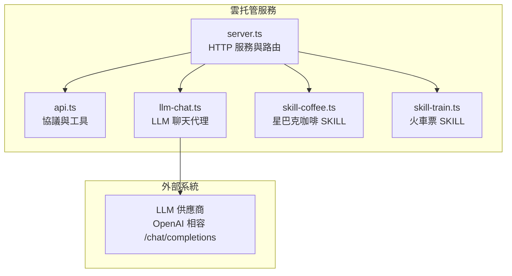
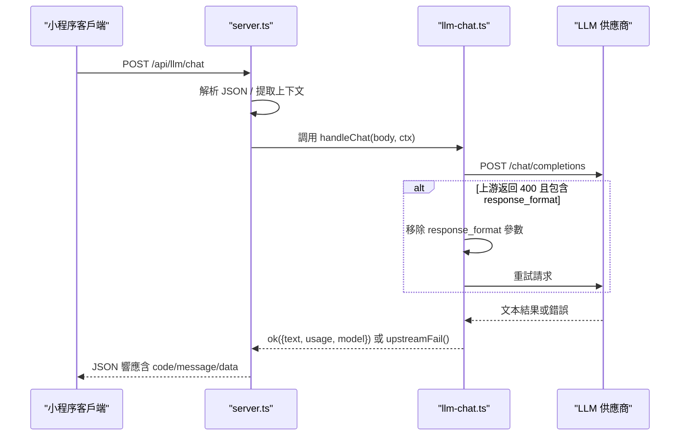
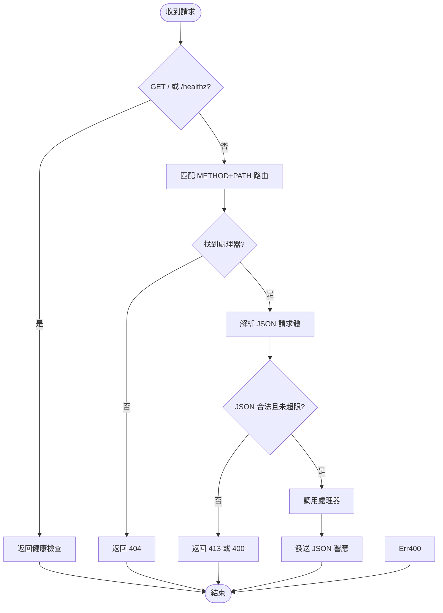
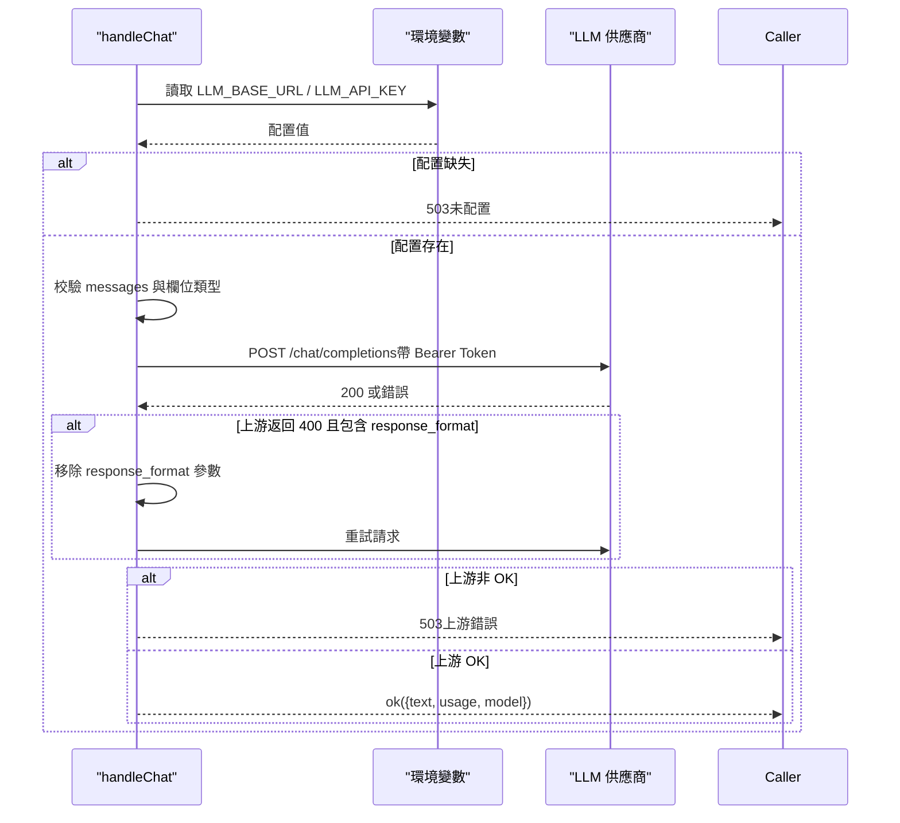
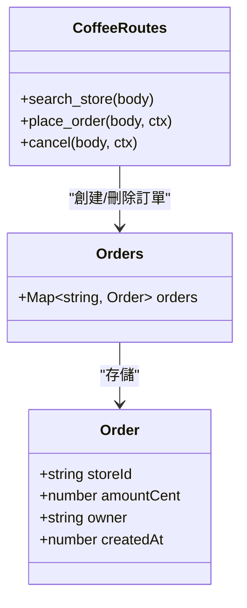
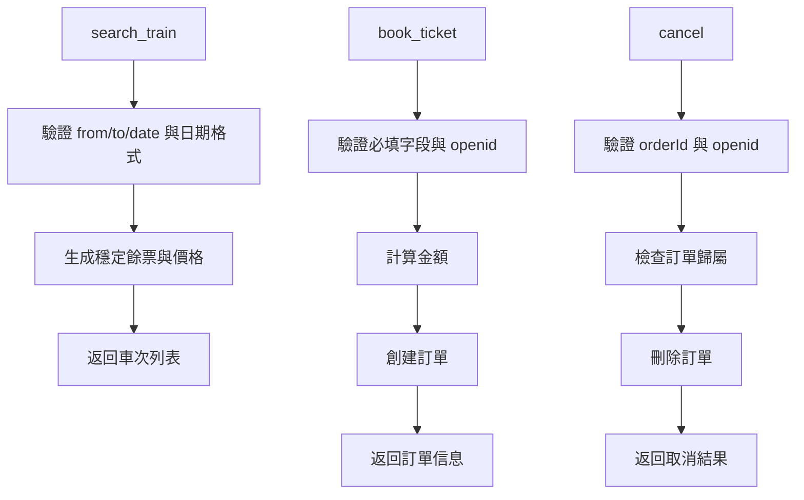
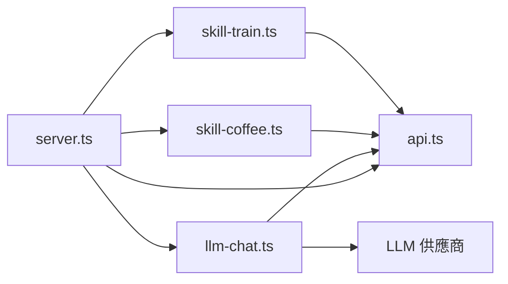
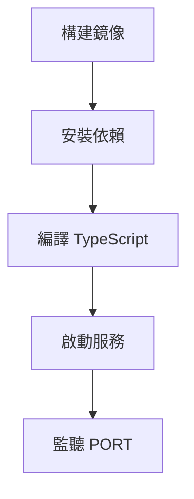

# 雲端服務

<cite>
**本文引用的文件**   
- [server.ts](file://cloudrun/src/server.ts)
- [api.ts](file://cloudrun/src/api.ts)
- [llm-chat.ts](file://cloudrun/src/llm-chat.ts)
- [skill-coffee.ts](file://cloudrun/src/skill-coffee.ts)
- [skill-train.ts](file://cloudrun/src/skill-train.ts)
- [Dockerfile](file://cloudrun/Dockerfile)
- [package.json](file://cloudrun/package.json)
</cite>

## 更新摘要
**已進行的變更**   
- 增強 LLM 聊天服務的上游 400 錯誤處理機制
- 新增格式重試邏輯，支援供應商相容性自適應
- 新增 GET /api/config 端點用於狀態資訊查詢（不暴露 API Key）
- 改進錯誤處理和重試策略

## 目錄
1. [引言](#引言)
2. [項目結構](#項目結構)
3. [核心組件](#核心組件)
4. [架構總覽](#架構總覽)
5. [詳細組件分析](#詳細組件分析)
6. [依賴關係分析](#依賴關係分析)
7. [性能考量](#性能考量)
8. [故障排查指南](#故障排查指南)
9. [部署與配置](#部署與配置)
10. [結論](#結論)

## 引言
本文件為 WAIC-WeChat-MiniProgram 的雲托管後端服務提供完整技術文檔。服務基於 Node.js 原生 HTTP 模組實現，零運行時依賴；對外暴露 RESTful API，包含 LLM 聊天代理、星巴克咖啡 SKILL、火車票 SKILL 等能力。服務遵循統一協議：HTTP 狀態碼表示網路層錯誤，業務成功使用 `code: 0`，業務失敗使用非 0 `code` 並攜帶可讀訊息。

**更新** 最近增強了 LLM 聊天服務的穩定性和相容性，包括上游 400 錯誤處理、格式重試邏輯，以及新的配置狀態查詢端點。

## 項目結構
雲托管服務位於 `cloudrun` 目錄，採用按功能劃分的模組化組織：
- `src/server.ts`：服務入口、請求解析、路由分發、健康檢查、統一日誌與錯誤處理。
- `src/api.ts`：統一協議類型、標準回應封裝與輔助函數。
- `src/llm-chat.ts`：LLM 聊天代理端點，轉發至 OpenAI 相容上游，支援供應商相容性自適應。
- `src/skill-coffee.ts`：星巴克咖啡 SKILL 端點（門市搜尋、下單、取消）。
- `src/skill-train.ts`：火車票 SKILL 端點（查詢車次、訂票、取消）。
- `Dockerfile`：容器鏡像構建定義。
- `package.json`：專案元資料與腳本。

圖源
- [server.ts:13-27](file://cloudrun/src/server.ts#L13-L27)
- [llm-chat.ts:19-29](file://cloudrun/src/llm-chat.ts#L19-L29)

章節來源
- [server.ts:1-176](file://cloudrun/src/server.ts#L1-L176)
- [package.json:1-17](file://cloudrun/package.json#L1-L17)

## 核心組件
- 統一協議與工具
  - `CloudResponse`：標準業務回應體，包含 `code`、`message`、`data`。
  - `RequestContext`：從請求頭提取的身份與會話上下文（`x-wx-openid`、`x-micromate-session`）。
  - `ok/fail/badRequest/unauthorized/forbidden`：標準回應生成器，區分業務成功、業務失敗、參數錯誤、未鑒權、無權操作。
- 服務入口
  - 監聽 `PORT`（預設 80），JSON body 解析上限 1MB，健康檢查 `/` 與 `/healthz`。
  - 路由表由各模組以 `[METHOD PATH, handler]` 形式匯出並合併。
  - 異常分類：負載過大返回 413，非法 JSON 返回 400，其他異常返回 500。
- LLM 聊天代理
  - 端點：`POST /api/llm/chat` 和 `GET /api/config`。
  - 環境變數：`LLM_BASE_URL`、`LLM_API_KEY`、`LLM_MODEL`。
  - 行為：校驗入參、轉發至上游 `/chat/completions`、超時保護、統一翻譯上游錯誤為 503。
  - **更新** 新增供應商相容性自適應：當收到 400 錯誤且包含 `response_format` 參數時，自動移除該參數重試一次。
  - **更新** 新增配置狀態查詢端點，脫敏返回 LLM 配置資訊而不暴露 API Key。
- SKILL 端點
  - 星巴克咖啡：`search_store`、`place_order`、`place_order/cancel`。
  - 火車票：`search_train`、`book_ticket`、`book_ticket/cancel`。
  - 寫操作均要求 `ctx.openid`，取消接口執行歸屬鑒權（防 IDOR）。

章節來源
- [api.ts:10-64](file://cloudrun/src/api.ts#L10-L64)
- [server.ts:19-176](file://cloudrun/src/server.ts#L19-L176)
- [llm-chat.ts:22-190](file://cloudrun/src/llm-chat.ts#L22-L190)
- [skill-coffee.ts:16-124](file://cloudrun/src/skill-coffee.ts#L16-L124)
- [skill-train.ts:19-148](file://cloudrun/src/skill-train.ts#L19-L148)

## 架構總覽
服務採用「輕量 HTTP + 路由分發」架構，不依賴 Express 等框架，通過自定義路由表將請求派發至對應處理器。LLM 聊天作為代理層，對接 OpenAI 相容供應商；SKILL 端點在 MVP 階段使用記憶體模擬數據，後續可替換為真實業務系統。

圖源
- [server.ts:76-176](file://cloudrun/src/server.ts#L76-L176)
- [llm-chat.ts:55-190](file://cloudrun/src/llm-chat.ts#L55-L190)

## 詳細組件分析

### 服務入口與路由分發（server.ts）
- 健康檢查
  - GET `/` 與 GET `/healthz` 返回服務名與時間戳，供雲托管探活。
- 請求體解析
  - 流式讀取並累計大小，超過 1MB 直接拒絕；空體解析為 `undefined`；非法 JSON 拋出特定錯誤。
- 路由匹配
  - 以 `METHOD PATH` 為鍵查找處理器；未命中返回 404。
- 上下文注入
  - 從請求頭提取 `x-wx-openid` 與 `x-micromate-session`，注入 `RequestContext`。
- 錯誤處理
  - 分類返回 413（負載過大）、400（非法 JSON）、500（內部錯誤）。

圖源
- [server.ts:34-68](file://cloudrun/src/server.ts#L34-L68)
- [server.ts:80-176](file://cloudrun/src/server.ts#L80-L176)

章節來源
- [server.ts:1-176](file://cloudrun/src/server.ts#L1-L176)

### LLM 聊天代理（llm-chat.ts）
- 輸入模型
  - `LLMRequestBody`：支持 `model`、`messages`、`temperature`、`maxTokens`、`jsonMode`。
- 輸出模型
  - 返回 `text`、`usage`（prompt/completion/total tokens）、`model`。
- 關鍵流程
  - 校驗環境變數與入參。
  - 構造 OpenAI 相容請求，設置 `response_format.json_object`（當 `jsonMode=true`）。
  - 使用 `AbortSignal.timeout` 防止上游掛起。
  - **更新** 供應商相容性自適應：當上游返回 400 錯誤且請求包含 `response_format` 參數時，自動移除該參數並重試一次。
  - **更新** 新增 `handleConfig` 函數，提供脫敏的配置狀態查詢。
  - 上游非 OK 或格式異常統一返回 503。
- 錯誤語義
  - 未配置或上游失敗 → 503（可重試）。
  - 入參不合法 → 400。

**更新** 新增配置狀態查詢端點：
- 端點：`GET /api/config`
- 功能：返回 LLM 配置狀態，包括供應商識別、模型名稱、是否已配置 API Key
- 安全：不返回實際的 API Key，僅返回 host 部分作為 baseUrl
- 供應商識別：支援 MiniMax、DeepSeek、智譜 GLM 及自定義供應商

圖源
- [llm-chat.ts:55-190](file://cloudrun/src/llm-chat.ts#L55-L190)

章節來源
- [llm-chat.ts:1-190](file://cloudrun/src/llm-chat.ts#L1-L190)

### 星巴克咖啡 SKILL（skill-coffee.ts）
- 端點
  - `POST /api/skill/skill.coffee.starbucks/search_store`
  - `POST /api/skill/skill.coffee.starbucks/place_order`
  - `POST /api/skill/skill.coffee.starbucks/place_order/cancel`
- 數據模型
  - SKU 價格映射：latte、americano、cappuccino、caramel_macchiato；未列舉 SKU 使用默認價。
  - 訂單存於記憶體 Map，包含 `storeId`、`amountCent`、`owner`、`createdAt`。
- 邏輯要點
  - 門市搜尋：根據城市與限制數量返回模擬門市列表。
  - 下單：校驗必填字段、取貨方式、SKU 與數量；計算金額；生成訂單號；落庫到記憶體。
  - 取消：校驗訂單存在性與歸屬權（僅擁有者可取消）。
- 安全
  - 寫操作要求 `ctx.openid`；取消接口執行歸屬鑒權，防止 IDOR。

圖源
- [skill-coffee.ts:25-26](file://cloudrun/src/skill-coffee.ts#L25-L26)
- [skill-coffee.ts:33-124](file://cloudrun/src/skill-coffee.ts#L33-L124)

章節來源
- [skill-coffee.ts:1-124](file://cloudrun/src/skill-coffee.ts#L1-L124)

### 火車票 SKILL（skill-train.ts）
- 端點
  - `POST /api/skill/skill.train.12306/search_train`
  - `POST /api/skill/skill.train.12306/book_ticket`
  - `POST /api/skill/skill.train.12306/book_ticket/cancel`
- 數據模型
  - 座位類型價格映射：business、first_class、second_class、hard_seat。
  - 訂單存於記憶體 Map，包含 `trainNo`、`date`、`amountCent`、`owner`、`createdAt`。
- 邏輯要點
  - 查詢車次：驗證日期格式，穩定雜湊生成餘票數，返回確定性模擬數據。
  - 訂票：校驗必填字段與身份；計算金額；生成訂單號；設置支付截止時間。
  - 取消：校驗訂單存在性與歸屬權。
- 安全
  - 寫操作要求 `ctx.openid`；取消接口執行歸屬鑒權，防止 IDOR。

圖源
- [skill-train.ts:46-77](file://cloudrun/src/skill-train.ts#L46-L77)
- [skill-train.ts:89-116](file://cloudrun/src/skill-train.ts#L89-L116)
- [skill-train.ts:122-141](file://cloudrun/src/skill-train.ts#L122-L141)

章節來源
- [skill-train.ts:1-148](file://cloudrun/src/skill-train.ts#L1-L148)

## 依賴關係分析
- 內置依賴
  - `node:http`：HTTP 服務。
  - Node 18+ 內建 `fetch`：LLM 上游請求。
- 模組耦合
  - `server.ts` 依賴 `api.ts` 的協議與工具，並匯入各 SKILL 與 LLM 路由。
  - `llm-chat.ts`、`skill-coffee.ts`、`skill-train.ts` 均依賴 `api.ts` 的標準工具。
- 外部依賴
  - LLM 供應商（OpenAI 相容）：通過環境變數配置 Base URL 與 API Key。

圖源
- [server.ts:13-27](file://cloudrun/src/server.ts#L13-L27)
- [llm-chat.ts:19-29](file://cloudrun/src/llm-chat.ts#L19-L29)

章節來源
- [server.ts:13-27](file://cloudrun/src/server.ts#L13-L27)
- [llm-chat.ts:19-29](file://cloudrun/src/llm-chat.ts#L19-L29)

## 性能考量
- 請求體大小限制：1MB，避免超大負載拖垮服務。
- LLM 上游超時：30 秒，防止上游掛起導致線程阻塞。
- **更新** 供應商相容性重試：針對不支持 `response_format` 參數的供應商，自動重試一次以提升相容性。
- 記憶體存儲：SKILL 訂單使用 Map，適合 MVP；生產環境建議持久化。
- 零運行時依賴：減少鏡像體積與啟動開銷。

[本節為通用指導，無需引用具體文件]

## 故障排查指南
- 常見錯誤碼
  - 400：非法 JSON 或參數不合法。
  - 401：缺少調用方身份（寫操作必須攜帶 `x-wx-openid`）。
  - 403：無權操作他人資源（IDOR 防護）。
  - 404：路由不存在或訂單不存在。
  - 413：請求體過大。
  - 500：內部錯誤。
  - 503：LLM 上游不可用或配置缺失。
- **更新** LLM 相關診斷
  - 檢查 `GET /api/config` 端點確認 LLM 配置狀態。
  - 查看供應商相容性問題：如果上游返回 400 錯誤，服務會自動嘗試移除 `response_format` 參數重試。
  - 確認環境變數 `LLM_BASE_URL`、`LLM_API_KEY`、`LLM_MODEL` 已正確配置。
- 診斷步驟
  - 檢查健康檢查端點是否返回正常。
  - 查看雲托管日誌（stdout）中的請求與異常信息。
  - 驗證請求頭是否包含 `x-wx-openid` 與 `x-micromate-session`。

章節來源
- [server.ts:110-176](file://cloudrun/src/server.ts#L110-L176)
- [llm-chat.ts:55-190](file://cloudrun/src/llm-chat.ts#L55-L190)
- [skill-coffee.ts:67-116](file://cloudrun/src/skill-coffee.ts#L67-L116)
- [skill-train.ts:94-141](file://cloudrun/src/skill-train.ts#L94-L141)

## 部署與配置
- Docker 鏡像
  - 基礎鏡像：`node:20-alpine`。
  - 工作目錄：`/app`。
  - 依賴安裝：使用 npm mirror 加速。
  - TypeScript 編譯：保留產物。
  - 端口：80（微信雲托管要求）。
- 環境變數
  - `PORT`：服務監聽端口（預設 80）。
  - `LLM_BASE_URL`：LLM 供應商 Base URL。
  - `LLM_API_KEY`：LLM 供應商 API Key。
  - `LLM_MODEL`：預設模型名稱（可選）。
  - **更新** `LLM_EXTRA_BODY`：可選的額外請求體參數（JSON 字串），用於供應商特有配置。
- 啟動命令
  - `node dist/server.js`。

圖源
- [Dockerfile:1-20](file://cloudrun/Dockerfile#L1-L20)
- [package.json:6-9](file://cloudrun/package.json#L6-L9)

章節來源
- [Dockerfile:1-20](file://cloudrun/Dockerfile#L1-L20)
- [package.json:1-17](file://cloudrun/package.json#L1-L17)

## 結論
本雲端服務以輕量、零依賴的方式實現了 LLM 聊天代理與多個 SKILL 端點，遵循統一的 RESTful 協議與錯誤處理規範。通過環境變數管理敏感配置，並利用雲托管日誌進行監控與排錯。

**更新** 最近的改進顯著提升了服務的穩定性和相容性：
- 新增了供應商相容性自適應機制，自動處理不同 LLM 供應商的差異
- 提供了脫敏的配置狀態查詢端點，便於監控和診斷
- 改進了錯誤處理和重試策略，提升整體可靠性

未來可擴展更多 SKILL，並將 MVP 的記憶體存儲替換為持久化方案以提升可靠性。