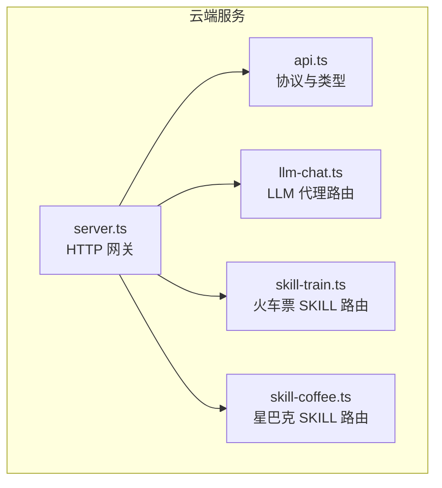
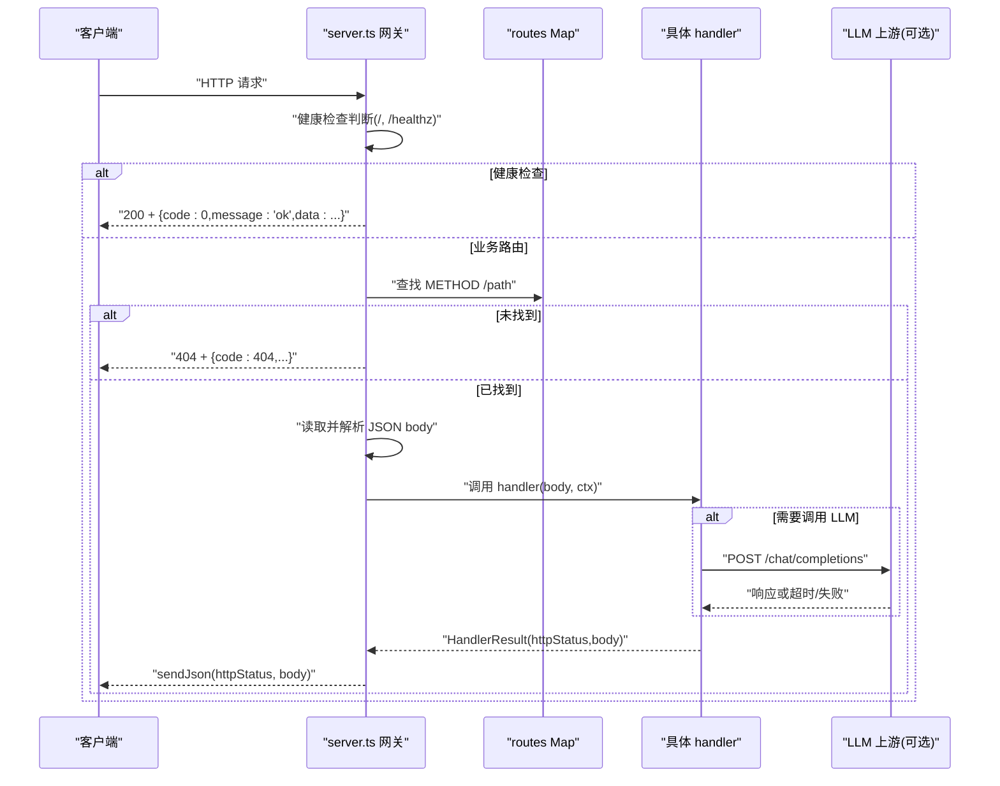
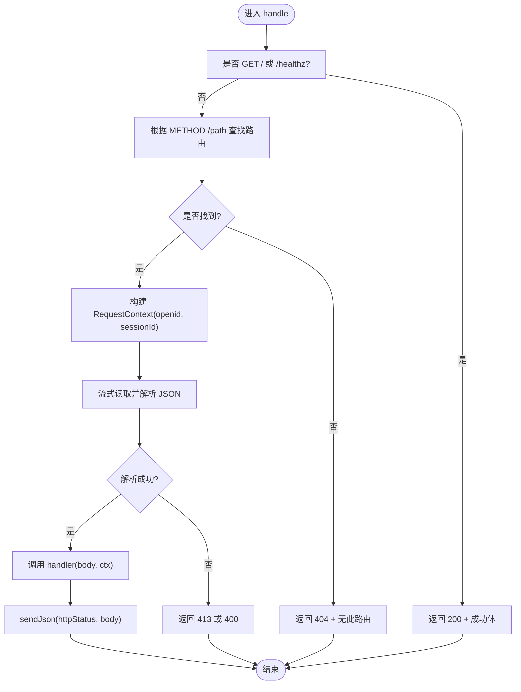
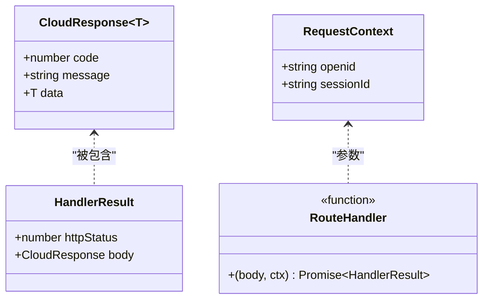
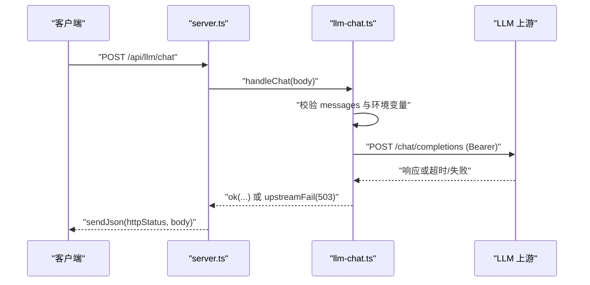
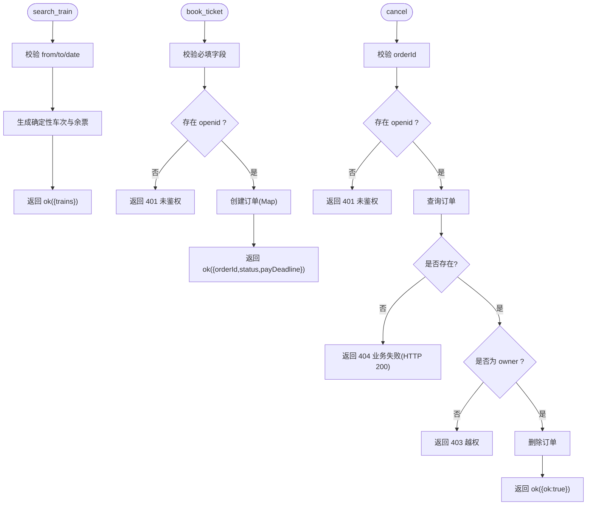
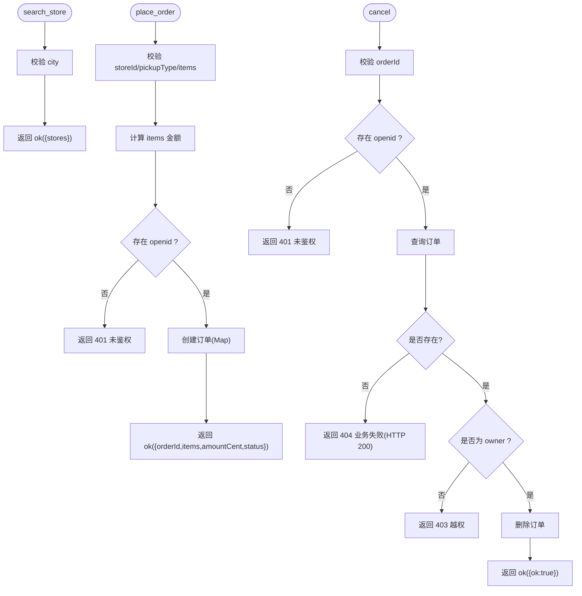
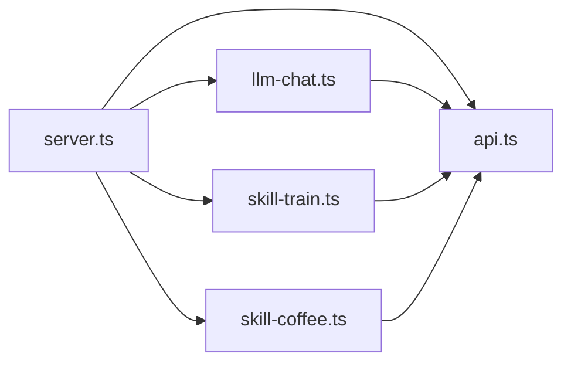

# 服务器架构

<cite>
**本文引用的文件**   
- [server.ts](file://cloudrun/src/server.ts)
- [api.ts](file://cloudrun/src/api.ts)
- [llm-chat.ts](file://cloudrun/src/llm-chat.ts)
- [skill-train.ts](file://cloudrun/src/skill-train.ts)
- [skill-coffee.ts](file://cloudrun/src/skill-coffee.ts)
- [package.json](file://cloudrun/package.json)
</cite>

## 目录
1. [引言](#引言)
2. [项目结构](#项目结构)
3. [核心组件](#核心组件)
4. [架构总览](#架构总览)
5. [详细组件分析](#详细组件分析)
6. [依赖关系分析](#依赖关系分析)
7. [性能考量](#性能考量)
8. [故障排查指南](#故障排查指南)
9. [结论](#结论)
10. [附录：部署与配置](#附录部署与配置)

## 引言
本文面向 WAIC-WeChat-MiniProgram 的云端服务服务器部分，系统性梳理基于 Node.js 原生 HTTP 模块构建的微服务架构。该实现以零运行时依赖为目标，使用 node:http 替代 Express，通过静态路由表注册、请求上下文管理、中间件式错误处理以及统一响应格式，提供 LLM 代理与多个 SKILL 端点（火车票、星巴克咖啡）。文档同时覆盖健康检查、请求体解析、环境变量、日志输出、性能优化与故障排查建议。

## 项目结构
云端服务位于 cloudrun 目录，采用“入口网关 + 领域路由模块”的组织方式：
- 入口网关 server.ts：负责监听端口、健康检查、请求体解析、路由分发、统一响应与异常处理。
- API 协议层 api.ts：定义 CloudResponse、RequestContext、HandlerResult、RouteHandler 等类型与辅助构造器。
- 领域路由模块：
  - llm-chat.ts：LLM 代理端点，转发 OpenAI 兼容协议到上游模型供应商。
  - skill-train.ts：火车票 SKILL 端点（搜索、下单、取消）。
  - skill-coffee.ts：星巴克咖啡 SKILL 端点（门店搜索、下单、取消）。
- 包配置 package.json：声明脚本、依赖与运行入口。

**图表来源**
- [server.ts:13-17](file://cloudrun/src/server.ts#L13-L17)
- [api.ts:10-38](file://cloudrun/src/api.ts#L10-L38)
- [llm-chat.ts:19-20](file://cloudrun/src/llm-chat.ts#L19-L20)
- [skill-train.ts:16-17](file://cloudrun/src/skill-train.ts#L16-L17)
- [skill-coffee.ts:13-14](file://cloudrun/src/skill-coffee.ts#L13-L14)

**章节来源**
- [server.ts:1-17](file://cloudrun/src/server.ts#L1-L17)
- [package.json:1-16](file://cloudrun/package.json#L1-L16)

## 核心组件
- HTTP 网关 server.ts
  - 职责：监听 PORT、健康检查、JSON body 流式解析、静态路由分发、统一 JSON 响应、异常处理与日志。
  - 关键设计：
    - 使用 Map 维护 METHOD /path → RouteHandler 的静态路由表。
    - 从请求头提取 openid 与 sessionId 形成 RequestContext。
    - 对请求体进行大小限制与 JSON 校验，返回标准化错误码。
    - 健康检查 GET / 与 GET /healthz 直接返回成功状态。
- API 协议层 api.ts
  - 定义 CloudResponse<T>、RequestContext、HandlerResult、RouteHandler。
  - 提供 ok/fail/badRequest/unauthorized/forbidden 等构造器，保证业务与网络层错误语义清晰。
- 领域路由模块
  - llm-chat.ts：校验消息、拼装 OpenAI 兼容请求、调用上游 fetch，超时保护，统一 503 可重试语义。
  - skill-train.ts：火车票搜索、下单、取消；内存订单表；openid 鉴权与归属校验。
  - skill-coffee.ts：星巴克门店搜索、下单、取消；SKU 价格映射；openid 鉴权与归属校验。

**章节来源**
- [server.ts:19-128](file://cloudrun/src/server.ts#L19-L128)
- [api.ts:10-64](file://cloudrun/src/api.ts#L10-L64)
- [llm-chat.ts:1-123](file://cloudrun/src/llm-chat.ts#L1-L123)
- [skill-train.ts:1-148](file://cloudrun/src/skill-train.ts#L1-L148)
- [skill-coffee.ts:1-124](file://cloudrun/src/skill-coffee.ts#L1-L124)

## 架构总览
整体为“单进程 HTTP 网关 + 多模块路由”的微服务形态。各 SKILL 与 LLM 代理作为独立路由模块，通过 entries 形式向网关贡献路由，便于扩展与维护。

**图表来源**
- [server.ts:76-128](file://cloudrun/src/server.ts#L76-L128)
- [llm-chat.ts:55-118](file://cloudrun/src/llm-chat.ts#L55-L118)

## 详细组件分析

### HTTP 网关 server.ts
- 启动与监听
  - 使用 createServer 创建 HTTP 服务器，监听 process.env.PORT（默认 80），并在启动时输出日志。
- 健康检查
  - GET / 与 GET /healthz 直接返回 200 与标准成功体，供云托管探活。
- 路由分发
  - 将 llmRoutes、trainRoutes、coffeeRoutes 合并入 routes Map，键为 "METHOD /path"。
  - 未匹配路由返回 404。
- 请求上下文
  - 从 x-wx-openid 与 x-micromate-session 头中提取 openid 与 sessionId，封装为 RequestContext。
- 请求体解析
  - 流式累积 Buffer，累计超过 1MB 立即拒绝并销毁连接，抛出 PAYLOAD_TOO_LARGE。
  - 空 body 解析为 undefined；非合法 JSON 抛出 INVALID_JSON。
- 统一响应
  - sendJson 统一设置 content-type 与 UTF-8 编码，序列化 body。
- 异常处理
  - 捕获解析异常与业务异常，区分 413、400、500 等状态码，并记录日志。

**图表来源**
- [server.ts:80-123](file://cloudrun/src/server.ts#L80-L123)

**章节来源**
- [server.ts:19-128](file://cloudrun/src/server.ts#L19-L128)

### API 协议层 api.ts
- CloudResponse<T>
  - code：业务状态码，0 表示成功。
  - message：人类可读信息。
  - data：业务数据。
- RequestContext
  - openid：微信云托管注入的调用方身份。
  - sessionId：小程序附加的会话 ID。
- HandlerResult
  - httpStatus：HTTP 状态码。
  - body：CloudResponse。
- RouteHandler
  - 签名：(body, ctx) => Promise<HandlerResult>。
- 构造器
  - ok(data)：业务成功，HTTP 200。
  - fail(code, message)：业务失败，HTTP 200（由 SKILL 层翻译为 SkillError）。
  - badRequest(message)：参数错误，HTTP 400。
  - unauthorized(message)：未鉴权，HTTP 401。
  - forbidden(message)：越权操作，HTTP 403。

**图表来源**
- [api.ts:10-38](file://cloudrun/src/api.ts#L10-L38)

**章节来源**
- [api.ts:10-64](file://cloudrun/src/api.ts#L10-L64)

### LLM 代理 llm-chat.ts
- 端点
  - POST /api/llm/chat
- 环境变量
  - LLM_BASE_URL：必填，上游 Base URL。
  - LLM_API_KEY：必填，Bearer Token。
  - LLM_MODEL：可选，默认 deepseek-chat。
- 输入校验
  - messages 必填且不可为空，role/content 必须为字符串。
- 上游调用
  - 使用 Node 18+ 内建 fetch，拼接 /chat/completions。
  - 设置 Authorization: Bearer {apiKey}。
  - 超时保护 AbortSignal.timeout(UPSTREAM_TIMEOUT_MS)。
- 错误语义
  - 配置缺失或上游失败返回 503（可重试）。
  - 入参非法返回 400。
- 响应
  - 返回文本、用量统计与模型名，包装为 ok(...)。

**图表来源**
- [llm-chat.ts:55-118](file://cloudrun/src/llm-chat.ts#L55-L118)
- [server.ts:100-123](file://cloudrun/src/server.ts#L100-L123)

**章节来源**
- [llm-chat.ts:1-123](file://cloudrun/src/llm-chat.ts#L1-L123)

### 火车票 SKILL skill-train.ts
- 端点
  - POST /api/skill/skill.train.12306/search_train
  - POST /api/skill/skill.train.12306/book_ticket
  - POST /api/skill/skill.train.12306/book_ticket/cancel
- 数据与状态
  - 内存 Map 存储订单（MVP：重启丢失、实例间不共享）。
  - 座位类型与价格映射 SEAT_PRICE_CENT。
- 逻辑要点
  - search_train：校验 from/to/date，生成确定性余票与价格。
  - book_ticket：校验必填字段，要求 openid 鉴权，创建订单并返回支付截止时间。
  - cancel：校验 orderId，要求 openid 鉴权，归属校验后删除订单。
- 错误语义
  - 参数错误返回 400。
  - 缺少 openid 返回 401。
  - 非拥有者取消返回 403。
  - 订单不存在返回 404（业务失败，HTTP 200 + 非 0 code）。

**图表来源**
- [skill-train.ts:46-141](file://cloudrun/src/skill-train.ts#L46-L141)

**章节来源**
- [skill-train.ts:1-148](file://cloudrun/src/skill-train.ts#L1-L148)

### 星巴克 SKILL skill-coffee.ts
- 端点
  - POST /api/skill/skill.coffee.starbucks/search_store
  - POST /api/skill/skill.coffee.starbucks/place_order
  - POST /api/skill/skill.coffee.starbucks/place_order/cancel
- 数据与状态
  - SKU 价格映射与默认价。
  - 内存 Map 存储订单（MVP：重启丢失、实例间不共享）。
- 逻辑要点
  - search_store：校验 city，返回模拟门店列表。
  - place_order：校验 storeId/pickupType/items，计算金额，要求 openid 鉴权，创建订单。
  - cancel：校验 orderId，要求 openid 鉴权，归属校验后删除订单。
- 错误语义
  - 参数错误返回 400。
  - 缺少 openid 返回 401。
  - 非拥有者取消返回 403。
  - 订单不存在返回 404（业务失败，HTTP 200 + 非 0 code）。

**图表来源**
- [skill-coffee.ts:33-116](file://cloudrun/src/skill-coffee.ts#L33-L116)

**章节来源**
- [skill-coffee.ts:1-124](file://cloudrun/src/skill-coffee.ts#L1-L124)

## 依赖关系分析
- 模块耦合
  - server.ts 依赖 api.ts 的类型与构造器，以及三个路由模块导出的 entries。
  - 路由模块仅依赖 api.ts 的类型与构造器，保持低耦合。
- 外部依赖
  - 仅使用 Node 内建模组 node:http。
  - LLM 代理使用 Node 18+ 内建 fetch。
- 潜在循环依赖
  - 当前结构无循环依赖，路由模块之间相互独立。

**图表来源**
- [server.ts:13-17](file://cloudrun/src/server.ts#L13-L17)
- [llm-chat.ts:19-20](file://cloudrun/src/llm-chat.ts#L19-L20)
- [skill-train.ts:16-17](file://cloudrun/src/skill-train.ts#L16-L17)
- [skill-coffee.ts:13-14](file://cloudrun/src/skill-coffee.ts#L13-L14)

**章节来源**
- [server.ts:13-17](file://cloudrun/src/server.ts#L13-L17)
- [llm-chat.ts:19-20](file://cloudrun/src/llm-chat.ts#L19-L20)
- [skill-train.ts:16-17](file://cloudrun/src/skill-train.ts#L16-L17)
- [skill-coffee.ts:13-14](file://cloudrun/src/skill-coffee.ts#L13-L14)

## 性能考量
- 零运行时依赖
  - 避免引入 Express 等框架，减少冷启动时间与内存占用，适合云托管容器快速扩缩容。
- 静态路由表
  - 使用 Map 存储路由，O(1) 查找，避免正则匹配开销。
- 流式请求体解析
  - 边读边累加，超限即断连，避免大请求体阻塞事件循环。
- 上游超时保护
  - LLM 上游调用设置超时，防止长尾请求拖垮服务。
- 内存数据结构
  - SKILL 使用 Map 存储订单，读写 O(1)，但注意 MVP 场景下重启丢失与实例间不共享问题。
- 可扩展性建议
  - 将内存订单迁移至持久化存储（如云数据库）以实现多实例共享。
  - 增加限流与熔断策略，保护上游与内部资源。
  - 引入结构化日志与指标采集，便于监控与告警。

[本节为通用性能讨论，不涉及具体代码片段]

## 故障排查指南
- 健康检查失败
  - 确认 GET / 与 GET /healthz 返回 200 与成功体。
  - 检查服务是否成功监听 PORT。
- 404 无此路由
  - 核对请求 METHOD 与 path 是否与路由表一致。
  - 确认路由模块是否正确导出 entries。
- 413 请求体过大
  - 检查客户端发送的 JSON 大小是否超过 1MB。
  - 调整客户端压缩或分片上传策略。
- 400 非法 JSON
  - 检查 Content-Type 与请求体格式。
  - 确保服务端正确解析 JSON。
- 500 内部错误
  - 查看服务日志，定位 handler 抛出的异常。
  - 检查上游 LLM 配置与连通性。
- LLM 上游 503
  - 检查 LLM_BASE_URL 与 LLM_API_KEY 环境变量。
  - 检查上游服务可用性与网络连通性。
  - 关注超时时间 UPSTREAM_TIMEOUT_MS 是否合理。
- SKILL 鉴权失败
  - 确认请求头携带 x-wx-openid。
  - 检查写入操作的归属校验逻辑。

**章节来源**
- [server.ts:84-123](file://cloudrun/src/server.ts#L84-L123)
- [llm-chat.ts:56-96](file://cloudrun/src/llm-chat.ts#L56-L96)
- [skill-train.ts:89-141](file://cloudrun/src/skill-train.ts#L89-L141)
- [skill-coffee.ts:54-116](file://cloudrun/src/skill-coffee.ts#L54-L116)

## 结论
本服务器架构以 Node.js 原生 HTTP 模块为核心，通过静态路由表、统一响应格式与清晰的错误语义，实现了轻量、可维护的微服务模式。LLM 代理与多个 SKILL 端点解耦良好，便于扩展与替换。结合环境变量、健康检查与流式请求体解析，满足云托管环境的部署要求。后续可通过持久化存储、限流熔断与监控指标进一步提升稳定性与可观测性。

[本节为总结性内容，不涉及具体代码片段]

## 附录：部署与配置
- 环境变量
  - PORT：监听端口，默认 80（微信云托管要求）。
  - LLM_BASE_URL：LLM 上游 Base URL（必填）。
  - LLM_API_KEY：LLM 上游 API Key（必填）。
  - LLM_MODEL：默认模型名（可选，默认 deepseek-chat）。
- 启动命令
  - 构建：npm run build
  - 启动：npm start（执行 node dist/server.js）
- 日志输出
  - 所有日志通过 console.log 输出到 stdout，由云托管日志系统收集。
  - 日志包含时间戳、请求方法与路径、sessionId/openid 与异常信息。
- 端口配置
  - 通过 process.env.PORT 指定监听端口，未设置时默认 80。
- 健康检查
  - 云托管会访问 GET / 与 GET /healthz，需确保返回 200 与成功体。

**章节来源**
- [server.ts:125-128](file://cloudrun/src/server.ts#L125-L128)
- [package.json:6-9](file://cloudrun/package.json#L6-L9)
- [llm-chat.ts:8-11](file://cloudrun/src/llm-chat.ts#L8-L11)