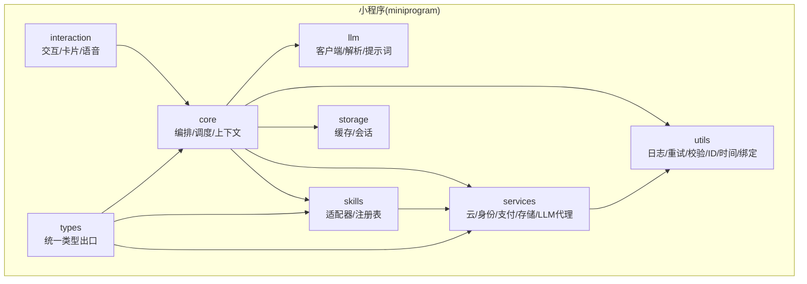
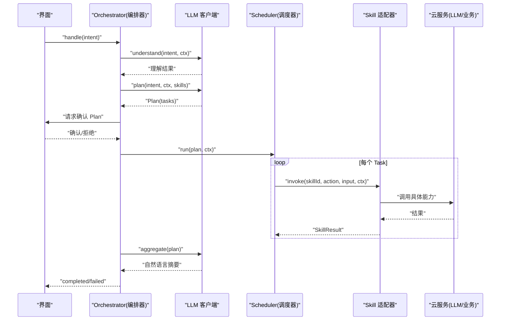
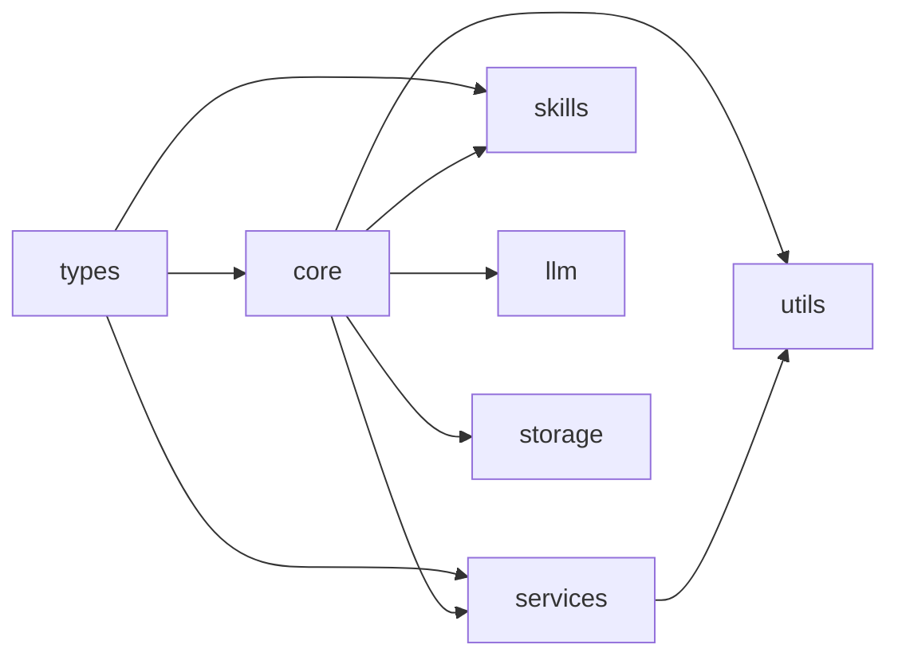
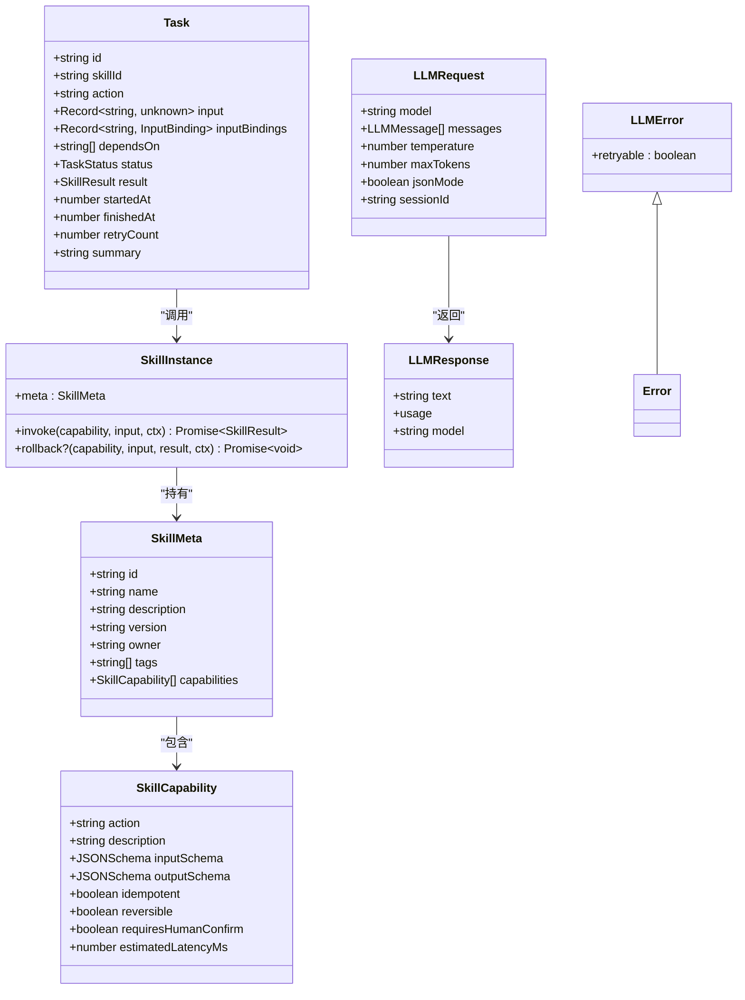

# 代码规范

<cite>
**本文引用的文件**   
- [package.json](file://package.json)
- [tsconfig.json](file://tsconfig.json)
- [miniprogram/src/types/index.ts](file://miniprogram/src/types/index.ts)
- [miniprogram/src/core/index.ts](file://miniprogram/src/core/index.ts)
- [miniprogram/src/services/index.ts](file://miniprogram/src/services/index.ts)
- [miniprogram/src/utils/index.ts](file://miniprogram/src/utils/index.ts)
- [miniprogram/src/types/skill.d.ts](file://miniprogram/src/types/skill.d.ts)
- [miniprogram/src/types/task.d.ts](file://miniprogram/src/types/task.d.ts)
- [miniprogram/src/core/orchestrator.ts](file://miniprogram/src/core/orchestrator.ts)
- [miniprogram/src/services/llm.ts](file://miniprogram/src/services/llm.ts)
- [miniprogram/src/utils/validator.ts](file://miniprogram/src/utils/validator.ts)
</cite>

## 目录
1. [引言](#引言)
2. [项目结构](#项目结构)
3. [核心组件](#核心组件)
4. [架构总览](#架构总览)
5. [详细组件分析](#详细组件分析)
6. [依赖分析](#依赖分析)
7. [性能考量](#性能考量)
8. [故障排查指南](#故障排查指南)
9. [结论](#结论)
10. [附录](#附录)

## 引言
本规范面向 WAIC-WeChat-MiniProgram（MicroMate）微信小程序端，目标是统一 TypeScript 编码约定、类型与接口设计、模块组织、注释与文档、Git 提交与分支策略，以及代码质量工具链配置。规范以现有仓库结构与实现为依据，确保可落地、可检查、可演进。

## 项目结构
- 根目录包含小程序工程与云函数工程：
  - miniprogram：小程序前端逻辑与页面
  - cloudrun：云端服务（Node.js）
- 小程序源码位于 miniprogram/src，采用“领域/能力”分层 + “统一导出入口”的组织方式：
  - core：编排器、调度器、上下文等核心运行时
  - interaction：交互层（卡片渲染、人类确认、语音）
  - llm：LLM 客户端、解析器、提示词
  - services：云服务封装（网络、身份、支付、存储、LLM 代理）
  - skills：技能注册与适配器
  - storage：缓存与会话持久化
  - types：跨层类型定义与统一导出
  - utils：通用工具（日志、重试、校验、ID 生成、时间处理、绑定）

**图示来源**
- [miniprogram/src/core/index.ts:1-7](file://miniprogram/src/core/index.ts#L1-L7)
- [miniprogram/src/services/index.ts:1-9](file://miniprogram/src/services/index.ts#L1-L9)
- [miniprogram/src/utils/index.ts:1-10](file://miniprogram/src/utils/index.ts#L1-L10)
- [miniprogram/src/types/index.ts:1-14](file://miniprogram/src/types/index.ts#L1-L14)

**章节来源**
- [miniprogram/src/core/index.ts:1-7](file://miniprogram/src/core/index.ts#L1-L7)
- [miniprogram/src/services/index.ts:1-9](file://miniprogram/src/services/index.ts#L1-L9)
- [miniprogram/src/utils/index.ts:1-10](file://miniprogram/src/utils/index.ts#L1-L10)
- [miniprogram/src/types/index.ts:1-14](file://miniprogram/src/types/index.ts#L1-L14)

## 核心组件
- Orchestrator（编排器）
  - 职责：状态机驱动意图理解、计划生成、人类确认、任务执行、结果聚合与回滚；对外暴露 handle/handleOnce。
  - 关键特性：严格的状态转移表、令牌机制防止并发双跑、失败回滚策略、异常分类处理。
- Scheduler（调度器）
  - 职责：按依赖关系执行 Task DAG，支持等待人类确认、重试与死锁检测。
- Services（服务层）
  - 职责：封装微信云调用、身份、支付、存储、LLM 代理；提供重试与错误包装。
- Skills（技能层）
  - 职责：注册与适配外部能力，提供 invoke/rollback 语义。
- Types（类型层）
  - 职责：集中定义 SkillMeta、Task、Plan、Context 等跨层契约，并提供统一导出入口。
- Utils（工具层）
  - 职责：日志、重试、JSON Schema 校验、ID 生成、时间处理、数据绑定。

**章节来源**
- [miniprogram/src/core/orchestrator.ts:1-340](file://miniprogram/src/core/orchestrator.ts#L1-L340)
- [miniprogram/src/services/llm.ts:1-83](file://miniprogram/src/services/llm.ts#L1-L83)
- [miniprogram/src/types/skill.d.ts:1-119](file://miniprogram/src/types/skill.d.ts#L1-L119)
- [miniprogram/src/types/task.d.ts:1-59](file://miniprogram/src/types/task.d.ts#L1-L59)
- [miniprogram/src/utils/validator.ts:126-162](file://miniprogram/src/utils/validator.ts#L126-L162)

## 架构总览
下图展示一次用户意图从输入到完成的主流程，包括理解、规划、确认、执行、聚合与回滚路径。

**图示来源**
- [miniprogram/src/core/orchestrator.ts:106-256](file://miniprogram/src/core/orchestrator.ts#L106-L256)
- [miniprogram/src/services/llm.ts:57-83](file://miniprogram/src/services/llm.ts#L57-L83)

## 详细组件分析

### TypeScript 编码约定
- 命名规范
  - 模块与文件：小写下划线或短横线均可，但需保持同模块内一致；公共 API 使用具名导出。
  - 类与接口：大驼峰；枚举与联合类型：小写多词用下划线分隔（如 task_status）。
  - 常量：全大写加下划线（如 BRAND_AI_GENERATED_BY）。
  - 变量与函数：小驼峰；私有成员以下划线前缀（如 _internal）。
- 类型定义最佳实践
  - 优先使用 interface 表达对象契约，type 表达联合/交叉/映射类型。
  - 所有跨层引用类型集中在 types 目录，并通过 index.ts 统一导出，避免深层路径依赖。
  - 对可选字段使用 ?，禁止使用 any；必要时使用 unknown 并配合守卫。
  - 对可能为 null/undefined 的值启用 strictNullChecks，显式处理空值分支。
- 接口设计原则
  - 单一职责：一个接口只描述一种概念（如 SkillCapability、Task、LLMRequest）。
  - 可扩展性：通过可选字段与 discriminated union 扩展行为。
  - 稳定性：对外接口变更需考虑向后兼容，新增字段默认可选。
  - 可测试性：将副作用隔离在 services 层，core 仅依赖抽象。

**章节来源**
- [miniprogram/src/types/index.ts:1-14](file://miniprogram/src/types/index.ts#L1-L14)
- [miniprogram/src/types/skill.d.ts:1-119](file://miniprogram/src/types/skill.d.ts#L1-L119)
- [miniprogram/src/types/task.d.ts:1-59](file://miniprogram/src/types/task.d.ts#L1-L59)
- [miniprogram/src/services/llm.ts:14-45](file://miniprogram/src/services/llm.ts#L14-L45)

### 文件组织结构规范
- 模块划分
  - core：编排与调度，不直接依赖交互层，通过回调注入确认逻辑。
  - interaction：负责 UI 呈现与人类确认，反向依赖 core 的回调契约。
  - llm：LLM 客户端与解析，不感知 skill 细节。
  - services：网络与第三方服务封装，统一错误与重试。
  - skills：技能注册与适配器，屏蔽不同后端差异。
  - storage：本地缓存与会话。
  - types：跨层契约与品牌常量。
  - utils：无状态工具函数。
- 目录结构约定
  - 每个模块提供 index.ts 作为统一导出入口，便于上层按需导入。
  - 类型文件集中放在 types，并以语义化文件名区分（skill.d.ts、task.d.ts 等）。
- 导入导出规范
  - 优先使用具名导出；避免 barrel 文件循环依赖。
  - 跨层引用类型一律从 types/index.ts 导入。
  - 相对路径导入限制层级深度，必要时使用路径别名 @/*。

**章节来源**
- [miniprogram/src/core/index.ts:1-7](file://miniprogram/src/core/index.ts#L1-L7)
- [miniprogram/src/services/index.ts:1-9](file://miniprogram/src/services/index.ts#L1-L9)
- [miniprogram/src/utils/index.ts:1-10](file://miniprogram/src/utils/index.ts#L1-L10)
- [miniprogram/src/types/index.ts:1-14](file://miniprogram/src/types/index.ts#L1-L14)

### 代码注释与文档字符串标准
- 文件级注释
  - 说明模块职责、依赖方向与规范来源（如 Agent.md 条款）。
- 函数/方法注释
  - 参数、返回值、副作用、异常类型与触发条件；对边界情况给出说明。
- 类文档
  - 职责、生命周期、线程/并发安全说明、关键不变式。
- API 文档
  - 对外接口需列出入参/出参、错误码、重试策略与幂等性。
- 示例
  - 复杂算法或状态机流程应附流程图或时序图链接。

**章节来源**
- [miniprogram/src/core/orchestrator.ts:1-27](file://miniprogram/src/core/orchestrator.ts#L1-L27)
- [miniprogram/src/services/llm.ts:1-8](file://miniprogram/src/services/llm.ts#L1-L8)
- [miniprogram/src/types/skill.d.ts:1-11](file://miniprogram/src/types/skill.d.ts#L1-L11)

### Git 提交信息规范与分支管理策略
- 提交信息格式
  - 类型：feat|fix|docs|style|refactor|perf|test|build|ci|chore|revert
  - 范围：模块名（如 core、services、types）
  - 主题：一句话描述变更目的
  - 正文：动机、影响面、破坏性变更说明
  - 尾注：关联 Issue/PR 编号
- 分支策略
  - main：稳定发布分支
  - develop：集成开发分支
  - feature/*：功能分支
  - hotfix/*：紧急修复分支
  - release/*：预发布分支
- 合并要求
  - 必须通过类型检查与单元测试
  - 至少一名 reviewer 批准
  - 破坏性变更需在 PR 中明确标注

[本节为通用流程建议，不直接分析具体源文件]

### 代码质量检查工具配置与使用
- TypeScript 编译与类型检查
  - 启用严格模式与空值检查；ESNext 模块；DOM 库；路径别名 @/*。
  - 命令：npm run type-check / npm run build（当前脚本均执行 tsc --noEmit）。
- ESLint 与 Prettier（建议）
  - 安装依赖：eslint、@typescript-eslint/parser、@typescript-eslint/eslint-plugin、prettier、eslint-config-prettier、eslint-plugin-prettier。
  - 推荐规则：
    - 强制：no-unused-vars、no-explicit-any、prefer-const、semi、quotes、arrow-parens
    - 风格：indent、comma-dangle、object-curly-spacing、max-len
    - TS 专用：strict-null-checks、no-unnecessary-type-assertion、no-misused-promises
  - 集成：在 pre-commit 钩子中运行 lint-staged + eslint --fix + prettier --write。
- 其他工具
  - husky：Git 钩子管理
  - commitlint：提交信息校验
  - vitest/jest：单元测试框架（建议）

**章节来源**
- [tsconfig.json:1-24](file://tsconfig.json#L1-L24)
- [package.json:6-21](file://package.json#L6-L21)

## 依赖分析
- 耦合关系
  - core 依赖 llm、skills、services、storage、utils；不反向依赖 interaction。
  - services 依赖 utils（重试、日志），不感知业务编排细节。
  - types 被各层广泛引用，作为契约中心。
- 外部依赖
  - 微信小程序 API（由运行时提供）
  - 微信云函数（cloudrun）用于 LLM 代理与业务后端

**图示来源**
- [miniprogram/src/core/index.ts:1-7](file://miniprogram/src/core/index.ts#L1-L7)
- [miniprogram/src/services/index.ts:1-9](file://miniprogram/src/services/index.ts#L1-L9)
- [miniprogram/src/utils/index.ts:1-10](file://miniprogram/src/utils/index.ts#L1-L10)
- [miniprogram/src/types/index.ts:1-14](file://miniprogram/src/types/index.ts#L1-L14)

**章节来源**
- [miniprogram/src/core/orchestrator.ts:13-26](file://miniprogram/src/core/orchestrator.ts#L13-L26)
- [miniprogram/src/services/llm.ts:10-12](file://miniprogram/src/services/llm.ts#L10-L12)

## 性能考量
- 减少不必要的 LLM 调用：仅在必要阶段调用 understand/plan/aggregate。
- 合理设置温度与最大 token：任务型模型降低 temperature，控制输出长度。
- 重试退避：指数退避与抖动，避免雪崩。
- 本地缓存：对静态资源与频繁读取的数据进行缓存。
- 状态机优化：非法转移快速告警，避免无效计算。

[本节为通用指导，不直接分析具体源文件]

## 故障排查指南
- 常见错误与定位
  - LLM 调用失败：检查 code 与 message，区分限流(429)/服务不可用(503)，观察重试次数与退避间隔。
  - 任务死锁：关注 SchedulerDeadlockError，检查依赖环与 waiting_human 阻塞。
  - 状态机异常：核对 ALLOWED_TRANSITIONS，确保提前返回路径正确归位 idle。
- 诊断步骤
  - 开启日志：记录 handle 入口、状态转移、任务更新与异常堆栈。
  - 复现最小用例：剥离无关 skill，聚焦问题链路。
  - 验证输入：使用 validator 对 JSON Schema 进行前置校验，缩小问题范围。

**章节来源**
- [miniprogram/src/services/llm.ts:47-83](file://miniprogram/src/services/llm.ts#L47-L83)
- [miniprogram/src/core/orchestrator.ts:222-256](file://miniprogram/src/core/orchestrator.ts#L222-L256)
- [miniprogram/src/utils/validator.ts:148-162](file://miniprogram/src/utils/validator.ts#L148-L162)

## 结论
本规范基于现有仓库结构与实现，明确了 TypeScript 编码约定、类型与接口设计、模块组织、注释与文档、Git 工作流与质量工具链。遵循这些规范有助于提升代码可读性、可维护性与协作效率，并为后续扩展与自动化打下基础。

## 附录

### 关键类型与接口速览
- SkillMeta/SkillCapability/SkillInstance：定义技能元信息与执行契约
- Task/InputBinding/TaskStatus：定义任务模型与生命周期
- LLMRequest/LLMResponse/LLMError：定义 LLM 调用契约与错误

**图示来源**
- [miniprogram/src/types/skill.d.ts:16-119](file://miniprogram/src/types/skill.d.ts#L16-L119)
- [miniprogram/src/types/task.d.ts:11-59](file://miniprogram/src/types/task.d.ts#L11-L59)
- [miniprogram/src/services/llm.ts:14-54](file://miniprogram/src/services/llm.ts#L14-L54)