# 外部数据源集成

<cite>
**本文引用的文件**   
- [miniprogram/app.ts](file://miniprogram/app.ts)
- [miniprogram/src/core/orchestrator.ts](file://miniprogram/src/core/orchestrator.ts)
- [miniprogram/src/core/scheduler.ts](file://miniprogram/src/core/scheduler.ts)
- [miniprogram/src/skills/adapter.ts](file://miniprogram/src/skills/adapter.ts)
- [miniprogram/src/skills/registry.ts](file://miniprogram/src/skills/registry.ts)
- [miniprogram/src/services/cloud.ts](file://miniprogram/src/services/cloud.ts)
- [miniprogram/src/types/context.d.ts](file://miniprogram/src/types/context.d.ts)
- [miniprogram/src/types/skill.d.ts](file://miniprogram/src/types/skill.d.ts)
- [cloudrun/src/server.ts](file://cloudrun/src/server.ts)
- [cloudrun/src/api.ts](file://cloudrun/src/api.ts)
- [cloudrun/src/llm-chat.ts](file://cloudrun/src/llm-chat.ts)
- [cloudrun/src/skill-train.ts](file://cloudrun/src/skill-train.ts)
- [cloudrun/src/skill-coffee.ts](file://cloudrun/src/skill-coffee.ts)
</cite>

## 目录
1. [引言](#引言)
2. [项目结构](#项目结构)
3. [核心组件](#核心组件)
4. [架构总览](#架构总览)
5. [详细组件分析](#详细组件分析)
6. [依赖关系分析](#依赖关系分析)
7. [性能与可靠性](#性能与可靠性)
8. [故障排查指南](#故障排查指南)
9. [结论](#结论)

## 引言
本仓库实现了一个面向微信小程序的“智能体”系统，并通过云端容器服务对接多种外部数据源：大语言模型（LLM）供应商、12306 火车票查询（通过 MCP）、星巴克开放平台等。小程序端负责用户交互、意图理解、计划编排与任务调度；云端侧提供统一路由、鉴权上下文注入、协议封装与外部服务代理。整体设计强调：
- 安全边界：API Key 仅存在于服务端，小程序不直接调用第三方 API。
- 可观测性：统一的日志、追踪与会话关联。
- 容错降级：开发环境直连本地服务、真实服务不可用时回退到确定性模拟数据或规则式规划器。
- 事务一致性：写操作需人类确认，失败时按反序回滚已成功的可逆任务。

## 项目结构
本项目分为两部分：
- 小程序端（miniprogram）：App 入口、Agent 运行时、技能注册与调度、云端容器调用封装。
- 云端托管（cloudrun）：Node.js HTTP 服务、路由分发、LLM 代理、各 SKILL 端点（火车、咖啡等）。

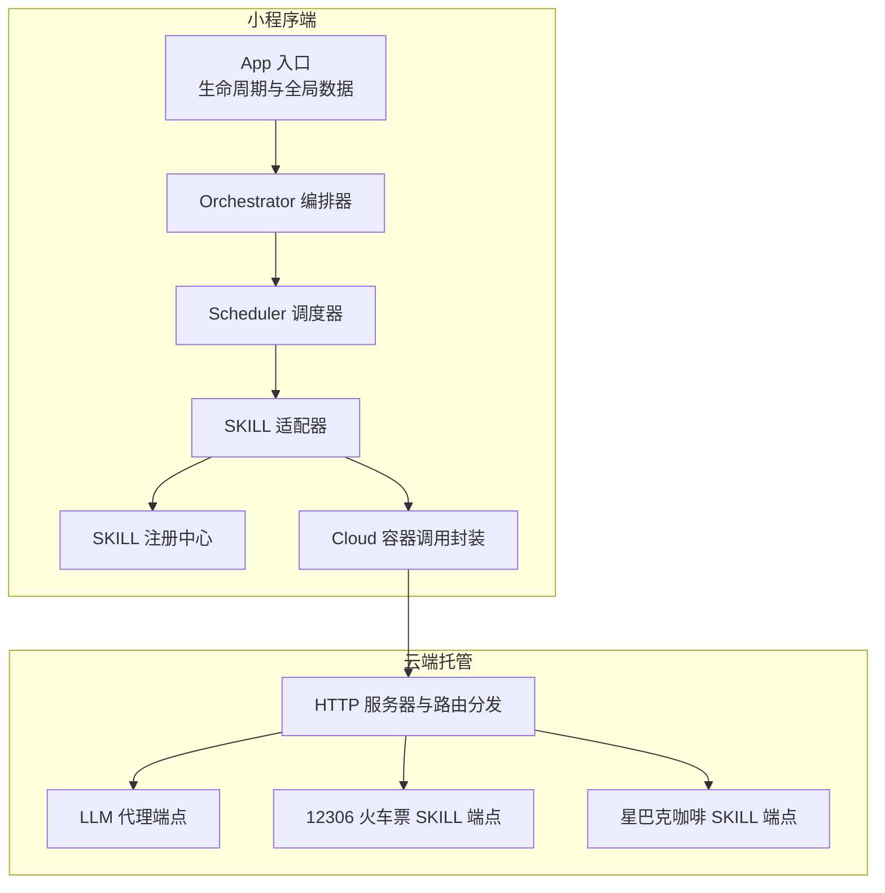

**图示来源**
- [miniprogram/app.ts:23-48](file://miniprogram/app.ts#L23-L48)
- [miniprogram/src/core/orchestrator.ts:119-289](file://miniprogram/src/core/orchestrator.ts#L119-L289)
- [miniprogram/src/core/scheduler.ts:77-131](file://miniprogram/src/core/scheduler.ts#L77-L131)
- [miniprogram/src/skills/adapter.ts:37-85](file://miniprogram/src/skills/adapter.ts#L37-L85)
- [miniprogram/src/skills/registry.ts:16-71](file://miniprogram/src/skills/registry.ts#L16-L71)
- [miniprogram/src/services/cloud.ts:151-241](file://miniprogram/src/services/cloud.ts#L151-L241)
- [cloudrun/src/server.ts:84-170](file://cloudrun/src/server.ts#L84-L170)
- [cloudrun/src/llm-chat.ts:91-184](file://cloudrun/src/llm-chat.ts#L91-L184)
- [cloudrun/src/skill-train.ts:175-231](file://cloudrun/src/skill-train.ts#L175-L231)
- [cloudrun/src/skill-coffee.ts:79-99](file://cloudrun/src/skill-coffee.ts#L79-L99)

**章节来源**
- [miniprogram/app.ts:1-49](file://miniprogram/app.ts#L1-L49)
- [cloudrun/src/server.ts:1-176](file://cloudrun/src/server.ts#L1-L176)

## 核心组件
- 小程序 App 入口：负责微信生命周期、品牌信息注入与 Agent Runtime 懒加载。
- Orchestrator 编排器：状态机驱动的理解-规划-确认-执行-聚合流程。
- Scheduler 调度器：基于 DAG 的任务并行执行、死锁检测、人类确认与级联跳过。
- SKILL 适配器与注册中心：统一入参校验、错误包装、能力元数据暴露。
- Cloud 容器调用封装：统一超时、重试、开发直连与云开发容器调用归一化。
- 云端 HTTP 服务：健康检查、请求体解析、路由分发、标准响应封装。
- LLM 代理：OpenAI 兼容协议转发、上游超时与自适应重试、配置脱敏查询。
- 业务 SKILL 端点：12306 火车票、星巴克咖啡，支持真实数据与确定性模拟双通道。

**章节来源**
- [miniprogram/app.ts:16-48](file://miniprogram/app.ts#L16-L48)
- [miniprogram/src/core/orchestrator.ts:28-48](file://miniprogram/src/core/orchestrator.ts#L28-L48)
- [miniprogram/src/core/scheduler.ts:27-44](file://miniprogram/src/core/scheduler.ts#L27-L44)
- [miniprogram/src/skills/adapter.ts:1-15](file://miniprogram/src/skills/adapter.ts#L1-L15)
- [miniprogram/src/skills/registry.ts:1-11](file://miniprogram/src/skills/registry.ts#L1-L11)
- [miniprogram/src/services/cloud.ts:1-11](file://miniprogram/src/services/cloud.ts#L1-L11)
- [cloudrun/src/server.ts:1-11](file://cloudrun/src/server.ts#L1-L11)
- [cloudrun/src/llm-chat.ts:1-17](file://cloudrun/src/llm-chat.ts#L1-L17)
- [cloudrun/src/skill-train.ts:1-22](file://cloudrun/src/skill-train.ts#L1-L22)
- [cloudrun/src/skill-coffee.ts:1-18](file://cloudrun/src/skill-coffee.ts#L1-L18)

## 架构总览
下图展示从用户输入到外部数据源的端到端调用链，包括开发直连与云开发容器两条路径，以及云端对 LLM 与业务 SKILL 的分发。

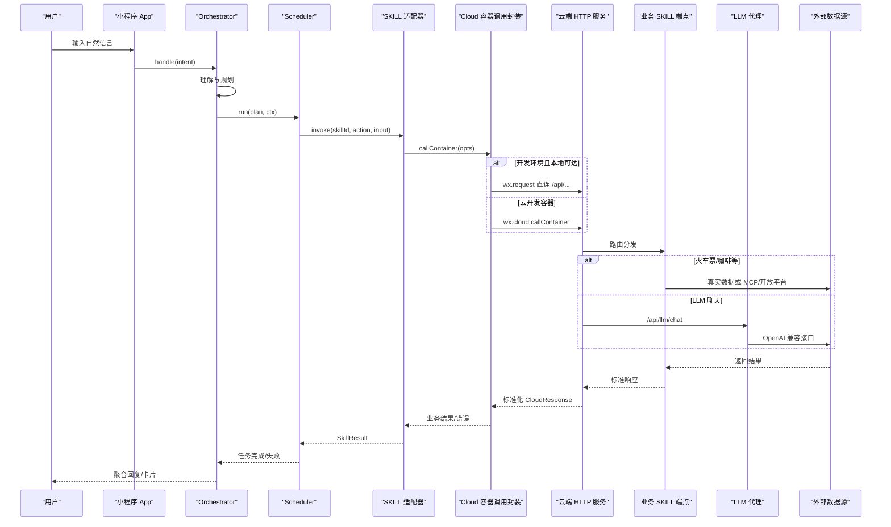

**图示来源**
- [miniprogram/app.ts:23-48](file://miniprogram/app.ts#L23-L48)
- [miniprogram/src/core/orchestrator.ts:119-289](file://miniprogram/src/core/orchestrator.ts#L119-L289)
- [miniprogram/src/core/scheduler.ts:77-131](file://miniprogram/src/core/scheduler.ts#L77-L131)
- [miniprogram/src/skills/adapter.ts:37-85](file://miniprogram/src/skills/adapter.ts#L37-L85)
- [miniprogram/src/services/cloud.ts:151-241](file://miniprogram/src/services/cloud.ts#L151-L241)
- [cloudrun/src/server.ts:84-170](file://cloudrun/src/server.ts#L84-L170)
- [cloudrun/src/llm-chat.ts:91-184](file://cloudrun/src/llm-chat.ts#L91-L184)
- [cloudrun/src/skill-train.ts:175-231](file://cloudrun/src/skill-train.ts#L175-L231)
- [cloudrun/src/skill-coffee.ts:79-99](file://cloudrun/src/skill-coffee.ts#L79-L99)

## 详细组件分析

### 小程序端：App 入口与运行时装配
- 职责：
  - 处理微信生命周期事件，输出轻量启动日志。
  - 在 globalData 中注入品牌信息与懒加载的 Agent Runtime。
- 关键点：
  - 首次访问 globalData.agent 时才构造运行时，避免 onLaunch 耗时过长。
  - 所有可见品牌字符串引用集中定义，禁止硬编码。

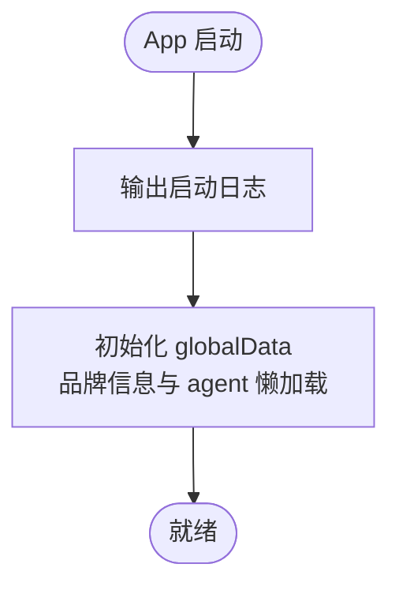

**图示来源**
- [miniprogram/app.ts:23-48](file://miniprogram/app.ts#L23-L48)

**章节来源**
- [miniprogram/app.ts:1-49](file://miniprogram/app.ts#L1-L49)

### 小程序端：Orchestrator 编排器
- 职责：
  - 维护状态机（idle → understanding → planning → confirming_plan → executing → aggregating → completed/failed）。
  - 协调 LLM 理解与规划、人类确认、任务调度与结果聚合。
  - 失败时按反序回滚已成功且可逆的任务。
- 关键机制：
  - 运行令牌（ACTIVE_RUNS）防止旧轮次与新轮次并发冲突。
  - 非法状态转移告警但不阻断（MVP 宽松模式）。
  - 通过回调注入人类确认逻辑，保持 core 层不反向依赖 interaction。

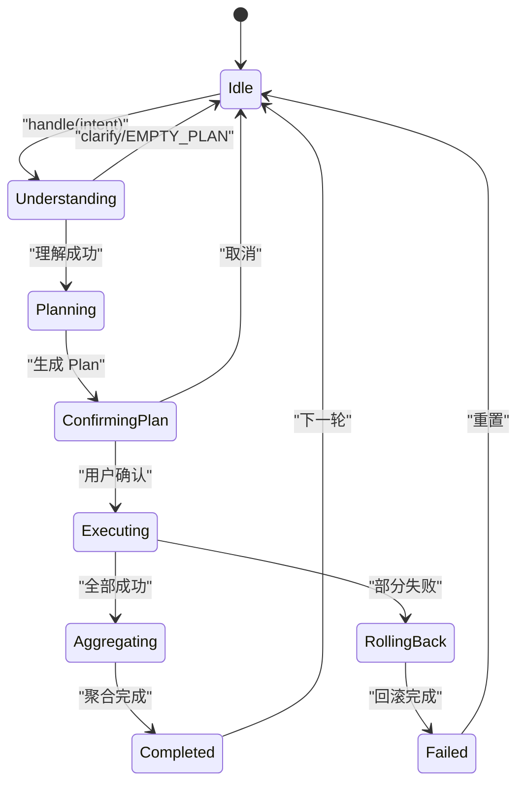

**图示来源**
- [miniprogram/src/core/orchestrator.ts:60-71](file://miniprogram/src/core/orchestrator.ts#L60-L71)
- [miniprogram/src/core/orchestrator.ts:119-289](file://miniprogram/src/core/orchestrator.ts#L119-L289)

**章节来源**
- [miniprogram/src/core/orchestrator.ts:1-376](file://miniprogram/src/core/orchestrator.ts#L1-L376)

### 小程序端：Scheduler 调度器
- 职责：
  - 每轮找出依赖满足且 pending 的任务并并行执行。
  - 检测死锁（无 ready 且仍有 pending）。
  - 写操作需人类确认（序列化弹窗），拒绝则级联跳过下游。
- 关键机制：
  - checkpointChain 保证同一时刻仅一个确认弹窗。
  - isRunActive 令牌失效时中止调度，标记非终态任务为 skipped。
  - 绑定解析（inputBindings）失败时级联跳过依赖该任务的下游。

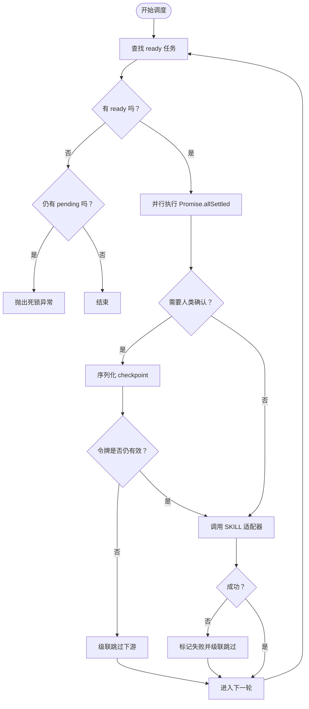

**图示来源**
- [miniprogram/src/core/scheduler.ts:77-131](file://miniprogram/src/core/scheduler.ts#L77-L131)
- [miniprogram/src/core/scheduler.ts:143-208](file://miniprogram/src/core/scheduler.ts#L143-L208)

**章节来源**
- [miniprogram/src/core/scheduler.ts:1-249](file://miniprogram/src/core/scheduler.ts#L1-L249)

### 小程序端：SKILL 适配器与注册中心
- 适配器职责：
  - 根据 skillId 与 action 查找能力元数据。
  - 入参 JSON Schema 校验。
  - 统一错误包装为 SkillError。
  - 记录调用次数与耗时。
- 注册中心职责：
  - 注册/反注册 SKILL。
  - 提供完整元数据与精简版（给 Planner 降低 token 消耗）。
  - 按 (skillId, action) 查询 capability。

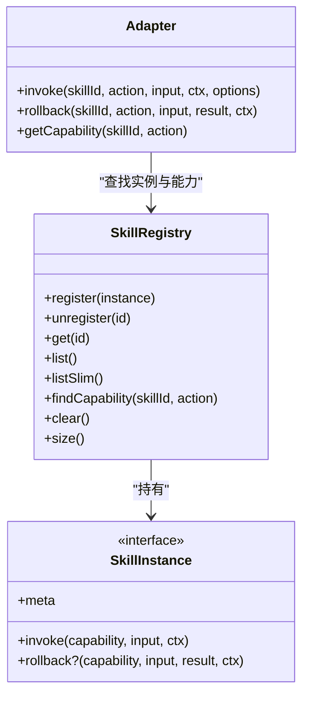

**图示来源**
- [miniprogram/src/skills/registry.ts:16-71](file://miniprogram/src/skills/registry.ts#L16-L71)
- [miniprogram/src/skills/adapter.ts:37-85](file://miniprogram/src/skills/adapter.ts#L37-L85)
- [miniprogram/src/types/skill.d.ts:85-104](file://miniprogram/src/types/skill.d.ts#L85-L104)

**章节来源**
- [miniprogram/src/skills/adapter.ts:1-115](file://miniprogram/src/skills/adapter.ts#L1-L115)
- [miniprogram/src/skills/registry.ts:1-91](file://miniprogram/src/skills/registry.ts#L1-L91)
- [miniprogram/src/types/skill.d.ts:1-119](file://miniprogram/src/types/skill.d.ts#L1-L119)

### 小程序端：Cloud 容器调用封装
- 职责：
  - 统一调用 wx.cloud.callContainer 与开发直连本地 cloudrun 服务。
  - 超时控制、重试策略、错误归一化（CloudNetworkError）。
  - 开发环境 code:-1 降級，release 保留严格失败语义。
- 关键点：
  - normalizeContainerResponse 将空响应与 5xx 转为可重试错误。
  - localRunRequest 在开发环境优先走本地 127.0.0.1:8787。
  - ensureCloudInit 幂等初始化云开发环境。

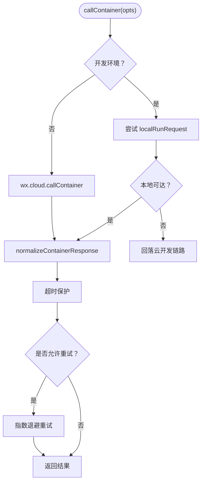

**图示来源**
- [miniprogram/src/services/cloud.ts:86-103](file://miniprogram/src/services/cloud.ts#L86-L103)
- [miniprogram/src/services/cloud.ts:122-148](file://miniprogram/src/services/cloud.ts#L122-L148)
- [miniprogram/src/services/cloud.ts:151-241](file://miniprogram/src/services/cloud.ts#L151-L241)
- [miniprogram/src/services/cloud.ts:284-299](file://miniprogram/src/services/cloud.ts#L284-L299)

**章节来源**
- [miniprogram/src/services/cloud.ts:1-329](file://miniprogram/src/services/cloud.ts#L1-L329)

### 云端：HTTP 服务与路由分发
- 职责：
  - 监听端口、解析 JSON body、健康检查。
  - 路由表由各 handler 模块以 entries 形式贡献。
  - 统一返回标准 JSON 响应。
- 关键点：
  - 开发验证用 /api/dev-log 落盘（受环境变量开关与容量保护）。
  - 请求头萃取 openid 与 sessionId 作为 RequestContext。
  - 错误分类：PAYLOAD_TOO_LARGE、INVALID_JSON、内部错误。

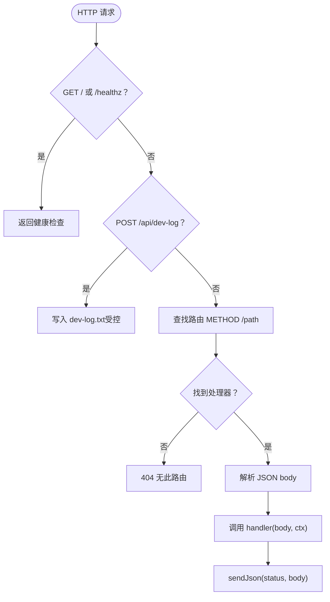

**图示来源**
- [cloudrun/src/server.ts:84-170](file://cloudrun/src/server.ts#L84-L170)

**章节来源**
- [cloudrun/src/server.ts:1-176](file://cloudrun/src/server.ts#L1-L176)
- [cloudrun/src/api.ts:1-64](file://cloudrun/src/api.ts#L1-L64)

### 云端：LLM 代理端点
- 职责：
  - 提供 /api/llm/chat（OpenAI 兼容）与 /api/config（脱敏配置查询）。
  - 环境变量 LLM_BASE_URL、LLM_API_KEY、LLM_MODEL 控制上游。
  - 上游 400 且携带 response_format 时自适应去掉并重试一次。
- 关键点：
  - 上游超时使用 AbortSignal.timeout。
  - 清洗 <think>…</think> 标签，避免污染 planner 解析。
  - 未配置或上游失败返回 503（小程序端视为可重试）。

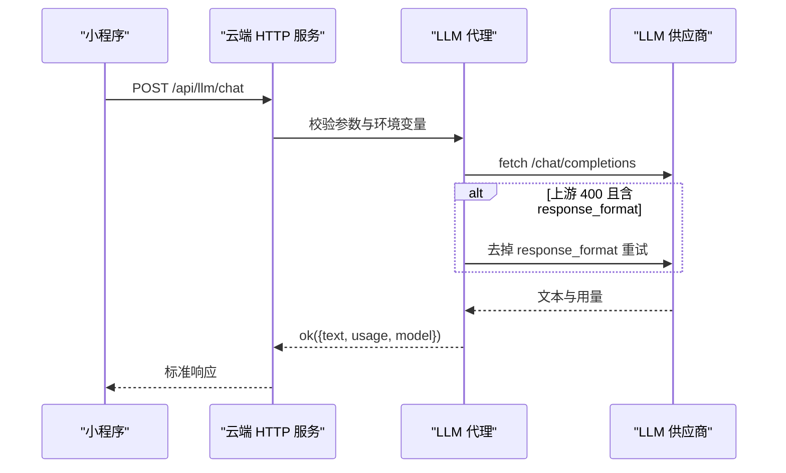

**图示来源**
- [cloudrun/src/llm-chat.ts:91-184](file://cloudrun/src/llm-chat.ts#L91-L184)

**章节来源**
- [cloudrun/src/llm-chat.ts:1-190](file://cloudrun/src/llm-chat.ts#L1-L190)

### 云端：12306 火车票 SKILL 端点
- 职责：
  - 提供 search_train、book_ticket、book_ticket/cancel。
  - 数据源分层：MCP_12306_URL 可用时走真实 12306-mcp；否则回退确定性模拟。
  - 订单内存存储（owner 用于归属鉴权）。
- 关键点：
  - 业务性错误（站名不存在/无线路）透传为业务失败（HTTP 200 + 非 0 code）。
  - 连接层失败（不可达/超时）才降模模拟。
  - 下单金额优先取真实票价，找不到则回退静态价目表。

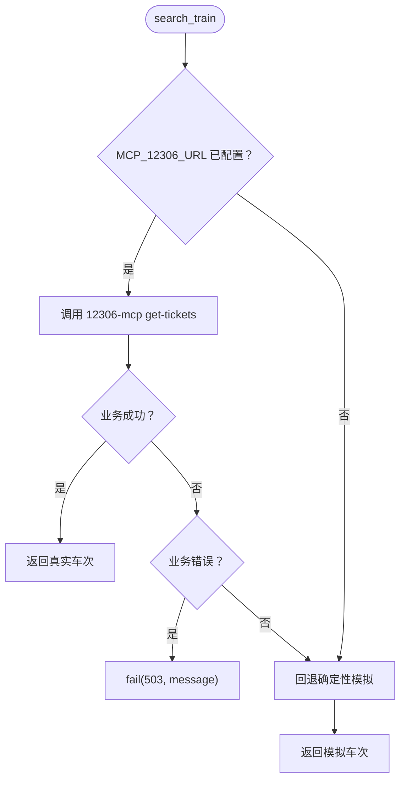

**图示来源**
- [cloudrun/src/skill-train.ts:175-231](file://cloudrun/src/skill-train.ts#L175-L231)

**章节来源**
- [cloudrun/src/skill-train.ts:1-331](file://cloudrun/src/skill-train.ts#L1-L331)

### 云端：星巴克咖啡 SKILL 端点
- 职责：
  - 提供 search_store、place_order、place_order/cancel。
  - 数据源分层：STARBUCKS_* 凭证可用时调用开放平台；否则回退确定性模拟。
  - 订单内存存储（owner 用于归属鉴权）。
- 关键点：
  - 开放平台调用失败或凭证缺失均回退模拟数据。
  - 下单金额按 SKU 单价计算，订单状态 pending_payment。

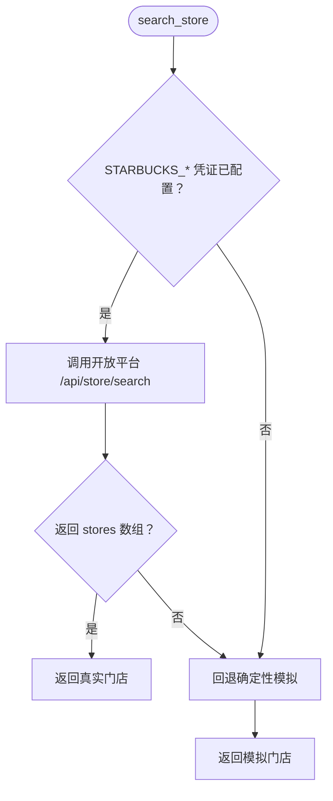

**图示来源**
- [cloudrun/src/skill-coffee.ts:79-99](file://cloudrun/src/skill-coffee.ts#L79-L99)

**章节来源**
- [cloudrun/src/skill-coffee.ts:1-177](file://cloudrun/src/skill-coffee.ts#L1-L177)

## 依赖关系分析
- 小程序端依赖：
  - Orchestrator 依赖 LLM client（理解/规划/聚合）与 Scheduler（任务执行）。
  - Scheduler 依赖 SKILL adapter（统一调用）与 binding 工具（inputBindings 解析）。
  - SKILL adapter 依赖 registry（能力元数据）与 validator（Schema 校验）。
  - Cloud 容器调用封装独立于业务 SKILL，供上层统一调用云端服务。
- 云端依赖：
  - server.ts 聚合 llm-chat、skill-train、skill-coffee、skill-shopping、skill-booking 的路由。
  - api.ts 提供标准响应构建函数（ok/fail/badRequest/unauthorized/forbidden）。

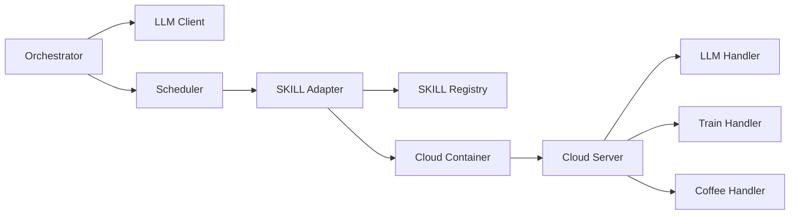

**图示来源**
- [miniprogram/src/core/orchestrator.ts:13-26](file://miniprogram/src/core/orchestrator.ts#L13-L26)
- [miniprogram/src/core/scheduler.ts:18-25](file://miniprogram/src/core/scheduler.ts#L18-L25)
- [miniprogram/src/skills/adapter.ts:13-17](file://miniprogram/src/skills/adapter.ts#L13-L17)
- [miniprogram/src/services/cloud.ts:13-14](file://miniprogram/src/services/cloud.ts#L13-L14)
- [cloudrun/src/server.ts:13-20](file://cloudrun/src/server.ts#L13-L20)

**章节来源**
- [miniprogram/src/core/orchestrator.ts:1-376](file://miniprogram/src/core/orchestrator.ts#L1-L376)
- [miniprogram/src/core/scheduler.ts:1-249](file://miniprogram/src/core/scheduler.ts#L1-L249)
- [miniprogram/src/skills/adapter.ts:1-115](file://miniprogram/src/skills/adapter.ts#L1-L115)
- [miniprogram/src/skills/registry.ts:1-91](file://miniprogram/src/skills/registry.ts#L1-L91)
- [miniprogram/src/services/cloud.ts:1-329](file://miniprogram/src/services/cloud.ts#L1-L329)
- [cloudrun/src/server.ts:1-176](file://cloudrun/src/server.ts#L1-L176)

## 性能与可靠性
- 超时与重试：
  - 小程序端 Cloud 调用默认 15s 超时，最多 3 次重试，指数退避。
  - LLM 代理上游 30s 超时，400 且含 response_format 时自适应重试一次。
- 降级策略：
  - 开发环境优先直连本地 cloudrun，不可达再回落云开发容器。
  - 12306 与星巴克在真实数据不可用时回退确定性模拟，保证演示可用。
  - LLM 未配置或上游失败返回 503，小程序端在开发环境可降为规则式规划器。
- 一致性保障：
  - 写操作必须人类确认（checkpoint 序列化），失败时按反序回滚已成功且可逆任务。
  - 运行令牌（ACTIVE_RUNS）防止旧轮次与新轮次并发冲突。
- 资源保护：
  - 云端请求体上限 1MB，dev-log 落盘上限 50MB，超出即跳过写入。

[本节为通用指导，不直接分析具体文件]

## 故障排查指南
- 小程序端无法调用云端：
  - 检查 isDevEnv 判定与 localRunRequest 连通性（127.0.0.1:8787）。
  - 确认 wx.cloud.init 是否成功（ensureCloudInit），否则 release 环境会抛网络错误。
- LLM 不可用：
  - 查看 /api/config 返回 configured/provider/model/baseUrl。
  - 确认 LLM_BASE_URL 与 LLM_API_KEY 已配置，上游 503 表示暂不可用。
- 火车票查询返回空或业务错误：
  - 若 MCP_12306_URL 已配置但返回业务错误（如站名不存在），不会回退模拟数据。
  - 若 MCP 不可达，会自动回退确定性模拟。
- 咖啡门店搜索为空：
  - 若 STARBUCKS_* 凭证未配置或开放平台返回非预期结构，会回退模拟数据。
- 任务卡死或死锁：
  - 观察 Scheduler 是否检测到死锁（pending 但无人可执行）。
  - 检查 checkpoint 弹窗是否被顶掉导致确认结果丢失（已做序列化互斥）。

**章节来源**
- [miniprogram/src/services/cloud.ts:264-299](file://miniprogram/src/services/cloud.ts#L264-L299)
- [cloudrun/src/llm-chat.ts:61-89](file://cloudrun/src/llm-chat.ts#L61-L89)
- [cloudrun/src/skill-train.ts:186-207](file://cloudrun/src/skill-train.ts#L186-L207)
- [cloudrun/src/skill-coffee.ts:43-72](file://cloudrun/src/skill-coffee.ts#L43-L72)
- [miniprogram/src/core/scheduler.ts:102-114](file://miniprogram/src/core/scheduler.ts#L102-L114)

## 结论
本方案通过小程序端 Orchestrator/Scheduler 与云端 server/handler 的清晰分层，实现了对外部数据源（LLM、12306、星巴克）的安全、可靠与可扩展集成。关键优势包括：
- 安全边界明确：API Key 与服务端逻辑仅在云端，小程序不直连第三方。
- 多环境友好：开发直连本地服务，正式环境走云开发容器。
- 高可用设计：超时、重试、降级与人类确认机制共同保障用户体验与数据一致性。
- 可扩展性强：新增外部数据源只需在云端添加 handler 并在小程序注册 SKILL，即可无缝接入编排与调度体系。

[本节为总结性内容，不直接分析具体文件]