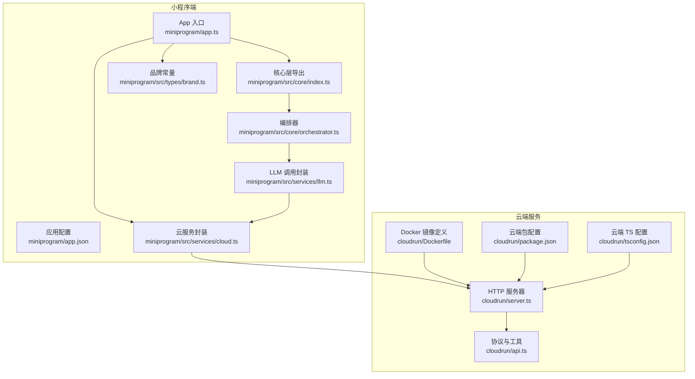
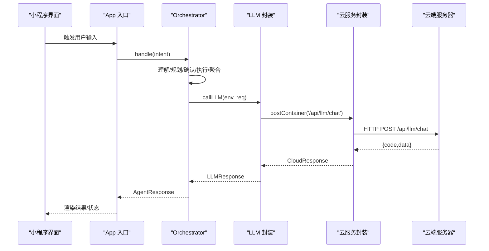
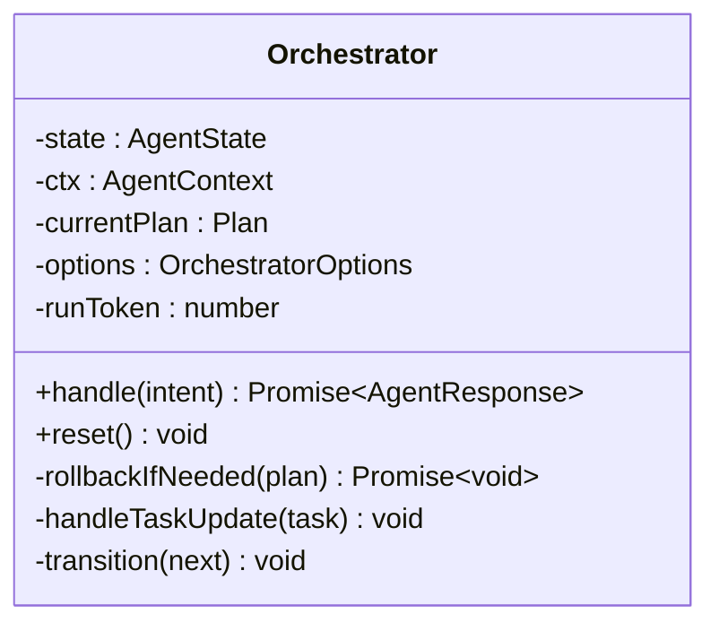
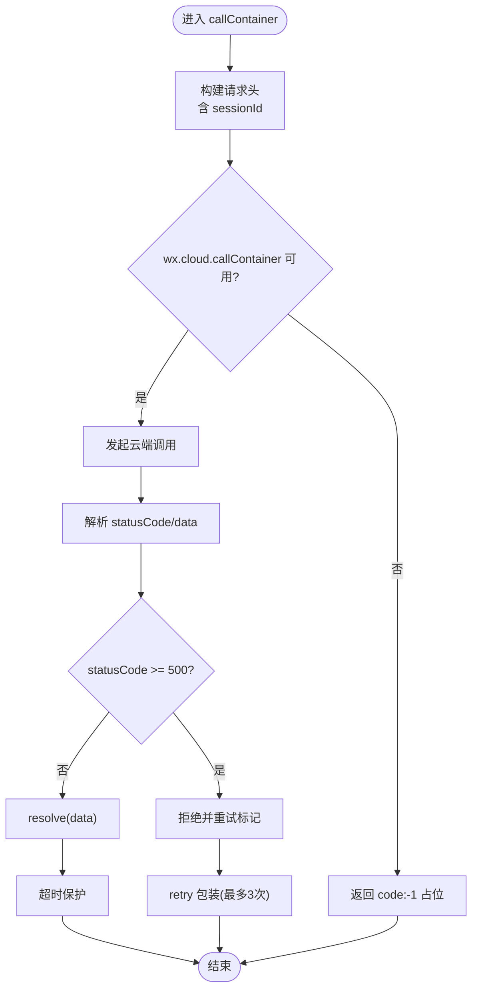
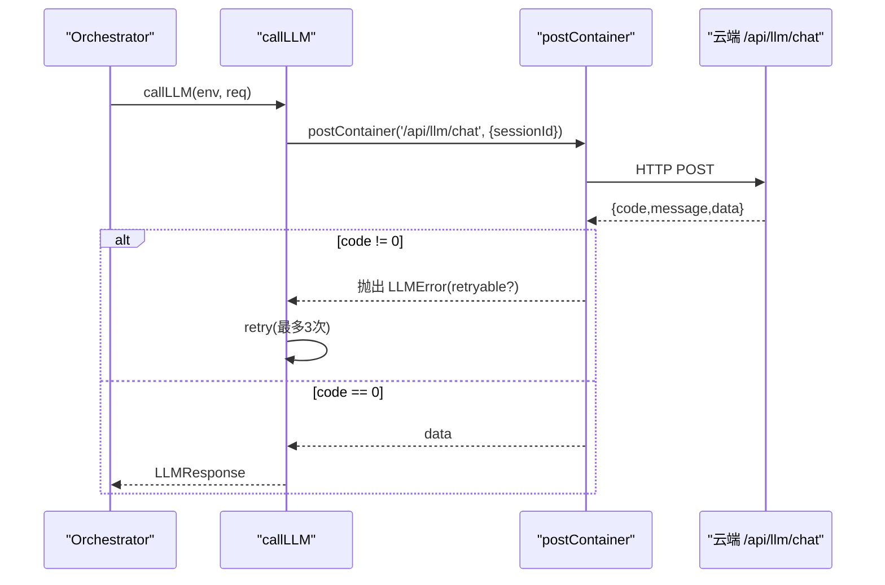
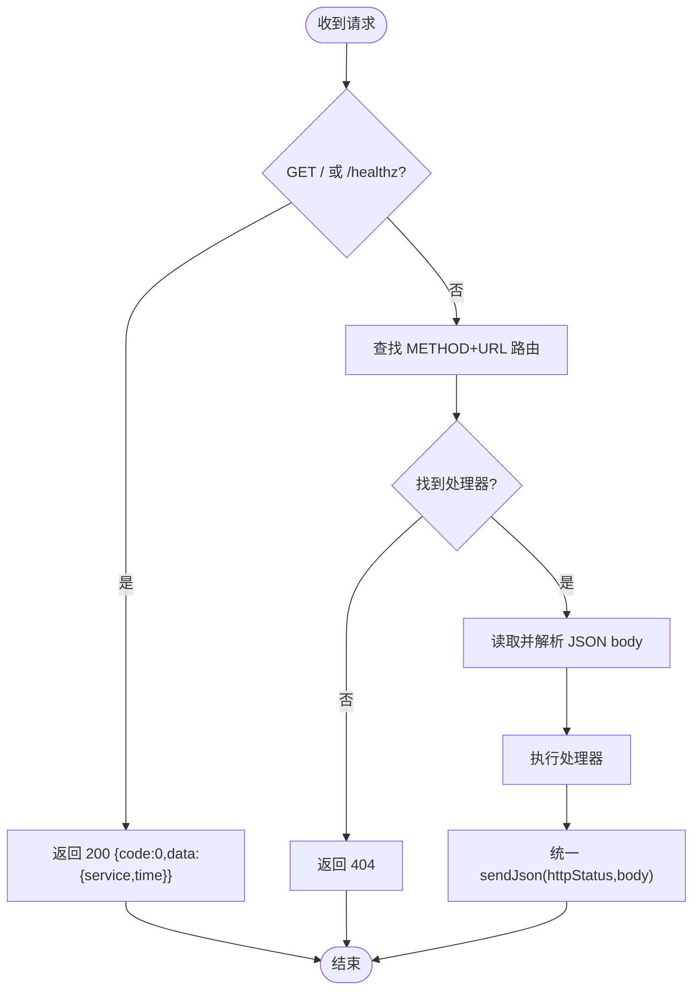
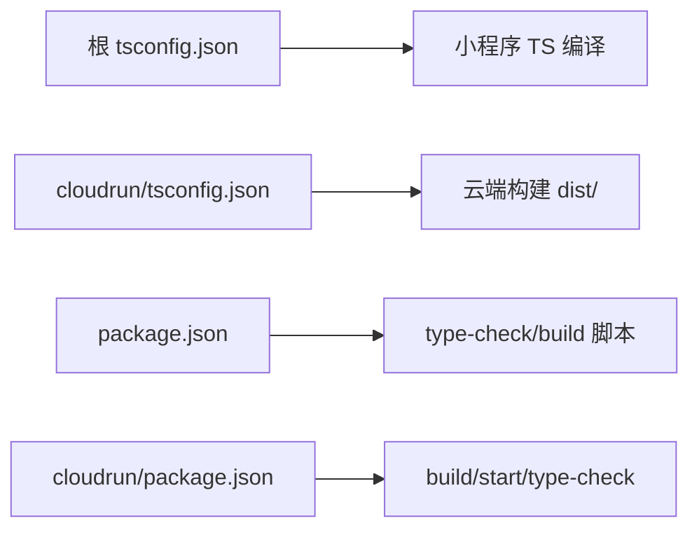

# 开发指南

<cite>
**本文引用的文件**   
- [package.json](file://package.json)
- [project.config.json](file://project.config.json)
- [tsconfig.json](file://tsconfig.json)
- [.gitignore](file://.gitignore)
- [miniprogram/app.ts](file://miniprogram/app.ts)
- [miniprogram/app.json](file://miniprogram/app.json)
- [miniprogram/src/types/brand.ts](file://miniprogram/src/types/brand.ts)
- [miniprogram/src/core/index.ts](file://miniprogram/src/core/index.ts)
- [miniprogram/src/core/orchestrator.ts](file://miniprogram/src/core/orchestrator.ts)
- [miniprogram/src/services/cloud.ts](file://miniprogram/src/services/cloud.ts)
- [miniprogram/src/services/llm.ts](file://miniprogram/src/services/llm.ts)
- [cloudrun/server.ts](file://cloudrun/server.ts)
- [cloudrun/api.ts](file://cloudrun/api.ts)
- [cloudrun/Dockerfile](file://cloudrun/Dockerfile)
- [cloudrun/package.json](file://cloudrun/package.json)
- [cloudrun/tsconfig.json](file://cloudrun/tsconfig.json)
</cite>

## 目录
1. [简介](#简介)
2. [项目结构](#项目结构)
3. [核心组件](#核心组件)
4. [架构总览](#架构总览)
5. [详细组件分析](#详细组件分析)
6. [依赖分析](#依赖分析)
7. [性能考虑](#性能考虑)
8. [故障排查指南](#故障排查指南)
9. [结论](#结论)
10. [附录](#附录)

## 简介
本指南面向 WAIC-WeChat-MiniProgram（MicroMate）项目的开发者，覆盖从环境搭建、代码规范、调试与排错、测试策略、Git 工作流到性能优化与开源贡献的完整流程。项目由微信小程序前端与云托管后端两部分组成：小程序负责用户交互与任务编排，云端容器提供 LLM 代理与各 SKILL 端点。

## 项目结构
仓库采用“小程序 + 云端服务”的双端结构：
- miniprogram：微信小程序工程，包含页面、运行时入口、Agent 编排器、技能注册与服务封装等。
- cloudrun：Node.js 云托管容器服务，零运行时依赖，使用 Node 内建 http/fetch，暴露统一路由表与健康检查。

图示来源
- [miniprogram/app.ts:1-49](file://miniprogram/app.ts#L1-L49)
- [miniprogram/app.json:1-20](file://miniprogram/app.json#L1-L20)
- [miniprogram/src/core/index.ts:1-7](file://miniprogram/src/core/index.ts#L1-L7)
- [miniprogram/src/core/orchestrator.ts:1-340](file://miniprogram/src/core/orchestrator.ts#L1-L340)
- [miniprogram/src/services/cloud.ts:1-223](file://miniprogram/src/services/cloud.ts#L1-L223)
- [miniprogram/src/services/llm.ts:1-83](file://miniprogram/src/services/llm.ts#L1-L83)
- [cloudrun/server.ts:1-129](file://cloudrun/server.ts#L1-L129)
- [cloudrun/api.ts:1-64](file://cloudrun/api.ts#L1-L64)
- [cloudrun/Dockerfile:1-20](file://cloudrun/Dockerfile#L1-L20)
- [cloudrun/package.json:1-17](file://cloudrun/package.json#L1-L17)
- [cloudrun/tsconfig.json:1-19](file://cloudrun/tsconfig.json#L1-L19)

章节来源
- [project.config.json:1-42](file://project.config.json#L1-L42)
- [package.json:1-23](file://package.json#L1-L23)

## 核心组件
- 小程序 App 入口：负责微信生命周期、全局数据注入与 Agent Runtime 懒加载。
- 品牌常量：集中管理品牌名、标语、版本等跨层常量，禁止硬编码。
- 核心层导出：统一对外暴露 context、scheduler、orchestrator。
- Orchestrator 编排器：状态机驱动的任务理解、计划生成、确认、执行、聚合与回滚。
- 云服务封装：统一 wx.cloud.callContainer 调用、超时重试、开发环境降级。
- LLM 调用封装：通过云端代理统一转发多家 LLM，并实现可重试策略。
- 云端 HTTP 服务：健康检查、路由分发、请求体解析与统一响应格式。

章节来源
- [miniprogram/app.ts:1-49](file://miniprogram/app.ts#L1-L49)
- [miniprogram/src/types/brand.ts:1-37](file://miniprogram/src/types/brand.ts#L1-L37)
- [miniprogram/src/core/index.ts:1-7](file://miniprogram/src/core/index.ts#L1-L7)
- [miniprogram/src/core/orchestrator.ts:1-340](file://miniprogram/src/core/orchestrator.ts#L1-L340)
- [miniprogram/src/services/cloud.ts:1-223](file://miniprogram/src/services/cloud.ts#L1-L223)
- [miniprogram/src/services/llm.ts:1-83](file://miniprogram/src/services/llm.ts#L1-L83)
- [cloudrun/server.ts:1-129](file://cloudrun/server.ts#L1-L129)

## 架构总览
下图展示一次用户意图从小程序端到云端服务的完整调用链，包括状态机流转、云端代理与重试机制。

图示来源
- [miniprogram/app.ts:23-47](file://miniprogram/app.ts#L23-L47)
- [miniprogram/src/core/orchestrator.ts:106-256](file://miniprogram/src/core/orchestrator.ts#L106-L256)
- [miniprogram/src/services/llm.ts:57-83](file://miniprogram/src/services/llm.ts#L57-L83)
- [miniprogram/src/services/cloud.ts:64-149](file://miniprogram/src/services/cloud.ts#L64-L149)
- [cloudrun/server.ts:76-123](file://cloudrun/server.ts#L76-L123)

## 详细组件分析

### Orchestrator 编排器（状态机）
- 职责：将自然语言意图转化为可执行的 Plan，协调理解、规划、确认、执行、聚合与失败回滚。
- 关键特性：
  - 明确的状态转移表，防止非法状态跳转导致死锁。
  - 运行令牌（runToken）避免并发多轮对话互相干扰。
  - 失败时按反序撤销已成功且可逆的任务。
  - 与 Scheduler、SkillAdapter、LLM 解耦，回调注入以单向依赖。

图示来源
- [miniprogram/src/core/orchestrator.ts:74-329](file://miniprogram/src/core/orchestrator.ts#L74-L329)

章节来源
- [miniprogram/src/core/orchestrator.ts:1-340](file://miniprogram/src/core/orchestrator.ts#L1-L340)

### 云服务封装（Cloud Container）
- 职责：统一 wx.cloud.callContainer 调用、超时控制、重试策略、开发环境降级与日志埋点。
- 关键点：
  - 默认超时 15s，支持单次独立计时。
  - 开发环境不可用时返回 code:-1 占位，保证本地演示不阻塞。
  - 幂等初始化 ensureCloudInit，避免重复 init。
  - 错误分类为 CloudNetworkError，标记是否可重试。

图示来源
- [miniprogram/src/services/cloud.ts:64-149](file://miniprogram/src/services/cloud.ts#L64-L149)

章节来源
- [miniprogram/src/services/cloud.ts:1-223](file://miniprogram/src/services/cloud.ts#L1-L223)

### LLM 调用封装
- 职责：通过云端代理统一调用多家 LLM，屏蔽 Key 暴露风险，并提供可重入的重试策略。
- 关键点：
  - 对 429/503 等场景进行可重试标记。
  - 外层 retry 避免与内层 cloud.postContainer 嵌套放大。

图示来源
- [miniprogram/src/services/llm.ts:57-83](file://miniprogram/src/services/llm.ts#L57-L83)
- [miniprogram/src/services/cloud.ts:209-223](file://miniprogram/src/services/cloud.ts#L209-L223)
- [cloudrun/server.ts:94-123](file://cloudrun/server.ts#L94-L123)

章节来源
- [miniprogram/src/services/llm.ts:1-83](file://miniprogram/src/services/llm.ts#L1-L83)

### 云端 HTTP 服务
- 职责：监听端口、解析 JSON body、路由分发、健康检查、统一响应格式。
- 关键点：
  - 健康检查 GET / 与 /healthz。
  - 请求体大小限制 1MB，非法 JSON 返回 400。
  - 路由表由各 handler 模块 entries 合并。

图示来源
- [cloudrun/server.ts:76-123](file://cloudrun/server.ts#L76-L123)

章节来源
- [cloudrun/server.ts:1-129](file://cloudrun/server.ts#L1-L129)
- [cloudrun/api.ts:1-64](file://cloudrun/api.ts#L1-L64)

## 依赖分析
- 小程序端依赖 TypeScript 编译插件，启用 ES6、PostCSS、SourceMap 上传等。
- 云端服务仅依赖 Node 内建模组，使用 Node 20 Alpine 镜像，TypeScript 编译输出 CommonJS。
- 根 tsconfig 为小程序侧提供路径别名 @/* 指向 miniprogram/src。

图示来源
- [tsconfig.json:1-23](file://tsconfig.json#L1-L23)
- [cloudrun/tsconfig.json:1-19](file://cloudrun/tsconfig.json#L1-L19)
- [package.json:1-23](file://package.json#L1-L23)
- [cloudrun/package.json:1-17](file://cloudrun/package.json#L1-L17)

章节来源
- [project.config.json:1-42](file://project.config.json#L1-L42)
- [tsconfig.json:1-23](file://tsconfig.json#L1-L23)
- [cloudrun/tsconfig.json:1-19](file://cloudrun/tsconfig.json#L1-L19)
- [package.json:1-23](file://package.json#L1-L23)
- [cloudrun/package.json:1-17](file://cloudrun/package.json#L1-L17)

## 性能考虑
- 小程序启动优化：
  - onLaunch 保持轻量，避免超过 100ms 触发基础库警告；Agent Runtime 懒加载至首次使用时构造。
  - 启用 SourceMap 上传便于线上问题定位。
- 网络与重试：
  - 云端调用默认 15s 超时，配合指数退避重试（最多 3 次），避免瞬时抖动影响体验。
  - 开发环境自动降级为 code:-1，减少本地演示时的阻塞。
- 云端服务：
  - 零运行时依赖，Alpine 镜像体积小，冷启动更快。
  - 健康检查接口供云托管探活，提升部署稳定性。
- 资源与体积：
  - 小程序开启 WXSS/WXML 压缩，减少包体。
  - 云端 Docker 构建阶段缓存依赖层，加速 CI/CD。

[本节为通用指导，无需列出具体文件来源]

## 故障排查指南
- 小程序调试：
  - 在开发者工具中开启 SourceMap 上传，结合日志输出定位异常。
  - 关注 onLaunch/onShow/onHide 的生命周期日志，确保无阻塞逻辑。
- 云端服务调试：
  - 查看 stdout 日志（server.ts 统一 log），核对请求方法与路径是否命中路由。
  - 健康检查 GET / 或 /healthz 应返回 200 与业务信息。
- 常见错误：
  - 请求体过大：服务端返回 413，需减小 payload 或拆分请求。
  - 非法 JSON：服务端返回 400，检查客户端序列化。
  - 云端不可用：小程序端在开发环境会降级为 code:-1，确认是否为预期路径。
- 日志分析：
  - 小程序端通过 utils/logger 输出 info/warn/error。
  - 云端通过 server.ts 的 log 函数输出带时间戳的统一日志。

章节来源
- [miniprogram/app.ts:23-47](file://miniprogram/app.ts#L23-L47)
- [miniprogram/src/services/cloud.ts:151-207](file://miniprogram/src/services/cloud.ts#L151-L207)
- [cloudrun/server.ts:29-32](file://cloudrun/server.ts#L29-L32)
- [cloudrun/server.ts:105-123](file://cloudrun/server.ts#L105-L123)

## 结论
本项目以 Orchestrator 为核心，串联小程序端与云端服务，形成完整的 AI 助理任务编排链路。通过严格的类型系统、统一的错误处理与重试策略、以及清晰的职责分层，项目在可维护性与可扩展性上具备良好基础。建议持续完善单元测试与集成测试，并在 CI 中固化类型检查与构建流程。

[本节为总结性内容，无需列出具体文件来源]

## 附录

### 开发环境搭建
- 前置条件：
  - Node.js 14.17+（满足 TypeScript 引擎要求）。
  - 微信开发者工具（启用 TypeScript 编译器插件）。
- 安装依赖：
  - 根目录与 cloudrun 子目录分别执行依赖安装。
- 项目配置：
  - project.config.json 已启用 TypeScript 编译插件、ES6、PostCSS、SourceMap 上传等。
  - 小程序根目录为 miniprogram/，云端服务监听 PORT 环境变量（默认 80）。

章节来源
- [package.json:19-21](file://package.json#L19-L21)
- [project.config.json:4-18](file://project.config.json#L4-L18)
- [cloudrun/Dockerfile:17-19](file://cloudrun/Dockerfile#L17-L19)

### 代码规范与最佳实践
- TypeScript 编码约定：
  - 严格模式、严格空值检查、强制一致的文件命名大小写。
  - 小程序侧启用 isolatedModules，云端侧 target ES2022、module CommonJS。
- 命名规范：
  - 品牌相关常量统一从 brand.ts 导入，禁止硬编码。
  - 错误类命名清晰表达语义（如 CloudNetworkError、LLMError）。
- 文件组织：
  - 小程序 src 下按 core/interaction/llm/services/skills/storage/types/utils 分层。
  - 云端 src 下按 api.ts、server.ts 与各 handler 模块划分。

章节来源
- [miniprogram/src/types/brand.ts:1-37](file://miniprogram/src/types/brand.ts#L1-L37)
- [tsconfig.json:2-22](file://tsconfig.json#L2-L22)
- [cloudrun/tsconfig.json:2-17](file://cloudrun/tsconfig.json#L2-L17)

### 调试技巧与问题排查
- 小程序端：
  - 使用 logger 输出关键节点日志，避免在 onLaunch 中进行耗时操作。
  - 利用 isDevEnv 判断开发环境，合理降级与提示。
- 云端服务：
  - 通过 healthz 探活验证服务可用性。
  - 捕获 PAYLOAD_TOO_LARGE 与 INVALID_JSON 并返回明确状态码。

章节来源
- [miniprogram/app.ts:23-47](file://miniprogram/app.ts#L23-L47)
- [miniprogram/src/services/cloud.ts:172-182](file://miniprogram/src/services/cloud.ts#L172-L182)
- [cloudrun/server.ts:84-92](file://cloudrun/server.ts#L84-L92)
- [cloudrun/server.ts:110-122](file://cloudrun/server.ts#L110-L122)

### 测试策略与单元测试编写指南
- 目标：
  - 覆盖 Orchestrator 状态机转移、Scheduler 调度、SkillAdapter 适配与云端调用重试。
- 建议：
  - 对 Orchestrator 使用 mock confirmPlan/checkpoint 回调，验证各分支。
  - 对 services/cloud.ts 与 services/llm.ts 模拟 wx.cloud.callContainer 与网络错误。
  - 对云端 server.ts 使用 HTTP 客户端发送请求，校验路由与响应格式。

[本节为通用指导，无需列出具体文件来源]

### Git 工作流程与提交规范
- 分支策略：
  - 主分支保护，功能开发基于 feature/* 分支，合并前完成类型检查与构建。
- 提交规范：
  - 提交信息遵循约定式提交（如 feat/fix/docs/chore 等前缀）。
  - 变更涉及品牌常量时需同步更新 app.json、package.json、project.config.json 等位置。

章节来源
- [.gitignore:1-30](file://.gitignore#L1-L30)
- [miniprogram/src/types/brand.ts:9-14](file://miniprogram/src/types/brand.ts#L9-L14)

### 性能分析与优化建议
- 小程序端：
  - 保持 onLaunch 轻量，延迟初始化 Agent Runtime。
  - 合理使用 lazyCodeLoading 按需加载组件。
- 云端服务：
  - 使用 Alpine 镜像减少体积，缩短冷启动时间。
  - 路由处理器尽量无状态，避免长连接占用。

章节来源
- [miniprogram/app.ts:23-47](file://miniprogram/app.ts#L23-L47)
- [miniprogram/app.json:12-13](file://miniprogram/app.json#L12-L13)
- [cloudrun/Dockerfile:1-19](file://cloudrun/Dockerfile#L1-L19)

### 开源贡献指南
- Issue 提交：
  - 描述复现步骤、期望行为与实际行为，附带必要日志与环境信息。
- Pull Request 流程：
  - 小步提交、清晰描述变更动机与影响范围。
  - 确保 type-check 与 build 通过。
- 代码审查标准：
  - 类型安全、错误处理完备、日志适度、无硬编码品牌字符串。
  - 新增能力需补充相应测试用例。

[本节为通用指导，无需列出具体文件来源]