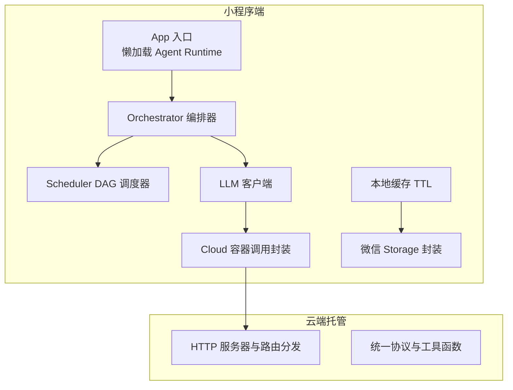
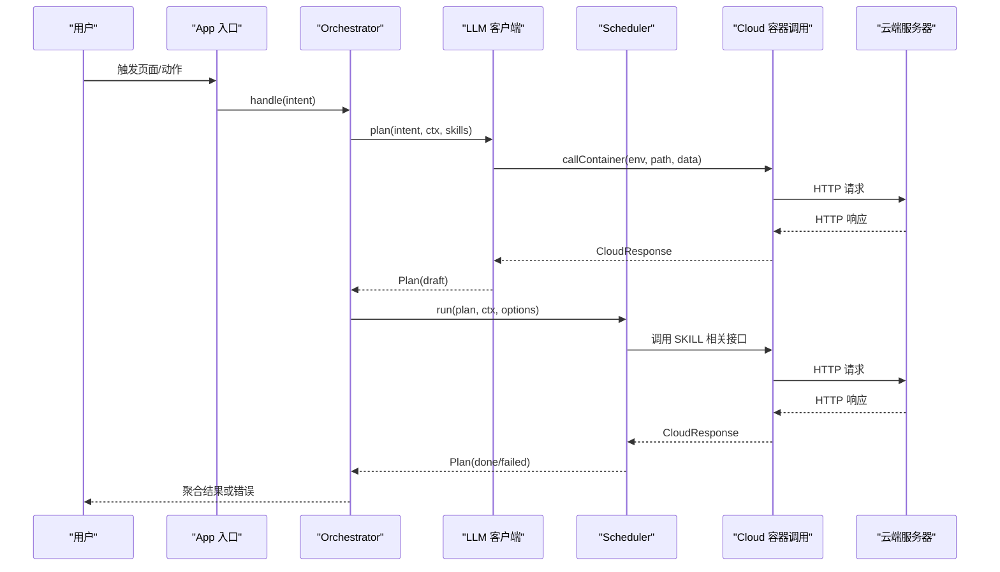
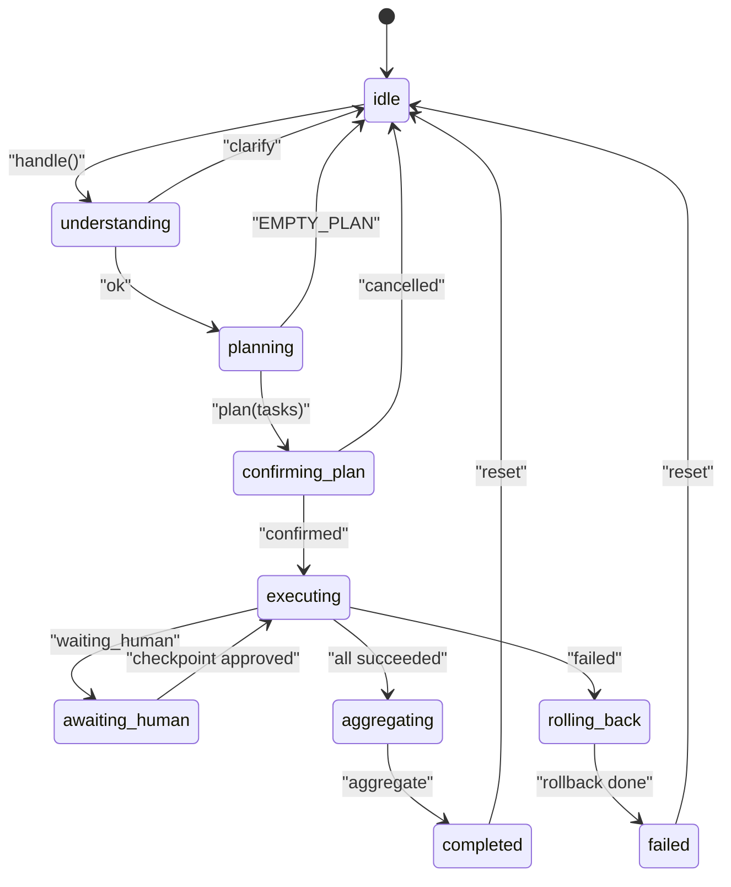
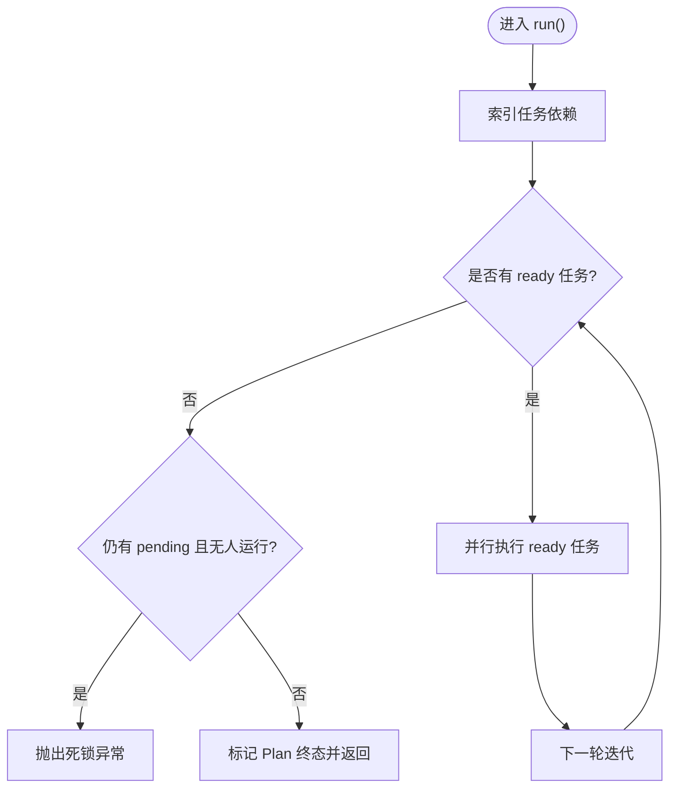
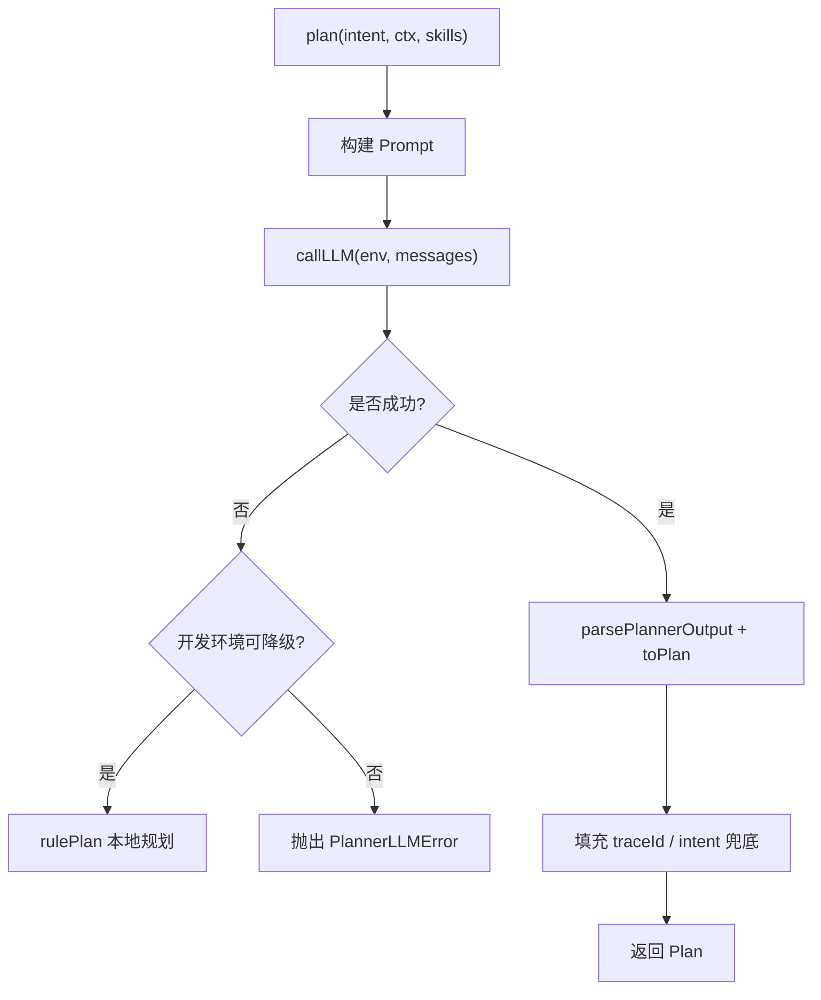
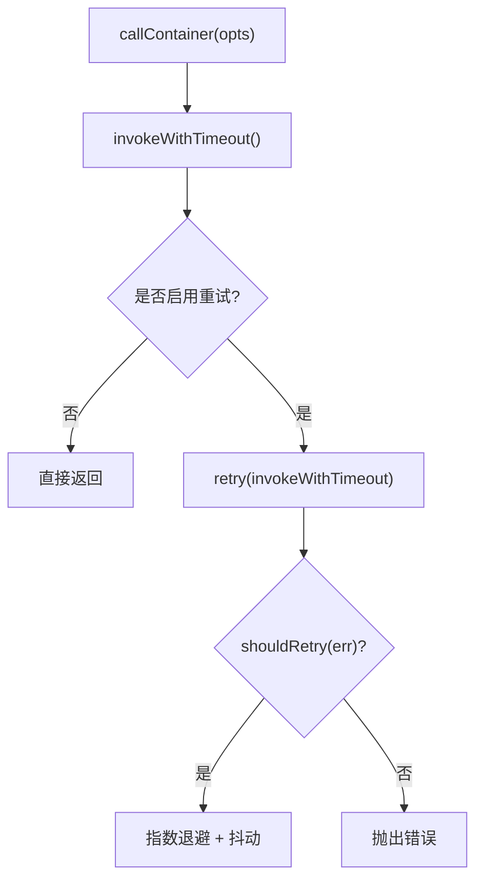
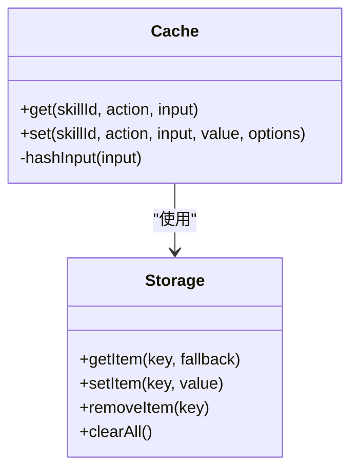
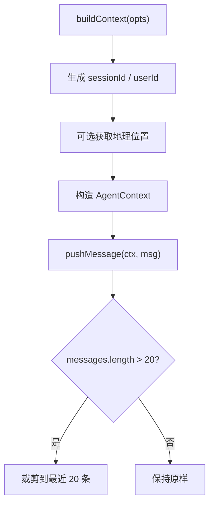
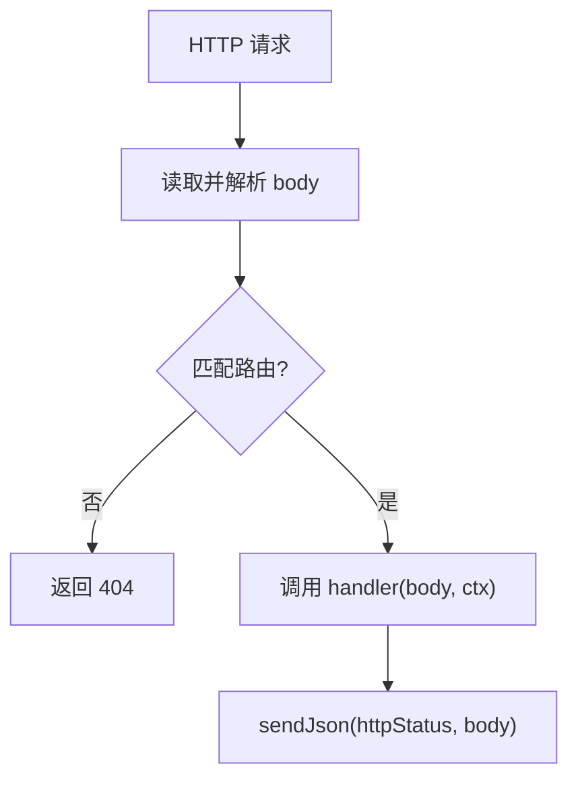
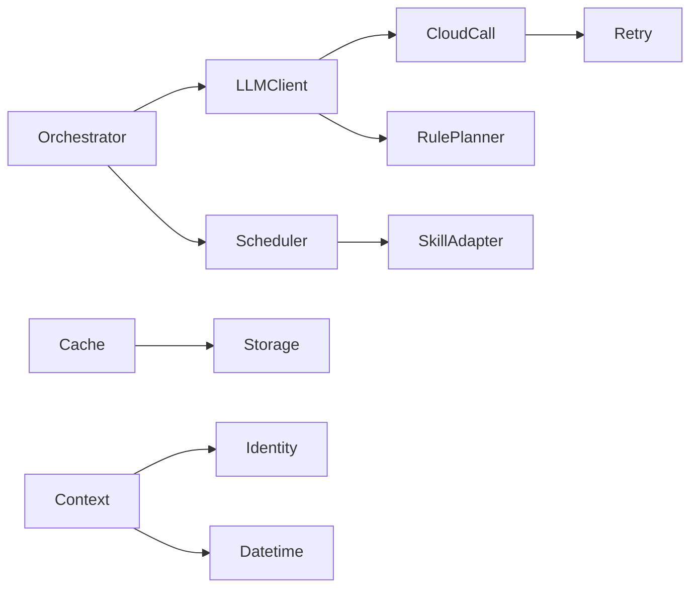

# 性能优化

<cite>
**本文引用的文件**   
- [miniprogram/app.ts](file://miniprogram/app.ts)
- [miniprogram/src/core/scheduler.ts](file://miniprogram/src/core/scheduler.ts)
- [miniprogram/src/core/orchestrator.ts](file://miniprogram/src/core/orchestrator.ts)
- [miniprogram/src/core/context.ts](file://miniprogram/src/core/context.ts)
- [miniprogram/src/llm/client.ts](file://miniprogram/src/llm/client.ts)
- [miniprogram/src/storage/cache.ts](file://miniprogram/src/storage/cache.ts)
- [miniprogram/src/services/cloud.ts](file://miniprogram/src/services/cloud.ts)
- [miniprogram/src/services/storage.ts](file://miniprogram/src/services/storage.ts)
- [miniprogram/src/utils/retry.ts](file://miniprogram/src/utils/retry.ts)
- [cloudrun/src/server.ts](file://cloudrun/src/server.ts)
- [cloudrun/src/api.ts](file://cloudrun/src/api.ts)
</cite>

## 目录
1. [引言](#引言)
2. [项目结构](#项目结构)
3. [核心组件](#核心组件)
4. [架构总览](#架构总览)
5. [详细组件分析](#详细组件分析)
6. [依赖关系分析](#依赖关系分析)
7. [性能优化指南](#性能优化指南)
8. [监控与分析](#监控与分析)
9. [故障排查](#故障排查)
10. [结论](#结论)

## 引言
本文面向 WAIC-WeChat-MiniProgram，提供从“小程序端 → Agent 运行时 → 云端服务”的全链路性能优化指南。重点覆盖：
- 小程序端页面渲染、内存与网络请求优化
- Agent 运行时的 DAG 调度、并发控制与资源管理
- 缓存策略（本地缓存、会话缓存、数据预加载）
- 云端服务的数据库查询、API 响应时间与资源使用优化
- 性能监控指标与关键埋点

## 项目结构
本项目由小程序端与云端托管两部分组成：
- 小程序端负责用户交互、Agent 编排、DAG 调度、SKILL 调用、缓存与会话存储
- 云端托管服务负责 LLM 路由、技能接口与健康检查

图表来源
- [miniprogram/app.ts:23-47](file://miniprogram/app.ts#L23-L47)
- [miniprogram/src/core/orchestrator.ts:73-89](file://miniprogram/src/core/orchestrator.ts#L73-L89)
- [miniprogram/src/core/scheduler.ts:76-128](file://miniprogram/src/core/scheduler.ts#L76-L128)
- [miniprogram/src/llm/client.ts:56-120](file://miniprogram/src/llm/client.ts#L56-L120)
- [miniprogram/src/services/cloud.ts:64-149](file://miniprogram/src/services/cloud.ts#L64-L149)
- [cloudrun/src/server.ts:76-128](file://cloudrun/src/server.ts#L76-L128)
- [cloudrun/src/api.ts:10-32](file://cloudrun/src/api.ts#L10-L32)

章节来源
- [miniprogram/app.ts:1-49](file://miniprogram/app.ts#L1-L49)
- [cloudrun/src/server.ts:1-129](file://cloudrun/src/server.ts#L1-L129)

## 核心组件
- App 入口：轻量启动，懒加载 Agent Runtime，避免 onLaunch 阻塞
- Orchestrator：状态机编排理解→规划→确认→执行→聚合→完成/失败
- Scheduler：DAG 任务调度，并行 ready 任务，死锁检测，人类确认序列化
- LLM 客户端：计划生成、意图识别、结果聚合，开发环境降级
- Cloud 容器调用：超时、重试、错误归一化、开发环境降级
- 本地缓存：TTL 缓存 SKILL 结果，减少重复调用
- Storage 封装：同步读写微信 Storage，安全 JSON 序列化
- Context 构造：会话、身份、位置、追踪信息

章节来源
- [miniprogram/src/core/orchestrator.ts:73-89](file://miniprogram/src/core/orchestrator.ts#L73-L89)
- [miniprogram/src/core/scheduler.ts:76-128](file://miniprogram/src/core/scheduler.ts#L76-L128)
- [miniprogram/src/llm/client.ts:56-120](file://miniprogram/src/llm/client.ts#L56-L120)
- [miniprogram/src/services/cloud.ts:64-149](file://miniprogram/src/services/cloud.ts#L64-L149)
- [miniprogram/src/storage/cache.ts:35-52](file://miniprogram/src/storage/cache.ts#L35-L52)
- [miniprogram/src/services/storage.ts:12-34](file://miniprogram/src/services/storage.ts#L12-L34)
- [miniprogram/src/core/context.ts:60-91](file://miniprogram/src/core/context.ts#L60-L91)

## 架构总览
下图展示一次完整请求的时序：用户输入 → Orchestrator 编排 → LLM 规划 → Scheduler 执行 → 云端容器调用 → 结果聚合。

图表来源
- [miniprogram/src/core/orchestrator.ts:106-221](file://miniprogram/src/core/orchestrator.ts#L106-L221)
- [miniprogram/src/llm/client.ts:56-120](file://miniprogram/src/llm/client.ts#L56-L120)
- [miniprogram/src/core/scheduler.ts:76-128](file://miniprogram/src/core/scheduler.ts#L76-L128)
- [miniprogram/src/services/cloud.ts:64-149](file://miniprogram/src/services/cloud.ts#L64-L149)
- [cloudrun/src/server.ts:76-128](file://cloudrun/src/server.ts#L76-L128)

## 详细组件分析

### Orchestrator 编排器
- 职责：状态机流转、Plan 生命周期、任务更新联动、回滚策略
- 并发控制：BUSY 守卫防止多轮并发；runToken 令牌使在途流程失效
- 错误处理：区分 PlannerLLMError、SchedulerDeadlockError，并做回滚与状态归位

图表来源
- [miniprogram/src/core/orchestrator.ts:60-71](file://miniprogram/src/core/orchestrator.ts#L60-L71)
- [miniprogram/src/core/orchestrator.ts:106-221](file://miniprogram/src/core/orchestrator.ts#L106-L221)

章节来源
- [miniprogram/src/core/orchestrator.ts:73-340](file://miniprogram/src/core/orchestrator.ts#L73-L340)

### Scheduler DAG 调度器
- 职责：按依赖找出 ready 任务，Promise.allSettled 并行执行，迭代至终态
- 并发控制：同一时刻仅一个 checkpoint 弹窗（序列化链），避免 UI 冲突
- 死锁检测：无 ready 且仍有 pending 则抛出死锁异常
- 级联跳过：失败任务下游全部标记 skipped

图表来源
- [miniprogram/src/core/scheduler.ts:76-128](file://miniprogram/src/core/scheduler.ts#L76-L128)
- [miniprogram/src/core/scheduler.ts:130-137](file://miniprogram/src/core/scheduler.ts#L130-L137)
- [miniprogram/src/core/scheduler.ts:229-240](file://miniprogram/src/core/scheduler.ts#L229-L240)

章节来源
- [miniprogram/src/core/scheduler.ts:1-245](file://miniprogram/src/core/scheduler.ts#L1-L245)

### LLM 客户端
- 职责：构建 Prompt、调用云端 LLM、解析输出、兜底规则规划
- 降级策略：开发环境下云端不可用自动降级为本地规则式规划器
- 追踪指标：记录 llmCalls、totalTokens、traceId

图表来源
- [miniprogram/src/llm/client.ts:56-120](file://miniprogram/src/llm/client.ts#L56-L120)
- [miniprogram/src/llm/client.ts:128-134](file://miniprogram/src/llm/client.ts#L128-L134)
- [miniprogram/src/llm/client.ts:142-153](file://miniprogram/src/llm/client.ts#L142-L153)

章节来源
- [miniprogram/src/llm/client.ts:1-153](file://miniprogram/src/llm/client.ts#L1-L153)

### Cloud 容器调用封装
- 职责：统一 wx.cloud.callContainer 调用、超时、重试、错误归一化
- 开发环境降级：code:-1 占位码，保证本地演示
- 重试策略：指数退避 + 抖动，最大尝试次数默认 3

图表来源
- [miniprogram/src/services/cloud.ts:64-149](file://miniprogram/src/services/cloud.ts#L64-L149)
- [miniprogram/src/utils/retry.ts:42-85](file://miniprogram/src/utils/retry.ts#L42-L85)

章节来源
- [miniprogram/src/services/cloud.ts:1-223](file://miniprogram/src/services/cloud.ts#L1-L223)
- [miniprogram/src/utils/retry.ts:1-101](file://miniprogram/src/utils/retry.ts#L1-L101)

### 本地缓存与会话存储
- 本地缓存：基于 skillId + action + input hash 的 TTL 缓存，默认 5 分钟
- 会话存储：wx.setStorageSync 同步封装，JSON 序列化与安全错误处理

图表来源
- [miniprogram/src/storage/cache.ts:35-52](file://miniprogram/src/storage/cache.ts#L35-L52)
- [miniprogram/src/services/storage.ts:12-34](file://miniprogram/src/services/storage.ts#L12-L34)

章节来源
- [miniprogram/src/storage/cache.ts:1-57](file://miniprogram/src/storage/cache.ts#L1-L57)
- [miniprogram/src/services/storage.ts:1-62](file://miniprogram/src/services/storage.ts#L1-L62)

### 上下文与追踪
- 上下文构造：sessionId、userId、userProfile、globals、messages、trace
- 消息历史限制：保留最近 20 条，防止内存膨胀

图表来源
- [miniprogram/src/core/context.ts:60-91](file://miniprogram/src/core/context.ts#L60-L91)
- [miniprogram/src/core/context.ts:94-104](file://miniprogram/src/core/context.ts#L94-L104)

章节来源
- [miniprogram/src/core/context.ts:1-104](file://miniprogram/src/core/context.ts#L1-L104)

### 云端服务器
- 职责：监听端口、解析 JSON body、路由分发、健康检查
- 错误处理：PAYLOAD_TOO_LARGE、INVALID_JSON、内部错误

图表来源
- [cloudrun/src/server.ts:76-128](file://cloudrun/src/server.ts#L76-L128)
- [cloudrun/src/api.ts:10-32](file://cloudrun/src/api.ts#L10-L32)

章节来源
- [cloudrun/src/server.ts:1-129](file://cloudrun/src/server.ts#L1-L129)
- [cloudrun/src/api.ts:1-64](file://cloudrun/src/api.ts#L1-L64)

## 依赖关系分析
- Orchestrator 依赖 LLM 客户端与 Scheduler
- Scheduler 依赖 Skills Adapter（通过 adapter.invoke）与 Checkpoint 回调
- LLM 客户端依赖 Cloud 容器调用与 Rule Planner
- Cloud 容器调用依赖 utils/retry 与 logger
- 缓存依赖 Storage 封装
- Context 依赖 identity 与 datetime 工具

图表来源
- [miniprogram/src/core/orchestrator.ts:13-26](file://miniprogram/src/core/orchestrator.ts#L13-L26)
- [miniprogram/src/core/scheduler.ts:18-26](file://miniprogram/src/core/scheduler.ts#L18-L26)
- [miniprogram/src/llm/client.ts:9-18](file://miniprogram/src/llm/client.ts#L9-L18)
- [miniprogram/src/services/cloud.ts:13-14](file://miniprogram/src/services/cloud.ts#L13-L14)
- [miniprogram/src/storage/cache.ts:11-11](file://miniprogram/src/storage/cache.ts#L11-L11)
- [miniprogram/src/core/context.ts:14-18](file://miniprogram/src/core/context.ts#L14-L18)

章节来源
- [miniprogram/src/core/orchestrator.ts:1-340](file://miniprogram/src/core/orchestrator.ts#L1-L340)
- [miniprogram/src/core/scheduler.ts:1-245](file://miniprogram/src/core/scheduler.ts#L1-L245)
- [miniprogram/src/llm/client.ts:1-153](file://miniprogram/src/llm/client.ts#L1-L153)
- [miniprogram/src/services/cloud.ts:1-223](file://miniprogram/src/services/cloud.ts#L1-L223)
- [miniprogram/src/storage/cache.ts:1-57](file://miniprogram/src/storage/cache.ts#L1-L57)
- [miniprogram/src/core/context.ts:1-104](file://miniprogram/src/core/context.ts#L1-L104)

## 性能优化指南

### 小程序端优化
- 页面渲染优化
  - 将复杂计算与网络请求下沉至后台逻辑，避免主线程阻塞
  - 使用懒加载与按需初始化，如 App 入口中的懒加载 Agent Runtime
  - 减少频繁 setData 的数据量，合并更新，避免大对象直传
- 内存管理
  - 限制消息历史长度，避免无限增长（已有实现保留最近 20 条）
  - 及时释放不再使用的对象引用，避免全局变量长期持有大对象
  - 谨慎使用长生命周期缓存，合理设置 TTL，避免占用过多存储空间
- 网络请求优化
  - 统一超时与重试策略，避免雪崩与长时间阻塞
  - 开发环境降级，确保本地演示流畅，不影响正式环境行为
  - 复用连接与减少冗余请求，结合缓存降低云端压力

章节来源
- [miniprogram/app.ts:23-47](file://miniprogram/app.ts#L23-L47)
- [miniprogram/src/core/context.ts:94-104](file://miniprogram/src/core/context.ts#L94-L104)
- [miniprogram/src/services/cloud.ts:123-149](file://miniprogram/src/services/cloud.ts#L123-L149)
- [miniprogram/src/services/cloud.ts:172-182](file://miniprogram/src/services/cloud.ts#L172-L182)

### Agent 运行时优化
- DAG 调度优化
  - 优先并行执行 ready 任务，缩短整体耗时
  - 死锁检测与级联跳过，避免无效等待
  - 人类确认序列化，避免 UI 弹窗冲突
- 并发控制
  - BUSY 守卫与 runToken 令牌，防止多轮并发与交弹窗
  - reset 强制归位，清理在途流程
- 资源管理
  - 限制日志与追踪信息大小，避免内存泄漏
  - 合理配置重试与超时，避免资源长时间占用

章节来源
- [miniprogram/src/core/scheduler.ts:76-128](file://miniprogram/src/core/scheduler.ts#L76-L128)
- [miniprogram/src/core/scheduler.ts:139-204](file://miniprogram/src/core/scheduler.ts#L139-L204)
- [miniprogram/src/core/orchestrator.ts:106-118](file://miniprogram/src/core/orchestrator.ts#L106-L118)
- [miniprogram/src/core/orchestrator.ts:258-270](file://miniprogram/src/core/orchestrator.ts#L258-L270)

### 缓存策略设计与实现
- 本地缓存
  - 基于 skillId + action + input hash 的 TTL 缓存，默认 5 分钟
  - 适合读多写少、结果稳定的场景
- 会话缓存
  - 使用 wx.setStorageSync 同步封装，保证数据安全与错误隔离
- 数据预加载
  - 在用户可能触发的路径提前加载常用数据，减少首屏延迟
  - 结合懒加载与条件判断，避免不必要的预取

章节来源
- [miniprogram/src/storage/cache.ts:35-52](file://miniprogram/src/storage/cache.ts#L35-L52)
- [miniprogram/src/services/storage.ts:12-34](file://miniprogram/src/services/storage.ts#L12-L34)

### 云端服务优化建议
- 数据库查询优化
  - 使用索引与分页，避免全表扫描
  - 批量操作与事务控制，减少往返次数
- API 响应时间优化
  - 压缩响应体，减少传输体积
  - 异步处理耗时任务，及时返回中间状态
- 资源使用优化
  - 限制请求体大小，避免恶意或异常请求占用资源
  - 健康检查与优雅重启，提升服务稳定性

章节来源
- [cloudrun/src/server.ts:19-20](file://cloudrun/src/server.ts#L19-L20)
- [cloudrun/src/server.ts:84-92](file://cloudrun/src/server.ts#L84-L92)
- [cloudrun/src/server.ts:105-122](file://cloudrun/src/server.ts#L105-L122)

## 监控与分析
- 关键指标
  - LLM 调用次数与 Token 消耗：ctx.trace.llmCalls、ctx.trace.totalTokens
  - 任务执行状态与耗时：task.startedAt、task.finishedAt
  - 云端调用成功率与重试次数：CloudNetworkError 与 retry 日志
- 埋点建议
  - 在 Orchestrator 状态转移时记录阶段耗时
  - 在 Scheduler 每轮迭代记录 ready 任务数量与并行度
  - 在 Cloud 调用层记录超时与重试详情
- 分析工具
  - 使用微信小程序性能面板观察主线程阻塞与渲染耗时
  - 云端日志系统收集请求轨迹与错误堆栈

章节来源
- [miniprogram/src/core/context.ts:84-90](file://miniprogram/src/core/context.ts#L84-L90)
- [miniprogram/src/core/scheduler.ts:189-198](file://miniprogram/src/core/scheduler.ts#L189-L198)
- [miniprogram/src/services/cloud.ts:105-118](file://miniprogram/src/services/cloud.ts#L105-L118)
- [miniprogram/src/utils/retry.ts:62-80](file://miniprogram/src/utils/retry.ts#L62-L80)

## 故障排查
- 常见问题
  - 页面卡顿：检查 onLaunch 与 setData 频率，避免主线程阻塞
  - 内存泄漏：检查全局变量与长生命周期对象引用
  - 网络超时：调整超时与重试参数，检查云端服务状态
  - 死锁：检查任务依赖图，确保无环依赖
- 定位方法
  - 查看 Orchestrator 状态机流转日志，确认当前阶段
  - 查看 Scheduler 迭代次数与 ready 任务列表
  - 查看 Cloud 调用错误类型与重试次数

章节来源
- [miniprogram/src/core/orchestrator.ts:222-255](file://miniprogram/src/core/orchestrator.ts#L222-L255)
- [miniprogram/src/core/scheduler.ts:95-114](file://miniprogram/src/core/scheduler.ts#L95-L114)
- [miniprogram/src/services/cloud.ts:99-118](file://miniprogram/src/services/cloud.ts#L99-L118)

## 结论
通过对小程序端、Agent 运行时与云端服务的全链路优化，可以显著提升 WAIC-WeChat-MiniProgram 的性能与稳定性。关键在于：
- 小程序端减少主线程阻塞与内存占用
- Agent 运行时优化 DAG 调度与并发控制
- 云端服务提升 API 响应效率与资源利用率
- 建立完善的监控与故障排查机制