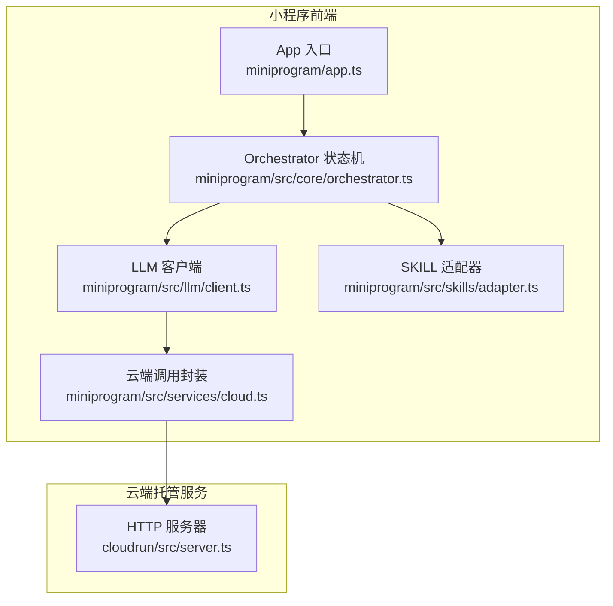
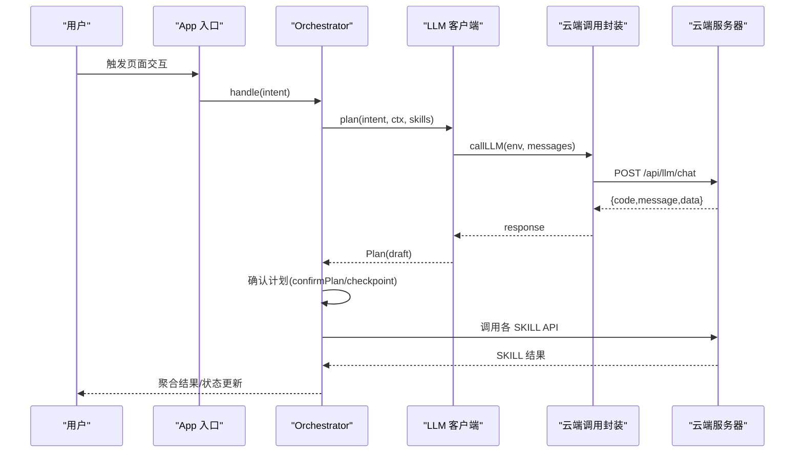
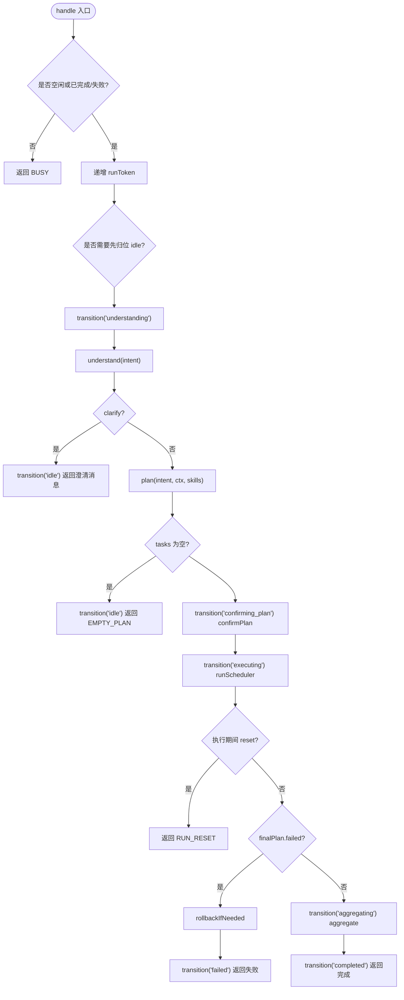
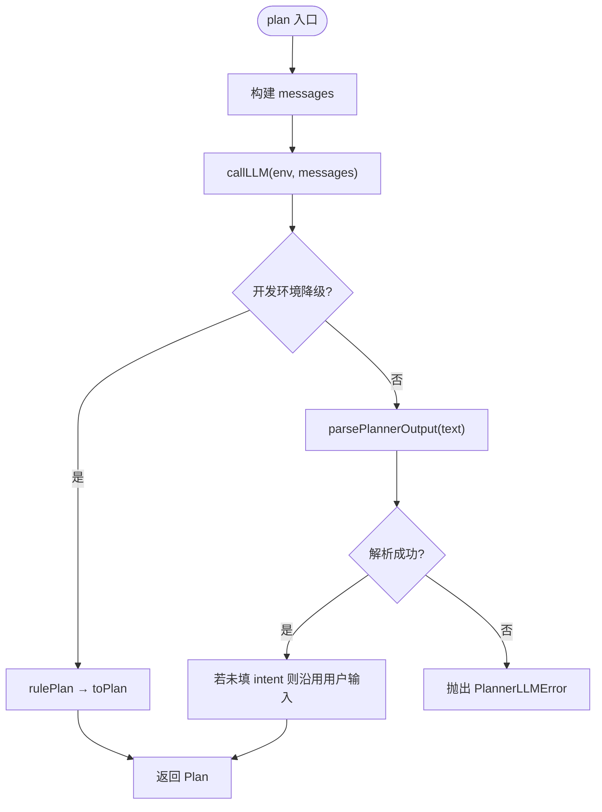
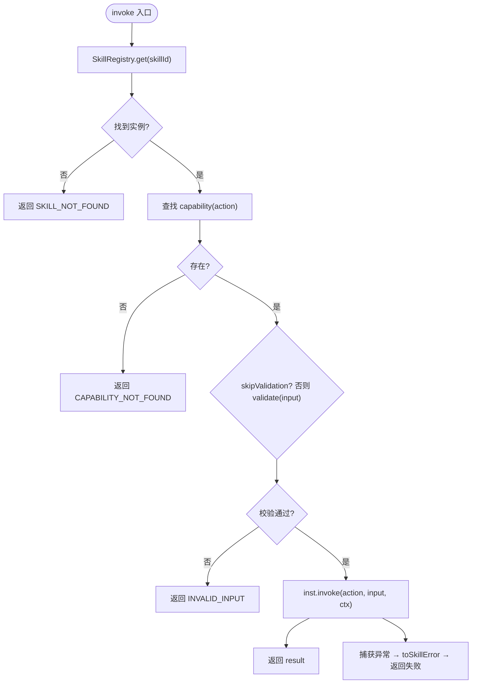
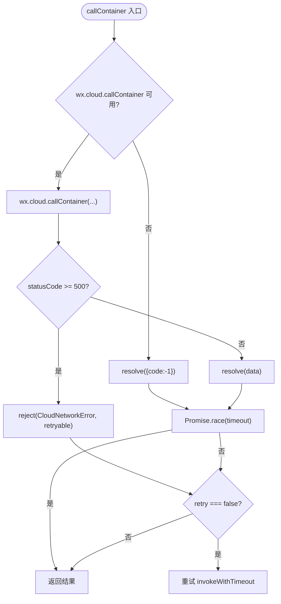
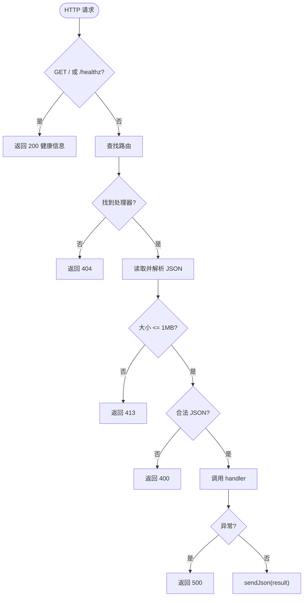
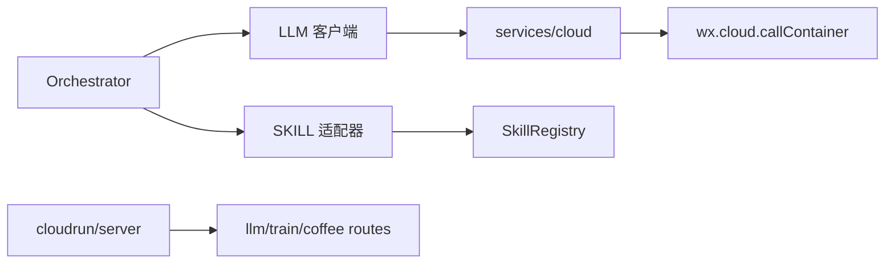

# 测试策略

<cite>
**本文引用的文件**   
- [package.json](file://package.json)
- [app.ts](file://miniprogram/app.ts)
- [orchestrator.ts](file://miniprogram/src/core/orchestrator.ts)
- [client.ts](file://miniprogram/src/llm/client.ts)
- [adapter.ts](file://miniprogram/src/skills/adapter.ts)
- [cloud.ts](file://miniprogram/src/services/cloud.ts)
- [server.ts](file://cloudrun/src/server.ts)
- [smoke-test.ps1](file://cloudrun/smoke-test.ps1)
</cite>

## 目录
1. [引言](#引言)
2. [项目结构](#项目结构)
3. [核心组件](#核心组件)
4. [架构总览](#架构总览)
5. [详细组件分析](#详细组件分析)
6. [依赖关系分析](#依赖关系分析)
7. [性能与稳定性考量](#性能与稳定性考量)
8. [故障排查指南](#故障排查指南)
9. [结论](#结论)
10. [附录：测试矩阵与覆盖率建议](#附录测试矩阵与覆盖率建议)

## 引言
本测试策略面向 WAIC-WeChat-MiniProgram（MicroMate）微信小程序 Agent 系统，覆盖单元测试、集成测试、端到端测试、测试数据与 Mock 策略，以及持续集成中的自动化与覆盖率要求。目标是在不引入具体实现细节的前提下，为开发者提供可执行的测试方案，确保 LLM 规划、SKILL 编排、云端 API 与小程序用户流程的可靠性。

## 项目结构
仓库采用“小程序前端 + 云端托管服务”的双端结构：
- miniprogram：微信小程序前端，包含 Agent 运行时、LLM 客户端、SKILL 适配器、云端调用封装等。
- cloudrun：Node.js 云托管服务，提供 LLM 代理与各 SKILL 的 HTTP API。

**图表来源**
- [app.ts:16-48](file://miniprogram/app.ts#L16-L48)
- [orchestrator.ts:13-26](file://miniprogram/src/core/orchestrator.ts#L13-L26)
- [client.ts:9-18](file://miniprogram/src/llm/client.ts#L9-L18)
- [adapter.ts:13-17](file://miniprogram/src/skills/adapter.ts#L13-L17)
- [cloud.ts:1-11](file://miniprogram/src/services/cloud.ts#L1-L11)
- [server.ts:13-17](file://cloudrun/src/server.ts#L13-L17)

**章节来源**
- [package.json:1-23](file://package.json#L1-L23)
- [app.ts:1-49](file://miniprogram/app.ts#L1-L49)

## 核心组件
- Orchestrator：Agent 状态机，负责意图理解、计划生成、计划确认、任务执行、结果聚合与失败回滚。对外暴露 handle、reset、handleOnce 等接口。
- LLM 客户端：统一 LLM 调用、降级到本地规则规划器、解析与校验 Plan。
- SKILL 适配器：统一入参校验、错误包装、埋点与 rollback 能力。
- 云端调用封装：wx.cloud.callContainer 的统一封装，含超时、重试、开发环境降级。
- 云端服务器：健康检查、路由分发、请求体解析与 JSON 响应。

**章节来源**
- [orchestrator.ts:28-48](file://miniprogram/src/core/orchestrator.ts#L28-L48)
- [client.ts:20-25](file://miniprogram/src/llm/client.ts#L20-L25)
- [adapter.ts:19-22](file://miniprogram/src/skills/adapter.ts#L19-L22)
- [cloud.ts:16-33](file://miniprogram/src/services/cloud.ts#L16-L33)
- [server.ts:19-27](file://cloudrun/src/server.ts#L19-L27)

## 架构总览
下图展示一次典型的用户输入到结果返回的调用链，包括 Orchestrator 的状态转移、LLM 规划、SKILL 执行与云端 API 调用。

**图表来源**
- [orchestrator.ts:106-221](file://miniprogram/src/core/orchestrator.ts#L106-L221)
- [client.ts:56-119](file://miniprogram/src/llm/client.ts#L56-L119)
- [cloud.ts:64-149](file://miniprogram/src/services/cloud.ts#L64-L149)
- [server.ts:76-123](file://cloudrun/src/server.ts#L76-L123)

## 详细组件分析

### Orchestrator 状态机测试
- 职责边界：状态转移、并发令牌控制、异常处理、回滚逻辑、回调注入。
- 关键测试点：
  - 状态转移合法性：idle→understanding→planning→confirming_plan→executing→aggregating→completed；失败路径进入 failed 并允许回到 idle。
  - 并发安全：reset() 后在途 Scheduler/checkpoint 应失效，避免重复执行或交错弹窗。
  - 异常分支：LLM 错误、调度死锁、未知异常均进入 failed 并给出明确 errorCode。
  - 回滚：仅对 succeeded 且 reversible 的任务按反序回滚，单点回滚失败不影响整体。
  - 回调验证：onTaskUpdate、onPlanUpdate、onStateChange 被正确触发。

**图表来源**
- [orchestrator.ts:106-255](file://miniprogram/src/core/orchestrator.ts#L106-L255)
- [orchestrator.ts:278-303](file://miniprogram/src/core/orchestrator.ts#L278-L303)

**章节来源**
- [orchestrator.ts:60-71](file://miniprogram/src/core/orchestrator.ts#L60-L71)
- [orchestrator.ts:106-255](file://miniprogram/src/core/orchestrator.ts#L106-L255)
- [orchestrator.ts:258-270](file://miniprogram/src/core/orchestrator.ts#L258-L270)
- [orchestrator.ts:278-303](file://miniprogram/src/core/orchestrator.ts#L278-L303)

### LLM 客户端测试
- 职责边界：构造 Prompt、调用云端 LLM、解析输出、开发环境降级到本地规则规划器。
- 关键测试点：
  - 正常链路：callLLM 成功 → parsePlannerOutput 成功 → 返回 Plan。
  - 开发环境降级：云端不可用（code:-1 或 CloudNetworkError）→ 使用 rule-planner 兜底。
  - 解析失败：抛出 PlannerLLMError，携带原始文本片段便于定位。
  - 用量统计：ctx.trace.llmCalls、totalTokens 正确更新。

**图表来源**
- [client.ts:56-119](file://miniprogram/src/llm/client.ts#L56-L119)

**章节来源**
- [client.ts:20-25](file://miniprogram/src/llm/client.ts#L20-L25)
- [client.ts:56-119](file://miniprogram/src/llm/client.ts#L56-L119)

### SKILL 适配器测试
- 职责边界：注册表查找、capability 校验、schema 校验、错误包装、埋点、rollback。
- 关键测试点：
  - 未注册 SKILL → 返回 SKILL_NOT_FOUND。
  - 不支持 action → 返回 CAPABILITY_NOT_FOUND。
  - 入参无效 → 返回 INVALID_INPUT，附带校验错误详情。
  - 调用异常 → 包装为 SkillError，retryable 标记正确。
  - rollback：未实现时返回 rolled=false 与原因；实现时记录日志并返回 rolled=true。

**图表来源**
- [adapter.ts:37-85](file://miniprogram/src/skills/adapter.ts#L37-L85)

**章节来源**
- [adapter.ts:37-85](file://miniprogram/src/skills/adapter.ts#L37-L85)
- [adapter.ts:88-107](file://miniprogram/src/skills/adapter.ts#L88-L107)

### 云端调用封装测试
- 职责边界：wx.cloud.callContainer 封装、超时、重试、开发环境降级、初始化保护。
- 关键测试点：
  - wx 不可用 → 返回 code:-1 占位，不阻塞调用链。
  - 服务端 5xx → 抛出 CloudNetworkError（retryable=true）。
  - 超时 → 抛出 CloudNetworkError（带 timeoutMs）。
  - 重试策略：默认 3 次，指数退避（baseDelayMs=600），仅对 retryable 错误重试。
  - isDevEnv：develop/trial/release 判定与缓存。
  - ensureCloudInit：幂等初始化，wx 不可用时跳过。

**图表来源**
- [cloud.ts:64-149](file://miniprogram/src/services/cloud.ts#L64-L149)
- [cloud.ts:172-182](file://miniprogram/src/services/cloud.ts#L172-L182)
- [cloud.ts:192-207](file://miniprogram/src/services/cloud.ts#L192-L207)

**章节来源**
- [cloud.ts:45-53](file://miniprogram/src/services/cloud.ts#L45-L53)
- [cloud.ts:64-149](file://miniprogram/src/services/cloud.ts#L64-L149)
- [cloud.ts:172-182](file://miniprogram/src/services/cloud.ts#L172-L182)
- [cloud.ts:192-207](file://miniprogram/src/services/cloud.ts#L192-L207)

### 云端服务器测试
- 职责边界：健康检查、路由分发、请求体大小限制、JSON 解析、统一响应。
- 关键测试点：
  - GET / 与 /healthz → 200 健康信息。
  - 未匹配路由 → 404。
  - 请求体过大 → 413。
  - 非法 JSON → 400。
  - 内部异常 → 500。

**图表来源**
- [server.ts:76-123](file://cloudrun/src/server.ts#L76-L123)

**章节来源**
- [server.ts:19-27](file://cloudrun/src/server.ts#L19-L27)
- [server.ts:76-123](file://cloudrun/src/server.ts#L76-L123)

## 依赖关系分析
- Orchestrator 依赖 LLM 客户端与 SKILL 适配器，并通过回调注入 interaction 层，保持单向依赖。
- LLM 客户端依赖 services/llm（云端 LLM 调用）与 parser/rule-planner。
- SKILL 适配器依赖 SkillRegistry 与 validator/logger。
- services/cloud 依赖 utils/retry 与 logger，屏蔽 wx.* 直接调用。
- cloudrun/server 聚合 llm-chat、skill-train、skill-coffee 路由。

**图表来源**
- [orchestrator.ts:13-26](file://miniprogram/src/core/orchestrator.ts#L13-L26)
- [client.ts:9-18](file://miniprogram/src/llm/client.ts#L9-L18)
- [adapter.ts:13-17](file://miniprogram/src/skills/adapter.ts#L13-L17)
- [cloud.ts:1-11](file://miniprogram/src/services/cloud.ts#L1-L11)
- [server.ts:13-17](file://cloudrun/src/server.ts#L13-L17)

**章节来源**
- [orchestrator.ts:13-26](file://miniprogram/src/core/orchestrator.ts#L13-L26)
- [client.ts:9-18](file://miniprogram/src/llm/client.ts#L9-L18)
- [adapter.ts:13-17](file://miniprogram/src/skills/adapter.ts#L13-L17)
- [cloud.ts:1-11](file://miniprogram/src/services/cloud.ts#L1-L11)
- [server.ts:13-17](file://cloudrun/src/server.ts#L13-L17)

## 性能与稳定性考量
- Orchestrator 使用 runToken 防止并发双跑与交错弹窗，reset 强制通道绕过状态守卫，需确保测试覆盖 reset 场景。
- LLM 调用具备开发环境降级与用量统计，测试需区分 release 与 develop/trial 行为。
- 云端调用封装内置超时与重试，测试需覆盖超时、5xx、网络异常与重试次数。
- SKILL 适配器统一错误包装，避免业务异常穿透，测试需断言错误码与 retryable 标志。

[本节为通用指导，不直接分析具体文件]

## 故障排查指南
- 云端 LLM 不可用：
  - 现象：devFallbackReason 触发，降级到本地规则规划器。
  - 排查：确认 isDevEnv 返回值、云端配置与网络连通性。
- 云端容器不可用：
  - 现象：callContainer 返回 code:-1 或抛出 CloudNetworkError。
  - 排查：检查 wx.cloud.init 是否成功、env 是否正确、端口与路由是否可达。
- Orchestrator 状态异常：
  - 现象：BUSY、DEADLOCK、UNEXPECTED。
  - 排查：查看 onStateChange 回调序列、reset 时机、Scheduler 是否卡死。

**章节来源**
- [client.ts:37-45](file://miniprogram/src/llm/client.ts#L37-L45)
- [cloud.ts:105-119](file://miniprogram/src/services/cloud.ts#L105-L119)
- [orchestrator.ts:222-255](file://miniprogram/src/core/orchestrator.ts#L222-L255)

## 结论
本测试策略围绕 Orchestrator 状态机、LLM 客户端、SKILL 适配器与云端调用封装展开，明确了单元测试、集成测试与端到端测试的重点与边界。通过 Mock 与降级策略，可在开发环境与正式环境分别保证可演示性与严格失败语义。建议在 CI 中引入类型检查、基础单元测试与冒烟测试，逐步提升覆盖率与稳定性。

[本节为总结性内容，不直接分析具体文件]

## 附录：测试矩阵与覆盖率建议

### 单元测试
- Orchestrator：
  - 用例：idle/planning/confirming/executing/aggregating/completed/failed 全路径；reset 并发；异常分支；回滚；回调触发。
  - 工具：Jest/Vitest（Node 环境），Mock 回调与外部依赖。
- LLM 客户端：
  - 用例：正常解析、开发降级、解析失败、用量统计。
  - 工具：Jest/Vitest，Mock callLLM 与 rule-planner。
- SKILL 适配器：
  - 用例：未注册、不支持 action、入参无效、调用异常、rollback。
  - 工具：Jest/Vitest，Mock SkillRegistry 与 validator。
- 云端调用封装：
  - 用例：wx 不可用、5xx、超时、重试、isDevEnv、ensureCloudInit。
  - 工具：Jest/Vitest，Mock wx.cloud.callContainer。

### 集成测试
- LLM 服务集成：
  - 用例：POST /api/llm/chat 成功与失败；未配置 Key 返回 503。
  - 工具：Postman/Newman 或 Jest supertest（Node 环境）。
- SKILL 插件集成：
  - 用例：train/coffee 路由；鉴权头 x-wx-openid；参数校验与业务返回。
  - 工具：cloudrun/smoke-test.ps1 扩展为自动化脚本。
- 云端 API 集成：
  - 用例：健康检查、路由分派、请求体大小限制、非法 JSON、内部异常。
  - 工具：Jest supertest 或 PowerShell 脚本。

### 端到端测试
- 小程序用户流程：
  - 用例：意图输入 → 计划确认 → 任务执行 → 结果聚合；失败与回滚。
  - 工具：微信开发者工具自动化（如 wechat-miniprogram-testing）、Playwright for MiniProgram（若支持）。
- Agent 工作流：
  - 用例：多轮对话、并发 reset、checkpoint 人工确认。
  - 工具：结合 UI 自动化与日志断言。

### 测试数据与 Mock 策略
- LLM 响应模拟：
  - 固定 messages 与 temperature/maxTokens/jsonMode，返回稳定 Plan。
  - 模拟解析失败与用量统计。
- 外部服务 Mock：
  - Mock wx.cloud.callContainer 返回不同 statusCode 与 data。
  - Mock SkillRegistry 返回不同 capabilities 与 invoke/rollback 行为。
- 环境变量与降级：
  - 控制 isDevEnv 返回 develop/trial/release，验证降级与严格失败语义。

### 持续集成与覆盖率
- 类型检查：
  - 根 package.json scripts.type-check 与 build 已配置 TypeScript 类型检查。
- 自动化步骤建议：
  - 安装依赖 → 类型检查 → 单元测试 → 集成测试（云端冒烟）→ 报告汇总。
- 覆盖率要求：
  - 核心模块（Orchestrator、LLM 客户端、SKILL 适配器、云端调用封装）行覆盖率 ≥ 80%，分支覆盖率 ≥ 70%。
  - 云端服务器路由与错误处理分支覆盖率 ≥ 80%。

**章节来源**
- [package.json:6-9](file://package.json#L6-L9)
- [smoke-test.ps1:1-17](file://cloudrun/smoke-test.ps1#L1-L17)