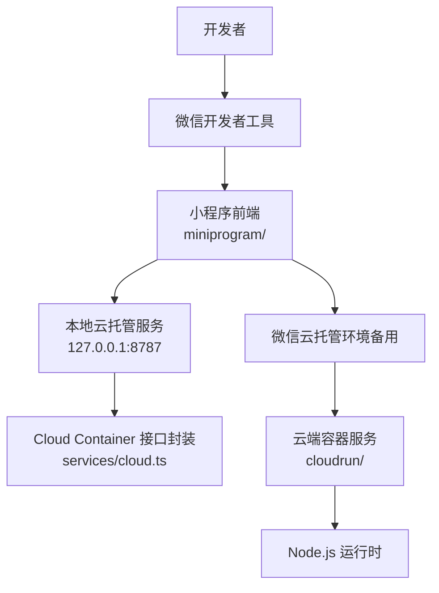
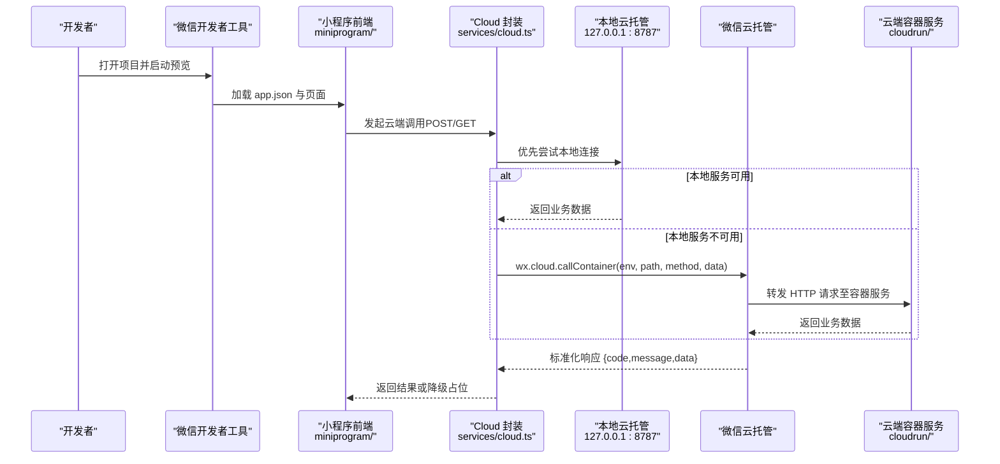
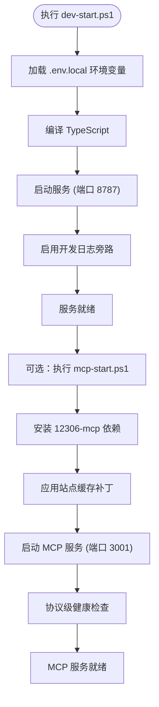
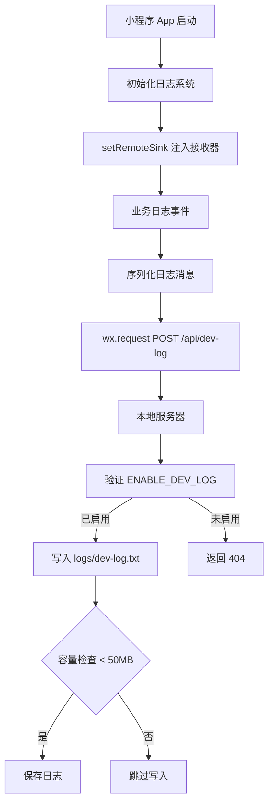
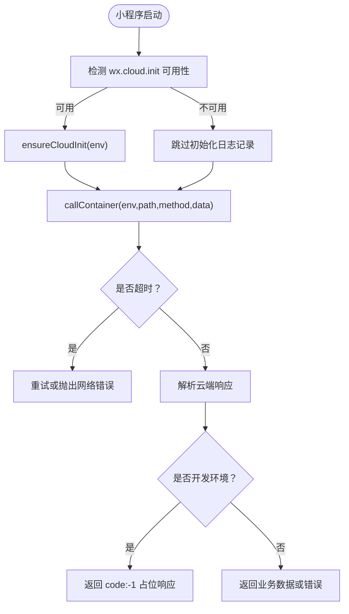
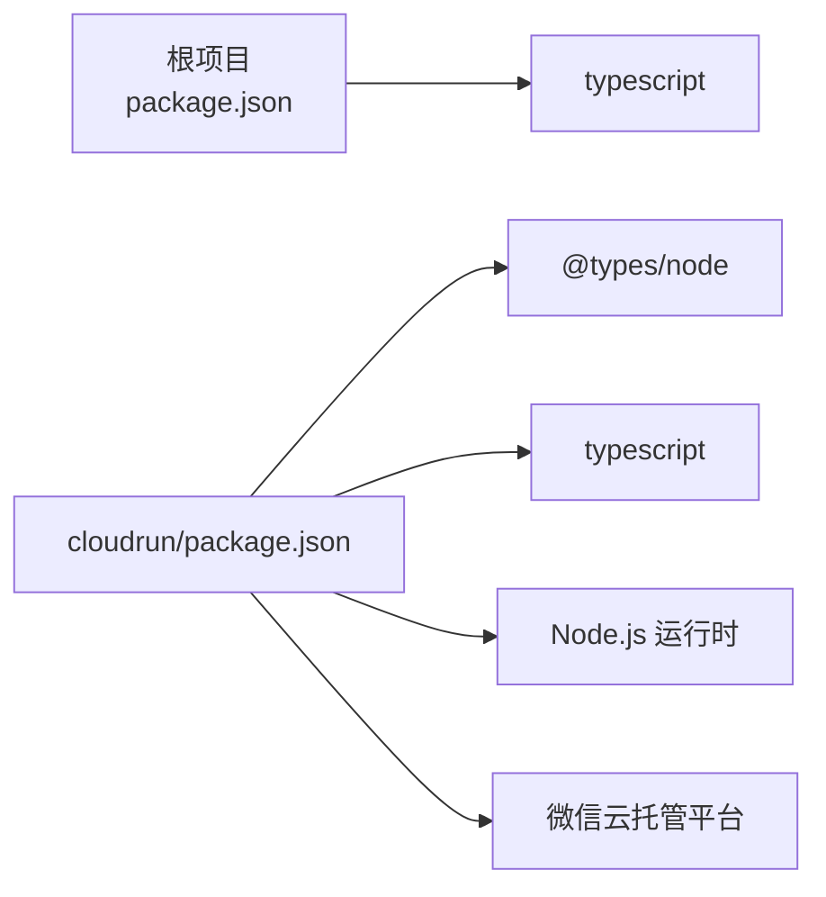

# 环境搭建

<cite>
**本文引用的文件**   
- [package.json](file://package.json)
- [cloudrun/package.json](file://cloudrun/package.json)
- [project.config.json](file://project.config.json)
- [miniprogram/app.json](file://miniprogram/app.json)
- [miniprogram/src/services/cloud.ts](file://miniprogram/src/services/cloud.ts)
- [cloudrun/Dockerfile](file://cloudrun/Dockerfile)
- [.gitignore](file://.gitignore)
- [cloudrun/dev-start.ps1](file://cloudrun/dev-start.ps1)
- [cloudrun/mcp-start.ps1](file://cloudrun/mcp-start.ps1)
- [miniprogram/src/app.ts](file://miniprogram/src/app.ts)
- [miniprogram/src/utils/logger.ts](file://miniprogram/src/utils/logger.ts)
- [cloudrun/src/server.ts](file://cloudrun/src/server.ts)
</cite>

## 更新摘要
**所做更改**   
- 新增 PowerShell 脚本一键环境设置章节
- 更新直接本地云托管连接配置说明
- 添加远程日志系统集成指南
- 完善开发环境启动流程

## 目录
1. [简介](#简介)
2. [项目结构](#项目结构)
3. [核心组件](#核心组件)
4. [架构总览](#架构总览)
5. [详细组件分析](#详细组件分析)
6. [依赖分析](#依赖分析)
7. [性能考虑](#性能考虑)
8. [故障排查指南](#故障排查指南)
9. [结论](#结论)
10. [附录](#附录)

## 简介
本指南面向首次接触 WAIC-WeChat-MiniProgram 的开发者，目标是帮助你在本地快速完成开发环境搭建、依赖安装、微信小程序与云托管服务的配置，并给出 VS Code 推荐设置与常见问题排查方法。项目包含：
- 微信小程序前端（TypeScript + WXML/WXSS）
- 云端容器服务（Node.js + TypeScript，支持直接本地连接）
- PowerShell 一键环境设置脚本
- Docker 构建脚本用于云端部署
- 远程日志系统集成

## 项目结构
仓库采用"小程序前端 + 云端容器"的双端结构：
- miniprogram：小程序前端代码与页面
- cloudrun：云端容器服务源码与构建脚本
- 根目录：项目级 TypeScript 检查、微信开发者工具项目配置

**图表来源**
- [project.config.json:1-42](file://project.config.json#L1-L42)
- [miniprogram/src/services/cloud.ts:70-76](file://miniprogram/src/services/cloud.ts#L70-L76)
- [cloudrun/Dockerfile:1-20](file://cloudrun/Dockerfile#L1-L20)

**章节来源**
- [project.config.json:1-42](file://project.config.json#L1-L42)
- [miniprogram/app.json:1-20](file://miniprogram/app.json#L1-L20)

## 核心组件
- 微信小程序前端
  - 入口与页面：app.json 定义页面路由与基础窗口配置
  - TypeScript 编译：project.config.json 启用 TypeScript 编译器插件
- 云端容器服务
  - Node.js 应用：Dockerfile 指定 Node 20 Alpine 镜像，npm install 后执行 tsc 构建
  - 运行端口：PORT 环境变量，默认 80
- 小程序与云端的交互
  - services/cloud.ts 统一封装 wx.cloud.callContainer，提供超时、重试、错误归一化与环境判定
  - 开发环境优先直连本地服务（127.0.0.1:8787），失败时自动回退到云开发链路

**章节来源**
- [miniprogram/app.json:1-20](file://miniprogram/app.json#L1-L20)
- [project.config.json:1-42](file://project.config.json#L1-L42)
- [cloudrun/Dockerfile:1-20](file://cloudrun/Dockerfile#L1-L20)
- [miniprogram/src/services/cloud.ts:70-76](file://miniprogram/src/services/cloud.ts#L70-L76)

## 架构总览
下图展示从开发者到小程序再到云端容器的完整链路，以及关键配置文件的作用位置。

**图表来源**
- [miniprogram/app.json:1-20](file://miniprogram/app.json#L1-L20)
- [miniprogram/src/services/cloud.ts:150-167](file://miniprogram/src/services/cloud.ts#L150-L167)
- [cloudrun/Dockerfile:1-20](file://cloudrun/Dockerfile#L1-L20)

## 详细组件分析

### 必需的开发工具与安装
- Node.js
  - 版本要求：云端容器使用 node:20-alpine，建议本地安装 Node.js 20.x
  - 作用：运行 npm 命令、执行 TypeScript 编译、启动云端服务
- TypeScript 编译器
  - 根项目与 cloudrun 子项目均声明 typescript 作为 devDependencies
  - 根项目 scripts 提供 type-check 与 build（仅类型检查）
  - cloudrun 提供 build、start、type-check 脚本
- 微信开发者工具
  - 项目根 project.config.json 已配置小程序根目录、AppID、编译器插件等
  - 需在工具中导入项目根目录，确保能识别 TypeScript 编译插件
- PowerShell（Windows 用户）
  - 用于执行一键环境设置脚本
  - 需要管理员权限以启动网络监听进程

**章节来源**
- [cloudrun/Dockerfile:1-20](file://cloudrun/Dockerfile#L1-L20)
- [package.json:1-23](file://package.json#L1-L23)
- [cloudrun/package.json:1-17](file://cloudrun/package.json#L1-L17)
- [project.config.json:1-42](file://project.config.json#L1-L42)

### PowerShell 一键环境设置
项目提供了两个关键的 PowerShell 脚本用于自动化环境设置：

#### 主服务启动脚本（dev-start.ps1）
- 功能：启动本地云托管服务，支持直接本地连接模式
- 特性：
  - 自动加载 .env.local 环境变量文件
  - 编译 TypeScript 源码
  - 在端口 8787 启动服务
  - 启用开发日志旁路功能（ENABLE_DEV_LOG=1）
- 使用方法：在 cloudrun/ 目录下执行 `.\dev-start.ps1`

#### 12306 MCP 服务脚本（mcp-start.ps1）
- 功能：启动真实的 12306 数据源服务
- 特性：
  - 自动安装 12306-mcp 依赖（国内镜像加速）
  - 三层稳定性机制防止站点名称查询失败
  - 后台进程管理，支持自动重启
  - 协议级健康检查，确保服务真正就绪
- 使用方法：在 cloudrun/ 目录下执行 `.\mcp-start.ps1`

**图表来源**
- [cloudrun/dev-start.ps1:1-43](file://cloudrun/dev-start.ps1#L1-L43)
- [cloudrun/mcp-start.ps1:1-85](file://cloudrun/mcp-start.ps1#L1-L85)

**章节来源**
- [cloudrun/dev-start.ps1:1-43](file://cloudrun/dev-start.ps1#L1-L43)
- [cloudrun/mcp-start.ps1:1-85](file://cloudrun/mcp-start.ps1#L1-L85)

### 项目依赖的安装与配置
- 根项目依赖
  - 安装依赖：在项目根目录执行 npm install
  - 类型检查：npm run type-check 或 npm run build（当前为类型检查）
- cloudrun 子项目依赖
  - 进入 cloudrun 目录执行 npm install
  - 构建产物：npm run build 生成 dist/server.js
  - 本地运行：npm start（需先构建）
- 包管理说明
  - cloudrun/Dockerfile 使用 npmmirror 加速依赖安装
  - .gitignore 忽略 node_modules、dist、.miniprogram 缓存等

**章节来源**
- [package.json:1-23](file://package.json#L1-L23)
- [cloudrun/package.json:1-17](file://cloudrun/package.json#L1-L17)
- [cloudrun/Dockerfile:7-14](file://cloudrun/Dockerfile#L7-L14)
- [.gitignore:1-44](file://.gitignore#L1-L44)

### 微信小程序开发环境配置
- 初始化与导入
  - 使用微信开发者工具导入项目根目录
  - project.config.json 已配置 miniprogramRoot、compileType、libVersion、appid 等
- TypeScript 编译支持
  - project.config.json 的 setting.useCompilerPlugins 已启用 typescript
  - 建议在工具中开启 Source Map 上传以便调试
- 权限与隐私信息
  - miniprogram/app.json 声明了定位权限与 requiredPrivateInfos，需在工具中按提示授权

**章节来源**
- [project.config.json:1-42](file://project.config.json#L1-L42)
- [miniprogram/app.json:1-20](file://miniprogram/app.json#L1-L20)

### 直接本地云托管连接配置
项目实现了智能的环境检测与连接策略：

#### 连接优先级
1. **开发环境优先直连本地服务**：当检测到开发环境时，优先尝试连接 127.0.0.1:8787
2. **自动回退机制**：本地连接失败时自动回退到微信云开发链路
3. **生产环境安全**：release 环境始终使用云开发，确保安全

#### 本地连接实现
- LOCAL_RUN_BASE = 'http://127.0.0.1:8787'
- 通过 wx.request 直接调用本地服务
- 模拟 x-wx-openid 头部进行鉴权
- 响应格式与云开发完全兼容

#### 环境检测逻辑
- isDevEnv() 根据 envVersion 判断是否允许本地连接
- 仅在 develop/trial 环境下启用本地直连
- release 环境强制使用云开发链路

**章节来源**
- [miniprogram/src/services/cloud.ts:70-76](file://miniprogram/src/services/cloud.ts#L70-L76)
- [miniprogram/src/services/cloud.ts:105-148](file://miniprogram/src/services/cloud.ts#L105-L148)
- [miniprogram/src/services/cloud.ts:150-167](file://miniprogram/src/services/cloud.ts#L150-L167)

### 远程日志系统集成
项目集成了完整的远程日志系统，专门解决开发环境调试痛点：

#### 日志旁路机制
- **目的**：绕过微信开发者工具 Console 面板的局限性
- **实现**：小程序端 logger 经 wx.request 逐条上报到本地服务 /api/dev-log
- **存储**：日志落盘至 cloudrun/logs/dev-log.txt
- **安全性**：生产环境通过 ENABLE_DEV_LOG 环境变量门控，默认禁用

#### 日志处理流程
1. 小程序端 setRemoteSink 注入日志接收器
2. 所有日志级别（debug/info/warn/error）统一格式化
3. 通过 wx.request POST 到 http://127.0.0.1:8787/api/dev-log
4. 服务端验证 ENABLE_DEV_LOG 环境变量
5. 写入本地文件，容量保护限制 50MB

#### 开发环境优势
- 彻底解决 "Copy all messages 不可用" 问题
- 避免 OCR 转录漏行
- 支持自动化测试取证
- fire-and-forget 模式，不影响主业务流程

**图表来源**
- [miniprogram/src/app.ts:107-122](file://miniprogram/src/app.ts#L107-L122)
- [miniprogram/src/utils/logger.ts:15-47](file://miniprogram/src/utils/logger.ts#L15-L47)
- [cloudrun/src/server.ts:102-117](file://cloudrun/src/server.ts#L102-L117)

**章节来源**
- [miniprogram/src/app.ts:107-122](file://miniprogram/src/app.ts#L107-L122)
- [miniprogram/src/utils/logger.ts:15-47](file://miniprogram/src/utils/logger.ts#L15-L47)
- [cloudrun/src/server.ts:102-117](file://cloudrun/src/server.ts#L102-L117)

### 云开发环境的启用与云端服务部署
- 小程序侧云开发初始化
  - services/cloud.ts 提供 ensureCloudInit(env)，在调用 callContainer 前进行 wx.cloud.init
  - isDevEnv() 根据 envVersion 判断是否允许本地降级，避免阻塞启动
- 云端容器服务
  - cloudrun/Dockerfile 定义了 Node 20 Alpine 镜像、npm install、tsc 构建、暴露 PORT=80
  - 运行入口为 dist/server.js，由 npm start 启动
- 调用流程
  - services/cloud.ts 封装 callContainer，统一处理超时、重试、错误归一化
  - 开发环境下若 wx.cloud.callContainer 不可用，会返回 code:-1 占位响应，保证本地演示可用

**图表来源**
- [miniprogram/src/services/cloud.ts:64-149](file://miniprogram/src/services/cloud.ts#L64-L149)
- [miniprogram/src/services/cloud.ts:171-207](file://miniprogram/src/services/cloud.ts#L171-L207)

**章节来源**
- [miniprogram/src/services/cloud.ts:64-149](file://miniprogram/src/services/cloud.ts#L64-L149)
- [miniprogram/src/services/cloud.ts:171-207](file://miniprogram/src/services/cloud.ts#L171-L207)
- [cloudrun/Dockerfile:1-20](file://cloudrun/Dockerfile#L1-L20)

### IDE 推荐设置（VS Code）
- 扩展推荐
  - TypeScript 语言支持与类型检查
  - ESLint（可选，配合团队规范）
  - Prettier（可选，统一代码风格）
  - WeChat Mini Program 相关扩展（如小程序语法高亮、片段）
- 调试配置
  - 小程序调试：使用微信开发者工具的调试面板；如需 Node 调试，可在 cloudrun 目录配置 launch.json 指向 dist/server.js
  - 类型检查：在 VS Code 任务中绑定 npm run type-check（根项目）与 npm run type-check（cloudrun）
- 工作区设置
  - 将项目根目录作为工作区，确保 TypeScript 配置生效
  - 忽略 node_modules、dist、.miniprogram 等目录以减少索引开销

[本节为通用建议，不直接分析具体文件]

## 依赖分析
- 根项目依赖
  - typescript：用于类型检查与构建脚本
- cloudrun 子项目依赖
  - @types/node：Node.js 类型定义
  - typescript：编译 TypeScript 源码
- 外部依赖
  - 云端容器服务依赖 Node.js 运行时与微信云托管平台
  - 小程序依赖微信基础库（project.config.json 指定 libVersion）

**图表来源**
- [package.json:1-23](file://package.json#L1-L23)
- [cloudrun/package.json:1-17](file://cloudrun/package.json#L1-L17)
- [project.config.json:32-34](file://project.config.json#L32-L34)

**章节来源**
- [package.json:1-23](file://package.json#L1-L23)
- [cloudrun/package.json:1-17](file://cloudrun/package.json#L1-L17)
- [project.config.json:32-34](file://project.config.json#L32-L34)

## 性能考虑
- 小程序侧
  - 合理控制云端调用频率，利用 services/cloud.ts 的重试策略避免频繁失败
  - 使用懒加载与分包减少首屏体积（app.json 已启用 lazyCodeLoading）
- 云端容器
  - Docker 构建阶段复用依赖层缓存，提升构建速度
  - 生产环境可考虑多阶段构建以缩小镜像体积
- 本地连接优化
  - 开发环境优先直连本地服务，减少网络延迟
  - 智能回退机制确保服务可用性

[本节为通用建议，不直接分析具体文件]

## 故障排查指南
- 无法找到 TypeScript 命令
  - 确认已在根目录与 cloudrun 目录分别执行 npm install
  - 检查 package.json 中的 scripts 是否正确
- 微信开发者工具无法识别 TypeScript
  - 确认 project.config.json 中 useCompilerPlugins 包含 typescript
  - 重启开发者工具或清理缓存
- 本地云托管服务无法启动
  - 检查 PowerShell 脚本执行权限
  - 确认端口 8787 未被占用
  - 查看 dev-start.ps1 输出日志
- 12306 MCP 服务启动失败
  - 检查网络连接，确保能访问 npm 镜像
  - 查看 .mcp/12306/mcp.log 日志文件
  - 确认防火墙允许端口 3001
- 远程日志无法写入
  - 确认 ENABLE_DEV_LOG 环境变量设置为 '1'
  - 检查 cloudrun/logs/ 目录权限
  - 查看日志文件大小是否超过 50MB
- 云端调用失败或返回 code:-1
  - 检查 ensureCloudInit 是否被调用且 env 正确
  - 在开发环境下，wx.cloud.callContainer 不可用时会返回占位响应，属预期行为
  - 正式环境应关注 CloudNetworkError 与重试逻辑
- 云端容器无法启动
  - 确认 Dockerfile 中 Node 版本与本地一致
  - 检查 PORT 环境变量是否设置为 80 或其他值
  - 确认 npm run build 成功生成 dist/server.js

**章节来源**
- [package.json:1-23](file://package.json#L1-L23)
- [cloudrun/package.json:1-17](file://cloudrun/package.json#L1-L17)
- [project.config.json:1-42](file://project.config.json#L1-L42)
- [miniprogram/src/services/cloud.ts:64-149](file://miniprogram/src/services/cloud.ts#L64-L149)
- [miniprogram/src/services/cloud.ts:171-207](file://miniprogram/src/services/cloud.ts#L171-L207)
- [cloudrun/Dockerfile:1-20](file://cloudrun/Dockerfile#L1-L20)
- [cloudrun/dev-start.ps1:1-43](file://cloudrun/dev-start.ps1#L1-L43)
- [cloudrun/mcp-start.ps1:1-85](file://cloudrun/mcp-start.ps1#L1-L85)

## 结论
通过以上步骤，你可以在本地完成 WAIC-WeChat-MiniProgram 的环境搭建、依赖安装、小程序与云端服务的配置，并使用 VS Code 进行高效开发与调试。项目提供的 PowerShell 一键脚本和直接本地连接功能大大简化了开发流程，而远程日志系统则解决了开发环境调试的痛点。遇到问题时，可参考故障排查指南逐步定位与解决。

[本节为总结性内容，不直接分析具体文件]

## 附录
- 常用命令
  - 根项目类型检查：npm run type-check
  - cloudrun 构建：npm run build
  - cloudrun 启动：npm start
  - 本地服务启动：cd cloudrun && .\dev-start.ps1
  - MCP 服务启动：cd cloudrun && .\mcp-start.ps1
- 重要配置项
  - project.config.json：小程序项目配置与编译器插件
  - miniprogram/app.json：小程序页面与权限配置
  - cloudrun/Dockerfile：云端容器构建与运行配置
  - .env.local：本地环境变量配置（LLM_BASE_URL, LLM_API_KEY, LLM_MODEL）
- 端口说明
  - 8787：本地云托管服务端口
  - 3001：12306 MCP 服务端口
  - 80：云端容器服务端口（Docker）

**章节来源**
- [package.json:1-23](file://package.json#L1-L23)
- [cloudrun/package.json:1-17](file://cloudrun/package.json#L1-L17)
- [project.config.json:1-42](file://project.config.json#L1-L42)
- [miniprogram/app.json:1-20](file://miniprogram/app.json#L1-L20)
- [cloudrun/Dockerfile:1-20](file://cloudrun/Dockerfile#L1-L20)
- [cloudrun/dev-start.ps1:1-43](file://cloudrun/dev-start.ps1#L1-L43)
- [cloudrun/mcp-start.ps1:1-85](file://cloudrun/mcp-start.ps1#L1-L85)