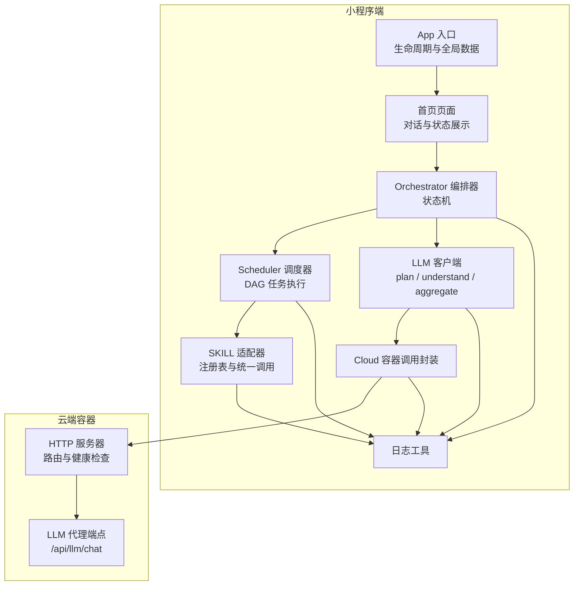
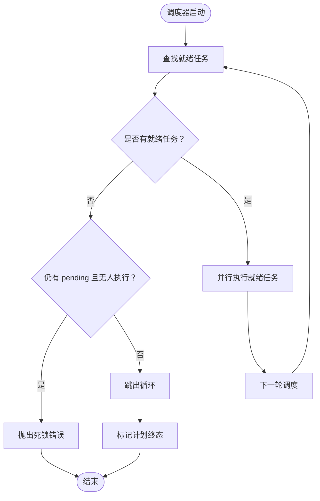
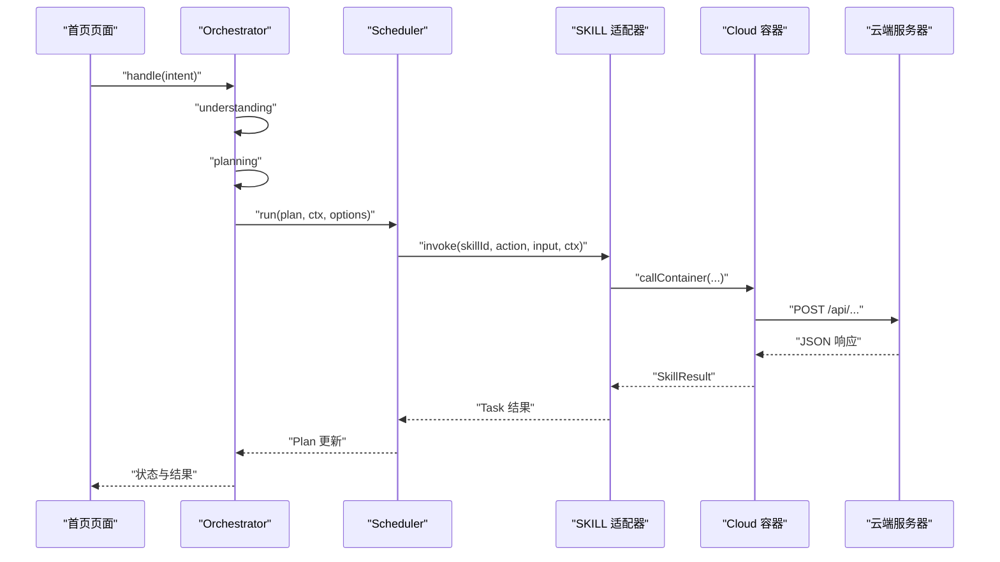
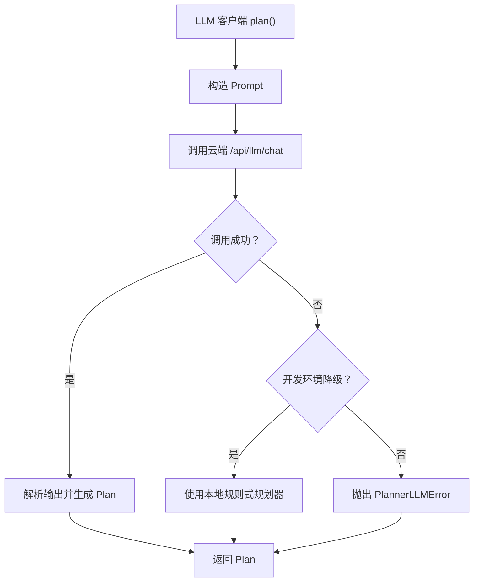

# 调试技巧

<cite>
**本文引用的文件**   
- [miniprogram/app.ts](file://miniprogram/app.ts)
- [miniprogram/pages/index/index.ts](file://miniprogram/pages/index/index.ts)
- [miniprogram/src/core/orchestrator.ts](file://miniprogram/src/core/orchestrator.ts)
- [miniprogram/src/core/scheduler.ts](file://miniprogram/src/core/scheduler.ts)
- [miniprogram/src/llm/client.ts](file://miniprogram/src/llm/client.ts)
- [miniprogram/src/services/cloud.ts](file://miniprogram/src/services/cloud.ts)
- [miniprogram/src/services/llm.ts](file://miniprogram/src/services/llm.ts)
- [miniprogram/src/skills/adapter.ts](file://miniprogram/src/skills/adapter.ts)
- [miniprogram/src/utils/logger.ts](file://miniprogram/src/utils/logger.ts)
- [miniprogram/src/interaction/checkpoint.ts](file://miniprogram/src/interaction/checkpoint.ts)
- [cloudrun/src/server.ts](file://cloudrun/src/server.ts)
- [cloudrun/src/llm-chat.ts](file://cloudrun/src/llm-chat.ts)
</cite>

## 目录
1. [引言](#引言)
2. [项目结构与调试入口](#项目结构与调试入口)
3. [小程序端调试方法](#小程序端调试方法)
4. [云端服务调试方法](#云端服务调试方法)
5. [Agent 运行时调试方法](#agent-运行时调试方法)
6. [依赖与调用链路分析](#依赖与调用链路分析)
7. [常见问题排查流程](#常见问题排查流程)
8. [性能分析与优化建议](#性能分析与优化建议)
9. [调试工具与最佳实践](#调试工具与最佳实践)
10. [结论](#结论)

## 引言
本调试指南面向 WAIC-WeChat-MiniProgram 的开发者，覆盖小程序端、云端服务与 Agent 运行时的调试方法。重点包括：
- 微信开发者工具的调试能力与控制台使用
- 网络请求与 LLM 调用的可观测性
- 状态机、任务调度与 SKILL 执行的可追踪性
- 常见错误的定位路径与恢复策略
- 日志、重试、降级与回滚机制在调试中的利用方式

## 项目结构与调试入口
本项目由小程序端与云端容器两部分组成：
- 小程序端负责用户交互、Agent 编排、SKILL 适配、LLM 客户端封装与云端容器调用
- 云端容器提供健康检查、路由分发、LLM 代理以及技能后端接口

**图表来源**
- [miniprogram/app.ts:23-48](file://miniprogram/app.ts#L23-L48)
- [miniprogram/pages/index/index.ts:117-152](file://miniprogram/pages/index/index.ts#L117-L152)
- [miniprogram/src/core/orchestrator.ts:73-106](file://miniprogram/src/core/orchestrator.ts#L73-L106)
- [miniprogram/src/core/scheduler.ts:76-128](file://miniprogram/src/core/scheduler.ts#L76-L128)
- [miniprogram/src/llm/client.ts:56-119](file://miniprogram/src/llm/client.ts#L56-L119)
- [miniprogram/src/services/cloud.ts:64-149](file://miniprogram/src/services/cloud.ts#L64-L149)
- [miniprogram/src/skills/adapter.ts:36-85](file://miniprogram/src/skills/adapter.ts#L36-L85)
- [cloudrun/src/server.ts:76-128](file://cloudrun/src/server.ts#L76-L128)
- [cloudrun/src/llm-chat.ts:55-117](file://cloudrun/src/llm-chat.ts#L55-L117)

**章节来源**
- [miniprogram/app.ts:1-49](file://miniprogram/app.ts#L1-L49)
- [miniprogram/pages/index/index.ts:1-17](file://miniprogram/pages/index/index.ts#L1-L17)
- [cloudrun/src/server.ts:1-11](file://cloudrun/src/server.ts#L1-L11)

## 小程序端调试方法

### 微信开发者工具基础调试
- 打开小程序后，优先确认 App 生命周期是否正常启动，观察控制台是否输出品牌名称与版本信息。
- 在首页输入示例指令，触发 Orchestrator 处理流程，观察状态列变化与消息气泡更新。
- 若出现“系统异常”或“无法识别意图”，先查看控制台错误日志与业务错误码。

关键入口与行为：
- App 启动时仅输出轻量日志，避免 onLaunch 耗时过长；Agent Runtime 通过 globalData.agent 懒加载。
- 首页 onLoad 订阅 runtime 事件，onUnload 退订，确保 UI 与 Agent 状态同步。

**章节来源**
- [miniprogram/app.ts:23-48](file://miniprogram/app.ts#L23-L48)
- [miniprogram/pages/index/index.ts:129-152](file://miniprogram/pages/index/index.ts#L129-L152)

### 控制台使用与日志过滤
- 所有日志统一带品牌前缀与时间戳，便于在控制台筛选。
- 日志级别包含 debug、info、warn、error；error 始终输出，其他级别受全局门槛控制。
- 建议在开发环境将日志级别设为 debug，以捕获更详细的内部流转信息。

可观察的日志点：
- App 生命周期启动与前台/后台切换
- Orchestrator 处理意图、状态转移、失败回滚
- Scheduler 启动、任务就绪、死锁检测、任务完成
- LLM 规划耗时与 token 用量
- Cloud 容器调用失败与重试
- SKILL 调用成功/失败与回滚结果

**章节来源**
- [miniprogram/src/utils/logger.ts:12-61](file://miniprogram/src/utils/logger.ts#L12-L61)
- [miniprogram/src/core/orchestrator.ts:106-118](file://miniprogram/src/core/orchestrator.ts#L106-L118)
- [miniprogram/src/core/scheduler.ts:83-97](file://miniprogram/src/core/scheduler.ts#L83-L97)
- [miniprogram/src/llm/client.ts:101-103](file://miniprogram/src/llm/client.ts#L101-L103)
- [miniprogram/src/services/cloud.ts:110-118](file://miniprogram/src/services/cloud.ts#L110-L118)
- [miniprogram/src/skills/adapter.ts:71-84](file://miniprogram/src/skills/adapter.ts#L71-L84)

### 网络请求调试（云端容器）
- 小程序通过 services/cloud.ts 调用 wx.cloud.callContainer，统一封装超时、重试与错误结构。
- 云端 server.ts 提供健康检查与路由分发，返回标准 JSON 响应。
- 当云端不可用或返回 5xx 时，小程序端会抛出可重试的网络错误；开发环境可能降为占位码以便本地演示。

调试要点：
- 在开发者工具中查看 Network 面板，确认容器路径、方法与请求体。
- 关注服务端日志，确认 session 与 openid 是否透传。
- 若出现“请求体过大”或“非法 JSON”，检查上游传入的数据结构与大小限制。

**章节来源**
- [miniprogram/src/services/cloud.ts:64-149](file://miniprogram/src/services/cloud.ts#L64-L149)
- [cloudrun/src/server.ts:76-128](file://cloudrun/src/server.ts#L76-L128)

### 性能分析工具
- 使用开发者工具的 Performance 面板记录一次完整对话流程，重点关注：
  - Orchestrator.handle 总耗时
  - LLM 规划阶段耗时与 token 用量
  - Scheduler 多轮调度次数
  - Cloud 容器调用与重试次数
- 结合日志中的耗时统计与重试计数，定位慢调用与瓶颈环节。

可参考的埋点位置：
- LLM 规划耗时与 token 统计
- SKILL 调用耗时
- Cloud 容器调用超时与重试
- Scheduler 迭代次数上限保护

**章节来源**
- [miniprogram/src/llm/client.ts:61-103](file://miniprogram/src/llm/client.ts#L61-L103)
- [miniprogram/src/skills/adapter.ts:71-77](file://miniprogram/src/skills/adapter.ts#L71-L77)
- [miniprogram/src/services/cloud.ts:123-149](file://miniprogram/src/services/cloud.ts#L123-L149)
- [miniprogram/src/core/scheduler.ts:85-97](file://miniprogram/src/core/scheduler.ts#L85-L97)

## 云端服务调试方法

### 日志查看
- 云端 server.ts 通过 console.log 输出结构化日志，包含时间戳、方法、路径、session 与 openid。
- 异常路径统一捕获并记录错误消息，便于在云托管日志系统中检索。

建议：
- 在云托管控制台查看 stdout 日志，按时间范围与关键字过滤。
- 结合小程序端的 sessionId，跨端关联一次请求的全链路日志。

**章节来源**
- [cloudrun/src/server.ts:29-32](file://cloudrun/src/server.ts#L29-L32)
- [cloudrun/src/server.ts:105-122](file://cloudrun/src/server.ts#L105-L122)

### 错误追踪
- 服务端对 PAYLOAD_TOO_LARGE 与 INVALID_JSON 进行明确返回，避免上层误判。
- 未匹配路由返回 404，未知异常返回 500，便于前端区分配置错误与内部错误。

排查步骤：
- 若返回 413，检查请求体大小是否超过 1MB。
- 若返回 400，检查 JSON 格式与字段类型。
- 若返回 500，查看服务端异常堆栈与业务逻辑错误。

**章节来源**
- [cloudrun/src/server.ts:94-122](file://cloudrun/src/server.ts#L94-L122)

### 性能监控
- 健康检查端点可用于探测服务存活与响应时间。
- LLM 代理端点设置上游超时，避免无界等待。

建议：
- 定期调用健康检查端点，评估服务可用性。
- 监控 LLM 上游响应时间与失败率，必要时调整模型参数或切换供应商。

**章节来源**
- [cloudrun/src/server.ts:84-92](file://cloudrun/src/server.ts#L84-L92)
- [cloudrun/src/llm-chat.ts:52-53](file://cloudrun/src/llm-chat.ts#L52-L53)

## Agent 运行时调试方法

### 状态机跟踪
Orchestrator 维护明确的允许状态转移表，并在每次转移时触发回调，供 UI 与调试工具观察。

典型状态序列：
- idle → understanding → planning → confirming_plan → executing → aggregating → completed
- 任意阶段失败 → failed → idle
- 执行期间需要人类确认 → awaiting_human → executing

调试建议：
- 订阅 onStateChange，记录 prev 与 next 状态，验证转移合法性。
- 若出现 BUSY 或 EMPTY_PLAN，检查理解与规划阶段的提前返回路径是否正确归位到 idle。

**章节来源**
- [miniprogram/src/core/orchestrator.ts:60-71](file://miniprogram/src/core/orchestrator.ts#L60-L71)
- [miniprogram/src/core/orchestrator.ts:106-146](file://miniprogram/src/core/orchestrator.ts#L106-L146)
- [miniprogram/src/core/orchestrator.ts:319-328](file://miniprogram/src/core/orchestrator.ts#L319-L328)

### 任务调度监控
Scheduler 每轮找出依赖已满足且 pending 的任务，并行执行，直到全部终态或检测到死锁。

关键调试点：
- 任务绑定解析失败会导致级联跳过下游任务。
- 写操作需经 checkpoint 序列化互斥，防止弹窗冲突。
- runToken 失效时中止调度，避免旧流程继续执行。

**图表来源**
- [miniprogram/src/core/scheduler.ts:76-128](file://miniprogram/src/core/scheduler.ts#L76-L128)
- [miniprogram/src/core/scheduler.ts:130-137](file://miniprogram/src/core/scheduler.ts#L130-L137)
- [miniprogram/src/core/scheduler.ts:139-204](file://miniprogram/src/core/scheduler.ts#L139-L204)

**章节来源**
- [miniprogram/src/core/scheduler.ts:27-44](file://miniprogram/src/core/scheduler.ts#L27-L44)
- [miniprogram/src/core/scheduler.ts:46-52](file://miniprogram/src/core/scheduler.ts#L46-L52)
- [miniprogram/src/core/scheduler.ts:54-74](file://miniprogram/src/core/scheduler.ts#L54-L74)
- [miniprogram/src/core/scheduler.ts:206-245](file://miniprogram/src/core/scheduler.ts#L206-L245)

### SKILL 执行调试
SKILL 适配器负责入参校验、统一错误转换与调用埋点。

调试建议：
- 若返回 SKILL_NOT_FOUND 或 CAPABILITY_NOT_FOUND，检查注册表与 action 名称。
- 若返回 INVALID_INPUT，检查 inputSchema 与传入参数。
- 若 SKILL 抛错，适配器会包装为 SkillError，便于上层统一处理。

**章节来源**
- [miniprogram/src/skills/adapter.ts:36-85](file://miniprogram/src/skills/adapter.ts#L36-L85)
- [miniprogram/src/skills/adapter.ts:87-112](file://miniprogram/src/skills/adapter.ts#L87-L112)

### 人类确认与回滚
- Plan 确认与单步 checkpoint 均通过 interaction/checkpoint.ts 显示确认框。
- Orchestrator 在失败时按反序撤销已成功且可逆的任务，并记录回滚结果。

调试建议：
- 若用户拒绝 checkpoint，任务会被标记失败并级联跳过下游。
- 若回滚失败，记录原因但不中断整体回滚流程。

**章节来源**
- [miniprogram/src/interaction/checkpoint.ts:48-64](file://miniprogram/src/interaction/checkpoint.ts#L48-L64)
- [miniprogram/src/interaction/checkpoint.ts:109-122](file://miniprogram/src/interaction/checkpoint.ts#L109-L122)
- [miniprogram/src/core/orchestrator.ts:272-303](file://miniprogram/src/core/orchestrator.ts#L272-L303)

## 依赖与调用链路分析

### Orchestrator 与 Scheduler 的关系
Orchestrator 负责状态机与高层流程，Scheduler 负责 DAG 任务调度。两者通过回调与令牌机制协作，避免并发双跑与状态不一致。

**图表来源**
- [miniprogram/pages/index/index.ts:214-269](file://miniprogram/pages/index/index.ts#L214-L269)
- [miniprogram/src/core/orchestrator.ts:106-221](file://miniprogram/src/core/orchestrator.ts#L106-L221)
- [miniprogram/src/core/scheduler.ts:76-128](file://miniprogram/src/core/scheduler.ts#L76-L128)
- [miniprogram/src/skills/adapter.ts:36-85](file://miniprogram/src/skills/adapter.ts#L36-L85)
- [miniprogram/src/services/cloud.ts:64-149](file://miniprogram/src/services/cloud.ts#L64-L149)
- [cloudrun/src/server.ts:76-128](file://cloudrun/src/server.ts#L76-L128)

### LLM 调用链路与降级策略
LLM 客户端先尝试云端代理，若开发环境不可用则降级为本地规则式规划器；正式环境保持严格失败语义。

**图表来源**
- [miniprogram/src/llm/client.ts:56-119](file://miniprogram/src/llm/client.ts#L56-L119)
- [cloudrun/src/llm-chat.ts:55-117](file://cloudrun/src/llm-chat.ts#L55-L117)

**章节来源**
- [miniprogram/src/llm/client.ts:20-45](file://miniprogram/src/llm/client.ts#L20-L45)
- [miniprogram/src/services/llm.ts:56-83](file://miniprogram/src/services/llm.ts#L56-L83)
- [cloudrun/src/llm-chat.ts:1-17](file://cloudrun/src/llm-chat.ts#L1-L17)

## 常见问题排查流程

### LLM 调用失败
现象：
- 控制台出现 LLM 调用失败或 PlannerLLMError。
- 小程序端提示“LLM 呼叫失敗，請稍後再試”。

排查步骤：
1. 检查云端 LLM 代理是否配置 LLM_BASE_URL 与 LLM_API_KEY。
2. 查看云端日志，确认上游 LLM 是否返回 503 或超时。
3. 若在开发环境，确认是否触发本地规则式规划器降级。
4. 检查小程序端重试次数与延迟策略。

相关实现：
- 云端代理未配置或上游失败返回 503。
- 小程序端 LLM 客户端对 429/503 进行可重试判断。
- 开发环境降级为本地规则式规划器。

**章节来源**
- [cloudrun/src/llm-chat.ts:55-61](file://cloudrun/src/llm-chat.ts#L55-L61)
- [cloudrun/src/llm-chat.ts:93-101](file://cloudrun/src/llm-chat.ts#L93-L101)
- [miniprogram/src/services/llm.ts:61-83](file://miniprogram/src/services/llm.ts#L61-L83)
- [miniprogram/src/llm/client.ts:83-99](file://miniprogram/src/llm/client.ts#L83-L99)

### 技能执行异常
现象：
- 任务失败，卡片显示错误信息。
- 控制台出现 SKILL 抛错或适配器错误。

排查步骤：
1. 检查 SKILL 是否注册且 action 存在。
2. 检查入参是否符合 inputSchema。
3. 查看 SKILL 内部逻辑与外部依赖。
4. 若为写操作，确认 checkpoint 是否被用户拒绝。

相关实现：
- 适配器返回 SKILL_NOT_FOUND、CAPABILITY_NOT_FOUND、INVALID_INPUT。
- 写操作 checkpoint 序列化互斥，拒绝后级联跳过下游。

**章节来源**
- [miniprogram/src/skills/adapter.ts:44-69](file://miniprogram/src/skills/adapter.ts#L44-L69)
- [miniprogram/src/core/scheduler.ts:163-186](file://miniprogram/src/core/scheduler.ts#L163-L186)
- [miniprogram/src/core/scheduler.ts:206-217](file://miniprogram/src/core/scheduler.ts#L206-L217)

### 数据同步问题
现象：
- UI 状态与 Agent 状态不一致。
- 任务进度卡片未更新或重复弹框。

排查步骤：
1. 检查 Orchestrator 状态转移是否合法。
2. 检查 Scheduler 是否因 runToken 失效而中止。
3. 检查 checkpoint 是否串行化，避免弹窗冲突。
4. 检查页面订阅与退订逻辑。

相关实现：
- Orchestrator 通过 ALLOWED_TRANSITIONS 限制状态转移。
- Scheduler 通过 isRunActive 探测执行令牌有效性。
- checkpointChain 保证同一时刻仅一个确认弹窗。
- 页面 onLoad 订阅事件，onUnload 退订。

**章节来源**
- [miniprogram/src/core/orchestrator.ts:60-71](file://miniprogram/src/core/orchestrator.ts#L60-L71)
- [miniprogram/src/core/scheduler.ts:38-44](file://miniprogram/src/core/scheduler.ts#L38-L44)
- [miniprogram/src/core/scheduler.ts:54-74](file://miniprogram/src/core/scheduler.ts#L54-L74)
- [miniprogram/pages/index/index.ts:129-158](file://miniprogram/pages/index/index.ts#L129-L158)

## 性能分析与优化建议

### 小程序端性能
- 避免在 onLaunch 中进行重初始化，Agent Runtime 采用懒加载。
- 合理使用日志级别，避免大量 debug 日志影响渲染性能。
- 关注 LLM 规划耗时与 token 用量，必要时调整 temperature 与 maxTokens。

**章节来源**
- [miniprogram/app.ts:23-31](file://miniprogram/app.ts#L23-L31)
- [miniprogram/src/utils/logger.ts:23-26](file://miniprogram/src/utils/logger.ts#L23-L26)
- [miniprogram/src/llm/client.ts:76-82](file://miniprogram/src/llm/client.ts#L76-L82)

### 云端服务性能
- 健康检查端点用于探活，避免频繁调用影响服务稳定性。
- LLM 上游超时设置为 30 秒，避免无界等待。
- 请求体大小限制为 1MB，避免大对象拖慢处理。

**章节来源**
- [cloudrun/src/server.ts:84-92](file://cloudrun/src/server.ts#L84-L92)
- [cloudrun/src/llm-chat.ts:52-53](file://cloudrun/src/llm-chat.ts#L52-L53)
- [cloudrun/src/server.ts:19-20](file://cloudrun/src/server.ts#L19-L20)

## 调试工具与最佳实践

### 日志规范
- 所有日志带品牌前缀与时间戳，便于聚合与溯源。
- error 级别始终输出，其他级别受全局门槛控制。
- 建议在开发环境开启 debug 级别，生产环境关闭或仅保留 warn/error。

**章节来源**
- [miniprogram/src/utils/logger.ts:12-61](file://miniprogram/src/utils/logger.ts#L12-L61)

### 重试与降级
- Cloud 容器调用默认重试 3 次，指数退避。
- LLM 客户端对 429/503 进行可重试判断。
- 开发环境云端不可用时降级为本地规则式规划器。

**章节来源**
- [miniprogram/src/services/cloud.ts:140-149](file://miniprogram/src/services/cloud.ts#L140-L149)
- [miniprogram/src/services/llm.ts:77-83](file://miniprogram/src/services/llm.ts#L77-L83)
- [miniprogram/src/llm/client.ts:83-99](file://miniprogram/src/llm/client.ts#L83-L99)

### 状态机与任务调度
- 使用 onStateChange 与 onTaskUpdate 订阅实时状态，辅助 UI 与调试。
- 关注死锁检测与回滚机制，确保异常路径可恢复。

**章节来源**
- [miniprogram/src/core/orchestrator.ts:319-328](file://miniprogram/src/core/orchestrator.ts#L319-L328)
- [miniprogram/src/core/scheduler.ts:102-114](file://miniprogram/src/core/scheduler.ts#L102-L114)
- [miniprogram/src/core/orchestrator.ts:272-303](file://miniprogram/src/core/orchestrator.ts#L272-L303)

## 结论
本调试指南围绕小程序端、云端服务与 Agent 运行时三个层面展开，提供了从控制台日志、网络请求、状态机跟踪到任务调度与 SKILL 执行的完整调试路径。通过合理利用日志、重试、降级与回滚机制，开发者可以快速定位 LLM 调用失败、技能执行异常与数据同步问题，并结合性能分析工具优化用户体验与服务稳定性。