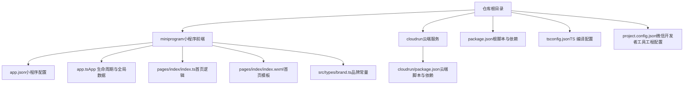
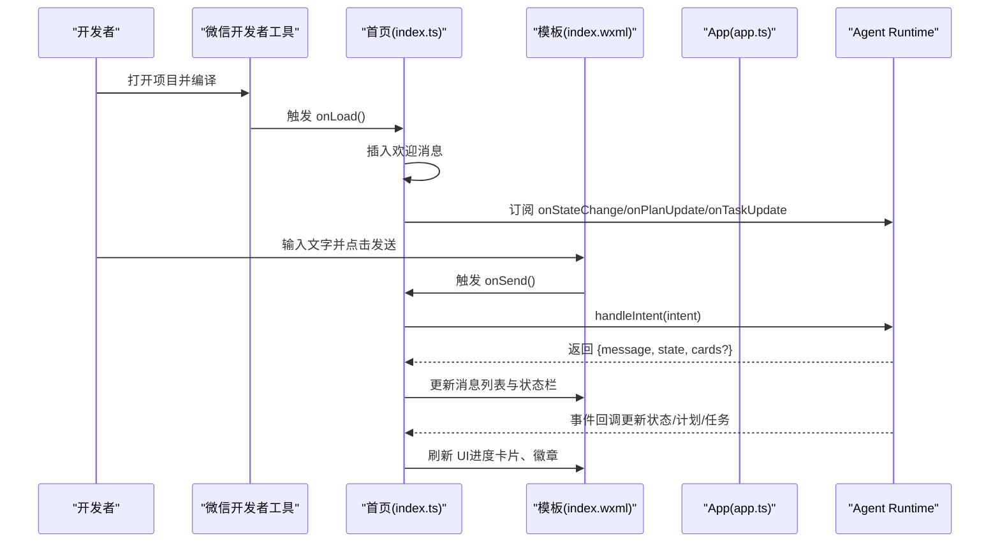
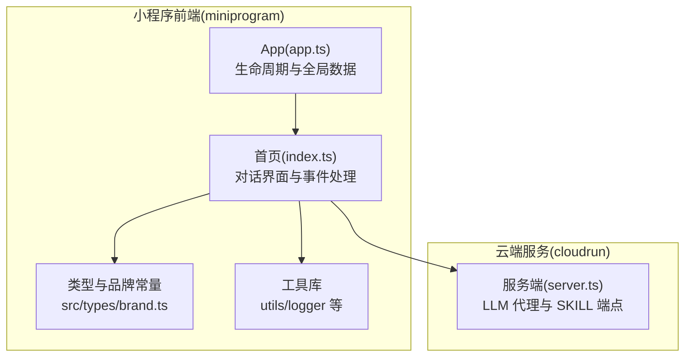

# 快速开始

<cite>
**本文引用的文件**   
- [package.json](file://package.json)
- [tsconfig.json](file://tsconfig.json)
- [project.config.json](file://project.config.json)
- [miniprogram/app.json](file://miniprogram/app.json)
- [miniprogram/app.ts](file://miniprogram/app.ts)
- [miniprogram/pages/index/index.ts](file://miniprogram/pages/index/index.ts)
- [miniprogram/pages/index/index.wxml](file://miniprogram/pages/index/index.wxml)
- [miniprogram/src/types/brand.ts](file://miniprogram/src/types/brand.ts)
- [cloudrun/package.json](file://cloudrun/package.json)
</cite>

## 目录
1. [简介](#简介)
2. [项目结构](#项目结构)
3. [环境准备](#环境准备)
4. [安装依赖与 TypeScript 配置](#安装依赖与-typescript-配置)
5. [小程序初始化与 app.json 设置](#小程序初始化与-appjson-设置)
6. [第一个 Hello World 示例](#第一个-hello-world-示例)
7. [常见问题与解决方案](#常见问题与解决方案)
8. [调试技巧与开发工作流](#调试技巧与开发工作流)
9. [架构总览](#架构总览)
10. [结论](#结论)

## 简介
本指南面向首次接触 WAIC-WeChat-MiniProgram（MicroMate）的开发者，目标是帮助你在最短时间内完成环境准备、依赖安装、小程序初始化，并运行一个可交互的“Hello World”对话页面。项目采用微信小程序原生框架，结合 TypeScript 进行类型检查与构建；同时包含云端服务模块，便于后续扩展 LLM 与技能编排能力。

## 项目结构
仓库根目录包含小程序前端与云端服务两个主要部分：
- miniprogram：微信小程序前端代码，包含应用入口、首页对话界面、核心运行时与工具库。
- cloudrun：云端 Node.js 服务，提供 LLM 代理与 SKILL 端点。
- 根级配置文件：用于 TypeScript 编译、微信开发者工具工程配置与包管理脚本。

图表来源
- [project.config.json:1-42](file://project.config.json#L1-L42)
- [miniprogram/app.json:1-20](file://miniprogram/app.json#L1-L20)
- [miniprogram/app.ts:1-49](file://miniprogram/app.ts#L1-L49)
- [miniprogram/pages/index/index.ts:1-329](file://miniprogram/pages/index/index.ts#L1-L329)
- [miniprogram/pages/index/index.wxml:1-77](file://miniprogram/pages/index/index.wxml#L1-L77)
- [miniprogram/src/types/brand.ts:1-37](file://miniprogram/src/types/brand.ts#L1-L37)
- [cloudrun/package.json:1-17](file://cloudrun/package.json#L1-L17)

章节来源
- [project.config.json:1-42](file://project.config.json#L1-L42)
- [miniprogram/app.json:1-20](file://miniprogram/app.json#L1-L20)
- [miniprogram/app.ts:1-49](file://miniprogram/app.ts#L1-L49)
- [miniprogram/pages/index/index.ts:1-329](file://miniprogram/pages/index/index.ts#L1-L329)
- [miniprogram/pages/index/index.wxml:1-77](file://miniprogram/pages/index/index.wxml#L1-L77)
- [miniprogram/src/types/brand.ts:1-37](file://miniprogram/src/types/brand.ts#L1-L37)
- [cloudrun/package.json:1-17](file://cloudrun/package.json#L1-L17)

## 环境准备
在开始之前，请确保你的开发机满足以下要求：
- Node.js：建议使用 LTS 版本（例如 18.x 或 20.x）。本项目使用 TypeScript 5.6+，Node 18/20 兼容性良好。
- npm 或 pnpm/yarn：任选其一即可。
- 微信开发者工具：安装稳定版，并确保已登录账号并创建小程序项目。

验证 Node.js 与包管理器：
- 打开终端执行 node -v 与 npm -v（或 pnpm -v / yarn -v），确认版本符合预期。

章节来源
- [package.json:1-23](file://package.json#L1-L23)
- [cloudrun/package.json:1-17](file://cloudrun/package.json#L1-L17)

## 安装依赖与 TypeScript 配置
### 安装依赖
在项目根目录执行：
- npm install
- 或使用你偏好的包管理器：pnpm install / yarn install

该命令会安装根目录 package.json 中声明的开发依赖（主要是 TypeScript）。

### TypeScript 编译器配置
项目的 TypeScript 配置位于 tsconfig.json，关键要点如下：
- target 与 module：目标 ES2020，模块解析为 ESNext，适合现代浏览器与小程序环境。
- lib：包含 ES2020 与 DOM 类型定义。
- strict：开启严格模式，noImplicitAny 与 strictNullChecks 启用，提升类型安全。
- isolatedModules：启用隔离模块，利于增量构建与并行编译。
- noEmit：不生成 JS 输出，由微信开发者工具负责编译与打包。
- baseUrl 与 paths：将 @/* 映射到 miniprogram/src/*，方便在小程序源码中使用路径别名。
- include/exclude：仅包含 miniprogram/**/*.ts，排除 node_modules 与 dist。

你可以使用以下脚本进行类型检查：
- npm run type-check
- npm run build（当前脚本也执行 tsc --noEmit，用于本地校验）

章节来源
- [package.json:1-23](file://package.json#L1-L23)
- [tsconfig.json:1-24](file://tsconfig.json#L1-L24)

## 小程序初始化与 app.json 设置
### 使用微信开发者工具打开项目
- 启动微信开发者工具，选择“导入项目”。
- 项目目录选择仓库根目录。
- 工具会自动读取 project.config.json，识别 miniprogramRoot 指向 miniprogram/。

### project.config.json 关键点
- miniprogramRoot：小程序源码根目录为 miniprogram/。
- setting.useCompilerPlugins：启用 TypeScript 插件，使开发者工具能直接编译 TS。
- libVersion：基础库版本设置为 3.0.0。
- appid：已配置小程序 AppID，请在你的开发者后台核对是否一致。
- packOptions/editorSetting：按需调整打包与编辑器行为。

### miniprogram/app.json 关键点
- pages：注册首页路由 pages/index/index。
- window：导航栏标题、背景色、文本样式等。
- style：启用 v2 样式规范。
- lazyCodeLoading：按需加载 requiredComponents。
- sitemapLocation：站点地图位置。
- permission：申请用户地理位置权限，描述用途。
- requiredPrivateInfos：声明需要使用的隐私接口 getLocation。

章节来源
- [project.config.json:1-42](file://project.config.json#L1-L42)
- [miniprogram/app.json:1-20](file://miniprogram/app.json#L1-L20)

## 第一个 Hello World 示例
本节带你运行一个最简单的可交互示例：打开小程序后看到欢迎消息，输入文字并点击发送，页面会显示状态变化与加载提示。

### 步骤概览
1. 在微信开发者工具中打开项目（参考“小程序初始化与 app.json 设置”）。
2. 编译并预览：点击“编译”，模拟器应自动打开首页。
3. 观察欢迎消息：首页会在 onLoad 时插入一条助手消息，展示品牌名称与标语。
4. 尝试输入：在输入框中输入任意文字，点击“发送”或按回车键。
5. 查看状态变化：顶部状态栏会随 Agent 状态更新，如“理解意图中”“已完成”等。

### 交互流程说明
- 页面加载时，首页会注入一条助手消息，展示品牌信息与引导文案。
- 用户输入后，调用 Agent Runtime 的 handleIntent 方法，返回响应后追加助手回复。
- 若返回错误码 BUSY，会提示等待当前任务完成。
- 状态变更通过事件订阅实时更新 UI，包括计划卡片与任务徽章。

图表来源
- [miniprogram/pages/index/index.ts:117-152](file://miniprogram/pages/index/index.ts#L117-L152)
- [miniprogram/pages/index/index.ts:165-171](file://miniprogram/pages/index/index.ts#L165-L171)
- [miniprogram/pages/index/index.ts:213-270](file://miniprogram/pages/index/index.ts#L213-L270)
- [miniprogram/pages/index/index.wxml:16-47](file://miniprogram/pages/index/index.wxml#L16-L47)
- [miniprogram/app.ts:23-48](file://miniprogram/app.ts#L23-L48)

### 如何添加简单用户交互
- 在 index.wxml 中添加按钮或输入控件，绑定 bindtap 或 bindinput。
- 在 index.ts 中实现对应的事件处理函数，例如 onTapExample、onInput、onSend。
- 如需展示动态内容，使用 setData 更新 data 字段，并在模板中用 {{}} 引用。
- 对于复杂状态，建议通过 Agent Runtime 的事件订阅机制更新 UI，避免频繁全量刷新。

章节来源
- [miniprogram/pages/index/index.ts:117-152](file://miniprogram/pages/index/index.ts#L117-L152)
- [miniprogram/pages/index/index.ts:165-171](file://miniprogram/pages/index/index.ts#L165-L171)
- [miniprogram/pages/index/index.ts:213-270](file://miniprogram/pages/index/index.ts#L213-L270)
- [miniprogram/pages/index/index.wxml:16-47](file://miniprogram/pages/index/index.wxml#L16-L47)
- [miniprogram/app.ts:23-48](file://miniprogram/app.ts#L23-L48)

## 常见问题与解决方案
- 无法识别 TypeScript：
  - 确认 project.config.json 中 useCompilerPlugins 包含 "typescript"。
  - 确保 tsconfig.json 存在且 include 覆盖 miniprogram/**/*.ts。
- 编译报错或类型检查失败：
  - 运行 npm run type-check 查看具体错误。
  - 检查 strict 模式下的类型约束，必要时修正 any 或未定义访问。
- 小程序无法启动或白屏：
  - 检查 miniprogram/app.json 的 pages 数组是否正确注册首页。
  - 确认 appid 与开发者后台一致。
- 权限相关弹窗或接口不可用：
  - 检查 miniprogram/app.json 的 permission 与 requiredPrivateInfos 是否声明了 getLocation。
  - 在真机调试时授予相应权限。
- 云端服务未就绪：
  - 如需使用云端 LLM 与 SKILL 端点，请先在 cloudrun 目录安装依赖并构建：
    - cd cloudrun && npm install
    - npm run build
    - npm start
  - 确保小程序侧的网络请求域名与云端服务地址正确配置。

章节来源
- [project.config.json:1-42](file://project.config.json#L1-L42)
- [tsconfig.json:1-24](file://tsconfig.json#L1-L24)
- [miniprogram/app.json:1-20](file://miniprogram/app.json#L1-L20)
- [cloudrun/package.json:1-17](file://cloudrun/package.json#L1-L17)

## 调试技巧与开发工作流
- 使用微信开发者工具的“调试器”面板：
  - Console：查看日志与错误信息。
  - Network：检查 API 请求与响应。
  - Storage：查看本地缓存与会话数据。
- 在小程序中打印日志：
  - 使用项目内置 logger 工具记录 info/error 级别日志。
  - 在关键流程（如 onLaunch、onLoad、dispatch）加入日志，便于追踪问题。
- 逐步断点调试：
  - 在 index.ts 的事件处理函数（onSend、dispatch）设置断点，观察数据流转。
  - 在 App 生命周期（onLaunch、onShow、onHide）设置断点，确认初始化顺序。
- 推荐开发流程：
  - 修改代码 → 保存 → 微信开发者工具自动热重载 → 观察 UI 与日志。
  - 定期运行 npm run type-check 保证类型正确。
  - 提交前检查 project.config.json 与 app.json 的配置变更。

章节来源
- [miniprogram/app.ts:23-48](file://miniprogram/app.ts#L23-L48)
- [miniprogram/pages/index/index.ts:117-152](file://miniprogram/pages/index/index.ts#L117-L152)
- [miniprogram/pages/index/index.ts:213-270](file://miniprogram/pages/index/index.ts#L213-L270)

## 架构总览
下图展示了小程序前端与云端服务的整体关系，以及关键组件的职责分工。

图表来源
- [miniprogram/app.ts:1-49](file://miniprogram/app.ts#L1-L49)
- [miniprogram/pages/index/index.ts:1-329](file://miniprogram/pages/index/index.ts#L1-L329)
- [miniprogram/src/types/brand.ts:1-37](file://miniprogram/src/types/brand.ts#L1-L37)
- [cloudrun/package.json:1-17](file://cloudrun/package.json#L1-L17)

## 结论
通过以上步骤，你已经完成了 WAIC-WeChat-MiniProgram 的环境准备、依赖安装、小程序初始化，并成功运行了一个可交互的“Hello World”对话页面。接下来，你可以：
- 继续完善首页的用户交互与状态展示。
- 接入云端服务，扩展 LLM 与 SKILL 能力。
- 根据业务需求调整 app.json 与 project.config.json 的配置。
- 遵循 TypeScript 严格模式与项目规范，提升代码质量与可维护性。