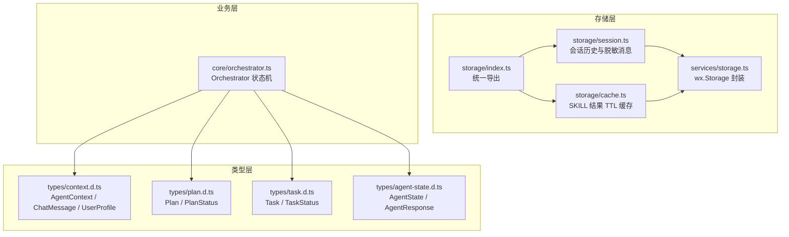
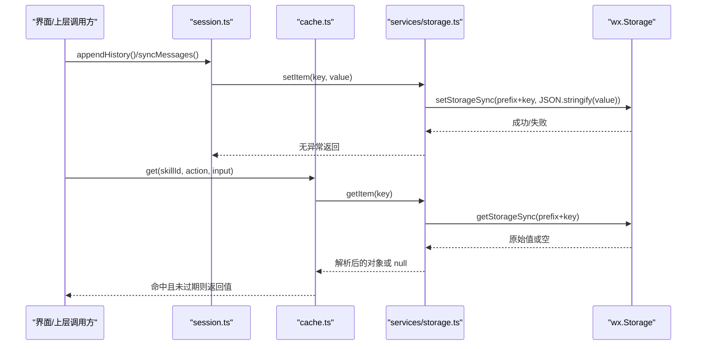
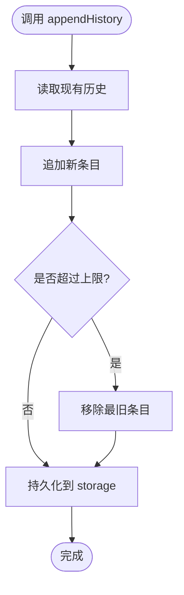
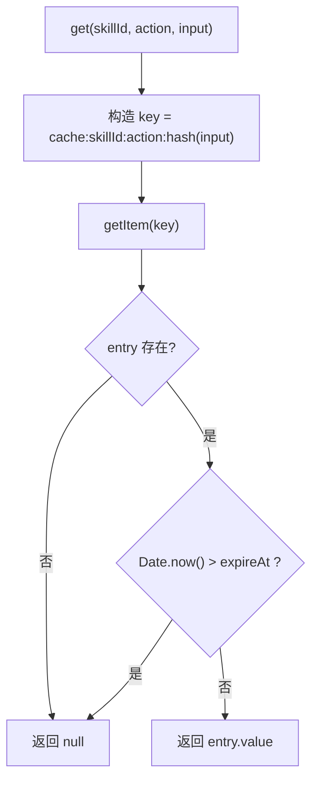
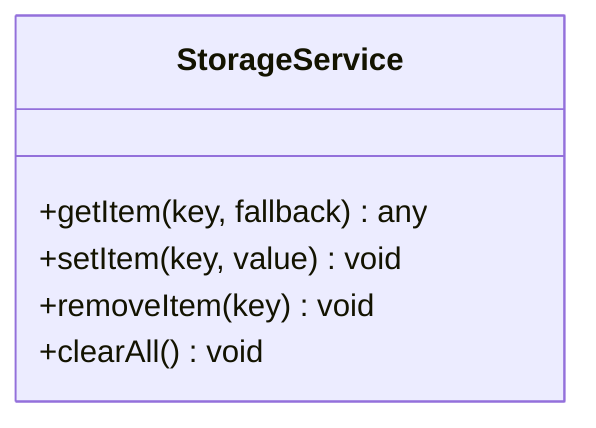
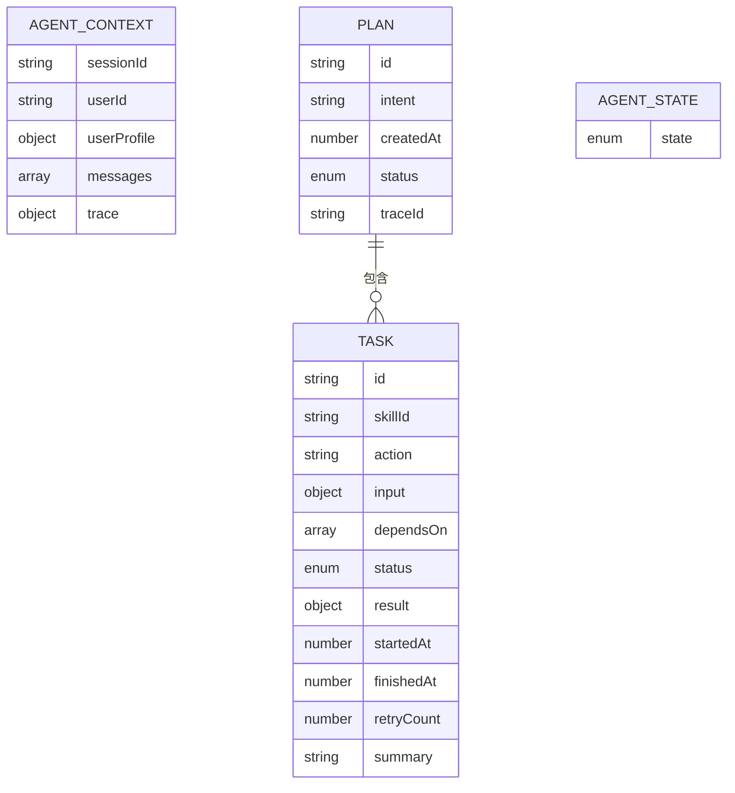
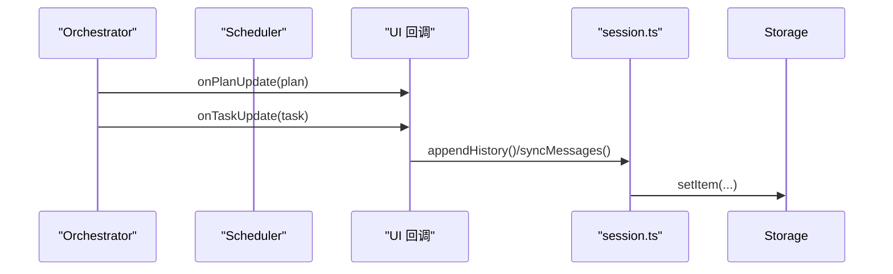
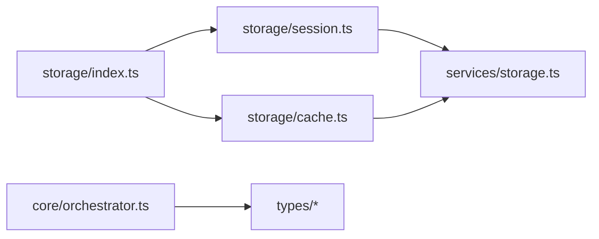

# 数据存储

<cite>
**本文引用的文件**   
- [miniprogram/src/storage/index.ts](file://miniprogram/src/storage/index.ts)
- [miniprogram/src/storage/session.ts](file://miniprogram/src/storage/session.ts)
- [miniprogram/src/storage/cache.ts](file://miniprogram/src/storage/cache.ts)
- [miniprogram/src/services/storage.ts](file://miniprogram/src/services/storage.ts)
- [miniprogram/src/types/context.d.ts](file://miniprogram/src/types/context.d.ts)
- [miniprogram/src/types/agent-state.d.ts](file://miniprogram/src/types/agent-state.d.ts)
- [miniprogram/src/types/plan.d.ts](file://miniprogram/src/types/plan.d.ts)
- [miniprogram/src/types/task.d.ts](file://miniprogram/src/types/task.d.ts)
- [miniprogram/src/core/orchestrator.ts](file://miniprogram/src/core/orchestrator.ts)
</cite>

## 目录
1. [引言](#引言)
2. [项目结构](#项目结构)
3. [核心组件](#核心组件)
4. [架构总览](#架构总览)
5. [详细组件分析](#详细组件分析)
6. [依赖关系分析](#依赖关系分析)
7. [性能与容量优化](#性能与容量优化)
8. [数据迁移与版本管理](#数据迁移与版本管理)
9. [备份、恢复与清理策略](#备份恢复与清理策略)
10. [故障排查指南](#故障排查指南)
11. [结论](#结论)

## 引言
本文件面向 WAIC-WeChat-MiniProgram 的数据存储模块，聚焦以下目标：
- 会话存储的实现：用户会话数据的持久化、生命周期管理与安全考虑。
- 缓存机制设计：本地缓存策略、数据同步与失效处理。
- 存储服务抽象：统一访问底层存储后端（微信 Storage）。
- 数据结构设计：Agent 状态、对话历史、任务计划的存储格式。
- 数据迁移与版本管理最佳实践。
- 性能优化建议：缓存策略、查询优化与存储空间管理。
- 数据备份、恢复与清理策略。

## 项目结构
存储相关代码位于 miniprogram/src 下，采用“能力分层 + 类型先行”的组织方式：
- storage：对外暴露的会话与缓存能力。
- services/storage：对微信 Storage API 的统一封装。
- types：领域模型与类型定义（上下文、计划、任务、Agent 状态等）。
- core：编排器 Orchestrator，驱动业务流并间接影响数据写入时机。

图表来源
- [miniprogram/src/storage/index.ts:1-6](file://miniprogram/src/storage/index.ts#L1-L6)
- [miniprogram/src/storage/session.ts:1-48](file://miniprogram/src/storage/session.ts#L1-L48)
- [miniprogram/src/storage/cache.ts:1-57](file://miniprogram/src/storage/cache.ts#L1-L57)
- [miniprogram/src/services/storage.ts:1-62](file://miniprogram/src/services/storage.ts#L1-L62)
- [miniprogram/src/types/context.d.ts:1-62](file://miniprogram/src/types/context.d.ts#L1-L62)
- [miniprogram/src/types/plan.d.ts:1-51](file://miniprogram/src/types/plan.d.ts#L1-L51)
- [miniprogram/src/types/task.d.ts:1-59](file://miniprogram/src/types/task.d.ts#L1-L59)
- [miniprogram/src/types/agent-state.d.ts:1-47](file://miniprogram/src/types/agent-state.d.ts#L1-L47)
- [miniprogram/src/core/orchestrator.ts:1-340](file://miniprogram/src/core/orchestrator.ts#L1-L340)

章节来源
- [miniprogram/src/storage/index.ts:1-6](file://miniprogram/src/storage/index.ts#L1-L6)
- [miniprogram/src/services/storage.ts:1-62](file://miniprogram/src/services/storage.ts#L1-L62)

## 核心组件
- 会话存储（session.ts）：维护脱敏后的会话历史与最近消息摘要，提供追加、读取、清空与同步接口。
- 缓存（cache.ts）：基于 TTL 的 SKILL 结果缓存，避免重复调用；键由 skillId、action 与输入哈希组成。
- 存储抽象（services/storage.ts）：封装 wx.getStorageSync/setStorageSync/removeStorageSync/clearAll，统一命名空间前缀与 JSON 序列化，集中错误处理。
- 类型模型（types/*）：定义 AgentContext、ChatMessage、Plan、Task、AgentState 等关键数据结构。

章节来源
- [miniprogram/src/storage/session.ts:1-48](file://miniprogram/src/storage/session.ts#L1-L48)
- [miniprogram/src/storage/cache.ts:1-57](file://miniprogram/src/storage/cache.ts#L1-L57)
- [miniprogram/src/services/storage.ts:1-62](file://miniprogram/src/services/storage.ts#L1-L62)
- [miniprogram/src/types/context.d.ts:1-62](file://miniprogram/src/types/context.d.ts#L1-L62)
- [miniprogram/src/types/plan.d.ts:1-51](file://miniprogram/src/types/plan.d.ts#L1-L51)
- [miniprogram/src/types/task.d.ts:1-59](file://miniprogram/src/types/task.d.ts#L1-L59)
- [miniprogram/src/types/agent-state.d.ts:1-47](file://miniprogram/src/types/agent-state.d.ts#L1-L47)

## 架构总览
存储层以“服务抽象 + 领域能力”的方式组织：
- 服务抽象层（services/storage.ts）屏蔽平台差异，提供 getItem/setItem/removeItem/clearAll。
- 领域能力层（storage/session.ts、storage/cache.ts）组合服务抽象，实现会话与缓存语义。
- 业务层（core/orchestrator.ts）通过 Orchestrator 驱动流程，并在合适时机触发数据写入（如 Plan 更新、任务执行结果）。

图表来源
- [miniprogram/src/storage/session.ts:24-48](file://miniprogram/src/storage/session.ts#L24-L48)
- [miniprogram/src/storage/cache.ts:35-52](file://miniprogram/src/storage/cache.ts#L35-L52)
- [miniprogram/src/services/storage.ts:13-34](file://miniprogram/src/services/storage.ts#L13-L34)

## 详细组件分析

### 会话存储（session.ts）
职责与行为
- 维护会话历史列表，限制最大长度，自动丢弃最旧条目。
- 提供追加、读取、清空接口。
- 将当前对话消息脱敏后落盘，仅保留 role、timestamp 与 content 前若干字符，用于画像与审计。

关键数据结构
- SessionHistoryEntry：包含意图、时间戳、可选 planId、状态（completed/failed/cancelled）。
- 同步消息快照：仅保存必要字段，控制内容长度以降低存储压力。

生命周期与安全
- 不持久化完整 AgentContext（规范红线），仅保存脱敏摘要。
- 所有写操作均经 services/storage.ts 统一封装，失败静默处理，避免阻塞主流程。

图表来源
- [miniprogram/src/storage/session.ts:24-37](file://miniprogram/src/storage/session.ts#L24-L37)
- [miniprogram/src/services/storage.ts:25-34](file://miniprogram/src/services/storage.ts#L25-L34)

章节来源
- [miniprogram/src/storage/session.ts:1-48](file://miniprogram/src/storage/session.ts#L1-L48)
- [miniprogram/src/services/storage.ts:13-34](file://miniprogram/src/services/storage.ts#L13-L34)

### 缓存机制（cache.ts）
设计要点
- 键生成：cache:{skillId}:{action}:{hash(input)}，hash 使用 FNV-1a 32-bit 简化实现。
- TTL 默认 5 分钟，可通过 options.ttlMs 覆盖。
- 读路径：若缓存不存在或已过期，返回 null；否则返回缓存值。
- 写路径：计算 expireAt 并写入。
- 失效策略：MVP 阶段不提供按 skillId 批量清除，依赖 TTL 自然过期。

复杂度与性能
- 键哈希为 O(n)，n 为输入 JSON 字符串长度。
- 读写均为单次 Storage I/O，适合高频短小结果的快速命中。

图表来源
- [miniprogram/src/storage/cache.ts:24-42](file://miniprogram/src/storage/cache.ts#L24-L42)
- [miniprogram/src/services/storage.ts:13-23](file://miniprogram/src/services/storage.ts#L13-L23)

章节来源
- [miniprogram/src/storage/cache.ts:1-57](file://miniprogram/src/storage/cache.ts#L1-L57)
- [miniprogram/src/services/storage.ts:13-34](file://miniprogram/src/services/storage.ts#L13-L34)

### 存储服务抽象（services/storage.ts）
职责与行为
- 统一命名空间前缀 micromate:，避免与其他小程序数据冲突。
- 提供 getItem/setItem/removeItem/clearAll，全部同步调用 wx.*Sync API。
- 内部进行 JSON 序列化/反序列化，捕获异常并返回 fallback 或静默忽略，保证业务稳定。

安全与健壮性
- 所有外部调用被 try/catch 包裹，避免抛出异常污染业务逻辑。
- clearAll 仅清理带前缀的键，降低误删风险。

图表来源
- [miniprogram/src/services/storage.ts:13-62](file://miniprogram/src/services/storage.ts#L13-L62)

章节来源
- [miniprogram/src/services/storage.ts:1-62](file://miniprogram/src/services/storage.ts#L1-L62)

### 数据结构设计
- AgentContext（types/context.d.ts）
  - 会话级全局状态容器，包含 sessionId、userId、userProfile、messages、trace 等。
  - 明确不跨会话持久化（规范红线），仅作为运行时内存态。
- ChatMessage（types/context.d.ts）
  - 多轮对话消息体，含 role、content、metadata、timestamp。
- Plan（types/plan.d.ts）
  - 由 Planner 产出、Orchestrator 执行的 DAG 任务集合，含 id、intent、tasks、createdAt、status、traceId。
- Task（types/task.d.ts）
  - 最小执行单位，含 skillId、action、input、dependsOn、status、result、startedAt、finishedAt、retryCount、summary 等。
- AgentState（types/agent-state.d.ts）
  - 状态机枚举（idle、understanding、planning、confirming_plan、executing、awaiting_human、aggregating、completed、failed、rolling_back）。

图表来源
- [miniprogram/src/types/context.d.ts:1-62](file://miniprogram/src/types/context.d.ts#L1-L62)
- [miniprogram/src/types/plan.d.ts:1-51](file://miniprogram/src/types/plan.d.ts#L1-L51)
- [miniprogram/src/types/task.d.ts:1-59](file://miniprogram/src/types/task.d.ts#L1-L59)
- [miniprogram/src/types/agent-state.d.ts:1-47](file://miniprogram/src/types/agent-state.d.ts#L1-L47)

章节来源
- [miniprogram/src/types/context.d.ts:1-62](file://miniprogram/src/types/context.d.ts#L1-L62)
- [miniprogram/src/types/plan.d.ts:1-51](file://miniprogram/src/types/plan.d.ts#L1-L51)
- [miniprogram/src/types/task.d.ts:1-59](file://miniprogram/src/types/task.d.ts#L1-L59)
- [miniprogram/src/types/agent-state.d.ts:1-47](file://miniprogram/src/types/agent-state.d.ts#L1-L47)

### Orchestrator 与数据写入时机
Orchestrator 负责状态机流转与调度，在以下节点可能触发数据写入：
- Plan 创建与确认：onPlanUpdate 回调可触发持久化。
- 任务执行与结果聚合：onTaskUpdate 回调可触发任务状态落盘。
- 会话历史与消息摘要：由 session.ts 在合适时机调用 syncMessages/appendHistory。

图表来源
- [miniprogram/src/core/orchestrator.ts:106-256](file://miniprogram/src/core/orchestrator.ts#L106-L256)
- [miniprogram/src/storage/session.ts:24-48](file://miniprogram/src/storage/session.ts#L24-L48)

章节来源
- [miniprogram/src/core/orchestrator.ts:1-340](file://miniprogram/src/core/orchestrator.ts#L1-L340)

## 依赖关系分析
- storage/index.ts 仅做统一导出，解耦具体实现。
- session.ts 与 cache.ts 均依赖 services/storage.ts 提供的原子操作。
- Orchestrator 依赖 types 中的领域模型，并通过回调与上层交互，不直接耦合存储实现。

图表来源
- [miniprogram/src/storage/index.ts:1-6](file://miniprogram/src/storage/index.ts#L1-L6)
- [miniprogram/src/storage/session.ts:1-48](file://miniprogram/src/storage/session.ts#L1-L48)
- [miniprogram/src/storage/cache.ts:1-57](file://miniprogram/src/storage/cache.ts#L1-L57)
- [miniprogram/src/services/storage.ts:1-62](file://miniprogram/src/services/storage.ts#L1-L62)
- [miniprogram/src/core/orchestrator.ts:1-340](file://miniprogram/src/core/orchestrator.ts#L1-L340)

章节来源
- [miniprogram/src/storage/index.ts:1-6](file://miniprogram/src/storage/index.ts#L1-L6)
- [miniprogram/src/core/orchestrator.ts:1-340](file://miniprogram/src/core/orchestrator.ts#L1-L340)

## 性能与容量优化
- 会话历史限长：MAX_HISTORY=50，避免无限增长导致存储膨胀与读取变慢。
- 消息脱敏与截断：仅保存 role、timestamp 与 content 前若干字符，减少体积与隐私风险。
- 缓存 TTL：默认 5 分钟，避免重复 SKILL 调用；可按需调整 ttlMs。
- 键空间隔离：所有键加 micromate: 前缀，避免与其他模块冲突。
- 同步 I/O 注意：wx.*Sync 会阻塞主线程，应避免在热路径频繁调用；必要时合并写入或延迟落盘。
- 查询优化：优先命中缓存；对历史列表采用尾部追加与头部删除，O(1) 插入与 O(1) 裁剪。
- 容量管理：定期清理无效缓存与历史；结合小程序 Storage 配额监控，必要时降级策略（如缩短 TTL、减少历史长度）。

[本节为通用指导，不直接分析具体文件]

## 数据迁移与版本管理
最佳实践建议
- 版本号字段：在持久化对象中增加 version 字段，便于后续迁移。
- 迁移入口：在应用启动时检测版本并执行迁移脚本，再写入新版本。
- 兼容策略：读取时根据版本进行兼容转换，确保新旧数据均可用。
- 回滚方案：迁移前备份原数据，迁移失败可回滚至旧版本。
- 灰度发布：分批启用迁移逻辑，观察错误率与性能指标。

[本节为通用指导，不直接分析具体文件]

## 备份、恢复与清理策略
- 备份
  - 定期导出会话历史与缓存元数据（不含敏感内容），上传云端或导出到本地文件。
  - 备份频率与保留周期根据业务需求设定。
- 恢复
  - 从备份导入数据，先校验结构与完整性，再逐步合并到本地存储。
  - 冲突解决策略：以时间戳最新为准或保留双份并标记冲突。
- 清理
  - 定时清理过期缓存（TTL 已到）。
  - 清理超长历史（超出 MAX_HISTORY）。
  - 提供 clearAll 接口用于用户主动清理或重置环境。

章节来源
- [miniprogram/src/services/storage.ts:47-62](file://miniprogram/src/services/storage.ts#L47-L62)
- [miniprogram/src/storage/session.ts:24-37](file://miniprogram/src/storage/session.ts#L24-L37)
- [miniprogram/src/storage/cache.ts:44-57](file://miniprogram/src/storage/cache.ts#L44-L57)

## 故障排查指南
常见问题与定位
- 存储写入失败
  - 现象：业务正常但数据未落盘。
  - 原因：wx.setStorageSync 抛错或权限不足。
  - 处理：services/storage.ts 已吞掉异常，检查日志与前端提示；必要时降级为内存态。
- 缓存未命中
  - 现象：重复调用 SKILL。
  - 原因：TTL 过期或 key 不一致（输入变化导致 hash 不同）。
  - 处理：核对输入一致性；适当增大 TTL 或引入更稳定的键生成策略。
- 历史过长导致卡顿
  - 现象：读取历史变慢。
  - 原因：MAX_HISTORY 过大或未及时裁剪。
  - 处理：调小 MAX_HISTORY，或在写入前预裁剪。
- 状态机卡死
  - 现象：Orchestrator 长期处于 BUSY。
  - 原因：非 idle/completed/failed 状态下再次进入 handle。
  - 处理：确保 reset() 正确调用，检查状态转移合法性。

章节来源
- [miniprogram/src/services/storage.ts:13-34](file://miniprogram/src/services/storage.ts#L13-L34)
- [miniprogram/src/storage/cache.ts:35-52](file://miniprogram/src/storage/cache.ts#L35-L52)
- [miniprogram/src/storage/session.ts:24-37](file://miniprogram/src/storage/session.ts#L24-L37)
- [miniprogram/src/core/orchestrator.ts:106-124](file://miniprogram/src/core/orchestrator.ts#L106-L124)

## 结论
本存储模块以简洁可靠的抽象为基础，实现了会话历史与 SKILL 结果缓存两大核心能力。通过统一的存储抽象、严格的类型定义与 Orchestrator 的状态机约束，系统在安全性、可维护性与性能之间取得平衡。未来可在键空间管理、批量清理、增量同步与跨端同步方面进一步增强，以满足更大规模与更高并发场景的需求。