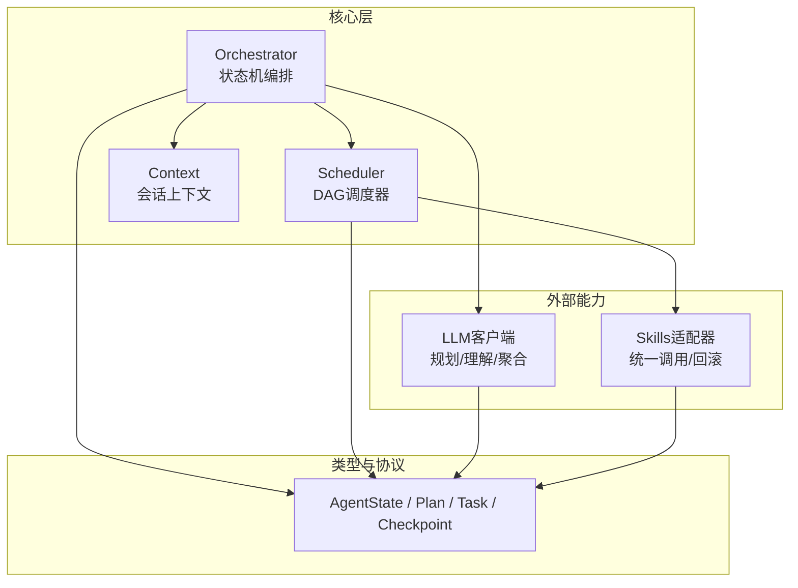
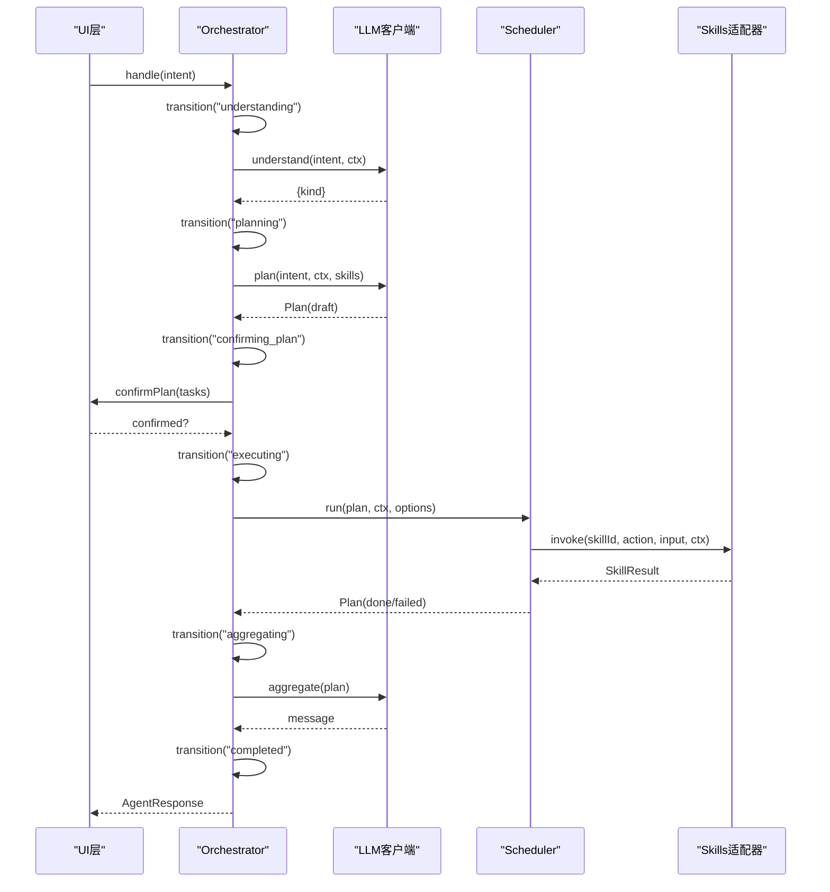
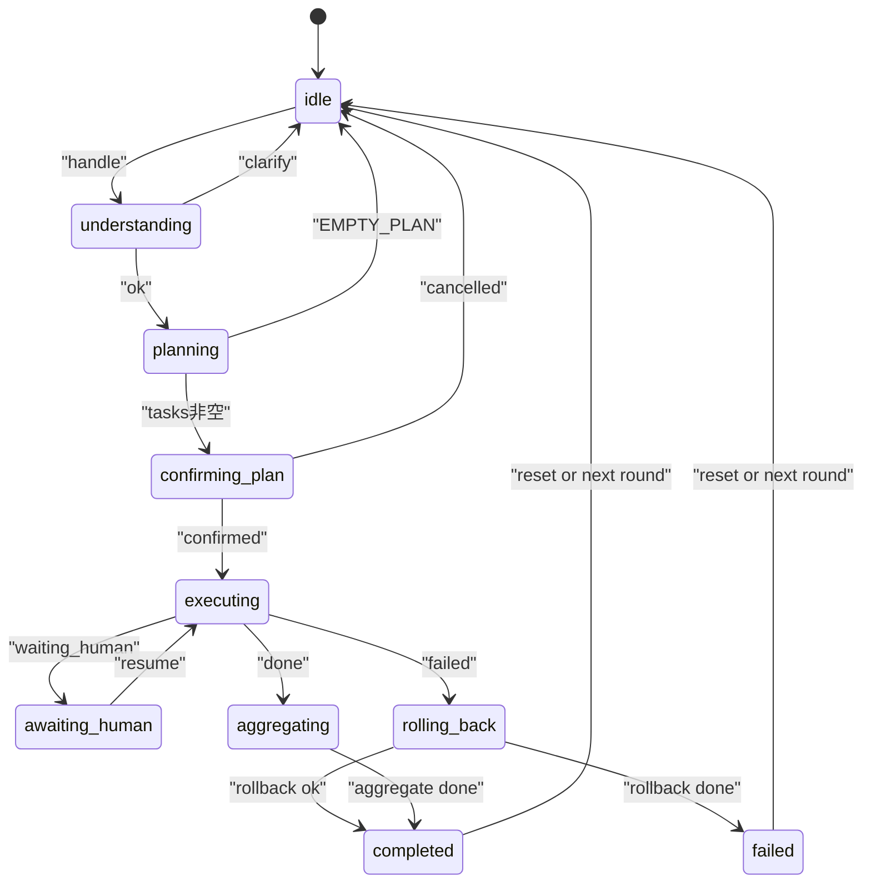
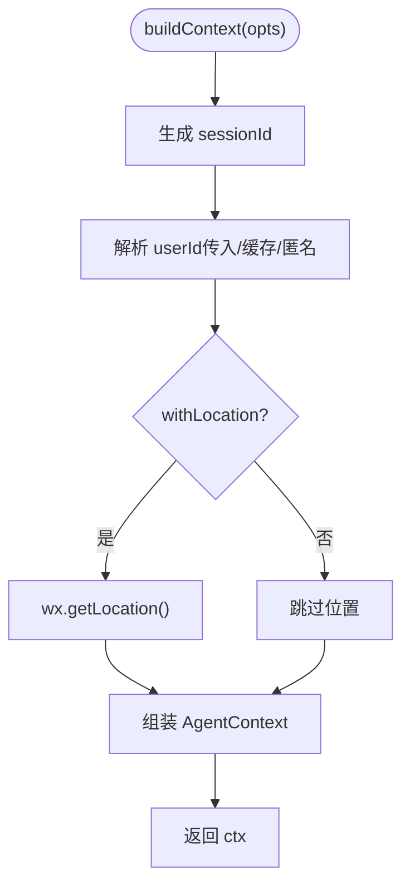
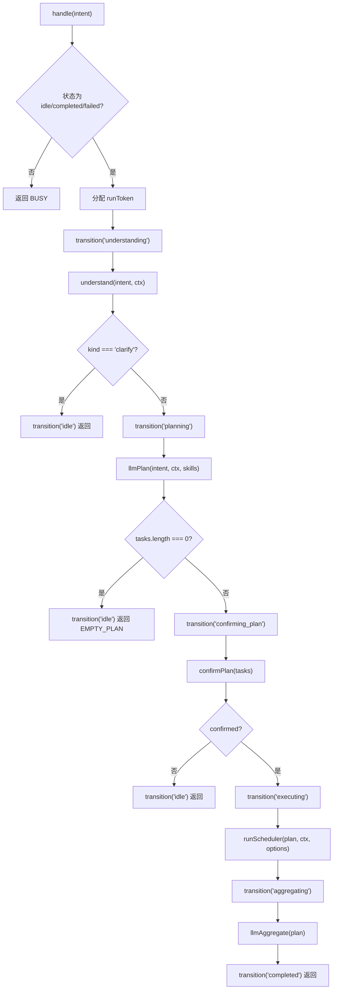
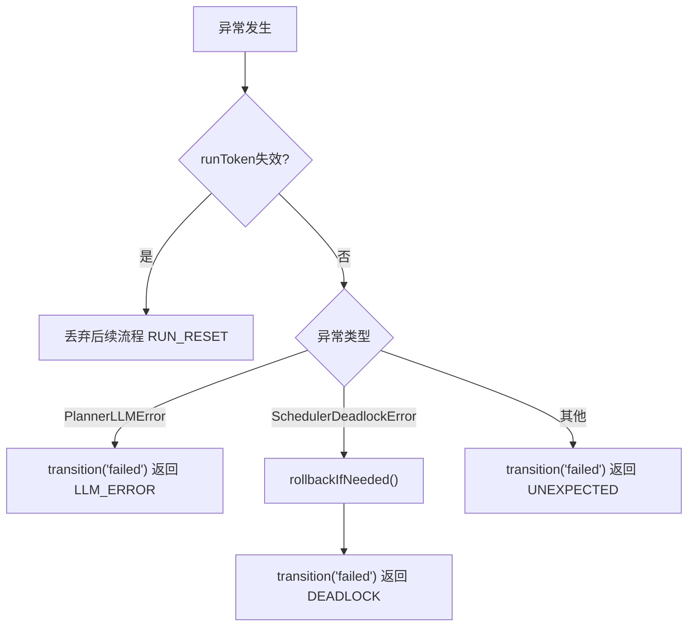
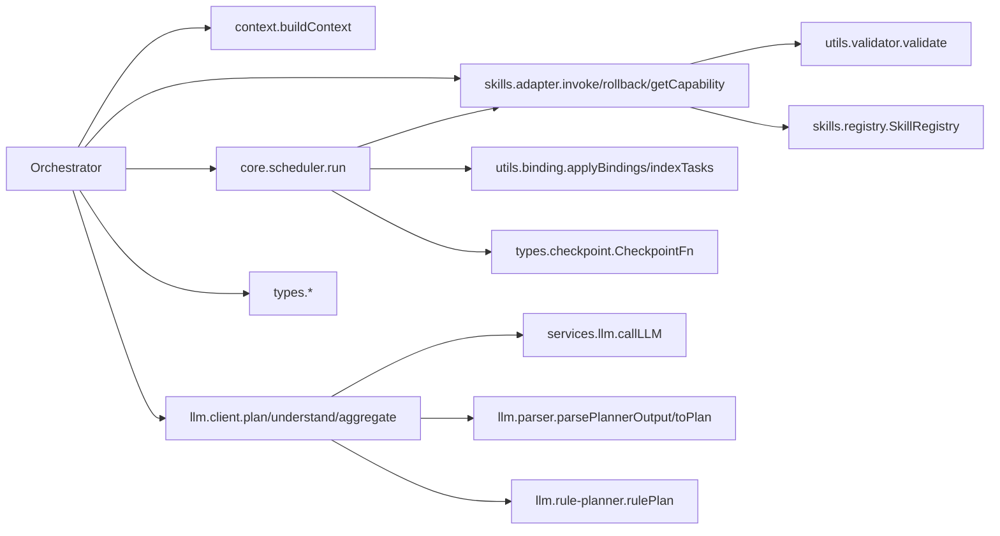

# Agent运行时架构

<cite>
**本文引用的文件**   
- [orchestrator.ts](file://miniprogram/src/core/orchestrator.ts)
- [context.ts](file://miniprogram/src/core/context.ts)
- [scheduler.ts](file://miniprogram/src/core/scheduler.ts)
- [agent-state.d.ts](file://miniprogram/src/types/agent-state.d.ts)
- [context.d.ts](file://miniprogram/src/types/context.d.ts)
- [plan.d.ts](file://miniprogram/src/types/plan.d.ts)
- [task.d.ts](file://miniprogram/src/types/task.d.ts)
- [checkpoint.d.ts](file://miniprogram/src/types/checkpoint.d.ts)
- [client.ts](file://miniprogram/src/llm/client.ts)
- [adapter.ts](file://miniprogram/src/skills/adapter.ts)
</cite>

## 目录
1. [引言](#引言)
2. [项目结构](#项目结构)
3. [核心组件](#核心组件)
4. [架构总览](#架构总览)
5. [详细组件分析](#详细组件分析)
6. [依赖关系分析](#依赖关系分析)
7. [性能与并发特性](#性能与并发特性)
8. [故障排查指南](#故障排查指南)
9. [结论](#结论)
10. [附录：初始化与使用示例](#附录初始化与使用示例)

## 引言
本文件面向WAIC-WeChat-MiniProgram的Agent运行时，重点阐述Orchestrator编排器的状态机设计、AgentContext上下文管理、AgentState状态定义与转换规则、handle端到端执行流程，以及错误处理、事务回滚和并发控制方案。文档同时提供可视化图示与可操作的初始化示例路径，帮助读者快速理解并扩展Agent运行时。

## 项目结构
Agent运行时位于小程序代码的src/core与相关types、llm、skills模块中，核心由以下部分组成：
- Orchestrator：状态机编排器，负责意图理解、计划生成、确认、调度执行、结果聚合与状态迁移。
- Scheduler：DAG任务调度器，负责任务依赖解析、并行执行、人类确认（checkpoint）与死锁检测。
- Context：会话上下文构造器，维护sessionId、userId、用户画像、全局变量、消息历史与追踪信息。
- LLM客户端：封装LLM调用、规划与结果聚合，支持开发环境降级。
- Skills适配器：统一技能调用入口，负责参数校验、埋点、错误包装与回滚能力查询。
- 类型定义：集中描述AgentState、Plan、Task、Checkpoint协议等关键数据结构。

图表来源
- [orchestrator.ts:13-26](file://miniprogram/src/core/orchestrator.ts#L13-L26)
- [scheduler.ts:18-25](file://miniprogram/src/core/scheduler.ts#L18-L25)
- [context.ts:14-18](file://miniprogram/src/core/context.ts#L14-L18)
- [client.ts:9-18](file://miniprogram/src/llm/client.ts#L9-L18)
- [adapter.ts:13-17](file://miniprogram/src/skills/adapter.ts#L13-L17)

章节来源
- [orchestrator.ts:1-340](file://miniprogram/src/core/orchestrator.ts#L1-L340)
- [scheduler.ts:1-245](file://miniprogram/src/core/scheduler.ts#L1-L245)
- [context.ts:1-104](file://miniprogram/src/core/context.ts#L1-L104)
- [client.ts:1-153](file://miniprogram/src/llm/client.ts#L1-L153)
- [adapter.ts:1-115](file://miniprogram/src/skills/adapter.ts#L1-L115)

## 核心组件
- Orchestrator：实现状态机模式，维护当前状态、当前Plan、执行令牌runToken，对外暴露handle、reset等方法，并通过回调注入交互层（confirmPlan、checkpoint、onTaskUpdate、onPlanUpdate、onStateChange）。
- Scheduler：基于DAG的任务调度器，按依赖就绪并行执行任务，支持人类确认checkpoint、死锁检测、级联跳过下游任务、令牌失效中止。
- Context：构建AgentContext，注入sessionId、userId、位置信息、globals、messages与trace；提供pushMessage用于会话记忆。
- LLM客户端：封装plan、understand、aggregate，支持云端LLM失败时的开发环境降级到本地规则规划器。
- Skills适配器：统一invoke与rollback接口，进行schema校验、埋点、错误包装，并提供getCapability查询能力元数据。

章节来源
- [orchestrator.ts:28-48](file://miniprogram/src/core/orchestrator.ts#L28-L48)
- [scheduler.ts:27-44](file://miniprogram/src/core/scheduler.ts#L27-L44)
- [context.ts:20-31](file://miniprogram/src/core/context.ts#L20-L31)
- [client.ts:20-25](file://miniprogram/src/llm/client.ts#L20-L25)
- [adapter.ts:19-22](file://miniprogram/src/skills/adapter.ts#L19-L22)

## 架构总览
Orchestrator作为编排中枢，串联LLM规划、Scheduler调度与Skills执行，贯穿意图理解→计划生成→确认→执行→聚合→完成/失败的完整生命周期。Scheduler在DAG上并行推进任务，必要时通过checkpoint请求人类确认，并在检测到死锁或令牌失效时中止运行。

图表来源
- [orchestrator.ts:106-221](file://miniprogram/src/core/orchestrator.ts#L106-L221)
- [client.ts:56-119](file://miniprogram/src/llm/client.ts#L56-L119)
- [scheduler.ts:77-127](file://miniprogram/src/core/scheduler.ts#L77-L127)
- [adapter.ts:37-85](file://miniprogram/src/skills/adapter.ts#L37-L85)

## 详细组件分析

### Orchestrator编排器与状态机
- 状态定义与转移表：
  - 允许的状态转移映射定义了各状态的合法后继，包括idle、understanding、planning、confirming_plan、executing、awaiting_human、aggregating、rolling_back、completed、failed。
  - understanding/planning可回idle以处理clarify与EMPTY_PLAN提前返回，避免BUSY永久死锁。
- 生命周期管理：
  - handle方法从意图理解开始，依次进入planning、confirming_plan、executing、aggregating，最终到达completed或failed。
  - reset方法强制归位idle，递增runToken使在途Scheduler与checkpoint失效，防止并发双跑与交错弹窗。
- 执行令牌与并发控制：
  - runToken用于标识本轮执行是否仍有效；Scheduler与checkpoint通过isRunActive探测，若失效则中止后续流程。
- 错误处理与回滚：
  - 捕获PlannerLLMError、SchedulerDeadlockError等异常，必要时先反序回滚已成功且可逆的任务，再转入failed。
  - rollbackIfNeeded根据capability.reversible标记，按反序撤销任务，单点回滚失败仅记录日志继续其余。

图表来源
- [orchestrator.ts:60-71](file://miniprogram/src/core/orchestrator.ts#L60-L71)
- [orchestrator.ts:106-255](file://miniprogram/src/core/orchestrator.ts#L106-L255)
- [orchestrator.ts:278-303](file://miniprogram/src/core/orchestrator.ts#L278-L303)

章节来源
- [orchestrator.ts:60-71](file://miniprogram/src/core/orchestrator.ts#L60-L71)
- [orchestrator.ts:106-255](file://miniprogram/src/core/orchestrator.ts#L106-L255)
- [orchestrator.ts:258-270](file://miniprogram/src/core/orchestrator.ts#L258-L270)
- [orchestrator.ts:278-303](file://miniprogram/src/core/orchestrator.ts#L278-L303)
- [orchestrator.ts:319-328](file://miniprogram/src/core/orchestrator.ts#L319-L328)

### AgentContext上下文管理机制
- 会话状态与会话ID：
  - buildContext自动生成sessionId，支持测试固定sessionId。
- 用户信息与画像：
  - userId优先使用传入值，否则从缓存获取openid，匿名时使用'anonymous'。
  - userProfile包含location（可选）、preferences与history（脱敏摘要）。
- 全局变量与追踪：
  - globals注入cloudEnv与自定义globals；trace记录llmCalls、skillCalls、totalTokens与startTime。
- 消息历史：
  - pushMessage追加消息至ctx.messages，限制最近20条以防内存膨胀。

图表来源
- [context.ts:61-91](file://miniprogram/src/core/context.ts#L61-L91)
- [context.ts:34-58](file://miniprogram/src/core/context.ts#L34-L58)

章节来源
- [context.ts:61-91](file://miniprogram/src/core/context.ts#L61-L91)
- [context.ts:94-104](file://miniprogram/src/core/context.ts#L94-L104)
- [context.d.ts:47-62](file://miniprogram/src/types/context.d.ts#L47-L62)

### AgentState状态定义与职责
- idle：空闲等待输入。
- understanding：意图识别阶段，可能返回clarify需补充信息。
- planning：任务拆解阶段，生成Plan（draft），若为空则EMPTY_PLAN。
- confirming_plan：等待用户确认Plan，确认后进入executing。
- executing：执行SKILL任务，可能因waiting_human转为awaiting_human。
- awaiting_human：等待人类确认（如支付），确认后回到executing。
- aggregating：结果聚合阶段，将任务结果翻译为用户可读消息。
- completed：执行成功结束。
- failed：不可恢复失败，可能伴随回滚。
- rolling_back：回滚进行中，按反序撤销已成功且可逆任务。

章节来源
- [agent-state.d.ts:7-17](file://miniprogram/src/types/agent-state.d.ts#L7-L17)
- [orchestrator.ts:60-71](file://miniprogram/src/core/orchestrator.ts#L60-L71)

### handle方法的端到端执行流程
- 守卫检查：若非idle/completed/failed直接返回BUSY。
- 令牌分配：++runToken，确保后续流程有效性。
- 意图理解：transition('understanding') → understand → clarify回idle或直接继续。
- 计划生成：transition('planning') → llmPlan → EMPTY_PLAN回idle。
- 计划确认：transition('confirming_plan') → confirmPlan → 取消回idle。
- 任务执行：transition('executing') → runScheduler → 可能触发awaiting_human。
- 结果聚合：transition('aggregating') → llmAggregate → transition('completed')。
- 异常处理：捕获异常，必要时rollbackIfNeeded，转入failed。

图表来源
- [orchestrator.ts:106-221](file://miniprogram/src/core/orchestrator.ts#L106-L221)
- [client.ts:56-119](file://miniprogram/src/llm/client.ts#L56-L119)
- [scheduler.ts:77-127](file://miniprogram/src/core/scheduler.ts#L77-L127)

章节来源
- [orchestrator.ts:106-221](file://miniprogram/src/core/orchestrator.ts#L106-L221)

### 错误处理机制、事务回滚策略与并发控制
- 错误分类与处理：
  - PlannerLLMError：LLM调用或解析失败，直接返回failed。
  - SchedulerDeadlockError：死锁检测抛出，先回滚再返回failed。
  - 其他异常：兜底返回UNEXPECTED。
- 事务回滚策略：
  - rollbackIfNeeded按反序撤销succeeded且reversible=true的任务，单点失败不中断整体回滚。
  - 回滚成功后更新任务状态为rolled_back并通知UI。
- 并发控制方案：
  - runToken令牌：reset或新一轮handle会使其失效，Scheduler与checkpoint通过isRunActive探测并中止。
  - checkpoint序列化：模块级Promise链串行化所有写操作确认，避免wx.showModal覆盖导致确认丢失。
  - 级联跳过：上游任务失败或绑定解析失败时，下游pending任务被标记skipped。

图表来源
- [orchestrator.ts:222-255](file://miniprogram/src/core/orchestrator.ts#L222-L255)
- [orchestrator.ts:278-303](file://miniprogram/src/core/orchestrator.ts#L278-L303)
- [scheduler.ts:62-74](file://miniprogram/src/core/scheduler.ts#L62-L74)

章节来源
- [orchestrator.ts:222-255](file://miniprogram/src/core/orchestrator.ts#L222-L255)
- [orchestrator.ts:278-303](file://miniprogram/src/core/orchestrator.ts#L278-L303)
- [scheduler.ts:62-74](file://miniprogram/src/core/scheduler.ts#L62-L74)
- [scheduler.ts:219-239](file://miniprogram/src/core/scheduler.ts#L219-L239)

### 状态转换图与语义说明
- 状态转换合法性由ALLOWED_TRANSITIONS约束，非法转移仅告警不中断（MVP宽松模式）。
- 关键转换语义：
  - understanding→planning：意图识别通过。
  - planning→confirming_plan：Plan非空。
  - confirming_plan→executing：用户确认。
  - executing→awaiting_human：出现waiting_human任务。
  - awaiting_human→executing：人类确认后恢复。
  - executing→aggregating：全部任务完成。
  - executing→rolling_back：执行失败需要回滚。
  - rolling_back→completed/failed：回滚结果决定终态。
  - completed/failed→idle：重置或下一轮。

章节来源
- [orchestrator.ts:60-71](file://miniprogram/src/core/orchestrator.ts#L60-L71)
- [orchestrator.ts:319-328](file://miniprogram/src/core/orchestrator.ts#L319-L328)

## 依赖关系分析
- Orchestrator依赖：
  - context.buildContext：构造会话上下文。
  - llm.client.plan/understand/aggregate：规划、理解与聚合。
  - core.scheduler.run：DAG调度执行。
  - skills.adapter.invoke/rollback/getCapability：技能调用与回滚。
  - types.*：AgentState、Plan、Task、Checkpoint协议。
- Scheduler依赖：
  - utils.binding.applyBindings/indexTasks：输入绑定解析与任务索引。
  - skills.adapter.invoke/getCapability：技能调用与能力查询。
  - types.checkpoint.CheckpointFn：人类确认回调。
- LLM客户端依赖：
  - services.llm.callLLM：云端LLM调用。
  - llm.parser.parsePlannerOutput/toPlan：输出解析与Plan构造。
  - llm.rule-planner.rulePlan：本地规则规划器降级。
- Skills适配器依赖：
  - utils.validator.validate：参数schema校验。
  - skills.registry.SkillRegistry：技能注册表。

图表来源
- [orchestrator.ts:13-26](file://miniprogram/src/core/orchestrator.ts#L13-L26)
- [scheduler.ts:18-25](file://miniprogram/src/core/scheduler.ts#L18-L25)
- [client.ts:9-18](file://miniprogram/src/llm/client.ts#L9-L18)
- [adapter.ts:13-17](file://miniprogram/src/skills/adapter.ts#L13-L17)

章节来源
- [orchestrator.ts:13-26](file://miniprogram/src/core/orchestrator.ts#L13-L26)
- [scheduler.ts:18-25](file://miniprogram/src/core/scheduler.ts#L18-L25)
- [client.ts:9-18](file://miniprogram/src/llm/client.ts#L9-L18)
- [adapter.ts:13-17](file://miniprogram/src/skills/adapter.ts#L13-L17)

## 性能与并发特性
- 并行执行：Scheduler使用Promise.allSettled并行执行ready任务，提升吞吐。
- 令牌失效中止：runToken确保旧流程不会与新流程交错，避免重复弹窗与重复下单。
- 死锁检测：当无ready任务且仍有pending任务且无人可执行时抛出SchedulerDeadlockError。
- 级联跳过：上游失败或绑定解析失败时，下游pending任务被标记skipped，减少无效计算。
- 回滚优化：仅对succeeded且reversible=true的任务进行反序回滚，降低开销。

[本节为通用性能讨论，不直接分析具体文件]

## 故障排查指南
- BUSY状态：
  - 现象：handle在非idle/completed/failed状态下直接返回BUSY。
  - 排查：检查是否存在未完成的执行流程或多次并发调用。
- EMPTY_PLAN：
  - 现象：LLM返回tasks为空，返回EMPTY_PLAN。
  - 排查：检查可用技能注册与Prompt是否包含必要技能元数据。
- LLM_ERROR：
  - 现象：PlannerLLMError抛出，返回LLM_ERROR。
  - 排查：检查云端LLM配置与网络连通性，开发环境可降级到本地规则规划器。
- DEADLOCK：
  - 现象：SchedulerDeadlockError抛出，返回DEADLOCK。
  - 排查：检查任务依赖图是否存在环或无法满足的前置条件。
- RUN_RESET：
  - 现象：runToken失效后返回RUN_RESET。
  - 排查：检查是否存在reset调用或新一轮handle接管。
- 回滚失败：
  - 现象：rollback返回rolled=false并记录reason。
  - 排查：检查技能是否实现rollback及回滚逻辑是否正确。

章节来源
- [orchestrator.ts:106-114](file://miniprogram/src/core/orchestrator.ts#L106-L114)
- [orchestrator.ts:138-146](file://miniprogram/src/core/orchestrator.ts#L138-L146)
- [orchestrator.ts:237-254](file://miniprogram/src/core/orchestrator.ts#L237-L254)
- [scheduler.ts:102-111](file://miniprogram/src/core/scheduler.ts#L102-L111)
- [orchestrator.ts:186-199](file://miniprogram/src/core/orchestrator.ts#L186-L199)
- [adapter.ts:87-107](file://miniprogram/src/skills/adapter.ts#L87-L107)

## 结论
Orchestrator通过清晰的状态机设计与严格的转移规则，实现了从意图理解到任务执行的端到端自动化流程。结合Scheduler的DAG调度、人类确认checkpoint与并发控制令牌，系统在保证一致性与用户体验的同时具备较强的容错与回滚能力。Context统一管理会话状态与用户画像，为多轮对话与个性化服务奠定基础。整体架构遵循单向依赖规范，便于扩展与维护。

[本节为总结性内容，不直接分析具体文件]

## 附录：初始化与使用示例
- 一次性会话初始化与处理：
  - 使用handleOnce工厂函数创建上下文与Orchestrator实例，并处理一轮意图。
  - 需要提供confirmPlan与checkpoint回调，以及可选的autoConfirm/autoApproveCheckpoint开关。
- 持续多轮对话：
  - 手动new Orchestrator(ctx, options)，复用同一实例进行多次handle调用。
  - 通过onStateChange监听状态变化，更新UI提示。
- 状态变化事件处理：
  - onTaskUpdate：接收任务状态更新，驱动UI实时反馈。
  - onPlanUpdate：接收Plan草稿或确认后的状态变更。
  - onStateChange：接收状态机转移事件，用于阶段提示。

章节来源
- [orchestrator.ts:331-340](file://miniprogram/src/core/orchestrator.ts#L331-L340)
- [orchestrator.ts:28-48](file://miniprogram/src/core/orchestrator.ts#L28-L48)
- [checkpoint.d.ts:17-44](file://miniprogram/src/types/checkpoint.d.ts#L17-L44)