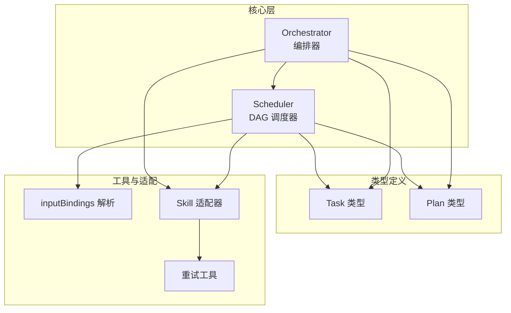
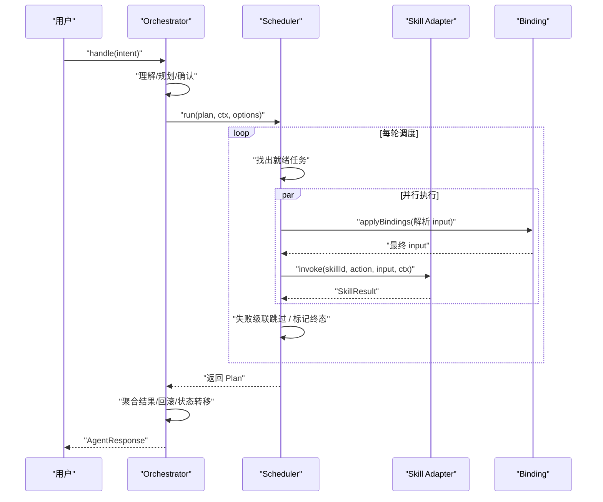
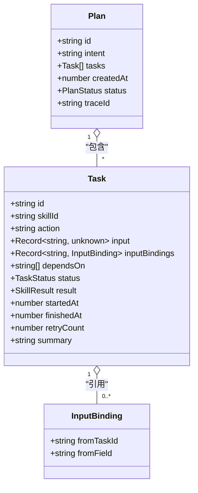
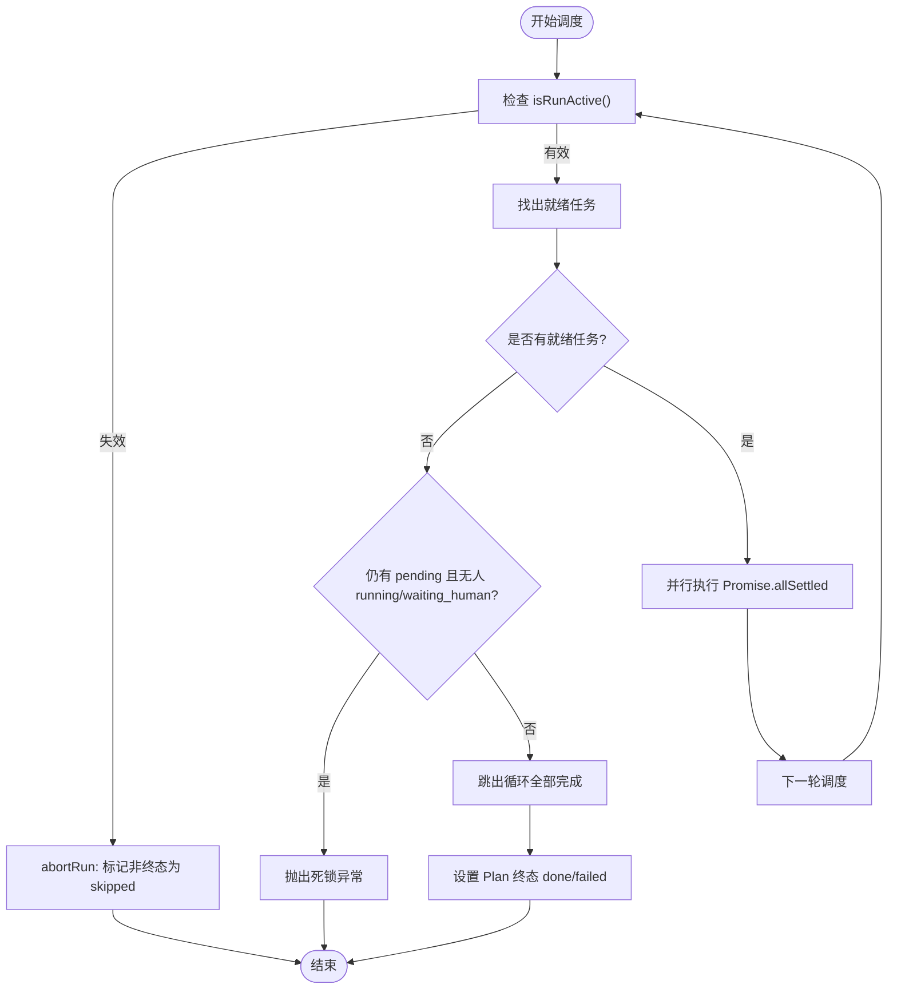
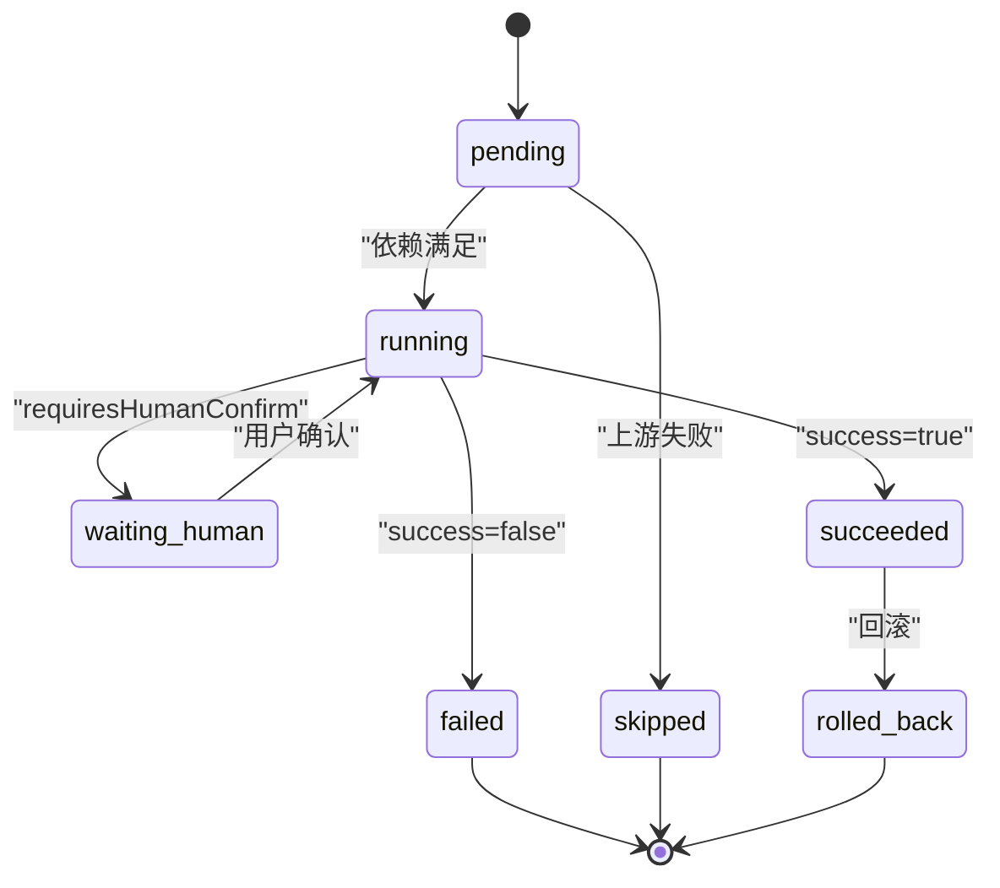
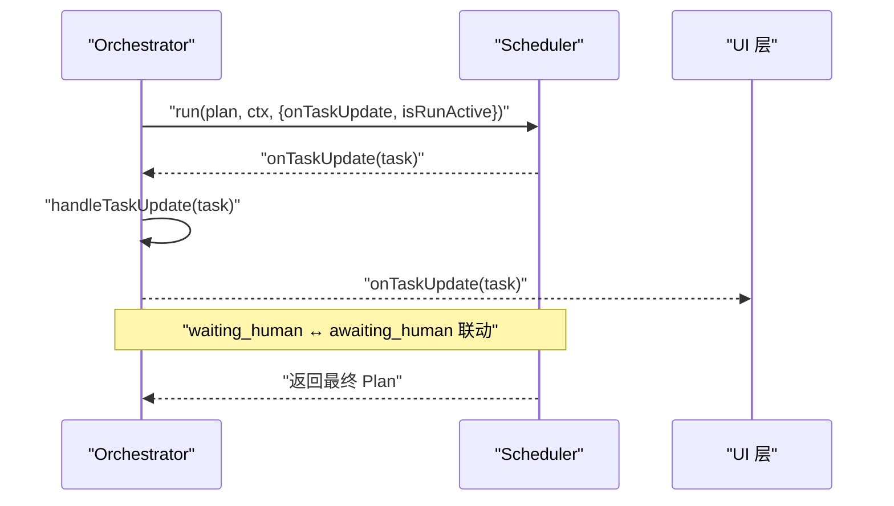
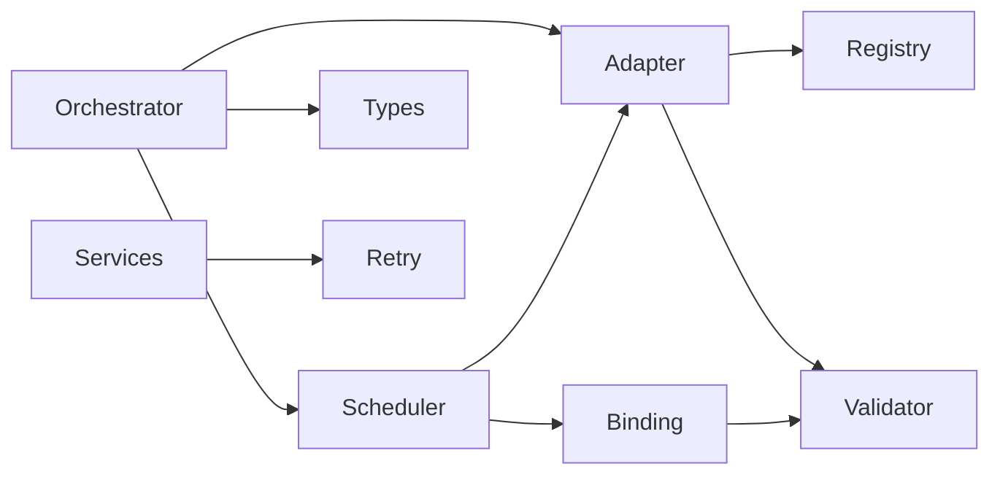
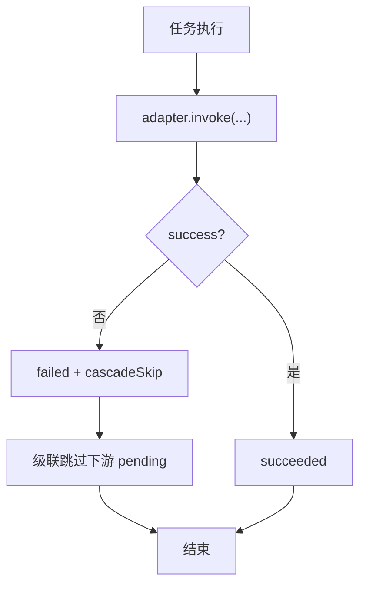

# 任务调度系统

<cite>
**本文引用的文件**   
- [scheduler.ts](file://miniprogram/src/core/scheduler.ts)
- [orchestrator.ts](file://miniprogram/src/core/orchestrator.ts)
- [task.d.ts](file://miniprogram/src/types/task.d.ts)
- [plan.d.ts](file://miniprogram/src/types/plan.d.ts)
- [binding.ts](file://miniprogram/src/utils/binding.ts)
- [adapter.ts](file://miniprogram/src/skills/adapter.ts)
- [retry.ts](file://miniprogram/src/utils/retry.ts)
</cite>

## 目录
1. [引言](#引言)
2. [项目结构](#项目结构)
3. [核心组件](#核心组件)
4. [架构总览](#架构总览)
5. [详细组件分析](#详细组件分析)
6. [依赖关系分析](#依赖关系分析)
7. [性能与资源管理](#性能与资源管理)
8. [错误处理、重试与超时](#错误处理重试与超时)
9. [故障排查指南](#故障排查指南)
10. [结论](#结论)

## 引言
本文件面向 WAIC-WeChat-MiniProgram 的任务调度子系统，系统性阐述基于 DAG（有向无环图）的任务调度引擎设计。内容涵盖：
- 任务依赖关系的解析与数据绑定
- 并行执行策略与资源管理
- Task 与 Plan 数据模型的状态流转
- Scheduler 调度器的核心算法：就绪判定、并行批处理、死锁检测
- 任务生命周期：创建、依赖检查、资源分配、执行完成
- 错误处理策略、重试机制与超时控制
- 与 Orchestrator 的协作模式：任务更新回调与状态同步

该文档既适合快速理解整体架构，也适合深入定位实现细节与扩展点。

## 项目结构
与任务调度相关的关键代码位于 miniprogram 子工程：
- core：Orchestrator（编排器）、Scheduler（调度器）
- types：Task、Plan 等类型定义
- utils：inputBindings 解析、重试工具
- skills：技能适配器，统一调用与回滚

图表来源
- [orchestrator.ts:1-340](file://miniprogram/src/core/orchestrator.ts#L1-L340)
- [scheduler.ts:1-245](file://miniprogram/src/core/scheduler.ts#L1-L245)
- [task.d.ts:1-59](file://miniprogram/src/types/task.d.ts#L1-L59)
- [plan.d.ts:1-51](file://miniprogram/src/types/plan.d.ts#L1-L51)
- [binding.ts:1-50](file://miniprogram/src/utils/binding.ts#L1-L50)
- [adapter.ts:1-115](file://miniprogram/src/skills/adapter.ts#L1-L115)
- [retry.ts:1-101](file://miniprogram/src/utils/retry.ts#L1-L101)

章节来源
- [orchestrator.ts:1-340](file://miniprogram/src/core/orchestrator.ts#L1-L340)
- [scheduler.ts:1-245](file://miniprogram/src/core/scheduler.ts#L1-L245)
- [task.d.ts:1-59](file://miniprogram/src/types/task.d.ts#L1-L59)
- [plan.d.ts:1-51](file://miniprogram/src/types/plan.d.ts#L1-L51)
- [binding.ts:1-50](file://miniprogram/src/utils/binding.ts#L1-L50)
- [adapter.ts:1-115](file://miniprogram/src/skills/adapter.ts#L1-L115)
- [retry.ts:1-101](file://miniprogram/src/utils/retry.ts#L1-L101)

## 核心组件
- Orchestrator：负责用户意图理解、计划生成、计划确认、调度执行、结果聚合与状态机转移；提供 runToken 令牌防止并发双跑。
- Scheduler：基于 DAG 的调度器，按轮次找出就绪任务并并行执行，支持人类确认 checkpoint、级联跳过、死锁检测。
- Skill Adapter：统一封装技能调用、参数校验、错误转换、回滚能力查询。
- Binding：跨任务数据流绑定解析，将上游成功输出注入下游输入。
- Retry：指数退避重试工具，供上层服务使用。

章节来源
- [orchestrator.ts:28-48](file://miniprogram/src/core/orchestrator.ts#L28-L48)
- [scheduler.ts:27-44](file://miniprogram/src/core/scheduler.ts#L27-L44)
- [adapter.ts:19-22](file://miniprogram/src/skills/adapter.ts#L19-L22)
- [binding.ts:18-43](file://miniprogram/src/utils/binding.ts#L18-L43)
- [retry.ts:15-26](file://miniprogram/src/utils/retry.ts#L15-L26)

## 架构总览
Orchestrator 作为入口，驱动理解、规划、确认、执行、聚合流程；Scheduler 在“执行”阶段负责 DAG 调度；Skill Adapter 屏蔽具体技能差异；Binding 负责跨任务数据流；Retry 为网络或外部调用提供重试保障。

图表来源
- [orchestrator.ts:106-256](file://miniprogram/src/core/orchestrator.ts#L106-L256)
- [scheduler.ts:77-128](file://miniprogram/src/core/scheduler.ts#L77-L128)
- [binding.ts:18-43](file://miniprogram/src/utils/binding.ts#L18-L43)
- [adapter.ts:37-85](file://miniprogram/src/skills/adapter.ts#L37-L85)

## 详细组件分析

### 数据模型：Task 与 Plan
- Task：最小执行单元，包含 skillId、action、input、inputBindings、dependsOn、status、result、startedAt、finishedAt、retryCount、summary 等字段。
- Plan：DAG 任务集合，包含 id、intent、tasks、createdAt、status、traceId 等字段。

图表来源
- [task.d.ts:12-59](file://miniprogram/src/types/task.d.ts#L12-L59)
- [plan.d.ts:12-33](file://miniprogram/src/types/plan.d.ts#L12-L33)

章节来源
- [task.d.ts:12-59](file://miniprogram/src/types/task.d.ts#L12-L59)
- [plan.d.ts:12-33](file://miniprogram/src/types/plan.d.ts#L12-L33)

### 调度器 Scheduler：DAG 调度与并行执行
- 每轮调度：
  - 计算就绪任务：status=pending 且所有 dependsOn 对应的上游任务 status=succeeded。
  - 并行执行：Promise.allSettled 批量执行就绪任务。
  - 终止条件：全部任务进入终态（succeeded/failed/skipped），或检测到死锁。
- 人类确认：若 capability.requiresHumanConfirm，则进入 waiting_human，通过序列化 checkpoint 链确保同一时刻仅一个确认弹窗。
- 失败传播：单个任务失败后，级联将其下游 pending 任务标记为 skipped。
- 运行令牌：isRunActive 探测 Orchestrator 是否仍有效，失效时中止本轮调度并将非终态任务标记为 skipped。

图表来源
- [scheduler.ts:77-128](file://miniprogram/src/core/scheduler.ts#L77-L128)
- [scheduler.ts:131-137](file://miniprogram/src/core/scheduler.ts#L131-L137)
- [scheduler.ts:207-240](file://miniprogram/src/core/scheduler.ts#L207-L240)

章节来源
- [scheduler.ts:77-128](file://miniprogram/src/core/scheduler.ts#L77-L128)
- [scheduler.ts:131-137](file://miniprogram/src/core/scheduler.ts#L131-L137)
- [scheduler.ts:139-204](file://miniprogram/src/core/scheduler.ts#L139-L204)
- [scheduler.ts:207-240](file://miniprogram/src/core/scheduler.ts#L207-L240)

### 任务执行生命周期
- 创建：由 Planner 产出 Plan 与 Task 列表，Orchestrator 维护当前 Plan。
- 依赖检查：Scheduler 每轮筛选就绪任务。
- 资源分配：通过 Skill Adapter 获取 capability 元信息，决定是否需人类确认。
- 执行：调用 adapter.invoke，记录耗时与结果。
- 完成：根据 result.success 设置 succeeded/failed，失败触发级联跳过。
- 回滚：Orchestrator 在失败路径按反序对可逆已成功任务执行 rollback。

图表来源
- [task.d.ts:12-19](file://miniprogram/src/types/task.d.ts#L12-L19)
- [scheduler.ts:139-204](file://miniprogram/src/core/scheduler.ts#L139-L204)
- [orchestrator.ts:278-303](file://miniprogram/src/core/orchestrator.ts#L278-L303)

章节来源
- [task.d.ts:12-19](file://miniprogram/src/types/task.d.ts#L12-L19)
- [scheduler.ts:139-204](file://miniprogram/src/core/scheduler.ts#L139-L204)
- [orchestrator.ts:278-303](file://miniprogram/src/core/orchestrator.ts#L278-L303)

### 与 Orchestrator 的协作模式
- 任务更新回调：Scheduler 通过 onTaskUpdate 推送任务状态变化；Orchestrator 在 handleTaskUpdate 中将 waiting_human 映射到 awaiting_human，running 映射回 executing，保持 UI 一致。
- 状态同步：Orchestrator 持有当前 state 与 currentPlan，并在异常或 reset 时进行安全归位。
- 执行令牌：Orchestrator 每次 handle 递增 runToken，并通过 isRunActive 让 Scheduler 感知是否应中止。

图表来源
- [orchestrator.ts:177-183](file://miniprogram/src/core/orchestrator.ts#L177-L183)
- [orchestrator.ts:310-317](file://miniprogram/src/core/orchestrator.ts#L310-L317)
- [scheduler.ts:77-128](file://miniprogram/src/core/scheduler.ts#L77-L128)

章节来源
- [orchestrator.ts:177-183](file://miniprogram/src/core/orchestrator.ts#L177-L183)
- [orchestrator.ts:310-317](file://miniprogram/src/core/orchestrator.ts#L310-L317)
- [scheduler.ts:77-128](file://miniprogram/src/core/scheduler.ts#L77-L128)

### 复杂依赖图构建与自定义调度策略示例
- 构建复杂依赖图：
  - 通过 Plan.tasks 声明多个 Task，并使用 dependsOn 建立 DAG。
  - 使用 inputBindings 将上游 Task.result.data 或 .bindings 中的字段注入下游 Task.input。
  - 示例场景：先查询订单详情，再根据订单状态发起支付，最后发送通知。
- 自定义调度策略：
  - 通过 SchedulerOptions.onTaskUpdate 监听任务状态变化，实现优先级提示或动态调整 UI。
  - 通过 SchedulerOptions.isRunActive 控制调度中止时机，例如用户主动取消或新一轮接管。
  - 通过 checkpoint 注入人类确认逻辑，确保写操作安全。

章节来源
- [plan.d.ts:19-33](file://miniprogram/src/types/plan.d.ts#L19-L33)
- [task.d.ts:30-59](file://miniprogram/src/types/task.d.ts#L30-L59)
- [binding.ts:18-43](file://miniprogram/src/utils/binding.ts#L18-L43)
- [scheduler.ts:27-44](file://miniprogram/src/core/scheduler.ts#L27-L44)

## 依赖关系分析
- Orchestrator 依赖 Scheduler、Skill Adapter、LLM 客户端、类型定义与日志工具。
- Scheduler 依赖 Skill Adapter、Binding、类型定义与日志工具。
- Skill Adapter 依赖 SkillRegistry、Validator、Logger。
- Binding 依赖 Validator 的路径读取与写入工具。
- Retry 被上层服务用于网络调用重试。

图表来源
- [orchestrator.ts:13-26](file://miniprogram/src/core/orchestrator.ts#L13-L26)
- [scheduler.ts:18-25](file://miniprogram/src/core/scheduler.ts#L18-L25)
- [adapter.ts:13-17](file://miniprogram/src/skills/adapter.ts#L13-L17)
- [binding.ts:10-11](file://miniprogram/src/utils/binding.ts#L10-L11)
- [retry.ts:13-13](file://miniprogram/src/utils/retry.ts#L13-L13)

章节来源
- [orchestrator.ts:13-26](file://miniprogram/src/core/orchestrator.ts#L13-L26)
- [scheduler.ts:18-25](file://miniprogram/src/core/scheduler.ts#L18-L25)
- [adapter.ts:13-17](file://miniprogram/src/skills/adapter.ts#L13-L17)
- [binding.ts:10-11](file://miniprogram/src/utils/binding.ts#L10-L11)
- [retry.ts:13-13](file://miniprogram/src/utils/retry.ts#L13-L13)

## 性能与资源管理
- 并行执行：使用 Promise.allSettled 批量执行就绪任务，最大化吞吐。
- 人类确认序列化：checkpointChain 保证同一时刻只有一个确认弹窗，避免 UI 冲突。
- 迭代保护：guard 计数器限制最大轮数，防止逻辑错误导致无限循环。
- 资源清理：reset 时递增 runToken，使在途调度与 checkpoint 失效，避免并发双跑与重复下单。

章节来源
- [scheduler.ts:117-119](file://miniprogram/src/core/scheduler.ts#L117-L119)
- [scheduler.ts:62-74](file://miniprogram/src/core/scheduler.ts#L62-L74)
- [scheduler.ts:94-97](file://miniprogram/src/core/scheduler.ts#L94-L97)
- [orchestrator.ts:258-270](file://miniprogram/src/core/orchestrator.ts#L258-L270)

## 错误处理、重试与超时
- 任务失败处理：
  - failTask 设置 task.status=failed，记录错误码与消息，并级联跳过下游 pending 任务。
  - cascadeSkip 递归标记依赖链上的 pending 任务为 skipped。
- 死锁检测：
  - 当没有就绪任务且存在 pending 但无人 running/waiting_human，抛出 SchedulerDeadlockError。
- 重试机制：
  - 通用重试工具 retry 提供指数退避与抖动，支持 shouldRetry 判断与 onRetry 钩子。
  - LLM 与云服务调用中结合 retry 与 markRetryable 实现可重试错误分类。
- 超时控制：
  - 云服务调用封装了 timeoutMs 参数，超时错误标记为可重试。
  - 云函数侧使用 AbortSignal.timeout 控制上游请求超时。

图表来源
- [scheduler.ts:207-240](file://miniprogram/src/core/scheduler.ts#L207-L240)
- [adapter.ts:37-85](file://miniprogram/src/skills/adapter.ts#L37-L85)
- [retry.ts:42-85](file://miniprogram/src/utils/retry.ts#L42-L85)

章节来源
- [scheduler.ts:207-240](file://miniprogram/src/core/scheduler.ts#L207-L240)
- [retry.ts:42-85](file://miniprogram/src/utils/retry.ts#L42-L85)

## 故障排查指南
- 任务卡死（DEADLOCK）：
  - 现象：调度器抛出死锁异常，部分任务处于 pending。
  - 排查：检查 dependsOn 是否存在环或上游未成功；确认是否需要人类确认但未收到回调。
  - 参考：[scheduler.ts:102-114](file://miniprogram/src/core/scheduler.ts#L102-L114)、[orchestrator.ts:234-248](file://miniprogram/src/core/orchestrator.ts#L234-L248)
- 执行期间被重置（RUN_RESET）：
  - 现象：Orchestrator.handle 返回 RUN_RESET，任务被标记 skipped。
  - 原因：新一轮 handle 或 reset 导致 runToken 失效。
  - 参考：[orchestrator.ts:186-199](file://miniprogram/src/core/orchestrator.ts#L186-L199)、[scheduler.ts:87-93](file://miniprogram/src/core/scheduler.ts#L87-L93)
- 人类确认丢失：
  - 现象：多个写操作同时弹出确认框，前序弹窗被顶掉。
  - 解决：checkpointChain 已串行化，确保同一时刻仅一个弹窗；检查上层是否正确注入 checkpoint。
  - 参考：[scheduler.ts:54-74](file://miniprogram/src/core/scheduler.ts#L54-L74)
- 输入绑定失败：
  - 现象：applyBindings 抛错，任务标记 BINDING_FAILED。
  - 排查：确认上游任务成功且有 data/bindings；检查 fromField 路径是否正确。
  - 参考：[binding.ts:18-43](file://miniprogram/src/utils/binding.ts#L18-L43)、[scheduler.ts:149-158](file://miniprogram/src/core/scheduler.ts#L149-L158)
- 技能未注册或能力缺失：
  - 现象：adapter.invoke 返回 SKILL_NOT_FOUND 或 CAPABILITY_NOT_FOUND。
  - 排查：确认 SkillRegistry 已注册对应 skillId 与 action。
  - 参考：[adapter.ts:44-56](file://miniprogram/src/skills/adapter.ts#L44-L56)

章节来源
- [scheduler.ts:54-74](file://miniprogram/src/core/scheduler.ts#L54-L74)
- [scheduler.ts:87-93](file://miniprogram/src/core/scheduler.ts#L87-L93)
- [scheduler.ts:102-114](file://miniprogram/src/core/scheduler.ts#L102-L114)
- [scheduler.ts:149-158](file://miniprogram/src/core/scheduler.ts#L149-L158)
- [orchestrator.ts:186-199](file://miniprogram/src/core/orchestrator.ts#L186-L199)
- [orchestrator.ts:234-248](file://miniprogram/src/core/orchestrator.ts#L234-L248)
- [binding.ts:18-43](file://miniprogram/src/utils/binding.ts#L18-L43)
- [adapter.ts:44-56](file://miniprogram/src/skills/adapter.ts#L44-L56)

## 结论
WAIC-WeChat-MiniProgram 的任务调度系统以 Orchestrator 为编排中枢，Scheduler 为核心 DAG 调度器，配合 Skill Adapter、Binding 与 Retry 工具，实现了高内聚、低耦合的可扩展任务执行框架。其关键特性包括：
- 明确的 Task/Plan 数据模型与状态机
- 基于就绪判定的并行执行与级联失败传播
- 人类确认的序列化互斥与 UI 一致性
- 死锁检测与运行令牌防并发双跑
- 失败回滚与重试/超时机制

该设计在保证可靠性的同时具备良好的可扩展性，便于后续引入更复杂的调度策略（如优先级队列、资源配额、动态扩缩容）与更丰富的监控指标。