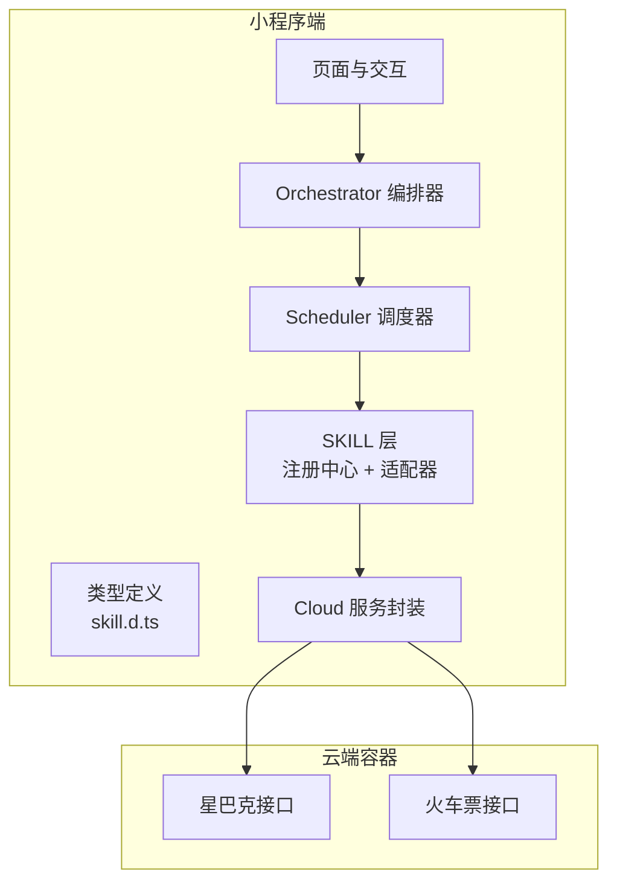
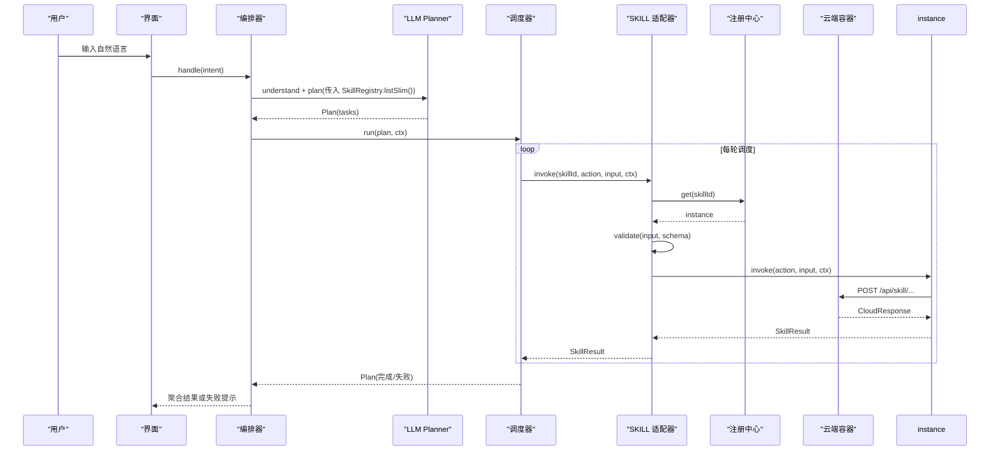
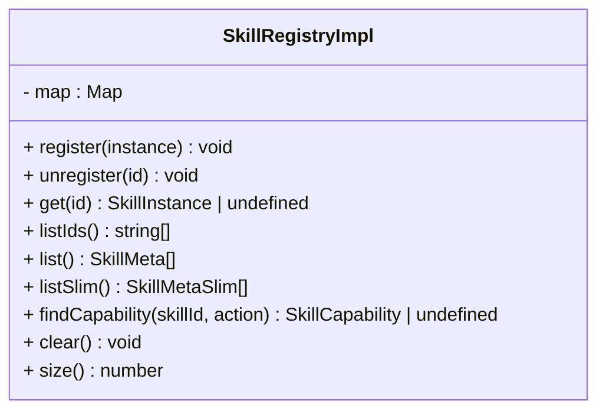
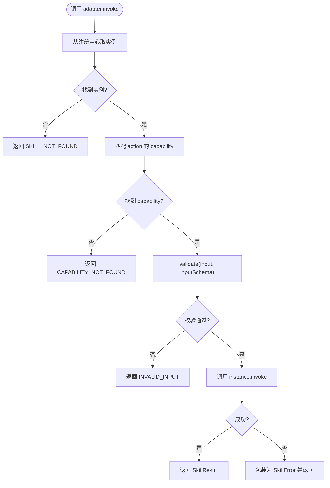
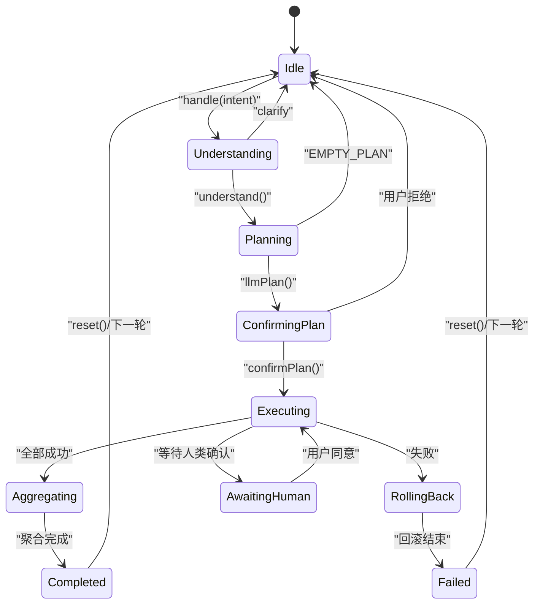
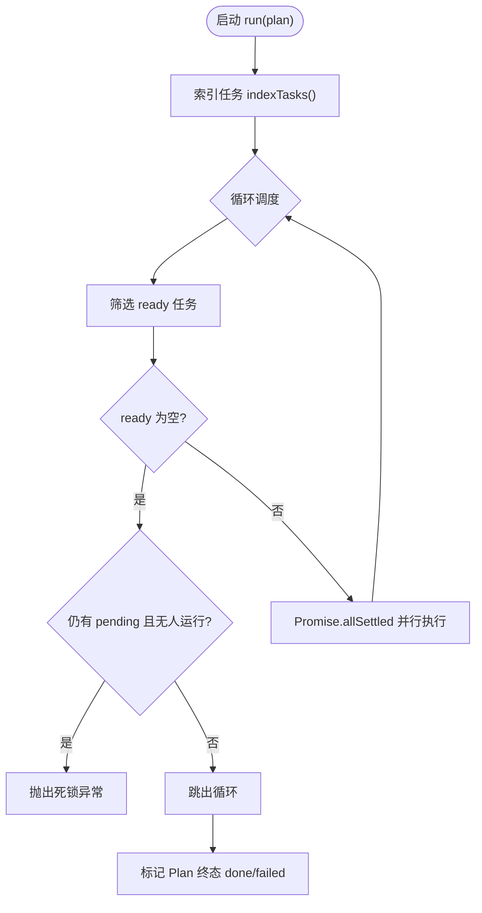
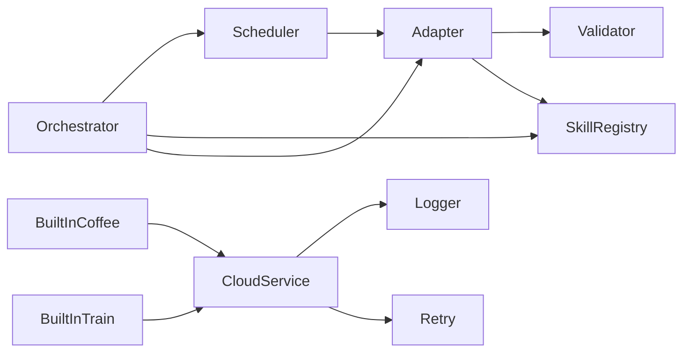

# 插件化架构

<cite>
**本文引用的文件**   
- [miniprogram/src/skills/registry.ts](file://miniprogram/src/skills/registry.ts)
- [miniprogram/src/skills/adapter.ts](file://miniprogram/src/skills/adapter.ts)
- [miniprogram/src/skills/index.ts](file://miniprogram/src/skills/index.ts)
- [miniprogram/src/types/skill.d.ts](file://miniprogram/src/types/skill.d.ts)
- [miniprogram/src/core/orchestrator.ts](file://miniprogram/src/core/orchestrator.ts)
- [miniprogram/src/core/scheduler.ts](file://miniprogram/src/core/scheduler.ts)
- [miniprogram/src/services/cloud.ts](file://miniprogram/src/services/cloud.ts)
- [miniprogram/src/utils/validator.ts](file://miniprogram/src/utils/validator.ts)
- [miniprogram/src/skills/builtin/coffee-starbucks/index.ts](file://miniprogram/src/skills/builtin/coffee-starbucks/index.ts)
- [miniprogram/src/skills/builtin/train-12306/index.ts](file://miniprogram/src/skills/builtin/train-12306/index.ts)
- [cloudrun/src/skill-coffee.ts](file://cloudrun/src/skill-coffee.ts)
- [cloudrun/src/skill-train.ts](file://cloudrun/src/skill-train.ts)
</cite>

## 目录
1. [引言](#引言)
2. [项目结构](#项目结构)
3. [核心组件](#核心组件)
4. [架构总览](#架构总览)
5. [详细组件分析](#详细组件分析)
6. [依赖关系分析](#依赖关系分析)
7. [性能与可靠性考量](#性能与可靠性考量)
8. [故障排查指南](#故障排查指南)
9. [结论](#结论)
10. [附录：自定义 SKILL 开发实践](#附录自定义-skill-开发实践)

## 引言
本文件面向 WAIC-WeChat-MiniProgram 的插件化架构，重点阐述 SKILL 注册中心、适配器模式、调度编排、生命周期管理、插件间通信与安全机制。文档同时给出星巴克咖啡与火车票两个内置 SKILL 的实现模式，并总结如何扩展新的自定义 SKILL。

## 项目结构
本项目采用“小程序前端 + 云端容器”的分层架构：
- 小程序端负责用户交互、意图理解、计划编排、任务调度与 SKILL 调用。
- 云端容器提供各 SKILL 的业务接口（查询、下单、取消等），并在写操作中执行鉴权与幂等控制。

图表来源
- [miniprogram/src/core/orchestrator.ts:106-256](file://miniprogram/src/core/orchestrator.ts#L106-L256)
- [miniprogram/src/core/scheduler.ts:77-128](file://miniprogram/src/core/scheduler.ts#L77-L128)
- [miniprogram/src/skills/adapter.ts:37-85](file://miniprogram/src/skills/adapter.ts#L37-L85)
- [miniprogram/src/services/cloud.ts:64-149](file://miniprogram/src/services/cloud.ts#L64-L149)
- [cloudrun/src/skill-coffee.ts:119-123](file://cloudrun/src/skill-coffee.ts#L119-L123)
- [cloudrun/src/skill-train.ts:143-147](file://cloudrun/src/skill-train.ts#L143-L147)

章节来源
- [miniprogram/src/core/orchestrator.ts:1-340](file://miniprogram/src/core/orchestrator.ts#L1-L340)
- [miniprogram/src/core/scheduler.ts:1-245](file://miniprogram/src/core/scheduler.ts#L1-L245)
- [miniprogram/src/skills/adapter.ts:1-115](file://miniprogram/src/skills/adapter.ts#L1-L115)
- [miniprogram/src/services/cloud.ts:1-223](file://miniprogram/src/services/cloud.ts#L1-L223)
- [cloudrun/src/skill-coffee.ts:1-124](file://cloudrun/src/skill-coffee.ts#L1-L124)
- [cloudrun/src/skill-train.ts:1-148](file://cloudrun/src/skill-train.ts#L1-L148)

## 核心组件
- SKILL 协议与类型：统一描述元信息、能力声明、执行结果与错误模型。
- 注册中心：维护 SKILL 实例映射，提供注册、反注册、列出元信息、按 skillId/action 查询能力等。
- 适配器：统一入口，负责参数校验、埋点、错误包装、回滚桥接。
- 编排器：状态机驱动，串联理解、规划、确认、执行、聚合、失败回滚等阶段。
- 调度器：DAG 任务调度，支持并行执行、人类确认、级联跳过、死锁检测。
- 云端服务封装：统一超时、重试、会话关联与开发环境降级策略。
- 内置 SKILL：星巴克咖啡、火车票，演示标准实现模式。

章节来源
- [miniprogram/src/types/skill.d.ts:1-119](file://miniprogram/src/types/skill.d.ts#L1-L119)
- [miniprogram/src/skills/registry.ts:16-91](file://miniprogram/src/skills/registry.ts#L16-L91)
- [miniprogram/src/skills/adapter.ts:19-115](file://miniprogram/src/skills/adapter.ts#L19-L115)
- [miniprogram/src/core/orchestrator.ts:74-340](file://miniprogram/src/core/orchestrator.ts#L74-L340)
- [miniprogram/src/core/scheduler.ts:27-245](file://miniprogram/src/core/scheduler.ts#L27-L245)
- [miniprogram/src/services/cloud.ts:16-223](file://miniprogram/src/services/cloud.ts#L16-L223)
- [miniprogram/src/skills/builtin/coffee-starbucks/index.ts:58-177](file://miniprogram/src/skills/builtin/coffee-starbucks/index.ts#L58-L177)
- [miniprogram/src/skills/builtin/train-12306/index.ts:69-190](file://miniprogram/src/skills/builtin/train-12306/index.ts#L69-L190)

## 架构总览
SKILL 系统通过“注册中心 + 适配器 + 调度器 + 编排器”形成松耦合的插件体系。LLM Planner 基于 SkillMetaSlim 进行路由决策；Scheduler 根据 Task DAG 调度具体 SKILL；Adapter 保证入参安全与错误一致性；Cloud 封装屏蔽底层差异并提供可观测性。

图表来源
- [miniprogram/src/core/orchestrator.ts:106-256](file://miniprogram/src/core/orchestrator.ts#L106-L256)
- [miniprogram/src/core/scheduler.ts:77-128](file://miniprogram/src/core/scheduler.ts#L77-L128)
- [miniprogram/src/skills/adapter.ts:37-85](file://miniprogram/src/skills/adapter.ts#L37-L85)
- [miniprogram/src/skills/registry.ts:36-60](file://miniprogram/src/skills/registry.ts#L36-L60)
- [miniprogram/src/services/cloud.ts:64-149](file://miniprogram/src/services/cloud.ts#L64-L149)

## 详细组件分析

### SKILL 协议与类型规范
- SkillMeta：全局唯一 id、名称、LLM 可读描述、语义版本、所有者 appid、标签、能力清单。
- SkillCapability：action、描述、inputSchema/outputSchema、幂等性、可回滚性、是否需要人类确认、预估延迟。
- SkillResult：success、data、error、bindings（供下游引用）。
- SkillError：code、message、retryable。
- SkillInstance：meta、invoke、可选 rollback。

这些类型是 Planner 路由、Adapter 校验、Scheduler 排程与回滚的统一契约。

章节来源
- [miniprogram/src/types/skill.d.ts:16-119](file://miniprogram/src/types/skill.d.ts#L16-L119)

### 注册中心：SkillRegistry
职责
- 注册/反注册 SKILL 实例，重复 id 抛错。
- 提供 list/listSlim 给管理与 Planner 使用。
- 通过 skillId 获取实例，或通过 (skillId, action) 查询 capability。
- 测试用 clear/size。

设计要点
- 内部使用 Map 存储实例，O(1) 查找。
- listSlim 去除 LLM 不需要的字段，降低 token 消耗。
- findCapability 暴露幂等、可回滚等属性给 Scheduler 做策略判断。

图表来源
- [miniprogram/src/skills/registry.ts:16-71](file://miniprogram/src/skills/registry.ts#L16-L71)

章节来源
- [miniprogram/src/skills/registry.ts:1-91](file://miniprogram/src/skills/registry.ts#L1-L91)

### 适配器：统一调用入口
职责
- 解析 skillId/action，从注册中心取实例与 capability。
- 使用 validator 校验 input 是否符合 inputSchema。
- 记录埋点与耗时，统一将任意异常包装为 SkillError。
- 提供 rollback 桥接，未实现时返回 rolled=false。
- 提供 getCapability 给 Scheduler 查询能力元数据。

图表来源
- [miniprogram/src/skills/adapter.ts:37-85](file://miniprogram/src/skills/adapter.ts#L37-L85)
- [miniprogram/src/utils/validator.ts:149-153](file://miniprogram/src/utils/validator.ts#L149-L153)

章节来源
- [miniprogram/src/skills/adapter.ts:1-115](file://miniprogram/src/skills/adapter.ts#L1-L115)
- [miniprogram/src/utils/validator.ts:1-162](file://miniprogram/src/utils/validator.ts#L1-L162)

### 编排器：Orchestrator 状态机
职责
- 处理用户意图，驱动理解、规划、确认、执行、聚合、失败回滚等阶段。
- 注入 confirmPlan/checkpoint 回调，保持 core 不反向依赖 interaction。
- 通过 runToken 防止 reset 后并发双跑与交弹窗丢失。
- 失败时按反序对已成功且可逆的任务执行回滚。

关键流程
- handle(intent) 进入 understanding → planning → confirming_plan → executing → aggregating → completed。
- 任何提前返回路径必须归位 idle，避免 BUSY 永久死锁。
- rollbackIfNeeded 仅对 reversible=true 的任务执行回滚。

图表来源
- [miniprogram/src/core/orchestrator.ts:60-71](file://miniprogram/src/core/orchestrator.ts#L60-L71)
- [miniprogram/src/core/orchestrator.ts:106-256](file://miniprogram/src/core/orchestrator.ts#L106-L256)
- [miniprogram/src/core/orchestrator.ts:278-303](file://miniprogram/src/core/orchestrator.ts#L278-L303)

章节来源
- [miniprogram/src/core/orchestrator.ts:1-340](file://miniprogram/src/core/orchestrator.ts#L1-L340)

### 调度器：Scheduler DAG 调度
职责
- 每轮找出依赖满足且 pending 的任务，并行执行。
- 对 requiresHumanConfirm 的任务串行化 checkpoint，避免弹窗覆盖。
- 失败任务级联跳过下游依赖。
- 检测死锁（无 ready 且仍有 pending）并抛出异常。
- 通过 isRunActive 感知 Orchestrator reset，中止旧流程。

图表来源
- [miniprogram/src/core/scheduler.ts:77-128](file://miniprogram/src/core/scheduler.ts#L77-L128)
- [miniprogram/src/core/scheduler.ts:139-204](file://miniprogram/src/core/scheduler.ts#L139-L204)
- [miniprogram/src/core/scheduler.ts:229-240](file://miniprogram/src/core/scheduler.ts#L229-L240)

章节来源
- [miniprogram/src/core/scheduler.ts:1-245](file://miniprogram/src/core/scheduler.ts#L1-L245)

### 云端服务封装：Cloud
职责
- 统一 wx.cloud.callContainer 调用，注入 sessionId 与 content-type。
- 超时控制与重试策略（默认 3 次，指数退避）。
- 开发环境降级：当云不可用时返回 code:-1，让 SKILL mock 生效。
- ensureCloudInit 幂等初始化 cloud 环境。

章节来源
- [miniprogram/src/services/cloud.ts:1-223](file://miniprogram/src/services/cloud.ts#L1-L223)

### 内置 SKILL 实现模式

#### 星巴克咖啡 SKILL
- 能力：search_store（查询附近门店）、place_order（下单，需人类确认，可回滚）。
- meta.capabilities 明确描述输入输出 Schema、幂等性、是否可回滚、是否需要人类确认、预估延迟。
- instance.invoke 根据 action 分发到不同函数，调用云端接口或返回 mock。
- rollback 调用云端取消订单接口，失败抛错由上层捕获。

章节来源
- [miniprogram/src/skills/builtin/coffee-starbucks/index.ts:58-177](file://miniprogram/src/skills/builtin/coffee-starbucks/index.ts#L58-L177)
- [cloudrun/src/skill-coffee.ts:33-123](file://cloudrun/src/skill-coffee.ts#L33-L123)

#### 火车票 SKILL
- 能力：search_train（查询车次）、book_ticket（购票，需人类确认，可回滚）。
- search_train 返回 bindings，供下游 book_ticket 引用（如 trainNo、departTime、priceCent）。
- rollback 调用云端取消订单接口，失败抛错由上层捕获。

章节来源
- [miniprogram/src/skills/builtin/train-12306/index.ts:69-190](file://miniprogram/src/skills/builtin/train-12306/index.ts#L69-L190)
- [cloudrun/src/skill-train.ts:46-147](file://cloudrun/src/skill-train.ts#L46-L147)

## 依赖关系分析
- Orchestrator 依赖 Scheduler、LLM Client、SkillRegistry、Adapter。
- Scheduler 依赖 Adapter、Binding 工具、Logger。
- Adapter 依赖 Validator、Logger、SkillRegistry。
- Built-in SKILL 依赖 Cloud Service、Logger。
- Cloud Service 依赖 Retry、Logger，并间接依赖 wx.cloud。

图表来源
- [miniprogram/src/core/orchestrator.ts:13-21](file://miniprogram/src/core/orchestrator.ts#L13-L21)
- [miniprogram/src/core/scheduler.ts:22-25](file://miniprogram/src/core/scheduler.ts#L22-L25)
- [miniprogram/src/skills/adapter.ts:13-17](file://miniprogram/src/skills/adapter.ts#L13-L17)
- [miniprogram/src/skills/builtin/coffee-starbucks/index.ts:11-14](file://miniprogram/src/skills/builtin/coffee-starbucks/index.ts#L11-L14)
- [miniprogram/src/skills/builtin/train-12306/index.ts:13-16](file://miniprogram/src/skills/builtin/train-12306/index.ts#L13-L16)
- [miniprogram/src/services/cloud.ts:13-14](file://miniprogram/src/services/cloud.ts#L13-L14)

章节来源
- [miniprogram/src/core/orchestrator.ts:1-340](file://miniprogram/src/core/orchestrator.ts#L1-L340)
- [miniprogram/src/core/scheduler.ts:1-245](file://miniprogram/src/core/scheduler.ts#L1-L245)
- [miniprogram/src/skills/adapter.ts:1-115](file://miniprogram/src/skills/adapter.ts#L1-L115)
- [miniprogram/src/services/cloud.ts:1-223](file://miniprogram/src/services/cloud.ts#L1-L223)

## 性能与可靠性考量
- 注册中心 O(1) 查找，listSlim 减少 LLM token 消耗。
- 适配器在调用前后记录日志与耗时，便于性能分析。
- 云端调用具备超时与重试，提升网络抖动下的鲁棒性。
- 调度器并行执行 ready 任务，提高吞吐；checkpoint 序列化避免弹窗冲突。
- 编排器通过 runToken 防止并发双跑，保障用户体验与业务一致性。

[本节为通用指导，不直接分析具体文件]

## 故障排查指南
常见问题与定位建议
- SKILL_NOT_FOUND/CAPABILITY_NOT_FOUND：检查注册中心是否正确注册实例，以及 action 是否在 capabilities 中声明。
- INVALID_INPUT：检查 inputSchema 与传入 input 是否一致，必要时打印 validator 的错误详情。
- 云端调用失败：检查 ensureCloudInit 是否调用、env 配置是否正确；开发环境下 code:-1 会走 mock 逻辑。
- 死锁：Scheduler 抛出死锁异常时，检查 Task 依赖图是否存在环或上游未成功导致下游无法推进。
- 回滚失败：检查对应 SKILL 是否实现 rollback，云端 cancel 接口是否返回成功。

章节来源
- [miniprogram/src/skills/adapter.ts:44-85](file://miniprogram/src/skills/adapter.ts#L44-L85)
- [miniprogram/src/core/scheduler.ts:102-114](file://miniprogram/src/core/scheduler.ts#L102-L114)
- [miniprogram/src/services/cloud.ts:64-149](file://miniprogram/src/services/cloud.ts#L64-L149)
- [miniprogram/src/core/orchestrator.ts:278-303](file://miniprogram/src/core/orchestrator.ts#L278-L303)

## 结论
WAIC-WeChat-MiniProgram 的插件化架构通过清晰的协议、注册中心与适配器抽象，实现了 SKILL 的动态加载与统一调用；编排器与调度器协同完成复杂业务流程的可靠执行；云端服务封装提升了稳定性与可观测性。内置星巴克与火车票 SKILL 展示了标准实现模式，可作为扩展新插件的参考模板。

[本节为总结性内容，不直接分析具体文件]

## 附录：自定义 SKILL 开发实践

### 开发步骤概览
- 定义 SkillMeta：包含 id、name、description、version、owner、tags、capabilities。
- 定义 Capability：为每个 action 声明 inputSchema/outputSchema、幂等性、可回滚性、是否需要人类确认、预估延迟。
- 实现 SkillInstance：实现 invoke(action, input, ctx)，可选实现 rollback。
- 调用云端接口：通过 services/cloud.postContainer 发起请求，处理成功/失败/降级逻辑。
- 注册 SKILL：在应用启动时将实例注册到 SkillRegistry。
- 测试方法：使用 SkillRegistry.listSlim 验证 Planner 可见性；通过 adapter.invoke 模拟调用；必要时使用 SkillRegistry.clear 清理测试状态。

章节来源
- [miniprogram/src/types/skill.d.ts:16-119](file://miniprogram/src/types/skill.d.ts#L16-L119)
- [miniprogram/src/skills/registry.ts:19-38](file://miniprogram/src/skills/registry.ts#L19-L38)
- [miniprogram/src/skills/adapter.ts:37-85](file://miniprogram/src/skills/adapter.ts#L37-L85)
- [miniprogram/src/services/cloud.ts:209-223](file://miniprogram/src/services/cloud.ts#L209-L223)

### 代码示例路径（不含具体代码内容）
- 星巴克咖啡 SKILL 元信息与实例：
  - [miniprogram/src/skills/builtin/coffee-starbucks/index.ts:58-177](file://miniprogram/src/skills/builtin/coffee-starbucks/index.ts#L58-L177)
- 火车票 SKILL 元信息与实例：
  - [miniprogram/src/skills/builtin/train-12306/index.ts:69-190](file://miniprogram/src/skills/builtin/train-12306/index.ts#L69-L190)
- 云端接口实现（星巴克）：
  - [cloudrun/src/skill-coffee.ts:33-123](file://cloudrun/src/skill-coffee.ts#L33-L123)
- 云端接口实现（火车票）：
  - [cloudrun/src/skill-train.ts:46-147](file://cloudrun/src/skill-train.ts#L46-L147)

### 插件生命周期管理
- 注册：应用启动时调用 SkillRegistry.register(instance)。
- 发现：Planner 通过 SkillRegistry.listSlim() 获取能力清单。
- 初始化：SKILL 内部按需初始化资源（例如云端环境初始化由 services/cloud.ensureCloudInit 负责）。
- 销毁：测试场景可通过 SkillRegistry.clear() 清空；生产环境通常无需显式销毁。

章节来源
- [miniprogram/src/skills/registry.ts:19-38](file://miniprogram/src/skills/registry.ts#L19-L38)
- [miniprogram/src/services/cloud.ts:192-207](file://miniprogram/src/services/cloud.ts#L192-L207)

### 插件间通信与数据共享
- 通过 SkillResult.bindings 暴露上游输出，供下游 Task 的 inputBindings 引用。
- Scheduler 在执行前解析 inputBindings，将上游结果注入到当前 Task 的 input。
- 典型用法：search_train 返回 bindings（trainNo、departTime、priceCent），book_ticket 通过 fromField 引用。

章节来源
- [miniprogram/src/skills/builtin/train-12306/index.ts:218-238](file://miniprogram/src/skills/builtin/train-12306/index.ts#L218-L238)
- [miniprogram/src/core/scheduler.ts:149-161](file://miniprogram/src/core/scheduler.ts#L149-L161)

### 安全机制
- 权限控制：云端接口要求携带 openid，写操作校验调用方身份，防止越权。
- IDOR 防护：取消订单时校验订单归属，拒绝他人订单取消。
- 沙箱隔离：SKILL 不得直接 import wx.*，所有平台 API 通过 services/cloud 统一封装。
- 人类确认：requiresHumanConfirm=true 的写操作必须经 checkpoint 确认，确保用户知情与同意。

章节来源
- [cloudrun/src/skill-coffee.ts:67-116](file://cloudrun/src/skill-coffee.ts#L67-L116)
- [cloudrun/src/skill-train.ts:94-140](file://cloudrun/src/skill-train.ts#L94-L140)
- [miniprogram/src/skills/adapter.ts:6-11](file://miniprogram/src/skills/adapter.ts#L6-L11)
- [miniprogram/src/core/scheduler.ts:165-186](file://miniprogram/src/core/scheduler.ts#L165-L186)