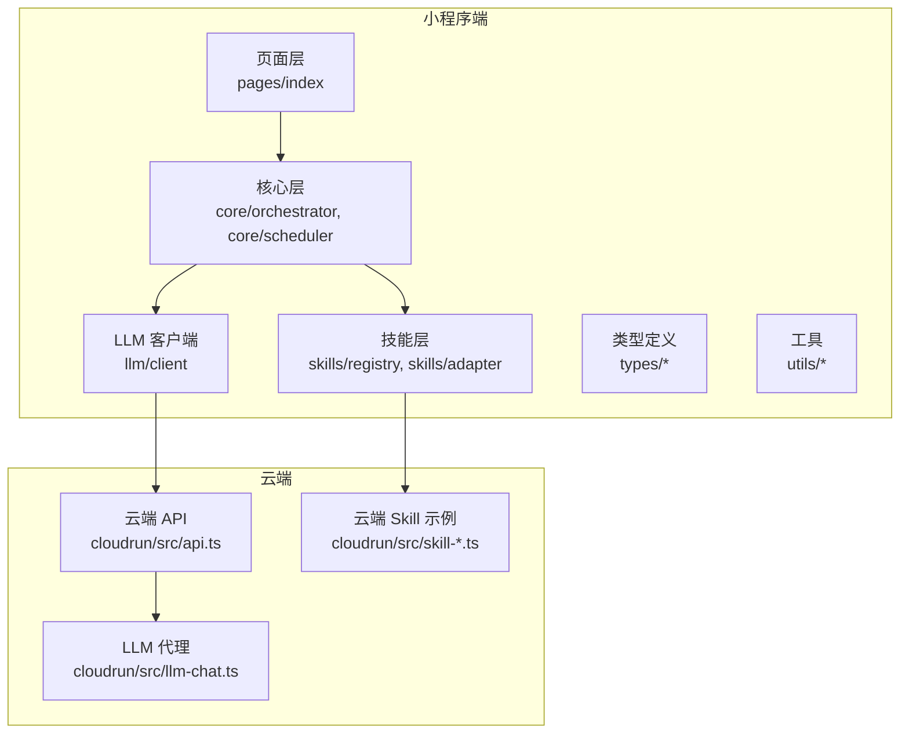
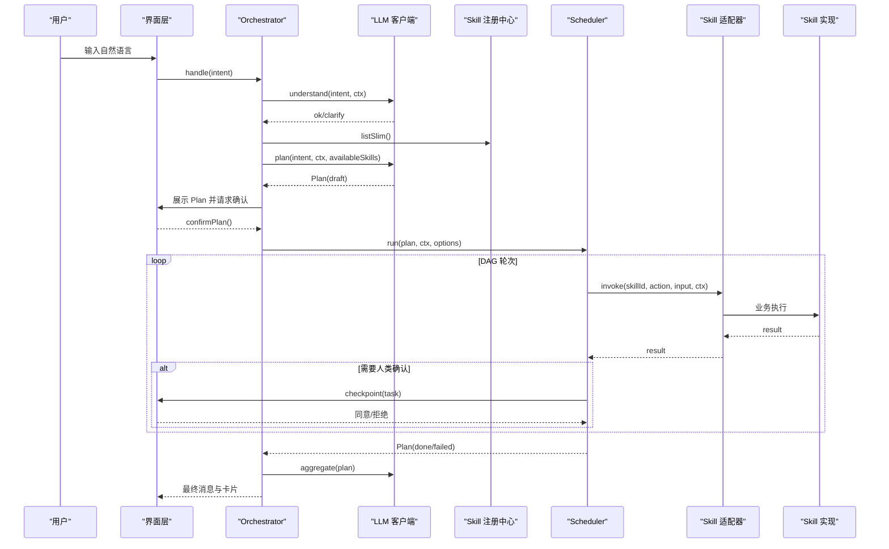
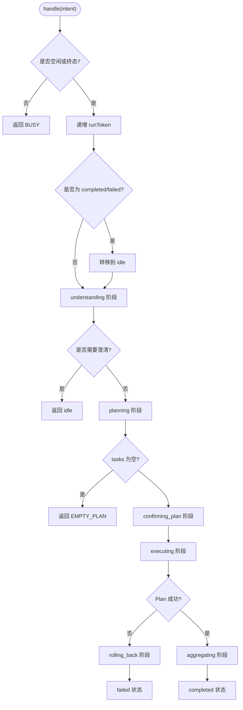
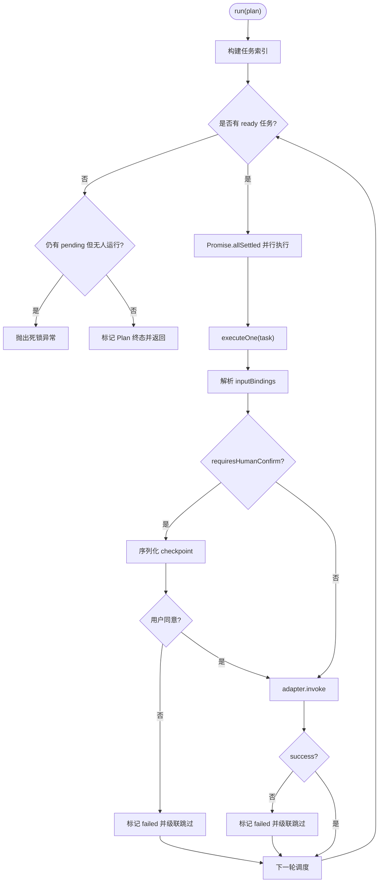
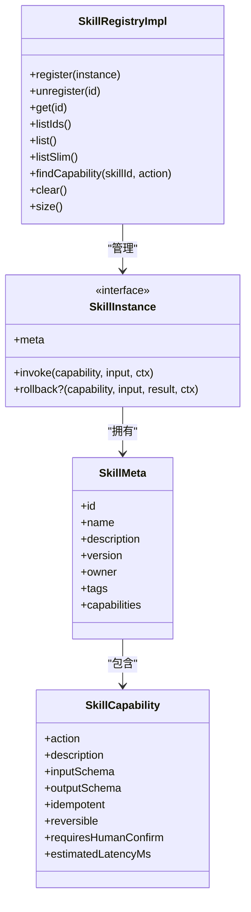
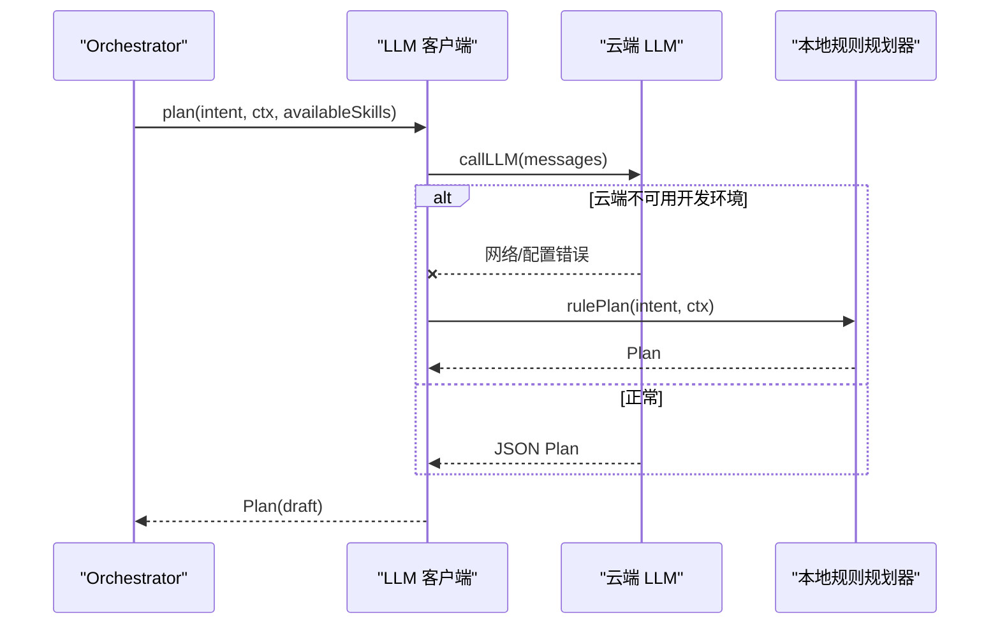
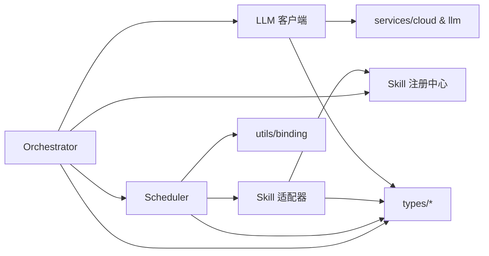

# 架构设计

<cite>
**本文引用的文件**   
- [orchestrator.ts](file://miniprogram/src/core/orchestrator.ts)
- [scheduler.ts](file://miniprogram/src/core/scheduler.ts)
- [registry.ts](file://miniprogram/src/skills/registry.ts)
- [adapter.ts](file://miniprogram/src/skills/adapter.ts)
- [client.ts](file://miniprogram/src/llm/client.ts)
- [context.ts](file://miniprogram/src/core/context.ts)
- [binding.ts](file://miniprogram/src/utils/binding.ts)
- [agent-state.d.ts](file://miniprogram/src/types/agent-state.d.ts)
- [plan.d.ts](file://miniprogram/src/types/plan.d.ts)
- [task.d.ts](file://miniprogram/src/types/task.d.ts)
- [skill.d.ts](file://miniprogram/src/types/skill.d.ts)
- [checkpoint.d.ts](file://miniprogram/src/types/checkpoint.d.ts)
</cite>

## 目录
1. [引言](#引言)
2. [项目结构](#项目结构)
3. [核心组件](#核心组件)
4. [架构总览](#架构总览)
5. [详细组件分析](#详细组件分析)
6. [依赖关系分析](#依赖关系分析)
7. [性能与可靠性考量](#性能与可靠性考量)
8. [故障排查指南](#故障排查指南)
9. [结论](#结论)

## 引言
本文件面向 WAIC-WeChat-MiniProgram 的核心架构，聚焦以下目标：
- 说明 Agent 架构模式、状态机设计与 DAG 任务调度引擎。
- 解释 Orchestrator（编排器）、Scheduler（调度器）、Skill 注册中心的作用与职责。
- 描述从用户输入到 LLM 意图理解、任务规划与执行的完整数据流。
- 阐述技术决策与权衡，如状态机模式、DAG 调度的优势。
- 定义系统边界、扩展点与插件化实现原理。
- 提供架构图与组件分解图，帮助开发者快速把握整体设计。

## 项目结构
仓库采用小程序 + 云函数双端协作的结构：
- miniprogram 侧承载 Agent 核心逻辑：Orchestrator、Scheduler、Skill 注册与适配、LLM 客户端、类型与工具。
- cloudrun 侧承载云端能力（API、LLM 代理、示例 Skill）。

图表来源
- [orchestrator.ts:106-256](file://miniprogram/src/core/orchestrator.ts#L106-L256)
- [scheduler.ts:77-128](file://miniprogram/src/core/scheduler.ts#L77-L128)
- [client.ts:56-120](file://miniprogram/src/llm/client.ts#L56-L120)
- [registry.ts:16-71](file://miniprogram/src/skills/registry.ts#L16-L71)

章节来源
- [orchestrator.ts:1-340](file://miniprogram/src/core/orchestrator.ts#L1-L340)
- [scheduler.ts:1-245](file://miniprogram/src/core/scheduler.ts#L1-L245)
- [client.ts:1-153](file://miniprogram/src/llm/client.ts#L1-L153)
- [registry.ts:1-91](file://miniprogram/src/skills/registry.ts#L1-L91)

## 核心组件
- Orchestrator（编排器）：基于状态机的 Agent 生命周期管理，串联理解、规划、确认、执行、聚合与回滚。
- Scheduler（调度器）：DAG 任务调度引擎，负责依赖解析、并行执行、人类确认、失败级联与死锁检测。
- Skill 注册中心：集中管理 Skill 实例、元信息与能力清单，提供 Slim 视图给 Planner 降低 token 消耗。
- Skill 适配器：统一调用入口，负责 Schema 校验、错误包装、埋点与回滚桥接。
- LLM 客户端：封装 Plan 生成、意图理解与结果聚合，支持开发环境降级到本地规则规划器。
- Context（上下文）：构造会话、用户画像、位置、全局环境与追踪信息。
- 类型体系：AgentState、Plan、Task、Skill、Checkpoint 等契约定义，确保跨层一致性。

章节来源
- [orchestrator.ts:28-48](file://miniprogram/src/core/orchestrator.ts#L28-L48)
- [scheduler.ts:27-44](file://miniprogram/src/core/scheduler.ts#L27-L44)
- [registry.ts:16-71](file://miniprogram/src/skills/registry.ts#L16-L71)
- [adapter.ts:36-85](file://miniprogram/src/skills/adapter.ts#L36-L85)
- [client.ts:56-120](file://miniprogram/src/llm/client.ts#L56-L120)
- [context.ts:60-92](file://miniprogram/src/core/context.ts#L60-L92)
- [agent-state.d.ts:7-17](file://miniprogram/src/types/agent-state.d.ts#L7-L17)
- [plan.d.ts:19-33](file://miniprogram/src/types/plan.d.ts#L19-L33)
- [task.d.ts:29-59](file://miniprogram/src/types/task.d.ts#L29-L59)
- [skill.d.ts:16-58](file://miniprogram/src/types/skill.d.ts#L16-L58)
- [checkpoint.d.ts:17-43](file://miniprogram/src/types/checkpoint.d.ts#L17-L43)

## 架构总览
系统以 Orchestrator 为中枢，驱动状态机流转；通过 LLM 客户端进行意图理解与计划生成；由 Scheduler 按 DAG 调度执行；Skill 注册中心与适配器屏蔽具体实现差异；Context 贯穿全链路提供会话与追踪。

图表来源
- [orchestrator.ts:106-256](file://miniprogram/src/core/orchestrator.ts#L106-L256)
- [scheduler.ts:77-128](file://miniprogram/src/core/scheduler.ts#L77-L128)
- [client.ts:56-120](file://miniprogram/src/llm/client.ts#L56-L120)
- [registry.ts:50-60](file://miniprogram/src/skills/registry.ts#L50-L60)
- [adapter.ts:36-85](file://miniprogram/src/skills/adapter.ts#L36-L85)

## 详细组件分析

### Orchestrator（编排器）
- 职责
  - 维护 Agent 状态机，保证合法转移。
  - 协调理解、规划、确认、执行、聚合与回滚流程。
  - 注入交互回调（confirmPlan、checkpoint），避免反向依赖。
  - 使用 runToken 防止 reset 后并发双跑或交错弹窗。
- 关键行为
  - handle(intent)：进入 understanding → planning → confirming_plan → executing → aggregating → completed/failed。
  - rollbackIfNeeded：对可逆且已成功的任务反序撤销。
  - handleTaskUpdate：将 waiting_human 映射为 awaiting_human，保持 UI 同步。
  - transition：带合法性检查的状态转移，非法仅告警不中断（MVP 宽松模式）。

图表来源
- [orchestrator.ts:106-256](file://miniprogram/src/core/orchestrator.ts#L106-L256)
- [orchestrator.ts:278-303](file://miniprogram/src/core/orchestrator.ts#L278-L303)
- [orchestrator.ts:319-328](file://miniprogram/src/core/orchestrator.ts#L319-L328)

章节来源
- [orchestrator.ts:28-48](file://miniprogram/src/core/orchestrator.ts#L28-L48)
- [orchestrator.ts:60-71](file://miniprogram/src/core/orchestrator.ts#L60-L71)
- [orchestrator.ts:106-256](file://miniprogram/src/core/orchestrator.ts#L106-L256)
- [orchestrator.ts:258-270](file://miniprogram/src/core/orchestrator.ts#L258-L270)
- [orchestrator.ts:278-328](file://miniprogram/src/core/orchestrator.ts#L278-L328)

### Scheduler（DAG 调度器）
- 职责
  - 每轮找出依赖满足且 pending 的任务，并行执行。
  - 处理人类确认（checkpoint），序列化弹窗避免覆盖。
  - 失败级联跳过下游任务，检测死锁。
  - 通过 isRunActive 感知 Orchestrator reset，中止旧流程。
- 关键行为
  - run(plan, ctx, options)：主循环迭代，直到全部完成或死锁。
  - executeOne：绑定解析、checkpoint、invoke、结果落盘与级联跳过。
  - cascadeSkip：递归标记所有依赖下游为 skipped。

图表来源
- [scheduler.ts:77-128](file://miniprogram/src/core/scheduler.ts#L77-L128)
- [scheduler.ts:139-204](file://miniprogram/src/core/scheduler.ts#L139-L204)
- [scheduler.ts:229-240](file://miniprogram/src/core/scheduler.ts#L229-L240)

章节来源
- [scheduler.ts:27-44](file://miniprogram/src/core/scheduler.ts#L27-L44)
- [scheduler.ts:77-128](file://miniprogram/src/core/scheduler.ts#L77-L128)
- [scheduler.ts:139-204](file://miniprogram/src/core/scheduler.ts#L139-L204)
- [scheduler.ts:206-245](file://miniprogram/src/core/scheduler.ts#L206-L245)

### Skill 注册中心与适配器
- 注册中心
  - 提供 register/unregister/get/list/listSlim/findCapability/clear/size。
  - listSlim 去除 LLM 不需要的字段，降低 token 消耗。
- 适配器
  - 统一 invoke：查找实例与 capability、Schema 校验、埋点、错误包装。
  - rollback：若 Skill 未实现则记录警告，否则调用 Skill.rollback。
  - getCapability：供 Scheduler 查询 requiresHumanConfirm 等属性。

图表来源
- [registry.ts:16-71](file://miniprogram/src/skills/registry.ts#L16-L71)
- [skill.d.ts:16-58](file://miniprogram/src/types/skill.d.ts#L16-L58)
- [skill.d.ts:85-104](file://miniprogram/src/types/skill.d.ts#L85-L104)

章节来源
- [registry.ts:16-71](file://miniprogram/src/skills/registry.ts#L16-L71)
- [adapter.ts:36-85](file://miniprogram/src/skills/adapter.ts#L36-L85)
- [adapter.ts:87-112](file://miniprogram/src/skills/adapter.ts#L87-L112)
- [skill.d.ts:16-58](file://miniprogram/src/types/skill.d.ts#L16-L58)
- [skill.d.ts:85-104](file://miniprogram/src/types/skill.d.ts#L85-L104)

### LLM 客户端与规划流程
- plan(intent, ctx, availableSkills)
  - 构造 Prompt（含 availableSkills 简表）。
  - 调用云端 LLM；在开发环境不可用时降级到本地规则规划器。
  - 解析输出为 Plan，补充 traceId 与 intent。
- understand(intent, ctx)
  - MVP 直接返回 ok，后续可扩展 NLU。
- aggregate(plan, aiTag)
  - 将 Task 结果汇总为人类可读消息。

图表来源
- [client.ts:56-120](file://miniprogram/src/llm/client.ts#L56-L120)

章节来源
- [client.ts:56-120](file://miniprogram/src/llm/client.ts#L56-L120)
- [client.ts:122-153](file://miniprogram/src/llm/client.ts#L122-L153)

### 上下文与数据绑定
- Context
  - buildContext：生成 sessionId、userId、userProfile、globals、trace。
  - pushMessage：追加消息历史，限制长度防内存膨胀。
- Binding
  - applyBindings：根据 inputBindings 将上游 Task 的 bindings/data 注入下游 input。
  - indexTasks：构建任务 ID 到 Task 的索引。

章节来源
- [context.ts:60-104](file://miniprogram/src/core/context.ts#L60-L104)
- [binding.ts:18-50](file://miniprogram/src/utils/binding.ts#L18-L50)

## 依赖关系分析
- 依赖方向遵循“interaction → core → skills → llm”单向不可逆原则：
  - Orchestrator 依赖 LLM 客户端与 Scheduler，但不反向依赖 interaction。
  - LLM 客户端依赖 services/cloud 与 utils/idgen/logger，不依赖 skills。
  - Scheduler 依赖 adapter 与 utils/binding，不依赖 interaction。
  - adapter 依赖 registry 与 types，不依赖 wx.*。
- 耦合与内聚
  - Orchestrator 高内聚于状态机与流程编排。
  - Scheduler 高内聚于 DAG 调度与人类确认。
  - registry 与 adapter 共同构成插件化基础设施。
  - types 作为契约层，解耦各模块实现。

图表来源
- [orchestrator.ts:13-26](file://miniprogram/src/core/orchestrator.ts#L13-L26)
- [scheduler.ts:18-25](file://miniprogram/src/core/scheduler.ts#L18-L25)
- [adapter.ts:13-17](file://miniprogram/src/skills/adapter.ts#L13-L17)
- [client.ts:9-18](file://miniprogram/src/llm/client.ts#L9-L18)

章节来源
- [orchestrator.ts:13-26](file://miniprogram/src/core/orchestrator.ts#L13-L26)
- [scheduler.ts:18-25](file://miniprogram/src/core/scheduler.ts#L18-L25)
- [adapter.ts:13-17](file://miniprogram/src/skills/adapter.ts#L13-L17)
- [client.ts:9-18](file://miniprogram/src/llm/client.ts#L9-L18)

## 性能与可靠性考量
- 状态机模式的优势
  - 明确的生命周期与转移约束，避免中间状态残留导致的 BUSY 死锁。
  - 通过 ALLOWED_TRANSITIONS 与 transition 守卫，提升可观测性与健壮性。
- DAG 调度的优势
  - 依赖驱动的并行执行，最大化吞吐。
  - 失败级联跳过与死锁检测，保障系统稳定性。
  - 人类确认序列化，避免弹窗覆盖导致确认丢失。
- 令牌机制（runToken）
  - 防止 Orchestrator reset 后旧流程继续弹窗或重复下单。
  - Scheduler 通过 isRunActive 感知失效并中止。
- LLM 降级策略
  - 开发环境云端不可用时降级到本地规则规划器，保证演示链路可用。
  - release 环境保持失败语义，避免掩盖真实 LLM 故障。
- 资源与成本优化
  - SkillMetaSlim 减少 LLM 提示词体积，降低 token 消耗。
  - Context 中 messages 限制最近 20 条，控制内存占用。

[本节为通用指导，不直接分析具体文件]

## 故障排查指南
- BUSY 状态
  - 现象：非 idle/completed/failed 状态下再次调用 handle 返回 BUSY。
  - 排查：检查当前状态与 onStateChange 回调，确认是否存在未完成流程。
- EMPTY_PLAN
  - 现象：LLM 返回 tasks 为空。
  - 排查：检查 availableSkills 描述是否清晰，Prompt 是否包含必要上下文。
- DEADLOCK
  - 现象：无 ready 任务且仍有 pending 任务。
  - 排查：检查 dependsOn 与 inputBindings 是否正确，是否存在环依赖。
- RUN_RESET
  - 现象：执行期间被 reset，返回 RUN_RESET。
  - 排查：确认 Orchestrator.reset 调用时机，避免并发双跑。
- LLM_ERROR / 解析失败
  - 现象：LLM 调用失败或输出无法解析。
  - 排查：检查云端配置与网络状况，查看 traceId 与日志。
- SKILL_NOT_FOUND / CAPABILITY_NOT_FOUND
  - 现象：Skill 未注册或 action 不存在。
  - 排查：检查 Skill 注册与 meta.capabilities 声明。
- INVALID_INPUT
  - 现象：入参不符合 Schema。
  - 排查：核对 inputSchema 与传入参数结构。

章节来源
- [orchestrator.ts:106-114](file://miniprogram/src/core/orchestrator.ts#L106-L114)
- [orchestrator.ts:138-146](file://miniprogram/src/core/orchestrator.ts#L138-L146)
- [orchestrator.ts:234-254](file://miniprogram/src/core/orchestrator.ts#L234-L254)
- [scheduler.ts:102-114](file://miniprogram/src/core/scheduler.ts#L102-L114)
- [scheduler.ts:180-186](file://miniprogram/src/core/scheduler.ts#L180-L186)
- [adapter.ts:44-68](file://miniprogram/src/skills/adapter.ts#L44-L68)

## 结论
WAIC-WeChat-MiniProgram 的核心架构以 Orchestrator 状态机为中枢，结合 DAG 调度器与 Skill 插件化体系，实现了从自然语言到任务执行的端到端闭环。状态机确保流程可控与可观测，DAG 调度提升吞吐与鲁棒性，Skill 注册与适配器提供扩展点与统一治理。LLM 客户端在云端不可用时提供降级路径，保障开发与演示体验。整体设计遵循清晰的依赖方向与契约类型，便于团队协同与长期演进。

[本节为总结性内容，不直接分析具体文件]