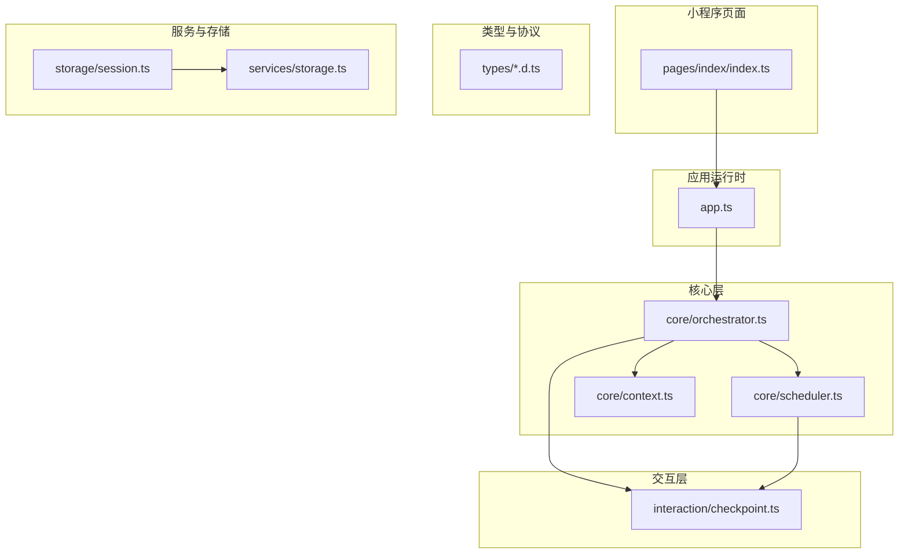
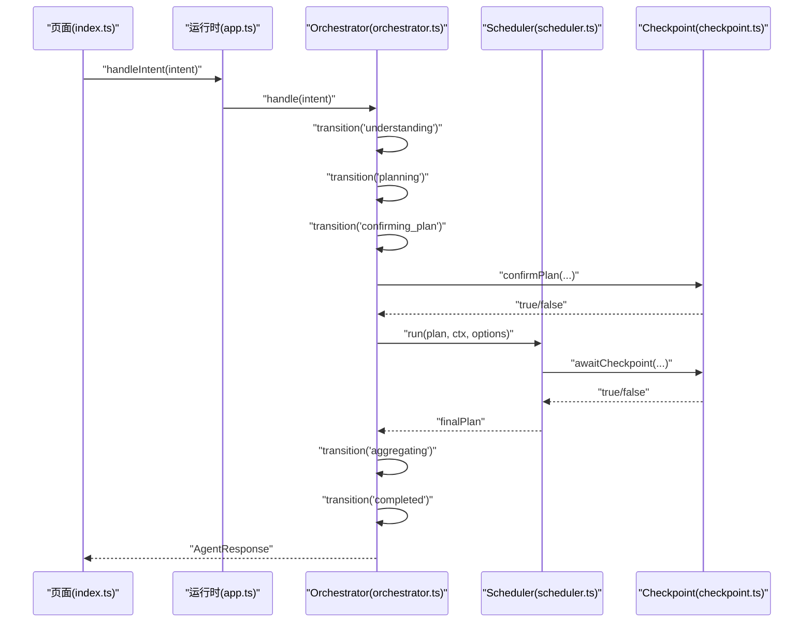
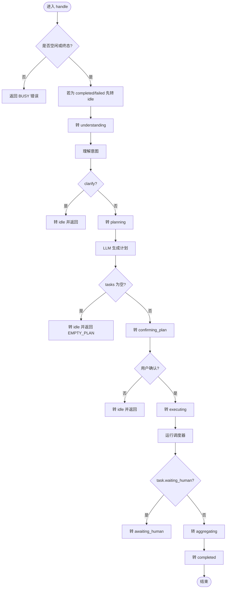
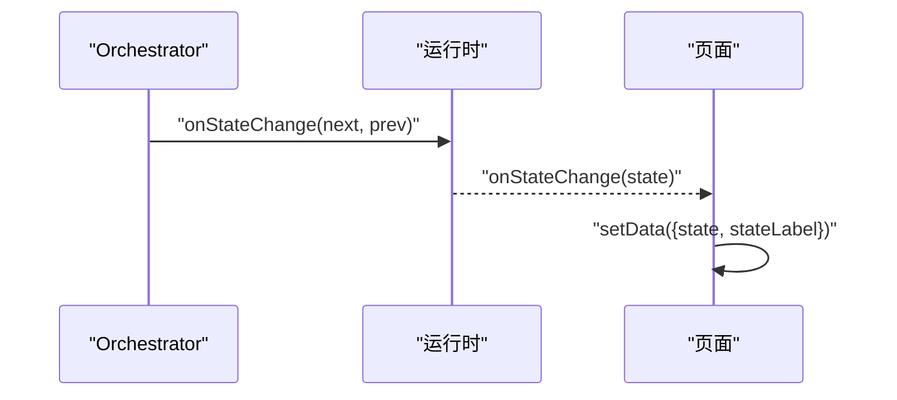
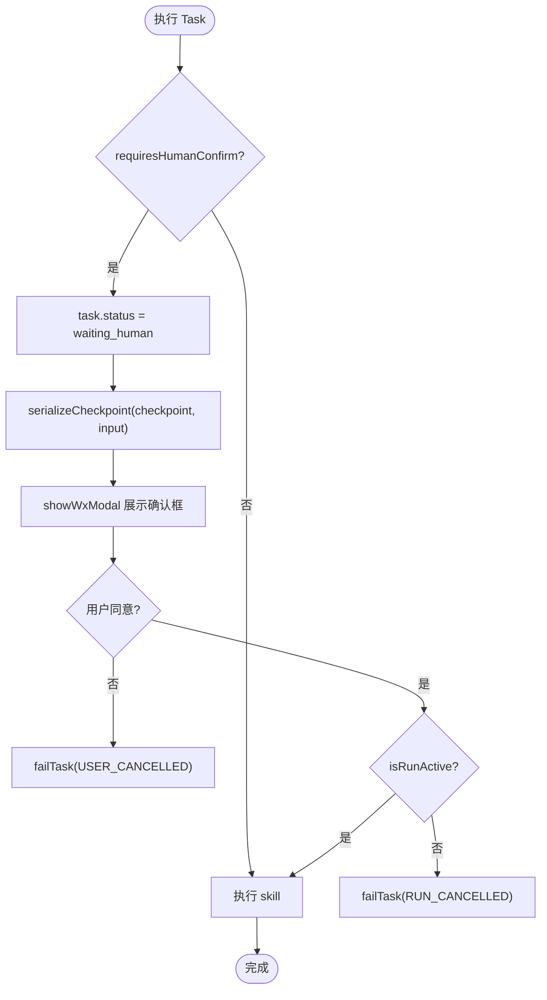
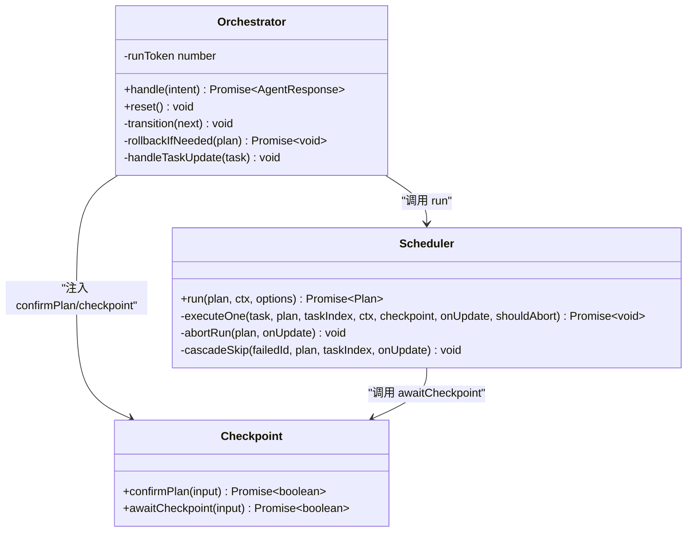
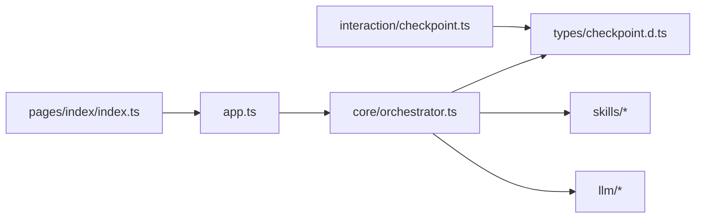

# 状态管理机制

<cite>
**本文引用的文件**   
- [orchestrator.ts](file://miniprogram/src/core/orchestrator.ts)
- [agent-state.d.ts](file://miniprogram/src/types/agent-state.d.ts)
- [checkpoint.ts](file://miniprogram/src/interaction/checkpoint.ts)
- [scheduler.ts](file://miniprogram/src/core/scheduler.ts)
- [context.ts](file://miniprogram/src/core/context.ts)
- [storage.ts](file://miniprogram/src/services/storage.ts)
- [session.ts](file://miniprogram/src/storage/session.ts)
- [index.ts（首页）](file://miniprogram/pages/index/index.ts)
- [app.ts](file://miniprogram/app.ts)
</cite>

## 目录
1. [引言](#引言)
2. [项目结构](#项目结构)
3. [核心组件](#核心组件)
4. [架构总览](#架构总览)
5. [详细组件分析](#详细组件分析)
6. [依赖关系分析](#依赖关系分析)
7. [性能与并发特性](#性能与并发特性)
8. [扩展指南：新增状态与转换规则](#扩展指南新增状态与转换规则)
9. [自定义状态监听器与 UI 同步策略](#自定义状态监听器与-ui-同步策略)
10. [Checkpoint 确认机制与人类确认点设计](#checkpoint-确认机制与人类确认点设计)
11. [状态持久化与恢复策略](#状态持久化与恢复策略)
12. [一致性保证、并发控制与恢复](#一致性保证并发控制与恢复)
13. [调试工具与故障排查](#调试工具与故障排查)
14. [结论](#结论)

## 引言
本文件面向 WAIC-WeChat-MiniProgram 的状态管理机制，围绕有限状态机（FSM）的设计模式与实现细节展开。重点包括：
- 状态定义与 ALLOWED_TRANSITIONS 配置表的设计原理
- 状态转换合法性校验与事件驱动机制
- onStateChange 回调与 UI 同步策略
- Checkpoint 人类确认点设计与交互流程
- 状态持久化策略与恢复方案
- 并发访问控制与一致性保障
- 扩展新状态与转换规则的实践方法
- 调试与故障排查建议

## 项目结构
状态管理相关代码主要分布在以下模块：
- 核心编排与状态机：core/orchestrator.ts、core/scheduler.ts
- 类型定义：types/agent-state.d.ts、types/checkpoint.d.ts
- 交互层：interaction/checkpoint.ts
- 上下文与存储：core/context.ts、services/storage.ts、storage/session.ts
- 页面与运行时入口：pages/index/index.ts、app.ts

**图示来源**
- [orchestrator.ts:1-48](file://miniprogram/src/core/orchestrator.ts#L1-L48)
- [scheduler.ts:1-44](file://miniprogram/src/core/scheduler.ts#L1-L44)
- [checkpoint.ts:1-19](file://miniprogram/src/interaction/checkpoint.ts#L1-L19)
- [context.ts:1-31](file://miniprogram/src/core/context.ts#L1-L31)
- [storage.ts:1-8](file://miniprogram/src/services/storage.ts#L1-L8)
- [session.ts:1-8](file://miniprogram/src/storage/session.ts#L1-L8)
- [index.ts:1-16](file://miniprogram/pages/index/index.ts#L1-L16)
- [app.ts:28-48](file://miniprogram/app.ts#L28-L48)

**章节来源**
- [orchestrator.ts:1-48](file://miniprogram/src/core/orchestrator.ts#L1-L48)
- [scheduler.ts:1-44](file://miniprogram/src/core/scheduler.ts#L1-L44)
- [checkpoint.ts:1-19](file://miniprogram/src/interaction/checkpoint.ts#L1-L19)
- [context.ts:1-31](file://miniprogram/src/core/context.ts#L1-L31)
- [storage.ts:1-8](file://miniprogram/src/services/storage.ts#L1-L8)
- [session.ts:1-8](file://miniprogram/src/storage/session.ts#L1-L8)
- [index.ts:1-16](file://miniprogram/pages/index/index.ts#L1-L16)
- [app.ts:28-48](file://miniprogram/app.ts#L28-L48)

## 核心组件
- Orchestrator（编排器/状态机）：维护 AgentState，负责意图理解、计划生成、任务调度、结果聚合与回滚；提供 handle、reset、transition 等接口，并通过 onStateChange 通知 UI。
- Scheduler（DAG 调度器）：按依赖关系并行执行 Task，支持 checkpoint 人类确认、死锁检测、级联跳过与中止。
- Checkpoint（人类确认对话框）：封装 wx.showModal，提供 confirmPlan 与 awaitCheckpoint 两个确认钩子。
- Context（上下文构造器）：构建会话上下文，注入 sessionId、userId、用户画像、全局环境与追踪信息。
- Storage（微信存储封装）：统一 get/set/remove/clearAll，安全序列化 JSON，集中错误处理。
- Session（会话历史）：保存脱敏的意图摘要与消息快照，不跨会话持久化 AgentContext。
- 页面与运行时：页面订阅 runtime 事件（onStateChange/onPlanUpdate/onTaskUpdate），运行时在 app.ts 中懒加载并暴露给页面。

**章节来源**
- [orchestrator.ts:28-48](file://miniprogram/src/core/orchestrator.ts#L28-L48)
- [orchestrator.ts:73-99](file://miniprogram/src/core/orchestrator.ts#L73-L99)
- [scheduler.ts:27-44](file://miniprogram/src/core/scheduler.ts#L27-L44)
- [checkpoint.ts:21-64](file://miniprogram/src/interaction/checkpoint.ts#L21-L64)
- [context.ts:60-91](file://miniprogram/src/core/context.ts#L60-L91)
- [storage.ts:12-34](file://miniprogram/src/services/storage.ts#L12-L34)
- [session.ts:16-33](file://miniprogram/src/storage/session.ts#L16-L33)
- [index.ts:129-151](file://miniprogram/pages/index/index.ts#L129-L151)
- [app.ts:38-48](file://miniprogram/app.ts#L38-L48)

## 架构总览
状态机驱动的端到端流程如下：
- 页面触发 handleIntent → Orchestrator.handle
- Orchestrator 依次经历 understanding → planning → confirming_plan → executing → aggregating → completed/failed
- 在执行阶段，Scheduler 根据依赖关系并行执行 Task，遇到写操作时通过 Checkpoint 请求人类确认
- Orchestrator 将任务状态映射到 awaiting_human/executing，以驱动 UI 显示“等待人类确认”
- 失败路径触发回滚（rolling_back），最终进入 failed 或 completed

**图示来源**
- [orchestrator.ts:106-221](file://miniprogram/src/core/orchestrator.ts#L106-L221)
- [scheduler.ts:77-128](file://miniprogram/src/core/scheduler.ts#L77-L128)
- [checkpoint.ts:48-64](file://miniprogram/src/interaction/checkpoint.ts#L48-L64)
- [checkpoint.ts:109-122](file://miniprogram/src/interaction/checkpoint.ts#L109-L122)
- [index.ts:214-270](file://miniprogram/pages/index/index.ts#L214-L270)
- [app.ts:38-48](file://miniprogram/app.ts#L38-L48)

## 详细组件分析

### 有限状态机（FSM）与 ALLOWED_TRANSITIONS
- 状态定义：AgentState 包含 idle、understanding、planning、confirming_plan、executing、awaiting_human、aggregating、completed、failed、rolling_back。
- 允许转移表：ALLOWED_TRANSITIONS 明确每个当前状态可合法转移到的目标状态集合。例如：
  - idle → understanding
  - understanding → planning / failed / idle（clarify 提前返回需归位 idle）
  - planning → confirming_plan / failed / idle（EMPTY_PLAN 提前返回需归位 idle）
  - confirming_plan → executing / idle / failed
  - executing → awaiting_human / aggregating / rolling_back / failed
  - awaiting_human → executing / rolling_back / failed
  - aggregating → completed / failed
  - rolling_back → failed / completed
  - completed → idle
  - failed → idle
- 转移验证：transition(next) 会检查 ALLOWED_TRANSITIONS，非法转移仅告警放行（MVP 宽鬆模式），同时调用 onStateChange 通知 UI。
- 重置通道：reset() 强制将状态设为 idle，绕过转移守卫，用于中断在途流程并防止并发双跑。

**图示来源**
- [orchestrator.ts:60-71](file://miniprogram/src/core/orchestrator.ts#L60-L71)
- [orchestrator.ts:106-221](file://miniprogram/src/core/orchestrator.ts#L106-L221)
- [orchestrator.ts:319-328](file://miniprogram/src/core/orchestrator.ts#L319-L328)

**章节来源**
- [agent-state.d.ts:7-17](file://miniprogram/src/types/agent-state.d.ts#L7-L17)
- [orchestrator.ts:60-71](file://miniprogram/src/core/orchestrator.ts#L60-L71)
- [orchestrator.ts:319-328](file://miniprogram/src/core/orchestrator.ts#L319-L328)

### 状态变更的事件驱动机制与 UI 同步
- OrchestratorOptions.onStateChange：每次 transition 后调用，传入 next 与 prev 状态，供 UI 更新状态栏与 loading 文案。
- 页面订阅：页面在 onLoad 中通过 agent.subscribe({ onStateChange, onPlanUpdate, onTaskUpdate }) 订阅运行时事件，并在 onAgentStateChange 中更新 state 与 stateLabel。
- 状态标签映射：STATE_LABELS 将 AgentState 映射为中文文案，如“理解意图中”、“等待您确认计划”、“等待您确认操作”等。

**图示来源**
- [orchestrator.ts:46-48](file://miniprogram/src/core/orchestrator.ts#L46-L48)
- [orchestrator.ts:319-328](file://miniprogram/src/core/orchestrator.ts#L319-L328)
- [index.ts:141-151](file://miniprogram/pages/index/index.ts#L141-L151)
- [index.ts:272-275](file://miniprogram/pages/index/index.ts#L272-L275)
- [index.ts:86-98](file://miniprogram/pages/index/index.ts#L86-L98)

**章节来源**
- [orchestrator.ts:46-48](file://miniprogram/src/core/orchestrator.ts#L46-L48)
- [orchestrator.ts:319-328](file://miniprogram/src/core/orchestrator.ts#L319-L328)
- [index.ts:141-151](file://miniprogram/pages/index/index.ts#L141-L151)
- [index.ts:272-275](file://miniprogram/pages/index/index.ts#L272-L275)
- [index.ts:86-98](file://miniprogram/pages/index/index.ts#L86-L98)

### Checkpoint 确认机制与人类确认点设计
- 两层确认：
  - Plan 整体确认：confirmPlan 展示意图与任务清单，用户确认后继续执行。
  - 单步写操作确认：awaitCheckpoint 对 requiresHumanConfirm 的任务进行逐项确认，展示任务摘要、能力类型与入参明细（金额感知）。
- 交互降级：若无 wx.showModal，则默认拒绝（测试环境可 autoApproveCheckpoint）。
- 序列化互斥：Scheduler 使用 checkpointChain 串行化所有 checkpoint 调用，避免多个弹窗互相覆盖导致确认结果丢失。

**图示来源**
- [scheduler.ts:139-204](file://miniprogram/src/core/scheduler.ts#L139-L204)
- [checkpoint.ts:48-64](file://miniprogram/src/interaction/checkpoint.ts#L48-L64)
- [checkpoint.ts:109-122](file://miniprogram/src/interaction/checkpoint.ts#L109-L122)
- [scheduler.ts:54-74](file://miniprogram/src/core/scheduler.ts#L54-L74)

**章节来源**
- [checkpoint.ts:21-64](file://miniprogram/src/interaction/checkpoint.ts#L21-L64)
- [checkpoint.ts:109-122](file://miniprogram/src/interaction/checkpoint.ts#L109-L122)
- [scheduler.ts:54-74](file://miniprogram/src/core/scheduler.ts#L54-L74)
- [scheduler.ts:139-204](file://miniprogram/src/core/scheduler.ts#L139-L204)

### 状态一致性保证、并发控制与恢复
- 执行令牌（runToken）：
  - Orchestrator.handle 每轮递增 runToken，reset() 也会递增，使在途 Scheduler 与 checkpoint 流程失效。
  - Scheduler 通过 isRunActive 探测令牌有效性，一旦失效立即中止并标记非终态任务为 skipped。
- 非法转移保护：
  - handle 开头守卫：若非 idle/completed/failed，直接返回 BUSY，防止多轮并发。
  - reset 强制归位：从非终态强制转 idle，绕过转移守卫，确保系统回到稳定态。
- 异常与回滚：
  - PlannerLLMError 与 SchedulerDeadlockError 分别触发 LLM_ERROR 与 DEADLOCK 错误码，并进入 failed。
  - rollbackIfNeeded 按反序撤销已成功且可逆的任务，单个回滚失败仅记录错误并继续其余。
- 任务级联跳过：
  - 任一任务失败会 cascadeSkip 下游 pending 任务为 skipped，避免脏状态扩散。

**图示来源**
- [orchestrator.ts:106-270](file://miniprogram/src/core/orchestrator.ts#L106-L270)
- [orchestrator.ts:272-317](file://miniprogram/src/core/orchestrator.ts#L272-L317)
- [scheduler.ts:77-128](file://miniprogram/src/core/scheduler.ts#L77-L128)
- [scheduler.ts:139-240](file://miniprogram/src/core/scheduler.ts#L139-L240)
- [checkpoint.ts:48-64](file://miniprogram/src/interaction/checkpoint.ts#L48-L64)
- [checkpoint.ts:109-122](file://miniprogram/src/interaction/checkpoint.ts#L109-L122)

**章节来源**
- [orchestrator.ts:106-270](file://miniprogram/src/core/orchestrator.ts#L106-L270)
- [orchestrator.ts:272-317](file://miniprogram/src/core/orchestrator.ts#L272-L317)
- [scheduler.ts:77-128](file://miniprogram/src/core/scheduler.ts#L77-L128)
- [scheduler.ts:139-240](file://miniprogram/src/core/scheduler.ts#L139-L240)

## 依赖关系分析
- 单向依赖：interaction → core → skills → llm，core 不得反向依赖 interaction。
- 类型下沉：checkpoint 协议类型置于 types/checkpoint.d.ts，供 core 与 interaction 共同引用。
- 运行时注入：app.ts 懒加载 AgentRuntime，页面通过 getApp().globalData.agent 获取并订阅事件。

**图示来源**
- [checkpoint.ts:1-19](file://miniprogram/src/interaction/checkpoint.ts#L1-L19)
- [orchestrator.ts:13-26](file://miniprogram/src/core/orchestrator.ts#L13-L26)
- [app.ts:38-48](file://miniprogram/app.ts#L38-L48)
- [index.ts:18-23](file://miniprogram/pages/index/index.ts#L18-L23)

**章节来源**
- [checkpoint.ts:1-19](file://miniprogram/src/interaction/checkpoint.ts#L1-L19)
- [orchestrator.ts:13-26](file://miniprogram/src/core/orchestrator.ts#L13-L26)
- [app.ts:38-48](file://miniprogram/app.ts#L38-L48)
- [index.ts:18-23](file://miniprogram/pages/index/index.ts#L18-L23)

## 性能与并发特性
- 并行执行：Scheduler 使用 Promise.allSettled 并行执行 ready 任务，提升吞吐。
- 死锁检测：当无 ready 任务且仍有 pending 任务且无 running/waiting_human 任务时抛出 SchedulerDeadlockError。
- 迭代上限：guard > 1000 抛出错误，防止逻辑错误导致的无限循环。
- 令牌失效快速中止：isRunActive 在每轮循环检查，一旦失效立即 abortRun 并标记任务为 skipped。
- 序列化 checkpoint：checkpointChain 串行化所有人类确认调用，避免弹窗覆盖与确认结果丢失。

**章节来源**
- [scheduler.ts:116-128](file://miniprogram/src/core/scheduler.ts#L116-L128)
- [scheduler.ts:102-114](file://miniprogram/src/core/scheduler.ts#L102-L114)
- [scheduler.ts:85-97](file://miniprogram/src/core/scheduler.ts#L85-L97)
- [scheduler.ts:54-74](file://miniprogram/src/core/scheduler.ts#L54-L74)

## 扩展指南：新增状态与转换规则
步骤概述：
1. 在 AgentState 中添加新状态字面量。
2. 在 ALLOWED_TRANSITIONS 中声明该状态的允许转移目标。
3. 在 Orchestrator.handle 或相关流程中插入 transition(newState) 调用。
4. 在页面 STATE_LABELS 中增加中文文案映射。
5. 如需人类确认点，在对应任务 capability 上设置 requiresHumanConfirm，并确保 checkpoint 展示逻辑适配新场景。

示例路径参考：
- 状态定义位置：[agent-state.d.ts:7-17](file://miniprogram/src/types/agent-state.d.ts#L7-L17)
- 允许转移表位置：[orchestrator.ts:60-71](file://miniprogram/src/core/orchestrator.ts#L60-L71)
- 状态转移调用位置：[orchestrator.ts:120-221](file://miniprogram/src/core/orchestrator.ts#L120-L221)
- 页面状态标签映射：[index.ts:86-98](file://miniprogram/pages/index/index.ts#L86-L98)

注意事项：
- 若新状态涉及提前返回（如 clarify 或 EMPTY_PLAN），必须显式 transition('idle') 以避免 BUSY 永久死锁。
- 若新状态需要人类确认，需在 checkpoint 中展示足够的业务信息（如金额明细），遵循红线条款。

**章节来源**
- [agent-state.d.ts:7-17](file://miniprogram/src/types/agent-state.d.ts#L7-L17)
- [orchestrator.ts:60-71](file://miniprogram/src/core/orchestrator.ts#L60-L71)
- [orchestrator.ts:120-221](file://miniprogram/src/core/orchestrator.ts#L120-L221)
- [index.ts:86-98](file://miniprogram/pages/index/index.ts#L86-L98)

## 自定义状态监听器与 UI 同步策略
- 在 OrchestratorOptions 中注册 onStateChange，接收 next 与 prev 状态。
- 页面通过 agent.subscribe 订阅 onStateChange，并在 onAgentStateChange 中更新 state 与 stateLabel。
- 对于复杂 UI 同步，可在 onStateChange 中结合 onPlanUpdate 与 onTaskUpdate 联动更新卡片徽章与进度。

示例路径参考：
- 监听器注册位置：[orchestrator.ts:46-48](file://miniprogram/src/core/orchestrator.ts#L46-L48)
- 页面订阅位置：[index.ts:141-151](file://miniprogram/pages/index/index.ts#L141-L151)
- 状态更新处理：[index.ts:272-275](file://miniprogram/pages/index/index.ts#L272-L275)

最佳实践：
- 使用 STATE_LABELS 统一中文文案，避免硬编码。
- 在 onTaskUpdate 中就地更新卡片徽章，减少重渲染开销。
- 在 onPlanUpdate 中追加计划卡片消息，并提供任务依赖与状态说明。

**章节来源**
- [orchestrator.ts:46-48](file://miniprogram/src/core/orchestrator.ts#L46-L48)
- [index.ts:141-151](file://miniprogram/pages/index/index.ts#L141-L151)
- [index.ts:272-275](file://miniprogram/pages/index/index.ts#L272-L275)
- [index.ts:277-321](file://miniprogram/pages/index/index.ts#L277-L321)

## Checkpoint 确认机制与人类确认点设计
设计原则：
- 支付前强制展示金额明细，避免 pretty-print JSON 被截断导致关键信息不可见。
- 金额感知：自动识别入参中第一个含 amountCent 的数组作为订单明细，逐项展示“品名 × 数量 = 金额”，并汇总合计。
- 非订单入参退化：紧凑 JSON 展示，长度超过阈值时截断。
- 人类确认点分类：写操作（不可逆）与读操作，明确标注能力类型。

交互流程：
- Plan 确认：展示意图与任务清单，用户点击“执行”或“取消”。
- 单步确认：展示任务摘要、能力类型与入参明细，用户点击“同意”或“拒绝”。
- 降级策略：wx.showModal 不可用时默认拒绝，测试环境可通过 autoApproveCheckpoint 自动同意。

示例路径参考：
- Plan 确认实现：[checkpoint.ts:48-64](file://miniprogram/src/interaction/checkpoint.ts#L48-L64)
- 金额明细格式化：[checkpoint.ts:73-107](file://miniprogram/src/interaction/checkpoint.ts#L73-L107)
- 单步确认实现：[checkpoint.ts:109-122](file://miniprogram/src/interaction/checkpoint.ts#L109-L122)

**章节来源**
- [checkpoint.ts:48-64](file://miniprogram/src/interaction/checkpoint.ts#L48-L64)
- [checkpoint.ts:73-107](file://miniprogram/src/interaction/checkpoint.ts#L73-L107)
- [checkpoint.ts:109-122](file://miniprogram/src/interaction/checkpoint.ts#L109-L122)

## 状态持久化与恢复策略
- AgentContext 不跨会话持久化（规范红线），仅保存在内存中。
- 会话历史（session.ts）保存脱敏的意图摘要与消息快照，供用户画像与回溯使用。
- 存储封装（storage.ts）提供安全的 JSON 序列化与集中错误处理，避免阻塞主流程。
- 恢复策略：
  - 重启小程序后，可从本地读取脱敏历史与消息快照，重建 UI 展示。
  - 不恢复 AgentContext 内部状态，避免敏感数据泄露与不一致。

示例路径参考：
- 会话历史写入：[session.ts:24-33](file://miniprogram/src/storage/session.ts#L24-L33)
- 消息快照同步：[session.ts:39-48](file://miniprogram/src/storage/session.ts#L39-L48)
- 存储封装读写：[storage.ts:12-34](file://miniprogram/src/services/storage.ts#L12-L34)

**章节来源**
- [session.ts:16-33](file://miniprogram/src/storage/session.ts#L16-L33)
- [session.ts:39-48](file://miniprogram/src/storage/session.ts#L39-L48)
- [storage.ts:12-34](file://miniprogram/src/services/storage.ts#L12-L34)

## 一致性保证、并发控制与恢复
- 并发控制：
  - handle 开头守卫：非 idle/completed/failed 直接返回 BUSY。
  - runToken 令牌：reset 递增令牌，Scheduler 与 checkpoint 流程检测到令牌失效即中止。
  - checkpointChain 序列化：确保同一时刻只有一个确认弹窗。
- 一致性保证：
  - 非法转移告警但不阻断（MVP 宽鬆模式），后续应严格遵循 ALLOWED_TRANSITIONS。
  - 失败路径统一进入 failed，必要时先回滚再失败。
- 恢复策略：
  - reset 强制归位 idle，清空 currentPlan，触发 onStateChange 通知 UI。
  - 任务失败级联跳过下游，避免脏状态扩散。

示例路径参考：
- 并发守卫与令牌：[orchestrator.ts:106-118](file://miniprogram/src/core/orchestrator.ts#L106-L118)
- 令牌失效中止：[scheduler.ts:85-97](file://miniprogram/src/core/scheduler.ts#L85-L97)
- 序列化 checkpoint：[scheduler.ts:54-74](file://miniprogram/src/core/scheduler.ts#L54-L74)
- 重置与归位：[orchestrator.ts:258-270](file://miniprogram/src/core/orchestrator.ts#L258-L270)

**章节来源**
- [orchestrator.ts:106-118](file://miniprogram/src/core/orchestrator.ts#L106-L118)
- [orchestrator.ts:258-270](file://miniprogram/src/core/orchestrator.ts#L258-L270)
- [scheduler.ts:54-74](file://miniprogram/src/core/scheduler.ts#L54-L74)
- [scheduler.ts:85-97](file://miniprogram/src/core/scheduler.ts#L85-L97)

## 调试工具与故障排查
常见问题与定位：
- BUSY 错误：
  - 现象：handle 返回 errorCode='BUSY'。
  - 原因：当前状态非 idle/completed/failed，存在在途任务。
  - 排查：检查 Orchestrator.state 与页面 loading 状态；确认是否重复发送请求。
  - 参考：[orchestrator.ts:106-118](file://miniprogram/src/core/orchestrator.ts#L106-L118)，[index.ts:246-248](file://miniprogram/pages/index/index.ts#L246-L248)
- EMPTY_PLAN：
  - 现象：LLM 返回空 tasks，状态转 idle。
  - 原因：无法识别意图或技能未注册。
  - 排查：检查 SkillRegistry.listSlim 与 LLM 提示词；确认意图表达是否清晰。
  - 参考：[orchestrator.ts:135-146](file://miniprogram/src/core/orchestrator.ts#L135-L146)
- DEADLOCK：
  - 现象：抛出 SchedulerDeadlockError，状态转 failed。
  - 原因：存在 pending 任务但无 ready 任务且无 running/waiting_human 任务。
  - 排查：检查任务依赖图与 dependsOn 配置；确认是否有 human-in-the-loop 卡住。
  - 参考：[scheduler.ts:102-114](file://miniprogram/src/core/scheduler.ts#L102-L114)，[orchestrator.ts:241-248](file://miniprogram/src/core/orchestrator.ts#L241-L248)
- RUN_RESET：
  - 现象：handle 返回 errorCode='RUN_RESET'。
  - 原因：执行期间被 reset，runToken 失效。
  - 排查：检查页面是否调用了 resetAgent；确认是否在用户取消或切换会话时正确重置。
  - 参考：[orchestrator.ts:186-199](file://miniprogram/src/core/orchestrator.ts#L186-L199)，[orchestrator.ts:224-232](file://miniprogram/src/core/orchestrator.ts#L224-L232)
- 弹窗覆盖与确认丢失：
  - 现象：多个 checkpoint 同时弹出，前序弹窗被顶掉。
  - 原因：未使用 checkpointChain 序列化。
  - 排查：确认 Scheduler 是否通过 serializeCheckpoint 调用 checkpoint。
  - 参考：[scheduler.ts:54-74](file://miniprogram/src/core/scheduler.ts#L54-L74)

日志与监控：
- 使用 logger 输出关键节点信息（理解、计划、执行、回滚、失败）。
- 在页面追加消息时记录 timestamp 与 role，便于回放与审计。
- 在 storage 中保存脱敏历史与消息快照，辅助离线分析与问题复现。

**章节来源**
- [orchestrator.ts:106-118](file://miniprogram/src/core/orchestrator.ts#L106-L118)
- [orchestrator.ts:135-146](file://miniprogram/src/core/orchestrator.ts#L135-L146)
- [orchestrator.ts:186-199](file://miniprogram/src/core/orchestrator.ts#L186-L199)
- [orchestrator.ts:224-232](file://miniprogram/src/core/orchestrator.ts#L224-L232)
- [orchestrator.ts:241-248](file://miniprogram/src/core/orchestrator.ts#L241-L248)
- [scheduler.ts:102-114](file://miniprogram/src/core/scheduler.ts#L102-L114)
- [scheduler.ts:54-74](file://miniprogram/src/core/scheduler.ts#L54-L74)
- [index.ts:246-248](file://miniprogram/pages/index/index.ts#L246-L248)

## 结论
WAIC-WeChat-MiniProgram 的状态管理机制以 Orchestrator 为核心，采用明确的 AgentState 与 ALLOWED_TRANSITIONS 配置表约束状态转移，结合 Scheduler 的 DAG 调度与 Checkpoint 的人类确认机制，实现了高内聚、低耦合、可扩展的状态机模型。通过 runToken 令牌、checkpointChain 序列化与失败回滚策略，系统在并发与异常场景下仍能保持良好的一致性与可恢复性。页面层通过事件订阅与状态标签映射，实现了流畅的 UI 同步体验。未来扩展新状态与转换规则时，应严格遵循 ALLOWED_TRANSITIONS 与 checkpoint 设计原则，确保系统行为的可预测性与安全性。