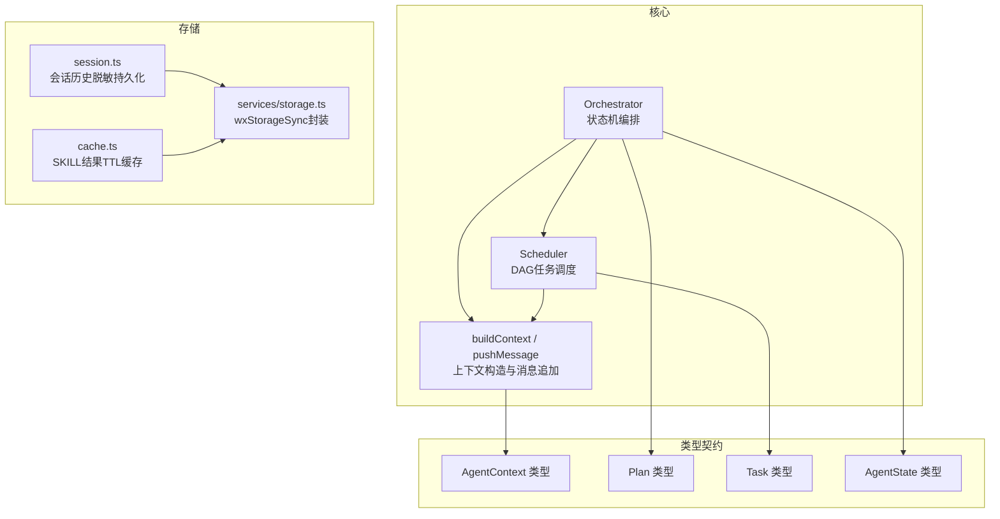
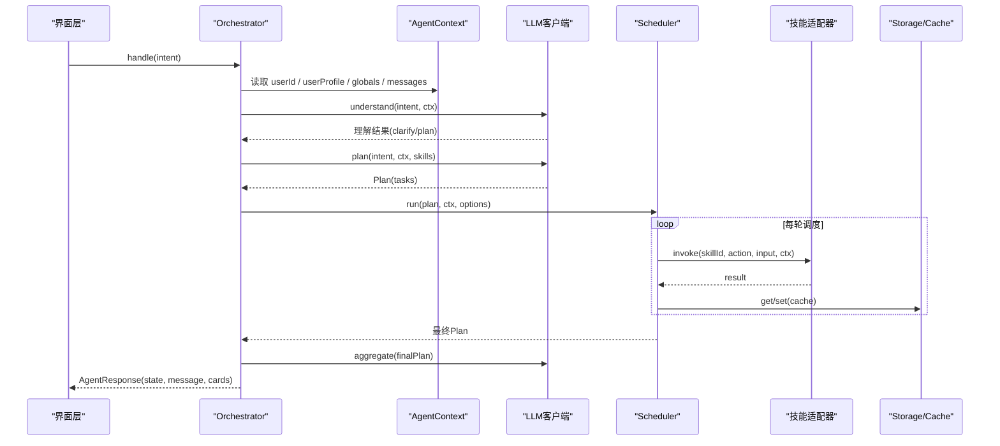
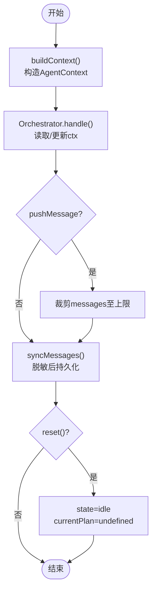
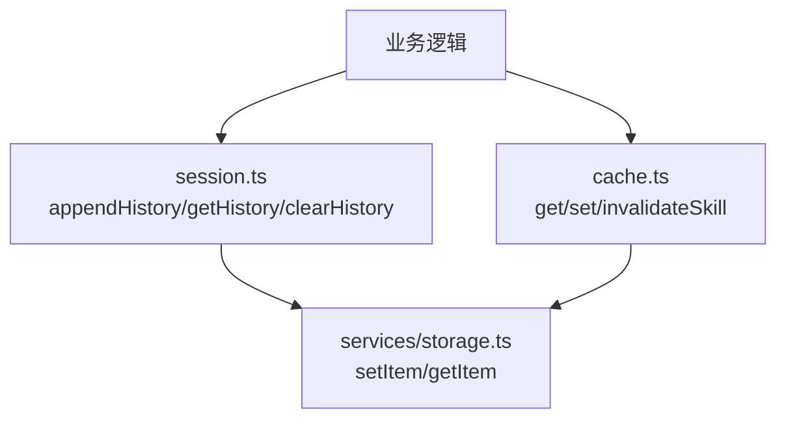
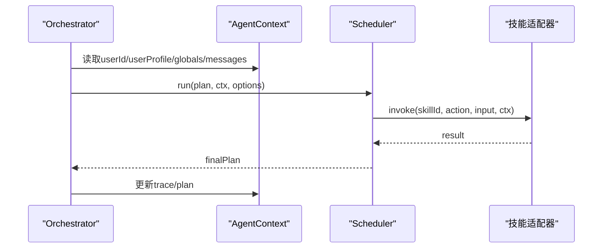
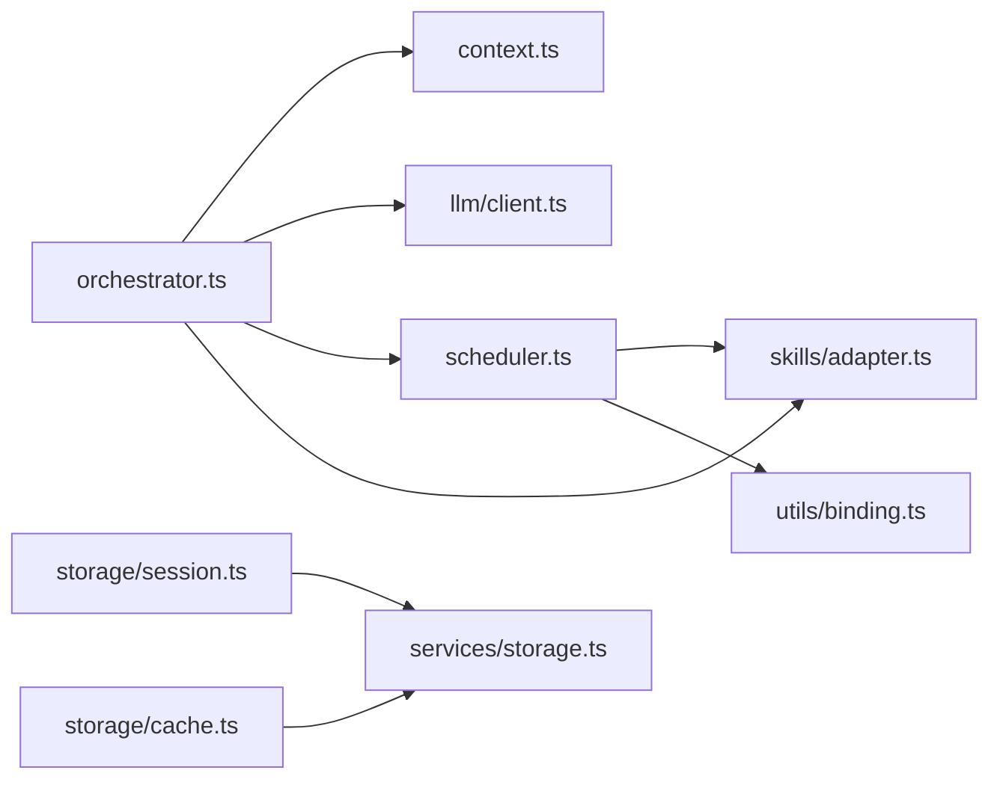

# Context上下文管理

<cite>
**本文引用的文件**   
- [miniprogram/src/core/context.ts](file://miniprogram/src/core/context.ts)
- [miniprogram/src/types/context.d.ts](file://miniprogram/src/types/context.d.ts)
- [miniprogram/src/core/orchestrator.ts](file://miniprogram/src/core/orchestrator.ts)
- [miniprogram/src/core/scheduler.ts](file://miniprogram/src/core/scheduler.ts)
- [miniprogram/src/storage/session.ts](file://miniprogram/src/storage/session.ts)
- [miniprogram/src/storage/cache.ts](file://miniprogram/src/storage/cache.ts)
- [miniprogram/src/services/storage.ts](file://miniprogram/src/services/storage.ts)
- [miniprogram/src/types/agent-state.d.ts](file://miniprogram/src/types/agent-state.d.ts)
- [miniprogram/src/types/plan.d.ts](file://miniprogram/src/types/plan.d.ts)
- [miniprogram/src/types/task.d.ts](file://miniprogram/src/types/task.d.ts)
</cite>

## 目录
1. [引言](#引言)
2. [项目结构](#项目结构)
3. [核心组件](#核心组件)
4. [架构总览](#架构总览)
5. [详细组件分析](#详细组件分析)
6. [依赖关系分析](#依赖关系分析)
7. [性能与内存优化](#性能与内存优化)
8. [故障排查指南](#故障排查指南)
9. [结论](#结论)

## 引言
本文围绕 AgentContext 上下文管理系统，系统性说明其设计模式、数据结构、生命周期管理、数据隔离机制、存储层集成方式，以及与编排器 Orchestrator、调度器 Scheduler、技能适配器、LLM 等模块的交互。文档同时给出面向实践的代码路径引用、架构图与时序图，帮助读者快速理解并正确使用上下文对象。

## 项目结构
本项目采用“核心能力分层 + 类型定义集中”的组织方式：
- core：Agent 编排与调度（Orchestrator、Scheduler）
- types：统一的类型契约（AgentContext、Plan、Task、AgentState 等）
- storage：本地持久化与缓存（session、cache）
- services：平台能力封装（storage 对 wx API 的封装）
- skills：技能注册与适配（被 core 调用）
- llm：大模型客户端与规划（被 core 调用）



图表来源
- [miniprogram/src/core/orchestrator.ts:1-30](file://miniprogram/src/core/orchestrator.ts#L1-L30)
- [miniprogram/src/core/scheduler.ts:1-25](file://miniprogram/src/core/scheduler.ts#L1-L25)
- [miniprogram/src/core/context.ts:1-20](file://miniprogram/src/core/context.ts#L1-L20)
- [miniprogram/src/storage/session.ts:1-15](file://miniprogram/src/storage/session.ts#L1-L15)
- [miniprogram/src/storage/cache.ts:1-15](file://miniprogram/src/storage/cache.ts#L1-L15)
- [miniprogram/src/services/storage.ts:1-15](file://miniprogram/src/services/storage.ts#L1-L15)

章节来源
- [miniprogram/src/core/orchestrator.ts:1-30](file://miniprogram/src/core/orchestrator.ts#L1-L30)
- [miniprogram/src/core/scheduler.ts:1-25](file://miniprogram/src/core/scheduler.ts#L1-L25)
- [miniprogram/src/core/context.ts:1-20](file://miniprogram/src/core/context.ts#L1-L20)
- [miniprogram/src/storage/session.ts:1-15](file://miniprogram/src/storage/session.ts#L1-L15)
- [miniprogram/src/storage/cache.ts:1-15](file://miniprogram/src/storage/cache.ts#L1-L15)
- [miniprogram/src/services/storage.ts:1-15](file://miniprogram/src/services/storage.ts#L1-L15)

## 核心组件
- AgentContext 上下文：封装用户会话信息、用户画像、全局变量、对话消息与追踪指标，作为单次会话的全局状态容器。
- Orchestrator 编排器：基于状态机的 Agent 流程控制，负责意图理解、计划生成、确认、执行、聚合与失败回滚。
- Scheduler 调度器：按 DAG 依赖并行执行 Task，支持人类确认 checkpoint、死锁检测与级联跳过。
- Session 存储：仅持久化脱敏后的历史摘要，不跨会话持久化完整 AgentContext。
- Cache 缓存：基于 TTL 的技能结果缓存，避免重复调用。
- Storage 服务：对 wx.setStorageSync 的安全封装，统一命名空间与错误处理。

章节来源
- [miniprogram/src/types/context.d.ts:1-62](file://miniprogram/src/types/context.d.ts#L1-L62)
- [miniprogram/src/core/orchestrator.ts:73-90](file://miniprogram/src/core/orchestrator.ts#L73-L90)
- [miniprogram/src/core/scheduler.ts:76-128](file://miniprogram/src/core/scheduler.ts#L76-L128)
- [miniprogram/src/storage/session.ts:1-15](file://miniprogram/src/storage/session.ts#L1-L15)
- [miniprogram/src/storage/cache.ts:1-15](file://miniprogram/src/storage/cache.ts#L1-L15)
- [miniprogram/src/services/storage.ts:1-15](file://miniprogram/src/services/storage.ts#L1-L15)

## 架构总览
下图展示从用户输入到上下文构建、计划生成、任务调度、结果聚合的端到端流程，以及上下文在各阶段的读写点。



图表来源
- [miniprogram/src/core/orchestrator.ts:106-256](file://miniprogram/src/core/orchestrator.ts#L106-L256)
- [miniprogram/src/core/scheduler.ts:76-128](file://miniprogram/src/core/scheduler.ts#L76-L128)
- [miniprogram/src/storage/cache.ts:35-52](file://miniprogram/src/storage/cache.ts#L35-L52)

## 详细组件分析

### AgentContext 设计与数据结构
AgentContext 是单次会话的全局状态容器，包含：
- sessionId：会话标识
- userId：用户标识（优先从缓存获取，否则匿名）
- userProfile：用户画像（位置、偏好、历史意图摘要）
- plan：当前计划（由 Planner 注入）
- globals：全局变量（如 cloudEnv）
- messages：多轮对话消息（内存中保留最近 N 条）
- trace：追踪指标（LLM/Skill 调用次数、token 总量、开始时间）

```mermaid
classDiagram
class AgentContext {
+string sessionId
+string userId
+UserProfile userProfile
+Plan plan
+Record~string,unknown~ globals
+ChatMessage[] messages
+TraceInfo trace
}
class UserProfile {
+UserLocation location
+Record~string,unknown~ preferences
+{intent : string;timestamp : number}[] history
}
class UserLocation {
+number lat
+number lng
+string city
}
class ChatMessage {
+string role
+string content
+Record~string,unknown~ metadata
+number timestamp
}
class TraceInfo {
+number llmCalls
+number skillCalls
+number totalTokens
+number startTime
}
AgentContext --> UserProfile : "包含"
UserProfile --> UserLocation : "可选"
AgentContext --> ChatMessage : "包含"
AgentContext --> TraceInfo : "包含"
```

图表来源
- [miniprogram/src/types/context.d.ts:11-62](file://miniprogram/src/types/context.d.ts#L11-L62)

上下文构造与消息追加的关键行为：
- buildContext：自动分配 sessionId；尝试获取 userId；可选获取地理位置；注入 globals；初始化 trace 与空 messages。
- pushMessage：追加消息并限制长度（防止内存膨胀）。

章节来源
- [miniprogram/src/core/context.ts:60-92](file://miniprogram/src/core/context.ts#L60-L92)
- [miniprogram/src/core/context.ts:94-104](file://miniprogram/src/core/context.ts#L94-L104)
- [miniprogram/src/types/context.d.ts:11-62](file://miniprogram/src/types/context.d.ts#L11-L62)

### 上下文生命周期管理
- 初始化：通过 buildContext 创建，注入 sessionId、userId、userProfile、globals、trace。
- 使用期：Orchestrator 在 handle 过程中读取/更新 ctx.messages、ctx.plan、ctx.trace。
- 清理策略：
  - 内存层面：messages 仅保留最近若干条，避免无限增长。
  - 持久化层面：AgentContext 不跨会话持久化；仅将脱敏后的历史摘要与消息片段写入本地存储。
  - 重置语义：Orchestrator.reset() 强制回到 idle，清空 currentPlan，但不销毁 ctx，以便复用会话上下文。



图表来源
- [miniprogram/src/core/context.ts:60-104](file://miniprogram/src/core/context.ts#L60-L104)
- [miniprogram/src/core/orchestrator.ts:258-270](file://miniprogram/src/core/orchestrator.ts#L258-L270)
- [miniprogram/src/storage/session.ts:39-48](file://miniprogram/src/storage/session.ts#L39-L48)

章节来源
- [miniprogram/src/core/context.ts:60-104](file://miniprogram/src/core/context.ts#L60-L104)
- [miniprogram/src/core/orchestrator.ts:258-270](file://miniprogram/src/core/orchestrator.ts#L258-L270)
- [miniprogram/src/storage/session.ts:39-48](file://miniprogram/src/storage/session.ts#L39-L48)

### 数据隔离机制与会话安全性
- 会话隔离：AgentContext 以 sessionId 区分不同会话；Orchestrator 持有独立 ctx 实例，避免跨请求污染。
- 身份隔离：userId 来自缓存或匿名；若为匿名则记录日志，不泄露敏感信息。
- 位置隐私：location 仅在需要时获取，且可关闭（withLocation=false）。
- 持久化脱敏：session.ts 仅保存脱敏后的历史摘要与消息前缀，避免敏感内容落盘。
- 存储命名空间：services/storage.ts 统一使用前缀 micromate:，避免与其他模块键冲突。

章节来源
- [miniprogram/src/core/context.ts:60-92](file://miniprogram/src/core/context.ts#L60-L92)
- [miniprogram/src/storage/session.ts:1-15](file://miniprogram/src/storage/session.ts#L1-L15)
- [miniprogram/src/storage/session.ts:39-48](file://miniprogram/src/storage/session.ts#L39-L48)
- [miniprogram/src/services/storage.ts:10-15](file://miniprogram/src/services/storage.ts#L10-L15)

### 与存储层的集成与缓存策略
- 会话历史：appendHistory/getHistory/clearHistory 维护脱敏的历史条目列表，限制最大长度。
- 消息同步：syncMessages 将当前会话的 ChatMessage 脱敏后写入本地存储。
- 技能结果缓存：cache.ts 提供基于 skillId:action:hash(input) 的 TTL 缓存，默认 5 分钟，避免重复调用。
- 存储抽象：所有持久化通过 services/storage.ts 的 getItem/setItem/removeItem/clearAll 进行，统一异常处理与前缀命名。



图表来源
- [miniprogram/src/storage/session.ts:24-48](file://miniprogram/src/storage/session.ts#L24-L48)
- [miniprogram/src/storage/cache.ts:35-57](file://miniprogram/src/storage/cache.ts#L35-L57)
- [miniprogram/src/services/storage.ts:12-34](file://miniprogram/src/services/storage.ts#L12-L34)

章节来源
- [miniprogram/src/storage/session.ts:24-48](file://miniprogram/src/storage/session.ts#L24-L48)
- [miniprogram/src/storage/cache.ts:35-57](file://miniprogram/src/storage/cache.ts#L35-L57)
- [miniprogram/src/services/storage.ts:12-34](file://miniprogram/src/services/storage.ts#L12-L34)

### 与编排器和调度器的交互
- Orchestrator 持有 ctx，并在 handle 过程中：
  - 读取 ctx.userId、userProfile、globals、messages 用于意图理解与计划生成。
  - 更新 ctx.plan、ctx.trace 以反映执行进度。
  - 通过 onTaskUpdate/onPlanUpdate 回调向 UI 推送状态变化。
- Scheduler 接收 ctx，并在执行每个 Task 时传入 ctx，供技能适配器访问上下文信息。



图表来源
- [miniprogram/src/core/orchestrator.ts:106-256](file://miniprogram/src/core/orchestrator.ts#L106-L256)
- [miniprogram/src/core/scheduler.ts:139-204](file://miniprogram/src/core/scheduler.ts#L139-L204)

章节来源
- [miniprogram/src/core/orchestrator.ts:106-256](file://miniprogram/src/core/orchestrator.ts#L106-L256)
- [miniprogram/src/core/scheduler.ts:139-204](file://miniprogram/src/core/scheduler.ts#L139-L204)

### 代码示例（路径引用）
- 创建上下文对象：[miniprogram/src/core/context.ts:60-92](file://miniprogram/src/core/context.ts#L60-L92)
- 追加对话消息：[miniprogram/src/core/context.ts:94-104](file://miniprogram/src/core/context.ts#L94-L104)
- 一次性处理意图（构建上下文+编排）：[miniprogram/src/core/orchestrator.ts:331-340](file://miniprogram/src/core/orchestrator.ts#L331-L340)
- 将消息同步到本地存储（脱敏）：[miniprogram/src/storage/session.ts:39-48](file://miniprogram/src/storage/session.ts#L39-L48)
- 写入技能结果缓存：[miniprogram/src/storage/cache.ts:44-52](file://miniprogram/src/storage/cache.ts#L44-L52)

## 依赖关系分析
- Orchestrator 依赖：
  - context.buildContext：构造 AgentContext
  - llm.client：意图理解、计划生成、结果聚合
  - scheduler.run：DAG 任务调度
  - skills.adapter：技能调用与能力查询
  - utils.idgen/utils.logger：ID 生成与日志
- Scheduler 依赖：
  - skills.adapter：执行具体技能
  - utils.binding：解析 inputBindings
  - types.task/types.plan：任务与计划类型
- Storage 层依赖：
  - services.storage：wxStorageSync 封装
  - types.context：ChatMessage 类型



图表来源
- [miniprogram/src/core/orchestrator.ts:13-26](file://miniprogram/src/core/orchestrator.ts#L13-L26)
- [miniprogram/src/core/scheduler.ts:18-26](file://miniprogram/src/core/scheduler.ts#L18-L26)
- [miniprogram/src/storage/session.ts:10-12](file://miniprogram/src/storage/session.ts#L10-L12)
- [miniprogram/src/storage/cache.ts:11-12](file://miniprogram/src/storage/cache.ts#L11-L12)

章节来源
- [miniprogram/src/core/orchestrator.ts:13-26](file://miniprogram/src/core/orchestrator.ts#L13-L26)
- [miniprogram/src/core/scheduler.ts:18-26](file://miniprogram/src/core/scheduler.ts#L18-L26)
- [miniprogram/src/storage/session.ts:10-12](file://miniprogram/src/storage/session.ts#L10-L12)
- [miniprogram/src/storage/cache.ts:11-12](file://miniprogram/src/storage/cache.ts#L11-L12)

## 性能与内存优化
- 消息长度限制：pushMessage 将 messages 限制在固定数量，避免内存泄漏。
- 缓存命中减少调用：cache.ts 使用 TTL 与输入哈希 key，降低重复技能调用开销。
- 序列化互斥：checkpointChain 串行化人类确认弹窗，避免并发弹框导致的状态丢失。
- 迭代保护：Scheduler 设置 guard 上限，防止死循环。
- 批量执行：ready 任务使用 Promise.allSettled 并行执行，提升吞吐。
- 存储安全封装：services/storage.ts 统一 try/catch，避免阻塞主流程。

建议
- 根据设备性能调整 messages 上限与 cache TTL。
- 对高频读操作增加内存级缓存（进程内），结合持久化缓存做二级缓存。
- 对大数据量历史摘要考虑分页加载与增量更新。
- 监控 trace 指标（llmCalls、skillCalls、totalTokens）以定位瓶颈。

章节来源
- [miniprogram/src/core/context.ts:94-104](file://miniprogram/src/core/context.ts#L94-L104)
- [miniprogram/src/storage/cache.ts:35-52](file://miniprogram/src/storage/cache.ts#L35-L52)
- [miniprogram/src/core/scheduler.ts:54-74](file://miniprogram/src/core/scheduler.ts#L54-L74)
- [miniprogram/src/core/scheduler.ts:85-97](file://miniprogram/src/core/scheduler.ts#L85-L97)
- [miniprogram/src/core/scheduler.ts:117-119](file://miniprogram/src/core/scheduler.ts#L117-L119)
- [miniprogram/src/services/storage.ts:26-34](file://miniprogram/src/services/storage.ts#L26-L34)

## 故障排查指南
常见问题与定位要点：
- 意图识别为空（EMPTY_PLAN）：检查 LLM 返回 tasks 是否为空，必要时优化提示词或技能注册。
- 任务卡死（DEADLOCK）：查看 pending 任务是否满足依赖；检查 human-in-the-loop 确认是否完成。
- 执行令牌失效（RUN_RESET）：确认 Orchestrator.reset() 是否被调用，避免旧流程继续执行。
- 状态非法转移：检查 ALLOWED_TRANSITIONS 与 transition 调用顺序。
- 存储异常：检查 wx API 是否存在、JSON 序列化是否成功、key 命名空间是否正确。

相关实现参考：
- Orchestrator 异常分支与错误码：[miniprogram/src/core/orchestrator.ts:222-255](file://miniprogram/src/core/orchestrator.ts#L222-L255)
- Scheduler 死锁检测与中止：[miniprogram/src/core/scheduler.ts:95-113](file://miniprogram/src/core/scheduler.ts#L95-L113), [miniprogram/src/core/scheduler.ts:219-227](file://miniprogram/src/core/scheduler.ts#L219-L227)
- 存储封装异常处理：[miniprogram/src/services/storage.ts:12-34](file://miniprogram/src/services/storage.ts#L12-L34)

章节来源
- [miniprogram/src/core/orchestrator.ts:222-255](file://miniprogram/src/core/orchestrator.ts#L222-L255)
- [miniprogram/src/core/scheduler.ts:95-113](file://miniprogram/src/core/scheduler.ts#L95-L113)
- [miniprogram/src/core/scheduler.ts:219-227](file://miniprogram/src/core/scheduler.ts#L219-L227)
- [miniprogram/src/services/storage.ts:12-34](file://miniprogram/src/services/storage.ts#L12-L34)

## 结论
AgentContext 作为单次会话的全局状态容器，配合 Orchestrator 的状态机编排与 Scheduler 的 DAG 调度，形成了清晰、可控、可扩展的 Agent 运行框架。通过严格的类型契约、脱敏持久化、TTL 缓存与存储封装，系统在功能完备性与安全性之间取得平衡。实践中应关注消息长度限制、缓存命中率、人类确认串行化与状态机合法性，以获得稳定高效的运行体验。