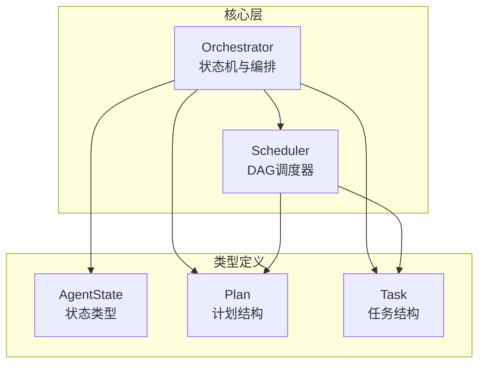
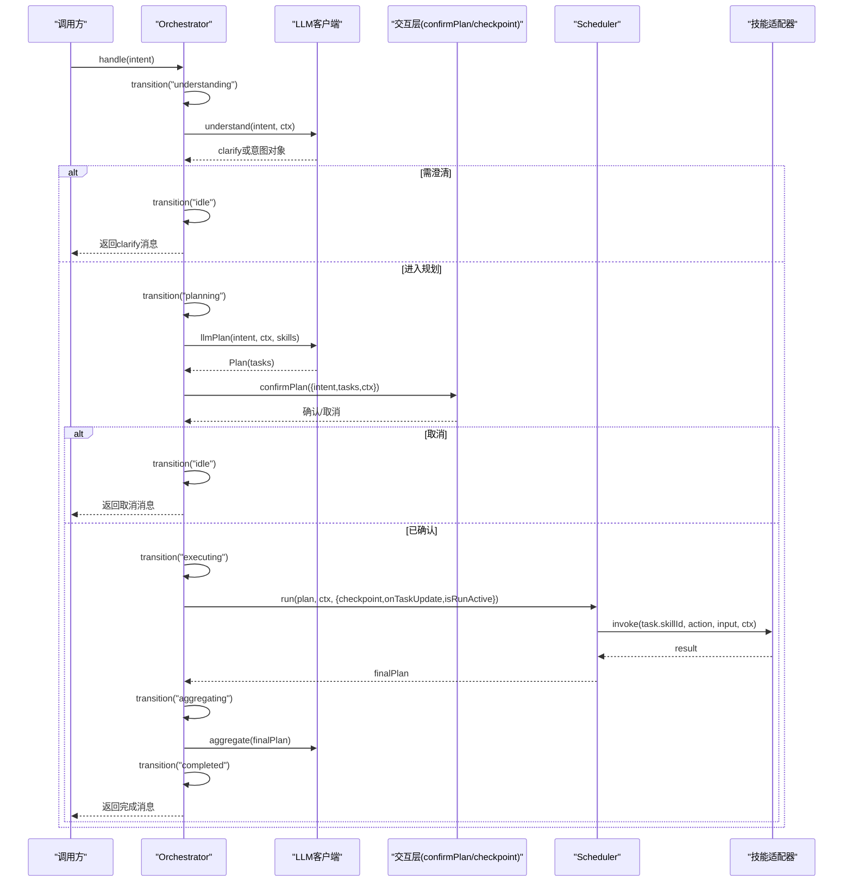
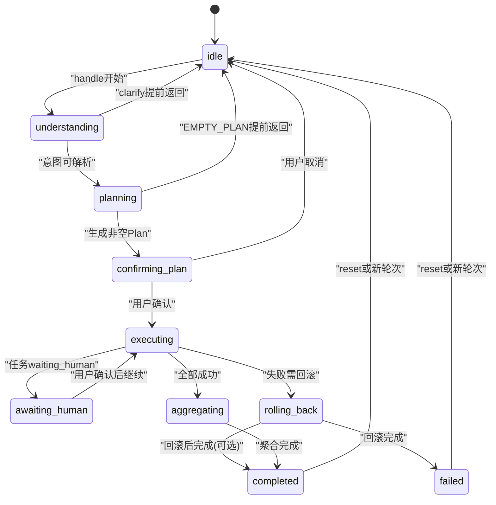
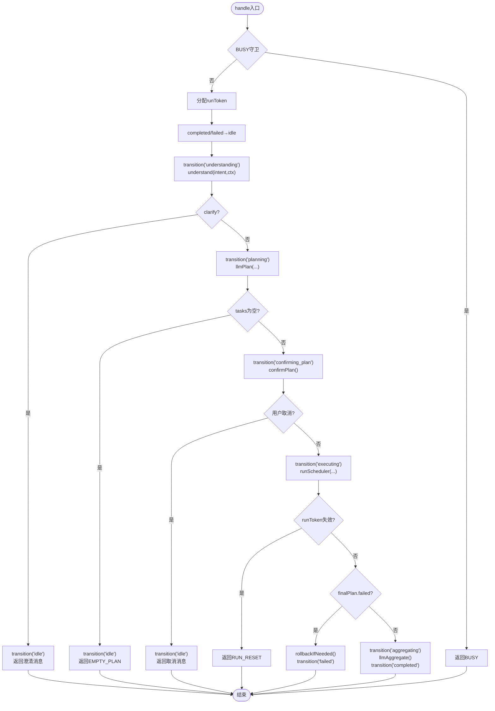
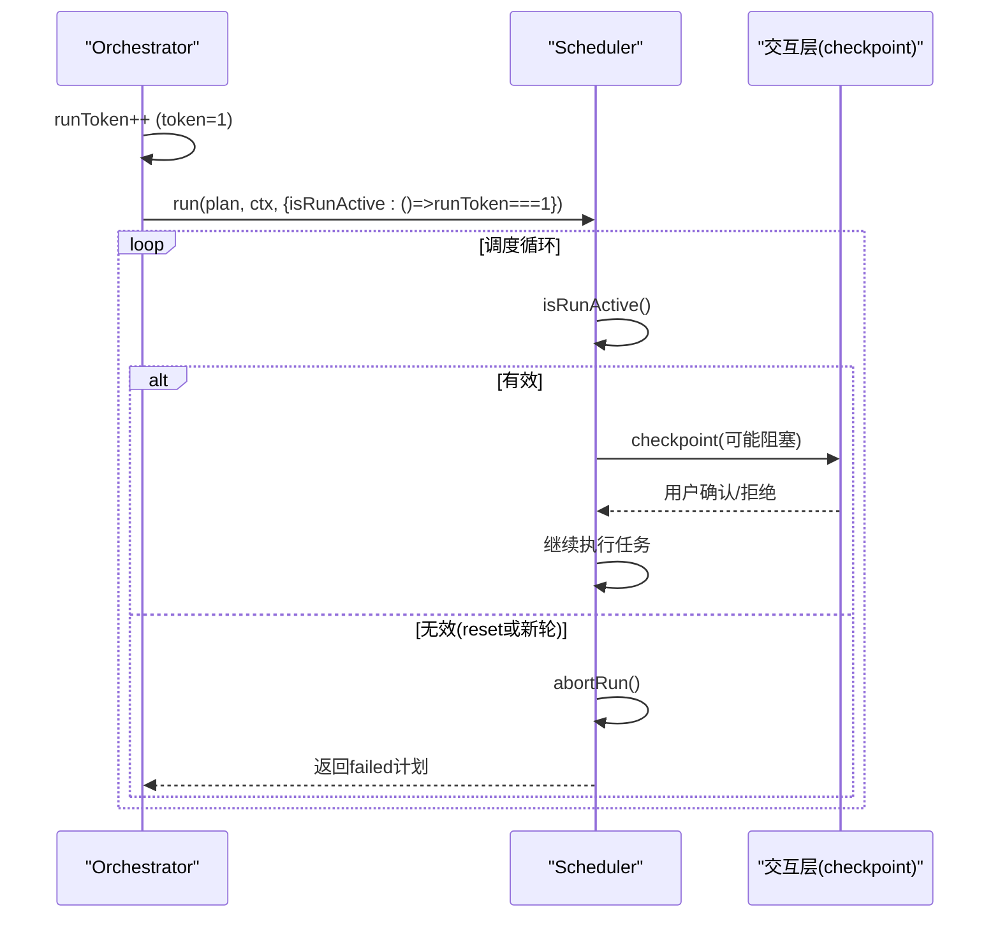
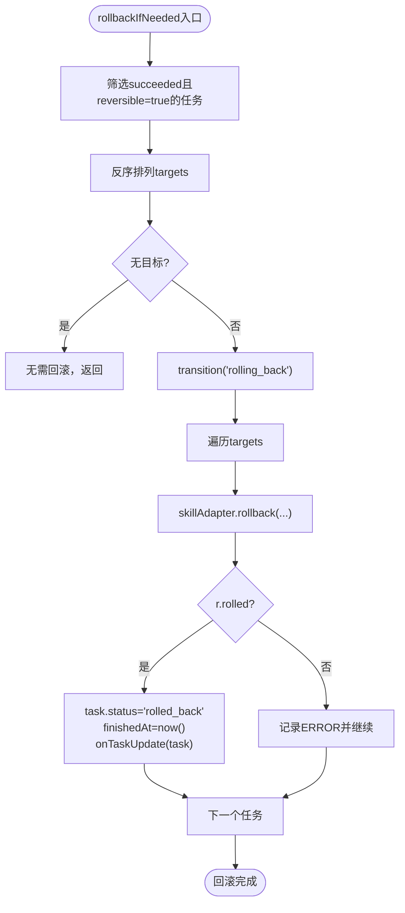
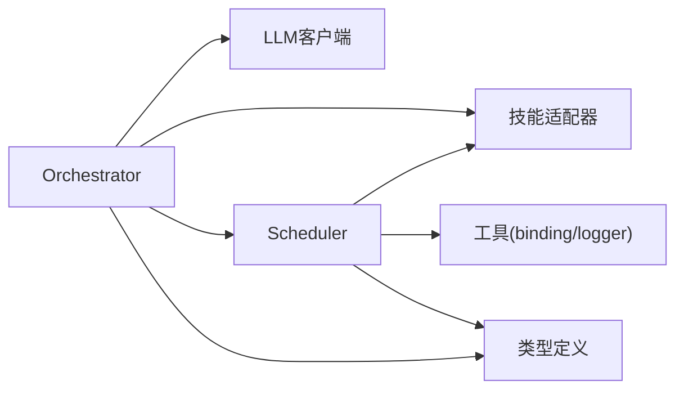

# Orchestrator编排器

<cite>
**本文引用的文件**   
- [orchestrator.ts](file://miniprogram/src/core/orchestrator.ts)
- [scheduler.ts](file://miniprogram/src/core/scheduler.ts)
- [agent-state.d.ts](file://miniprogram/src/types/agent-state.d.ts)
- [plan.d.ts](file://miniprogram/src/types/plan.d.ts)
- [task.d.ts](file://miniprogram/src/types/task.d.ts)
</cite>

## 目录
1. [引言](#引言)
2. [项目结构](#项目结构)
3. [核心组件](#核心组件)
4. [架构总览](#架构总览)
5. [详细组件分析](#详细组件分析)
6. [依赖关系分析](#依赖关系分析)
7. [性能与并发特性](#性能与并发特性)
8. [故障排查指南](#故障排查指南)
9. [结论](#结论)
10. [附录：使用示例与扩展指南](#附录使用示例与扩展指南)

## 引言
本技术文档围绕 Orchestrator 编排器展开，系统性解释其状态机设计、意图理解到计划确认再到任务执行的完整流程、令牌机制防止并发冲突与死锁的原理、回滚逻辑的可逆任务识别与反序撤销策略，以及错误处理与异常恢复。同时提供面向开发者的扩展方法与最佳实践，帮助在保持系统稳定性的前提下扩展自定义状态和行为。

## 项目结构
Orchestrator 位于 miniprogram/src/core 目录，配合 scheduler、类型定义与技能适配器共同构成编排与调度体系。关键文件职责如下：
- orchestrator.ts：编排器主类，负责状态机、意图理解、计划确认、执行协调与结果聚合。
- scheduler.ts：DAG 调度器，负责任务就绪判断、并行执行、人类确认序列化、死锁检测与级联跳过。
- agent-state.d.ts：AgentState 状态机类型与对外响应卡片类型。
- plan.d.ts：Plan 生命周期与数据结构。
- task.d.ts：Task 生命周期、输入绑定与依赖关系。

图表来源
- [orchestrator.ts:1-340](file://miniprogram/src/core/orchestrator.ts#L1-L340)
- [scheduler.ts:1-245](file://miniprogram/src/core/scheduler.ts#L1-L245)
- [agent-state.d.ts:1-47](file://miniprogram/src/types/agent-state.d.ts#L1-L47)
- [plan.d.ts:1-51](file://miniprogram/src/types/plan.d.ts#L1-L51)
- [task.d.ts:1-59](file://miniprogram/src/types/task.d.ts#L1-L59)

章节来源
- [orchestrator.ts:1-340](file://miniprogram/src/core/orchestrator.ts#L1-L340)
- [scheduler.ts:1-245](file://miniprogram/src/core/scheduler.ts#L1-L245)
- [agent-state.d.ts:1-47](file://miniprogram/src/types/agent-state.d.ts#L1-L47)
- [plan.d.ts:1-51](file://miniprogram/src/types/plan.d.ts#L1-L51)
- [task.d.ts:1-59](file://miniprogram/src/types/task.d.ts#L1-L59)

## 核心组件
- Orchestrator：对外入口 handle(intent, ctx) → AgentResponse；内部维护 state、currentPlan、runToken 与 options（confirmPlan、checkpoint、autoConfirm、autoApproveCheckpoint、onTaskUpdate、onPlanUpdate、onStateChange）。
- Scheduler：run(plan, ctx, options) 实现 DAG 调度，包含 checkpoint 序列化、isRunActive 令牌探测、死锁检测与级联跳过。
- 类型定义：AgentState、Plan、Task 明确状态机与数据流边界。

章节来源
- [orchestrator.ts:28-89](file://miniprogram/src/core/orchestrator.ts#L28-L89)
- [scheduler.ts:27-44](file://miniprogram/src/core/scheduler.ts#L27-L44)
- [agent-state.d.ts:7-17](file://miniprogram/src/types/agent-state.d.ts#L7-L17)
- [plan.d.ts:11-33](file://miniprogram/src/types/plan.d.ts#L11-L33)
- [task.d.ts:11-59](file://miniprogram/src/types/task.d.ts#L11-L59)

## 架构总览
Orchestrator 作为编排中枢，串联意图理解、LLM 规划、用户确认、任务调度与结果聚合。Scheduler 负责将 Plan 中的 Task 按依赖关系并行执行，并在需要时通过 checkpoint 进行人类确认。

图表来源
- [orchestrator.ts:106-256](file://miniprogram/src/core/orchestrator.ts#L106-L256)
- [scheduler.ts:77-128](file://miniprogram/src/core/scheduler.ts#L77-L128)

## 详细组件分析

### 状态机设计与 ALLOWED_TRANSITIONS
- 状态集合：idle、understanding、planning、confirming_plan、executing、awaiting_human、aggregating、rolling_back、completed、failed。
- 允许转移表 ALLOWED_TRANSITIONS 定义了每个状态的合法下一状态，确保状态机时序正确。
- transition(next) 方法会检查当前状态是否允许转移到 next，非法转移仅告警不中断（MVP宽松模式），并触发 onStateChange 回调用于 UI 提示。

图表来源
- [orchestrator.ts:60-71](file://miniprogram/src/core/orchestrator.ts#L60-L71)
- [orchestrator.ts:319-328](file://miniprogram/src/core/orchestrator.ts#L319-L328)
- [agent-state.d.ts:7-17](file://miniprogram/src/types/agent-state.d.ts#L7-L17)

章节来源
- [orchestrator.ts:60-71](file://miniprogram/src/core/orchestrator.ts#L60-L71)
- [orchestrator.ts:319-328](file://miniprogram/src/core/orchestrator.ts#L319-L328)
- [agent-state.d.ts:7-17](file://miniprogram/src/types/agent-state.d.ts#L7-L17)

### handle方法的完整执行流程
handle(intent) 是 Orchestrator 的对外入口，执行阶段如下：
1. BUSY守卫：若当前状态不是 idle/completed/failed，直接返回 BUSY 错误码。
2. 令牌分配：token = ++runToken，用于后续 isRunActive 探测。
3. 状态归位：若处于 completed/failed，先合法转回 idle。
4. 意图理解：transition("understanding")，调用 understand(intent, ctx)。
   - 若返回 clarify：transition("idle") 并返回澄清消息。
5. 计划生成：transition("planning")，调用 llmPlan(intent, ctx, SkillRegistry.listSlim())。
   - 若 tasks 为空：transition("idle") 并返回 EMPTY_PLAN 错误码。
6. 计划确认：transition("confirming_plan")，构造 planCards 并通过 confirmPlan 回调请求用户确认。
   - 若取消：transition("idle") 并返回取消消息。
7. 任务执行：transition("executing")，调用 runScheduler(plan, ctx, {checkpoint, onTaskUpdate, isRunActive})。
   - 若被 reset（runToken失效）：返回 RUN_RESET 错误码。
8. 结果聚合：若 finalPlan.status === 'failed'，则 rollbackIfNeeded 并 transition("failed")；否则 transition("aggregating")，调用 llmAggregate 并 transition("completed")。
9. 异常处理：捕获异常，根据 PlannerLLMError 与 SchedulerDeadlockError 分别处理，必要时先回滚再进入 failed。

图表来源
- [orchestrator.ts:106-256](file://miniprogram/src/core/orchestrator.ts#L106-L256)

章节来源
- [orchestrator.ts:106-256](file://miniprogram/src/core/orchestrator.ts#L106-L256)

### runToken令牌机制：防止并发冲突与死锁
- 每次 handle() 或 reset() 递增 runToken。
- handle() 中 token = ++runToken，并将 isRunActive = () => this.runToken === token 传入 Scheduler。
- Scheduler 每轮循环检查 isRunActive()，若为 false 则 abortRun 将所有非终态任务标记为 skipped，并返回失败计划。
- Orchestrator 在执行期间检测到 runToken !== token，立即丢弃后续流程并返回 RUN_RESET。
- reset() 强制将状态置为 idle，并递增 runToken，使在途 Scheduler 与 checkpoint 流程失效，避免旧流程继续弹窗、重复下单与并发双跑。

图表来源
- [orchestrator.ts:79-84](file://miniprogram/src/core/orchestrator.ts#L79-L84)
- [orchestrator.ts:116-118](file://miniprogram/src/core/orchestrator.ts#L116-L118)
- [orchestrator.ts:177-183](file://miniprogram/src/core/orchestrator.ts#L177-L183)
- [orchestrator.ts:258-270](file://miniprogram/src/core/orchestrator.ts#L258-L270)
- [scheduler.ts:77-93](file://miniprogram/src/core/scheduler.ts#L77-L93)
- [scheduler.ts:219-227](file://miniprogram/src/core/scheduler.ts#L219-L227)

章节来源
- [orchestrator.ts:79-84](file://miniprogram/src/core/orchestrator.ts#L79-L84)
- [orchestrator.ts:116-118](file://miniprogram/src/core/orchestrator.ts#L116-L118)
- [orchestrator.ts:177-183](file://miniprogram/src/core/orchestrator.ts#L177-L183)
- [orchestrator.ts:258-270](file://miniprogram/src/core/orchestrator.ts#L258-L270)
- [scheduler.ts:77-93](file://miniprogram/src/core/scheduler.ts#L77-L93)
- [scheduler.ts:219-227](file://miniprogram/src/core/scheduler.ts#L219-L227)

### rollbackIfNeeded回滚逻辑：可逆任务识别与反序撤销
- 目标选择：筛选 status === 'succeeded' 且 getCapability(skillId, action).reversible === true 的任务。
- 反序策略：targets.reverse()，确保后完成的先撤销，与执行顺序对称。
- 执行回滚：逐个调用 skillAdapter.rollback(skillId, action, input, result, ctx)，若 r.rolled 则更新 task.status='rolled_back' 并触发 onTaskUpdate。
- 单点失败处理：单个任务回滚失败仅记录 ERROR 并继续其余任务，不中断整体回滚。
- 状态转移：进入 rolling_back 状态，完成后由调用方决定是否转入 failed 或 completed。

图表来源
- [orchestrator.ts:272-303](file://miniprogram/src/core/orchestrator.ts#L272-L303)

章节来源
- [orchestrator.ts:272-303](file://miniprogram/src/core/orchestrator.ts#L272-L303)

### 错误处理与异常恢复策略
- BUSY守卫：非空闲/完成/失败状态直接返回 errorCode='BUSY'。
- EMPTY_PLAN：LLM未识别意图返回 errorCode='EMPTY_PLAN'。
- RUN_RESET：执行期间被 reset 返回 errorCode='RUN_RESET'。
- LLM_ERROR：PlannerLLMError 捕获并返回 errorCode='LLM_ERROR'。
- DEADLOCK：SchedulerDeadlockError 捕获并返回 errorCode='DEADLOCK'。
- UNEXPECTED：其他异常统一返回 errorCode='UNEXPECTED'，必要时先回滚已成功任务。

章节来源
- [orchestrator.ts:106-256](file://miniprogram/src/core/orchestrator.ts#L106-L256)
- [scheduler.ts:46-52](file://miniprogram/src/core/scheduler.ts#L46-L52)

## 依赖关系分析
- Orchestrator 依赖：
  - LLM客户端：understand、llmPlan、aggregate。
  - 技能适配器：skillAdapter.invoke、getCapability。
  - 调度器：runScheduler。
  - 类型定义：AgentContext、AgentState、Plan、Task。
  - 工具：logger、idgen、brand常量。
- Scheduler 依赖：
  - 技能适配器：adapter.invoke、getCapability。
  - 工具：binding.applyBindings、indexTasks、logger。
  - 类型：AgentContext、Plan、Task、CheckpointFn。

图表来源
- [orchestrator.ts:13-26](file://miniprogram/src/core/orchestrator.ts#L13-L26)
- [scheduler.ts:18-26](file://miniprogram/src/core/scheduler.ts#L18-L26)

章节来源
- [orchestrator.ts:13-26](file://miniprogram/src/core/orchestrator.ts#L13-L26)
- [scheduler.ts:18-26](file://miniprogram/src/core/scheduler.ts#L18-L26)

## 性能与并发特性
- 并行执行：Scheduler 使用 Promise.allSettled 并行执行 ready 任务，提升吞吐。
- 人类确认序列化：checkpointChain 模块级 Promise 链确保同一时刻仅一个确认弹窗，避免 wx.showModal 覆盖导致确认结果丢失。
- 令牌探测：isRunActive 每轮检查，及时中止无效调度，降低资源浪费。
- 迭代保护：guard > 1000 抛出错误，防止无限循环。

章节来源
- [scheduler.ts:117-119](file://miniprogram/src/core/scheduler.ts#L117-L119)
- [scheduler.ts:62-74](file://miniprogram/src/core/scheduler.ts#L62-L74)
- [scheduler.ts:85-97](file://miniprogram/src/core/scheduler.ts#L85-L97)

## 故障排查指南
- BUSY：检查当前 Orchestrator 状态是否为 idle/completed/failed；若处于中间状态，等待完成或调用 reset。
- EMPTY_PLAN：确认 LLM 是否能识别意图；检查 SkillRegistry 注册的技能是否覆盖该意图。
- RUN_RESET：检查是否在任务执行过程中调用了 reset；确保上层 UI 不会在用户确认前重置。
- DEADLOCK：查看 pending 任务与 running/waiting_human 任务；检查依赖图是否存在环或上游任务未成功。
- LLM_ERROR：检查 LLM 客户端配置与网络；捕获具体 message 定位问题。
- UNEXPECTED：记录异常堆栈；必要时先回滚已成功任务再进入 failed。

章节来源
- [orchestrator.ts:106-256](file://miniprogram/src/core/orchestrator.ts#L106-L256)
- [scheduler.ts:102-114](file://miniprogram/src/core/scheduler.ts#L102-L114)

## 结论
Orchestrator 通过严谨的状态机与 ALLOWED_TRANSITIONS 约束，结合 runToken 令牌机制与 Scheduler 的并行执行、人类确认序列化与死锁检测，实现了高内聚、低耦合的编排与调度能力。rollbackIfNeeded 的反序撤销策略确保了写操作的可逆性与一致性。开发者可通过注入 confirmPlan、checkpoint 等回调扩展交互行为，并通过 getCapability.reversible 控制回滚范围。

## 附录：使用示例与扩展指南

### 使用 Orchestrator 类及其API
- 构建上下文与选项：
  - 使用 buildContext(ctxOpts) 创建 AgentContext。
  - 注入 confirmPlan、checkpoint、autoConfirm、autoApproveCheckpoint、onTaskUpdate、onPlanUpdate、onStateChange。
- 单次处理：
  - 调用 handleOnce(intent, ctxOpts, options) 便捷工厂，内部自动构建 Orchestrator 并执行 handle。
- 持续对话：
  - 手动 new Orchestrator(ctx, options)，多次调用 handle(intent) 以维持多轮会话。

章节来源
- [orchestrator.ts:331-340](file://miniprogram/src/core/orchestrator.ts#L331-L340)
- [orchestrator.ts:28-48](file://miniprogram/src/core/orchestrator.ts#L28-L48)

### 扩展自定义状态与行为
- 自定义状态：
  - 在 agent-state.d.ts 中扩展 AgentState 联合类型。
  - 在 orchestrator.ts 的 ALLOWED_TRANSITIONS 中添加合法转移对。
  - 在 transition 与 handle 流程中增加对应分支。
- 自定义行为：
  - 通过 onTaskUpdate、onPlanUpdate、onStateChange 回调扩展 UI 展示与日志。
  - 在 SkillRegistry 中注册新技能，并在 getCapability 中声明 reversible 与 requiresHumanConfirm。
- 回滚扩展：
  - 在技能适配器中实现 rollback 逻辑，返回 { rolled: boolean, reason?: string }。
  - 确保 reversible 标记准确，避免误回滚不可逆操作。

章节来源
- [agent-state.d.ts:7-17](file://miniprogram/src/types/agent-state.d.ts#L7-L17)
- [orchestrator.ts:60-71](file://miniprogram/src/core/orchestrator.ts#L60-L71)
- [orchestrator.ts:319-328](file://miniprogram/src/core/orchestrator.ts#L319-L328)