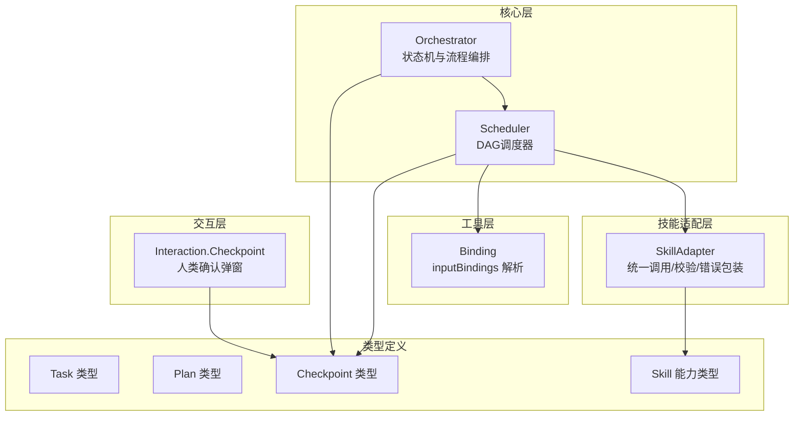
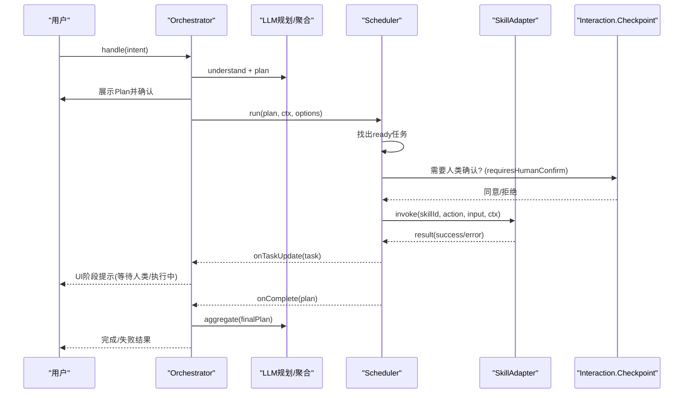
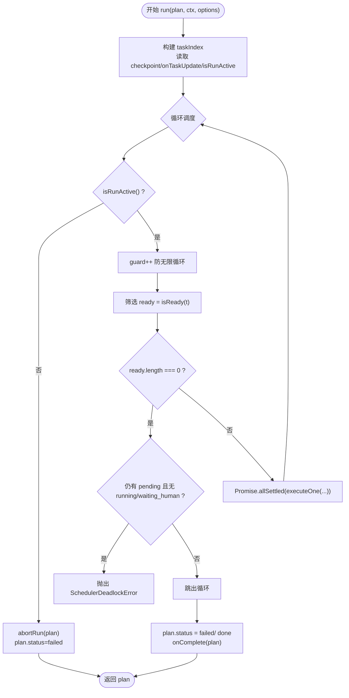
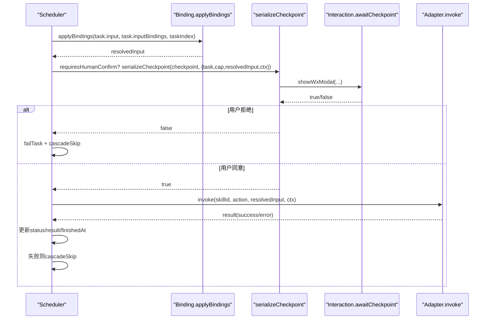
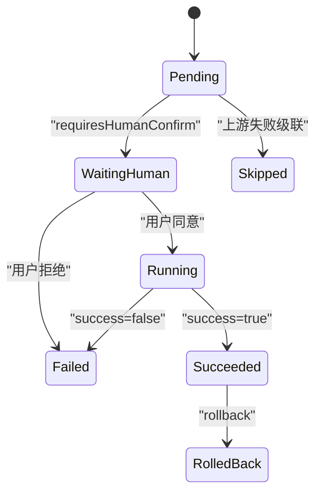
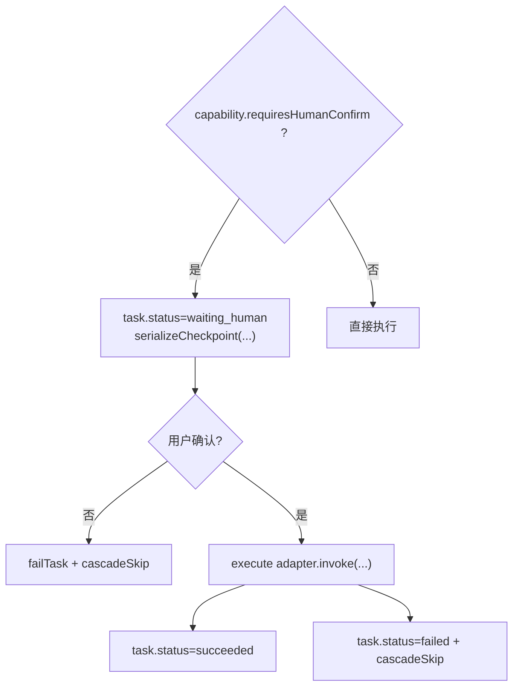
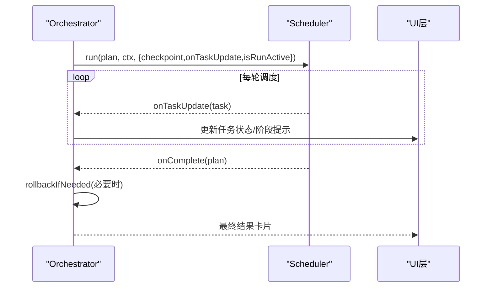
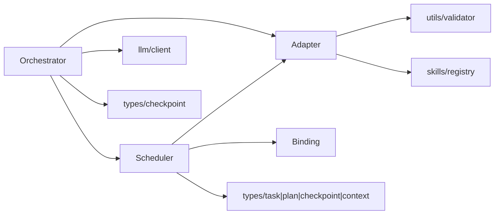

# Scheduler调度器

<cite>
**本文引用的文件**   
- [scheduler.ts](file://miniprogram/src/core/scheduler.ts)
- [orchestrator.ts](file://miniprogram/src/core/orchestrator.ts)
- [task.d.ts](file://miniprogram/src/types/task.d.ts)
- [plan.d.ts](file://miniprogram/src/types/plan.d.ts)
- [checkpoint.d.ts](file://miniprogram/src/types/checkpoint.d.ts)
- [skill.d.ts](file://miniprogram/src/types/skill.d.ts)
- [adapter.ts](file://miniprogram/src/skills/adapter.ts)
- [binding.ts](file://miniprogram/src/utils/binding.ts)
- [checkpoint.ts](file://miniprogram/src/interaction/checkpoint.ts)
- [app.ts](file://miniprogram/app.ts)
</cite>

## 目录
1. [引言](#引言)
2. [项目结构](#项目结构)
3. [核心组件](#核心组件)
4. [架构总览](#架构总览)
5. [详细组件分析](#详细组件分析)
6. [依赖关系分析](#依赖关系分析)
7. [性能与并发控制](#性能与并发控制)
8. [故障排查指南](#故障排查指南)
9. [结论](#结论)
10. [附录：配置与使用示例](#附录配置与使用示例)

## 引言
本技术文档聚焦于Scheduler调度器的实现原理与工程实践，围绕DAG任务调度引擎展开，涵盖依赖解析、拓扑执行轮次、并行执行策略、任务生命周期状态转换、人类确认检查点机制、资源管理与并发控制、与Orchestrator的协作和数据传递，以及性能优化建议与最佳实践。读者无需深入源码即可理解调度器如何驱动有向无环图（DAG）任务在小程序环境中安全、可观测、可回滚地执行。

## 项目结构
Scheduler位于miniprogram/src/core下，是Agent运行时“编排层”的核心组件之一。其职责是将Planner产出的Plan（包含Task DAG）按依赖关系逐步调度执行，并在需要时通过Checkpoint机制请求人类确认，保证写操作的事务一致性。

图表来源
- [orchestrator.ts:1-340](file://miniprogram/src/core/orchestrator.ts#L1-L340)
- [scheduler.ts:1-245](file://miniprogram/src/core/scheduler.ts#L1-L245)
- [task.d.ts:1-59](file://miniprogram/src/types/task.d.ts#L1-L59)
- [plan.d.ts:1-51](file://miniprogram/src/types/plan.d.ts#L1-L51)
- [checkpoint.d.ts:1-44](file://miniprogram/src/types/checkpoint.d.ts#L1-L44)
- [skill.d.ts:1-119](file://miniprogram/src/types/skill.d.ts#L1-L119)
- [adapter.ts:1-115](file://miniprogram/src/skills/adapter.ts#L1-L115)
- [binding.ts:1-50](file://miniprogram/src/utils/binding.ts#L1-L50)
- [checkpoint.ts:1-122](file://miniprogram/src/interaction/checkpoint.ts#L1-L122)

章节来源
- [orchestrator.ts:1-340](file://miniprogram/src/core/orchestrator.ts#L1-L340)
- [scheduler.ts:1-245](file://miniprogram/src/core/scheduler.ts#L1-L245)

## 核心组件
- Scheduler：负责DAG任务的依赖解析、逐轮调度、并行执行、失败级联跳过、死锁检测、人类确认序列化、runToken失效中止等。
- Orchestrator：负责整体状态机流转、Plan确认、调用Scheduler、结果聚合、失败回滚、与Scheduler的任务更新联动。
- SkillAdapter：统一封装SKILL调用、入参校验、错误包装、埋点、回滚调用。
- Binding：解析inputBindings，将上游Task的输出注入下游Task的输入。
- Checkpoint类型与交互实现：定义人类确认协议并提供UI弹窗实现。

章节来源
- [scheduler.ts:1-245](file://miniprogram/src/core/scheduler.ts#L1-L245)
- [orchestrator.ts:1-340](file://miniprogram/src/core/orchestrator.ts#L1-L340)
- [adapter.ts:1-115](file://miniprogram/src/skills/adapter.ts#L1-L115)
- [binding.ts:1-50](file://miniprogram/src/utils/binding.ts#L1-L50)
- [checkpoint.d.ts:1-44](file://miniprogram/src/types/checkpoint.d.ts#L1-L44)
- [checkpoint.ts:1-122](file://miniprogram/src/interaction/checkpoint.ts#L1-L122)

## 架构总览
Scheduler与Orchestrator协同工作：Orchestrator负责用户意图理解、计划生成与确认、状态机流转；Scheduler负责具体DAG任务的执行。两者通过回调和上下文进行数据传递，并通过runToken机制避免并发双跑。

图表来源
- [orchestrator.ts:106-256](file://miniprogram/src/core/orchestrator.ts#L106-L256)
- [scheduler.ts:77-128](file://miniprogram/src/core/scheduler.ts#L77-L128)
- [adapter.ts:37-84](file://miniprogram/src/skills/adapter.ts#L37-L84)
- [checkpoint.ts:49-64](file://miniprogram/src/interaction/checkpoint.ts#L49-L64)
- [checkpoint.ts:110-122](file://miniprogram/src/interaction/checkpoint.ts#L110-L122)

## 详细组件分析

### Scheduler调度器：DAG执行引擎
- 依赖解析：每轮扫描所有pending任务，仅当dependsOn全部为succeeded时才视为ready。
- 拓扑排序：不显式做全局拓扑排序，而是采用“逐轮就绪集合”的方式推进，天然满足拓扑顺序。
- 并行执行：对同一轮ready任务使用Promise.allSettled并行执行，互不阻塞。
- 失败级联：任一任务失败或绑定解析失败，会将其所有未执行的下游标记为skipped。
- 死锁检测：若本轮没有ready任务且仍有pending任务且无running/waiting_human任务，则抛出死锁异常。
- 人类确认：对requiresHumanConfirm=true的能力，进入waiting_human状态，通过serializeCheckpoint串行化弹窗，避免wx.showModal覆盖导致确认丢失。
- 运行令牌：isRunActive()用于探测当前轮是否仍有效，防止reset后继续执行或重复弹窗。
- 计划终态：全部成功标记done，任一失败标记failed，并触发onComplete回调。

图表来源
- [scheduler.ts:77-128](file://miniprogram/src/core/scheduler.ts#L77-L128)
- [scheduler.ts:131-137](file://miniprogram/src/core/scheduler.ts#L131-L137)
- [scheduler.ts:207-240](file://miniprogram/src/core/scheduler.ts#L207-L240)

#### 任务执行流程（含Checkpoint）

图表来源
- [scheduler.ts:139-204](file://miniprogram/src/core/scheduler.ts#L139-L204)
- [scheduler.ts:64-74](file://miniprogram/src/core/scheduler.ts#L64-L74)
- [checkpoint.ts:110-122](file://miniprogram/src/interaction/checkpoint.ts#L110-L122)
- [adapter.ts:37-84](file://miniprogram/src/skills/adapter.ts#L37-L84)

章节来源
- [scheduler.ts:1-245](file://miniprogram/src/core/scheduler.ts#L1-L245)
- [binding.ts:18-43](file://miniprogram/src/utils/binding.ts#L18-L43)
- [checkpoint.ts:110-122](file://miniprogram/src/interaction/checkpoint.ts#L110-L122)
- [adapter.ts:37-84](file://miniprogram/src/skills/adapter.ts#L37-L84)

### 任务生命周期与状态转换
- TaskStatus：pending → running → succeeded/failed → rolled_back/skipped；中间可能经过waiting_human。
- PlanStatus：draft → confirmed → executing → done/failed。
- Orchestrator状态机：idle → understanding → planning → confirming_plan → executing → awaiting_human → aggregating → completed/failed，支持rolling_back。

图表来源
- [task.d.ts:12-19](file://miniprogram/src/types/task.d.ts#L12-L19)
- [plan.d.ts:12-17](file://miniprogram/src/types/plan.d.ts#L12-L17)
- [orchestrator.ts:60-71](file://miniprogram/src/core/orchestrator.ts#L60-L71)
- [scheduler.ts:207-240](file://miniprogram/src/core/scheduler.ts#L207-L240)

章节来源
- [task.d.ts:12-19](file://miniprogram/src/types/task.d.ts#L12-L19)
- [plan.d.ts:12-17](file://miniprogram/src/types/plan.d.ts#L12-L17)
- [orchestrator.ts:60-71](file://miniprogram/src/core/orchestrator.ts#L60-L71)
- [scheduler.ts:207-240](file://miniprogram/src/core/scheduler.ts#L207-L240)

### Checkpoint检查点机制：人类确认与事务一致性
- 设计目标：确保写操作前必须获得用户明确同意，同时避免多个弹窗并发导致的确认丢失。
- 序列化互斥：模块级checkpointChain Promise链保证同一时刻只有一个checkpoint在执行，新的checkpoint排队等待前一个完成。
- 交互实现：Interaction.checkpoint通过wx.showModal展示任务摘要、能力类型、金额明细（如有），返回true/false。
- 与Scheduler集成：当capability.requiresHumanConfirm=true时，任务先置为waiting_human，等待用户确认后继续执行；若拒绝或runToken失效，则failTask并级联跳过下游。
- 事务一致性：失败路径由Orchestrator.rollbackIfNeeded按反序撤销已成功且reversible=true的任务，保证最终一致性。

图表来源
- [scheduler.ts:163-186](file://miniprogram/src/core/scheduler.ts#L163-L186)
- [scheduler.ts:64-74](file://miniprogram/src/core/scheduler.ts#L64-L74)
- [checkpoint.ts:110-122](file://miniprogram/src/interaction/checkpoint.ts#L110-L122)
- [orchestrator.ts:278-303](file://miniprogram/src/core/orchestrator.ts#L278-L303)

章节来源
- [scheduler.ts:64-74](file://miniprogram/src/core/scheduler.ts#L64-L74)
- [scheduler.ts:163-186](file://miniprogram/src/core/scheduler.ts#L163-L186)
- [checkpoint.ts:110-122](file://miniprogram/src/interaction/checkpoint.ts#L110-L122)
- [orchestrator.ts:278-303](file://miniprogram/src/core/orchestrator.ts#L278-L303)

### 资源管理与并发控制
- 并行度控制：Scheduler对每轮ready任务使用Promise.allSettled并行执行，无显式最大并行度限制；实际并发度取决于DAG结构与依赖关系。
- 资源池：代码中未实现显式资源池；如需限制并发，可在上层封装Semaphore或线程池适配器。
- 并发安全：通过serializeCheckpoint串行化人类确认弹窗，避免UI冲突；通过runToken防止多轮并发。
- 可扩展性：可通过扩展SchedulerOptions增加maxConcurrency参数，并在executeOne前加并发控制逻辑。

章节来源
- [scheduler.ts:117-119](file://miniprogram/src/core/scheduler.ts#L117-L119)
- [scheduler.ts:64-74](file://miniprogram/src/core/scheduler.ts#L64-L74)
- [orchestrator.ts:177-183](file://miniprogram/src/core/orchestrator.ts#L177-L183)

### 与Orchestrator的协作关系与数据传递
- Orchestrator负责：
  - 状态机流转与BUSY守卫
  - Plan确认（confirmPlan）
  - 调用Scheduler.run并传入checkpoint、onTaskUpdate、isRunActive
  - 根据task.waiting_human切换状态到awaiting_human
  - 失败时执行rollbackIfNeeded
- 数据传递：
  - Plan对象在Orchestrator与Scheduler之间共享，状态同步更新
  - Task对象通过onTaskUpdate回调推送给Orchestrator以驱动UI
  - AgentContext贯穿整个链路，提供会话上下文与trace信息

图表来源
- [orchestrator.ts:177-183](file://miniprogram/src/core/orchestrator.ts#L177-L183)
- [orchestrator.ts:310-317](file://miniprogram/src/core/orchestrator.ts#L310-L317)
- [orchestrator.ts:278-303](file://miniprogram/src/core/orchestrator.ts#L278-L303)

章节来源
- [orchestrator.ts:106-256](file://miniprogram/src/core/orchestrator.ts#L106-L256)
- [orchestrator.ts:310-317](file://miniprogram/src/core/orchestrator.ts#L310-L317)

## 依赖关系分析
- Orchestrator依赖：
  - scheduler.run
  - llm.client（understand/plan/aggregate）
  - skills.adapter（invoke/rollback/getCapability）
  - types.checkpoint（ConfirmPlanFn/CheckpointFn）
- Scheduler依赖：
  - utils.binding（applyBindings/indexTasks）
  - skills.adapter（invoke/getCapability）
  - types.task/plan/checkpoint/context
- SkillAdapter依赖：
  - utils.validator（validate）
  - skills.registry（SkillRegistry）
  - types.skill

图表来源
- [orchestrator.ts:13-26](file://miniprogram/src/core/orchestrator.ts#L13-L26)
- [scheduler.ts:18-25](file://miniprogram/src/core/scheduler.ts#L18-L25)
- [adapter.ts:13-17](file://miniprogram/src/skills/adapter.ts#L13-L17)
- [binding.ts:10-11](file://miniprogram/src/utils/binding.ts#L10-L11)

章节来源
- [orchestrator.ts:13-26](file://miniprogram/src/core/orchestrator.ts#L13-L26)
- [scheduler.ts:18-25](file://miniprogram/src/core/scheduler.ts#L18-L25)
- [adapter.ts:13-17](file://miniprogram/src/skills/adapter.ts#L13-L17)
- [binding.ts:10-11](file://miniprogram/src/utils/binding.ts#L10-L11)

## 性能与并发控制
- 并行执行：每轮ready任务并行执行，充分利用空闲资源；但需注意外部API限流与用户体验。
- 死锁保护：迭代次数上限guard>1000防止逻辑错误导致的无限循环。
- 弹窗序列化：checkpointChain避免UI弹窗并发覆盖，提升可靠性。
- 建议优化：
  - 引入maxConcurrency限制每轮最大并行度，避免瞬时高并发。
  - 对长耗时任务设置超时与重试策略（结合SkillResult.retryable）。
  - 对inputBindings解析失败快速失败，减少无效调度。
  - 对频繁UI更新进行节流，降低渲染开销。

[本节为通用性能讨论，不直接分析具体文件]

## 故障排查指南
- 死锁异常：当存在pending任务但无running/waiting_human任务时抛出SchedulerDeadlockError，需检查依赖是否正确、是否存在循环依赖。
- 绑定解析失败：inputBindings引用未完成或失败的上游任务，或字段路径不存在，需修正上游输出或绑定路径。
- 用户取消：checkpoint拒绝或runToken失效会导致任务失败并级联跳过下游，需检查用户交互与重置逻辑。
- 回滚失败：单个任务回滚失败仅记录错误并继续其余回滚，需检查对应SKILL的rollback实现。

章节来源
- [scheduler.ts:95-114](file://miniprogram/src/core/scheduler.ts#L95-L114)
- [scheduler.ts:151-158](file://miniprogram/src/core/scheduler.ts#L151-L158)
- [scheduler.ts:175-186](file://miniprogram/src/core/scheduler.ts#L175-L186)
- [orchestrator.ts:278-303](file://miniprogram/src/core/orchestrator.ts#L278-L303)

## 结论
Scheduler通过“逐轮就绪+并行执行”的方式实现了稳健的DAG调度，结合Checkpoint的人类确认机制与Orchestrator的回滚策略，确保了写操作的安全性与事务一致性。通过runToken与序列化弹窗，系统避免了并发双跑与UI冲突。建议在大规模任务场景下引入并发限制与超时重试，进一步提升稳定性与性能。

[本节为总结性内容，不直接分析具体文件]

## 附录：配置与使用示例
以下示例展示如何在小程序入口中创建Agent Runtime并注入Orchestrator所需的回调，从而启用Scheduler调度器。

- 在App启动时懒加载createAgentRuntime，并将confirmPlan与checkpoint注入Orchestrator。
- confirmPlan用于展示Plan并让用户确认；checkpoint用于每个写操作前的单步确认。
- 页面或业务逻辑通过globalData.agent获取AgentRuntime实例并调用handle(intent)。

章节来源
- [app.ts:23-48](file://miniprogram/app.ts#L23-L48)
- [checkpoint.ts:49-64](file://miniprogram/src/interaction/checkpoint.ts#L49-L64)
- [checkpoint.ts:110-122](file://miniprogram/src/interaction/checkpoint.ts#L110-L122)