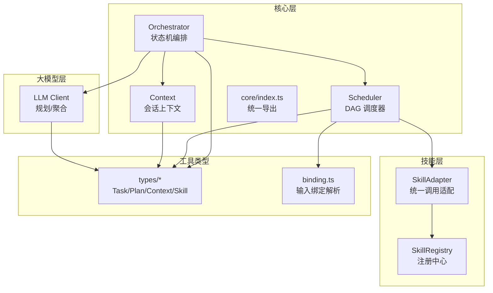
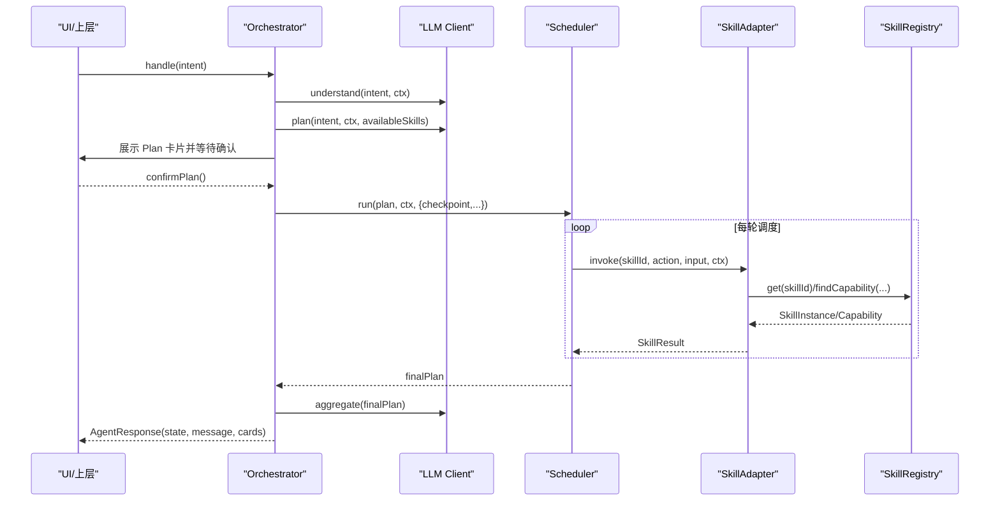
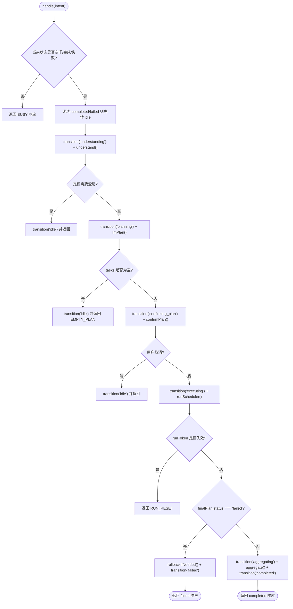
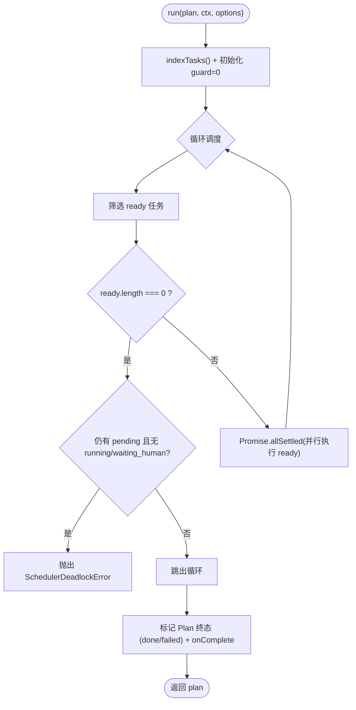
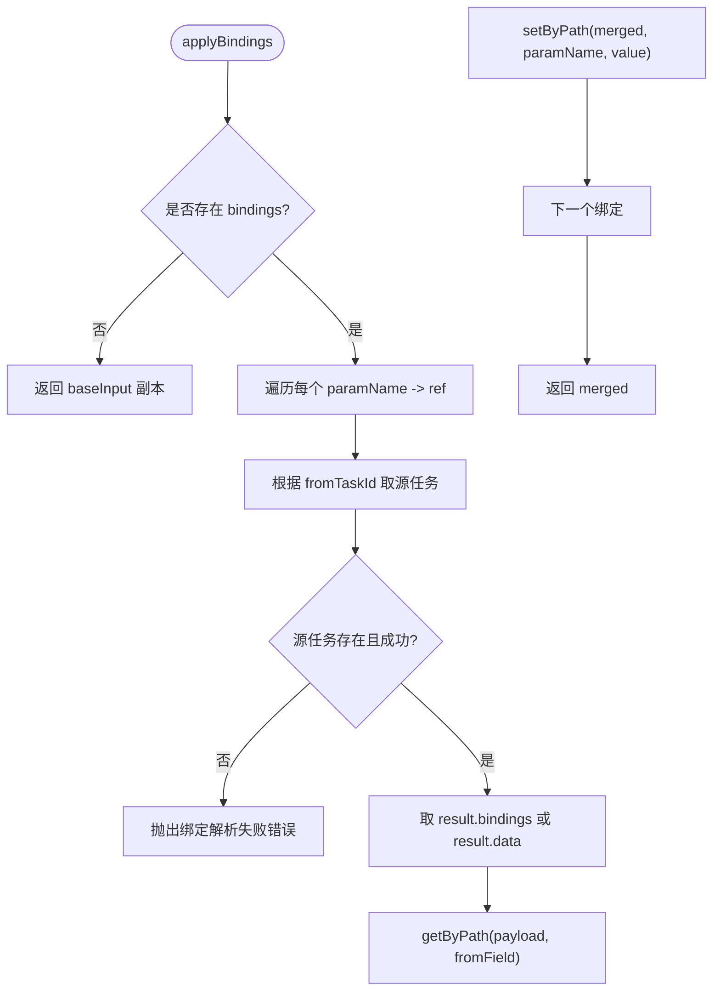
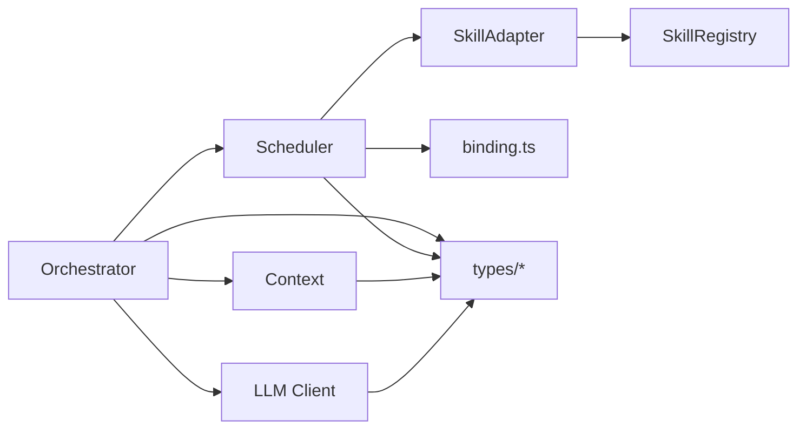

# 核心模块

<cite>
**本文引用的文件**   
- [orchestrator.ts](file://miniprogram/src/core/orchestrator.ts)
- [scheduler.ts](file://miniprogram/src/core/scheduler.ts)
- [context.ts](file://miniprogram/src/core/context.ts)
- [core/index.ts](file://miniprogram/src/core/index.ts)
- [agent-state.d.ts](file://miniprogram/src/types/agent-state.d.ts)
- [context.d.ts](file://miniprogram/src/types/context.d.ts)
- [task.d.ts](file://miniprogram/src/types/task.d.ts)
- [plan.d.ts](file://miniprogram/src/types/plan.d.ts)
- [checkpoint.d.ts](file://miniprogram/src/types/checkpoint.d.ts)
- [skill.d.ts](file://miniprogram/src/types/skill.d.ts)
- [adapter.ts](file://miniprogram/src/skills/adapter.ts)
- [registry.ts](file://miniprogram/src/skills/registry.ts)
- [client.ts](file://miniprogram/src/llm/client.ts)
- [binding.ts](file://miniprogram/src/utils/binding.ts)
</cite>

## 目录
1. [引言](#引言)
2. [项目结构](#项目结构)
3. [核心组件](#核心组件)
4. [架构总览](#架构总览)
5. [详细组件分析](#详细组件分析)
6. [依赖关系分析](#依赖关系分析)
7. [性能与优化建议](#性能与优化建议)
8. [故障排查指南](#故障排查指南)
9. [扩展与自定义指南](#扩展与自定义指南)
10. [结论](#结论)

## 引言
本文件面向 WAIC-WeChat-MiniProgram 的核心模块，聚焦以下三个关键子系统：
- Orchestrator 编排器：基于状态机的 Agent 生命周期管理、错误处理与回滚策略。
- Scheduler 调度器：DAG 任务执行引擎，负责依赖解析、并行执行、人类确认（Checkpoint）与死锁检测。
- Context 上下文系统：Agent 运行环境封装、会话信息、用户画像与追踪数据。

文档将提供架构图、时序图、流程图与类图，并给出 API 使用方式、模块间调用顺序、性能优化建议与最佳实践，帮助开发者快速理解并扩展该核心框架。

## 项目结构
核心代码位于 miniprogram/src/core 下，配合 types、skills、llm、utils 等子模块共同构成 Agent 运行时。



图表来源
- [orchestrator.ts:1-340](file://miniprogram/src/core/orchestrator.ts#L1-L340)
- [scheduler.ts:1-245](file://miniprogram/src/core/scheduler.ts#L1-L245)
- [context.ts:1-104](file://miniprogram/src/core/context.ts#L1-L104)
- [core/index.ts:1-7](file://miniprogram/src/core/index.ts#L1-L7)
- [registry.ts:1-91](file://miniprogram/src/skills/registry.ts#L1-L91)
- [adapter.ts:1-115](file://miniprogram/src/skills/adapter.ts#L1-L115)
- [client.ts:1-153](file://miniprogram/src/llm/client.ts#L1-L153)
- [binding.ts:1-50](file://miniprogram/src/utils/binding.ts#L1-L50)

章节来源
- [orchestrator.ts:1-340](file://miniprogram/src/core/orchestrator.ts#L1-L340)
- [scheduler.ts:1-245](file://miniprogram/src/core/scheduler.ts#L1-L245)
- [context.ts:1-104](file://miniprogram/src/core/context.ts#L1-L104)
- [core/index.ts:1-7](file://miniprogram/src/core/index.ts#L1-L7)

## 核心组件
- Orchestrator：对外入口 handle(intent, ctx) → AgentResponse；内部维护状态机、Plan 生命周期、失败回滚、并发令牌控制。
- Scheduler：run(plan, ctx, options) 实现 DAG 调度，支持并行执行、人类确认序列化、级联跳过、死锁检测。
- Context：buildContext(opts) 构造 AgentContext，注入 sessionId、userId、位置、全局变量、消息历史与追踪指标。

章节来源
- [orchestrator.ts:28-89](file://miniprogram/src/core/orchestrator.ts#L28-L89)
- [scheduler.ts:27-52](file://miniprogram/src/core/scheduler.ts#L27-L52)
- [context.ts:20-31](file://miniprogram/src/core/context.ts#L20-L31)

## 架构总览
整体调用链从 Orchestrator 开始，依次经过 LLM 规划、Plan 确认、Scheduler 执行、Skill 适配器调用，最终聚合结果返回给 UI。



图表来源
- [orchestrator.ts:106-256](file://miniprogram/src/core/orchestrator.ts#L106-L256)
- [client.ts:56-119](file://miniprogram/src/llm/client.ts#L56-L119)
- [scheduler.ts:77-128](file://miniprogram/src/core/scheduler.ts#L77-L128)
- [adapter.ts:37-85](file://miniprogram/src/skills/adapter.ts#L37-L85)
- [registry.ts:35-60](file://miniprogram/src/skills/registry.ts#L35-L60)

## 详细组件分析

### Orchestrator 编排器
- 状态机定义与转移：
  - 允许的状态转移表明确定义了各状态的合法后继状态，包括 idle、understanding、planning、confirming_plan、executing、awaiting_human、aggregating、completed、failed、rolling_back。
  - transition(next) 方法在每次状态变更时触发 onStateChange 回调，便于 UI 同步阶段提示。
- 生命周期管理：
  - handle(intent) 主流程：idle → understanding → planning → confirming_plan → executing → aggregating → completed。
  - 异常路径：LLM 错误、死锁、未知异常均进入 failed，并在必要时先执行回滚。
  - reset() 强制归位到 idle，并递增 runToken 使在途调度失效，防止并发双跑。
- 错误处理与回滚：
  - rollbackIfNeeded(plan) 按反序撤销“已成功且可逆”的任务，单点失败仅记录日志继续其余回滚。
  - 对 PlannerLLMError、SchedulerDeadlockError 进行区分处理，返回不同 errorCode。
- 并发安全：
  - runToken 机制确保 reset 或新一轮接管后，旧流程中止，避免弹窗交错与重复下单。



图表来源
- [orchestrator.ts:60-71](file://miniprogram/src/core/orchestrator.ts#L60-L71)
- [orchestrator.ts:106-256](file://miniprogram/src/core/orchestrator.ts#L106-L256)
- [orchestrator.ts:278-303](file://miniprogram/src/core/orchestrator.ts#L278-L303)

章节来源
- [orchestrator.ts:28-89](file://miniprogram/src/core/orchestrator.ts#L28-L89)
- [orchestrator.ts:106-256](file://miniprogram/src/core/orchestrator.ts#L106-L256)
- [orchestrator.ts:258-328](file://miniprogram/src/core/orchestrator.ts#L258-L328)
- [agent-state.d.ts:7-17](file://miniprogram/src/types/agent-state.d.ts#L7-L17)

### Scheduler 调度器
- DAG 执行引擎：
  - 每轮找出所有依赖已满足且 pending 的 Task，并行执行（Promise.allSettled），直到全部终态或检测到死锁。
  - isReady(t, taskIndex) 判断任务就绪条件：所有 dependsOn 前置任务均为 succeeded。
- 人类确认（Checkpoint）：
  - 对于 requiresHumanConfirm 的能力，任务进入 waiting_human 状态，通过 serializeCheckpoint 串行化确认弹窗，避免 wx.showModal 覆盖导致确认丢失。
  - checkpoint 期间检查 isRunActive，若 runToken 失效则中止并标记 skipped。
- 资源管理与错误处理：
  - failTask 标记任务失败并将 Plan 置为 failed。
  - cascadeSkip 递归将所有依赖失败任务的下游标记为 skipped。
  - abortRun 在 runToken 失效时将非终态任务标记为 skipped。
  - 死锁检测：当无 ready 任务且仍有 pending 任务但无人执行时抛出 SchedulerDeadlockError。



图表来源
- [scheduler.ts:77-128](file://miniprogram/src/core/scheduler.ts#L77-L128)
- [scheduler.ts:131-137](file://miniprogram/src/core/scheduler.ts#L131-L137)
- [scheduler.ts:140-204](file://miniprogram/src/core/scheduler.ts#L140-L204)
- [scheduler.ts:207-240](file://miniprogram/src/core/scheduler.ts#L207-L240)

章节来源
- [scheduler.ts:27-52](file://miniprogram/src/core/scheduler.ts#L27-L52)
- [scheduler.ts:77-128](file://miniprogram/src/core/scheduler.ts#L77-L128)
- [scheduler.ts:140-204](file://miniprogram/src/core/scheduler.ts#L140-L204)
- [scheduler.ts:207-240](file://miniprogram/src/core/scheduler.ts#L207-L240)

### Context 上下文系统
- buildContext(opts)：
  - 生成 sessionId，获取 userId（缓存 openid 或匿名），可选获取地理位置。
  - 构建 userProfile（location、preferences、history）、globals（cloudEnv 等）、messages（最近 20 条）、trace（llmCalls、skillCalls、totalTokens、startTime）。
- pushMessage(ctx, msg)：
  - 追加消息至 ctx.messages，限制长度防止内存膨胀。

```mermaid
classDiagram
class AgentContext {
+string sessionId
+string userId
+UserProfile userProfile
+Plan plan
+Record~string, unknown~ globals
+ChatMessage[] messages
+TraceInfo trace
}
class UserProfile {
+UserLocation location
+Record~string, unknown~ preferences
+{intent, timestamp}[] history
}
class UserLocation {
+number lat
+number lng
+string city
}
class TraceInfo {
+number llmCalls
+number skillCalls
+number totalTokens
+number startTime
}
AgentContext --> UserProfile : "包含"
UserProfile --> UserLocation : "可选包含"
AgentContext --> TraceInfo : "包含"
```

图表来源
- [context.d.ts:47-62](file://miniprogram/src/types/context.d.ts#L47-L62)
- [context.d.ts:11-44](file://miniprogram/src/types/context.d.ts#L11-L44)
- [context.ts:60-92](file://miniprogram/src/core/context.ts#L60-L92)

章节来源
- [context.ts:20-31](file://miniprogram/src/core/context.ts#L20-L31)
- [context.ts:60-92](file://miniprogram/src/core/context.ts#L60-L92)
- [context.ts:94-104](file://miniprogram/src/core/context.ts#L94-L104)
- [context.d.ts:47-62](file://miniprogram/src/types/context.d.ts#L47-L62)

### 数据流与绑定机制
- inputBindings 解析：
  - applyBindings(baseInput, bindings, taskIndex) 将上游 Task 的成功输出注入下游 Task 的 input，支持点号路径。
  - indexTasks(tasks) 构建任务索引 Map，加速查找。
- 绑定失败处理：
  - 若来源任务未完成或失败，抛出错误并级联跳过下游任务。



图表来源
- [binding.ts:18-43](file://miniprogram/src/utils/binding.ts#L18-L43)
- [binding.ts:45-50](file://miniprogram/src/utils/binding.ts#L45-L50)

章节来源
- [binding.ts:18-43](file://miniprogram/src/utils/binding.ts#L18-L43)
- [binding.ts:45-50](file://miniprogram/src/utils/binding.ts#L45-L50)

## 依赖关系分析
- 单向依赖约束：
  - core 不得反向依赖 interaction（由上層注入 confirmPlan / checkpoint）。
  - llm 层不得反向依赖 skills（availableSkills 由 core 传入）。
- 组件耦合：
  - Orchestrator 依赖 LLM Client、Scheduler、SkillAdapter、SkillRegistry。
  - Scheduler 依赖 SkillAdapter、Binding 工具、Checkpoint 协议。
  - Context 依赖身份服务、时间工具、ID 生成器。



图表来源
- [orchestrator.ts:13-26](file://miniprogram/src/core/orchestrator.ts#L13-L26)
- [scheduler.ts:18-25](file://miniprogram/src/core/scheduler.ts#L18-L25)
- [context.ts:14-18](file://miniprogram/src/core/context.ts#L14-L18)
- [client.ts:9-18](file://miniprogram/src/llm/client.ts#L9-L18)

章节来源
- [orchestrator.ts:13-26](file://miniprogram/src/core/orchestrator.ts#L13-L26)
- [scheduler.ts:18-25](file://miniprogram/src/core/scheduler.ts#L18-L25)
- [context.ts:14-18](file://miniprogram/src/core/context.ts#L14-L18)
- [client.ts:9-18](file://miniprogram/src/llm/client.ts#L9-L18)

## 性能与优化建议
- 并行执行：
  - Scheduler 使用 Promise.allSettled 并行执行 ready 任务，提升吞吐。
  - 合理设置 estimatedLatencyMs 以优化排程估算。
- 人类确认序列化：
  - serializeCheckpoint 保证同一时刻仅一个确认弹窗，避免 UI 覆盖与确认丢失。
- Token 消耗控制：
  - SkillRegistry.listSlim() 向 LLM 传递精简元信息，降低 token 消耗。
- 内存管理：
  - pushMessage 限制消息历史长度为 20，防止内存膨胀。
- 降级策略：
  - LLM 不可用时在开发环境降级为本地规则式规划器，保证全链路演示可用。

[本节为通用性能讨论，不直接分析具体文件]

## 故障排查指南
- BUSY 状态：
  - 当 Orchestrator 非 idle/completed/failed 时，handle 返回 BUSY，需等待当前任务完成。
- EMPTY_PLAN：
  - LLM 无法识别意图时返回空 tasks，应引导用户换种说法。
- LLM_ERROR：
  - LLM 调用失败或解析失败，返回 LLM_ERROR，检查网络与配置。
- DEADLOCK：
  - Scheduler 检测到死锁（pending 任务无法推进），提示重新描述意图。
- RUN_RESET：
  - 执行期间被 reset，丢弃本轮后续流程，注意可能存在的已成功写操作。
- SKILL_NOT_FOUND / CAPABILITY_NOT_FOUND：
  - Skill 未注册或不支持 action，检查注册与能力声明。
- INVALID_INPUT：
  - 入参校验失败，检查 JSON Schema 与输入数据。

章节来源
- [orchestrator.ts:106-114](file://miniprogram/src/core/orchestrator.ts#L106-L114)
- [orchestrator.ts:138-146](file://miniprogram/src/core/orchestrator.ts#L138-L146)
- [orchestrator.ts:237-254](file://miniprogram/src/core/orchestrator.ts#L237-L254)
- [scheduler.ts:103-111](file://miniprogram/src/core/scheduler.ts#L103-L111)
- [adapter.ts:44-68](file://miniprogram/src/skills/adapter.ts#L44-L68)

## 扩展与自定义指南
- 注册新 Skill：
  - 实现 SkillInstance 接口，包含 meta（id、name、description、capabilities 等）与 invoke/rollback 方法。
  - 通过 SkillRegistry.register(instance) 注册，确保 id 唯一。
- 定义 Capability：
  - 在 capabilities 中声明 action、description、inputSchema、outputSchema、requiresHumanConfirm、reversible 等属性。
  - 所有写操作必须设置 requiresHumanConfirm=true。
- 集成 Checkpoint：
  - 在上层组装时注入 confirmPlan 与 checkpoint 回调，实现 UI 交互与业务确认逻辑。
- 使用 handleOnce：
  - 便捷工厂函数，一次性构建 Context 与 Orchestrator，适合单次对话场景。

章节来源
- [registry.ts:16-33](file://miniprogram/src/skills/registry.ts#L16-L33)
- [skill.d.ts:16-58](file://miniprogram/src/types/skill.d.ts#L16-L58)
- [checkpoint.d.ts:17-44](file://miniprogram/src/types/checkpoint.d.ts#L17-L44)
- [orchestrator.ts:331-340](file://miniprogram/src/core/orchestrator.ts#L331-L340)

## 结论
WAIC-WeChat-MiniProgram 的核心模块通过 Orchestrator、Scheduler 与 Context 构建了完整的 Agent 运行时：
- Orchestrator 提供稳健的状态机与生命周期管理，结合回滚机制确保一致性。
- Scheduler 实现高效的 DAG 执行引擎，支持并行、人类确认与死锁检测。
- Context 封装会话环境与追踪数据，为多轮对话与分析提供基础。

开发者可通过注册 Skill、定义 Capability、注入 Checkpoint 等方式扩展系统，遵循单向依赖约束与最佳实践，构建可扩展、可维护的智能小程序应用。