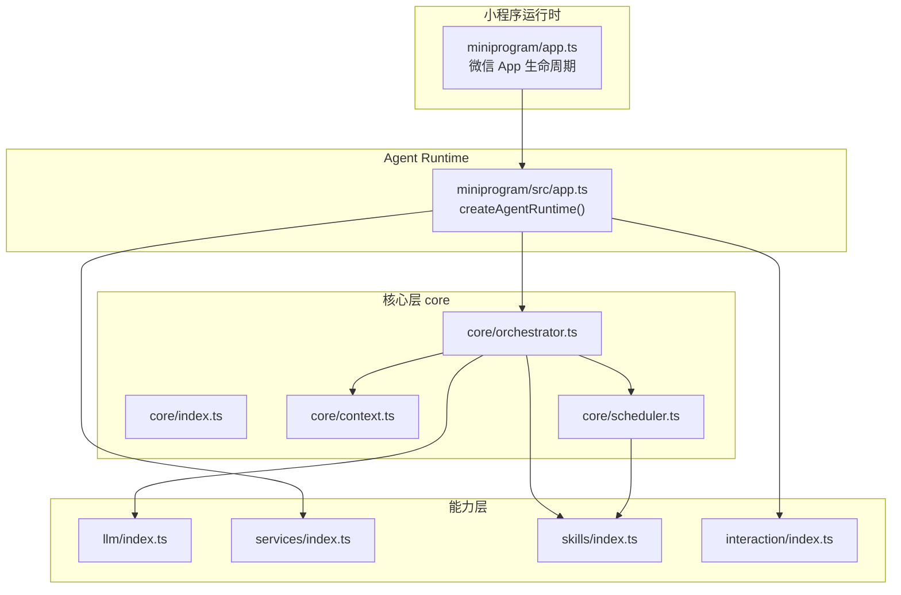
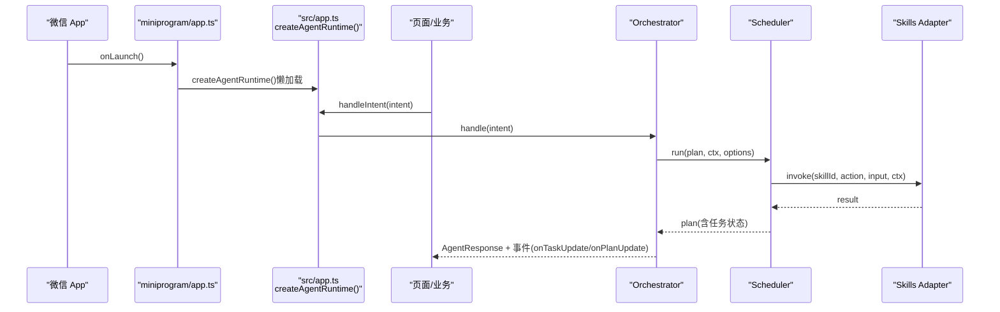
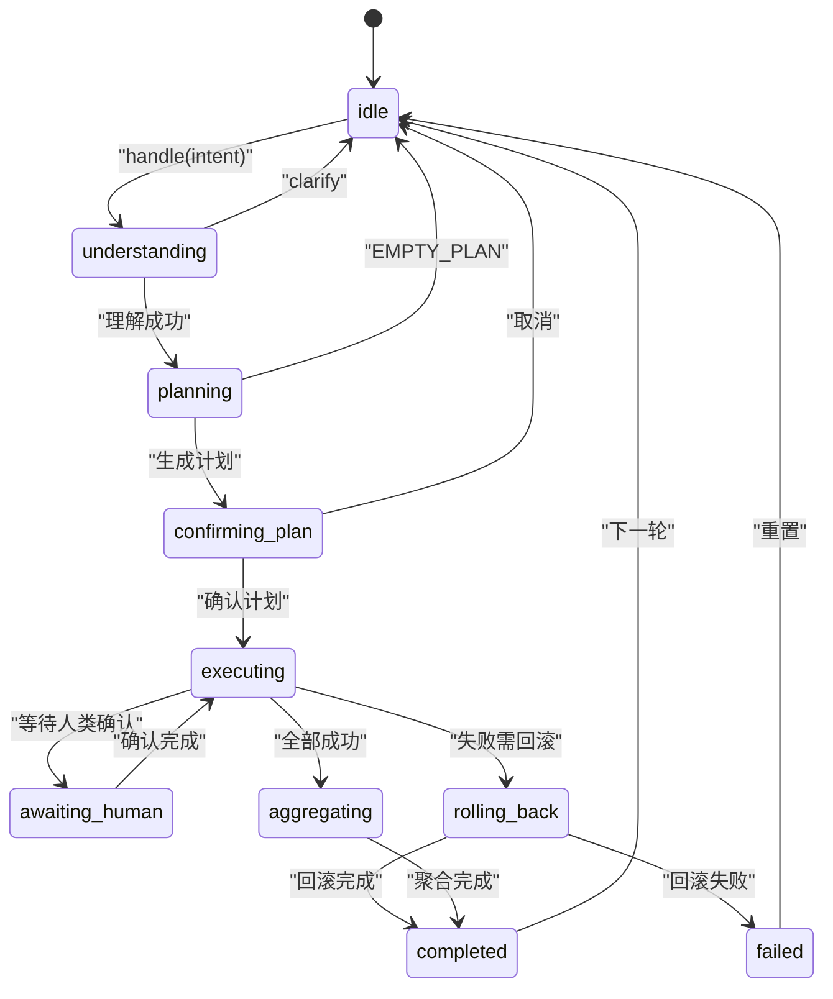
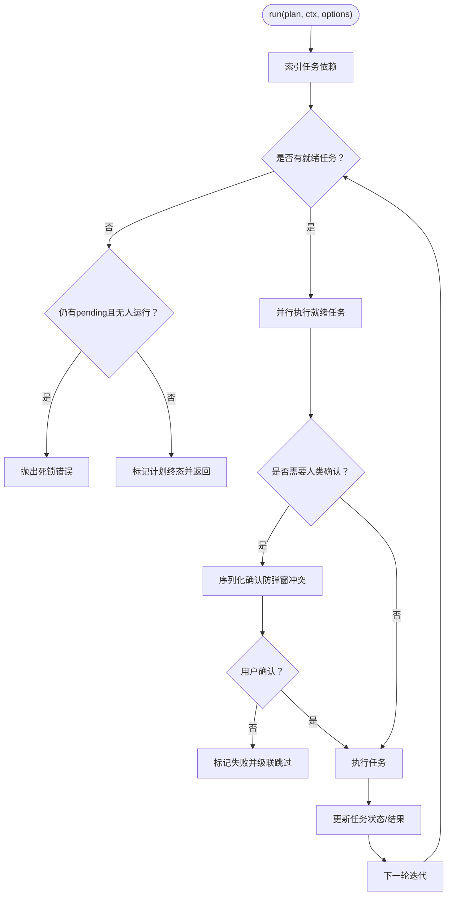
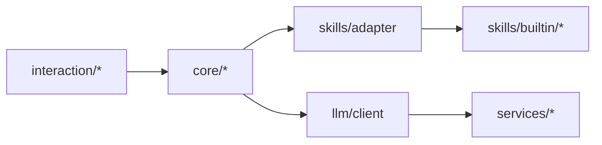

# 核心模块入口

<cite>
**本文引用的文件**   
- [miniprogram/src/core/index.ts](file://miniprogram/src/core/index.ts)
- [miniprogram/src/core/context.ts](file://miniprogram/src/core/context.ts)
- [miniprogram/src/core/scheduler.ts](file://miniprogram/src/core/scheduler.ts)
- [miniprogram/src/core/orchestrator.ts](file://miniprogram/src/core/orchestrator.ts)
- [miniprogram/app.ts](file://miniprogram/app.ts)
- [miniprogram/src/app.ts](file://miniprogram/src/app.ts)
- [miniprogram/src/interaction/index.ts](file://miniprogram/src/interaction/index.ts)
- [miniprogram/src/llm/index.ts](file://miniprogram/src/llm/index.ts)
- [miniprogram/src/services/index.ts](file://miniprogram/src/services/index.ts)
- [miniprogram/src/skills/index.ts](file://miniprogram/src/skills/index.ts)
</cite>

## 目录
1. [引言](#引言)
2. [项目结构](#项目结构)
3. [核心组件](#核心组件)
4. [架构总览](#架构总览)
5. [详细组件分析](#详细组件分析)
6. [依赖关系分析](#依赖关系分析)
7. [性能与并发特性](#性能与并发特性)
8. [配置选项与扩展点](#配置选项与扩展点)
9. [集成示例与最佳实践](#集成示例与最佳实践)
10. [版本兼容性与迁移指南](#版本兼容性与迁移指南)
11. [故障排查](#故障排查)
12. [结论](#结论)

## 引言
本文面向“核心模块入口”，聚焦微信小程序工程中的 Agent Runtime 与 Orchestrator 编排层，解释对外导出的结构与公共 API、初始化流程与依赖注入机制、子模块间的依赖关系与调用顺序，并提供集成示例、配置说明、兼容性建议与常见问题解决方案。读者无需深入源码即可理解如何正确导入和使用核心模块，以及如何扩展技能与交互能力。

## 项目结构
本仓库采用分层组织：
- miniprogram/app.ts：微信运行时 App 生命周期入口，负责品牌信息注入与懒加载 Agent Runtime。
- miniprogram/src/app.ts：Agent Runtime 工厂，注册内置 SKILL、初始化云服务、构造 Orchestrator 并暴露 handleIntent / resetAgent / getState 等接口。
- miniprogram/src/core/*：核心编排层（上下文、调度器、编排器）。
- miniprogram/src/llm/*：大模型客户端、解析器与规划器。
- miniprogram/src/interaction/*：用户确认、语音、卡片渲染等交互能力。
- miniprogram/src/services/*：云开发、存储、LLM、支付、身份等服务。
- miniprogram/src/skills/*：技能注册表与适配器，以及内置技能实现。
- miniprogram/src/types/*：类型定义。
- miniprogram/src/utils/*：工具函数（日志、ID 生成、时间、重试、校验等）。

图表来源
- [miniprogram/app.ts:16-48](file://miniprogram/app.ts#L16-L48)
- [miniprogram/src/app.ts:21-36](file://miniprogram/src/app.ts#L21-L36)
- [miniprogram/src/core/orchestrator.ts:13-26](file://miniprogram/src/core/orchestrator.ts#L13-L26)
- [miniprogram/src/core/scheduler.ts:18-26](file://miniprogram/src/core/scheduler.ts#L18-L26)

章节来源
- [miniprogram/app.ts:1-49](file://miniprogram/app.ts#L1-L49)
- [miniprogram/src/app.ts:1-178](file://miniprogram/src/app.ts#L1-L178)

## 核心组件
- 核心模块统一入口：导出 context、scheduler、orchestrator，供上层组合使用。
- Orchestrator：状态机驱动的编排器，负责意图理解、计划生成、计划确认、任务执行、结果聚合与回滚。
- Scheduler：DAG 调度器，按依赖并行执行任务，支持人类确认 checkpoint、死锁检测与级联跳过。
- Context：构建 AgentContext，注入 sessionId、userId、位置、globals、trace 等。

对外暴露的类与函数（核心层）
- Orchestrator 类：handle(intent)、reset()、getState()、getCurrentPlan()；便捷函数 handleOnce(intent, ctxOpts, options)。
- buildContext(opts)：构造 AgentContext。
- pushMessage(ctx, msg)：追加消息到上下文记忆。
- run(plan, ctx, options)：调度执行 Plan。
- filterTasks(plan, status)：按状态过滤任务。

章节来源
- [miniprogram/src/core/index.ts:1-7](file://miniprogram/src/core/index.ts#L1-L7)
- [miniprogram/src/core/orchestrator.ts:28-48](file://miniprogram/src/core/orchestrator.ts#L28-L48)
- [miniprogram/src/core/orchestrator.ts:74-99](file://miniprogram/src/core/orchestrator.ts#L74-L99)
- [miniprogram/src/core/orchestrator.ts:106-256](file://miniprogram/src/core/orchestrator.ts#L106-L256)
- [miniprogram/src/core/orchestrator.ts:331-340](file://miniprogram/src/core/orchestrator.ts#L331-L340)
- [miniprogram/src/core/scheduler.ts:27-52](file://miniprogram/src/core/scheduler.ts#L27-L52)
- [miniprogram/src/core/scheduler.ts:77-128](file://miniprogram/src/core/scheduler.ts#L77-L128)
- [miniprogram/src/core/scheduler.ts:243-245](file://miniprogram/src/core/scheduler.ts#L243-L245)
- [miniprogram/src/core/context.ts:20-31](file://miniprogram/src/core/context.ts#L20-L31)
- [miniprogram/src/core/context.ts:60-92](file://miniprogram/src/core/context.ts#L60-L92)
- [miniprogram/src/core/context.ts:94-104](file://miniprogram/src/core/context.ts#L94-L104)

## 架构总览
整体调用链从微信 App 启动开始，懒加载创建 Agent Runtime，再由页面或业务逻辑调用 handleIntent，进入 Orchestrator 的状态机流转，最终由 Scheduler 驱动 DAG 任务执行，并通过 skills adapter 调用具体技能。

图表来源
- [miniprogram/app.ts:23-48](file://miniprogram/app.ts#L23-L48)
- [miniprogram/src/app.ts:90-177](file://miniprogram/src/app.ts#L90-L177)
- [miniprogram/src/core/orchestrator.ts:106-256](file://miniprogram/src/core/orchestrator.ts#L106-L256)
- [miniprogram/src/core/scheduler.ts:77-128](file://miniprogram/src/core/scheduler.ts#L77-L128)

## 详细组件分析

### Orchestrator 编排器
职责
- 维护状态机（idle → understanding → planning → confirming_plan → executing → aggregating → completed/failed）。
- 协调 LLM 理解与规划、计划确认、任务执行、失败回滚与结果聚合。
- 通过回调向 UI 推送状态变化、任务更新与计划更新。

关键接口
- handle(intent): Promise<AgentResponse>
- reset(): void
- getState(): AgentState
- getCurrentPlan(): Plan | undefined
- handleOnce(intent, ctxOpts, options): Promise<AgentResponse>

状态转移约束
- 仅允许 ALLOWED_TRANSITIONS 中定义的转移路径；非法转移会记录告警但不中断（MVP 宽松模式）。

并发安全
- 使用 runToken 防止 reset 后旧流程继续执行，避免重复弹窗与并发双跑。

错误处理
- PlannerLLMError → failed（LLM_ERROR）
- SchedulerDeadlockError → failed（DEADLOCK）
- 其他异常 → failed（UNEXPECTED）
- 失败时尝试对可逆已成功任务进行反序回滚。

图表来源
- [miniprogram/src/core/orchestrator.ts:60-71](file://miniprogram/src/core/orchestrator.ts#L60-L71)
- [miniprogram/src/core/orchestrator.ts:106-256](file://miniprogram/src/core/orchestrator.ts#L106-L256)
- [miniprogram/src/core/orchestrator.ts:278-303](file://miniprogram/src/core/orchestrator.ts#L278-L303)

章节来源
- [miniprogram/src/core/orchestrator.ts:1-340](file://miniprogram/src/core/orchestrator.ts#L1-L340)

### Scheduler 调度器
职责
- 按 Task 依赖图（DAG）逐轮找出就绪任务并并行执行。
- 对需要人类确认的写操作进行序列化确认（checkpoint），避免弹窗冲突。
- 死锁检测：当无就绪任务且仍有 pending 任务时抛出 SchedulerDeadlockError。
- 失败级联：上游失败导致下游 pending 任务标记为 skipped。

关键接口
- run(plan, ctx, options): Promise<Plan>
- filterTasks(plan, status): Task[]

选项
- checkpoint：写入操作的确认回调（必填）。
- onTaskUpdate：任务状态更新回调。
- onComplete：计划完成回调。
- isRunActive：当前执行是否仍有效（runToken 探測）。

图表来源
- [miniprogram/src/core/scheduler.ts:77-128](file://miniprogram/src/core/scheduler.ts#L77-L128)
- [miniprogram/src/core/scheduler.ts:139-204](file://miniprogram/src/core/scheduler.ts#L139-L204)
- [miniprogram/src/core/scheduler.ts:229-240](file://miniprogram/src/core/scheduler.ts#L229-L240)

章节来源
- [miniprogram/src/core/scheduler.ts:1-245](file://miniprogram/src/core/scheduler.ts#L1-L245)

### Context 上下文构造
职责
- 生成 sessionId、获取 userId（缓存或匿名）、可选获取地理位置、注入 globals 与 trace。
- 提供 pushMessage 将用户消息追加到上下文记忆（限制最近 20 条）。

关键接口
- buildContext(opts): Promise<AgentContext>
- pushMessage(ctx, msg): void

选项
- sessionId：测试用固定会话 ID。
- userId：测试或已登录用户 ID。
- cloudEnv：云端环境 ID（必填）。
- withLocation：是否尝试获取位置（默认 true）。
- globals：自定义全局变量。

章节来源
- [miniprogram/src/core/context.ts:1-104](file://miniprogram/src/core/context.ts#L1-L104)

## 依赖关系分析
依赖方向遵循单不可逆原则：interaction → core → skills → llm。
- core 不反向依赖 interaction 或 skills 的具体实现，仅通过 types/checkpoint 与 skills/adapter 抽象接口协作。
- Orchestrator 通过 SkillRegistry.listSlim() 向 LLM 提供可用技能清单，避免 LLM 层反向依赖 skills。
- Scheduler 通过 skills/adapter 调用具体技能，屏蔽底层差异。

图表来源
- [miniprogram/src/core/orchestrator.ts:13-26](file://miniprogram/src/core/orchestrator.ts#L13-L26)
- [miniprogram/src/core/scheduler.ts:18-26](file://miniprogram/src/core/scheduler.ts#L18-L26)
- [miniprogram/src/app.ts:21-36](file://miniprogram/src/app.ts#L21-L36)

章节来源
- [miniprogram/src/app.ts:1-178](file://miniprogram/src/app.ts#L1-L178)
- [miniprogram/src/core/orchestrator.ts:1-340](file://miniprogram/src/core/orchestrator.ts#L1-L340)
- [miniprogram/src/core/scheduler.ts:1-245](file://miniprogram/src/core/scheduler.ts#L1-L245)

## 性能与并发特性
- Orchestrator 使用状态机守卫 BUSY，避免在途请求被新请求打断。
- Scheduler 使用 Promise.allSettled 并行执行就绪任务，提升吞吐。
- checkpoint 使用模块级 Promise 链串行化，避免 wx.showModal 并发导致的弹窗覆盖与结果丢失。
- runToken 机制确保 reset 后旧流程中止，防止重复弹窗与重复下单。
- onLaunch 保持轻量，Agent Runtime 懒加载，减少首屏耗时。

[本节为通用性能讨论，不直接分析具体文件]

## 配置选项与扩展点

### OrchestratorOptions
- confirmPlan：计划确认回调（必填）。
- checkpoint：单步写操作确认回调（必填）。
- autoConfirm：是否自动确认计划（测试用，默认 false）。
- autoApproveCheckpoint：是否自动同意所有 checkpoint（测试用，默认 false）。
- onTaskUpdate：任务更新回调。
- onPlanUpdate：计划更新回调。
- onStateChange：状态机转移回调。

章节来源
- [miniprogram/src/core/orchestrator.ts:28-48](file://miniprogram/src/core/orchestrator.ts#L28-L48)

### BuildContextOptions
- sessionId：固定会话 ID（测试用）。
- userId：强制用户 ID（测试/已登录）。
- cloudEnv：云端环境 ID（必填）。
- withLocation：是否获取位置（默认 true）。
- globals：自定义全局变量。

章节来源
- [miniprogram/src/core/context.ts:20-31](file://miniprogram/src/core/context.ts#L20-L31)

### 扩展点
- 技能注册：通过 SkillRegistry.register(...) 注册新的 SKILL（如 train-12306、coffee-starbucks、payment-aicard）。
- 交互能力：通过 confirmPlan 与 awaitCheckpoint 注入用户确认流程。
- 云服务：ensureCloudInit(cloudEnv) 初始化云开发环境。
- 事件订阅：AgentRuntime.subscribe(events) 订阅状态、任务与计划事件。

章节来源
- [miniprogram/src/app.ts:71-76](file://miniprogram/src/app.ts#L71-L76)
- [miniprogram/src/app.ts:90-177](file://miniprogram/src/app.ts#L90-L177)

## 集成示例与最佳实践

### 导入与使用核心模块
- 从核心模块统一入口导入：
  - 导入 Orchestrator、buildContext、pushMessage、run、filterTasks 等。
- 从 Agent Runtime 工厂获取对外接口：
  - 调用 createAgentRuntime(cloudEnv) 获取 runtime 实例。
  - 使用 runtime.handleIntent(intent) 处理用户意图。
  - 使用 runtime.resetAgent() 重置当前计划。
  - 使用 runtime.getState() 与 runtime.getCurrentPlan() 查询状态与计划。
  - 使用 runtime.subscribe({ onStateChange, onTaskUpdate, onPlanUpdate }) 订阅事件。

章节来源
- [miniprogram/src/core/index.ts:1-7](file://miniprogram/src/core/index.ts#L1-L7)
- [miniprogram/src/app.ts:90-177](file://miniprogram/src/app.ts#L90-L177)

### 初始化流程与依赖注入
- 微信 App 启动时（onLaunch）打印品牌信息，并懒加载 createAgentRuntime。
- createAgentRuntime 内部：
  - 确保 SKILL 已注册（train-12306、starbucks、aiCard）。
  - 初始化云服务 ensureCloudInit(cloudEnv)。
  - 首次访问时构建 Orchestrator，注入 confirmPlan 与 awaitCheckpoint。
  - 暴露 handleIntent / resetAgent / getState / getCurrentPlan / subscribe。

章节来源
- [miniprogram/app.ts:23-48](file://miniprogram/app.ts#L23-L48)
- [miniprogram/src/app.ts:71-121](file://miniprogram/src/app.ts#L71-L121)

### 调用顺序与时序
- 页面或业务逻辑调用 runtime.handleIntent(intent)。
- Orchestrator.handle(intent) 依次经历：understanding → planning → confirming_plan → executing → aggregating → completed/failed。
- Scheduler.run(plan, ctx, options) 并行执行就绪任务，必要时触发 checkpoint 确认。
- 事件通过 onTaskUpdate / onPlanUpdate / onStateChange 推送到 UI。

章节来源
- [miniprogram/src/core/orchestrator.ts:106-256](file://miniprogram/src/core/orchestrator.ts#L106-L256)
- [miniprogram/src/core/scheduler.ts:77-128](file://miniprogram/src/core/scheduler.ts#L77-L128)

### 最佳实践
- 始终通过 createAgentRuntime 获取唯一实例，避免多实例导致状态分裂。
- 在页面卸载时取消事件订阅，避免内存泄漏。
- 对于写操作，务必实现 checkpoint 回调以保障人类确认。
- 使用 autoConfirm/autoApproveCheckpoint 仅在测试环境启用。
- 合理设置 cloudEnv，并确保云服务初始化成功。

[本节为通用实践指导，不直接分析具体文件]

## 版本兼容性与迁移指南

### 版本兼容性
- 当前设计基于微信小程序运行时与 CloudBase 云服务。
- 若升级基础库或云服务 SDK，请确保：
  - getLocation 等原生 API 行为一致。
  - CloudBase 初始化参数与权限配置不变。
  - 技能适配器与 LLM 客户端接口兼容。

### 迁移指南
- 从旧版 Orchestrator 迁移：
  - 将 confirmPlan 与 checkpoint 回调迁移至新的 OrchestratorOptions。
  - 将事件监听迁移至 AgentRuntime.subscribe。
- 新增技能：
  - 在 skills/builtin 下实现新技能 index.ts。
  - 在 src/app.ts 中注册新技能实例。
  - 确保 getCapability 与 adapter.invoke/rollback 兼容。

章节来源
- [miniprogram/src/app.ts:21-36](file://miniprogram/src/app.ts#L21-L36)
- [miniprogram/src/app.ts:71-76](file://miniprogram/src/app.ts#L71-L76)
- [miniprogram/src/core/orchestrator.ts:28-48](file://miniprogram/src/core/orchestrator.ts#L28-L48)

## 故障排查

### 常见错误与定位
- 死锁（DEADLOCK）
  - 现象：Scheduler 抛出 SchedulerDeadlockError。
  - 原因：存在循环依赖或任务依赖无法满足。
  - 解决：检查任务 dependsOn 与 capability.requiresHumanConfirm 配置。
- 空计划（EMPTY_PLAN）
  - 现象：LLM 返回空 tasks。
  - 原因：意图无法识别或技能未注册。
  - 解决：补充技能注册或优化提示词。
- 弹窗冲突
  - 现象：多个写操作同时弹出确认框。
  - 原因：checkpoint 未序列化。
  - 解决：使用 Scheduler 提供的 checkpoint 序列化机制。
- 并发双跑
  - 现象：reset 后旧流程仍在执行。
  - 原因：runToken 失效未被探测。
  - 解决：确保 isRunActive 与 runToken 同步。

章节来源
- [miniprogram/src/core/scheduler.ts:47-52](file://miniprogram/src/core/scheduler.ts#L47-L52)
- [miniprogram/src/core/scheduler.ts:102-114](file://miniprogram/src/core/scheduler.ts#L102-L114)
- [miniprogram/src/core/orchestrator.ts:234-254](file://miniprogram/src/core/orchestrator.ts#L234-L254)

## 结论
核心模块入口通过 Orchestrator 与 Scheduler 实现了稳定的意图理解、计划生成、任务调度与结果聚合，配合 Agent Runtime 工厂提供了统一的对外 API。依赖方向严格单向，便于扩展与维护。开发者可通过注册技能、注入交互回调与订阅事件，快速集成到小程序业务中。建议在测试环境启用自动确认以提升效率，在生产环境保留人类确认以确保数据安全与用户体验。