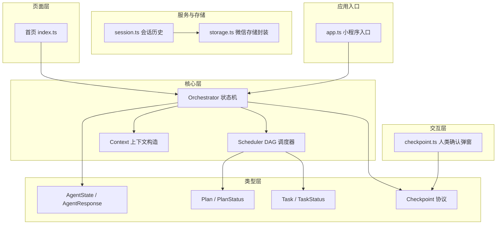
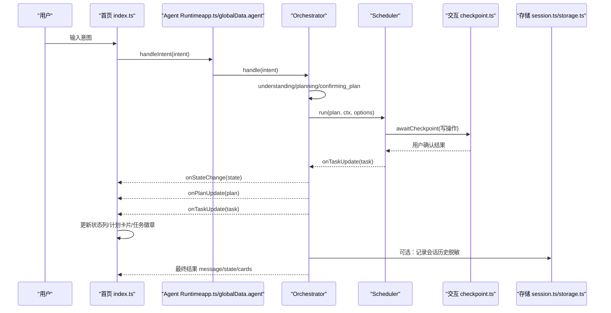
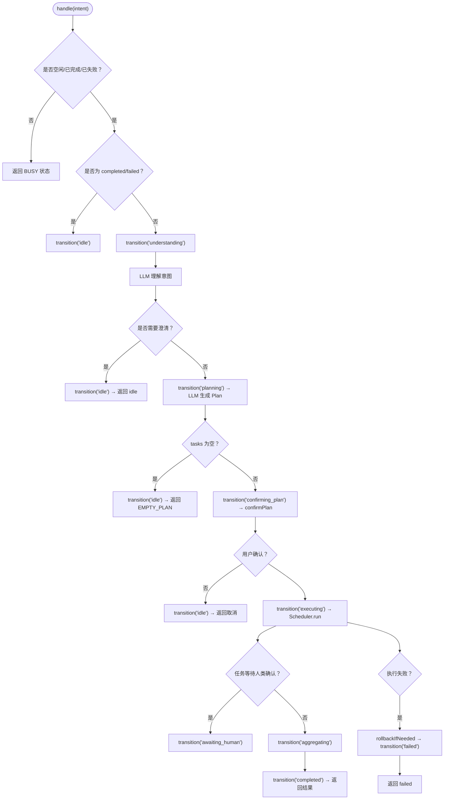
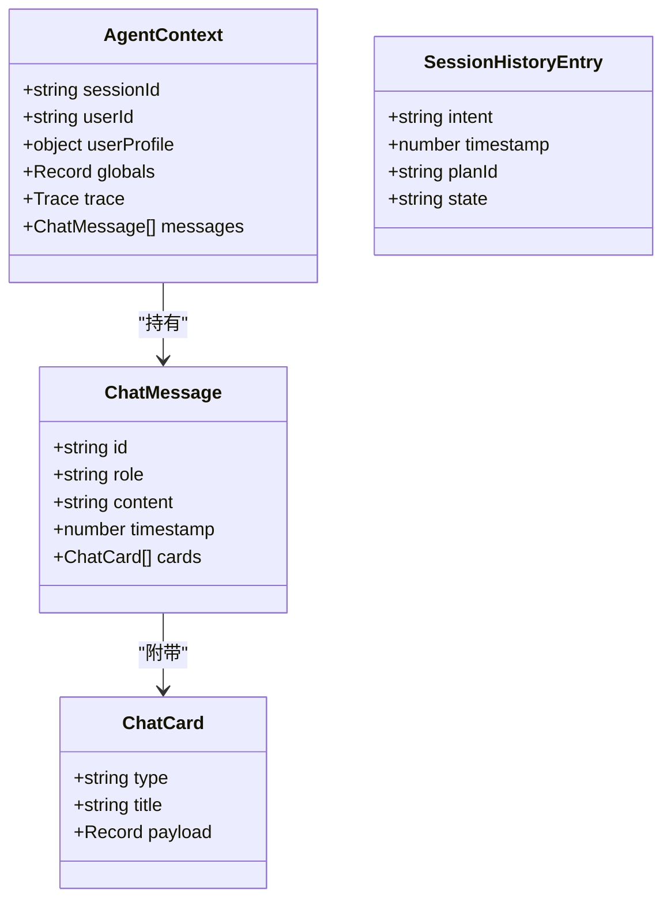
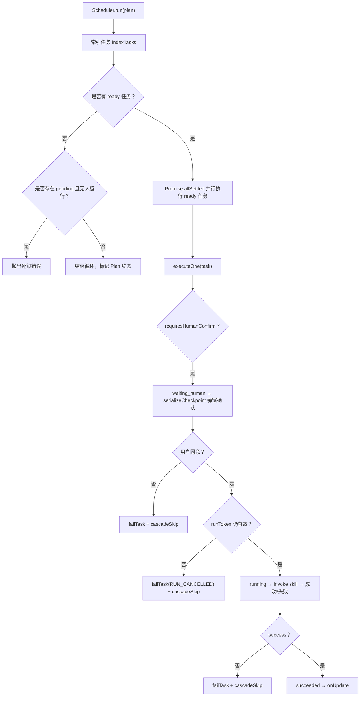
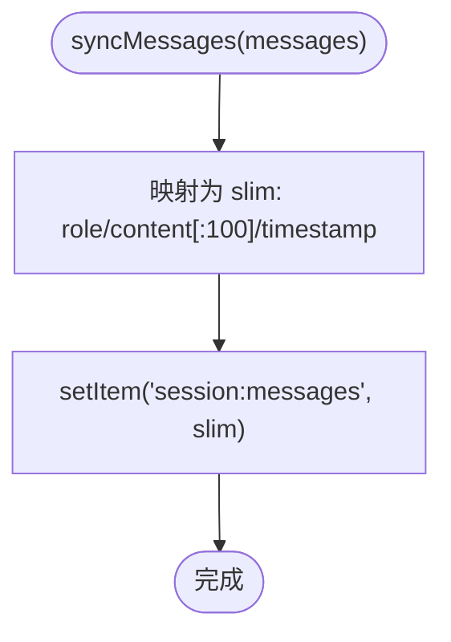
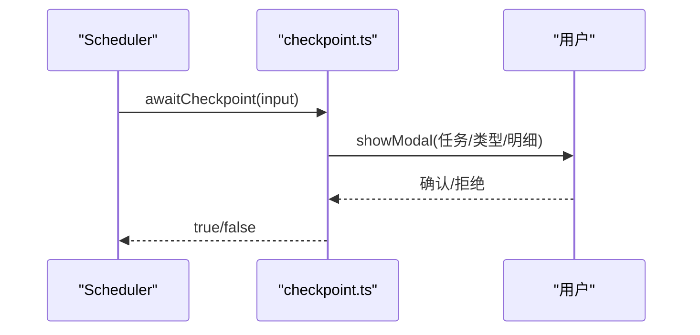
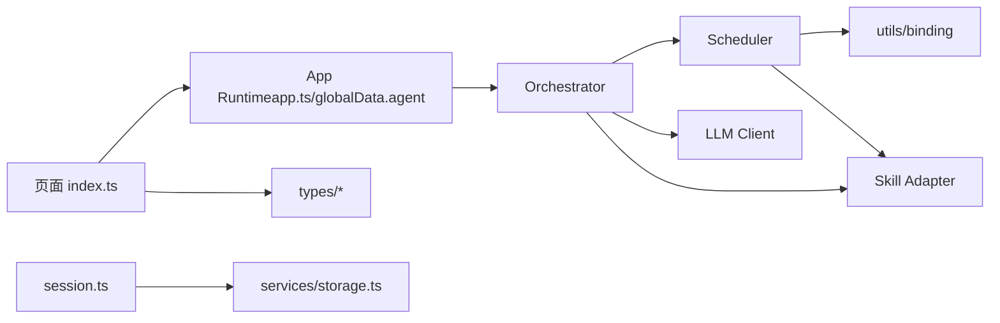

# UI状态管理

<cite>
**本文引用的文件**   
- [orchestrator.ts](file://miniprogram/src/core/orchestrator.ts)
- [scheduler.ts](file://miniprogram/src/core/scheduler.ts)
- [agent-state.d.ts](file://miniprogram/src/types/agent-state.d.ts)
- [plan.d.ts](file://miniprogram/src/types/plan.d.ts)
- [task.d.ts](file://miniprogram/src/types/task.d.ts)
- [checkpoint.d.ts](file://miniprogram/src/types/checkpoint.d.ts)
- [context.ts](file://miniprogram/src/core/context.ts)
- [session.ts](file://miniprogram/src/storage/session.ts)
- [storage.ts](file://miniprogram/src/services/storage.ts)
- [index.ts（首页）](file://miniprogram/pages/index/index.ts)
- [checkpoint.ts（人类确认交互）](file://miniprogram/src/interaction/checkpoint.ts)
- [app.ts（小程序入口）](file://miniprogram/app.ts)
</cite>

## 目录
1. [引言](#引言)
2. [项目结构](#项目结构)
3. [核心组件](#核心组件)
4. [架构总览](#架构总览)
5. [详细组件分析](#详细组件分析)
6. [依赖关系分析](#依赖关系分析)
7. [性能与内存优化](#性能与内存优化)
8. [故障排查指南](#故障排查指南)
9. [结论](#结论)

## 引言
本文面向 WAIC-WeChat-MiniProgram 的 UI 状态管理，重点说明：
- Agent 状态机与 UI 状态的同步机制、状态转换规则与界面更新策略。
- 消息状态管理与对话历史的数据结构、实时更新机制。
- 任务进度状态处理，包括 DAG 任务执行状态的 UI 映射。
- 状态持久化方案，包括本地存储与会话管理。
- 异步状态更新与竞态条件处理，确保 UI 一致性与响应性。
- 最佳实践与性能优化建议。

## 项目结构
本项目在 miniprogram 目录下组织为“页面 + 核心引擎 + 类型定义 + 服务/存储 + 交互层”的分层结构：
- 页面层：首页 index.ts 订阅运行时事件，驱动 WXML/WXSS 渲染。
- 核心层：Orchestrator 负责 Agent 状态机；Scheduler 负责 DAG 调度。
- 类型层：统一声明 AgentState、Plan、Task、Checkpoint 等关键类型。
- 服务/存储层：封装微信 storage、会话历史脱敏持久化。
- 交互层：提供 Plan 确认与单步写操作确认的人类在环流程。
- 应用入口：小程序 app.ts 懒加载 Agent Runtime，注入全局上下文。

图表来源
- [index.ts（首页）:117-152](file://miniprogram/pages/index/index.ts#L117-L152)
- [orchestrator.ts:74-89](file://miniprogram/src/core/orchestrator.ts#L74-L89)
- [scheduler.ts:77-128](file://miniprogram/src/core/scheduler.ts#L77-L128)
- [context.ts:60-91](file://miniprogram/src/core/context.ts#L60-L91)
- [agent-state.d.ts:7-47](file://miniprogram/src/types/agent-state.d.ts#L7-L47)
- [plan.d.ts:12-33](file://miniprogram/src/types/plan.d.ts#L12-L33)
- [task.d.ts:11-59](file://miniprogram/src/types/task.d.ts#L11-L59)
- [checkpoint.d.ts:17-43](file://miniprogram/src/types/checkpoint.d.ts#L17-L43)
- [storage.ts:12-34](file://miniprogram/src/services/storage.ts#L12-L34)
- [session.ts:24-47](file://miniprogram/src/storage/session.ts#L24-L47)
- [checkpoint.ts:48-64](file://miniprogram/src/interaction/checkpoint.ts#L48-L64)
- [app.ts:23-48](file://miniprogram/app.ts#L23-L48)

章节来源
- [index.ts（首页）:117-152](file://miniprogram/pages/index/index.ts#L117-L152)
- [orchestrator.ts:1-26](file://miniprogram/src/core/orchestrator.ts#L1-L26)
- [scheduler.ts:1-26](file://miniprogram/src/core/scheduler.ts#L1-L26)
- [context.ts:1-12](file://miniprogram/src/core/context.ts#L1-L12)
- [app.ts:1-14](file://miniprogram/app.ts#L1-L14)

## 核心组件
- Orchestrator（状态机）：维护 AgentState，驱动理解、规划、确认、执行、聚合、完成/失败/回滚等阶段，并通过回调向 UI 推送状态与任务更新。
- Scheduler（DAG 调度器）：按依赖解析可执行任务集，并行执行并检测死锁；对需要人类确认的写操作进行序列化弹窗确认。
- 类型系统：AgentState、Plan、Task、Checkpoint 协议等，保证跨层契约稳定。
- 上下文与消息：buildContext 构造会话上下文，pushMessage 限制内存占用；session.ts 将对话历史脱敏后落盘。
- 存储层：storage.ts 封装 wx.setStorageSync/getStorageSync，集中错误处理。
- 交互层：checkpoint.ts 提供 Plan 确认与单步写操作确认，使用 wx.showModal。
- 页面层：index.ts 订阅运行时事件，驱动状态列、loading 气泡与任务进度卡片更新。

章节来源
- [orchestrator.ts:28-48](file://miniprogram/src/core/orchestrator.ts#L28-L48)
- [scheduler.ts:27-44](file://miniprogram/src/core/scheduler.ts#L27-L44)
- [agent-state.d.ts:7-47](file://miniprogram/src/types/agent-state.d.ts#L7-L47)
- [plan.d.ts:12-33](file://miniprogram/src/types/plan.d.ts#L12-L33)
- [task.d.ts:11-59](file://miniprogram/src/types/task.d.ts#L11-L59)
- [checkpoint.d.ts:17-43](file://miniprogram/src/types/checkpoint.d.ts#L17-L43)
- [context.ts:60-104](file://miniprogram/src/core/context.ts#L60-L104)
- [storage.ts:12-34](file://miniprogram/src/services/storage.ts#L12-L34)
- [checkpoint.ts:48-122](file://miniprogram/src/interaction/checkpoint.ts#L48-L122)
- [index.ts（首页）:86-109](file://miniprogram/pages/index/index.ts#L86-L109)

## 架构总览
下图展示从用户输入到 UI 更新的完整调用链，以及状态机与 DAG 调度的协作方式。

图表来源
- [index.ts（首页）:141-148](file://miniprogram/pages/index/index.ts#L141-L148)
- [orchestrator.ts:106-256](file://miniprogram/src/core/orchestrator.ts#L106-L256)
- [scheduler.ts:77-128](file://miniprogram/src/core/scheduler.ts#L77-L128)
- [checkpoint.ts:48-122](file://miniprogram/src/interaction/checkpoint.ts#L48-L122)
- [session.ts:24-47](file://miniprogram/src/storage/session.ts#L24-L47)
- [storage.ts:12-34](file://miniprogram/src/services/storage.ts#L12-L34)
- [app.ts:38-48](file://miniprogram/app.ts#L38-L48)

## 详细组件分析

### Agent 状态机与 UI 同步
- 状态集合与转移表：
  - 状态包括 idle、understanding、planning、confirming_plan、executing、awaiting_human、aggregating、completed、failed、rolling_back。
  - 允许转移由 ALLOWED_TRANSITIONS 约束，非法转移仅告警不中断（MVP 宽松模式）。
- 生命周期关键点：
  - handle(intent) 在非 idle/completed/failed 时返回 BUSY，防止并发双跑。
  - understanding/planning 若需澄清或空计划，必须转回 idle，避免永久 BUSY。
  - confirming_plan 通过 confirmPlan 回调请求用户确认，拒绝则回到 idle。
  - executing 期间若任务进入 waiting_human，联动转为 awaiting_human；恢复 running 则回到 executing。
  - aggregating 完成后转入 completed；失败路径触发 rollbackIfNeeded 再转入 failed。
  - reset() 强制归位 idle，递增 runToken 使在途流程失效。
- UI 同步：
  - onStateChange(next, prev) 回调驱动页面 stateLabel 与 loading 气泡文案更新。
  - 页面侧 STATE_LABELS 将状态映射为中文文案。

图表来源
- [orchestrator.ts:60-71](file://miniprogram/src/core/orchestrator.ts#L60-L71)
- [orchestrator.ts:106-256](file://miniprogram/src/core/orchestrator.ts#L106-L256)
- [orchestrator.ts:319-328](file://miniprogram/src/core/orchestrator.ts#L319-L328)
- [index.ts（首页）:86-98](file://miniprogram/pages/index/index.ts#L86-L98)

章节来源
- [orchestrator.ts:60-71](file://miniprogram/src/core/orchestrator.ts#L60-L71)
- [orchestrator.ts:106-256](file://miniprogram/src/core/orchestrator.ts#L106-L256)
- [orchestrator.ts:319-328](file://miniprogram/src/core/orchestrator.ts#L319-L328)
- [agent-state.d.ts:7-47](file://miniprogram/src/types/agent-state.d.ts#L7-L47)
- [index.ts（首页）:86-98](file://miniprogram/pages/index/index.ts#L86-L98)

### 消息状态管理与实时更新
- 数据结构：
  - 页面 ChatMessage 包含 id、role、content、timestamp、cards。
  - AgentContext.messages 用于运行时记忆最近 20 条消息，防止内存膨胀。
  - session.ts 将 messages 脱敏（仅 role、前 100 字符 content、timestamp）后落盘。
- 实时更新机制：
  - 页面 onLoad 订阅 onStateChange/onPlanUpdate/onTaskUpdate。
  - onPlanUpdate 生成计划卡片列表，绑定 taskId 以便后续就地更新。
  - onTaskUpdate 根据 taskId 定位卡片并更新 status/statusLabel/error。
  - appendMessage 追加新消息并设置 scrollIntoView 自动滚动到底部。
- 持久化：
  - syncMessages 定期或关键节点调用，将当前会话消息脱敏写入本地存储。

图表来源
- [index.ts（首页）:25-41](file://miniprogram/pages/index/index.ts#L25-L41)
- [context.ts:71-91](file://miniprogram/src/core/context.ts#L71-L91)
- [context.ts:94-104](file://miniprogram/src/core/context.ts#L94-L104)
- [session.ts:16-22](file://miniprogram/src/storage/session.ts#L16-L22)
- [session.ts:40-47](file://miniprogram/src/storage/session.ts#L40-L47)

章节来源
- [index.ts（首页）:141-152](file://miniprogram/pages/index/index.ts#L141-L152)
- [index.ts（首页）:277-327](file://miniprogram/pages/index/index.ts#L277-L327)
- [context.ts:94-104](file://miniprogram/src/core/context.ts#L94-L104)
- [session.ts:40-47](file://miniprogram/src/storage/session.ts#L40-L47)

### 任务进度状态与 DAG 映射
- 任务状态：pending、running、waiting_human、succeeded、failed、rolled_back、skipped。
- 调度算法：
  - 每轮找出 dependsOn 全部 succeeded 且 pending 的任务集 ready。
  - 并行执行 Promise.allSettled，完成后进入下一轮。
  - 死锁检测：若无 ready 且仍有 pending 且无 running/waiting_human，抛出死锁错误。
  - 级联跳过：某任务失败后，所有依赖该任务的下游标记 skipped。
- UI 映射：
  - TASK_STATUS_LABELS 将任务状态映射为中文徽章文案。
  - onAgentTaskUpdate 就地更新对应计划卡片的 status/statusLabel/error。
  - 当 task.status === 'waiting_human'，Orchestrator 联动状态机至 awaiting_human，UI 显示“等待您确认操作”。

图表来源
- [scheduler.ts:77-128](file://miniprogram/src/core/scheduler.ts#L77-L128)
- [scheduler.ts:139-204](file://miniprogram/src/core/scheduler.ts#L139-L204)
- [scheduler.ts:206-245](file://miniprogram/src/core/scheduler.ts#L206-L245)
- [index.ts（首页）:100-109](file://miniprogram/pages/index/index.ts#L100-L109)
- [index.ts（首页）:300-321](file://miniprogram/pages/index/index.ts#L300-L321)

章节来源
- [scheduler.ts:77-128](file://miniprogram/src/core/scheduler.ts#L77-L128)
- [scheduler.ts:139-204](file://miniprogram/src/core/scheduler.ts#L139-L204)
- [scheduler.ts:206-245](file://miniprogram/src/core/scheduler.ts#L206-L245)
- [task.d.ts:11-59](file://miniprogram/src/types/task.d.ts#L11-L59)
- [index.ts（首页）:100-109](file://miniprogram/pages/index/index.ts#L100-L109)
- [index.ts（首页）:300-321](file://miniprogram/pages/index/index.ts#L300-L321)

### 状态持久化与会话管理
- 本地存储封装：
  - getItem/setItem/removeItem/clearAll 统一包装 wx.storage API，JSON 序列化，集中错误处理。
- 会话历史：
  - appendHistory 保存脱敏后的意图摘要（intent、timestamp、planId、state），最多保留 50 条。
  - syncMessages 将当前会话消息脱敏（role、content 前 100 字、timestamp）后落盘。
- 设计原则：
  - AgentContext 不跨会话持久化（规范红线），仅保存脱敏历史供画像使用。
  - 存储失败不抛错，避免阻塞业务主流程。

图表来源
- [session.ts:40-47](file://miniprogram/src/storage/session.ts#L40-L47)
- [storage.ts:12-34](file://miniprogram/src/services/storage.ts#L12-L34)

章节来源
- [session.ts:16-47](file://miniprogram/src/storage/session.ts#L16-L47)
- [storage.ts:12-34](file://miniprogram/src/services/storage.ts#L12-L34)

### 人类在环与异步确认
- Plan 确认：
  - confirmPlan 列出意图与任务清单，使用 wx.showModal 获取用户确认。
- 单步写操作确认：
  - awaitCheckpoint 格式化入参明细（金额感知），展示品名×数量=金额与合计，再弹窗确认。
- 序列化互斥：
  - serializeCheckpoint 使用模块级 Promise 链串行化弹窗，避免多个 showModal 互相覆盖导致确认丢失。

图表来源
- [checkpoint.ts:48-64](file://miniprogram/src/interaction/checkpoint.ts#L48-L64)
- [checkpoint.ts:87-122](file://miniprogram/src/interaction/checkpoint.ts#L87-L122)
- [scheduler.ts:62-74](file://miniprogram/src/core/scheduler.ts#L62-L74)

章节来源
- [checkpoint.ts:48-122](file://miniprogram/src/interaction/checkpoint.ts#L48-L122)
- [scheduler.ts:62-74](file://miniprogram/src/core/scheduler.ts#L62-L74)

## 依赖关系分析
- 单向依赖：
  - interaction → core → skills → llm，禁止反向依赖。
- 耦合点：
  - Orchestrator 依赖 scheduler、llm client、skill adapter、types、utils。
  - Scheduler 依赖 types、utils/binding、skills/adapter。
  - 页面层通过 getApp().globalData.agent 访问运行时，解耦直接 import core。
- 外部依赖：
  - 微信 API（wx.*）通过 globalThis.wx 安全访问，缺失时降级。
  - 本地存储使用 wx.setStorageSync/getStorageSync。

图表来源
- [app.ts:38-48](file://miniprogram/app.ts#L38-L48)
- [orchestrator.ts:13-26](file://miniprogram/src/core/orchestrator.ts#L13-L26)
- [scheduler.ts:18-25](file://miniprogram/src/core/scheduler.ts#L18-L25)
- [index.ts（首页）:18-23](file://miniprogram/pages/index/index.ts#L18-L23)
- [session.ts:10-11](file://miniprogram/src/storage/session.ts#L10-L11)
- [storage.ts:12-34](file://miniprogram/src/services/storage.ts#L12-L34)

章节来源
- [orchestrator.ts:13-26](file://miniprogram/src/core/orchestrator.ts#L13-L26)
- [scheduler.ts:18-25](file://miniprogram/src/core/scheduler.ts#L18-L25)
- [index.ts（首页）:18-23](file://miniprogram/pages/index/index.ts#L18-L23)
- [app.ts:38-48](file://miniprogram/app.ts#L38-L48)

## 性能与内存优化
- 消息内存控制：
  - pushMessage 限制最近 20 条消息，避免长时间会话导致内存增长。
- 批量 UI 更新：
  - 页面 setData 尽量合并变更，onTaskUpdate 就地更新卡片而非重建整条消息。
- 存储 IO：
  - storage.ts 集中 try/catch，避免同步存储异常阻塞主线程。
- 弹窗序列化：
  - serializeCheckpoint 串行化弹窗，减少 UI 抖动与确认丢失风险。
- 懒加载：
  - app.ts 中 Agent Runtime 通过 getter 懒加载，降低 onLaunch 耗时。

[本节为通用指导，无需具体文件引用]

## 故障排查指南
- BUSY 状态：
  - 现象：多次发送被拒，提示“正在执行中”。
  - 原因：非 idle/completed/failed 状态下再次调用 handle。
  - 处理：等待当前任务完成或调用 reset。
- 空计划 EMPTY_PLAN：
  - 现象：无法识别意图，返回 EMPTY_PLAN。
  - 原因：LLM 返回 tasks 为空。
  - 处理：引导用户换种说法。
- 死锁 DEADLOCK：
  - 现象：任务卡住，抛出死锁错误。
  - 原因：存在 pending 但无 running/waiting_human 任务。
  - 处理：检查依赖图与 checkpoint 逻辑。
- 执行令牌失效 RUN_RESET：
  - 现象：reset 后旧流程继续，出现重复弹窗或重复下单。
  - 原因：未在 executeOne 中校验 isRunActive。
  - 处理：确保 isRunActive 返回 false 时 failTask 并 cascadeSkip。
- 弹窗覆盖：
  - 现象：多个写操作同时弹窗，前序确认丢失。
  - 原因：未序列化 checkpoint。
  - 处理：使用 serializeCheckpoint 串行化。

章节来源
- [orchestrator.ts:106-114](file://miniprogram/src/core/orchestrator.ts#L106-L114)
- [orchestrator.ts:138-146](file://miniprogram/src/core/orchestrator.ts#L138-L146)
- [orchestrator.ts:234-254](file://miniprogram/src/core/orchestrator.ts#L234-L254)
- [orchestrator.ts:258-270](file://miniprogram/src/core/orchestrator.ts#L258-L270)
- [scheduler.ts:102-114](file://miniprogram/src/core/scheduler.ts#L102-L114)
- [scheduler.ts:180-186](file://miniprogram/src/core/scheduler.ts#L180-L186)
- [scheduler.ts:62-74](file://miniprogram/src/core/scheduler.ts#L62-L74)

## 结论
本项目的 UI 状态管理以 Orchestrator 状态机为核心，结合 Scheduler 的 DAG 调度与人类在环确认机制，实现了从意图理解到任务执行的端到端闭环。页面层通过订阅运行时事件实现状态列、loading 气泡与任务进度卡片的实时同步。存储层采用脱敏策略保障隐私，同时避免阻塞主流程。通过 runToken、serializeCheckpoint、isRunActive 等机制，有效处理了异步更新与竞态条件，确保 UI 的一致性与响应性。建议在后续迭代中持续优化消息渲染性能、完善错误提示与日志追踪，并扩展更多技能与可视化能力。