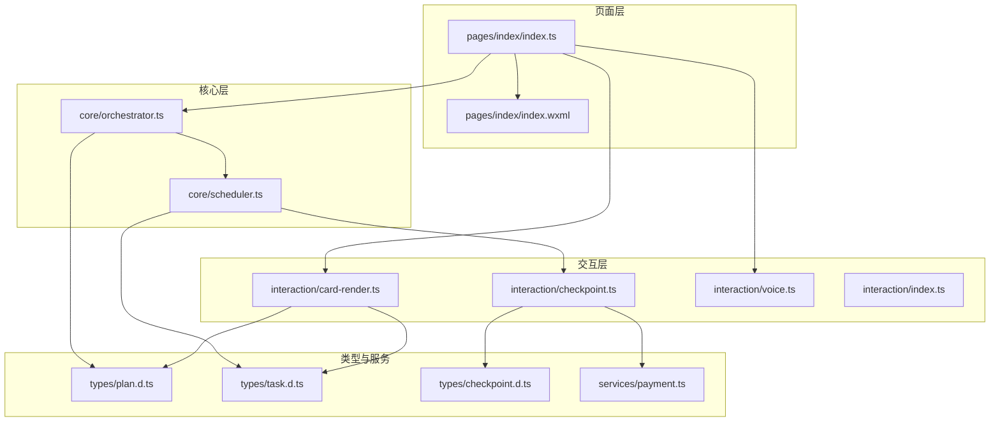
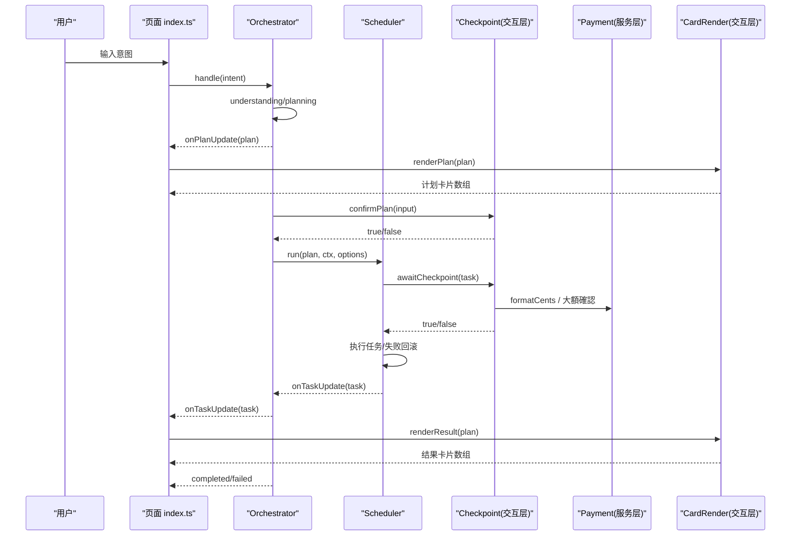
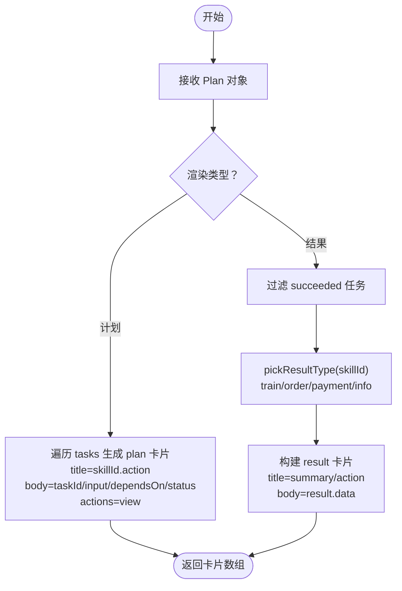
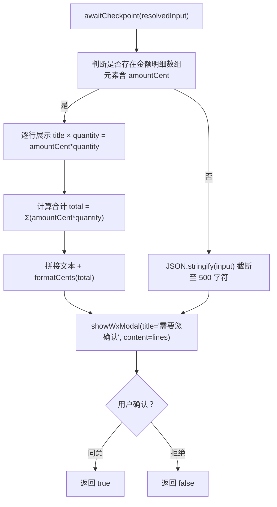
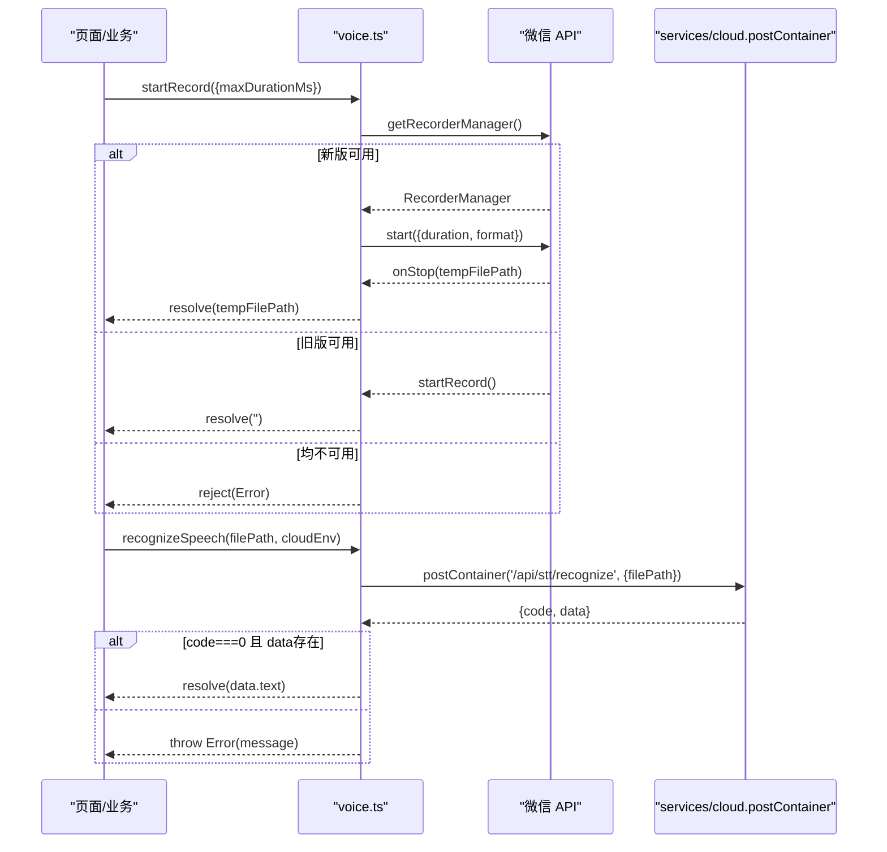
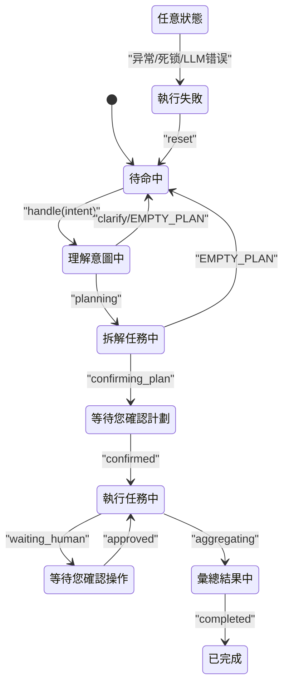
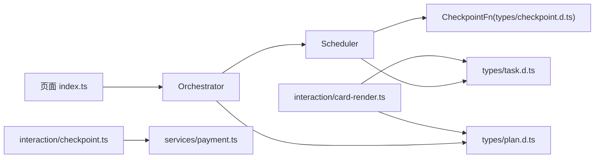

# 交互层设计

<cite>
**本文引用的文件**   
- [card-render.ts](file://miniprogram/src/interaction/card-render.ts)
- [checkpoint.ts](file://miniprogram/src/interaction/checkpoint.ts)
- [voice.ts](file://miniprogram/src/interaction/voice.ts)
- [index.ts（交互层入口）](file://miniprogram/src/interaction/index.ts)
- [index.ts（首页逻辑）](file://miniprogram/pages/index/index.ts)
- [index.wxml（首页模板）](file://miniprogram/pages/index/index.wxml)
- [orchestrator.ts](file://miniprogram/src/core/orchestrator.ts)
- [scheduler.ts](file://miniprogram/src/core/scheduler.ts)
- [checkpoint.d.ts](file://miniprogram/src/types/checkpoint.d.ts)
- [plan.d.ts](file://miniprogram/src/types/plan.d.ts)
- [task.d.ts](file://miniprogram/src/types/task.d.ts)
- [payment.ts](file://miniprogram/src/services/payment.ts)
</cite>

## 目录
1. [引言](#引言)
2. [项目结构](#项目结构)
3. [核心组件](#核心组件)
4. [架构总览](#架构总览)
5. [详细组件分析](#详细组件分析)
6. [依赖关系分析](#依赖关系分析)
7. [性能与体验优化](#性能与体验优化)
8. [故障排查指南](#故障排查指南)
9. [结论](#结论)
10. [附录：扩展指南](#附录扩展指南)

## 引言
本文件面向 WAIC-WeChat-MiniProgram 的交互层，聚焦以下目标：
- 卡片渲染引擎：说明 Plan、结果、错误、订单、支付等卡片的生成规则与数据绑定。
- 检查点确认机制：解释人机协作的关键操作确认流程，包括计划级确认与单步写操作确认。
- 语音交互：说明录音封装、云端 STT 集成方案与降级策略。
- 用户反馈：状态指示、进度显示、错误提示的实现方式。
- 使用示例与扩展：如何新增卡片类型与交互模式。
- 性能优化与最佳实践：从调度、UI 更新、弹窗序列化到降级兜底。

## 项目结构
交互层位于 miniprogram/src/interaction，配合页面层 pages/index 完成 UI 展示；核心编排由 core 层 Orchestrator 与 Scheduler 驱动；类型定义集中在 types；服务层 services 提供支付等能力。

图表来源
- [index.ts（首页逻辑）:117-328](file://miniprogram/pages/index/index.ts#L117-L328)
- [index.wxml（首页模板）:1-77](file://miniprogram/pages/index/index.wxml#L1-L77)
- [card-render.ts:1-53](file://miniprogram/src/interaction/card-render.ts#L1-L53)
- [checkpoint.ts:1-122](file://miniprogram/src/interaction/checkpoint.ts#L1-L122)
- [voice.ts:1-64](file://miniprogram/src/interaction/voice.ts#L1-L64)
- [orchestrator.ts:1-340](file://miniprogram/src/core/orchestrator.ts#L1-L340)
- [scheduler.ts:1-245](file://miniprogram/src/core/scheduler.ts#L1-L245)
- [plan.d.ts:1-51](file://miniprogram/src/types/plan.d.ts#L1-L51)
- [task.d.ts:1-59](file://miniprogram/src/types/task.d.ts#L1-L59)
- [checkpoint.d.ts:1-44](file://miniprogram/src/types/checkpoint.d.ts#L1-L44)
- [payment.ts:1-114](file://miniprogram/src/services/payment.ts#L1-L114)

章节来源
- [index.ts（首页逻辑）:1-329](file://miniprogram/pages/index/index.ts#L1-L329)
- [index.wxml（首页模板）:1-77](file://miniprogram/pages/index/index.wxml#L1-L77)

## 核心组件
- 卡片渲染引擎：将 Plan 与任务结果转换为可渲染的卡片数据结构，供页面层映射为 WXML 卡片。
- 检查点确认机制：提供 Plan 级确认与单步写操作确认，统一通过 wx.showModal 呈现，不可用时安全降级。
- 语音交互：封装录音与云端 STT 调用，兼容旧版 API 并统一通过 services/cloud 访问后端。
- 页面交互：订阅 Orchestrator 事件，实时更新状态栏、对话气泡与任务进度卡片。

章节来源
- [card-render.ts:1-53](file://miniprogram/src/interaction/card-render.ts#L1-L53)
- [checkpoint.ts:1-122](file://miniprogram/src/interaction/checkpoint.ts#L1-L122)
- [voice.ts:1-64](file://miniprogram/src/interaction/voice.ts#L1-L64)
- [index.ts（首页逻辑）:117-328](file://miniprogram/pages/index/index.ts#L117-L328)

## 架构总览
交互层与核心层的协作关系如下：
- 页面层订阅 Orchestrator 的状态与计划/任务事件，负责 UI 展示。
- Orchestrator 负责意图理解、计划生成、计划确认、任务调度、结果聚合与回滚。
- Scheduler 按 DAG 并行执行任务，并在写操作上触发 Checkpoint 确认。
- 交互层 checkpoint 实现通过 wx.showModal 进行人机确认，金额明细格式化与支付二次确认由 payment 服务辅助。
- 卡片渲染引擎将 Plan 与结果转为 UI 卡片 schema，页面层将其映射到 WXML。

图表来源
- [orchestrator.ts:106-256](file://miniprogram/src/core/orchestrator.ts#L106-L256)
- [scheduler.ts:77-128](file://miniprogram/src/core/scheduler.ts#L77-L128)
- [checkpoint.ts:48-122](file://miniprogram/src/interaction/checkpoint.ts#L48-L122)
- [payment.ts:73-109](file://miniprogram/src/services/payment.ts#L73-L109)
- [card-render.ts:21-53](file://miniprogram/src/interaction/card-render.ts#L21-L53)
- [index.ts（首页逻辑）:277-321](file://miniprogram/pages/index/index.ts#L277-L321)

## 详细组件分析

### 卡片渲染引擎
卡片渲染引擎负责把 Plan 与任务结果转换为 UI 可渲染的卡片 schema，支持多种卡片类型：
- plan：计划阶段的任务卡片，包含任务 ID、技能名、动作、摘要、依赖、状态与“查看”操作。
- result：聚合后的结果卡片，根据 skillId 选择 train/order/payment/info 等具体类型。
- error/info：通用错误与信息卡片。

关键行为：
- renderPlan：遍历 plan.tasks，生成 plan 类型卡片，附带 view 操作。
- renderResult：过滤 succeeded 的任务，按 skillId 推断卡片类型，提取 result.data 作为 body。
- pickResultType：根据 skillId 匹配 train/starbucks/coffee/payment 等关键词决定卡片类型。

图表来源
- [card-render.ts:21-53](file://miniprogram/src/interaction/card-render.ts#L21-L53)

章节来源
- [card-render.ts:1-53](file://miniprogram/src/interaction/card-render.ts#L1-L53)
- [plan.d.ts:19-33](file://miniprogram/src/types/plan.d.ts#L19-L33)
- [task.d.ts:29-59](file://miniprogram/src/types/task.d.ts#L29-L59)

### 检查点确认机制
检查点确认机制提供两类确认：
- Plan 级确认：展示意图与任务清单，用户确认后继续执行。
- 单步写操作确认：在 Scheduler 执行前对 requiresHumanConfirm 的任务弹出确认框，展示任务类型、读/写标识与入参明细。

实现要点：
- showWxModal：封装 wx.showModal，不可用时默认拒绝（测试环境降级）。
- confirmPlan：拼接意图与任务列表，含依赖信息，标题带品牌文案。
- awaitCheckpoint：解析 input 中的金额明细（含 amountCent 的数组），逐项展示“品名 × 数量 = 金额”，并汇总合计；非订单参数退化为紧凑 JSON（截断至 500 字符）。
- 金额格式化：复用 payment.formatCents，保证货币显示一致。

图表来源
- [checkpoint.ts:74-122](file://miniprogram/src/interaction/checkpoint.ts#L74-L122)
- [payment.ts:111-114](file://miniprogram/src/services/payment.ts#L111-L114)

章节来源
- [checkpoint.ts:1-122](file://miniprogram/src/interaction/checkpoint.ts#L1-L122)
- [checkpoint.d.ts:17-44](file://miniprogram/src/types/checkpoint.d.ts#L17-L44)
- [payment.ts:37-109](file://miniprogram/src/services/payment.ts#L37-L109)

### 语音交互功能
语音交互模块提供：
- startRecord：优先使用新版 RecorderManager，若不可用则回退到旧版 startRecord；返回录音文件路径或空字符串。
- recognizeSpeech：通过 services/cloud.postContainer 调用云端 STT 接口，统一错误结构与重试（由 services/cloud 负责），返回识别文本。

降级策略：
- 无 getRecorderManager：尝试旧版 startRecord，仅做兜底。
- 无 wx API：reject 错误，避免阻塞主流程。
- STT 失败：抛出错误，上层可捕获并提示用户重试。

图表来源
- [voice.ts:17-64](file://miniprogram/src/interaction/voice.ts#L17-L64)

章节来源
- [voice.ts:1-64](file://miniprogram/src/interaction/voice.ts#L1-L64)

### 用户反馈机制
页面层负责状态指示、进度显示与错误提示：
- 状态指示：顶部状态栏根据 Orchestrator 状态切换中文文案与样式（待命中、理解中、计划中、等待确认、执行中、等待人类、汇总中、已完成、失败、回滚中）。
- 进度显示：onAgentPlanUpdate 生成计划卡片，onAgentTaskUpdate 就地更新任务徽章与错误信息。
- 错误提示：dispatch 捕获异常后追加系统异常消息，并将状态设为 failed；BUSY 时 toast 提示等待当前任务完成。
- 加载态：loading 期间允许继续输入，但发送按钮禁用；底部 loading 气泡显示当前 stateLabel。

图表来源
- [orchestrator.ts:60-71](file://miniprogram/src/core/orchestrator.ts#L60-L71)
- [index.ts（首页逻辑）:87-109](file://miniprogram/pages/index/index.ts#L87-L109)

章节来源
- [index.ts（首页逻辑）:117-328](file://miniprogram/pages/index/index.ts#L117-L328)
- [index.wxml（首页模板）:1-77](file://miniprogram/pages/index/index.wxml#L1-L77)

## 依赖关系分析
- 页面层依赖 Orchestrator 的事件回调，不直接 import core 内部实现，保持松耦合。
- Orchestrator 注入 ConfirmPlanFn 与 CheckpointFn，解耦交互层实现，符合单向依赖规范。
- Scheduler 通过 checkpoint 串行化弹窗，避免并发弹框覆盖导致确认丢失。
- CardRender 依赖 Plan/Task 类型，确保 UI schema 与核心协议一致。
- Checkpoint 依赖 payment.formatCents 与 brand 常量，统一金额与品牌文案。

图表来源
- [orchestrator.ts:28-48](file://miniprogram/src/core/orchestrator.ts#L28-L48)
- [scheduler.ts:27-44](file://miniprogram/src/core/scheduler.ts#L27-L44)
- [checkpoint.d.ts:17-44](file://miniprogram/src/types/checkpoint.d.ts#L17-L44)
- [card-render.ts:9-19](file://miniprogram/src/interaction/card-render.ts#L9-L19)

章节来源
- [orchestrator.ts:1-340](file://miniprogram/src/core/orchestrator.ts#L1-L340)
- [scheduler.ts:1-245](file://miniprogram/src/core/scheduler.ts#L1-L245)
- [checkpoint.d.ts:1-44](file://miniprogram/src/types/checkpoint.d.ts#L1-L44)
- [card-render.ts:1-53](file://miniprogram/src/interaction/card-render.ts#L1-L53)

## 性能与体验优化
- 任务并行执行：Scheduler 使用 Promise.allSettled 并行执行 ready 任务，提升吞吐。
- 弹窗序列化：checkpointChain 保证同一时刻只有一个确认弹窗，避免覆盖与确认丢失。
- 令牌失效保护：runToken 防止 reset 后旧流程继续执行，避免重复下单与交錯彈窗。
- UI 增量更新：onAgentTaskUpdate 仅更新对应卡片 payload，减少全量重绘。
- 自动滚动：scrollIntoView 锚点随新消息自动滚动到底部，提升可读性。
- 降级策略：wx API 不可用时保守拒绝写操作，保障安全性；STT 失败抛错，上层可友好提示。

[本节为通用指导，不直接分析具体文件]

## 故障排查指南
常见问题与定位建议：
- 无法弹出确认框：检查 wx.showModal 是否可用；若无 API，交互层会默认拒绝，需确认运行环境。
- 任务卡死：Scheduler 检测死锁抛出 SchedulerDeadlockError，Orchestrator 捕获后进入 failed 并提示重新描述。
- LLM 规划失败：PlannerLLMError 被捕获，返回 LLM_ERROR 状态码与错误消息。
- 语音识别失败：recognizeSpeech 抛出错误，检查云端 STT 接口与网络状况。
- 支付未成功：payWithAICard 返回 success=false 与 errorMessage，检查 wx.requestPayment 与高额二次确认。

章节来源
- [scheduler.ts:46-52](file://miniprogram/src/core/scheduler.ts#L46-L52)
- [orchestrator.ts:222-254](file://miniprogram/src/core/orchestrator.ts#L222-L254)
- [voice.ts:56-64](file://miniprogram/src/interaction/voice.ts#L56-L64)
- [payment.ts:73-109](file://miniprogram/src/services/payment.ts#L73-L109)

## 结论
交互层以 Orchestrator 与 Scheduler 为核心，结合卡片渲染引擎与检查点确认机制，实现了从意图理解到任务执行的完整闭环。页面层通过事件订阅实时反馈状态与进度，语音交互提供录音与 STT 集成，支付服务确保交易安全与合规。整体架构遵循单向依赖与降级兜底原则，具备良好的可扩展性与健壮性。

[本节为总结，不直接分析具体文件]

## 附录：扩展指南

### 添加新的卡片类型
步骤：
- 在 card-render.ts 的 RenderCard.type 中添加新类型值。
- 在 pickResultType 中增加 skillId 匹配规则，返回新类型。
- 在页面层 index.wxml 中为新类型添加样式与展示逻辑。
- 在 index.ts 的 onAgentPlanUpdate/onAgentTaskUpdate 中映射新类型的 payload 字段。

章节来源
- [card-render.ts:11-19](file://miniprogram/src/interaction/card-render.ts#L11-L19)
- [card-render.ts:48-53](file://miniprogram/src/interaction/card-render.ts#L48-L53)
- [index.wxml（首页模板）:22-33](file://miniprogram/pages/index/index.wxml#L22-L33)
- [index.ts（首页逻辑）:277-321](file://miniprogram/pages/index/index.ts#L277-L321)

### 添加新的交互模式
步骤：
- 在 checkpoint.ts 中新增确认函数（如 awaitPaymentConfirm），封装 wx.showModal 与金额明细格式化。
- 在 OrchestratorOptions 中注入新的回调函数类型（参考 ConfirmPlanFn/CheckpointFn）。
- 在 Scheduler 或 Orchestrator 中调用新回调，处理特定场景的人机协作。
- 在页面层订阅相关事件，展示对应的交互提示与状态。

章节来源
- [checkpoint.ts:21-46](file://miniprogram/src/interaction/checkpoint.ts#L21-L46)
- [checkpoint.d.ts:29-44](file://miniprogram/src/types/checkpoint.d.ts#L29-L44)
- [orchestrator.ts:28-48](file://miniprogram/src/core/orchestrator.ts#L28-L48)