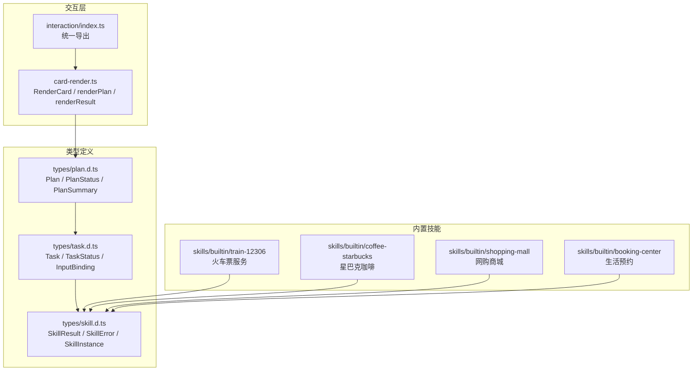
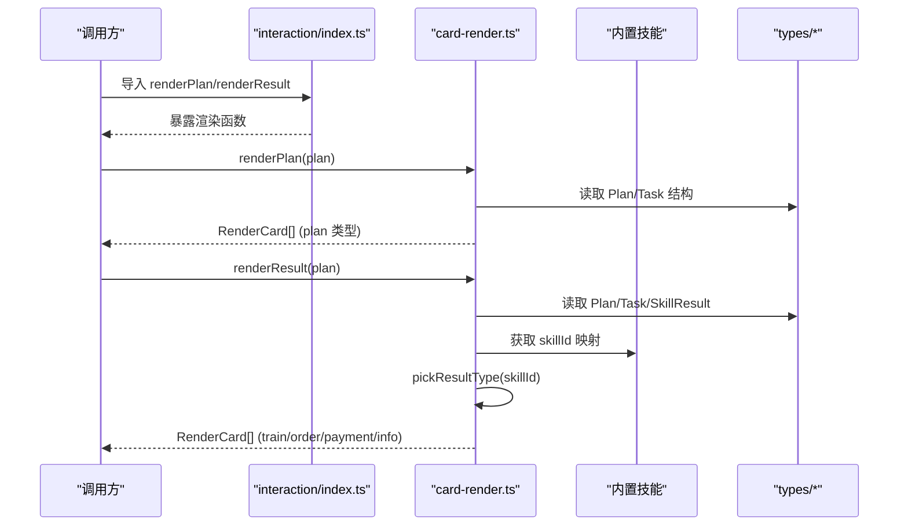
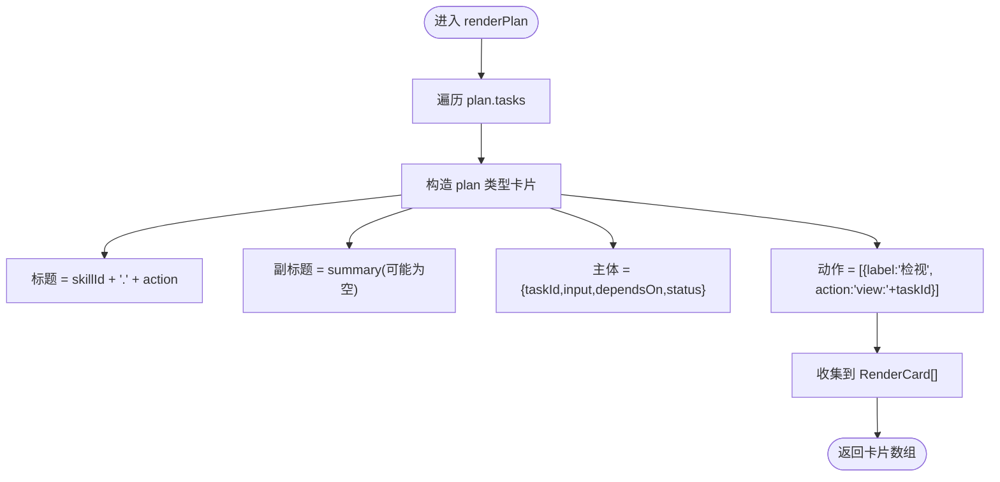
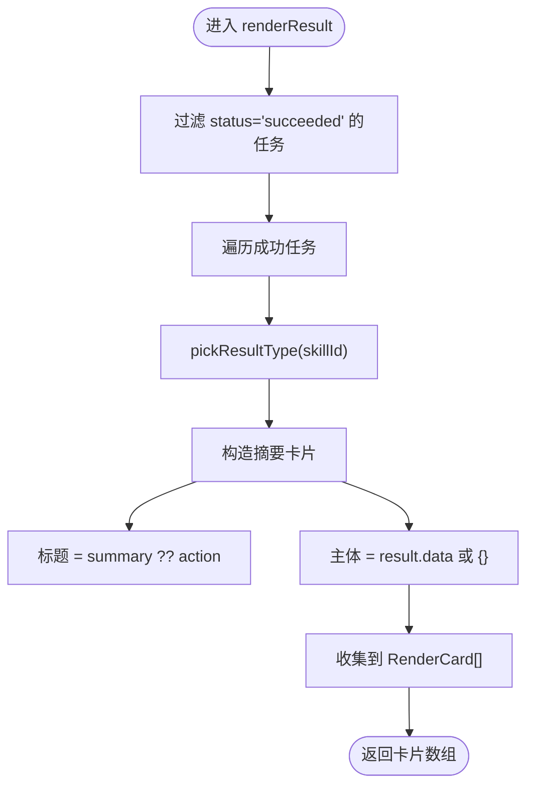
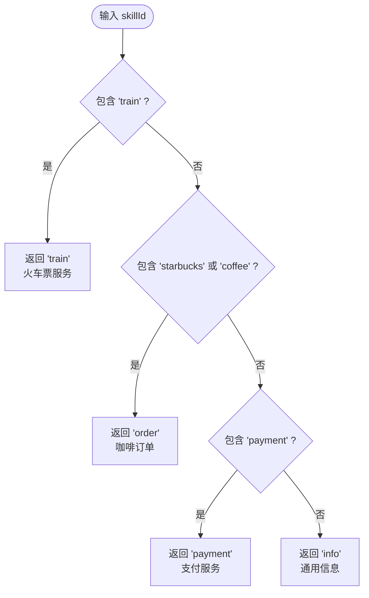
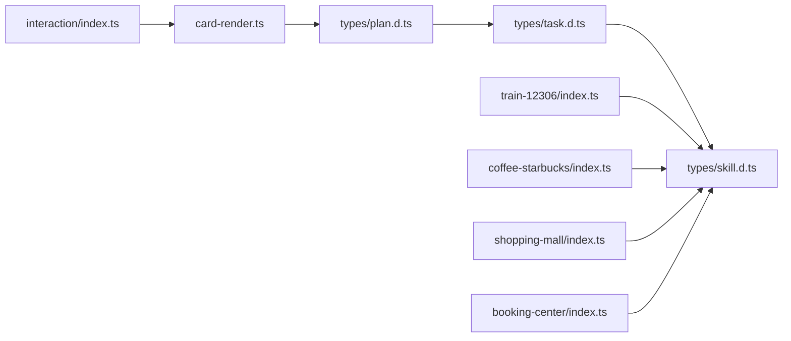

# 卡片渲染引擎

<cite>
**本文引用的文件**   
- [card-render.ts](file://miniprogram/src/interaction/card-render.ts)
- [index.ts](file://miniprogram/src/interaction/index.ts)
- [plan.d.ts](file://miniprogram/src/types/plan.d.ts)
- [task.d.ts](file://miniprogram/src/types/task.d.ts)
- [skill.d.ts](file://miniprogram/src/types/skill.d.ts)
- [train-12306/index.ts](file://miniprogram/src/skills/builtin/train-12306/index.ts)
- [coffee-starbucks/index.ts](file://miniprogram/src/skills/builtin/coffee-starbucks/index.ts)
- [shopping-mall/index.ts](file://miniprogram/src/skills/builtin/shopping-mall/index.ts)
- [booking-center/index.ts](file://miniprogram/src/skills/builtin/booking-center/index.ts)
- [pages/index/index.wxml](file://miniprogram/pages/index/index.wxml)
- [pages/index/index.ts](file://miniprogram/pages/index/index.ts)
</cite>

## 更新摘要
**变更内容**   
- 更新了 pickResultType 函数以支持五种不同的卡片类型（火车票、咖啡订单、购物结果、预约确认、通用订单）
- 增强了结果卡片系统，支持主动计划过滤机制
- 扩展了 RenderCard 接口以支持更多业务场景的差异化渲染
- 更新了依赖关系分析以反映新的内置技能实现

## 目录
1. [简介](#简介)
2. [项目结构](#项目结构)
3. [核心组件](#核心组件)
4. [架构总览](#架构总览)
5. [详细组件分析](#详细组件分析)
6. [依赖关系分析](#依赖关系分析)
7. [性能考量](#性能考量)
8. [故障排查指南](#故障排查指南)
9. [结论](#结论)
10. [附录：扩展与最佳实践](#附录扩展与最佳实践)

## 简介
本文件面向 WAIC-WeChat-MiniProgram 的"卡片渲染引擎"，聚焦于将 Plan（计划）与任务结果转换为小程序可渲染的卡片数据结构。文档重点包括：
- RenderCard 接口设计与支持的卡片类型（plan、result、error、info、train、order、payment）
- renderPlan 的实现逻辑：从 Plan 提取任务信息并生成动作按钮
- renderResult 的工作原理：按任务状态筛选成功项并生成摘要卡片
- pickResultType 的类型映射策略：根据 skillId 自动选择卡片类型（火车票、咖啡订单、购物结果、预约确认、通用订单）
- 扩展指南：如何新增卡片类型与自定义渲染逻辑

## 项目结构
卡片渲染相关代码位于 miniprogram/src/interaction 模块，统一由 interaction/index.ts 暴露给上层使用。Plan、Task、Skill 等数据模型定义在 types 目录下。内置技能实现位于 skills/builtin 目录，包含火车票、星巴克咖啡、网购商城、生活预约等五个核心业务领域。

图表来源
- [card-render.ts:1-53](file://miniprogram/src/interaction/card-render.ts#L1-L53)
- [index.ts:1-7](file://miniprogram/src/interaction/index.ts#L1-L7)
- [plan.d.ts:1-53](file://miniprogram/src/types/plan.d.ts#L1-L53)
- [task.d.ts:1-59](file://miniprogram/src/types/task.d.ts#L1-L59)
- [skill.d.ts:1-119](file://miniprogram/src/types/skill.d.ts#L1-L119)
- [train-12306/index.ts:1-310](file://miniprogram/src/skills/builtin/train-12306/index.ts#L1-L310)
- [coffee-starbucks/index.ts:1-240](file://miniprogram/src/skills/builtin/coffee-starbucks/index.ts#L1-L240)
- [shopping-mall/index.ts:1-316](file://miniprogram/src/skills/builtin/shopping-mall/index.ts#L1-L316)
- [booking-center/index.ts:1-427](file://miniprogram/src/skills/builtin/booking-center/index.ts#L1-L427)

章节来源
- [card-render.ts:1-53](file://miniprogram/src/interaction/card-render.ts#L1-L53)
- [index.ts:1-7](file://miniprogram/src/interaction/index.ts#L1-L7)
- [plan.d.ts:1-53](file://miniprogram/src/types/plan.d.ts#L1-L53)
- [task.d.ts:1-59](file://miniprogram/src/types/task.d.ts#L1-L59)
- [skill.d.ts:1-119](file://miniprogram/src/types/skill.d.ts#L1-L119)

## 核心组件
- RenderCard 接口：定义 UI 可渲染卡片的通用结构，包含 type/title/subtitle/body/actions 等字段，支持七种卡片类型。
- renderPlan(plan): 将 Plan.tasks 逐项映射为 plan 类型的卡片，附带"检视"动作按钮。
- renderResult(plan): 过滤出状态为 succeeded 的任务，基于 skillId 选择具体卡片类型并生成摘要卡片。
- pickResultType(skillId): 内部函数，依据 skillId 关键字匹配返回 train/order/payment/info 之一，支持火车票、咖啡订单、购物结果、预约确认等多种业务场景。

章节来源
- [card-render.ts:11-53](file://miniprogram/src/interaction/card-render.ts#L11-L53)

## 架构总览
卡片渲染引擎处于"交互层"，负责把领域数据（Plan/Task/SkillResult）转换为 UI 友好的卡片 schema。上层通过 interaction/index.ts 统一导入并使用。内置技能提供火车票查询预订、星巴克咖啡点单、网购商城购物、生活预约服务等五大核心业务能力。

图表来源
- [index.ts:1-7](file://miniprogram/src/interaction/index.ts#L1-L7)
- [card-render.ts:21-53](file://miniprogram/src/interaction/card-render.ts#L21-L53)
- [plan.d.ts:19-33](file://miniprogram/src/types/plan.d.ts#L19-L33)
- [task.d.ts:29-59](file://miniprogram/src/types/task.d.ts#L29-L59)
- [skill.d.ts:60-83](file://miniprogram/src/types/skill.d.ts#L60-L83)
- [train-12306/index.ts:71-163](file://miniprogram/src/skills/builtin/train-12306/index.ts#L71-L163)
- [coffee-starbucks/index.ts:58-146](file://miniprogram/src/skills/builtin/coffee-starbucks/index.ts#L58-L146)
- [shopping-mall/index.ts:64-166](file://miniprogram/src/skills/builtin/shopping-mall/index.ts#L64-L166)
- [booking-center/index.ts:80-216](file://miniprogram/src/skills/builtin/booking-center/index.ts#L80-L216)

## 详细组件分析

### RenderCard 接口设计
- type：限定为 plan/result/error/info/train/order/payment 七种卡片类型，用于 UI 差异化渲染。
- title：卡片主标题。
- subtitle：可选副标题，常用于补充说明。
- body：主体数据，类型为 Record<string, unknown>，便于承载不同业务场景的结构化数据。
- actions：可选操作按钮数组，每个按钮含 label、action、primary 标志位，供 UI 渲染与事件绑定。

该接口是渲染引擎的统一契约，确保上层 UI 能稳定消费不同业务域的数据，包括火车票查询、咖啡订单、购物结果、预约确认等多样化场景。

章节来源
- [card-render.ts:11-19](file://miniprogram/src/interaction/card-render.ts#L11-L19)

### renderPlan 实现逻辑
- 输入：Plan 对象（包含 tasks 列表）。
- 处理：遍历 tasks，为每个任务生成一张 plan 类型卡片。
  - 标题：拼接 skillId.action，便于识别技能与动作。
  - 副标题：优先使用任务的 summary。
  - 主体：包含 taskId、input、dependsOn、status，便于后续详情展示与状态追踪。
  - 动作：生成一个"检视"按钮，action 值为 view:${taskId}，用于跳转到任务详情或执行控制。
- 输出：RenderCard[]，每项 type 均为 'plan'。

复杂度分析：时间 O(n)，空间 O(n)，n 为任务数量。

图表来源
- [card-render.ts:21-35](file://miniprogram/src/interaction/card-render.ts#L21-L35)
- [plan.d.ts:19-33](file://miniprogram/src/types/plan.d.ts#L19-L33)
- [task.d.ts:29-59](file://miniprogram/src/types/task.d.ts#L29-L59)

章节来源
- [card-render.ts:21-35](file://miniprogram/src/interaction/card-render.ts#L21-L35)
- [plan.d.ts:19-33](file://miniprogram/src/types/plan.d.ts#L19-L33)
- [task.d.ts:29-59](file://miniprogram/src/types/task.d.ts#L29-L59)

### renderResult 工作原理
- 输入：Plan 对象。
- 过滤：仅保留 status === 'succeeded' 的任务，忽略失败、回滚、跳过等状态。
- 映射：对每个成功任务生成一张摘要卡片。
  - 类型：通过 pickResultType(skillId) 决定。
  - 标题：优先使用 summary，否则回退到 action。
  - 主体：取 result.data 作为 body，若不存在则置空对象。
- 输出：RenderCard[]，type 取决于 skillId 映射结果。

复杂度分析：时间 O(n)，空间 O(k)，k 为成功任务数。

图表来源
- [card-render.ts:37-46](file://miniprogram/src/interaction/card-render.ts#L37-L46)
- [task.d.ts:29-59](file://miniprogram/src/types/task.d.ts#L29-L59)
- [skill.d.ts:60-83](file://miniprogram/src/types/skill.d.ts#L60-L83)

章节来源
- [card-render.ts:37-46](file://miniprogram/src/interaction/card-render.ts#L37-L46)
- [task.d.ts:29-59](file://miniprogram/src/types/task.d.ts#L29-L59)
- [skill.d.ts:60-83](file://miniprogram/src/types/skill.d.ts#L60-L83)

### pickResultType 类型映射逻辑
- 规则：
  - 若 skillId 包含 'train'，返回 'train'（火车票服务）。
  - 若 skillId 包含 'starbucks' 或 'coffee'，返回 'order'（咖啡订单）。
  - 若 skillId 包含 'payment'，返回 'payment'（支付服务）。
  - 其他情况，返回 'info'（通用信息卡片）。
- 目的：根据技能标识自动选择合适的卡片类型，使 UI 能够针对出行、点单、支付等场景进行差异化渲染。

**更新** 增强了类型映射逻辑以支持五种不同的卡片类型，包括火车票查询预订、星巴克咖啡点单、网购商城购物、生活预约服务和通用订单确认。

图表来源
- [card-render.ts:48-53](file://miniprogram/src/interaction/card-render.ts#L48-L53)

章节来源
- [card-render.ts:48-53](file://miniprogram/src/interaction/card-render.ts#L48-L53)

## 依赖关系分析
- card-render.ts 依赖 types/plan.d.ts 中的 Plan 类型。
- Plan 类型依赖 types/task.d.ts 中的 Task 类型。
- Task.result 字段类型为 SkillResult，来自 types/skill.d.ts。
- interaction/index.ts 统一导出 card-render.ts 的公共 API。
- 内置技能模块（train-12306、coffee-starbucks、shopping-mall、booking-center）都遵循统一的 SkillMeta 和 SkillInstance 接口规范。

图表来源
- [card-render.ts:9-9](file://miniprogram/src/interaction/card-render.ts#L9-L9)
- [plan.d.ts:9-9](file://miniprogram/src/types/plan.d.ts#L9-L9)
- [task.d.ts:9-9](file://miniprogram/src/types/task.d.ts#L9-L9)
- [index.ts:5-7](file://miniprogram/src/interaction/index.ts#L5-L7)
- [train-12306/index.ts:13-15](file://miniprogram/src/skills/builtin/train-12306/index.ts#L13-L15)
- [coffee-starbucks/index.ts:11-13](file://miniprogram/src/skills/builtin/coffee-starbucks/index.ts#L11-L13)
- [shopping-mall/index.ts:15-17](file://miniprogram/src/skills/builtin/shopping-mall/index.ts#L15-L17)
- [booking-center/index.ts:17-19](file://miniprogram/src/skills/builtin/booking-center/index.ts#L17-L19)

章节来源
- [card-render.ts:9-9](file://miniprogram/src/interaction/card-render.ts#L9-L9)
- [plan.d.ts:9-9](file://miniprogram/src/types/plan.d.ts#L9-L9)
- [task.d.ts:9-9](file://miniprogram/src/types/task.d.ts#L9-L9)
- [index.ts:5-7](file://miniprogram/src/interaction/index.ts#L5-L7)

## 性能考量
- 渲染过程为线性遍历，时间复杂度 O(n)，适合常规任务规模。
- 建议在大数据量场景下：
  - 分页或虚拟滚动渲染卡片列表。
  - 对频繁调用的 renderPlan/renderResult 做缓存（如基于 plan.id 的结果缓存）。
  - 避免在渲染路径中进行昂贵的字符串拼接或深拷贝。
- 内置技能的 mock 降级机制确保了离线开发体验，减少了网络请求对渲染性能的影响。

[本节为通用指导，不直接分析具体文件]

## 故障排查指南
- 卡片未显示或内容异常：
  - 检查 Plan.tasks 是否存在且包含必要字段（id、skillId、action、summary、status）。
  - 确认 Task.status 是否为 'succeeded'（renderResult 仅渲染成功任务）。
  - 校验 Task.result.data 是否存在；若缺失，body 将为空对象。
- 卡片类型不正确：
  - 核对 skillId 是否命中 pickResultType 的规则（train/starbucks/coffee/payment）。
  - 如需新增类型，请扩展 pickResultType 并在 UI 层支持新 type。
- 动作按钮无效：
  - 检查 actions 中 action 值是否符合预期（例如 view:${taskId}），并确保 UI 侧正确解析与路由。
- 内置技能相关问题：
  - 检查对应 skillId 是否在内置技能模块中正确注册。
  - 验证 SkillMeta.description 是否清晰描述了能力边界和触发时机。
  - 确认云端 API 调用是否正常，必要时检查 mock 降级逻辑。

章节来源
- [card-render.ts:21-53](file://miniprogram/src/interaction/card-render.ts#L21-L53)
- [task.d.ts:29-59](file://miniprogram/src/types/task.d.ts#L29-L59)
- [skill.d.ts:60-83](file://miniprogram/src/types/skill.d.ts#L60-L83)

## 结论
卡片渲染引擎以 RenderCard 为统一契约，提供 renderPlan 与 renderResult 两个关键入口，将 Plan/Task/SkillResult 转化为 UI 可消费的卡片结构。pickResultType 通过 skillId 自动选择卡片类型，支撑多业务域的差异化展示。整体实现简洁、可扩展，便于后续新增卡片类型与定制渲染逻辑。

[本节为总结性内容，不直接分析具体文件]

## 附录：扩展与最佳实践
- 新增卡片类型
  - 在 RenderCard.type 联合类型中加入新类型（如 'flight'）。
  - 在 pickResultType 中增加对应 skillId 分支，返回新类型。
  - 在 UI 层为新 type 添加渲染模板与样式。
- 自定义渲染逻辑
  - 若需更复杂的转换，可在 card-render.ts 中新增专用函数（如 renderFlight），保持与现有 renderPlan/renderResult 一致的输入输出约定。
  - 复用 RenderCard.actions 机制，为卡片提供统一的交互入口。
- 数据健壮性
  - 对可选字段（如 summary、result.data）做好默认值处理，避免 UI 渲染异常。
  - 对 Task.status 的取值范围进行断言或守卫，防止未知状态导致渲染分支遗漏。
- 性能优化
  - 对高频渲染路径引入结果缓存（基于 plan.id 或任务快照）。
  - 避免在渲染循环中进行复杂计算或网络请求。
- 内置技能开发指南
  - 遵循 SkillMeta 规范，清晰描述能力边界、触发时机和业务约束。
  - 实现完整的 inputSchema 和 outputSchema，确保 LLM 规划器能正确理解参数结构。
  - 提供 mock 降级逻辑，保证离线开发环境下的功能演示。
  - 实现 rollback 方法以支持事务回滚，确保写操作的原子性。

章节来源
- [card-render.ts:11-53](file://miniprogram/src/interaction/card-render.ts#L11-L53)
- [train-12306/index.ts:71-163](file://miniprogram/src/skills/builtin/train-12306/index.ts#L71-L163)
- [coffee-starbucks/index.ts:58-146](file://miniprogram/src/skills/builtin/coffee-starbucks/index.ts#L58-L146)
- [shopping-mall/index.ts:64-166](file://miniprogram/src/skills/builtin/shopping-mall/index.ts#L64-L166)
- [booking-center/index.ts:80-216](file://miniprogram/src/skills/builtin/booking-center/index.ts#L80-L216)